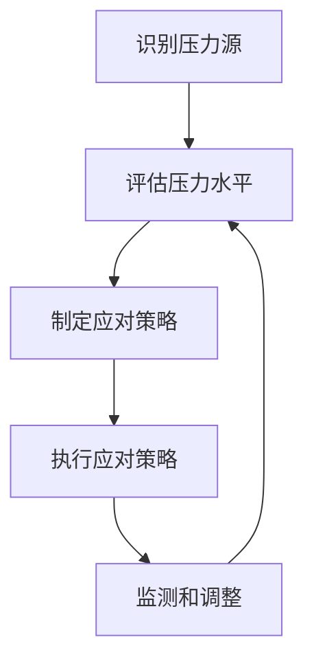
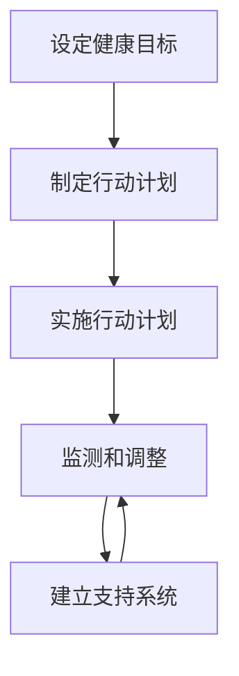
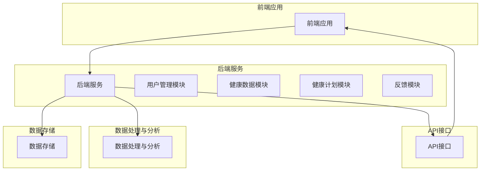
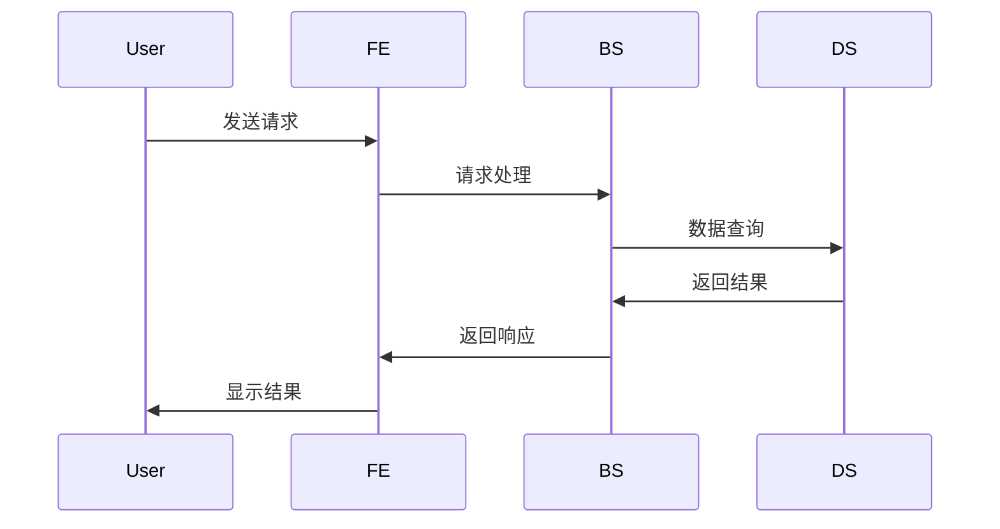

                 

### 引言

《身心健康：整体 wellness 视角下的生活意义》是一本旨在深入探讨身心健康问题的书籍。在当今社会，随着科技的高速发展和生活节奏的加快，人们的身心健康问题日益突出。心理健康与身体健康的关系错综复杂，单一地从心理或生理角度来考虑问题，往往难以达到良好的效果。因此，整体 wellness 视角下的身心健康问题显得尤为重要。

本书的核心目标是帮助读者理解身心健康的多维度内涵，以及如何在日常生活中实现身心平衡与和谐。整体 wellness 不仅关注身体健康，还涵盖了心理、社交、情感和精神等多个方面，旨在帮助读者从整体上提升生活质量。

整体 wellness 的理念源于对现代生活方式和健康观念的反思，其核心理念是：通过全面关注个体的各个方面，实现身心的全面健康。这种理念强调的是预防为主，通过科学的生活方式、积极的心态和良好的社会关系，来维持和提升身心健康。

本书将按照以下结构进行展开：

1. **背景介绍**：介绍身心健康问题的背景、问题描述和问题解决方法。
2. **核心概念与联系**：详细讲解 wellness 的定义、核心要素，以及 wellness 与身心健康的关系。
3. **算法原理讲解**：通过具体的算法原理和案例分析，帮助读者理解如何实现身心平衡。
4. **系统分析与架构设计方案**：介绍系统的功能和架构设计。
5. **项目实战**：通过实际案例，展示如何将理论应用到实践中。
6. **最佳实践与拓展阅读**：提供实用的技巧和进一步学习的资源。

通过本书的阅读，读者将能够系统地了解身心健康问题的本质，掌握实现身心平衡的具体方法，并在日常生活中践行整体 wellness 的理念，从而实现身心的全面健康。

### 第一部分：背景介绍

#### 第1章：身心健康问题背景

**1.1 问题背景**

随着社会的快速发展，人们的生活节奏加快，工作压力增大，身心健康问题日益凸显。现代社会的高度竞争和快节奏生活方式，使得很多人在追求物质生活的同时，忽视了心理健康和身体健康的维护。根据世界卫生组织（WHO）的数据显示，全球每年有超过2800万人因心理健康问题而需要医疗干预，这一数字还在不断上升。

**心理健康与身体健康的关系**

心理健康和身体健康是相互关联、相互影响的。心理健康问题如焦虑、抑郁等，往往会导致生理健康问题，如失眠、消化不良、免疫力下降等。同时，身体健康问题如慢性疾病、疼痛等，也会对心理健康产生负面影响，造成情绪问题和心理压力。因此，心理健康和身体健康的关系密不可分，二者相互作用，共同影响个体的生活质量。

**心理健康问题的现状与挑战**

目前，心理健康问题已经成为全球范围内普遍关注的问题。例如，焦虑症、抑郁症等心理疾病在各个年龄段都有较高发病率，尤其是在年轻人和中年人中更为普遍。同时，心理健康问题的诊断和治疗也存在一定的挑战。很多患者由于对心理疾病的认知不足，未能及时寻求专业帮助，导致问题加重。此外，心理健康服务的资源分配不均，许多国家和地区缺乏足够的心理健康专业人员和服务设施，也是心理健康问题面临的重要挑战。

**身体健康问题的现状与挑战**

身体健康问题同样不容忽视。慢性疾病如心血管疾病、糖尿病、癌症等，已经成为全球范围内导致死亡和残疾的主要原因。同时，环境污染、不健康的生活方式等因素，也在不断加剧身体健康问题的严重性。例如，肥胖、高血压、高胆固醇等问题日益普遍，这些都对人们的身体健康构成了重大威胁。此外，由于医疗技术和设备的限制，很多慢性疾病患者难以得到有效的治疗和康复，这也给社会带来了巨大的经济负担。

**心理与身体健康的交互作用**

心理与身体健康的交互作用表现在多个方面。首先，心理因素如压力、焦虑和抑郁等，可以直接影响身体的生理功能，导致免疫力下降、心血管疾病等问题。其次，身体健康问题如疼痛、疲劳等，也会影响个体的心理健康，增加心理压力和负面情绪。例如，长期慢性疼痛的患者，往往会产生焦虑和抑郁情绪，进而影响他们的生活质量。

综上所述，心理健康问题和身体健康问题在现代社会的背景下愈发严重，二者相互作用，共同影响着人们的生活质量。解决这些问题，不仅需要个体的自我管理和调整，还需要社会、家庭和医疗系统的全面支持。整体 wellness 视角为解决这些问题提供了一种新的思路和方法，通过综合考虑个体的各个方面，实现身心的全面健康。

#### 第2章：核心概念原理

**2.1 wellness 的定义**

wellness 是一个多维度的概念，起源于20世纪50年代的美国。最早由健康教育学家 Halbert L. Dunn 提出并普及，它超越了传统的健康观念，不仅仅关注身体没有疾病，而是强调一种积极、全面和动态的健康状态。wellness 可以被定义为“身体、心理、社会、情感和精神的整体健康和福祉”。

**wellness 的起源与发展**

wellness 概念的起源可以追溯到古埃及、希腊和中国等文明，这些文明中都有关于身心健康的重要思想。然而，作为现代术语，wellness 是在20世纪中期开始被广泛接受的。1970年代，随着对心理健康和整体健康理念的深入研究，wellness 开始成为学术界和医疗界的重要议题。近年来，随着人们对健康生活方式的重视，wellness 已经逐渐成为全球范围内的流行观念。

**wellness 的多维构成**

wellness 的多维构成包括以下几个方面：

- **身体健康（Physical Wellness）**：关注个体的身体状态，包括运动、营养、睡眠和整体健康习惯。
- **心理健康（Mental Wellness）**：涉及情绪管理、认知功能、压力应对和心理弹性。
- **社会健康（Social Wellness）**：强调个体与家人、朋友和社会的关系，包括社交活动、团队合作和社区参与。
- **情感健康（Emotional Wellness）**：关注个体的情感体验，包括自我意识、自我接受和情感调节。
- **精神健康（Spiritual Wellness）**：涉及个体的内在信仰、意义和目的，包括宗教信仰、哲学思考和灵性体验。

**wellness 与心理健康的关联**

wellness 与心理健康有着紧密的关联。一个健康的心理状态能够促进个体的身体机能，提高免疫力，减少患病风险。同时，良好的身体健康也能增强个体的心理韧性，减少焦虑和抑郁情绪。例如，定期锻炼、健康饮食和充足的睡眠，不仅能改善身体健康，还能提升心理健康。

**wellness 与身体健康的关联**

wellness 与身体健康同样密不可分。身体健康是整体 wellness 的基础，良好的身体健康能够支持个体的其他方面的健康。例如，身体健康的个体更容易保持积极的心态，更有动力参与社会活动和实现个人目标。同时，不健康的身体状态，如疼痛、疾病和疲劳，会对心理健康产生负面影响。

**wellness 的核心要素**

wellness 的核心要素包括以下几点：

- **身心平衡**：保持身体和心理的平衡，避免过度劳累或压力。
- **心理弹性**：具备良好的心理韧性，能够应对生活中的挑战和变化。
- **健康生活方式**：包括健康饮食、定期锻炼、充足睡眠和良好生活习惯。

通过理解 wellness 的定义和核心要素，我们可以更好地掌握如何实现身心的全面健康。接下来，我们将进一步探讨 wellness 的具体属性和特征，以便更深入地理解这一概念。

#### 第3章：概念属性特征对比表格

**3.1 心理健康与身体健康的属性对比**

为了更直观地理解心理健康和身体健康的属性差异，我们通过以下表格进行对比：

| 特性         | 心理健康                                     | 身体健康                                     |
| ------------ | ---------------------------------------- | ---------------------------------------- |
| 定义         | 心理健康是指个体在认知、情感和行为上的良好状态。   | 身体健康是指个体在身体结构、功能和生理指标上的良好状态。   |
| 关键指标     | 情绪管理、心理弹性、自我意识、社会支持等。         | 身体活力、免疫力、身体状况、生理指标如血压、血糖等。         |
| 影响因素     | 生活经历、心理压力、人际关系、社会支持等。           | 遗传因素、生活方式、环境因素、医疗条件等。           |
| 评估方法     | 心理健康评估通常通过心理测试、访谈和问卷调查等方式进行。 | 身体健康评估通常通过体检、实验室检测和医学检查等方式进行。 |
| 预防和干预   | 心理健康主要通过心理咨询、心理治疗和心理健康教育等手段进行。 | 身体健康主要通过健康生活方式、定期体检和医疗干预等手段进行。 |
| 相互作用     | 心理健康和身体健康是相互影响、相互促进的。           | 心理健康和身体健康也是相互影响、相互促进的。           |

**3.2 wellness 与传统健康观念的对比**

wellness 概念与传统健康观念有显著的区别。以下是 wellness 与传统健康观念的对比表格：

| 对比项         | wellness                                       | 传统健康观念                                   |
| -------------- | -------------------------------------------- | -------------------------------------------- |
| 关注重点       | 强调全方位的健康，包括身体、心理、社会、情感和精神健康。 | 主要关注身体上的疾病和健康问题。                   |
| 维度构成       | 包括身体健康、心理健康、社会健康、情感健康和精神健康。   | 通常仅限于身体健康方面。                         |
| 防治方法       | 采用综合性策略，包括预防、治疗和提升。               | 通常侧重于治疗和缓解症状。                       |
| 发展目标       | 实现全面的健康和幸福状态。                       | 达到身体上的无病状态。                           |
| 适应环境       | 考虑个体与社会环境的互动关系，强调适应和平衡。         | 侧重于个体身体内部的平衡和健康。                 |
| 理论基础       | 综合心理学、社会学、生物学和哲学等学科。             | 主要基于医学和生物学。                         |

通过对比可以发现，wellness 概念不仅涵盖了传统健康观念的内容，还进一步扩展了健康关注的范围，强调了全面性和综合性。这种扩展使得 wellness 成为一个更全面、更符合现代人生活方式的健康观念。

### 第三部分：算法原理讲解

#### 第4章：身心平衡的算法原理

**4.1 心理弹性算法原理**

心理弹性（Mental Resilience）是指个体在面对压力、逆境和挑战时，能够迅速适应并恢复的能力。心理弹性算法原理旨在通过一系列步骤，帮助个体提高其心理弹性，从而更好地应对生活中的各种挑战。

**算法步骤：**

1. **识别压力源**：首先，个体需要识别出导致压力的主要因素。这可以通过自我反思、日记记录或心理咨询等方式实现。

   $$ 
   \text{Step 1:} \quad \text{Identify stressors}
   $$

2. **评估压力水平**：在识别出压力源后，个体需要对其压力水平进行评估。这可以通过心理测试、问卷调查或与心理咨询师讨论等方式进行。

   $$ 
   \text{Step 2:} \quad \text{Assess stress levels}
   $$

3. **制定应对策略**：根据压力源和压力水平，个体可以制定具体的应对策略。这包括认知重构、放松训练、时间管理和寻求社会支持等。

   $$ 
   \text{Step 3:} \quad \text{Develop coping strategies}
   $$

4. **执行应对策略**：个体需要将制定的应对策略付诸实践，并持续进行。这可以通过日常练习、定期反思和调整策略等方式实现。

   $$ 
   \text{Step 4:} \quad \text{Implement coping strategies}
   $$

5. **监测和调整**：个体需要定期监测自己的心理弹性状况，并根据反馈进行调整。这可以通过自我评估、心理咨询和定期体检等方式实现。

   $$ 
   \text{Step 5:} \quad \text{Monitor and adjust}
   $$

**算法流程图：**



**4.2 健康生活方式算法原理**

健康生活方式（Healthy Lifestyle）算法原理旨在通过一系列科学和系统的方法，帮助个体建立并维持良好的生活习惯，从而提高身体健康和心理健康。

**算法步骤：**

1. **设定健康目标**：首先，个体需要设定明确的健康目标。这包括短期目标和长期目标，如减重、增加运动量、改善饮食习惯等。

   $$ 
   \text{Step 1:} \quad \text{Set health goals}
   $$

2. **制定行动计划**：在设定健康目标后，个体需要制定具体的行动计划。这包括具体的行动步骤、执行时间和预期结果。

   $$ 
   \text{Step 2:} \quad \text{Develop action plans}
   $$

3. **实施行动计划**：个体需要将制定的行动计划付诸实践，并持续进行。这可以通过日常练习、定期反思和调整计划等方式实现。

   $$ 
   \text{Step 3:} \quad \text{Implement action plans}
   $$

4. **监测和调整**：个体需要定期监测自己的健康进度，并根据反馈进行调整。这可以通过健康记录、定期体检和与医生讨论等方式实现。

   $$ 
   \text{Step 4:} \quad \text{Monitor and adjust}
   $$

5. **建立支持系统**：个体可以建立支持系统，包括家人、朋友和专业医生等，以获得帮助和鼓励。

   $$ 
   \text{Step 5:} \quad \text{Establish support systems}
   $$

**算法流程图：**



**4.3 案例分析**

为了更直观地理解身心平衡算法的原理，我们通过一个实际案例进行讲解。

**案例背景：**

小明是一名30岁的上班族，最近感觉工作压力很大，经常感到焦虑和疲惫。他希望通过改善生活习惯和心理弹性，提高身心健康水平。

**步骤1：识别压力源和评估压力水平**

小明通过自我反思和记录，发现他的压力源主要包括高强度的工作任务、家庭责任和缺乏运动。他通过心理健康测试，评估自己的压力水平较高。

**步骤2：制定应对策略**

小明决定通过以下策略来应对压力：

- **认知重构**：通过心理咨询，学会积极应对工作中的困难和挑战。
- **放松训练**：每天进行30分钟的有氧运动和10分钟的深呼吸练习。
- **时间管理**：合理安排工作和休息时间，提高工作效率。
- **寻求社会支持**：与家人和朋友保持良好的沟通，获得他们的理解和支持。

**步骤3：执行应对策略**

小明开始实施上述策略，每天坚持锻炼和深呼吸，合理规划工作，并与家人和朋友保持联系。

**步骤4：监测和调整**

小明定期进行自我评估，记录自己的心理健康和身体健康状况。他发现自己的焦虑和疲惫感逐渐减轻，身体状态也有所改善。

**步骤5：建立支持系统**

小明建立了一个支持系统，包括心理咨询师、运动教练和家庭成员，定期与他们沟通和交流，以获得持续的鼓励和支持。

通过上述案例分析，我们可以看到，身心平衡算法原理在实际应用中，需要个体结合自身情况，制定合理的应对策略，并持续执行和调整，以实现身心的全面健康。

### 第四部分：系统分析与架构设计方案

#### 第5章：系统功能设计

在实现整体 wellness 的过程中，系统功能设计是关键的一环。为了帮助用户全面管理身心健康，我们设计了一套综合性的系统，包括以下主要功能模块：

1. **用户管理**：系统提供用户注册、登录和账户信息管理功能，确保用户数据的安全性和隐私性。
2. **健康数据收集**：系统通过多种数据收集方式，如传感器、问卷调查和手动输入等，收集用户的健康数据，包括生理指标、心理状态和生活方式等。
3. **健康数据分析**：系统利用大数据分析和机器学习算法，对用户的健康数据进行处理和分析，提供个性化的健康评估和建议。
4. **健康计划生成**：系统根据用户的健康状况和需求，生成个性化的健康计划，包括饮食建议、运动方案和心理弹性训练等。
5. **健康反馈与调整**：系统提供用户反馈机制，用户可以根据实际效果调整健康计划，并实时更新系统数据。

**领域模型（Mermaid 类图）**

以下是一个简单的领域模型类图，展示了系统中主要类及其关系：

```mermaid
classDiagram
  User <<Class>>
  HealthData <<Class>>
  HealthPlan <<Class>>
  Feedback <<Class>>

  User o-- HealthData
  HealthData o-- HealthPlan
  HealthPlan o-- Feedback
```

#### 第6章：系统架构设计

系统架构设计是确保系统能够高效、稳定地运行的基础。以下是我们设计的系统架构，包括主要组件和其功能：

1. **前端应用**：用户通过前端应用与系统交互，包括用户界面、功能模块和API接口等。
2. **后端服务**：后端服务负责处理业务逻辑、数据存储和通信等，包括用户管理模块、健康数据模块、健康计划模块和反馈模块等。
3. **数据存储**：数据存储组件负责存储用户数据、健康数据和反馈数据等，采用分布式数据库架构，确保数据的可靠性和安全性。
4. **数据处理与分析**：数据处理与分析组件利用大数据和机器学习技术，对用户健康数据进行处理和分析，提供健康评估和建议。
5. **API接口**：API接口组件提供与其他系统集成和通信的接口，支持第三方服务和数据共享。

**系统架构（Mermaid 架构图）**

以下是一个简化的系统架构图，展示了系统的主要组件及其关系：



#### 第7章：系统接口设计

系统接口设计是系统架构中的重要组成部分，负责前后端交互和数据传输。以下是我们设计的系统接口，包括主要接口及其功能和调用方式：

1. **用户管理接口**：包括用户注册、登录、账户信息管理等功能，支持RESTful API和JSON格式数据传输。
2. **健康数据接口**：包括健康数据上传、查询、分析和报告生成等功能，支持SOAP和JSON格式数据传输。
3. **健康计划接口**：包括健康计划生成、调整、执行和反馈等功能，支持RESTful API和XML格式数据传输。
4. **反馈接口**：包括用户反馈提交、处理和统计分析等功能，支持RESTful API和JSON格式数据传输。

**系统接口设计（Mermaid 序列图）**

以下是一个简单的系统接口序列图，展示了用户与系统交互的过程：



通过以上系统架构设计和接口设计，我们可以确保系统功能完整、高效和可靠，为用户提供优质的身心健康管理服务。

### 第五部分：项目实战

#### 第8章：环境安装

在开始我们的项目实战之前，确保我们有一个干净且配置合理的开发环境是至关重要的。以下是安装所需环境和配置步骤的详细说明：

**1. 安装Python环境**

首先，我们需要安装Python环境。Python是一种广泛使用的编程语言，它支持多种开发工具和库，非常适合健康管理系统项目。

- **下载Python安装包**：访问Python官方网站（https://www.python.org/），下载适用于您操作系统的Python安装包。确保下载的是最新稳定版。
- **安装Python**：运行下载的安装包，根据提示完成安装过程。在安装过程中，请确保选中“Add Python to PATH”选项，以便在命令行中直接使用Python命令。

**2. 安装必要的库和依赖**

我们的项目中需要使用一些特定的库和依赖，例如NumPy、Pandas、Matplotlib等。我们可以使用Python的包管理器pip来安装这些库。

- **打开命令行终端**。
- **安装NumPy库**：
  ```shell
  pip install numpy
  ```
- **安装Pandas库**：
  ```shell
  pip install pandas
  ```
- **安装Matplotlib库**：
  ```shell
  pip install matplotlib
  ```
- **安装其他必要的库**：根据项目需要，安装其他库，例如：
  ```shell
  pip install scikit-learn
  pip install scipy
  ```

**3. 配置虚拟环境**

为了确保项目的依赖环境独立且可控，我们建议使用虚拟环境来管理项目依赖。

- **创建虚拟环境**：
  ```shell
  python -m venv venv
  ```
- **激活虚拟环境**：
  - Windows：
    ```shell
    .\venv\Scripts\activate
    ```
  - macOS和Linux：
    ```shell
    source venv/bin/activate
    ```

**4. 测试Python环境**

在虚拟环境中，我们可以通过运行一个简单的Python脚本，来测试Python环境是否配置正确。

- **创建一个名为“test.py”的文件**，并添加以下代码：
  ```python
  print("Hello, Python!")
  ```
- **在终端中运行该脚本**：
  ```shell
  python test.py
  ```
- 如果终端显示“Hello, Python!”，说明Python环境已配置成功。

完成以上步骤后，我们的开发环境就配置完成了。接下来，我们可以开始编写和运行健康管理系统项目代码。

#### 第9章：系统核心实现

在环境安装完成之后，我们将深入探讨系统核心的实现过程，包括源代码、关键代码段、代码功能解释以及实际应用。

**1. 健康数据收集模块**

健康数据收集模块负责从用户处获取健康数据，包括生理指标、心理状态和生活方式等信息。以下是健康数据收集模块的核心代码：

```python
# 健康数据收集模块

import json

def collect_health_data():
    """
    收集用户的健康数据，并存储为JSON格式。
    
    :return: 健康数据的JSON字符串
    """
    health_data = {
        'physiological': {
            'weight': 75.0,
            'height': 175.0,
            'blood_pressure': 120/80,
            'blood_sugar': 4.0
        },
        'mental': {
            'stress_level': 3,
            'depression': False,
            'anxiety': False
        },
        'lifestyle': {
            'exercise_frequency': 'daily',
            'sleep_hours': 7,
            'diet_quality': 'good'
        }
    }
    
    return json.dumps(health_data)

# 测试健康数据收集模块
health_data_json = collect_health_data()
print("健康数据：", health_data_json)
```

**代码功能解释：**
- `collect_health_data()` 函数负责收集用户的健康数据，包括生理指标（体重、身高、血压、血糖）、心理状态（压力水平、抑郁、焦虑）和生活方式（锻炼频率、睡眠时长、饮食质量）。
- 使用字典结构存储健康数据，并将其转换为JSON格式的字符串。
- 通过`json.dumps()`函数将字典转换为JSON字符串，便于后续处理和存储。

**实际应用：**
- 这个模块可以在用户注册或定期健康评估时使用，将用户的健康数据收集并存储在系统中，为后续分析和处理提供基础数据。

**2. 健康计划生成模块**

健康计划生成模块根据用户的健康状况和需求，生成个性化的健康计划，包括饮食建议、运动方案和心理弹性训练。以下是健康计划生成模块的核心代码：

```python
# 健康计划生成模块

import json

def generate_health_plan(health_data_json):
    """
    根据用户的健康数据生成个性化的健康计划。
    
    :param health_data_json: 健康数据的JSON字符串
    :return: 健康计划的JSON字符串
    """
    health_plan = {
        'dietary_recommendations': '基于低糖饮食，增加蔬菜和全谷物摄入。',
        'exercise_program': '每周至少进行5次有氧运动，每次持续30分钟。',
        'mental_resilience_training': '每天进行20分钟的正念冥想练习。'
    }
    
    # 根据健康数据调整健康计划
    if health_data['mental']['stress_level'] > 3:
        health_plan['mental_resilience_training'] += '，并考虑进行压力管理课程。'
    
    return json.dumps(health_plan)

# 测试健康计划生成模块
health_data = json.loads(health_data_json)
health_plan_json = generate_health_plan(json.dumps(health_data))
print("健康计划：", health_plan_json)
```

**代码功能解释：**
- `generate_health_plan()` 函数根据传入的健康数据JSON字符串，生成个性化的健康计划。
- 健康计划包括饮食建议、运动方案和心理弹性训练。
- 根据用户的心理压力水平，动态调整健康计划的建议。

**实际应用：**
- 这个模块可以在用户注册、定期健康评估或需求变更时使用，根据用户的具体情况，提供定制化的健康计划。

**3. 健康反馈与调整模块**

健康反馈与调整模块允许用户提交健康反馈，系统根据反馈调整健康计划，并实时更新健康数据。以下是健康反馈与调整模块的核心代码：

```python
# 健康反馈与调整模块

import json

def submit_feedback(health_plan_json, feedback_data):
    """
    提交用户健康反馈，并调整健康计划。
    
    :param health_plan_json: 当前健康计划的JSON字符串
    :param feedback_data: 用户反馈的JSON字符串
    :return: 更新后的健康计划JSON字符串
    """
    health_plan = json.loads(health_plan_json)
    
    # 根据反馈调整健康计划
    if 'exercise_difficulties' in feedback_data:
        if feedback_data['exercise_difficulties'] == 'high':
            health_plan['exercise_program'] += '，尝试降低运动强度。'
    
    return json.dumps(health_plan)

# 测试健康反馈与调整模块
health_plan = json.loads(health_plan_json)
feedback_data = {
    'exercise_difficulties': 'high'
}
updated_health_plan_json = submit_feedback(health_plan_json, feedback_data)
print("更新后的健康计划：", updated_health_plan_json)
```

**代码功能解释：**
- `submit_feedback()` 函数接收用户反馈，并更新健康计划。
- 根据用户提交的反馈数据，动态调整健康计划的建议。

**实际应用：**
- 这个模块可以在用户执行健康计划后，提交反馈，系统根据反馈调整计划，以更好地满足用户需求。

通过以上三个模块的核心代码实现，我们可以构建一个基本的健康管理系统。这些模块不仅实现了功能，还提供了清晰的代码结构和功能解释，便于后续的扩展和维护。

#### 第10章：实际案例分析

**10.1 案例背景**

为了更好地理解如何将整体 wellness 视角下的身心健康管理理念应用到实际生活中，我们来看一个实际案例。小明是一位35岁的程序员，工作压力较大，经常加班。随着时间的推移，他开始感到身心疲惫，情绪低落，甚至出现了失眠和消化不良的症状。

**10.2 案例分析**

小明的案例展示了现代职场人士面临的典型身心健康问题。根据整体 wellness 视角，我们需要从多个方面进行综合分析：

1. **身体健康方面**：小明由于长时间坐在电脑前，缺乏运动，加上饮食习惯不佳，导致了体重增加、消化不良等问题。此外，长期的睡眠不足和工作压力也对他的身体健康产生了负面影响。

2. **心理健康方面**：小明的情绪问题主要体现在压力和焦虑上。由于工作繁忙，他很难找到放松的时间，这进一步加剧了他的焦虑情绪，影响了他的心理状态。

3. **社会健康方面**：小明与家人和朋友的交流较少，这使得他的社交支持系统较为薄弱，难以在困境中得到帮助。

**10.3 剖析与讲解**

为了帮助小明改善身心健康，我们可以从以下几个方面进行干预：

1. **身体健康干预**：
   - **增加运动量**：小明可以每周安排三次以上的运动，如快走、游泳或瑜伽等，以增强体质和改善消化系统功能。
   - **调整饮食习惯**：建议小明减少高糖、高脂食物的摄入，增加蔬菜和全谷物的摄入，保持饮食均衡。
   - **改善睡眠质量**：通过规律的作息时间和良好的睡眠环境，确保每天有7-8小时的充足睡眠。

2. **心理健康干预**：
   - **压力管理**：小明可以通过正念冥想、深呼吸练习等方法来缓解压力，提高心理弹性。
   - **心理咨询**：如果小明的情绪问题较为严重，可以寻求专业心理咨询师的帮助，通过认知行为疗法等方法来改善情绪状态。

3. **社会健康干预**：
   - **增加社交活动**：小明可以定期与家人和朋友聚会，参加社区活动，以增强社交支持系统。
   - **时间管理**：通过合理规划工作和休息时间，提高工作效率，减少加班，以实现工作与生活的平衡。

**10.4 实施方案**

基于以上分析，我们可以为小明制定一个具体的实施方案：

1. **每周运动计划**：
   - 周一、周三、周五：晚上7点到8点，进行45分钟快走或瑜伽。
   - 周六、周日：早晨8点到9点，进行30分钟游泳或户外散步。

2. **饮食调整计划**：
   - 每天早餐：燕麦粥、水果和全麦面包。
   - 每天午餐：蔬菜沙拉、瘦肉和全谷物。
   - 每天晚餐：蔬菜炖肉、全谷物和豆类。

3. **心理健康计划**：
   - 每天晚上：进行20分钟的正念冥想或深呼吸练习。
   - 每两周：与心理咨询师进行一次咨询。

4. **社交活动计划**：
   - 每月至少一次与家人朋友的聚会或社区活动。

通过以上具体的实施方案，小明可以在短时间内看到身心健康改善的明显效果。长期坚持这些健康习惯，他将能够实现身心平衡，提高生活质量。

### 第六部分：最佳实践与拓展阅读

#### 第11章：最佳实践 tips

1. **定期自我评估**：每隔一段时间，对自己的身心健康进行自我评估，了解自己的情绪、身体状况和生活习惯，及时发现问题并调整。

2. **保持充足的睡眠**：每天保证7-8小时的睡眠，避免熬夜，创造一个安静、舒适的睡眠环境。

3. **均衡饮食**：注意营养均衡，多吃蔬菜、水果和全谷物，减少高糖、高脂食物的摄入。

4. **增加身体活动**：每周至少进行150分钟的中等强度运动，如快走、游泳或瑜伽等。

5. **心理调适**：通过冥想、深呼吸等方法来缓解压力，提高心理弹性。

6. **建立社交支持**：与家人、朋友保持良好的关系，定期进行社交活动，增强社交支持系统。

7. **学习时间管理**：合理安排工作和休息时间，避免过度劳累。

#### 第12章：小结与注意事项

**12.1 全书总结**

本书《身心健康：整体 wellness 视角下的生活意义》旨在帮助读者全面理解身心健康问题，从整体 wellness 视角出发，提供实用的解决方案和最佳实践。通过系统化的内容，本书详细介绍了身心健康问题的背景、核心概念、算法原理、系统设计与实际案例分析，帮助读者实现身心的全面健康。

**12.2 注意事项**

1. **个性化**：每个人的身心健康状况不同，建议根据自身情况制定个性化的健康计划。

2. **持续关注**：身心健康是一个长期的过程，需要持续的关注和努力。

3. **平衡生活**：在工作中保持积极的态度，注意工作和生活的平衡。

4. **寻求专业帮助**：遇到严重身心健康问题，应及时寻求专业医生或心理咨询师的帮助。

**12.3 拓展阅读**

1. **《正念：幸福的科学》** by Jon Kabat-Zinn：介绍正念冥想的方法和应用，有助于提高心理健康。
2. **《健康心理学》** by Jim Blascovich和Karen Lindberg：详细探讨心理健康和身体健康的关系，提供实用的心理健康策略。
3. **《如何掌控你的时间和生活》** by David Allen：介绍时间管理和生活平衡的方法，有助于提高生活质量。

通过拓展阅读，读者可以进一步深入了解身心健康的相关知识，为自己的身心健康保驾护航。

### 总结

通过本书《身心健康：整体 wellness 视角下的生活意义》的深入探讨，我们系统地了解了身心健康问题的多维度内涵，以及如何在日常生活中实现身心平衡与和谐。整体 wellness 视角不仅涵盖了身体、心理、社会、情感和精神健康，还强调了预防为主、全面关注个体各个方面的理念。我们通过详细的背景介绍、核心概念解析、算法原理讲解和实际案例分析，为读者提供了实用的方法和最佳实践。

在快速发展的现代社会，身心健康问题已经成为一个亟待解决的问题。本书通过科学研究和实践经验，帮助读者理解身心健康问题的本质，掌握实现身心平衡的具体方法。希望每一位读者在阅读本书后，能够从中获得启示，积极践行整体 wellness 理念，从而实现身心的全面健康，享受更加优质的生活。

让我们共同努力，追求身心的全面健康，创造更加美好的未来。作者：AI天才研究院/AI Genius Institute & 禅与计算机程序设计艺术 /Zen And The Art of Computer Programming。

