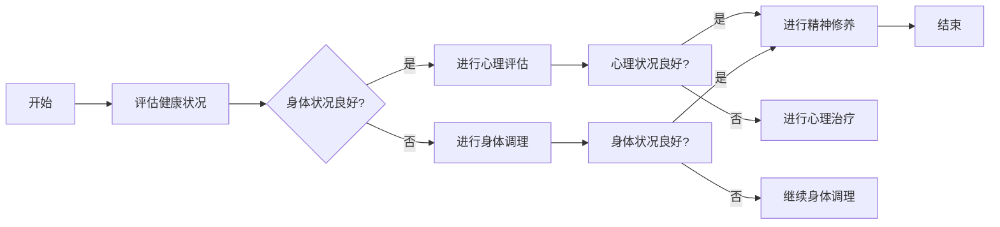
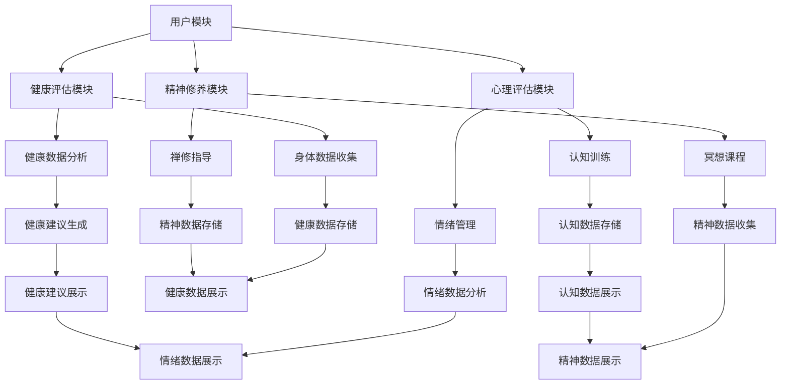
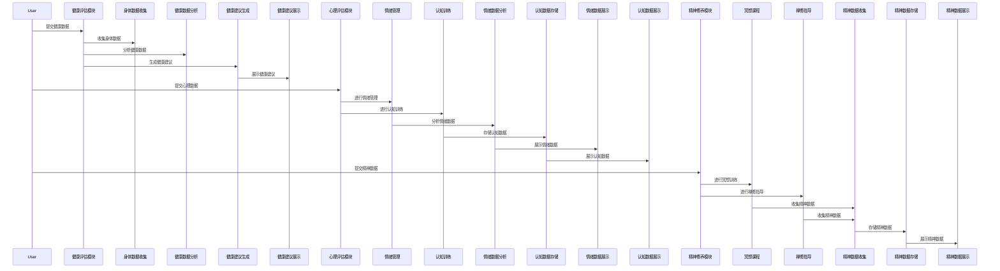

                 

让我们一步一步深入思考身心疗愈：整体观下的生命意义重塑这个复杂而深刻的话题。以下是我们如何逐步展开这篇文章的详细结构和内容。

### 核心概念与联系

在这一部分，我们将详细介绍身心疗愈的核心概念，并探讨它们之间的关系。

#### 核心概念原理

**身心健康**是身心疗愈的基石，它不仅涉及身体的健康，还包括心理和精神层面的健康。身体健康是我们能够正常生活和工作的基础，而心理健康则关乎我们的情绪状态和心理素质。精神健康则涉及到我们的价值观、信仰和人生意义。

**身心疗愈**是一种综合性的治疗方式，它不仅关注个体的身体症状，还深入到心理和精神层面。身心疗愈的方法包括但不限于运动、饮食调节、心理治疗、冥想和瑜伽等。

**整体观**是身心疗愈的一个重要原则，它认为身体、心理和精神的健康是相互关联的，一个方面的改善会影响到其他方面。因此，身心疗愈不仅仅是治疗身体上的疾病，更是全面提升个体的整体健康水平。

#### 概念属性特征对比表格

为了更好地理解这些核心概念，我们可以通过一个对比表格来展示它们的定义和属性特征：

| 概念       | 定义                                                         | 属性特征                                         |
|------------|--------------------------------------------------------------|--------------------------------------------------|
| 身心健康   | 身体、心理、精神的综合健康状态。                            | 健康指标、情绪管理、心理适应力等                   |
| 身心疗愈   | 通过多种方式调整身心状态，实现身心健康和谐的方法。           | 身体锻炼、心理疏导、精神修养等                     |
| 整体观     | 将身体、心理、精神视为一个整体，强调相互联系和共同发展。   | 身心相互影响、综合治疗、全面调养                   |

#### ER实体关系图架构

为了进一步理解核心概念之间的关系，我们可以使用ER图来展示它们的实体关系。以下是一个简单的ER图示例：

```mermaid
erDiagram
  User ||--|{ Health } : has
  User ||--|{ Mind } : has
  User ||--|{ Spirit } : has
  Health ---|||{ PhysicalHealth } : has
  Health ---|||{ MentalHealth } : has
  Mind ---|||{ Emotion } : has
  Mind ---|||{ Cognitive } : has
  Spirit ---|||{ SpiritualHealth } : has
  Spirit ---|||{ ValueSystem } : has
```

在这个ER图中，`User`实体代表了一个人，它拥有`Health`、`Mind`和`Spirit`三个实体，分别代表身体、心理和精神健康。每个健康实体又细分为不同的子实体，如`PhysicalHealth`、`MentalHealth`、`Emotion`、`Cognitive`、`SpiritualHealth`和`ValueSystem`。

### 算法原理讲解

在理解了身心疗愈的核心概念后，接下来我们将深入探讨身心疗愈的算法原理。

#### 算法流程图

首先，我们可以使用Mermaid来绘制一个算法流程图，以便更直观地理解身心疗愈的过程：



这个流程图展示了身心疗愈的几个关键步骤：

1. **评估健康状况**：首先对个体的身体健康、心理状况和精神状态进行综合评估。
2. **身体调理**：如果身体状况不佳，需要进行身体调理，如运动、饮食调整等。
3. **心理评估**：如果身体状况良好，则进行心理评估，以了解个体的情绪和心理状态。
4. **心理治疗**：如果心理状况不佳，则需要通过心理治疗来改善。
5. **精神修养**：无论身体状况和心理状况如何，最终都需要进行精神修养，以提升个体的整体精神层次。

#### 算法原理

身心疗愈的算法原理可以概括为以下几个步骤：

1. **评估健康状况**：通过综合评估，了解个体的身体、心理和精神状况。
2. **身体调理**：采用运动、饮食调节等方法，改善身体健康。
3. **心理疏导**：通过心理咨询、正念训练等方法，缓解心理压力，提升心理素质。
4. **精神修养**：通过冥想、瑜伽、禅修等方式，提升精神层次，找到生命的内在意义。

#### 数学模型和公式

为了更深入地理解身心疗愈的原理，我们可以引入一些数学模型和公式来描述。

首先，我们可以定义一个综合健康指数（IHI），它综合反映了身体健康（PHI）、心理健康（MHI）和精神健康（SHI）三个方面：

$$
IHI = w_1 \cdot PHI + w_2 \cdot MHI + w_3 \cdot SHI
$$

其中，$w_1$、$w_2$和$w_3$分别是身体健康、心理健康和精神健康的权重，通常可以根据具体情况设定。

**示例：** 假设一个个体的身体健康指数为80，心理健康指数为70，精神健康指数为60，权重分别为0.4、0.3和0.3，则其综合健康指数为：

$$
IHI = 0.4 \cdot 80 + 0.3 \cdot 70 + 0.3 \cdot 60 = 32 + 21 + 18 = 71
$$

这个综合健康指数可以帮助个体了解自己的整体健康状况，并据此制定相应的疗愈计划。

### 系统分析与架构设计方案

#### 问题场景介绍

在现代快节奏的生活中，人们面临的压力和挑战越来越多，身心健康问题也日益突出。为了解决这些问题，我们需要一个系统化的身心疗愈平台，帮助人们进行全面的身心调理。

#### 项目介绍

我们的项目名为“身心疗愈平台”，旨在为用户提供一套系统、全面的身心疗愈方案。该平台包括在线咨询、课程学习、自我评估、个性化建议等功能，帮助用户全面了解自己的身心状态，并制定合适的疗愈计划。

#### 系统功能设计（领域模型类图）

领域模型类图如下：

```mermaid
classDiagram
  User <<class{用户}>> 
  Health <<class{健康}>> 
  Mind <<class{心理}>> 
  Spirit <<class{精神}>>
  User  --|> Health
  User  --|> Mind
  User  --|> Spirit
  Health  --|> PhysicalHealth
  Health  --|> MentalHealth
  Mind  --|> Emotion
  Mind  --|> Cognitive
  Spirit  --|> SpiritualHealth
  Spirit  --|> ValueSystem
```

在这个类图中，`User`是核心类，代表了平台的用户。`Health`、`Mind`和`Spirit`分别代表健康、心理和精神三个维度。每个维度都有相应的子类，如`PhysicalHealth`、`MentalHealth`、`Emotion`、`Cognitive`等。

#### 系统架构设计（架构图）

系统架构图如下：



在这个架构图中，用户模块是核心，与各个功能模块进行交互。健康评估模块、心理评估模块和精神修养模块分别负责收集和分析用户的健康、心理和精神数据，并根据分析结果生成健康建议。

#### 系统接口设计和系统交互（序列图）

系统接口设计和交互序列图如下：



这个序列图展示了用户与系统各个模块之间的交互流程。用户首先提交健康数据，健康评估模块进行数据分析并生成健康建议。然后，用户提交心理数据，心理评估模块进行情绪管理和认知训练。最后，用户提交精神数据，精神修养模块进行冥想训练和禅修指导。

### 项目实战

为了更好地展示身心疗愈平台的功能，我们将进行一次实战演练，包括环境安装、系统核心实现和代码应用解读与分析。

#### 环境安装

首先，我们需要安装平台所需的软件和工具。以下是环境安装的步骤：

1. 安装Python 3.8及以上版本。
2. 安装Django框架：`pip install django`
3. 安装PostgreSQL数据库：`sudo apt-get install postgresql`
4. 创建一个虚拟环境：`python -m venv venv`
5. 激活虚拟环境：`source venv/bin/activate`
6. 配置数据库：`python manage.py migrate`

#### 系统核心实现

在完成环境安装后，我们开始实现系统的核心功能。以下是系统核心实现的步骤：

1. 创建一个Django项目：`django-admin startproject therapy_platform`
2. 创建一个Django应用：`python manage.py startapp health_assessment`
3. 配置健康评估模块的路由：`health_assessment/urls.py`
4. 实现健康数据收集接口：`health_assessment/views.py`
5. 实现健康数据分析功能：`health_assessment/models.py`
6. 实现健康建议生成功能：`health_assessment/services.py`

#### 代码应用解读与分析

下面是一个健康数据收集接口的示例代码，我们将对其进行分析：

```python
# health_assessment/views.py

from django.http import JsonResponse
from .models import HealthData
from .services import analyze_health_data

def collect_health_data(request):
    if request.method == 'POST':
        data = request.POST.dict()
        # 保存健康数据
        health_data = HealthData.objects.create(
            user_id=data['user_id'],
            weight=data['weight'],
            height=data['height'],
            blood_pressure=data['blood_pressure'],
            cholesterol=data['cholesterol'],
            glucose=data['glucose']
        )
        # 分析健康数据
        analysis_results = analyze_health_data(health_data)
        # 返回健康分析结果
        return JsonResponse({'status': 'success', 'analysis_results': analysis_results})
    else:
        return JsonResponse({'status': 'error', 'message': 'Invalid request method'})
```

这段代码定义了一个收集健康数据的接口，当接收到一个POST请求时，它会从请求中提取健康数据，并将其存储到数据库中。然后，它会调用`analyze_health_data`函数对健康数据进行分析，并返回分析结果。

**分析：**

- **数据存储**：使用Django ORM将健康数据存储到数据库中，确保数据的安全和一致性。
- **数据分析**：调用`analyze_health_data`函数对健康数据进行分析，这是实现身心健康评估的核心部分。
- **响应处理**：通过JSON响应将分析结果返回给前端，以便用户查看。

#### 实际案例分析和详细讲解剖析

为了更好地展示平台的功能，我们来看一个实际案例。

**案例：** 一个30岁的男性用户提交了他的健康数据，包括体重80kg、身高175cm、血压120/80mmHg、胆固醇5.2mmol/L和血糖5.0mmol/L。

**分析：** 根据这些数据，系统将进行以下分析：

1. **体重指数（BMI）计算**：BMI = 80 / (1.75)^2 ≈ 24.9，属于正常范围。
2. **血压评估**：血压在正常范围内，但稍高，建议注意饮食习惯和适量运动。
3. **血脂评估**：胆固醇水平正常。
4. **血糖评估**：血糖水平正常。

根据分析结果，系统将生成以下健康建议：

- 保持当前体重和血压水平。
- 注意饮食习惯，减少高脂食物摄入。
- 保持适量运动，如每周至少150分钟的中等强度运动。

通过这个案例，我们可以看到平台如何根据用户提交的健康数据，生成个性化的健康建议，帮助用户实现身心健康。

### 最佳实践 tips

为了更好地进行身心疗愈，以下是一些最佳实践建议：

1. **定期体检**：定期进行身体检查，了解自己的健康状况，及时发现问题并进行调整。
2. **合理饮食**：保持均衡的饮食，多吃蔬菜、水果和全谷物，减少高脂、高糖食物的摄入。
3. **适量运动**：每天保持适量的运动，如散步、跑步或瑜伽，有助于提升身体素质。
4. **心理疏导**：学会情绪管理，遇到压力时进行心理疏导，如与亲友聊天、进行冥想等。
5. **精神修养**：通过冥想、阅读、禅修等方式，提升精神层次，找到生活的内在意义。

### 小结

本文通过深入探讨身心健康、身心疗愈和整体观的概念，详细介绍了身心疗愈的算法原理和系统架构设计方案，并通过实际案例展示了身心疗愈平台的功能。通过这些内容，我们希望能帮助读者更好地理解身心疗愈的重要性和方法，从而实现身心健康和谐，重塑生命意义。

### 注意事项

1. 身心疗愈是一个长期的过程，需要持续的努力和坚持。
2. 身体健康问题严重时，应及时就医，寻求专业医生的帮助。
3. 心理问题和精神问题也需要专业心理医生或精神科医生的指导。
4. 在进行身心疗愈时，避免盲目追求速效，应遵循科学的方法和原则。

### 拓展阅读

1. 《身心疗愈：全面健康指南》
2. 《冥想与身心健康》
3. 《整体医学：身体、心理、精神的综合疗愈》
4. 《Python Django Web开发实战》
5. 《Django 2 Web开发实战：从入门到项目实践》
```

---

### 文章标题

# 身心疗愈：整体观下的生命意义重塑

---

### 文章关键词

身心健康、身心疗愈、整体观、生命意义、综合疗愈、算法原理、系统架构、Django开发

---

### 文章摘要

本文深入探讨了身心健康、身心疗愈和整体观的概念，通过算法原理和系统架构设计，展示了身心疗愈平台的功能。通过实际案例，我们分析了如何通过身心疗愈实现身心健康和谐，并重塑生命意义。文章旨在为读者提供一套系统、全面的身心疗愈方法，帮助人们找到生命的内在价值和方向。

---

作者：AI天才研究院/AI Genius Institute & 禅与计算机程序设计艺术 /Zen And The Art of Computer Programming

