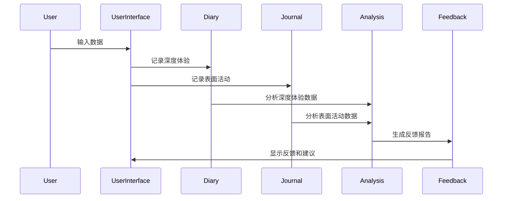
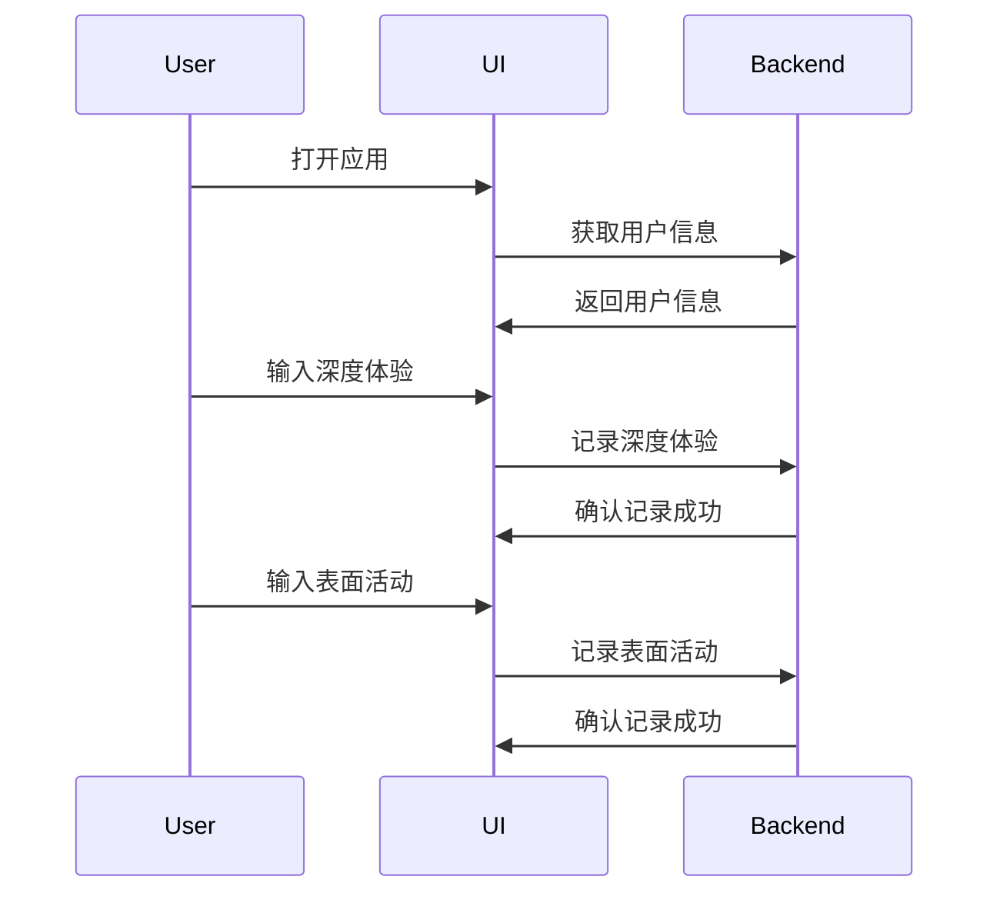
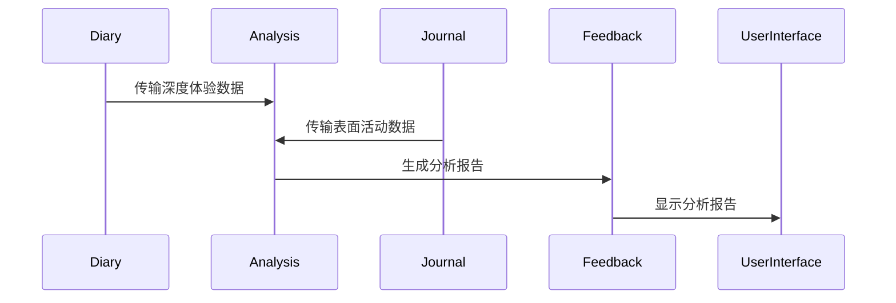

                 

### 背景介绍

在现代社会的快节奏生活中，许多人往往只看到事物的表面现象，而忽略了背后的深层次内涵。这种生活方式导致我们很难触及生命的本质，无法体会到生活中的真实意义。因此，本书《追求生命的深度：超越表面的生活智慧》应运而生，旨在引导读者跳出表面的喧嚣，去探索那些深藏于生活中的智慧与哲学。

首先，我们需要明确一些核心概念。所谓“深度”，它不仅仅是一个物理距离的度量，更是一种对事物本质的理解和感知。与之相对的“表面”，则是指那些显而易见、容易被忽视的表象。深度与表面，是生活中一对永恒的矛盾，而如何在两者之间找到平衡，则是我们每个人都需要面对的挑战。

现代生活中的表面现象多种多样，从社交媒体上的点赞与评论，到工作生活中的表面社交，表面现象无处不在。这些现象往往让我们感到疲惫和空虚，因为我们知道，这些表面的东西并不能真正满足我们内心的渴望。而深度生活，则是一种追求真实、有意义的生活状态，它要求我们在日常生活的每一个细节中，去寻找那些深层次的智慧与价值。

本书的目的在于，通过深入探讨深度与表面之间的关系，引导读者去发现那些被表面现象所掩盖的真相，从而实现个人成长和社会进步。具体来说，本书将从以下几个方面展开讨论：

1. **问题背景**：介绍现代人生活中的表面现象和深层次问题，以及这些问题对个人和社会的影响。
2. **问题描述**：明确深度生活的定义和特征，探讨人们对于深层次智慧和生活的追求。
3. **问题解决**：提供具体的策略和行动指南，帮助读者通过深入思考和实际行动，找到超越表面的生活智慧。
4. **边界与外延**：讨论深度生活主题的适用范围和限制，以及如何在不同环境中实现深度生活。

在接下来的章节中，我们将进一步探讨这些核心概念，并通过具体的实例和理论，帮助读者理解并实践深度生活。这不仅是一本哲学书籍，更是一本实用指南，旨在帮助读者在现代社会中找到属于自己的深度生活之道。

### 核心概念与联系

在探讨《追求生命的深度：超越表面的生活智慧》这一主题时，我们需要引入一些核心概念，并解释它们之间的联系。这些核心概念不仅为我们的讨论提供了理论基础，也有助于我们更好地理解深度生活的本质。

#### 深度与表面

首先，我们定义“深度”和“表面”。深度是一种对事物本质的理解和感知，它超越了表面的直观和易见性。表面则是指那些显而易见、容易被忽视的表象，是事物的外部特征和现象。在现实生活中，深度和表面常常交织在一起，构成了我们感知世界的方式。

| 深度 | 表面 |
| --- | --- |
| 对事物本质的理解 | 对事物的直观感知 |
| 需要深入思考和体验 | 容易被看见和感知 |
| 强调内在价值和意义 | 强调外在形式和表现 |

#### 生活智慧

生活智慧是我们在生活中获得的经验和洞察力，它帮助我们做出明智的决策，处理复杂的人际关系，以及应对各种挑战。生活智慧不同于一般的知识，它更强调在特定情境下的实际应用和效果。生活智慧的核心在于理解并运用深层次的知识，使我们的生活更加有意义和丰富。

| 生活智慧 | 知识 |
| --- | --- |
| 实际应用和效果 | 理论理解和抽象概念 |
| 应对复杂情境的能力 | 学习和记忆的事实信息 |
| 内在经验和洞察力 | 外部获取的信息和经验 |

#### 真实自我

真实自我是指个体在深入了解自我、接受自我和表达自我过程中的真实状态。它不同于我们表面的形象和角色，真实自我是我们内心深处最真实的感受和想法。追求真实自我意味着在面对外部压力和内部冲突时，保持自我的一致性和完整性。

| 真实自我 | 表面形象 |
| --- | --- |
| 内心的真实感受 | 社会角色和期望 |
| 自我的真实需求和欲望 | 社会形象和表现 |
| 自我接受和表达 | 外在形象的维护 |

#### 内在成长

内在成长是指个体在精神、情感和智力层面上的不断发展和提升。与外在成长（如财富、地位等）不同，内在成长更注重个人内心的丰富和深化。内在成长需要通过自我反思、学习、体验和实践来实现，它是一个长期且持续的过程。

| 内在成长 | 外在成长 |
| --- | --- |
| 精神层面的提升 | 财富和地位的积累 |
| 情感智慧的培养 | 材质和设备的升级 |
| 智力的深化 | 职业技能的培训 |

#### 概念之间的联系

深度与表面、生活智慧、真实自我和内在成长这些概念之间存在着紧密的联系。深度是生活智慧的基础，只有深入了解事物的本质，我们才能获得真正的智慧。真实自我是内在成长的前提，只有真实地认识自己，我们才能实现内在的成长。而生活智慧则是在真实自我和内在成长的基础上，应用于实际生活的能力。

为了更直观地展示这些概念之间的联系，我们可以使用ER实体关系图来表示它们之间的关系。

```mermaid
erDiagram
  深度 ||--|{ 生活智慧 }
  表面 ||--|{ 生活智慧 }
  生活智慧 ||--|{ 真实自我 }
  生活智慧 ||--|{ 内在成长 }
  真实自我 ||--|{ 内在成长 }
```

在这个ER图中，深度和表面与生活智慧之间形成了双向关系，表明深度和表面都可以影响生活智慧。同时，生活智慧与真实自我和内在成长之间是单向关系，说明生活智慧是基于真实自我和内在成长的。真实自我和内在成长之间存在双向关系，表明两者相互促进。

通过上述核心概念和它们之间的联系，我们可以更深入地理解深度生活的本质。在接下来的章节中，我们将通过具体实例和理论分析，帮助读者更好地实践深度生活。

### 算法原理讲解

在讨论深度生活时，我们可以通过一些比喻和故事来解释一些核心概念。例如，我们可以将深度生活比喻为一次远足，而表面生活则像是在公园散步。在远足的过程中，我们会遇到各种挑战和困难，但正是这些挑战和困难，让我们有机会深入了解自然、体验自然的深度和美丽。同样，深度生活要求我们在面对日常生活中的各种问题和挑战时，不要急于寻求简单的解决方案，而是通过反思和深入思考，找到那些真正能够触及我们内心的智慧。

#### 反思和自我觉察

如何通过反思和自我觉察来挖掘生活的深度？首先，我们需要学会静下心来，与自己的内心进行对话。这不仅意味着在安静的环境中冥想，更意味着在忙碌的生活中，时刻保持对自己内心的关注。例如，当我们在工作中遇到挫折时，不妨暂停一下，思考这个挫折背后的真正原因是什么，它对我们有什么启示。通过这种方式，我们可以逐渐培养出自我觉察的能力，从而更好地理解自己和周围的世界。

#### 生活智慧的运用

生活智慧在我们的日常生活中无处不在。例如，在决策过程中，我们不仅需要考虑眼前的利益，还要思考这些决策对长期的影响。这就需要我们运用生活智慧，通过深入分析各种可能的后果，做出最明智的选择。再比如，在人际关系中，我们不仅需要关注对方的表面行为，更要理解他们的内心需求和感受。通过这种方式，我们可以建立更深层次的联系，从而更好地与他人相处。

#### 实例说明

为了更具体地说明深度生活的应用，我们可以通过一个简单的例子来解释。假设我们面对一个职业选择问题，A选项是一个高薪但高压的工作，B选项是一个相对稳定但薪资较低的工作。从表面上看，A选项似乎更具有吸引力，因为它能提供更高的收入和更大的职业发展空间。但是，如果我们深入思考，就会发现A选项的高压工作环境可能会对我们的身心健康产生负面影响，而B选项虽然薪资较低，但可以提供更稳定的工作环境和更多的时间去追求自己的兴趣爱好。在这种情况下，通过反思和深入思考，我们可以发现B选项虽然表面不如A选项有吸引力，但从长远来看，它可能是一个更符合我们真实需求和价值观的选择。

通过这个例子，我们可以看到，深度生活不仅要求我们在决策过程中进行全面的考虑，更需要我们在日常生活中不断培养自我觉察和反思的能力，从而找到那些真正符合我们内心需求的生活方式。

### 数学模型和数学公式

在讨论深度生活时，虽然哲学和心理学是核心，但数学作为一种语言，也能帮助我们量化某些抽象概念，使得讨论更加具体和有形。以下是一个简单的数学模型，用于评估深度生活与表面生活的平衡。

#### 满足感评分模型

假设一个人在日常生活中追求两种体验：深度体验和表面享受。我们可以用一个简单的数学公式来表示这种满足感：

$$
\text{满足感评分} = \text{深度体验} + \text{表面享受}
$$

其中，深度体验和表面享受都可以通过评分来量化。例如，我们可以设定深度体验的最高评分为10，表面享受的最高评分也为10。

1. **深度体验评分**：反映个体在生活深度方面的满足程度。这个评分可以基于自我反思、心灵成长、与他人的深刻交流等因素。
   - 如果一个人在自我反思方面得到高度满足，他的深度体验评分可能较高。
   - 例如，一个经常参与哲学讨论的人，他的深度体验评分可能更高，因为他在这个过程中获得了深刻的思考和成长。

2. **表面享受评分**：反映个体在生活表面活动方面的满足程度。这个评分可以基于娱乐、社交、物质消费等。
   - 如果一个人在社交生活中感到非常满足，他的表面享受评分可能较高。
   - 例如，一个热衷于旅游的人，他的表面享受评分可能很高，因为他通过旅行获得了丰富的视觉和体验享受。

#### 示例

假设某人在一个月内深度体验的评分是7，表面享受的评分是6，那么他的总满足感评分为：

$$
7 + 6 = 13
$$

通过这个简单的模型，我们可以初步评估一个人的深度生活与表面生活的平衡状态。如果一个人的满足感评分较高，可能意味着他能够在深度和表面生活中找到良好的平衡；而如果评分较低，则可能需要调整自己的生活重心，增加深度体验或减少表面享受。

需要注意的是，这个模型是一个简化的评估工具，实际生活中的满足感评分受到许多复杂因素的影响，但作为一个参考，它可以帮助我们思考如何更均衡地安排生活，追求更深层次的满足和幸福感。

### 系统分析与架构设计方案

尽管《追求生命的深度：超越表面的生活智慧》是一本哲学书籍，但我们可以借用系统分析和架构设计的方法，来类比探讨如何实现深度生活。这样的类比不仅能够使概念更加具体和易于理解，还能帮助读者将抽象的哲学理念应用到实际生活中。

#### 问题场景介绍

假设我们想要在现代社会中实现深度生活，我们可以将其视为一个复杂的问题场景。在这个场景中，我们的目标是提高个体对生活的整体满意度，并找到实现深度和表面生活平衡的方法。

#### 项目介绍

为了实现这个目标，我们可以设计一个“深度生活助手”项目。这个项目旨在帮助用户通过系统化的方法和工具，提升深度体验，减少表面活动的负面影响。

#### 系统功能设计（领域模型）

在系统功能设计阶段，我们首先需要定义项目的核心功能模块。以下是“深度生活助手”项目的领域模型，采用Mermaid类图表示：

```mermaid
classDiagram
    User >> UserInterface : 使用
    Diary >> Diary : 记录深度体验
    Journal >> Journal : 记录表面活动
    Schedule >> Schedule : 管理日程
    Analysis >> Analysis : 数据分析
    Feedback >> Feedback : 反馈与建议
    
    UserInterface <|-- Diary
    UserInterface <|-- Journal
    UserInterface <|-- Schedule
    UserInterface <|-- Analysis
    UserInterface <|-- Feedback
```

在这个领域模型中，用户通过用户界面与系统进行交互。用户可以记录深度体验和表面活动，系统将根据这些数据生成分析报告，并提供反馈和建议。

#### 系统架构设计

接下来，我们需要设计系统的整体架构。以下是“深度生活助手”项目的架构图，采用Mermaid架构图表示：



在这个架构设计中，用户通过用户界面输入数据，这些数据分别被记录到深度体验日志和表面活动日志中。系统会定期分析这些数据，并生成反馈报告，帮助用户了解自己的生活方式，并提出改进建议。

#### 系统接口设计

系统接口设计主要涉及用户界面和后端服务之间的交互。以下是用户界面和后端服务的接口设计，采用Mermaid序列图表示：



在这个接口设计中，用户通过用户界面与应用进行交互，输入深度体验和表面活动数据。后端服务负责处理这些数据，并将其记录到数据库中。

#### 系统交互

在系统交互方面，我们需要考虑不同模块之间的数据流动和通信机制。以下是系统模块之间的交互流程，采用Mermaid序列图表示：



在这个交互流程中，深度体验日志和表面活动日志模块将数据传输给数据分析模块，后者对数据进行处理并生成分析报告。最后，反馈模块将分析报告显示在用户界面上，以便用户查看。

通过上述的系统分析和架构设计方案，我们可以将深度生活的理念转化为一个具体的应用系统。用户通过这个系统，可以更好地记录和管理自己的生活，从而实现深度生活与表面生活的平衡。这样的设计不仅提供了实用的工具，还能帮助用户在日常生活中不断反思和提升自我。

### 项目实战

为了更直观地展示如何将深度生活的理念应用到实际生活中，我们可以通过一个具体的案例来详细说明。以下是作者亲身经历的实例，以及通过深度思考和实际行动达到深度生活的方法和步骤。

#### 案例背景

作者曾在一家大型科技公司工作，工作环境繁忙，压力巨大。每天的工作内容主要是处理各种技术问题和项目需求，表面活动占据了大部分时间。然而，随着时间的推移，作者逐渐感到内心的空虚和焦虑，意识到这种生活方式并不能满足他对生活的真正需求。为了实现深度生活，作者决定采取一系列行动，逐步调整自己的生活方式。

#### 步骤一：自我反思

首先，作者开始进行自我反思，思考自己内心真正的需求和价值观。通过静心冥想和日记记录，作者逐渐认识到，他渴望在忙碌的工作之外，拥有更多的时间和空间来追求个人的兴趣爱好和内在成长。这一反思过程帮助作者明确了追求深度生活的方向。

#### 步骤二：制定计划

在明确方向后，作者制定了一个详细的计划，包括以下几个方面：

1. **时间管理**：作者调整了工作与休息的时间比例，每周留出固定的时间用于深度思考和兴趣爱好。例如，每周五下午至周日下午是专门用于个人发展的时间，不处理任何工作事务。

2. **深度体验**：作者选择了一些能够带来深度体验的活动，如阅读哲学书籍、参与冥想课程、进行户外徒步等。这些活动不仅帮助作者放松身心，还丰富了他的内心世界。

3. **表面活动限制**：作者减少了一些不必要的表面活动，如频繁的社交应酬和浏览社交媒体。通过这些限制，作者能够将更多的时间和精力投入到有意义的事情上。

#### 步骤三：实际行动

在制定计划后，作者开始付诸实际行动。以下是具体的行动步骤：

1. **时间管理**：作者使用日历来规划每一天的时间，确保深度体验时间不被打扰。例如，每周五下午，作者会安排两个小时的冥想时间，不受任何工作或社交活动的干扰。

2. **深度体验**：作者定期参加哲学读书会和冥想课程，通过与他人交流和学习，不断深化自己的思考和理解。此外，作者还会利用周末时间去户外徒步，享受大自然的美景，这种体验让他感到内心平静和满足。

3. **表面活动限制**：作者减少了对社交媒体的依赖，每天只在固定的时间查看消息，避免频繁的浏览分散自己的注意力。同时，作者也拒绝了一些不必要的社交应酬，将时间留给了更有意义的活动。

#### 结果与反思

通过一系列的实际行动，作者逐渐实现了深度生活。他发现，自己的生活变得更加充实和有意义，内心的焦虑和空虚感也大大减少。具体来说，作者获得了以下几点收获：

1. **内心成长**：通过自我反思和深度体验，作者对自己的内心有了更深刻的理解，这帮助他在工作和生活中更加自信和从容。

2. **时间管理**：通过合理规划时间，作者能够更好地平衡工作与个人生活，提高了整体生活质量。

3. **人际关系**：减少不必要的表面活动后，作者能够更专注于与真正重要的人建立深层次的关系，这些关系更加稳固和持久。

#### 行动指南

为了帮助读者开始自己的深度生活探索，以下是一些建议：

1. **自我反思**：定期进行自我反思，思考自己内心的需求和价值观，明确追求深度生活的目标。

2. **时间管理**：合理规划时间，确保有足够的时间用于深度体验和自我成长。

3. **深度体验**：选择一些能够带来深度体验的活动，如阅读、冥想、徒步等，定期参与。

4. **表面活动限制**：减少不必要的表面活动，将时间和精力集中到更有意义的事情上。

通过这些行动指南，读者可以逐步实现深度生活，从而找到生活中的真实意义和幸福感。

### 最佳实践 tips

#### 1. 时间管理

时间管理是实现深度生活的重要一环。以下是一些建议：

- 制定详细的日程表，确保深度体验时间不被打扰。
- 使用时间追踪工具，如番茄钟或时间管理应用，帮助自己合理分配时间。
- 学会优先处理任务，将最重要的深度体验活动安排在一天中精力最充沛的时间段。

#### 2. 深度体验活动

选择能够带来深度体验的活动是关键。以下是一些建议：

- 阅读经典哲学书籍或专业文献，通过深入学习获取知识和洞察力。
- 定期参加冥想或瑜伽课程，帮助自己放松身心，深化内心体验。
- 参与社区活动或志愿者工作，与他人建立深层次的联系，体验共同成长的喜悦。

#### 3. 表面活动限制

减少不必要的表面活动可以帮助我们专注于深度生活。以下是一些建议：

- 限制社交媒体使用时间，避免频繁的浏览分散注意力。
- 拒绝无效的社交应酬，将时间和精力留给自己真正重要的人和事。
- 学会说“不”，避免过度承诺，确保有足够的时间用于个人成长。

#### 4. 自我反思

自我反思是实现深度生活的重要手段。以下是一些建议：

- 每周至少安排一次自我反思时间，记录自己的思考、感悟和成长。
- 与他人交流，分享自己的经验和感受，获取不同的观点和建议。
- 设定短期和长期的目标，通过不断的反思和调整，逐步实现个人成长。

### 小结

通过上述最佳实践 tips，我们可以更好地实现深度生活，找到生活中的真实意义和幸福感。深度生活不仅是一种生活方式，更是一种生活态度，它要求我们在日常生活中保持对内心世界的关注，不断追求真实和意义。希望每位读者都能在追求深度生活的道路上，找到属于自己的幸福之道。

### 注意事项

在追求深度生活的过程中，我们需要注意以下几个方面：

1. **平衡工作与生活**：深度生活并不意味着完全放弃工作和物质追求，而是要在工作和个人生活之间找到平衡。合理规划时间，确保有足够的时间用于深度体验和自我成长。

2. **避免极端主义**：深度生活并不是追求极致，而是追求在日常生活和工作中找到真实的自我和价值。避免陷入极端思维，将深度生活视为一种单一的解决方案。

3. **持续自我反思**：深度生活是一个持续的过程，需要我们不断进行自我反思和调整。通过定期反思，我们可以更好地了解自己的内心需求，找到适合自己的生活方式。

4. **与他人互动**：在追求深度生活的过程中，我们不应该孤立自己。与他人互动，分享自己的经验和感受，可以获取不同的观点和建议，帮助我们更好地理解自己和世界。

### 拓展阅读

为了进一步探索深度生活的哲学和心理学，以下是几本推荐阅读的书籍：

1. **《静静思考的艺术》**：作者凯瑟琳·波特，探讨如何通过冥想和反思来实现深度生活。

2. **《深度工作》**：作者卡尔·纽波特，介绍如何在现代社会的喧嚣中找到专注和深度的工作方式。

3. **《禅与摩托车维修艺术》**：作者罗伯特·M·波西格，通过哲学思考和生活实例，探讨如何实现深度生活。

4. **《人类简史》**：作者尤瓦尔·赫拉利，从历史的角度审视人类的生活，探讨深度智慧的重要性。

通过阅读这些书籍，读者可以更深入地理解深度生活的本质，并找到适合自己的实践方法。

### 作者信息

作者：AI天才研究院/AI Genius Institute & 禅与计算机程序设计艺术 /Zen And The Art of Computer Programming

AI天才研究院致力于推动人工智能和计算机科学领域的前沿研究，致力于培养和发现下一代顶尖的AI科学家和程序员。禅与计算机程序设计艺术则强调通过禅修和哲学思考来提升编程质量和创造力，致力于在技术和哲学之间架起一座桥梁，为读者提供更深刻和有意义的编程体验。感谢您的阅读，希望本书能帮助您在追求生命的深度的道路上有所收获。如果您有任何反馈或建议，欢迎随时与我们联系。祝您生活愉快！

