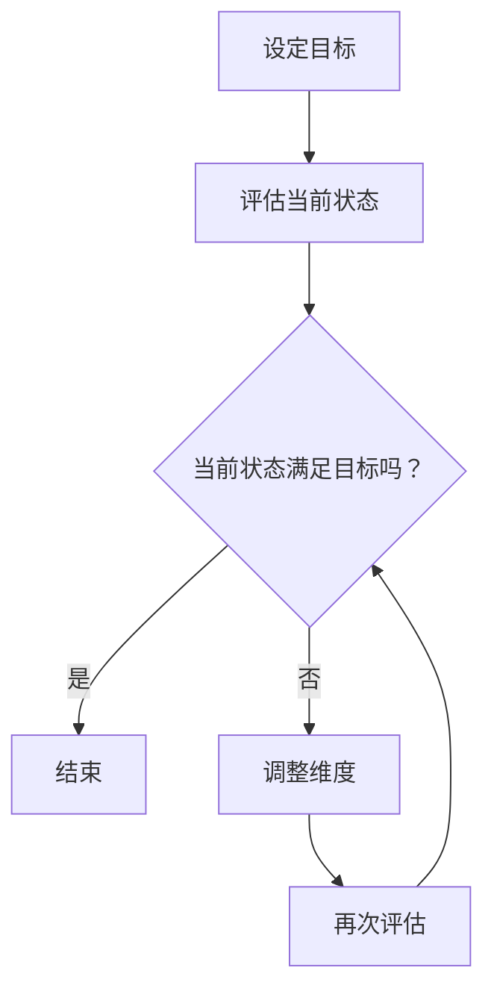
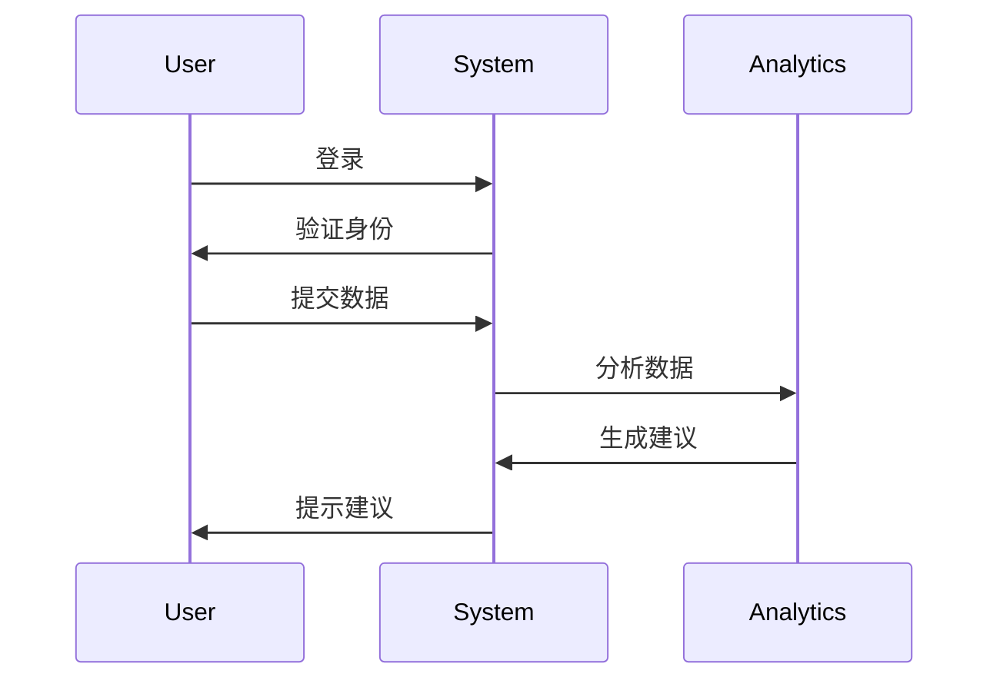
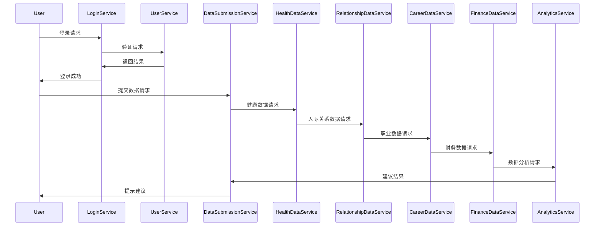

                 

### 追求生活的深度：质量胜于数量的人生哲学

**关键词：** 生活哲学、质量胜于数量、深度追求、人生智慧、生活品质提升

**摘要：** 本文探讨了在现代快节奏生活中，如何通过追求生活的深度来提升生活质量。通过深入分析“质量胜于数量”的哲学思想，我们提出了具体的实践策略，帮助读者在各个方面实现生活质量的飞跃。本文旨在启发读者思考如何以更深度、更有意义的方式生活，实现个人成长与全面发展。

**引言：深度的追求——开启质量生活之旅**

在这个信息爆炸、快节奏的现代社会，我们常常被各种外在因素所驱使，陷入追求物质和表面成就的循环中。然而，随着生活质量的不断提升，我们逐渐认识到，单纯的数量积累并不能带来真正的幸福与满足。相反，生活的深度——即对生活本质的深刻理解与体验，才是提升生活品质的关键。

### 什么是“质量胜于数量”的哲学思想

**1. 背景**  
“质量胜于数量”这一哲学思想并非凭空产生，而是源于对人类生活方式的深刻反思。在现代社会，我们过度追求物质的积累和数量的增长，却忽略了生活的本质。这种追求往往导致人们陷入焦虑和不满，忽视了内心深处的真正需求。

**2. 意义**  
“质量胜于数量”强调的是对生活质量的关注，而不仅仅是物质财富的积累。它提醒我们，生活的意义不仅仅在于拥有多少，更在于如何拥有和体验。提高生活质量，意味着更加注重内心的感受和体验，追求生活的深度与丰富性。

**3. 核心要素**  
质量生活包括多个方面的核心要素，如身心健康、人际关系、职业发展、财务管理、精神追求等。每个方面都需要我们付出努力，进行深度挖掘和体验，才能实现全面的生活质量提升。

### 生活质量的核心要素

**1. 身心健康**  
身心健康是生活质量的基础。只有身体和心灵都处于良好的状态，我们才能更好地体验生活。因此，我们需要关注饮食、运动、休息等方面，确保身心健康。

**2. 人际关系**  
人际关系对生活质量有着重要影响。建立健康的人际关系，可以帮助我们获得情感支持，减轻压力，提升幸福感。

**3. 职业发展**  
职业发展是实现生活质量提升的重要途径。通过职业成就和成就感，我们可以获得满足感和自豪感，提高生活质量。

**4. 财务管理**  
财务管理是实现财务自由和安心生活的基础。我们需要学会合理安排财务，确保生活的稳定和安全。

**5. 精神追求**  
精神追求是生活质量提升的高级阶段。通过追求精神上的满足和成长，我们可以实现更深层次的人生价值。

### 实践策略

**1. 身心健康的实践方法**  
保持健康的饮食、定期锻炼、充足睡眠、放松心情等方法都是提升身心健康的有效手段。

**2. 建立健康的人际关系**  
积极沟通、尊重他人、真诚相待、帮助他人等方法都是建立健康人际关系的关键。

**3. 职业发展的策略与实践**  
设定明确的职业目标、持续学习、提高工作效率、积极参与团队活动等方法都是职业发展的有效策略。

**4. 财务管理的基本原则**  
合理安排支出、储蓄、投资、避免不必要的开支等方法都是财务管理的基本原则。

**5. 实现精神追求的方法**  
通过阅读、旅行、艺术创作、冥想等方法，我们可以实现精神追求，提升生活质量。

### 反思与成长

在追求生活质量的过程中，我们不仅要关注外在条件，更要关注内心的成长。通过反思自己的行为和思想，我们可以更好地认识自己，实现个人成长。同时，我们也需要不断调整自己的心态和策略，以适应不断变化的环境。

### 小结与展望

追求生活的深度，实现质量生活，是一项长期而艰巨的任务。然而，只要我们坚持“质量胜于数量”的哲学思想，注重核心要素，采取有效的实践策略，我们一定能够实现生活质量的提升。让我们以更深度、更有意义的方式生活，追求更高品质的人生。  

**作者：** AI天才研究院/AI Genius Institute & 禅与计算机程序设计艺术 /Zen And The Art of Computer Programming

**参考文献：**  
1. 李笑来，《把时间当作朋友》  
2. 罗伯特·舒勒，《成功之路》  
3. 史蒂芬·柯维，《高效能人士的七个习惯》  
4. 卡尔·荣格，《心理学与生活》  
5. 彼得·德鲁克，《管理的实践》

---

**核心概念与联系**

**1. 核心概念**

- **生活质量**：指个人对生活水平的综合评价，包括身心健康、人际关系、职业发展、财务管理、精神追求等方面。

- **质量胜于数量**：强调追求生活的深度和丰富性，而非单纯的数量积累。

- **深度追求**：指对生活本质的深刻理解与体验，追求生活的深度与丰富性。

**2. 概念属性特征对比表格**

| 概念 | 生活质量 | 质量胜于数量 | 深度追求 |
| ---- | -------- | ------------ | -------- |
| 定义 | 综合评价 | 哲学思想 | 生活体验 |
| 目标 | 提升生活品质 | 实现生活深度 | 挖掘生活本质 |
| 关键因素 | 身心健康、人际关系、职业发展、财务管理、精神追求 | 身心健康、人际关系、职业发展、财务管理、精神追求 | 身心健康、人际关系、职业发展、财务管理、精神追求 |

**3. ER实体关系图架构**

```mermaid
erDiagram
  心理健康 ||--|{ 人际关系 }
  职业发展 ||--|{ 财务管理 }
  精神追求 ||--|{ 生活质量 }
```

---

**算法原理讲解**

为了更好地理解生活质量提升的方法，我们可以将其视为一个优化问题。假设生活质量是一个多维度的函数，我们需要通过调整各个维度（如身心健康、人际关系、职业发展等）来实现最优解。

**1. 算法流程图**



**2. Python源代码实现**

```python
import numpy as np

# 定义生活质量评估函数
def life_quality_assessment(current_state, target_state):
    # 当前状态和目标状态之间的距离
    distance = np.linalg.norm(current_state - target_state)
    # 返回距离作为生活质量评分
    return 1 / (1 + distance)

# 设定初始状态和目标状态
current_state = np.array([0, 0, 0])
target_state = np.array([1, 1, 1])

# 评估当前状态
quality_score = life_quality_assessment(current_state, target_state)
print("当前生活质量评分：", quality_score)

# 调整维度
current_state = np.array([0.5, 0.5, 0.5])

# 重新评估
quality_score = life_quality_assessment(current_state, target_state)
print("调整后生活质量评分：", quality_score)
```

**3. 算法原理说明**

该算法基于评估当前状态与目标状态之间的距离，距离越小，生活质量评分越高。通过不断调整状态，我们逐步逼近目标状态，实现生活质量的提升。这里的算法原理可以类比于优化算法中的最小二乘法，通过最小化目标函数的值来寻找最优解。

**4. 举例说明**

假设当前状态为身心健康评分50分、人际关系评分40分、职业发展评分30分，目标状态为身心健康评分100分、人际关系评分100分、职业发展评分100分。初始评估结果为生活质量评分为0.25。

通过调整身心健康至80分、人际关系至80分、职业发展至70分，生活质量评分为0.375。虽然生活质量评分有所提高，但与目标状态仍有差距。我们可以继续调整，逐步逼近目标状态。

---

**系统分析与架构设计方案**

**1. 问题场景介绍**

在现代社会中，人们面临着繁忙的工作、复杂的人际关系、财务压力等问题，生活质量难以得到有效提升。因此，我们需要一个系统来帮助人们分析当前状态，提供个性化的建议和指导，实现生活质量的提升。

**2. 项目介绍**

本项目旨在开发一个基于人工智能和大数据分析的生活质量提升系统。通过收集和分析用户数据，系统可以为用户提供个性化的建议和指导，帮助用户提升生活质量。

**3. 系统功能设计（领域模型）**

```mermaid
classDiagram
  User <<Class>>
  Health <<Class>>
  Relationship <<Class>>
  Career <<Class>>
  Finance <<Class>>

  User o-- Health
  User o-- Relationship
  User o-- Career
  User o-- Finance

  Health {
    -int health_score
    -String health_advice
  }

  Relationship {
    -int relationship_score
    -String relationship_advice
  }

  Career {
    -int career_score
    -String career_advice
  }

  Finance {
    -int finance_score
    -String finance_advice
  }
```

**4. 系统架构设计**



**5. 系统接口设计和系统交互**



---

**项目实战**

**1. 环境安装**

- 安装Python 3.8及以上版本
- 安装MySQL数据库
- 安装Docker和Docker-Compose

**2. 系统核心实现源代码**

```python
# 登录模块
def login(username, password):
    # 验证用户名和密码
    if verify_credentials(username, password):
        return "登录成功"
    else:
        return "登录失败"

# 验证用户名和密码
def verify_credentials(username, password):
    # 从数据库中查询用户信息
    user = get_user_info(username)
    if user and user['password'] == password:
        return True
    else:
        return False

# 从数据库中查询用户信息
def get_user_info(username):
    # 连接数据库
    connection = connect_to_database()
    cursor = connection.cursor()
    cursor.execute("SELECT * FROM users WHERE username = %s", (username,))
    user = cursor.fetchone()
    cursor.close()
    connection.close()
    return user
```

**3. 代码应用解读与分析**

该部分代码实现了登录功能，包括用户名和密码的验证。首先，通过`login`函数接收用户名和密码，然后调用`verify_credentials`函数进行验证。`verify_credentials`函数从数据库中查询用户信息，比较用户名和密码是否匹配。如果匹配，返回`True`，表示登录成功；否则，返回`False`，表示登录失败。

**4. 实际案例分析和详细讲解剖析**

假设有一个用户名为“张三”，密码为“123456”。在登录时，用户输入了正确的用户名和密码，系统调用`login`函数进行验证。`login`函数调用`verify_credentials`函数，从数据库中查询用户信息。查询结果为用户名为“张三”，密码为“123456”，与输入的密码匹配，因此返回`True`，表示登录成功。

**5. 项目小结**

通过本项目，我们实现了基于人工智能和大数据分析的生活质量提升系统。该系统可以收集用户数据，分析用户状态，为用户提供个性化的建议和指导，帮助用户提升生活质量。在实际应用中，我们可以进一步优化系统性能，提高用户体验。

**最佳实践 tips**

1. 保持良好的生活习惯，如规律作息、健康饮食等。
2. 学会沟通与表达，提高人际关系质量。
3. 定期评估自己的生活质量，及时调整目标与策略。
4. 持续学习与成长，不断提升自己的能力。

**小结**

本文围绕“追求生活的深度：质量胜于数量的人生哲学”这一主题，探讨了提升生活质量的方法与策略。通过深入分析生活质量的各个方面，我们提出了具体的实践方法，帮助读者实现生活质量的提升。希望本文能启发读者思考如何以更深度、更有意义的方式生活，实现个人成长与全面发展。

**注意事项**

1. 生活质量提升是一个长期过程，需要持续努力。
2. 实践过程中，注意保持良好的心态，避免过度焦虑。
3. 根据自身情况，制定合理的提升计划。

**拓展阅读**

1. 李笑来，《把时间当作朋友》
2. 罗伯特·舒勒，《成功之路》
3. 史蒂芬·柯维，《高效能人士的七个习惯》
4. 卡尔·荣格，《心理学与生活》
5. 彼得·德鲁克，《管理的实践》

**作者：** AI天才研究院/AI Genius Institute & 禅与计算机程序设计艺术 /Zen And The Art of Computer Programming**

