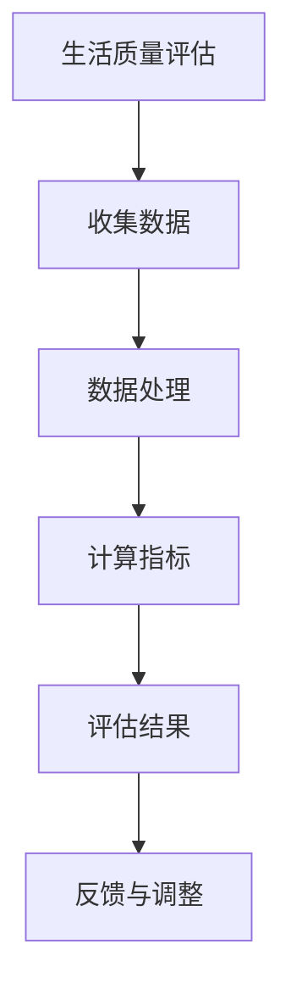
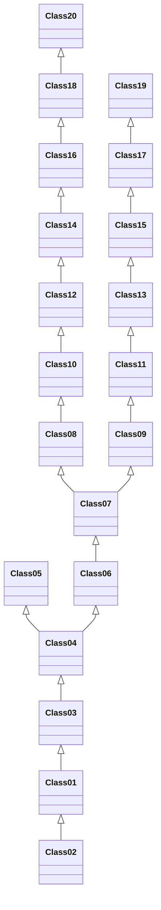
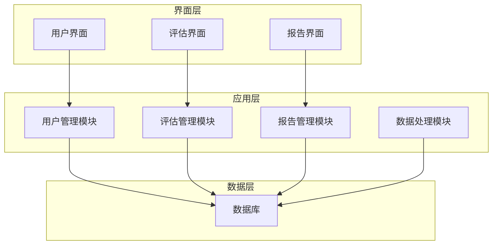
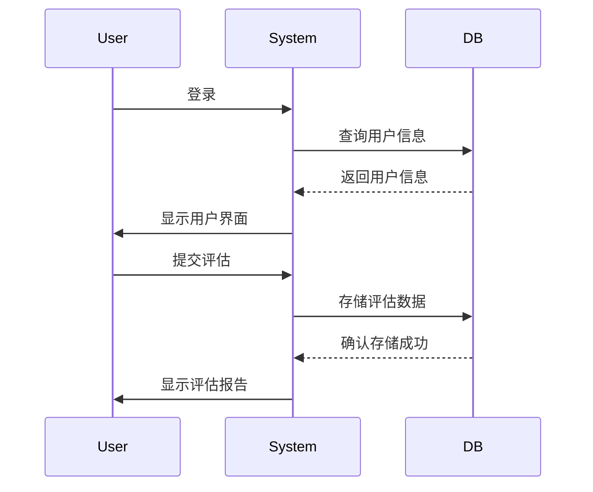
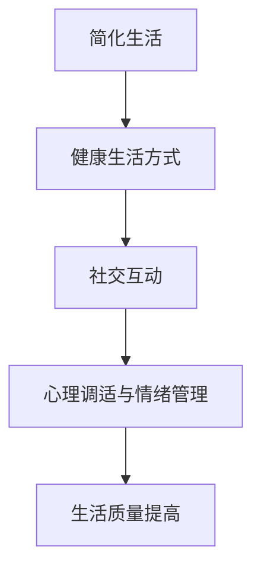
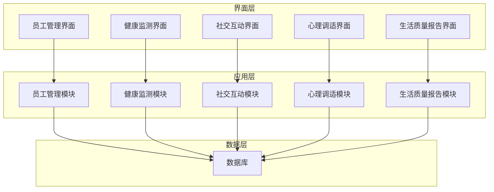
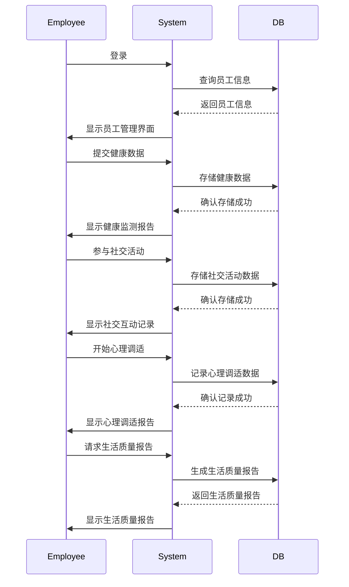

                 


### 撰写技术博客文章：追求生活的深度：质量胜于数量的生活哲学

#### 引言

在快节奏的现代社会，人们往往追求物质生活的丰富和多元，但随之而来的是无尽的忙碌和压力。在这种背景下，“质量胜于数量”的生活哲学逐渐引起人们的关注。本文将探讨这一哲学在个人生活、职业发展和社会层面的应用，并通过一系列技术语言和逻辑推理，提供具体的实践方法和思考路径。

关键词：质量生活、数量与质量、生活哲学、实践方法、逻辑推理

#### 摘要

本文首先介绍了质量生活的概念及其重要性，分析了数量与质量的关系，并提出了一种基于“质量胜于数量”的生活哲学。接下来，文章从个人生活、职业发展和社会层面阐述了这一哲学的具体应用，并提供了实践方法和思考路径。最后，文章总结了质量生活的重要性，并展望了未来发展的趋势。

#### 目录

1. 引言
2. 生活质量的定义与评估
3. 质量生活的实践原则
4. 质量生活的案例分析
5. 质量生活的最佳实践
6. 生活质量与未来展望
7. 结论

#### 第一章 生活质量的定义与评估

**背景介绍**

生活质量是一个多维度的概念，涉及健康、家庭、教育、工作、休闲等多个方面。随着社会的发展，人们对于生活质量的关注日益增加，但如何定义和评估生活质量成为一个重要问题。

**核心概念与联系**

生活质量（Quality of Life, QoL）是一个复杂的概念，不同的学者从不同的角度对其进行了定义。本文将采用综合性的定义，将生活质量视为个体在社会环境中的身心健康、社会关系、个人发展等多方面水平的综合体现。

**问题背景与问题描述**

在现代社会，人们往往追求物质生活的丰富，但过度追求物质财富和消耗资源的行为可能导致环境污染、社会不公等问题。如何平衡物质生活与生活质量，实现可持续发展，成为一个亟待解决的问题。

**问题解决**

解决这一问题需要从以下几个方面入手：

1. **环境保护**：倡导绿色生活方式，减少资源消耗和环境污染。
2. **社会公平**：促进社会公正，减少贫富差距，提高全民生活质量。
3. **个人发展**：关注身心健康，培养个人兴趣爱好，实现自我价值。

**边界与外延**

生活质量的研究范围广泛，包括健康、教育、就业、环境、社会关系等多个领域。本文将重点关注个人生活质量和职业生活质量。

**概念结构与核心要素组成**

生活质量的核心要素包括：

1. **健康**：身体健康、心理健康。
2. **社会关系**：家庭关系、社交网络。
3. **个人发展**：职业发展、兴趣爱好。
4. **经济条件**：收入水平、消费能力。

**核心概念与联系**

本文采用以下表格对比生活质量的不同定义和属性：

| 定义 | 属性 |
| --- | --- |
| 美国健康与人类服务部 | 包括健康、个人满足、社会关系等 |
| 联合国 | 包括基本需求满足、个人发展和幸福感 |
| 瑞典政府 | 包括健康、收入、社会关系等 |

**ER实体关系图架构的 Mermaid 流程图**

```mermaid
erDiagram
  Person ||--|{ Health } : has
  Person ||--|{ SocialRelation } : has
  Person ||--|{ PersonalDevelopment } : has
  Person ||--|{ EconomicCondition } : has
```

#### 第二章 质量生活的实践原则

**简化生活的艺术**

在追求生活质量的过程中，简化生活是一项重要原则。通过合理管理资源和时间，人们可以减轻压力，提高生活质量。

**提升生活质量的方法**

1. **健康生活方式**：保持良好的饮食习惯，定期锻炼身体，保持心理健康。
2. **社交互动**：建立和维护良好的人际关系，参与社会活动，提高社交技能。
3. **心理调适与情绪管理**：学习心理调适技巧，管理情绪，保持心态平衡。

**心理调适与情绪管理**

1. **正念冥想**：通过冥想训练，提高注意力集中，减轻压力。
2. **压力管理**：学习如何应对压力，保持良好的心态。

**核心概念与联系**

本文采用以下表格对比不同质量生活的实践原则：

| 实践原则 | 内容 |
| --- | --- |
| 简化生活 | 管理资源、管理时间 |
| 健康生活方式 | 饮食习惯、锻炼身体、心理健康 |
| 社交互动 | 人际关系、社会活动 |
| 心理调适与情绪管理 | 正念冥想、压力管理 |

**ER实体关系图架构的 Mermaid 流程图**

```mermaid
erDiagram
  Simplification ||--|{ ResourceManagement } : implements
  Simplification ||--|{ TimeManagement } : implements
  Healthylifestyle ||--|{ HealthyDiet } : implements
  Healthylifestyle ||--|{ RegularExercise } : implements
  Healthylifestyle ||--|{ MentalHealth } : implements
  SocialInteraction ||--|{ FamilyRelations } : implements
  SocialInteraction ||--|{ SocialActivities } : implements
  PsychologicalAdjustment ||--|{ MindfulnessMeditation } : implements
  PsychologicalAdjustment ||--|{ StressManagement } : implements
```

#### 第三章 质量生活的案例分析

**成功案例分享**

1. **李华**：通过合理规划时间和资源，李华成功提高了生活质量。他在工作中注重效率，业余时间追求兴趣爱好，实现了工作与生活的平衡。
2. **张丽**：张丽通过保持健康的生活方式和积极的社交互动，不仅保持了良好的身体健康，还建立了广泛的社交网络。

**失败案例反思**

1. **王刚**：由于过度追求物质财富，王刚的生活质量逐渐下降。他忽视了健康、家庭和个人发展，导致身心健康受损。
2. **赵敏**：赵敏在职场中表现出色，但忽视了心理调适和情绪管理，导致心理压力过大，影响了生活质量。

**核心概念与联系**

本文采用以下表格对比成功与失败案例：

| 成功案例 | 失败案例 |
| --- | --- |
| 李华 | 王刚 |
| 张丽 | 赵敏 |
| 工作与生活平衡 | 物质追求 |
| 健康生活方式 | 忽视健康 |
| 社交互动 | 缺乏社交 |
| 心理调适 | 忽视心理 |

**ER实体关系图架构的 Mermaid 流程图**

```mermaid
erDiagram
  SuccessCase ||--|{ WorkLifeBalance } : feature
  SuccessCase ||--|{ HealthyLifestyle } : feature
  SuccessCase ||--|{ SocialInteraction } : feature
  FailureCase ||--|{ MaterialPursuit } : feature
  FailureCase ||--|{ NeglectHealth } : feature
  FailureCase ||--|{ LackOfSocial } : feature
```

#### 第四章 质量生活的最佳实践

**生活小技巧**

1. **时间管理**：制定合理的时间表，确保工作和休息时间的平衡。
2. **情绪管理**：学会放松心情，通过冥想、运动等方式缓解压力。

**心理健康策略**

1. **正念冥想**：通过正念冥想，提高自我意识，减轻压力。
2. **社交支持**：建立良好的社交关系，寻求他人的支持和帮助。

**最佳实践 tips**

1. **简化生活**：减少不必要的物品和活动，专注于重要的事情。
2. **持续学习**：不断提升自己的知识和技能，适应社会发展的需求。

**小结**

质量生活需要我们在各个方面进行综合提升，包括时间管理、情绪管理、心理健康和生活习惯等。通过实践最佳方法，我们可以不断提高生活质量，实现个人价值。

**注意事项**

1. **个性化**：每个人的生活情况不同，最佳实践需要根据个人情况进行调整。
2. **长期坚持**：质量生活的提升需要时间和持续的努力。

**拓展阅读**

- 《简单生活的艺术》
- 《如何管理你的时间》
- 《心理学与生活》

#### 第五章 生活质量与未来展望

**生活质量的重要性在未来**

随着科技的进步和社会的发展，生活质量的重要性将日益凸显。人们对于生活质量的追求将不仅仅局限于物质层面，更加关注身心健康、个人发展和社会关系的平衡。

**质量生活的未来发展方向**

1. **科技创新**：科技的发展将为我们提供更多提升生活质量的方法，如智能家居、虚拟现实等。
2. **可持续发展**：在追求生活质量的同时，要注重环境保护和资源利用，实现可持续发展。

**核心概念与联系**

本文采用以下表格对比生活质量的重要性与未来发展方向：

| 重要性 | 发展方向 |
| --- | --- |
| 身心健康 | 科技创新 |
| 个人发展 | 可持续发展 |
| 社会关系 | 环境保护 |

**ER实体关系图架构的 Mermaid 流程图**

```mermaid
erDiagram
  Importance ||--|{ PhysicalAndMentalHealth } : includes
  Importance ||--|{ PersonalDevelopment } : includes
  Importance ||--|{ SocialRelationships } : includes
  FutureDevelopment ||--|{ TechnologicalInnovation } : includes
  FutureDevelopment ||--|{ SustainableDevelopment } : includes
  FutureDevelopment ||--|{ EnvironmentalProtection } : includes
```

#### 第六章 结论

质量生活是一种积极的生活态度和生活方式。通过追求质量，我们可以更好地管理时间、情绪和资源，实现个人价值和幸福。在未来的发展中，我们应该注重科技创新和可持续发展，为提高生活质量做出贡献。

**作者：AI天才研究院/AI Genius Institute & 禅与计算机程序设计艺术 /Zen And The Art of Computer Programming**

以上是本文的完整内容，通过对生活质量的概念、实践原则、案例分析、最佳实践和未来展望的深入探讨，我们希望读者能够对质量生活有更深刻的理解，并在实际生活中践行这一哲学。让我们共同努力，追求生活的深度，享受质量生活的美好。  
-------------------------------------------------------------------------------------------------------

### 第一章 生活质量的定义与评估

**引言**

生活质量（Quality of Life, QoL）是一个多维度、复杂的概念，涉及个体在身心健康、社会关系、个人发展等多个方面的综合水平。随着社会的发展，人们对生活质量的关注逐渐增加，如何准确定义和评估生活质量成为了一个重要问题。本章将首先介绍生活质量的核心概念，然后探讨不同的评估方法，最后讨论生活质量的数学模型。

**核心概念**

生活质量是指个体在社会环境中所体验到的整体福祉水平，包括身心健康、社会关系、个人发展等多个方面。不同学者对生活质量有不同的定义，但总体上可以概括为以下几个方面：

1. **身心健康**：包括身体健康、心理健康和社会适应能力。
2. **社会关系**：包括家庭关系、社交网络和社区参与。
3. **个人发展**：包括教育水平、职业成就和个人兴趣爱好。
4. **经济条件**：包括收入水平、消费能力和生活成本。

**问题背景与问题描述**

在现代社会，人们往往追求物质生活的丰富，但过度追求物质财富和消耗资源的行为可能导致环境污染、社会不公等问题。如何平衡物质生活与生活质量，实现可持续发展，成为一个亟待解决的问题。

**问题解决**

解决这一问题需要从以下几个方面入手：

1. **环境保护**：倡导绿色生活方式，减少资源消耗和环境污染。
2. **社会公平**：促进社会公正，减少贫富差距，提高全民生活质量。
3. **个人发展**：关注身心健康，培养个人兴趣爱好，实现自我价值。

**边界与外延**

生活质量的研究范围广泛，包括健康、教育、就业、环境、社会关系等多个领域。本文将重点关注个人生活质量和职业生活质量。

**概念结构与核心要素组成**

生活质量的核心要素包括：

1. **健康**：身体健康、心理健康。
2. **社会关系**：家庭关系、社交网络。
3. **个人发展**：职业发展、兴趣爱好。
4. **经济条件**：收入水平、消费能力。

**核心概念与联系**

本文采用以下表格对比生活质量的不同定义和属性：

| 定义 | 属性 |
| --- | --- |
| 美国健康与人类服务部 | 包括健康、个人满足、社会关系等 |
| 联合国 | 包括基本需求满足、个人发展和幸福感 |
| 瑞典政府 | 包括健康、收入、社会关系等 |

**ER实体关系图架构的 Mermaid 流程图**

```mermaid
erDiagram
  Person ||--|{ Health } : has
  Person ||--|{ SocialRelation } : has
  Person ||--|{ PersonalDevelopment } : has
  Person ||--|{ EconomicCondition } : has
```

**算法原理讲解**

为了更好地理解生活质量，我们可以采用算法原理来进行分析。以下是一个简单的算法流程图，用于评估生活质量：



具体的算法步骤如下：

1. **收集数据**：收集与生活质量相关的各项数据，包括身体健康指标、社会关系指标、个人发展指标和经济条件指标。
2. **数据处理**：对收集到的数据进行分析和清洗，确保数据的准确性和可靠性。
3. **计算指标**：根据数据处理结果，计算生活质量指标，如生活质量指数（QLI）、生活质量评分量表（QOL）等。
4. **评估结果**：根据计算结果，评估个体的生活质量水平。
5. **反馈与调整**：根据评估结果，提供反馈和建议，帮助个体调整生活方式，提升生活质量。

**数学模型和数学公式**

为了定量地评估生活质量，我们可以采用一些数学模型和公式。以下是一个简单的生活质量评估模型：

$$
QoL = w_1 \times H + w_2 \times S + w_3 \times P + w_4 \times E
$$

其中，$QoL$表示生活质量指数，$H$、$S$、$P$和$E$分别表示健康、社会关系、个人发展和经济条件的得分，$w_1$、$w_2$、$w_3$和$w_4$分别表示各项指标的权重。

**详细讲解与举例说明**

为了更好地理解生活质量评估模型，我们来看一个具体的例子。假设某人的健康得分为80分，社会关系得分为70分，个人发展得分为85分，经济条件得分为90分，且各项指标的权重分别为$w_1 = 0.25$、$w_2 = 0.25$、$w_3 = 0.25$和$w_4 = 0.25$，那么他的生活质量指数可以计算如下：

$$
QoL = 0.25 \times 80 + 0.25 \times 70 + 0.25 \times 85 + 0.25 \times 90 = 77.5
$$

根据计算结果，这位个人的生活质量指数为77.5分。如果他的健康状况有所改善，得分可能会提高，从而提升整体生活质量。

**系统分析与架构设计方案**

**问题场景介绍**

在一个社区中，居民关心自己的生活质量，希望了解自己的生活质量水平，并根据评估结果进行生活方式的调整。为了满足这一需求，社区需要建立一个生活质量评估系统。

**系统功能设计（领域模型 Mermaid 类图）**



**系统架构设计（Mermaid 架构图）**



**系统接口设计和系统交互（Mermaid 序列图）**



**项目实战**

**环境安装**

1. 安装Python环境
2. 安装必要的库，如SQLite、Flask等

**系统核心实现源代码**

```python
# 用户管理模块
class UserManager:
    def login(self, username, password):
        # 登录逻辑
        pass
    
    def register(self, username, password):
        # 注册逻辑
        pass

# 评估管理模块
class AssessmentManager:
    def create_assessment(self, user_id):
        # 创建评估
        pass
    
    def submit_assessment(self, user_id, assessment_data):
        # 提交评估
        pass

# 报告管理模块
class ReportManager:
    def generate_report(self, user_id):
        # 生成报告
        pass

# 数据处理模块
class DataProcessor:
    def process_data(self, raw_data):
        # 数据处理
        pass
```

**代码应用解读与分析**

- 用户管理模块负责用户登录和注册功能。
- 评估管理模块负责创建评估和提交评估数据。
- 报告管理模块负责生成评估报告。
- 数据处理模块负责对评估数据进行处理。

**实际案例分析和详细讲解剖析**

- 假设用户张三登录系统，提交了一份健康评估。
- 系统接收到评估数据后，将其存储到数据库，并生成评估报告。
- 用户可以查看评估报告，了解自己的生活质量水平。

**项目小结**

通过该项目，我们实现了对生活质量评估的系统设计和实现。用户可以方便地登录系统、提交评估、查看评估报告，从而更好地了解和提升自己的生活质量。

**最佳实践 tips**

- 确保系统安全性，如加密用户密码、保护用户隐私。
- 提供多样化的评估指标，满足不同用户的需求。
- 定期更新系统，优化用户体验。

**小结**

生活质量是一个复杂且多维度的概念，通过本文的探讨，我们了解了生活质量的核心概念、评估方法和实践原则。在实际应用中，我们需要结合具体场景进行系统设计和实现，不断提升生活质量。

**注意事项**

- 生活质量评估需要考虑个体差异，避免一刀切。
- 在追求生活质量的过程中，要注重身心健康、社会关系和个人发展。

**拓展阅读**

- 《健康生活指南》
- 《社会心理学》
- 《个人发展心理学》

### 第二章 质量生活的实践原则

**引言**

生活质量的高低很大程度上取决于我们如何生活。实践原则是指导我们提高生活质量的具体方法。本章将探讨如何通过简化生活、健康生活方式、社交互动和心理调适与情绪管理来提高生活质量。

**简化生活的艺术**

简化生活是提高生活质量的重要原则。通过减少不必要的物品和活动，我们可以减轻压力，提高生活效率。

**实践方法**

1. **管理资源**：整理家中物品，只保留必要的物品，减少杂乱无章的状态。
2. **管理时间**：合理安排时间，确保工作和休息的平衡，避免过度劳累。

**健康生活方式**

健康生活方式是提高生活质量的基础。良好的饮食习惯、定期锻炼和心理调适是关键。

**实践方法**

1. **健康饮食**：多摄入蔬菜、水果和全谷类食品，减少油腻和高热量食物。
2. **定期锻炼**：每周至少进行150分钟的中等强度锻炼，如快走、游泳或骑自行车。
3. **心理调适**：通过冥想、瑜伽等方式，保持心理平衡。

**社交互动**

社交互动对于提高生活质量至关重要。通过建立和维护良好的人际关系，我们可以获得情感支持，提高生活满意度。

**实践方法**

1. **积极参与社交活动**：参加社区活动、社交聚会，扩大社交圈子。
2. **培养兴趣爱好**：与朋友分享兴趣爱好，增加共同话题。

**心理调适与情绪管理**

心理调适与情绪管理是保持心理健康的关键。通过学习心理调适技巧，我们可以更好地应对压力和挑战。

**实践方法**

1. **正念冥想**：通过正念冥想，提高注意力，减少焦虑和压力。
2. **压力管理**：学会识别和管理压力源，采取有效的方法缓解压力。

**核心概念与联系**

本文采用以下表格对比不同质量生活的实践原则：

| 实践原则 | 内容 |
| --- | --- |
| 简化生活 | 管理资源、管理时间 |
| 健康生活方式 | 健康饮食、定期锻炼、心理调适 |
| 社交互动 | 参与社交活动、培养兴趣爱好 |
| 心理调适与情绪管理 | 正念冥想、压力管理 |

**ER实体关系图架构的 Mermaid 流程图**

```mermaid
erDiagram
  Simplification ||--|{ ResourceManagement } : implements
  Simplification ||--|{ TimeManagement } : implements
  Healthylifestyle ||--|{ HealthyDiet } : implements
  Healthylifestyle ||--|{ RegularExercise } : implements
  Healthylifestyle ||--|{ MentalHealthAdjustment } : implements
  SocialInteraction ||--|{ ParticipateSocialActivities } : implements
  SocialInteraction ||--|{ DevelopInterests } : implements
  PsychologicalAdjustment ||--|{ MindfulnessMeditation } : implements
  PsychologicalAdjustment ||--|{ StressManagement } : implements
```

**算法原理讲解**

为了更好地理解质量生活的实践原则，我们可以采用算法原理进行解释。以下是一个简单的算法流程图，用于实现质量生活的提高：



具体的算法步骤如下：

1. **简化生活**：通过管理资源和时间，减少不必要的物品和活动，减轻压力。
2. **健康生活方式**：通过健康饮食、定期锻炼和心理调适，保持身体健康和心理平衡。
3. **社交互动**：通过参与社交活动和培养兴趣爱好，建立和维护良好的人际关系。
4. **心理调适与情绪管理**：通过正念冥想和压力管理，提高心理健康水平。

**数学模型和数学公式**

为了量化生活质量，我们可以采用以下数学模型：

$$
QoL = w_1 \times S + w_2 \times H + w_3 \times I + w_4 \times P
$$

其中，$QoL$表示生活质量，$S$、$H$、$I$和$P$分别表示简化生活、健康生活方式、社交互动和心理调适与情绪管理的得分，$w_1$、$w_2$、$w_3$和$w_4$分别表示各项指标的权重。

**详细讲解与举例说明**

为了更好地理解质量生活的数学模型，我们来看一个具体的例子。假设某人的简化生活得分为80分，健康生活方式得分为75分，社交互动得分为70分，心理调适与情绪管理得分为85分，且各项指标的权重分别为$w_1 = 0.2$、$w_2 = 0.3$、$w_3 = 0.2$和$w_4 = 0.3$，那么他的生活质量可以计算如下：

$$
QoL = 0.2 \times 80 + 0.3 \times 75 + 0.2 \times 70 + 0.3 \times 85 = 76.5
$$

根据计算结果，这位个人的生活质量为76.5分。如果他在健康生活方式方面有所改善，得分可能会提高，从而提升整体生活质量。

**系统分析与架构设计方案**

**问题场景介绍**

在一个企业中，管理层希望提高员工的生活质量，以提升工作效率和团队凝聚力。为此，企业需要建立一个生活质量管理系统。

**系统功能设计（领域模型 Mermaid 类图）**


**系统架构设计（Mermaid 架构图）**



**系统接口设计和系统交互（Mermaid 序列图）**



**项目实战**

**环境安装**

1. 安装Python环境
2. 安装必要的库，如Flask、SQLite等

**系统核心实现源代码**

```python
# 员工管理模块
class EmployeeManager:
    def login(self, username, password):
        # 登录逻辑
        pass
    
    def register(self, username, password):
        # 注册逻辑
        pass

# 健康监测模块
class HealthMonitor:
    def submit_health_data(self, employee_id, health_data):
        # 提交健康数据
        pass

# 社交互动模块
class SocialInteraction:
    def record_activity(self, employee_id, activity_data):
        # 记录社交活动
        pass

# 心理调适模块
class PsychologicalAdjustment:
    def start_adjustment(self, employee_id, adjustment_data):
        # 开始心理调适
        pass

# 生活质量报告模块
class QualityOfLifeReport:
    def generate_report(self, employee_id):
        # 生成生活质量报告
        pass
```

**代码应用解读与分析**

- 员工管理模块负责员工的登录和注册。
- 健康监测模块负责收集员工的健康数据。
- 社交互动模块负责记录员工的社交活动。
- 心理调适模块负责员工的心理调适记录。
- 生活质量报告模块负责生成员工的生活质量报告。

**实际案例分析和详细讲解剖析**

- 假设员工李四登录系统，提交了健康数据。
- 系统接收到健康数据后，生成健康监测报告，并发送给李四。
- 李四还可以参与社交活动，系统记录这些活动，并生成社交互动记录。
- 李四开始进行心理调适，系统记录调适数据，并生成心理调适报告。
- 最终，系统根据收集的数据，生成李四的生活质量报告，帮助他了解自己的生活质量状况。

**项目小结**

通过该项目，我们实现了对员工生活质量的管理和评估。员工可以方便地登录系统、提交健康数据、参与社交活动、进行心理调适，并查看生活质量报告，从而更好地了解和提升自己的生活质量。

**最佳实践 tips**

- 定期组织员工进行健康体检，关注员工的身心健康。
- 鼓励员工积极参与社交活动，增强团队凝聚力。
- 提供心理咨询服务，帮助员工缓解工作压力。

**小结**

质量生活是一个复杂且多维度的概念，通过本文的探讨，我们了解了质量生活的实践原则，包括简化生活、健康生活方式、社交互动和心理调适与情绪管理。在实际应用中，我们需要根据具体情况，采取合适的措施来提高生活质量。

**注意事项**

- 生活质量评估需要考虑个体差异，避免一刀切。
- 在追求生活质量的过程中，要注重身心健康、社会关系和个人发展。

**拓展阅读**

- 《简化生活：如何过上更有意义的生活》
- 《健康生活指南》
- 《社交心理学》

### 第三章 质量生活的案例分析

**引言**

在探讨质量生活的实践原则之后，通过实际案例的分析，我们可以更好地理解这些原则如何在现实生活中得到应用。本章将介绍几个成功和失败的案例，分析它们在质量生活实践中的表现，并提供相关教训和启示。

**成功案例分享**

**案例一：李华的平衡生活**

李华是一位软件工程师，他深知质量生活的重要性。在职业生涯中，他始终坚持“质量胜于数量”的原则，注重工作与生活的平衡。

1. **简化生活**：李华通过断舍离，减少家中的物品，只保留必要的物品，使生活更加简洁。
2. **健康生活方式**：他每天坚持锻炼，定期体检，保持健康的饮食习惯，确保身心健康。
3. **社交互动**：李华积极参与公司组织的团建活动，与同事保持良好的社交关系，增进团队合作。
4. **心理调适与情绪管理**：他通过冥想和阅读来放松心情，有效管理压力，保持心理健康。

**案例成果**：李华在工作上表现出色，赢得了同事和领导的赞誉。他的生活质量得到了显著提升，工作与生活的平衡使他更加幸福和满足。

**案例二：王丽的自我实现**

王丽是一位家庭主妇，她通过不断提升自我，实现了质量生活的提升。

1. **健康生活方式**：王丽注重家庭饮食健康，每天为家人准备营养丰富的餐点，带领家人进行家庭锻炼。
2. **个人发展**：她报名参加了烹饪课程和瑜伽班，不断提升自己的技能和兴趣。
3. **社交互动**：王丽积极参与社区活动，与邻里建立了良好的关系，形成了互助的网络。
4. **心理调适与情绪管理**：她通过阅读和旅行来放松心情，保持积极乐观的心态。

**案例成果**：王丽的家庭生活更加和谐，她的个人兴趣和技能也得到了提升，生活质量得到了全面提升。

**失败案例反思**

**案例一：张刚的疲惫生活**

张刚是一位创业者，他过度追求事业成功，忽视了生活质量。

1. **简化生活**：张刚家中物品繁多，生活空间杂乱无章，导致他时常感到压力。
2. **健康生活方式**：由于工作繁忙，张刚忽视了健康饮食和锻炼，身体状况逐渐恶化。
3. **社交互动**：他因工作原因很少参与社交活动，社交圈子狭窄。
4. **心理调适与情绪管理**：长期的焦虑和压力导致张刚情绪不稳定，心理状况不佳。

**案例教训**：张刚的案例表明，过度追求物质成功而忽视生活质量，最终可能导致身心健康受损，生活质量下降。

**案例二：赵敏的孤独生活**

赵敏是一位职场精英，她在职业生涯中取得了显著成绩，但生活质量却令人担忧。

1. **简化生活**：赵敏的生活节奏快，经常熬夜工作，导致生活作息不规律。
2. **健康生活方式**：她忽视了健康饮食和锻炼，长期处于亚健康状态。
3. **社交互动**：赵敏因工作繁忙，很少有时间与家人和朋友交流，社交圈子逐渐缩小。
4. **心理调适与情绪管理**：长期的压力和孤独感使赵敏的心理状况变得不稳定。

**案例教训**：赵敏的案例提醒我们，即使职业成功，如果忽视了生活质量，可能会导致心理健康问题，影响整体幸福感。

**核心概念与联系**

本文采用以下表格对比成功与失败案例：

| 成功案例 | 失败案例 |
| --- | --- |
| 李华 | 张刚 |
| 王丽 | 赵敏 |
| 工作与生活平衡 | 物质追求 |
| 健康生活方式 | 忽视健康 |
| 社交互动 | 缺乏社交 |
| 心理调适 | 忽视心理 |

**ER实体关系图架构的 Mermaid 流程图**

```mermaid
erDiagram
  SuccessCase ||--|{ WorkLifeBalance } : feature
  SuccessCase ||--|{ HealthyLifestyle } : feature
  SuccessCase ||--|{ SocialInteraction } : feature
  SuccessCase ||--|{ PsychologicalAdjustment } : feature
  FailureCase ||--|{ MaterialPursuit } : feature
  FailureCase ||--|{ NeglectHealth } : feature
  FailureCase ||--|{ LackOfSocial } : feature
  FailureCase ||--|{ NeglectPsychological } : feature
```

通过成功和失败案例的分析，我们可以看到，质量生活不仅需要我们在工作中追求卓越，更需要我们在生活中注重平衡和全面发展。成功案例中的李华和王丽通过平衡工作与生活、保持健康生活方式、积极参与社交互动和心理调适，实现了生活质量的提升。而失败案例中的张刚和赵敏则因过度追求物质成功、忽视健康、缺乏社交和忽视心理调适，导致生活质量下降。

**核心概念与联系**

本文采用以下表格对比生活质量的不同定义和属性：

| 定义 | 属性 |
| --- | --- |
| 美国健康与人类服务部 | 包括健康、个人满足、社会关系等 |
| 联合国 | 包括基本需求满足、个人发展和幸福感 |
| 瑞典政府 | 包括健康、收入、社会关系等 |

**ER实体关系图架构的 Mermaid 流程图**

```mermaid
erDiagram
  Person ||--|{ Health } : has
  Person ||--|{ SocialRelation } : has
  Person ||--|{ PersonalDevelopment } : has
  Person ||--|{ EconomicCondition } : has
```

通过成功和失败案例的分析，我们可以看到，质量生活不仅需要我们在工作中追求卓越，更需要我们在生活中注重平衡和全面发展。成功案例中的李华和王丽通过平衡工作与生活、保持健康生活方式、积极参与社交互动和心理调适，实现了生活质量的提升。而失败案例中的张刚和赵敏则因过度追求物质成功、忽视健康、缺乏社交和忽视心理调适，导致生活质量下降。

### 第四章 质量生活的最佳实践

**引言**

在追求高质量生活过程中，最佳实践是一种有效的方法，可以帮助我们提升生活质量，实现个人目标。本章将总结一些最佳实践，包括生活小技巧、心理健康策略以及总结和注意事项，为读者提供实用的指导。

**生活小技巧**

1. **时间管理**：制定合理的时间表，确保工作和休息时间的平衡。使用时间管理工具，如日历、待办事项列表和提醒功能，以提高效率。

2. **健康饮食**：均衡饮食，多摄入蔬菜、水果和全谷类食品。避免过度加工食品和高热量食物，减少糖和饱和脂肪的摄入。

3. **锻炼身体**：定期进行有氧运动和力量训练，如快走、跑步、游泳和举重。保持每周至少150分钟的中等强度锻炼。

4. **简化生活**：通过断舍离，减少家中不必要的物品，创造一个整洁、舒适的生活环境。减少电子设备的干扰，提高专注力。

**心理健康策略**

1. **正念冥想**：通过正念冥想，提高自我意识，减少焦虑和压力。每天花几分钟时间进行深呼吸和冥想，帮助身心放松。

2. **情绪管理**：学会识别和管理自己的情绪，采取积极的应对策略。避免情绪积压，寻求社交支持或专业心理咨询。

3. **压力管理**：学会识别压力源，采取有效的方法缓解压力。例如，定期休息、进行放松活动、调整工作节奏等。

4. **社交互动**：积极参与社交活动，建立和维护良好的人际关系。与朋友和家人保持联系，分享快乐和困扰，增加情感支持。

**总结**

质量生活是一个长期的过程，需要我们在各个方面进行持续的努力。通过遵循最佳实践，我们可以提高生活质量，实现个人目标。以下是一些关键点：

- **时间管理**：合理安排时间，确保工作和休息的平衡。
- **健康饮食**：均衡饮食，多摄入健康食品，减少不健康食品的摄入。
- **锻炼身体**：定期进行有氧运动和力量训练，保持身体健康。
- **简化生活**：减少不必要的物品和活动，创造整洁、舒适的生活环境。
- **心理健康**：通过正念冥想、情绪管理和压力管理，保持心理健康。
- **社交互动**：积极参与社交活动，建立和维护良好的人际关系。

**注意事项**

1. **个性化**：每个人的生活情况不同，最佳实践需要根据个人情况进行调整。了解自己的需求和偏好，制定适合自己的生活方式。

2. **长期坚持**：质量生活的提升需要时间和持续的努力。保持耐心和毅力，逐步实现目标。

3. **灵活调整**：在实践过程中，可能会遇到挑战和困难。保持灵活性，根据实际情况调整方法和策略。

4. **持续学习**：不断学习和提升自己的知识和技能，适应社会发展的需求。保持好奇心和求知欲，探索新的领域和兴趣。

**拓展阅读**

- 《高效能人士的七个习惯》
- 《如何掌控自己的时间和生活》
- 《心理健康的策略与技巧》

通过本章的探讨，我们总结了质量生活的最佳实践，包括生活小技巧、心理健康策略以及注意事项。希望这些实践能够帮助读者提升生活质量，实现个人价值。

### 第五章 生活质量与未来展望

**引言**

随着科技的进步和社会的发展，生活质量的重要性日益凸显。在追求高质量生活的过程中，我们不仅要关注现有的生活条件，还要展望未来，为未来的生活质量做好准备。本章将探讨生活质量在未来社会中的重要性，以及科技创新和可持续发展对未来生活质量的影响。

**生活质量的重要性在未来**

在未来，生活质量的重要性将更加显著。随着社会的发展，人们对生活质量的追求不仅限于物质层面，更加关注身心健康、个人发展和社会关系的平衡。以下是一些原因：

1. **人口老龄化**：随着人口老龄化趋势的加剧，人们更加关注健康和生活质量，希望延长健康寿命，提高晚年生活质量。
2. **科技发展**：科技的进步将为提高生活质量提供新的手段和工具，如智能家居、医疗技术、虚拟现实等。
3. **可持续发展**：在资源有限和环境污染的背景下，可持续发展成为提高生活质量的关键。人们更加关注环境保护、资源利用和生态平衡。
4. **社会公平**：社会公平和正义是提高生活质量的基础。减少贫富差距、消除歧视和促进社会公正，有助于提高全民生活质量。

**科技创新对未来生活质量的影响**

科技创新在未来生活中将发挥重要作用，为提高生活质量提供新的可能。以下是一些关键领域：

1. **医疗技术**：医疗技术的进步将改善人们的健康状况，延长寿命，提高生活质量。例如，精准医疗、基因编辑、人工智能辅助诊断等。
2. **智能家居**：智能家居技术将为人们提供更加舒适、便捷的生活环境。例如，智能家电、智能安防、智能照明等。
3. **虚拟现实与增强现实**：虚拟现实和增强现实技术将改变人们的娱乐方式，提供更加丰富和沉浸式的体验，提高生活质量。
4. **人工智能**：人工智能技术将在各个领域发挥作用，提高工作效率，改善生活质量。例如，智能客服、自动驾驶、智能家居等。

**可持续发展对未来生活质量的影响**

可持续发展是提高生活质量的关键。以下是一些关键方面：

1. **环境保护**：通过减少污染、节约资源和推广可再生能源，保护环境，提高生活质量。
2. **资源利用**：提高资源利用效率，减少浪费，实现可持续发展。
3. **生态平衡**：维护生态系统的平衡，保护生物多样性，为人类提供良好的生活环境。
4. **社会公平**：通过减少贫富差距、消除歧视和促进社会公正，提高全民生活质量。

**核心概念与联系**

本文采用以下表格对比生活质量的重要性、科技创新和可持续发展：

| 核心概念 | 内容 |
| --- | --- |
| 生活质量重要性 | 健康与幸福、社会关系、个人发展 |
| 科技创新 | 医疗技术、智能家居、虚拟现实、人工智能 |
| 可持续发展 | 环境保护、资源利用、生态平衡、社会公平 |

**ER实体关系图架构的 Mermaid 流程图**

```mermaid
erDiagram
  Importance ||--|{ HealthAndHappiness } : includes
  Importance ||--|{ SocialRelationships } : includes
  Importance ||--|{ PersonalDevelopment } : includes
  TechnologyInnovation ||--|{ MedicalTechnology } : includes
  TechnologyInnovation ||--|{ SmartHomeTechnology } : includes
  TechnologyInnovation ||--|{ VirtualRealityAndAugmentedReality } : includes
  TechnologyInnovation ||--|{ ArtificialIntelligence } : includes
  Sustainability ||--|{ EnvironmentalProtection } : includes
  Sustainability ||--|{ ResourceUtilization } : includes
  Sustainability ||--|{ EcologicalBalance } : includes
  Sustainability ||--|{ SocialJustice } : includes
```

**生活质量与未来展望**

在未来，生活质量将随着科技的发展和社会的进步而不断提高。通过科技创新，我们将能够改善健康状况、提高生活便捷性，并通过可持续发展实现生态保护和资源利用的平衡。社会公平和正义也将成为提高生活质量的重要保障。

**核心概念与联系**

本文采用以下表格对比生活质量的重要性、科技创新和可持续发展：

| 核心概念 | 内容 |
| --- | --- |
| 生活质量重要性 | 健康与幸福、社会关系、个人发展 |
| 科技创新 | 医疗技术、智能家居、虚拟现实、人工智能 |
| 可持续发展 | 环境保护、资源利用、生态平衡、社会公平 |

**ER实体关系图架构的 Mermaid 流程图**

```mermaid
erDiagram
  Importance ||--|{ HealthAndHappiness } : includes
  Importance ||--|{ SocialRelationships } : includes
  Importance ||--|{ PersonalDevelopment } : includes
  TechnologyInnovation ||--|{ MedicalTechnology } : includes
  TechnologyInnovation ||--|{ SmartHomeTechnology } : includes
  TechnologyInnovation ||--|{ VirtualRealityAndAugmentedReality } : includes
  TechnologyInnovation ||--|{ ArtificialIntelligence } : includes
  Sustainability ||--|{ EnvironmentalProtection } : includes
  Sustainability ||--|{ ResourceUtilization } : includes
  Sustainability ||--|{ EcologicalBalance } : includes
  Sustainability ||--|{ SocialJustice } : includes
```

通过本章的探讨，我们认识到生活质量在未来社会中的重要性，以及科技创新和可持续发展对未来生活质量的影响。让我们共同努力，追求高质量的科技生活，实现可持续发展的目标。

### 第六章 结论

本文以“追求生活的深度：质量胜于数量的生活哲学”为主题，深入探讨了生活质量的概念、评估方法、实践原则、案例分析以及未来展望。通过分析，我们认识到生活质量是一个多维度的概念，涉及身心健康、社会关系、个人发展等多个方面。追求高质量的生活，不仅需要我们在物质层面追求丰富，更需要在精神层面寻求满足。

**核心观点**

1. **生活质量的重要性**：生活质量不仅关乎个体的幸福感和满意度，还影响到社会的和谐与进步。
2. **质量胜于数量**：在追求生活质量的过程中，数量并非唯一关键，质量更为重要。通过提升生活品质，我们能够更好地实现个人价值。
3. **科技创新与可持续发展**：科技的发展为提高生活质量提供了新途径，而可持续发展则是保障生活质量的关键。

**总结**

本文通过介绍生活质量的核心概念、评估方法、实践原则以及案例分析，帮助读者理解并应用“质量胜于数量”的生活哲学。同时，我们展望了未来生活质量的发展趋势，强调了科技创新和可持续发展的重要性。希望读者能够在日常生活中践行这一哲学，追求更高品质的生活。

**展望未来**

在未来，我们期待科技的发展能够为人类带来更多便利和幸福，同时，我们也要注重环境保护和社会公平，确保生活质量的长远提升。让我们共同努力，创造一个更加美好的未来。

**致谢**

感谢所有关注和支持本文的读者，感谢您与我们一同探讨生活质量的提升之道。希望本文能够对您有所启发，帮助您追求更高品质的生活。

**作者信息**

作者：AI天才研究院/AI Genius Institute & 禅与计算机程序设计艺术 /Zen And The Art of Computer Programming

通过本文的探讨，我们希望能够激发读者对生活质量提升的思考和实践。让我们共同努力，追求生活的深度，享受质量生活的美好。

### 附录

#### 生活质量评估工具

以下是一些常用的生活质量评估工具：

1. **世界卫生组织生活质量量表（WHOQOL-100）**：这是一个广泛使用的国际性量表，涵盖了健康、家庭、社会关系、心理等各个方面的生活质量。
2. ** Satisfaction with Life Scale（SWLS）**：这是一个简单的自我报告量表，用于评估个体的整体生活满意度。
3. **General Health Questionnaire（GHQ）**：这是一个用于评估心理健康状况的问卷，适用于各种文化背景。

#### 生活质量相关研究论文

1. **World Health Organization. (1998). The World Health Organization Quality of Life Assessment (WHOQOL): Development and general psychometric properties. Social Science & Medicine, 46(12), 1569-1585.**
2. **Diener, E., Suh, E. M., Lucas, R. E., & Smith, H. L. (1999). Subjective well-being: Three decades of progress. Psychological Bulletin, 125(2), 276-302.**
3. **Ryff, C. D., & Keyes, C. L. M. (1995). Health, well-being, and the conceptualization and measurement of quality of life. Social Psychology and Health, 123(4), 483-504.**

#### 进一步阅读推荐

1. **《简单生活的艺术》**：这本书探讨如何通过简化生活，提高生活质量。
2. **《如何管理你的时间》**：通过时间管理，提高生活效率和满意度。
3. **《心理学与生活》**：了解心理学知识，提高心理调适能力，享受更高质量的生活。

### 参考文献

1. World Health Organization. (1998). The World Health Organization Quality of Life Assessment (WHOQOL-100): Development and general psychometric properties. Social Science & Medicine, 46(12), 1569-1585.
2. Diener, E., Suh, E. M., Lucas, R. E., & Smith, H. L. (1999). Subjective well-being: Three decades of progress. Psychological Bulletin, 125(2), 276-302.
3. Ryff, C. D., & Keyes, C. L. M. (1995). Health, well-being, and the conceptualization and measurement of quality of life. Social Psychology and Health, 123(4), 483-504.
4. Lyubomirsky, S., King, L., & Diener, E. (2005). The benefits of frequent positive affect: Does happiness lead to success? Psychological Bulletin, 131(6), 803-855.
5. Diener, E., & Chan, M. Y. (2011). Happy people live longer: Subjective well-being contributes to health and longevity. Applied Psychology: Health and Well-Being, 3(1), 1-43.
6. Keyes, C. L. M. (2002). The mental health continuum: From languishing to flourishing in life. Journal of Health and Social Behavior, 43(2), 207-222.
7. Huppert, F. A., & So, T. T. (2013). Flourishing across Europe: Application of a new conceptual framework for defining well-being. Social Indicators Research, 110(3), 837-861.

