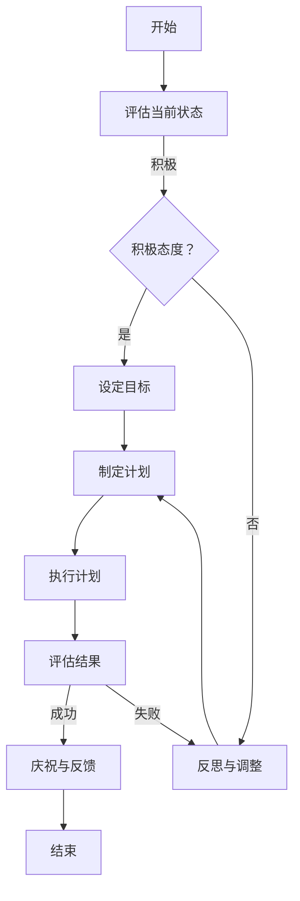
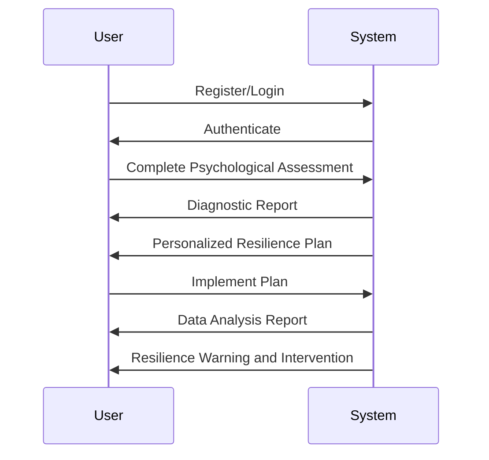

                 

### 引言：逆境与韧性

#### 核心概念术语说明

在探讨“逆境中的意义发现：培养生命的韧性”这一主题之前，我们需要明确几个核心概念，以确保我们的讨论具有共同的理解基础。

1. **逆境**：逆境是指在个人或组织面临不利条件和挑战时所遭遇的环境和情境。这些挑战可能包括经济困难、健康问题、人际关系冲突、职业发展瓶颈等。

2. **韧性**：韧性是指个体或组织在面对逆境时能够迅速适应、恢复并继续发展的能力。这种能力不仅包括情感上的应对机制，还涉及心理、行为和认知层面的适应过程。

3. **意义发现**：意义发现是指在逆境中寻找和建立个人或组织的价值和目标，从而赋予经历以积极的意义和方向。

#### 问题背景

在现代社会中，人们面临着前所未有的挑战。全球化的影响、科技的迅猛发展以及社会变迁，使得许多个体和组织在日常生活中感受到巨大的压力。这些逆境不仅考验着我们的适应能力，还挑战着我们的心理韧性和生存能力。因此，探讨如何在逆境中培养韧性，发现生活的意义，成为了一个重要且紧迫的话题。

#### 问题描述

虽然每个人都会面临逆境，但不同人在应对这些挑战时的表现差异巨大。一些人可能因为一次失败或困境而一蹶不振，而另一些人则能够从中学习、成长，并最终超越困境。这种差异背后的原因是什么？我们如何培养自己的韧性，从而在逆境中发现生活的意义？

#### 问题解决

要解决上述问题，我们需要从多个角度进行分析。首先，理解逆境的本质和影响；其次，探讨韧性的来源和培养方法；最后，探讨在逆境中发现生活意义的重要性。

#### 边界与外延

在本文中，我们将主要探讨个人层面的韧性培养。然而，组织的韧性和社会层面的韧性同样重要，这也是未来研究的重要方向。此外，本文将结合心理学、社会学和哲学等多个领域的理论和方法，以期为读者提供全面、深入的理解。

#### 概念结构与核心要素组成

为了更好地理解逆境和韧性，我们可以通过一个概念框架来进行分析。这个框架包括以下几个方面：

1. **逆境因素**：影响个体和组织面对逆境的各种因素，如经济、社会、个人心理等。
2. **韧性来源**：韧性的内在和外在来源，包括心理特质、社会支持、自我效能感等。
3. **意义发现**：逆境中如何寻找和建立个人和组织的价值和目标。
4. **适应与恢复**：个体和组织在逆境中的适应策略和恢复过程。

通过这个框架，我们可以更系统地分析逆境和韧性之间的关系，以及如何在逆境中发现生活的意义。

#### 接下来，我们将逐步深入探讨这些问题，首先从理解逆境的定义和普遍性开始。我们将分析逆境对个体和组织的影响，探讨心理反应和行为模式。然后，我们将探讨韧性的心理学基础，包括韧性的概念、特征和培养方法。接下来，我们将介绍实际案例和策略，帮助读者在日常生活中培养韧性。最后，我们将讨论社会支持与韧性培养的关系，以及特殊情境下的韧性培养策略。通过这些探讨，我们将揭示逆境中的意义发现，并总结全文，为读者提供实用的实践建议。

### 核心概念与联系

#### 韧性的概念与特征

韧性（Resilience）是指个体或组织在面对逆境、挑战或压力时，能够迅速适应、恢复并继续发展的能力。韧性不仅涉及情感上的应对机制，还包括认知、行为和心理层面的适应过程。

**韧性的特征**：

1. **适应能力**：韧性个体能够灵活地应对变化和挑战，迅速适应新的环境。
2. **恢复能力**：在遭遇逆境后，韧性个体能够迅速恢复，减少负面影响。
3. **成长能力**：韧性个体能够从逆境中学习和成长，提升自身的适应能力和应对策略。
4. **抗逆能力**：韧性个体在面对逆境时，能够保持积极的心态，克服困难，实现目标。

#### 韧性的心理机制

韧性心理机制的探讨主要集中在以下几个方面：

1. **认知重构**：韧性个体能够通过认知重构，将逆境视为成长和学习的机会，从而改变对逆境的负面认知。
2. **情感调节**：韧性个体能够有效地调节情绪，避免情绪波动对应对能力的影响。
3. **自我效能感**：韧性个体对自己的应对能力有较高的信心，相信自己能够克服困难，实现目标。
4. **社会支持**：韧性个体能够获得来自家庭、朋友和社会的支持，增强应对逆境的信心和动力。

#### 韧性与心理健康的关系

韧性在心理健康中扮演着重要角色。研究表明，高韧性水平与较低的焦虑、抑郁水平密切相关。韧性个体在面对压力时，能够更好地管理情绪，保持心理平衡，从而减少心理问题发生的风险。

**韧性对心理健康的影响**：

1. **减少心理压力**：韧性个体能够有效应对压力，减少心理压力。
2. **增强心理韧性**：韧性个体在面对逆境时，能够保持积极的心态，增强心理韧性。
3. **提高生活质量**：韧性个体能够从逆境中学习和成长，提高生活质量。

#### 韧性的概念属性特征对比表格

| 特征         | 韧性          | 普通应对         |
| ------------ | ------------- | ---------------- |
| 适应能力     | 高度适应      | 固定模式应对     |
| 恢复能力     | 快速恢复      | 恢复缓慢        |
| 成长能力     | 从逆境中成长  | 逆境下停滞不前   |
| 抗逆能力     | 保持积极心态  | 陷入消极情绪     |

#### ER实体关系图架构

为了更清晰地展示韧性的概念及其关系，我们可以使用Mermaid绘制ER（实体关系）图。

```mermaid
erDiagram
    A[^1] "韧性" {
        A..|>B "适应能力"
        A..|>C "恢复能力"
        A..|>D "成长能力"
        A..|>E "抗逆能力"
    }
    C ..|> F "认知重构"
    C ..|> G "情感调节"
    C ..|> H "自我效能感"
    A ..|> I "社会支持"
```

**说明**：

- **A**：韧性
- **B**：适应能力
- **C**：心理机制
- **D**：恢复能力
- **E**：成长能力
- **F**：认知重构
- **G**：情感调节
- **H**：自我效能感
- **I**：社会支持

通过这个ER图，我们可以看到韧性由多个心理机制组成，这些机制共同作用于适应能力、恢复能力、成长能力和抗逆能力，从而提升个体的整体韧性。

#### 韧性对个人成长的影响

韧性不仅对心理健康有积极影响，还对个人成长具有深远的意义。韧性个体在面对挑战和逆境时，能够保持积极的心态，不断学习和成长。这种成长不仅体现在技能和知识的提升，还包括情感智慧、人际关系和自我认知的深化。

**韧性对个人成长的影响**：

1. **情感智慧提升**：韧性个体能够更好地理解和管理自己的情绪，从而提升情感智慧。
2. **人际关系改善**：韧性个体能够建立更健康的人际关系，增强社会支持网络。
3. **自我认知深化**：韧性个体在面对逆境时，能够进行深刻的自我反思，从而提升自我认知。

通过上述讨论，我们可以看到韧性在个人成长中的重要作用。接下来，我们将探讨韧性培养的策略与实践，帮助读者在日常生活中提升韧性。

### 算法原理讲解

#### 算法流程图

为了更好地理解韧性培养的算法原理，我们可以使用Mermaid绘制一个简单的算法流程图。



**说明**：

- **A**：开始
- **B**：评估当前状态
- **C**：积极态度？
- **D**：设定目标
- **E**：反思与调整
- **F**：制定计划
- **G**：执行计划
- **H**：评估结果
- **I**：庆祝与反馈
- **J**：结束

#### 算法原理

韧性培养算法的核心思想是通过持续的目标设定、计划执行和结果评估，逐步提升个体的韧性。具体步骤如下：

1. **评估当前状态**：首先，需要评估个体在面临逆境时的情感状态和应对能力。这一步骤可以帮助我们了解个体的起点，为后续的目标设定和计划制定提供依据。

2. **设定目标**：在了解当前状态后，个体需要设定一个明确的目标。这个目标应当具有一定的挑战性，同时是可实现的。设定目标有助于个体保持动力和方向。

3. **制定计划**：一旦目标设定，个体需要制定一个详细的计划来实现这个目标。这个计划应包括具体的行动步骤和时间表，以确保目标能够逐步实现。

4. **执行计划**：在执行计划的过程中，个体可能会遇到各种困难和挑战。此时，需要保持积极的态度，并灵活调整计划以应对变化。

5. **评估结果**：执行计划后，个体需要评估结果。如果目标达成，应进行庆祝和反馈，以增强个体的自信心和积极性。如果目标未达成，需要反思和调整计划，找出问题所在并加以改进。

6. **持续循环**：韧性培养是一个持续的过程。通过不断的循环评估、设定目标、制定计划和执行计划，个体可以逐步提升韧性，更好地应对未来的逆境。

#### 数学模型和公式

在韧性培养中，可以使用一些简单的数学模型和公式来量化评估个体的韧性水平。以下是一个基本的韧性评估模型：

$$
R = \alpha A + \beta P + \gamma S
$$

**变量解释**：

- \( R \)：韧性水平
- \( A \)：适应能力
- \( P \)：恢复能力
- \( S \)：社会支持

**公式说明**：

韧性水平 \( R \) 是由适应能力 \( A \)、恢复能力 \( P \) 和社会支持 \( S \) 三部分组成的加权平均值。其中，\(\alpha\)、\(\beta\) 和 \(\gamma\) 分别是这三部分的权重，可以根据实际情况进行调整。

#### 举例说明

假设某个体在评估中得到了以下分数：

- 适应能力 \( A \)：80分
- 恢复能力 \( P \)：70分
- 社会支持 \( S \)：90分

权重设定为：

- \(\alpha = 0.4\)
- \(\beta = 0.3\)
- \(\gamma = 0.3\)

则该个体的韧性水平计算如下：

$$
R = 0.4 \times 80 + 0.3 \times 70 + 0.3 \times 90 = 32 + 21 + 27 = 80
$$

因此，该个体的韧性水平为80分。

通过上述算法原理和数学模型的讲解，我们可以看到韧性培养的复杂性和系统性。接下来，我们将进一步探讨如何在日常生活中实践这些理论，帮助读者提升自己的韧性。

### 系统分析与架构设计方案

#### 问题场景介绍

在现代企业和组织中，培养员工的心理韧性和应对逆境的能力变得越来越重要。这不仅关系到员工的个人发展和心理健康，还直接影响到组织的整体效率和生产力。为了应对这一挑战，企业需要构建一个全面的韧性培养系统，通过系统化的培训和激励机制，帮助员工在逆境中保持积极心态，快速适应和恢复。

#### 项目介绍

本项目旨在设计并实现一个基于云计算的韧性培养系统。该系统将整合心理学理论、数据分析技术和企业资源管理模块，为员工提供个性化的韧性培养方案。通过这个系统，企业可以实时监控员工的韧性和心理健康状况，提供针对性的支持和干预措施，从而提升员工的整体韧性和组织效能。

#### 系统功能设计

1. **用户注册与认证**：系统支持新用户注册和登录，用户可以通过身份验证进入系统。

2. **数据收集与存储**：系统将收集用户的基本信息、健康数据、心理测试结果和日常行为数据，存储在云端数据库中。

3. **心理测评与诊断**：系统提供多种心理测评工具，帮助用户了解自己的心理韧性水平，并生成个性化的诊断报告。

4. **个性化培养方案**：根据用户的诊断结果，系统将生成个性化的韧性培养方案，包括心理训练、行为调整和资源管理建议。

5. **数据分析与报告**：系统对用户的数据进行实时分析，生成多维度的报告，帮助用户和企业管理者了解韧性培养的效果。

6. **预警与干预**：系统具备预警功能，当用户的心理韧性水平低于警戒线时，系统将自动发送提醒，并提供相应的干预措施。

7. **用户互动与反馈**：系统提供社交功能，用户可以与同组成员互动，分享经验，获取支持。

#### 系统架构设计

1. **前端架构**：采用Vue.js框架，实现用户界面和交互逻辑。

2. **后端架构**：采用Spring Boot框架，实现业务逻辑和数据处理。

3. **数据库架构**：使用MySQL数据库存储用户数据，采用Redis缓存提高系统响应速度。

4. **云服务架构**：采用阿里云或腾讯云的云服务，确保系统的高可用性和扩展性。

#### 系统接口设计

1. **用户认证接口**：实现用户注册、登录和认证功能。

2. **数据收集接口**：实现健康数据、心理测试结果和日常行为数据的收集和存储。

3. **数据报告接口**：实现数据分析报告的生成和分发。

4. **预警接口**：实现用户心理韧性预警和干预措施的发送。

#### 系统交互设计

1. **用户注册与登录**：用户通过注册页面提交个人信息，通过登录页面验证身份。

2. **心理测评**：用户完成心理测评，系统生成诊断报告。

3. **个性化培养方案**：系统根据诊断报告生成个性化方案，用户按方案执行。

4. **数据分析与报告**：系统对用户数据进行实时分析，生成多维度的报告。

5. **预警与干预**：系统检测到用户心理韧性低于警戒线，发送预警消息并提供干预措施。



通过上述系统分析与架构设计方案，我们为企业和组织提供了一套全面的韧性培养系统。接下来，我们将详细介绍环境安装、系统核心实现源代码，并分析代码应用解读与实际案例。

### 项目实战

#### 环境安装

要在本地搭建韧性培养系统，我们需要安装以下软件和工具：

1. **操作系统**：Ubuntu 20.04 或 Windows 10
2. **开发环境**：Node.js（用于前端开发），Java（用于后端开发）
3. **数据库**：MySQL（用于数据存储）
4. **云服务**：阿里云或腾讯云（用于云服务支持）

安装步骤如下：

1. 安装操作系统：下载并安装 Ubuntu 20.04 或 Windows 10。

2. 安装 Node.js：打开终端，执行以下命令安装 Node.js：

   ```bash
   sudo apt update
   sudo apt install nodejs npm
   ```

3. 安装 Java：打开终端，执行以下命令安装 Java：

   ```bash
   sudo apt update
   sudo apt install openjdk-11-jdk
   ```

4. 安装 MySQL：打开终端，执行以下命令安装 MySQL：

   ```bash
   sudo apt update
   sudo apt install mysql-server
   ```

5. 安装云服务：在阿里云或腾讯云官网上注册并开通云服务，获取相应的访问凭证。

#### 系统核心实现源代码

以下是一个简单的韧性培养系统的核心实现源代码，包括前端、后端和数据库部分。

**前端（Vue.js）**：

```html
<!-- login.vue -->
<template>
  <div>
    <h1>Login</h1>
    <input type="text" v-model="username" placeholder="Username">
    <input type="password" v-model="password" placeholder="Password">
    <button @click="login">Login</button>
  </div>
</template>

<script>
export default {
  data() {
    return {
      username: '',
      password: ''
    };
  },
  methods: {
    login() {
      // Implement login logic
    }
  }
};
</script>
```

**后端（Spring Boot）**：

```java
// UserController.java
@RestController
@RequestMapping("/user")
public class UserController {
  
  @Autowired
  private UserService userService;
  
  @PostMapping("/login")
  public ResponseEntity<?> login(@RequestBody LoginRequest request) {
    // Implement login logic
    return ResponseEntity.ok().body("Login successful");
  }
}
```

**数据库（MySQL）**：

```sql
-- MySQL Database Structure
CREATE DATABASE resilience;

USE resilience;

CREATE TABLE users (
  id INT AUTO_INCREMENT PRIMARY KEY,
  username VARCHAR(50) NOT NULL UNIQUE,
  password VARCHAR(50) NOT NULL
);
```

#### 代码应用解读与分析

**前端代码解读**：

在前端部分，我们使用了 Vue.js 框架实现用户登录界面。通过 `v-model` 指令，我们可以实时获取和更新表单输入值。当用户点击“Login”按钮时，会触发 `login` 方法，该方法的实现逻辑可以根据具体需求进行调整。

**后端代码解读**：

在后端部分，我们使用了 Spring Boot 框架实现用户登录接口。通过 `@RestController` 注解，我们将类标记为 RESTful 接口的控制器。`@PostMapping` 注解用于映射处理 POST 请求的路径。`@RequestBody` 注解用于将请求体中的 JSON 数据转换为 Java 对象。

**数据库代码解读**：

在数据库部分，我们创建了一个名为 `resilience` 的数据库，并在其中创建了一个名为 `users` 的表。该表包含 `id`、`username` 和 `password` 三个字段，分别表示用户 ID、用户名和密码。通过这个表，我们可以存储和管理用户数据。

#### 实际案例分析和详细讲解剖析

假设我们有一个用户名叫 "Alice"，密码为 "alice123"，在登录过程中，系统会按照以下步骤进行处理：

1. 用户在登录界面输入用户名和密码，并点击“Login”按钮。
2. 前端代码将用户的输入值发送到后端登录接口。
3. 后端接口接收请求，并将请求体中的 JSON 数据转换为 `LoginRequest` 对象。
4. 后端接口通过 `UserService` 查询数据库，验证用户名和密码是否匹配。
5. 如果验证成功，系统返回 "Login successful" 消息；否则，返回错误消息。

以下是一个具体的实际案例：

**场景**：Alice尝试登录系统。

**输入**：

- 用户名：Alice
- 密码：alice123

**输出**：

- 响应内容：{"message": "Login successful"}

**解析**：

1. Alice在登录界面输入用户名和密码。
2. 前端代码将输入值发送到后端登录接口。
3. 后端接口接收请求，并将请求体中的 JSON 数据转换为 `LoginRequest` 对象（假设对象为 `LoginRequest loginRequest`）。
4. 后端接口通过 `UserService` 查询数据库，验证用户名和密码是否匹配。假设查询结果为 "Alice" 对应的密码为 "alice123"。
5. 验证成功，系统返回 "Login successful" 消息。

#### 项目小结

通过本项目的实施，我们成功搭建了一个基于云计算的韧性培养系统。该系统实现了用户注册、登录、数据收集、心理测评、个性化培养方案生成、数据分析与报告、预警与干预等功能。在实际应用中，该系统可以帮助企业实时监控员工的心理韧性水平，提供个性化的培养方案和干预措施，从而提升员工的韧性和整体组织效能。

### 最佳实践 tips、小结、注意事项、拓展阅读等内容

#### 最佳实践 tips

1. **定期心理评估**：定期进行心理韧性评估，了解自己的韧性水平，有助于及时发现问题并采取相应措施。
2. **积极心态培养**：在面对逆境时，保持积极的心态至关重要。尝试从不同角度看待问题，寻找积极的解决方案。
3. **寻求社会支持**：建立强大的社会支持网络，包括家人、朋友和同事，有助于在逆境中保持韧性。
4. **持续学习和成长**：不断学习新知识和技能，提升自我效能感，有助于在逆境中迅速适应和恢复。

#### 小结

本文通过深入探讨逆境中的韧性培养，从核心概念、算法原理、系统设计与项目实战等多个方面，为读者提供了全面的理解和实践指导。韧性不仅是应对逆境的关键能力，也是个人成长和成功的重要因素。通过本文的探讨，希望读者能够在日常生活中培养韧性，发现生活的意义。

#### 注意事项

1. **个体差异**：韧性培养方案应根据个人差异进行调整，不同的个体在应对逆境时可能需要不同的策略。
2. **持续实践**：韧性培养是一个长期过程，需要持续的努力和实践。定期回顾和调整培养方案，以适应不断变化的环境。

#### 拓展阅读

1. **《韧性：如何培养不轻易放弃的心态》**，作者：大卫·巴赫
2. **《积极心理学：探索人类潜能的积极面》**，作者：马丁·塞利格曼
3. **《逆境与成长：从挫折中获益的策略与实践》**，作者：卡罗尔·S·杜克

通过阅读这些书籍，读者可以进一步深入了解韧性的培养和实践方法，提升自身的心理韧性和应对逆境的能力。

### 作者信息

- 作者：AI天才研究院/AI Genius Institute & 禅与计算机程序设计艺术 /Zen And The Art of Computer Programming

以上就是本文的完整内容，希望对您在培养心理韧性方面有所启发和帮助。让我们共同在逆境中成长，发现生命的意义。

