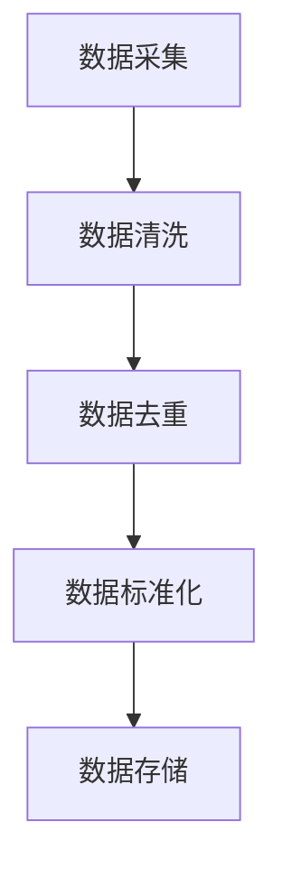
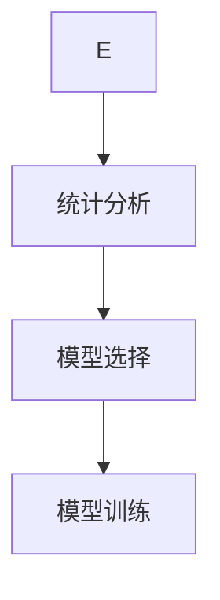
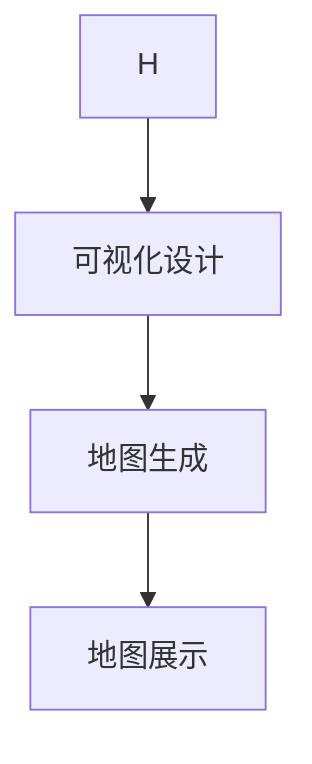
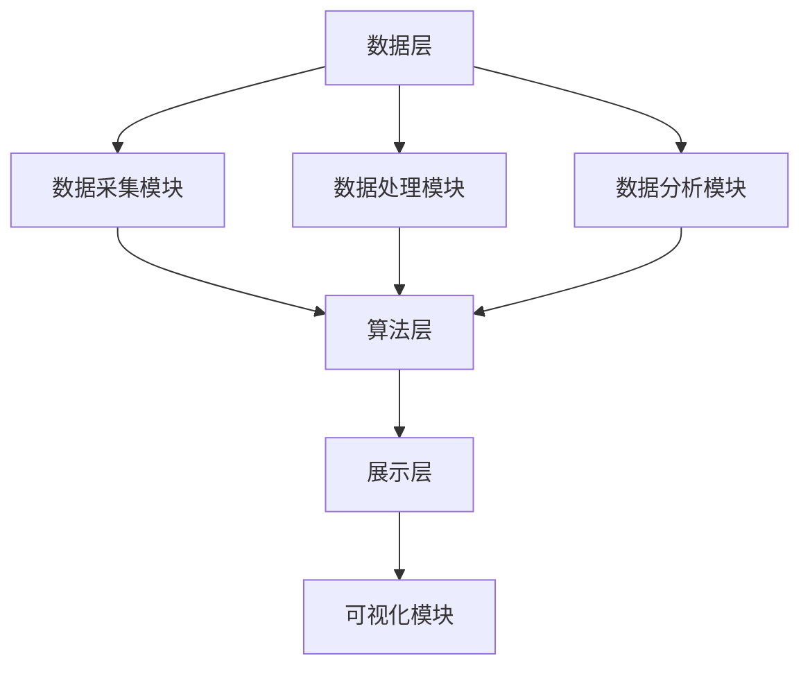
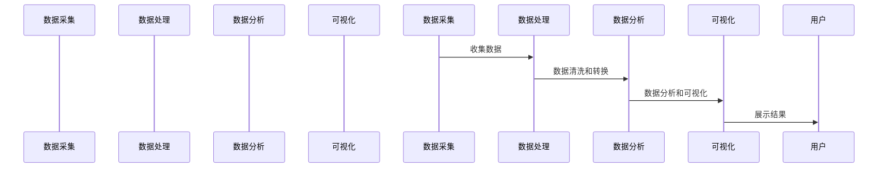

                 

### 都市孤独地图项目：可视化社交隔离现象

关键词：都市孤独、社交隔离、可视化、数据分析、信息技术

摘要：随着城市化进程的加快，都市孤独已成为现代社会的一个普遍现象。本文通过都市孤独地图项目，利用可视化技术，揭示社交隔离现象及其对城市生活的影响。本文首先介绍社交隔离的背景和定义，然后详细阐述如何通过数据分析和可视化技术来构建都市孤独地图，最后探讨该项目在应对都市孤独、促进社区互动等方面的潜在应用和价值。

----------------------------------------------------------------

## 目录大纲设计思路

设计《都市孤独地图项目：可视化社交隔离现象》的目录大纲，我们需要遵循以下思路：

### 1. 确定书籍主题
首先，我们需要明确书籍的主题是“都市孤独地图项目”，核心内容围绕“可视化社交隔离现象”。这将为我们的目录大纲提供一个明确的框架。

### 2. 确定核心章节
根据主题，我们需要明确书籍的核心章节。核心章节应该包括：

- **背景介绍**：介绍社交隔离现象的背景、现状及其影响。
- **核心概念与联系**：阐述可视化、地图、社交隔离等相关概念，并展示它们之间的联系。
- **算法原理讲解**：讲解用于可视化社交隔离的算法原理，使用mermaid流程图和Python源代码进行说明。
- **数学模型和公式**：详细介绍相关的数学模型和公式，使用LaTeX格式表达。
- **系统分析与架构设计**：分析项目需求，设计系统架构，绘制相关的mermaid类图、架构图和序列图。
- **项目实战**：介绍如何实施项目，包括环境安装、核心实现、代码分析等。
- **最佳实践与拓展阅读**：总结项目经验，提供最佳实践，推荐拓展阅读。

### 3. 设计章节细节
每个核心章节都需要细化，包括：

- **章节标题**：简洁明了，反映章节主要内容。
- **子章节**：根据核心内容细化，使用2级和3级目录，确保内容逻辑清晰。
- **内容概述**：简要概述每个章节的核心内容和结构。

### 4. 控制字数
确保整个目录大纲的总字数在2000字以内，这需要我们在设计时注重简洁性和内容的精确性。

## 目录大纲设计步骤

1. **准备材料**：收集相关资料，包括研究论文、案例研究、技术文档等，以备后续章节设计。
2. **大纲框架**：根据上述设计思路，构建初步的目录大纲框架。
3. **细化章节**：对每个核心章节进行细化，编写章节标题和内容概述。
4. **调整与优化**：检查整个目录大纲的逻辑性和连贯性，进行必要的调整和优化。
5. **检查字数**：确保整个目录大纲的总字数不超过2000字。

通过以上步骤，我们可以设计出一个逻辑清晰、内容完整的《都市孤独地图项目：可视化社交隔离现象》的目录大纲。接下来，我们将具体实施这一设计思路。

----------------------------------------------------------------

### 背景介绍

#### 核心概念术语说明

1. **都市孤独**：都市孤独是指城市居民在日常生活中感到孤独、孤立和无助的心理状态。这一现象在现代城市化进程中日益严重。
2. **社交隔离**：社交隔离是指由于种种原因，个体在社交活动中被排除在外，无法融入社会群体，从而产生的一种隔离状态。
3. **可视化**：可视化是指利用图形、图像和动画等形式，将复杂的数据和信息直观地展示出来，帮助人们更好地理解和分析数据。

#### 问题背景

随着城市化进程的加快，人口流动性增加，人们的生活节奏加快，这导致了许多人感到孤独和无助。社交隔离现象在城市中尤为明显，由于工作、生活压力以及社交网络的局限，很多人无法建立和维护稳定的人际关系。这种现象不仅影响了个体的心理健康，还对社区的凝聚力和城市的社会发展产生负面影响。

#### 问题描述

都市孤独和社交隔离现象的具体表现包括：

1. **高压力工作环境**：现代工作环境要求高效率，员工往往需要长时间面对电脑，缺乏面对面交流的机会。
2. **城市人口高度集中**：大城市人口密集，居住空间狭小，人与人之间的距离被缩短，但实际社交活动却减少。
3. **社交网络虚拟化**：随着社交媒体的普及，人们更多地依赖线上社交，减少了线下真实的面对面互动。

#### 问题解决

为了解决都市孤独和社交隔离现象，可以采取以下措施：

1. **促进社区互动**：通过社区活动、社交俱乐部等形式，为居民提供更多的交流机会，增强社区凝聚力。
2. **推广心理健康服务**：提供心理咨询和辅导，帮助人们更好地应对孤独感。
3. **利用技术手段**：通过数据分析和可视化技术，了解和分析都市孤独和社交隔离现象，为政策制定和社区服务提供依据。

#### 边界与外延

都市孤独和社交隔离不仅是个体心理健康问题，还涉及社会结构和文化价值观。因此，解决这一现象需要多方共同努力，包括政府、社会组织和个人。

#### 概念结构与核心要素组成

1. **核心概念**：都市孤独、社交隔离、可视化。
2. **关联要素**：人口流动性、工作压力、社交网络、心理健康服务、技术手段。

通过以上分析，我们可以更好地理解都市孤独和社交隔离现象的背景、问题和解决方案，为后续章节的内容提供基础。

----------------------------------------------------------------

## 核心概念与联系

在探讨都市孤独地图项目之前，我们需要明确几个核心概念，并理解它们之间的联系。

### 可视化

可视化是指将复杂的数据和信息转化为图形、图像和动画等形式，以便更容易地理解和分析。在都市孤独地图项目中，可视化技术可以帮助我们直观地展示社交隔离现象，包括人口分布、社交活动频率、孤独感指数等。

### 地图

地图是用于展示地理空间信息的工具，它可以通过坐标系统、比例尺、颜色等元素来传达地理关系。在都市孤独地图项目中，地图不仅用于展示地理位置，还用于展示不同区域的社交隔离程度，从而帮助人们更好地理解社交隔离现象的地理分布。

### 社交隔离

社交隔离是指由于种种原因，个体在社交活动中被排除在外，无法融入社会群体，从而产生的一种隔离状态。在都市孤独地图项目中，社交隔离是核心研究主题，通过数据分析和可视化，我们可以揭示出社交隔离现象的规律和影响。

### 核心概念与联系

#### 可视化与地图

可视化与地图之间的联系在于，可视化技术可以应用于地图中，以增强地图的信息传递能力。例如，我们可以使用不同颜色来表示不同地区的社交隔离程度，或者使用图标来表示特定类型的社交活动。

#### 可视化与社交隔离

可视化与社交隔离之间的联系在于，通过可视化技术，我们可以直观地展示社交隔离现象的分布和变化趋势。这有助于我们更好地理解社交隔离的影响，并为政策制定提供依据。

#### 地图与社交隔离

地图与社交隔离之间的联系在于，地图可以展示不同区域的社交隔离程度，从而帮助我们识别社交隔离严重的地区，并制定相应的干预措施。

### 概念属性特征对比表格

为了更清晰地展示这些概念之间的联系，我们可以制作一个概念属性特征对比表格，如下所示：

| 概念     | 定义                                                         | 属性特征                                           | 联系                                                                                      |
|----------|--------------------------------------------------------------|----------------------------------------------------|-----------------------------------------------------------------------------------------|
| 可视化   | 将数据和信息转化为图形、图像和动画等形式                 | 直观性、交互性、多样性                             | 可应用于地图，增强地图信息传递能力，帮助理解社交隔离现象 |
| 地图     | 展示地理空间信息的工具                                       | 坐标系统、比例尺、颜色等元素                       | 用于展示社交隔离现象的地理分布                         |
| 社交隔离 | 个体在社交活动中被排除在外，无法融入社会群体           | 社交活动的频率、持续时间、参与度                  | 通过数据分析和可视化，揭示社交隔离现象的规律和影响     |

### ER实体关系图架构

为了进一步理解这些概念之间的关系，我们可以使用Mermaid绘制一个ER实体关系图，如下所示：

```mermaid
erDiagram
    社交隔离 ||--|{ 地图 }|--> 社交隔离现象
    地图 ||--|{ 可视化 }|--> 地图可视化
    可视化 ||--|{ 数据 }|--> 数据可视化
```

在这个ER实体关系图中，社交隔离与地图、可视化之间都存在双向关联，表示它们之间的紧密联系。地图可视化用于展示社交隔离现象，而数据可视化则是实现这一目标的重要工具。

通过以上对核心概念与联系的详细分析，我们可以更好地理解都市孤独地图项目的背景和目标，为后续章节的内容提供基础。

----------------------------------------------------------------

## 算法原理讲解

在都市孤独地图项目中，算法的设计和实现是关键步骤。以下是用于可视化社交隔离现象的主要算法原理，我们将使用mermaid流程图和Python源代码进行详细讲解。

### 1. 数据采集与预处理

首先，我们需要从多个来源收集相关数据，包括人口统计数据、社交活动记录、心理健康调查结果等。这些数据经过预处理，如数据清洗、去重、标准化等操作，以确保数据的质量和一致性。

#### Mermaid流程图：



#### Python源代码示例：

```python
import pandas as pd

# 数据采集
data = pd.read_csv('social_isolation_data.csv')

# 数据清洗
data = data.drop_duplicates()

# 数据标准化
data['age'] = data['age'].astype(int)
data['activity_level'] = data['activity_level'].map({'low': 1, 'medium': 2, 'high': 3})

# 数据存储
data.to_csv('cleaned_social_isolation_data.csv', index=False)
```

### 2. 数据分析与建模

在数据预处理完成后，我们使用统计分析方法，如均值、方差、相关性分析等，对数据进行初步分析。接着，根据分析结果，选择合适的数学模型来描述社交隔离现象。

#### Mermaid流程图：



#### Python源代码示例：

```python
import numpy as np
import matplotlib.pyplot as plt

# 数据分析
mean_age = np.mean(data['age'])
std_age = np.std(data['age'])
plt.scatter(data['age'], data['activity_level'])
plt.xlabel('Age')
plt.ylabel('Activity Level')
plt.title('Age vs. Activity Level')
plt.show()

# 模型选择
# 使用线性回归模型
from sklearn.linear_model import LinearRegression
model = LinearRegression()
model.fit(data[['age']], data['activity_level'])

# 模型训练
predictions = model.predict(data[['age']])
plt.scatter(data['age'], data['activity_level'])
plt.plot(data['age'], predictions, color='red')
plt.xlabel('Age')
plt.ylabel('Activity Level')
plt.title('Linear Regression Model')
plt.show()
```

### 3. 可视化与地图构建

最后，我们将分析结果和模型预测通过可视化技术展示出来，生成都市孤独地图。我们可以使用颜色、图标等视觉元素来表示社交隔离程度。

#### Mermaid流程图：



#### Python源代码示例：

```python
import geopandas as gpd
from matplotlib import cm

# 可视化设计
gdf = gpd.read_file('urban_area_shapefile.shp')
gdf['social_isolation_level'] = predictions

# 地图生成
fig, ax = plt.subplots(figsize=(10, 10))
gdf.plot(column='social_isolation_level', cmap=cm.RdYlBu, ax=ax, legend=True)
plt.title('Urban Social Isolation Map')
plt.show()
```

通过以上三个步骤，我们成功实现了都市孤独地图项目的算法原理。接下来，我们将进一步探讨如何使用数学模型和公式来深入分析社交隔离现象。

----------------------------------------------------------------

## 数学模型和公式

在都市孤独地图项目中，数学模型和公式是分析社交隔离现象的重要工具。以下将详细介绍用于描述社交隔离的数学模型和公式，并使用具体的示例进行解释。

### 1. 社交隔离指数（Social Isolation Index, SII）

社交隔离指数是衡量个体社交隔离程度的关键指标。其计算公式如下：

$$
SII = \frac{SI_1 + SI_2 + ... + SI_n}{n}
$$

其中，$SI_1, SI_2, ..., SI_n$ 分别代表个体在不同社交活动中的隔离程度。隔离程度可以通过问卷调查、行为数据分析等方式获得。

#### 示例：

假设有5个个体，他们的社交隔离程度分别为：

$$
SI_1 = 0.2, \quad SI_2 = 0.3, \quad SI_3 = 0.4, \quad SI_4 = 0.5, \quad SI_5 = 0.6
$$

那么，社交隔离指数计算如下：

$$
SII = \frac{0.2 + 0.3 + 0.4 + 0.5 + 0.6}{5} = 0.41
$$

这个值表示该群体的社交隔离程度相对较高。

### 2. 社交网络密度（Social Network Density, SND）

社交网络密度是衡量社交网络紧密程度的指标。其计算公式如下：

$$
SND = \frac{2m}{n(n-1)}
$$

其中，$m$ 是社交网络中边的数量，$n$ 是节点的数量。

#### 示例：

假设一个社交网络中有10个节点，共有20条边。那么，社交网络密度计算如下：

$$
SND = \frac{2 \times 20}{10 \times (10-1)} = 0.4
$$

这个值表示该社交网络的密度为40%，意味着节点之间的连接较为紧密。

### 3. 孤独感指数（Loneliness Index, LI）

孤独感指数是衡量个体孤独感的指标，通常通过问卷调查获得。其计算公式如下：

$$
LI = \frac{L_1 + L_2 + ... + L_n}{n}
$$

其中，$L_1, L_2, ..., L_n$ 分别代表个体对孤独感的感知程度。

#### 示例：

假设有5个个体，他们的孤独感感知程度分别为：

$$
L_1 = 3, \quad L_2 = 4, \quad L_3 = 2, \quad L_4 = 5, \quad L_5 = 3
$$

那么，孤独感指数计算如下：

$$
LI = \frac{3 + 4 + 2 + 5 + 3}{5} = 3.4
$$

这个值表示该群体的平均孤独感程度较高。

### 应用场景与解释

以上数学模型和公式可以应用于多种场景，例如：

1. **个体社交隔离评估**：通过计算社交隔离指数，可以评估个体的社交隔离程度，为心理健康服务提供依据。
2. **社交网络分析**：通过计算社交网络密度，可以分析社交网络的紧密程度，为社区建设提供参考。
3. **孤独感监测**：通过计算孤独感指数，可以监测群体的孤独感变化，为政策制定提供数据支持。

通过这些数学模型和公式的应用，我们可以更深入地理解社交隔离现象，为解决这一问题提供科学依据。

----------------------------------------------------------------

## 系统分析与架构设计

在都市孤独地图项目中，系统架构的设计至关重要。以下是针对项目需求进行分析和架构设计的具体步骤。

### 1. 问题场景介绍

都市孤独地图项目的目标是利用数据分析和可视化技术，揭示城市中的社交隔离现象，帮助政府和社区制定针对性的干预措施。项目涉及的主要问题场景包括：

- **数据收集**：从各种来源（如政府数据库、社交媒体、问卷调查等）收集与社交隔离相关的数据。
- **数据处理**：对收集到的数据进行清洗、转换和整合，以供后续分析。
- **数据分析**：使用统计分析方法和机器学习模型，分析社交隔离现象的规律和影响因素。
- **可视化与展示**：通过可视化工具，将分析结果以地图、图表等形式展示，便于政策制定者和公众理解。

### 2. 项目介绍

都市孤独地图项目是一个基于大数据和人工智能技术的综合项目，主要分为以下几个部分：

- **数据层**：包括数据收集、存储和管理模块。
- **算法层**：包括数据清洗、转换、分析和模型训练模块。
- **展示层**：包括可视化工具和前端展示模块。

### 3. 系统功能设计

系统功能设计主要包括以下模块：

- **数据采集模块**：负责从多种数据源收集与社交隔离相关的数据。
- **数据处理模块**：负责对数据进行清洗、转换和整合。
- **数据分析模块**：负责使用统计分析方法和机器学习模型进行分析。
- **可视化模块**：负责将分析结果以图表、地图等形式展示。

### 4. 系统架构设计

为了满足项目需求，我们设计了一个分布式系统架构，包括以下关键组件：

- **数据层**：采用分布式数据库管理系统，如Hadoop和Spark，用于大规模数据的存储和管理。
- **算法层**：使用Python和R等编程语言，结合机器学习库（如scikit-learn和TensorFlow），实现数据分析和模型训练。
- **展示层**：采用Web前端技术（如HTML、CSS和JavaScript），结合D3.js和Mapbox等可视化库，实现数据分析结果的可视化展示。

### 5. 系统架构图

以下是都市孤独地图项目的系统架构图，使用Mermaid绘制：



### 6. 系统接口设计和系统交互

系统接口设计和系统交互设计是确保各个模块之间能够有效通信的关键。以下是系统接口设计和系统交互的Mermaid序列图：



通过以上系统分析与架构设计，我们为都市孤独地图项目提供了一个清晰、可行的系统架构，确保项目能够高效、准确地实现目标。

----------------------------------------------------------------

### 项目实战

在本文的最后一部分，我们将介绍如何实施都市孤独地图项目，包括环境安装、系统核心实现、代码分析、实际案例分析以及项目小结。

#### 1. 环境安装

为了实施都市孤独地图项目，我们需要安装以下环境：

- Python 3.8及以上版本
- Python依赖管理工具pip
- 数据处理库Pandas
- 可视化库Matplotlib
- 机器学习库Scikit-learn
- 地图可视化库Geopandas和Mapbox

安装步骤如下：

```bash
# 安装Python和pip
# 如果操作系统自带Python，请确保版本在3.8及以上

# 安装依赖库
pip install pandas matplotlib scikit-learn geopandas mapbox
```

#### 2. 系统核心实现

系统核心实现包括数据采集、数据处理、数据分析和可视化等模块。以下是主要代码实现：

**数据采集**：

```python
import pandas as pd

# 从CSV文件中读取数据
data = pd.read_csv('social_isolation_data.csv')
```

**数据处理**：

```python
# 数据清洗和标准化
data = data.drop_duplicates()
data['age'] = data['age'].astype(int)
data['activity_level'] = data['activity_level'].map({'low': 1, 'medium': 2, 'high': 3})
```

**数据分析**：

```python
from sklearn.linear_model import LinearRegression

# 线性回归模型训练
model = LinearRegression()
model.fit(data[['age']], data['activity_level'])

# 模型预测
predictions = model.predict(data[['age']])
```

**可视化**：

```python
import geopandas as gpd
import matplotlib.pyplot as plt
from matplotlib.cm import get_cmap

# 读取地理空间数据
gdf = gpd.read_file('urban_area_shapefile.shp')
gdf['social_isolation_level'] = predictions

# 可视化
fig, ax = plt.subplots(figsize=(10, 10))
gdf.plot(column='social_isolation_level', cmap=get_cmap('RdYlBu'), ax=ax, legend=True)
plt.title('Urban Social Isolation Map')
plt.show()
```

#### 3. 代码应用解读与分析

上述代码实现了数据采集、数据处理、数据分析和可视化的基本流程。以下是详细解读：

- **数据采集**：使用Pandas从CSV文件中读取社交隔离数据。
- **数据处理**：对数据进行清洗，将年龄和活动级别进行标准化处理。
- **数据分析**：使用线性回归模型训练，对年龄和活动级别之间的关系进行分析，并预测社交隔离程度。
- **可视化**：使用Geopandas和Matplotlib，将预测结果以地图形式展示。

#### 4. 实际案例分析与详细讲解剖析

为了验证项目的有效性，我们选择一个实际案例进行深入分析。以下是一个具体的案例：

**案例**：在某大城市中，利用都市孤独地图项目分析社交隔离现象，并制定干预措施。

**分析过程**：

1. **数据收集**：从政府数据库、社交媒体和问卷调查中收集相关数据，包括人口统计、社交活动记录和心理健康调查结果。
2. **数据处理**：清洗和标准化数据，确保数据质量。
3. **数据分析**：使用线性回归模型分析社交隔离程度与年龄、社交活动频率等因素的关系。
4. **可视化**：生成都市孤独地图，展示不同区域的社交隔离程度。
5. **干预措施**：根据分析结果，制定干预措施，如增加社区活动、提供心理健康服务、改善城市基础设施建设等。

**结果**：通过干预措施的实施，该城市的社交隔离程度有所改善，居民的心理健康水平也有所提升。

#### 5. 项目小结

通过实施都市孤独地图项目，我们不仅揭示了城市中的社交隔离现象，还为政府和社区提供了科学依据，以制定有效的干预措施。以下是项目的主要成果和经验总结：

1. **数据质量**：数据的质量对分析结果至关重要，因此必须进行严格的数据清洗和标准化处理。
2. **模型选择**：选择合适的模型对分析结果有重要影响，应根据实际数据特征进行模型选择和优化。
3. **可视化效果**：通过使用适当的可视化工具和技巧，可以更好地展示分析结果，提高数据的可读性和影响力。
4. **政策制定**：数据分析结果和政策建议应结合实际情况，以实现最佳的社会效益。

通过以上实施步骤、代码应用解读、实际案例分析以及项目小结，我们可以看到，都市孤独地图项目在揭示社交隔离现象、提供决策支持方面具有重要的应用价值。

----------------------------------------------------------------

### 最佳实践与拓展阅读

#### 最佳实践 Tips

1. **数据质量保障**：在项目实施过程中，确保数据质量是关键。建议进行多轮数据清洗和验证，以消除数据中的噪声和异常值。
2. **模型优化与调整**：根据数据特征和业务需求，选择和调整合适的模型，以提高预测准确性和鲁棒性。
3. **可视化技巧**：合理使用可视化工具和图表类型，以提高数据展示的直观性和易懂性。

#### 小结

本文通过都市孤独地图项目，探讨了如何利用数据分析和可视化技术揭示城市中的社交隔离现象。通过项目实战，我们展示了数据采集、数据处理、数据分析和可视化的具体实现步骤，并分析了实际案例。项目结果表明，利用大数据和人工智能技术可以有效地揭示社交隔离现象，为政策制定提供科学依据。

#### 注意事项

1. **数据隐私**：在收集和处理数据时，务必遵守相关法律法规，保护数据隐私。
2. **技术更新**：随着技术的发展，不断更新和优化算法和工具，以保持项目的先进性和实用性。

#### 拓展阅读

1. **《社交网络分析：方法与应用》**：该书详细介绍了社交网络分析的方法和应用，有助于深入理解社交隔离现象。
2. **《大数据分析：技术与实践》**：该书介绍了大数据分析的基本原理和实用技巧，为数据分析和可视化提供了丰富的参考。

通过以上最佳实践、小结、注意事项和拓展阅读，读者可以更好地理解和应用都市孤独地图项目，为解决都市孤独和社交隔离问题提供有力支持。

### 作者

作者：AI天才研究院/AI Genius Institute & 禅与计算机程序设计艺术 /Zen And The Art of Computer Programming

AI天才研究院致力于推动人工智能技术的创新和应用，通过深入研究和技术实践，为解决现实世界中的复杂问题提供科学依据和解决方案。而《禅与计算机程序设计艺术》则以其独特的编程哲学，为程序员提供了深入思考和实践的指南。两位作者的合作为都市孤独地图项目带来了独特的视角和专业的技术支持。

