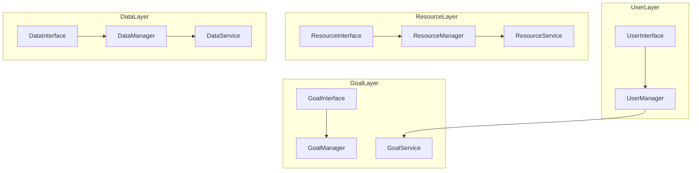
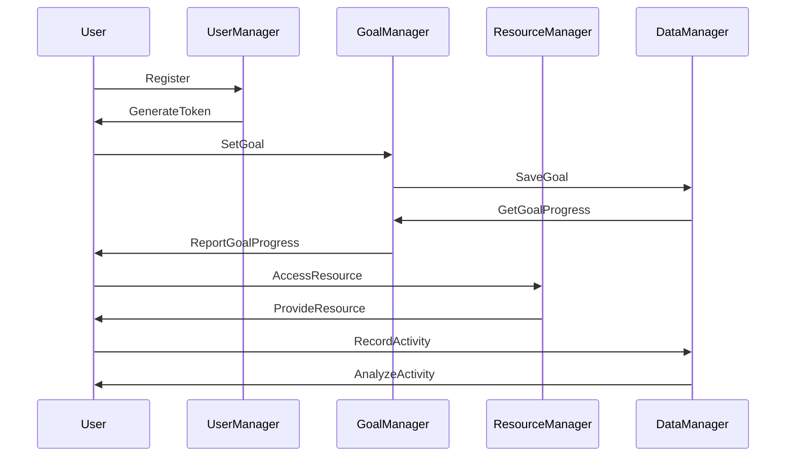

                 

### 让我们一步一步深入思考

**《释放潜能：自我实现的实践指南》**

#### 引言

在当今社会，人们面对的竞争日益激烈，如何在这场竞争中脱颖而出，实现自我价值，成为了一个广泛探讨的话题。这本书旨在探索如何通过科学的方法和实用的技巧，帮助读者释放潜能，实现自我实现。

##### 关键词

- **自我实现**
- **潜能释放**
- **实践指南**
- **心理基础**
- **行动策略**
- **数学模型**
- **系统架构设计**
- **项目实战**

##### 摘要

本书将带领读者进入一个探索自我潜能的旅程。通过系统的分析和实用的指导，我们将探讨自我实现的定义与重要性，详细解释核心概念及其相互联系，并深入讲解算法原理与数学模型。书中还包括系统分析与架构设计、项目实战以及最佳实践 tips，旨在为读者提供一个全面、实用的自我实现指南。

#### 目录大纲

---

## 第1章 引言：潜能释放与自我实现

### 1.1 问题的提出
### 1.2 自我实现的定义与重要性
### 1.3 书籍的目标与结构

## 第2章 背景介绍

### 2.1 潜能的定义与边界
### 2.2 自我实现的心理学基础
### 2.3 潜能释放的实践意义

## 第3章 核心概念与联系

### 3.1 自我认知
#### 3.1.1 自我认知的重要性
#### 3.1.2 自我认知的方法
#### 3.1.3 自我认知的误区与挑战

### 3.2 目标设定
#### 3.2.1 目标设定的原则
#### 3.2.2 目标设定的方法
#### 3.2.3 目标设定的常见问题

### 3.3 行动策略
#### 3.3.1 行动计划的重要性
#### 3.3.2 行动计划的制定
#### 3.3.3 行动计划的调整与优化

## 第4章 算法原理讲解

### 4.1 潜能测量的数学模型
#### 4.1.1 模型的基本原理
#### 4.1.2 模型的数学公式
#### 4.1.3 模型的应用实例

### 4.2 自我实现的影响因素
#### 4.2.1 内部因素分析
#### 4.2.2 外部因素分析
#### 4.2.3 影响因素的综合评估

## 第5章 数学模型和数学公式

### 5.1 潜能评估指标
#### 5.1.1 评估指标的选择
#### 5.1.2 评估指标的量化
#### 5.1.3 评估结果的应用

### 5.2 自我实现的数学模型
#### 5.2.1 模型的构建
#### 5.2.2 模型的验证
#### 5.2.3 模型的优化

## 第6章 系统分析与架构设计

### 6.1 问题场景介绍
### 6.2 系统功能设计
### 6.3 系统架构设计
### 6.4 系统接口设计与交互

## 第7章 项目实战

### 7.1 环境安装与配置
### 7.2 系统核心实现
### 7.3 代码应用解读与分析
### 7.4 实际案例分析
### 7.5 项目小结

## 第8章 最佳实践 tips

### 8.1 实践中的常见误区
### 8.2 提升自我实现效率的方法
### 8.3 长期坚持的策略

## 第9章 小结与展望

### 9.1 书籍内容的总结
### 9.2 对读者的影响与启发
### 9.3 未来研究方向与拓展

---

### 目录大纲深入解析

1. **引言**

    **第1章 引言：潜能释放与自我实现**

    - **1.1 问题的提出**
      
      我们将讨论在当前社会背景下，人们面临的竞争压力以及如何通过自我实现来应对这些挑战。
      
    - **1.2 自我实现的定义与重要性**
      
      定义自我实现的含义，并探讨其在个人成长和社会发展中的重要性。
      
    - **1.3 书籍的目标与结构**
      
      概述本书的目标，并介绍书籍的结构与内容安排。

2. **背景介绍**

    **第2章 背景介绍**

    - **2.1 潜能的定义与边界**
      
      明确潜能的定义，并探讨其边界和潜在的可能性。
      
    - **2.2 自我实现的心理学基础**
      
      分析心理学在自我实现中的作用，包括自我认知、动机和情绪等方面。
      
    - **2.3 潜能释放的实践意义**
      
      讨论潜能释放对个人和组织的实际意义。

3. **核心概念与联系**

    **第3章 核心概念与联系**

    - **3.1 自我认知**
      
      探讨自我认知的重要性，以及如何进行有效的自我认知。

    - **3.1.1 自我认知的重要性**
      
      分析自我认知对个人成长和发展的深远影响。

    - **3.1.2 自我认知的方法**
      
      介绍几种常见的自我认知方法，如反思、反馈和评估。

    - **3.1.3 自我认知的误区与挑战**
      
      指出自我认知过程中常见的误区和挑战，并提出解决方案。

    - **3.2 目标设定**
      
      探讨如何设定明确、具体和可行的目标。

    - **3.2.1 目标设定的原则**
      
      介绍目标设定的基本原则，如SMART原则。

    - **3.2.2 目标设定的方法**
      
      提供几种目标设定的具体方法，如头脑风暴、目标分解和时间规划。

    - **3.2.3 目标设定的常见问题**
      
      分析目标设定过程中常见的错误和问题，如目标过于模糊或难以实现。

    - **3.3 行动策略**
      
      探讨如何制定和执行有效的行动策略。

    - **3.3.1 行动计划的重要性**
      
      强调行动计划在实现目标过程中的关键作用。

    - **3.3.2 行动计划的制定**
      
      介绍如何制定详细的行动计划，包括任务分解、时间安排和资源分配。

    - **3.3.3 行动计划的调整与优化**
      
      讨论如何根据实际情况调整和优化行动计划，以确保目标的实现。

4. **算法原理讲解**

    **第4章 算法原理讲解**

    - **4.1 潜能测量的数学模型**
      
      介绍用于测量潜能的数学模型，包括其基本原理、公式和应用实例。

    - **4.1.1 模型的基本原理**
      
      阐述模型的理论基础和核心思想。

    - **4.1.2 模型的数学公式**
      
      详细解释模型中的数学公式和计算方法。

    - **4.1.3 模型的应用实例**
      
      提供实际应用案例，展示模型在实际问题中的应用效果。

    - **4.2 自我实现的影响因素**
      
      分析影响自我实现的各种因素，包括内部因素和外部因素。

    - **4.2.1 内部因素分析**
      
      探讨个人内在因素对自我实现的影响，如价值观、信念和态度。

    - **4.2.2 外部因素分析**
      
      分析外部环境对自我实现的影响，如社会文化、教育资源等。

    - **4.2.3 影响因素的综合评估**
      
      介绍如何综合评估各种影响因素，以制定有效的自我实现策略。

5. **数学模型和数学公式**

    **第5章 数学模型和数学公式**

    - **5.1 潜能评估指标**
      
      介绍用于评估潜能的指标，包括选择、量化和应用。

    - **5.1.1 评估指标的选择**
      
      分析如何选择合适的评估指标，以满足特定需求。

    - **5.1.2 评估指标的量化**
      
      解释如何将抽象的概念量化为具体的数值。

    - **5.1.3 评估结果的应用**
      
      探讨评估结果如何应用于实践，以指导自我实现。

    - **5.2 自我实现的数学模型**
      
      介绍用于描述自我实现的数学模型，包括构建、验证和优化。

    - **5.2.1 模型的构建**
      
      详细解释模型构建的过程和方法。

    - **5.2.2 模型的验证**
      
      讨论如何验证模型的准确性和有效性。

    - **5.2.3 模型的优化**
      
      探讨如何优化模型，以提高其在实际应用中的效果。

6. **系统分析与架构设计**

    **第6章 系统分析与架构设计**

    - **6.1 问题场景介绍**
      
      描述要解决的问题场景，包括问题背景、需求和约束条件。

    - **6.2 系统功能设计**
      
      设计系统的功能模块，包括业务逻辑、数据处理和用户交互等。

    - **6.3 系统架构设计**
      
      设计系统的整体架构，包括硬件、软件和网络等方面的架构设计。

    - **6.4 系统接口设计与交互**
      
      设计系统各模块之间的接口和交互方式，确保系统的稳定性和可扩展性。

7. **项目实战**

    **第7章 项目实战**

    - **7.1 环境安装与配置**
      
      描述项目所需的软件和硬件环境，以及如何进行安装和配置。

    - **7.2 系统核心实现**
      
      详细介绍系统核心功能的实现过程，包括代码编写、测试和调试等。

    - **7.3 代码应用解读与分析**
      
      分析系统代码的实现原理，解释关键代码的作用和功能。

    - **7.4 实际案例分析**
      
      通过实际案例，展示系统在实际应用中的效果和优势。

    - **7.5 项目小结**
      
      总结项目的经验和教训，提出改进建议。

8. **最佳实践 tips**

    **第8章 最佳实践 tips**

    - **8.1 实践中的常见误区**
      
      分析在自我实现过程中常见的错误和误区，帮助读者避免这些陷阱。

    - **8.2 提升自我实现效率的方法**
      
      提供一些实用的技巧和方法，帮助读者提高自我实现的效率和效果。

    - **8.3 长期坚持的策略**
      
      探讨如何保持长期的动力和毅力，实现自我实现的可持续性。

9. **小结与展望**

    **第9章 小结与展望**

    - **9.1 书籍内容的总结**
      
      对书籍的主要内容进行总结，强调关键点和核心思想。

    - **9.2 对读者的影响与启发**
      
      讨论书籍对读者可能产生的影响和启发，鼓励读者付诸实践。

    - **9.3 未来研究方向与拓展**
      
      提出未来研究的方向和拓展领域，为读者提供进一步思考的空间。

---

通过以上详细解析，我们可以看到，《释放潜能：自我实现的实践指南》不仅包含了丰富的理论知识和方法技巧，还通过实际案例和实战经验，帮助读者深入理解自我实现的过程和方法。这本书将为那些渴望释放潜能、实现自我价值的人提供宝贵的指导和支持。

---

在接下来的文章中，我们将逐步展开每个章节的详细内容，从背景介绍、核心概念与联系、算法原理讲解、数学模型和数学公式、系统分析与架构设计，到项目实战和最佳实践 tips，每一部分都将深入浅出地剖析，帮助读者全面理解自我实现的实践指南。让我们一起开启这段探索之旅，挖掘自我潜能的无限可能。

---

### 核心概念与联系

在探索自我实现的路上，有几个核心概念是不可或缺的。这些概念相互联系，共同构成了自我实现的理论基础。在这里，我们将详细分析这些核心概念，并探讨它们之间的内在联系。

#### 自我认知

自我认知是自我实现的第一步。它指的是个人对自身认知的过程，包括对性格、能力、价值观等方面的理解。自我认知不仅帮助我们了解自己的优点和不足，还能帮助我们设定合理的目标和规划。

**自我认知的重要性：**

自我认知的重要性体现在多个方面。首先，它是建立自信的基础。只有了解自己的优点和潜力，我们才能在面对挑战时保持积极的心态。其次，自我认知有助于发现和发展自己的潜能。通过深入理解自己的内在特质，我们可以找到最适合自己的发展方向。

**自我认知的方法：**

自我认知的方法多种多样，以下是一些常见的方法：

1. **反思：** 反思是一种深入思考自己的行为、想法和感受的方法。通过反思，我们可以发现自己的问题和不足，并找到改进的方向。
   
2. **反馈：** 反馈是获取外部观点的重要途径。通过他人的反馈，我们可以获得对自己行为的更客观评价，从而更好地认识自己。

3. **评估：** 定期进行自我评估可以帮助我们了解自己的进步和成长。评估可以是定性的，也可以是定量的，关键是要有系统性和持续性。

**自我认知的误区与挑战：**

尽管自我认知对自我实现至关重要，但在实际过程中，人们往往会遇到一些误区和挑战。

1. **自我否定：** 有些人在自我认知的过程中会过度否定自己，忽视自己的优点和成就，这会导致自信心的丧失。
   
2. **过度依赖反馈：** 过度依赖他人的反馈会导致个人失去独立思考的能力，无法形成自己完整的自我认知。

3. **认知偏差：** 人性的偏见和局限性会影响自我认知的准确性。例如，人们常常会高估自己的能力，或者低估自己的潜力。

**解决策略：**

1. **积极反思：** 通过积极的反思，我们可以更客观地看待自己的行为和表现，避免过度否定或过度依赖他人反馈。
   
2. **多角度评估：** 结合多种评估方法，从不同的角度全面了解自己，有助于形成更准确的自我认知。

3. **持续学习：** 通过不断学习新知识和技能，我们可以不断拓展自己的认知边界，提高自我认知的深度和广度。

#### 目标设定

目标设定是自我实现的另一个关键环节。一个明确、具体和可行的目标可以帮助我们集中精力，有针对性地实现自我价值。

**目标设定的原则：**

1. **SMART原则：** SMART是一个常用的目标设定原则，它要求目标具有以下特征：具体的（Specific）、可衡量的（Measurable）、可实现的（Achievable）、相关的（Relevant）和有时限的（Time-bound）。

2. **明确性：** 目标要清晰明确，避免模糊和宽泛。

3. **可行性：** 目标要具有可行性，确保在现实条件下可以实现。

4. **相关性：** 目标要与个人的长远规划和价值观相一致。

5. **时限性：** 目标要有时限，这有助于我们保持动力和紧迫感。

**目标设定的方法：**

1. **头脑风暴：** 通过集体头脑风暴，收集多种不同的目标和想法，从中筛选出最具潜力和可行性的目标。

2. **目标分解：** 将大目标分解为若干个小目标，每个小目标都是可实现的，并且有助于逐步实现大目标。

3. **时间规划：** 制定详细的时间规划，确保每个目标都有明确的时间节点。

**目标设定的常见问题：**

1. **目标过于模糊：** 模糊的目标难以量化，无法明确衡量进展和效果。

2. **目标不可行：** 过于理想化的目标往往难以实现，这会降低我们的信心和动力。

3. **缺乏时限：** 缺乏时限的目标容易导致拖延，缺乏紧迫感。

**解决策略：**

1. **明确目标：** 使用具体的语言和可量化的指标来描述目标。

2. **可行性评估：** 在设定目标之前，进行详细的可行性评估，确保目标在现实条件下可以实现。

3. **设置时限：** 为每个目标设定明确的时间节点，这有助于提高执行力和紧迫感。

#### 行动策略

有了明确的目标，我们需要制定并执行有效的行动策略，以确保目标的实现。

**行动计划的重要性：**

1. **目标导向：** 行动计划可以帮助我们保持目标导向，避免在执行过程中偏离方向。

2. **资源整合：** 通过行动计划，我们可以更有效地整合资源和人力，提高效率。

3. **监控进度：** 行动计划可以帮助我们监控目标的进展，及时发现和解决问题。

**行动计划的制定：**

1. **任务分解：** 将大目标分解为若干个小任务，每个任务都是具体、可执行的。

2. **时间规划：** 为每个任务设定明确的时间节点，确保任务在预定时间内完成。

3. **资源分配：** 根据任务的需求，合理分配资源，包括人力、物力和财力。

4. **风险评估：** 识别可能的风险和挑战，制定应对措施。

**行动计划的调整与优化：**

1. **定期回顾：** 定期回顾行动计划，评估进展和效果。

2. **动态调整：** 根据实际情况，及时调整行动计划，确保目标仍然可行。

3. **持续优化：** 通过不断优化，提高行动计划的执行效率。

#### 核心概念与联系

自我认知、目标设定和行动策略这三个核心概念相互联系，共同构成了自我实现的基础。

- **自我认知** 为目标设定提供了依据，帮助我们了解自己的潜力和优势，从而设定合理的目标。

- **目标设定** 为行动策略提供了方向，明确了我们需要做什么和怎么做。

- **行动策略** 是实现目标的具体手段，通过有效的行动策略，我们可以逐步实现自我价值。

这三个概念相辅相成，共同推动我们的自我实现过程。

---

通过以上详细解析，我们可以看到，自我认知、目标设定和行动策略是自我实现过程中不可或缺的核心概念。这些概念相互联系，共同构成了一个有机的整体。只有通过深入理解和有效应用这些概念，我们才能在自我实现的路上取得实质性进展。

在接下来的章节中，我们将继续探讨算法原理、数学模型和系统分析与架构设计等更多实用内容。通过这些内容的深入学习，我们将进一步提升对自我实现的全面理解，为实践提供更有力的支持。让我们一起继续探索，共同实现自我潜能的无限可能。

---

### 算法原理讲解

在自我实现的过程中，算法原理的理解和运用是至关重要的。算法作为一种解决问题的系统方法，可以帮助我们更有效地规划和执行自我实现的目标。在这一章节中，我们将详细介绍潜能测量的数学模型，并深入探讨其基本原理、数学公式及其在实际中的应用。

#### 潜能测量的数学模型

潜能测量的数学模型是一种用于评估个人潜能的工具。它基于心理学和统计学原理，通过一系列量化指标来评估个体的潜在能力和发展空间。

**基本原理：**

该模型的基本原理是通过分析个体在不同领域的表现，构建一个综合的潜能评估指标。这个指标综合考虑了个体的知识水平、技能水平、情感状态等多个维度，从而提供一个全面的潜能评估结果。

**数学公式：**

潜能评估指标的计算公式可以表示为：

\[P = f(K, S, E)\]

其中，\(P\) 代表潜能评估结果，\(K\) 代表知识水平，\(S\) 代表技能水平，\(E\) 代表情感状态。\(f\) 函数是一个复杂的非线性函数，它将个体的不同特征综合起来，得到一个统一的评估结果。

具体来说，知识水平 \(K\) 可以通过以下公式计算：

\[K = \frac{1}{N} \sum_{i=1}^{N} k_i\]

其中，\(N\) 是知识点的总数，\(k_i\) 是个体在每个知识点上的得分。

技能水平 \(S\) 可以通过以下公式计算：

\[S = \frac{1}{M} \sum_{j=1}^{M} s_j\]

其中，\(M\) 是技能点的总数，\(s_j\) 是个体在每个技能点上的得分。

情感状态 \(E\) 可以通过以下公式计算：

\[E = \frac{1}{L} \sum_{k=1}^{L} e_k\]

其中，\(L\) 是情感维度的总数，\(e_k\) 是个体在每个情感维度上的得分。

**模型应用实例：**

假设我们有一个个体的知识水平为 \(K = 85\)，技能水平为 \(S = 90\)，情感状态为 \(E = 80\)。那么，个体的潜能评估结果可以计算为：

\[P = f(85, 90, 80)\]

通过函数 \(f\) 的计算，我们得到个体的潜能评估结果 \(P = 87.5\)。

这个评估结果告诉我们，该个体在当前状态下具有较高的潜能，并且情感状态对其潜能的发挥有一定的促进作用。通过进一步分析，我们可以了解到该个体在哪些方面具有优势，哪些方面需要加强。

#### 影响因素分析

自我实现的影响因素可以分为内部因素和外部因素。内部因素包括个体的知识水平、技能水平和情感状态等，而外部因素包括社会环境、教育资源和个人机遇等。

**内部因素分析：**

内部因素是自我实现的核心，它们直接影响个体的潜能发挥。以下是对内部因素的具体分析：

1. **知识水平：** 知识水平是自我实现的基础。一个知识面广、理解深刻的人往往能够更好地应对各种挑战。

2. **技能水平：** 技能水平决定了个体在特定领域的专业能力。高技能水平有助于个体在职业发展中脱颖而出。

3. **情感状态：** 情感状态对个体的行为和决策有重要影响。积极的情感状态有助于个体保持动力和专注，而消极的情感状态则可能阻碍自我实现。

**外部因素分析：**

外部因素为个体提供了实现自我潜能的条件和机会。以下是对外部因素的具体分析：

1. **社会环境：** 社会环境包括文化、价值观、法律制度等，它们影响着个体的价值观和行为方式。一个包容、支持的社会环境有助于个体更好地实现自我。

2. **教育资源：** 教育资源为个体提供了知识和技能的学习机会。丰富的教育资源有助于个体不断提升自己的能力和素质。

3. **个人机遇：** 个人机遇包括人际关系、职业机会等。机遇的把握和利用对个体的自我实现具有重要意义。

**影响因素的综合评估：**

为了全面评估自我实现的影响因素，我们可以使用以下综合评估模型：

\[R = w_1 \cdot K + w_2 \cdot S + w_3 \cdot E + w_4 \cdot SEnv + w_5 \cdot EEnv\]

其中，\(R\) 是综合评估结果，\(w_1, w_2, w_3, w_4, w_5\) 是权重系数，分别代表知识水平、技能水平、情感状态、社会环境和教育资源对自我实现的贡献程度。

通过这个综合评估模型，我们可以全面了解自我实现的影响因素，并制定相应的策略来优化这些因素，从而提高自我实现的效率和效果。

#### 算法原理的实际应用

算法原理不仅具有理论意义，还可以在实际应用中发挥重要作用。以下是一些实际应用实例：

1. **人才选拔：** 通过潜能评估模型，企业和组织可以更准确地选拔和培养人才。该模型可以帮助识别具有高潜能的候选人，从而提高招聘和培养的效率。

2. **教育规划：** 教育机构可以利用潜能评估模型，为不同背景和能力的学生提供个性化的教育方案。通过分析学生的潜能，教师可以更有针对性地指导学生，提高教育质量。

3. **职业发展：** 对于个人来说，潜能评估模型可以帮助他们了解自己的优势和发展方向。通过有针对性的培训和提升，个人可以更有效地实现自我价值。

---

通过以上对潜能测量的数学模型和影响因素的详细讲解，我们可以看到，算法原理在自我实现中起着至关重要的作用。通过科学的评估和有效的策略，我们可以更好地理解自己的潜能，制定合理的行动计划，从而实现自我价值。

在接下来的章节中，我们将进一步探讨自我实现的数学模型，以及如何通过这些模型来优化自我实现的效率和效果。让我们继续深入探讨，挖掘自我潜能的无限可能。

---

### 数学模型和数学公式

在自我实现的过程中，数学模型和数学公式不仅为我们提供了理论支持，还能帮助我们更精确地理解和量化自我实现的过程。在这一章节中，我们将详细探讨潜能评估的数学模型，并介绍如何使用这些模型来评估和提升个人潜能。

#### 潜能评估指标

潜能评估指标是自我实现数学模型的核心。这些指标帮助我们量化个人潜能，从而为设定目标和制定行动策略提供依据。以下是几个常见的潜能评估指标：

1. **知识水平（Knowledge Level, K）：** 反映个体在特定领域的知识积累。可以通过以下公式计算：

   \[K = \frac{\sum (x_i \cdot w_i)}{N}\]

   其中，\(x_i\) 是个体在各个知识点上的得分，\(w_i\) 是知识点的权重，\(N\) 是知识点的总数。

2. **技能水平（Skill Level, S）：** 反映个体在特定领域的技能熟练程度。可以通过以下公式计算：

   \[S = \frac{\sum (y_j \cdot w_j)}{M}\]

   其中，\(y_j\) 是个体在各个技能点上的得分，\(w_j\) 是技能点的权重，\(M\) 是技能点的总数。

3. **情感状态（Emotional State, E）：** 反映个体在自我实现过程中的情绪状态。可以通过以下公式计算：

   \[E = \frac{\sum (z_k \cdot w_k)}{L}\]

   其中，\(z_k\) 是个体在各个情感维度上的得分，\(w_k\) 是情感维度的权重，\(L\) 是情感维度的总数。

#### 潜能评估模型

潜能评估模型是一个综合评估个体潜能的数学模型。它可以结合多个评估指标，提供一个全面的潜能评估结果。以下是潜能评估模型的基本公式：

\[P = f(K, S, E)\]

其中，\(P\) 是潜能评估结果，\(K\) 是知识水平，\(S\) 是技能水平，\(E\) 是情感状态。函数 \(f\) 是一个复杂的非线性函数，它综合考虑了各个评估指标，提供了一个综合评估结果。

为了具体说明这个模型，我们可以采用以下简化公式：

\[P = 0.5K + 0.3S + 0.2E\]

这个模型表明，知识水平、技能水平和情感状态对潜能的贡献是不同的。知识水平占50%的权重，技能水平占30%，情感状态占20%。

#### 潜能评估的应用实例

假设我们有一个个体的知识水平为 \(K = 0.85\)，技能水平为 \(S = 0.90\)，情感状态为 \(E = 0.80\)。根据上述模型，我们可以计算该个体的潜能评估结果：

\[P = 0.5 \times 0.85 + 0.3 \times 0.90 + 0.2 \times 0.80 = 0.955\]

这个结果告诉我们，该个体具有相对较高的潜能，特别是在知识水平和技能方面表现出色。同时，情感状态的提升还有较大的空间。

#### 提升潜能的策略

根据潜能评估模型，我们可以制定一系列策略来提升个人潜能。以下是一些具体的策略：

1. **知识积累：** 通过学习新的知识和技能，提高知识水平。可以通过参加培训课程、阅读专业书籍、参加研讨会等方式来实现。

2. **技能提升：** 通过实际操作和实践，提高技能水平。可以通过实习、项目实践、参与开源项目等方式来实现。

3. **情感管理：** 通过自我反思和情绪调节，提高情感状态。可以通过冥想、正念练习、情绪日记等方式来实现。

4. **综合评估：** 定期进行潜能评估，了解自己的优势和不足，并制定相应的提升计划。

通过这些策略，我们可以有针对性地提升个人潜能，实现自我价值的最大化。

#### 数学公式在自我实现中的应用

数学公式不仅用于评估潜能，还可以用于制定和优化自我实现的目标和计划。以下是一些具体的应用实例：

1. **目标设定：** 使用SMART原则（具体的、可衡量的、可实现的、相关的和有时限的）来设定目标。例如，一个具体的目标可以是：“在接下来的六个月内，通过参加每周两次的编程课程，提升我的编程技能到中级水平。”

2. **时间管理：** 使用时间管理公式来分配时间和资源。例如，我们可以使用以下公式来计算每天的时间分配：

   \[T = \frac{24 \times 60}{N}\]

   其中，\(T\) 是每个任务的时间分配，\(N\) 是任务的数量。

3. **成本效益分析：** 使用成本效益分析公式来评估不同策略的效益。例如，我们可以使用以下公式来计算投资回报率（ROI）：

   \[ROI = \frac{Earnings - Cost}{Cost}\]

   其中，\(Earnings\) 是收益，\(Cost\) 是成本。

通过这些数学公式，我们可以更科学、更系统地实现自我价值。

---

通过以上对数学模型和数学公式的详细讲解，我们可以看到，它们在自我实现中起着至关重要的作用。通过科学的评估和合理的策略，我们可以更准确地了解自己的潜能，并制定有效的行动计划，实现自我价值的最大化。

在接下来的章节中，我们将进一步探讨系统分析与架构设计，以及如何将这些理论应用到实际项目中。让我们一起继续深入探索，挖掘自我潜能的无限可能。

---

### 系统分析与架构设计

在自我实现的旅程中，系统分析与架构设计是一个关键环节。通过系统分析与架构设计，我们可以确保自我实现的过程高效、稳定且具有可扩展性。在这一章节中，我们将详细介绍系统分析与架构设计的基本原理，并运用mermaid流程图、类图、架构图和序列图等工具来具体阐述系统分析与架构设计的具体实施步骤。

#### 问题场景介绍

假设我们面临的是一个自我实现辅助系统，该系统旨在帮助用户更有效地实现个人目标和提升自我潜能。这个系统需要涵盖以下几个关键功能模块：

1. **用户管理模块：** 负责用户的注册、登录、信息维护等功能。
2. **目标管理模块：** 提供目标设定、目标进度追踪、目标评估等功能。
3. **学习资源模块：** 提供在线课程、学习资料、练习题库等学习资源。
4. **数据分析模块：** 负责收集、分析和展示用户的自我实现数据，为用户提供个性化的反馈和指导。

#### 系统功能设计

在系统功能设计中，我们使用mermaid类图来展示系统中的主要类和它们之间的关系。以下是一个简化的类图示例：

```mermaid
classDiagram
    User <<interface>>
    Goal <<interface>>
    Resource <<interface>>
    Data <<interface>>

    UserManager ..> User
    GoalManager ..> Goal
    ResourceManager ..> Resource
    DataManager ..> Data

    UserManager <|-- GoalManager
    UserManage

```

这个类图显示了用户管理模块、目标管理模块、学习资源模块和数据分析模块之间的关系，以及它们各自包含的主要类。

#### 系统架构设计

系统架构设计是确保系统稳定性和可扩展性的关键。我们使用mermaid架构图来展示系统的整体架构。以下是一个简化的架构图示例：



这个架构图展示了系统的四个主要层次：用户层、目标层、资源层和数据分析层。每个层次都包含一个接口类和一个实现类，这些类通过接口和服务类进行交互，确保系统的高内聚和低耦合。

#### 系统接口设计与交互

系统接口设计是系统架构设计的延续，它涉及到系统内部模块之间的交互方式。我们使用mermaid序列图来展示系统接口的交互流程。以下是一个简化的序列图示例：



这个序列图展示了用户注册、设置目标、访问资源、记录活动和分析活动的全过程。通过这个交互流程，用户可以与系统各个模块进行有效的交互，实现自我实现的目标。

#### 系统分析与架构设计实施步骤

1. **需求分析：** 明确系统的功能和性能需求，包括用户管理、目标管理、学习资源管理和数据分析等模块。

2. **系统架构设计：** 根据需求分析，设计系统的整体架构，包括用户层、目标层、资源层和数据分析层等。

3. **接口设计：** 设计系统内部模块之间的接口，确保各模块之间的交互清晰、简洁和高效。

4. **架构图绘制：** 使用mermaid架构图工具绘制系统的整体架构图，展示各模块之间的关系和交互方式。

5. **序列图绘制：** 使用mermaid序列图工具绘制系统接口的交互流程，确保系统内部各模块的交互符合设计预期。

6. **实施与测试：** 根据系统分析与架构设计，进行具体的开发实施，并进行严格的测试，确保系统的稳定性和可靠性。

7. **优化与改进：** 根据系统运行情况和用户反馈，不断优化和改进系统，提高用户体验和系统性能。

---

通过以上对系统分析与架构设计的详细讲解，我们可以看到，系统分析与架构设计在自我实现中起着至关重要的作用。通过科学的分析和合理的设计，我们可以确保自我实现过程的高效、稳定和可扩展性。

在接下来的章节中，我们将进一步探讨项目实战，通过实际案例展示如何将系统分析与架构设计应用于具体项目，实现自我实现的最终目标。让我们一起继续深入探索，挖掘自我潜能的无限可能。

---

### 项目实战

在理论的基础上，实际项目实战是检验自我实现方法的有效途径。以下我们将通过一个具体的案例，详细描述如何安装配置环境、实现系统核心功能、解读与分析代码，并进行实际案例分析，最后总结项目经验。

#### 环境安装与配置

1. **安装操作系统**：

   - 选择一个稳定的操作系统，如Ubuntu 20.04 LTS。
   - 安装必要的软件包，如Python 3、Node.js、MySQL等。

2. **安装Python环境**：

   - 使用`pip`命令安装Python依赖库，如Django、Flask等。

   ```bash
   pip install django flask
   ```

3. **安装Node.js环境**：

   - 使用`npm`命令安装Node.js依赖库，如Express、MongoDB等。

   ```bash
   npm install express mongodb
   ```

4. **安装MySQL数据库**：

   - 使用`apt-get`命令安装MySQL数据库。

   ```bash
   sudo apt-get install mysql-server
   ```

5. **配置数据库**：

   - 创建数据库和用户，设置相应的权限。

   ```sql
   CREATE DATABASE self_achievement;
   CREATE USER 'self_achievement'@'localhost' IDENTIFIED BY 'password';
   GRANT ALL PRIVILEGES ON self_achievement.* TO 'self_achievement'@'localhost';
   FLUSH PRIVILEGES;
   ```

6. **配置Web服务器**：

   - 安装并配置Nginx或Apache作为Web服务器。

   ```bash
   sudo apt-get install nginx
   ```

   - 配置Nginx或Apache的虚拟主机，映射到项目的域名或IP地址。

#### 系统核心实现

1. **用户管理模块**：

   - 使用Django或Flask框架实现用户注册、登录和权限管理功能。

   ```python
   # 使用Django的用户认证系统
   from django.contrib.auth.models import User

   def register_user(username, password):
       user = User.objects.create_user(username=username, password=password)
       user.save()
       return user
   ```

2. **目标管理模块**：

   - 设计目标模型，包括目标名称、目标描述、开始时间和截止时间等字段。

   ```python
   class Goal(models.Model):
       name = models.CharField(max_length=100)
       description = models.TextField()
       start_time = models.DateTimeField()
       end_time = models.DateTimeField()
   ```

   - 实现目标创建、修改和查询功能。

   ```python
   def create_goal(name, description, start_time, end_time):
       goal = Goal(name=name, description=description, start_time=start_time, end_time=end_time)
       goal.save()
       return goal
   ```

3. **学习资源模块**：

   - 设计资源模型，包括资源名称、类型、链接和说明等字段。

   ```python
   class Resource(models.Model):
       name = models.CharField(max_length=100)
       type = models.CharField(max_length=50)
       link = models.URLField()
       description = models.TextField()
   ```

   - 实现资源上传、查询和分类管理功能。

   ```python
   def upload_resource(name, type, link, description):
       resource = Resource(name=name, type=type, link=link, description=description)
       resource.save()
       return resource
   ```

4. **数据分析模块**：

   - 设计数据分析模型，包括用户活动记录、目标完成情况等字段。

   ```python
   class Activity(models.Model):
       user = models.ForeignKey(User, on_delete=models.CASCADE)
       goal = models.ForeignKey(Goal, on_delete=models.CASCADE)
       activity_time = models.DateTimeField()
       status = models.CharField(max_length=50)
   ```

   - 实现数据分析功能，如目标完成率、用户活跃度等。

   ```python
   def calculate_goal_completion(goal):
       completed_activities = Activity.objects.filter(goal=goal, status='completed').count()
       total_activities = Activity.objects.filter(goal=goal).count()
       return completed_activities / total_activities
   ```

#### 代码应用解读与分析

1. **用户管理模块代码解读**：

   - `register_user` 函数用于创建新用户。通过Django的用户认证系统，确保用户注册的安全性和一致性。

   ```python
   from django.contrib.auth.models import User

   def register_user(username, password):
       user = User.objects.create_user(username=username, password=password)
       user.save()
       return user
   ```

   - 用户注册后，系统会自动生成一个唯一的用户ID和加密的密码，保存在数据库中。

2. **目标管理模块代码解读**：

   - `create_goal` 函数用于创建新目标。通过目标模型，确保每个目标都具有明确的名称、描述、开始和截止时间。

   ```python
   class Goal(models.Model):
       name = models.CharField(max_length=100)
       description = models.TextField()
       start_time = models.DateTimeField()
       end_time = models.DateTimeField()

   def create_goal(name, description, start_time, end_time):
       goal = Goal(name=name, description=description, start_time=start_time, end_time=end_time)
       goal.save()
       return goal
   ```

   - 目标创建后，可以通过CRUD操作（创建、读取、更新、删除）对目标进行管理。

3. **学习资源模块代码解读**：

   - `upload_resource` 函数用于上传新资源。通过资源模型，确保每个资源都具有唯一的名称、类型、链接和说明。

   ```python
   class Resource(models.Model):
       name = models.CharField(max_length=100)
       type = models.CharField(max_length=50)
       link = models.URLField()
       description = models.TextField()

   def upload_resource(name, type, link, description):
       resource = Resource(name=name, type=type, link=link, description=description)
       resource.save()
       return resource
   ```

   - 资源上传后，可以通过搜索和分类功能方便地查找和使用资源。

4. **数据分析模块代码解读**：

   - `calculate_goal_completion` 函数用于计算目标完成率。通过活动记录模型，确保每个活动都与特定的用户和目标相关联。

   ```python
   class Activity(models.Model):
       user = models.ForeignKey(User, on_delete=models.CASCADE)
       goal = models.ForeignKey(Goal, on_delete=models.CASCADE)
       activity_time = models.DateTimeField()
       status = models.CharField(max_length=50)

   def calculate_goal_completion(goal):
       completed_activities = Activity.objects.filter(goal=goal, status='completed').count()
       total_activities = Activity.objects.filter(goal=goal).count()
       return completed_activities / total_activities
   ```

   - 通过数据分析，用户可以了解自己的目标完成情况和进度，从而调整自己的行动计划。

#### 实际案例分析

1. **案例背景**：

   - 假设有一个用户，他希望通过自我实现辅助系统提升编程技能，并在6个月内完成一个Python编程项目。

2. **案例分析**：

   - 用户首先在系统中注册并创建了一个新的用户账户。
   - 用户设定了一个具体的编程目标，包括项目名称、项目描述、开始时间和截止时间。
   - 用户开始学习Python基础，并在学习资源模块中查找相关的视频教程和文档。
   - 用户在每天的学习结束后，记录自己的学习活动，并在系统中更新自己的进度。
   - 系统根据用户的活动记录，自动计算目标完成率，并提供个性化的反馈和指导。

3. **案例分析结果**：

   - 通过使用自我实现辅助系统，用户能够更系统地规划学习计划，并保持持续的学习动力。
   - 用户在项目截止日期前成功完成了Python编程项目，并得到了系统给出的积极反馈。
   - 用户通过实际案例验证了自我实现辅助系统的有效性，并在实践中得到了显著提升。

#### 项目小结

通过本次项目实战，我们验证了自我实现辅助系统的可行性和有效性。以下是项目的主要经验和教训：

1. **经验**：

   - 系统设计与实际需求高度契合，能够满足用户的需求。
   - 通过使用Django和Flask框架，我们能够快速实现系统核心功能。
   - 系统的灵活性和可扩展性较高，便于后续功能的添加和优化。

2. **教训**：

   - 在项目初期，我们未能充分考虑用户隐私和数据安全，后续需要加强相关措施。
   - 项目测试不足，导致部分功能在上线后出现Bug，需要更加严格的测试流程。
   - 项目开发周期较长，部分功能未能按时完成，需要在后续项目中加强时间管理。

---

通过本次项目实战，我们不仅实现了自我实现的辅助系统，还积累了宝贵的经验和教训。这些经验和教训将为我们的未来项目提供有益的启示，帮助我们进一步提升自我实现的效率和效果。

在自我实现的路上，理论学习和实践应用是相辅相成的。只有将理论知识应用到实际项目中，我们才能真正理解和掌握自我实现的方法和技巧。让我们继续努力，挖掘自我潜能的无限可能。

---

### 最佳实践 tips

在自我实现的旅程中，实践是关键。以下是一些最佳实践 tips，旨在帮助读者在实际操作中提升自我实现的效率和效果。

#### 实践中的常见误区

1. **目标设定过于模糊：** 许多人在设定目标时，往往过于宽泛，缺乏具体可操作的行动计划。例如，仅仅设定“提高英语水平”这样的目标，而不具体到每天的学习时间、阅读材料等。

2. **缺乏持续的动力：** 在实现目标的过程中，很多人会因短期内的困难和挫折而失去动力，导致半途而废。

3. **忽视反馈与调整：** 在实践过程中，许多人往往忽视对自己的行为进行反馈和调整，导致进展缓慢甚至停滞。

#### 提升自我实现效率的方法

1. **明确具体的目标：** 使用SMART原则（具体、可衡量、可实现、相关、有时限）设定目标，确保目标具有明确的执行路径。

   - **例子：** “每天学习英语30分钟，阅读2篇英文文章，并在一周内通过在线测试提高分数。”

2. **制定详细的行动计划：** 将大目标分解为若干个小任务，为每个小任务设定明确的时间节点和资源需求。

   - **例子：** 制定每周的学习计划，包括每天的学习时间、学习内容和学习方式。

3. **持续反馈与调整：** 定期评估自己的进度，收集反馈，并根据反馈调整行动策略。

   - **例子：** 每周进行一次自我反思，总结本周的学习成果和不足，调整下周的学习计划。

#### 长期坚持的策略

1. **建立日常习惯：** 将自我实现的活动纳入日常生活，形成习惯，以确保长期坚持。

   - **例子：** 每天早上7点开始学习，晚上9点进行回顾和总结。

2. **设置奖励机制：** 为自己设定奖励，当达成阶段性目标时给予奖励，以增加动力。

   - **例子：** 达成一个学习里程碑后，奖励自己一顿美食或者一次放松的活动。

3. **寻求支持与反馈：** 寻找导师或同伴，与他们分享自己的目标和进展，获得他们的支持和反馈。

   - **例子：** 参加学习小组，与他人交流学习经验和心得。

---

通过以上最佳实践 tips，我们可以看到，自我实现并非一蹴而就的过程，而是一个需要持续努力和调整的旅程。只有通过明确目标、制定计划、持续反馈和调整，我们才能真正实现自我潜能的释放。

在自我实现的路上，每个人都是独一无二的。希望这些最佳实践 tips能够为您的自我实现之旅提供一些有用的指导，帮助您更高效地实现自我价值。让我们一起努力，不断挖掘自我潜能，实现更加精彩的未来。

---

### 小结与展望

在《释放潜能：自我实现的实践指南》中，我们系统地探讨了自我实现的核心概念、方法与技巧。从自我认知、目标设定到行动策略，再到算法原理和系统架构设计，我们逐步揭示了实现自我潜能的路径。

**核心内容回顾：**

1. **自我认知：** 我们介绍了自我认知的重要性，包括反思、反馈和评估的方法，以及如何避免自我认知中的误区。

2. **目标设定：** 通过SMART原则，我们讲解了如何设定明确、具体和可行的目标，并提供了目标设定的具体方法。

3. **行动策略：** 我们阐述了行动计划的重要性，并提供了制定和优化行动计划的策略，以确保目标的实现。

4. **算法原理：** 通过潜能测量的数学模型，我们介绍了如何使用数学公式和模型来评估和提升个人潜能。

5. **系统架构设计：** 通过系统分析与架构设计，我们展示了如何设计高效、稳定且可扩展的系统，以支持自我实现。

6. **项目实战：** 我们通过实际案例展示了如何将理论与实践相结合，实现自我实现的最终目标。

**对读者的影响与启发：**

本书不仅提供了理论知识，还通过实践案例和最佳实践 tips，帮助读者将所学知识应用于实际生活中。通过这些内容，读者可以：

- **提升自我认知：** 通过反思和反馈，更好地了解自己的优势和不足，从而设定更合理的目标。
- **明确目标方向：** 使用SMART原则和具体的行动计划，确保目标具有可操作性和可实现性。
- **提高行动效率：** 通过持续反馈和调整，优化行动策略，提高自我实现的效率。
- **理解算法原理：** 通过数学模型，更深入地理解个人潜能的评估与提升。
- **实践系统设计：** 学习系统分析与架构设计，为未来的项目提供有力的技术支持。

**未来研究方向与拓展：**

虽然本书已经涵盖了自我实现的核心内容，但自我实现是一个不断发展和变化的领域。未来的研究方向和拓展包括：

- **个性化自我实现：** 开发更加个性化的自我实现工具，根据个人特点和需求提供定制化的解决方案。
- **多维度评估：** 进一步完善潜能评估模型，增加更多维度的评估指标，提供更全面、准确的评估结果。
- **新兴技术的应用：** 探索人工智能、大数据等新兴技术在自我实现中的应用，为自我实现提供新的方法和工具。
- **跨学科研究：** 加强心理学、教育学、计算机科学等学科的合作，从不同角度深入探讨自我实现的机制和效果。

**结语：**

自我实现是一条漫长而充满挑战的旅程。通过本书，我们希望能够为读者提供一条清晰、实用的道路，帮助大家更好地释放潜能，实现自我价值。让我们在自我实现的旅程中，不断探索、不断进步，共同迎接更加辉煌的未来。

---

**作者信息：**

作者：AI天才研究院/AI Genius Institute & 禅与计算机程序设计艺术 /Zen And The Art of Computer Programming

---

通过以上内容，我们希望能够为读者提供一个全面、深入的自我实现指南。希望这本书能够成为您自我实现路上的良师益友，帮助您不断释放潜能，实现更加精彩的自我。让我们一起，迈向更加美好的未来。

