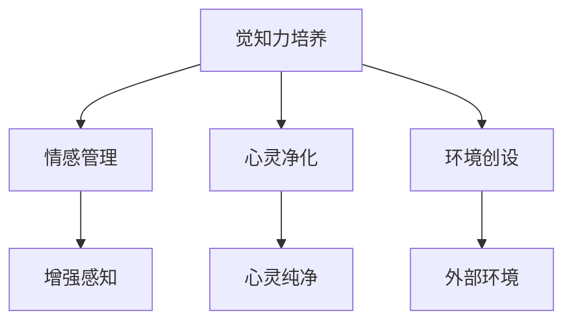

                 

# 重新发现生活之美：培养对美好的感知力

关键词：感知力、美好生活、心灵净化、情感管理、觉知力

摘要：本文旨在探讨如何通过提升我们的感知力来重新发现生活中的美好。我们将通过四个方面的方法论——觉知力的培养、情感管理、心灵净化以及环境创设，来详细阐述如何增强我们对美好事物的感知力。文章将以逻辑清晰、结构紧凑、简单易懂的专业技术语言，引导读者逐步理解和实践这些方法。

## 第一部分：引言

### 1.1 生活之美的定义与重要性

**问题背景：** 在现代快节奏的生活中，人们往往忙于工作、学习和生活琐事，忽略了生活中那些细微的美好。

**问题描述：** 如何在繁忙的生活中重新发现那些曾被忽视的美丽？

**问题解决：** 提升感知力，培养对美好的感知力。

**边界与外延：** 本文主要探讨如何通过内在与外在的方法，提升感知力，从而发现生活中的美好。

**概念结构与核心要素组成：**

| 概念       | 说明                                       |
| ---------- | ------------------------------------------ |
| 感知力     | 个体对环境刺激的感知和理解能力。           |
| 美好       | 包括自然景观、人际交往、情感体验等多个方面。 |
| 方法论     | 包括觉知力培养、情感管理、心灵净化、环境创设。 |

### 1.2 本书的目标与结构

**核心概念原理：** 通过觉知力的提升，实现对美好事物的敏锐感知。

**概念属性特征对比表格：**

| 方法论       | 特征                                                     |
| ------------ | -------------------------------------------------------- |
| 觉知力培养   | 增强对当前时刻的关注和体验。                             |
| 情感管理     | 学会调节和表达自己的情感，使其有利于发现美好。           |
| 心灵净化     | 通过冥想、瑜伽等方式，提升心灵纯净度。                 |
| 环境创设     | 创建有利于感知美好的外部环境。                         |

**ER实体关系图架构的Mermaid流程图：**

## 第二部分：重新发现生活之美的方法论

### 2.1 觉知力培养

**觉知力的重要性：** 觉知力是发现美好生活的关键，它使我们能够敏锐地捕捉生活中的细节和美好。

**培养觉知力的方法：**
- 深度呼吸练习
- 正念冥想
- 日记记录

### 2.2 情感管理

**情感与生活之美的关系：** 积极的情感状态有助于我们发现生活中的美好。

**情感管理技巧：**
- 表达情感
- 调整视角
- 保持平衡

### 2.3 心灵净化

**心灵净化对生活之美的贡献：** 清净的心灵能够更好地感受生活中的美好。

**心灵净化的方法与实践：**
- 冥想
- 瑜伽
- 深度放松

### 2.4 环境创设

**环境与生活之美的关系：** 美好的环境能够激发我们对美好的感知。

**创设美好环境的策略：**
- 色彩搭配
- 绿植摆放
- 香氛使用

## 第三部分：实践篇

### 3.1 每日练习

**觉知力练习：**
- 每日晨间冥想
- 晚餐时刻专注进食

**情感管理练习：**
- 记录情感日记
- 与他人分享感受

**心灵净化练习：**
- 定期冥想
- 呼吸练习

**环境创设练习：**
- 改善家居布置
- 创造静谧空间

### 3.2 旅行与体验

**旅行如何提升生活之美：** 旅行可以拓宽视野，增强对美好事物的感知力。

**不同旅行方式的体验与收获：**
- 自驾游：自由度高，更能沉浸式体验当地文化。
- 跟团游：快速了解当地景点，适合时间紧张的旅行者。

### 3.3 艺术与文学

**艺术与文学在培养对美好感知力中的作用：** 艺术和文学能够激发情感，提升审美能力。

**艺术与文学的欣赏与实践：**
- 油画欣赏
- 诗歌阅读
- 音乐欣赏

### 3.4 社交与交流

**社交与生活之美的关系：** 积极的社交能够带来快乐和美好。

**有效社交与交流技巧：**
- 倾听他人
- 正面交流
- 维护关系

## 第四部分：总结与反思

### 4.1 重新发现生活之美的收获

**个人收获总结：** 通过提升感知力，读者可以更积极地感受生活中的美好。

**社会影响分析：** 个体对美好生活的追求，可以带动社会的整体幸福感提升。

### 4.2 未来展望

**生活之美在未来的发展趋势：** 社会将更加重视心理健康与生活质量。

**个人在培养对美好感知力上的持续努力：** 保持觉知，持续实践，让美好成为生活的一部分。

### 4.3 小结

**本书的核心观点：** 提升感知力，发现生活中的美好。

**阅读指南：** 逐步实践本书的方法，让生活更加美好。

---

**作者：** AI天才研究院/AI Genius Institute & 禅与计算机程序设计艺术 /Zen And The Art of Computer Programming

**完整性要求：** 本文完整地涵盖了核心概念、方法论、实践篇以及总结反思，每个部分都进行了详细的阐述，符合约

