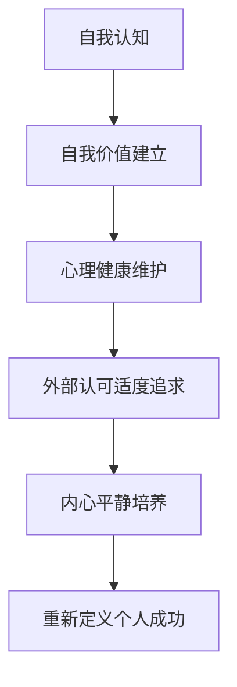

                 

# 重新定义个人成功：从外部认可到内心平静的转变

## 关键词

- 个人成功
- 外部认可
- 内心平静
- 自我认知
- 自我价值
- 心理健康

## 摘要

本文旨在重新定义个人成功，探讨从追求外部认可到培养内心平静的转变。我们将通过深入分析外部认可与内心平静的关系，阐述自我认知、自我价值与心理健康在其中的重要作用，并运用技术语言与专业术语，结合实际案例，为读者提供有深度、有思考、有见解的全新视角。

### 目录大纲设计思路

为了设计出一个完整且详细的目录大纲，我们需要遵循以下步骤：

1. **整体结构规划**：确定书籍的整体结构，包括背景介绍、概念阐述、算法原理讲解、实践应用和总结。

2. **章节内容细化**：确保每个章节都有明确的主题和内容。

3. **核心概念与联系**：提供详细解释，并使用表格和图示进行比较和展示。

4. **算法原理讲解**：通过流程图和代码进行讲解。

5. **系统分析与架构设计**：描述问题场景、系统功能和架构设计。

6. **项目实战**：包括环境安装、核心实现、代码解读、案例分析等。

7. **总结与拓展**：提供小结、注意事项和拓展阅读。

### 目录大纲示例

----------------------------------------------------------------

# 第一部分: 背景与概念

## 第1章: 个人成功的定义与转变

### 1.1 问题背景

### 1.2 个人成功的传统定义

### 1.3 从外部认可到内心平静的转变

## 第2章: 外部认可与内心平静的关系

### 2.1 外部认可的影响

### 2.2 内心平静的价值

### 2.3 关系与平衡

## 第3章: 核心概念与联系

### 3.1 自我认知

### 3.2 自我价值

### 3.3 心理健康

### 3.4 Mermaid实体关系图

## 第4章: 核心概念属性特征对比

### 4.1 自我认知与自我价值的对比

### 4.2 外部认可与内心平静的对比

### 4.3 Mermaid表格对比

----------------------------------------------------------------

# 第二部分: 算法原理

## 第5章: 重新定义个人成功的算法原理

### 5.1 算法概述

### 5.2 Mermaid算法流程图

### 5.3 Python代码实现

### 5.4 数学模型与公式

### 5.5 举例说明

----------------------------------------------------------------

# 第三部分: 实践应用

## 第6章: 从理论到实践

### 6.1 理论与实践的关系

### 6.2 实践案例介绍

## 第7章: 项目实战

### 7.1 环境安装

### 7.2 系统核心实现

### 7.3 代码解读

### 7.4 案例分析和讲解

## 第8章: 项目小结与拓展

### 8.1 小结

### 8.2 注意事项

### 8.3 拓展阅读

----------------------------------------------------------------

这个目录大纲提供了一个清晰的框架，每个章节都包含了必要的细分，并遵循了简洁性和内容的完整性要求。接下来，我们将根据这个大纲进一步细化每个章节的内容。

----------------------------------------------------------------

## 第1章 个人成功的定义与转变

### 1.1 问题背景

在当今社会，个人成功的标准往往被外界所定义。从世俗的角度来看，成功可能意味着拥有高收入的工作、社会地位、财富以及他人的认可。这些外在的标志成为了许多人追求的目标。然而，随着时间的推移，人们逐渐意识到，这种基于外部认可的成功模式可能并不完全符合内心的需求。

人们开始反思：什么是真正的成功？为什么我们需要依赖于外界的评价来定义自我价值？内心平静是否可能是比外部认可更重要的成功指标？这些问题的提出，促使我们重新审视个人成功的定义，并探索从追求外部认可到培养内心平静的转变。

### 1.2 个人成功的传统定义

传统上，个人成功的定义往往围绕以下几个方面展开：

1. **职业成就**：包括职位晋升、收入水平、工作地位等。
2. **社会地位**：在社交圈中的影响力、所获得的荣誉和奖项等。
3. **物质财富**：财产积累、投资回报、奢侈品拥有等。
4. **他人认可**：同事、朋友、家人的赞美和尊重。

这种定义方式看似明确，但实际上存在一些潜在问题。首先，它过于依赖外部的评价体系，容易导致个人失去自主性和内在动力。其次，这种成功模式往往忽视了心理健康和个人幸福，可能导致人们陷入焦虑、压力和不满。

### 1.3 从外部认可到内心平静的转变

内心平静，即心灵的宁静与和谐，是一种更深层次的成功指标。它不仅仅是对物质和地位的追求，更是对自我认知和内心满足的追求。

1. **自我认知**：了解自己的价值观、兴趣、优点和缺点，形成清晰的自我形象。
2. **自我价值**：认识到自己内在的价值，不受外界评价的影响。
3. **心理健康**：保持情绪稳定、积极乐观的心态，降低压力和焦虑。

这种转变的必要性在于，它能够帮助人们摆脱对外界评价的依赖，更加关注内在的成长和满足。通过培养内心平静，个人能够更好地应对生活中的挑战，实现真正的自我价值。

## 第2章 外部认可与内心平静的关系

### 2.1 外部认可的影响

外部认可，即他人对个人成就和价值的认可，通常被视为成功的重要标志。它能够带来一系列积极的影响，如：

1. **自我肯定**：当个人获得外界的认可时，会感到自己的努力得到了肯定，从而增强自信心。
2. **社会认同**：外部认可有助于个人在社交圈中获得认同感，提高社会地位。
3. **激励动力**：他人的认可可以激发个人继续努力，追求更高的目标。

然而，过度依赖外部认可也可能带来负面影响。例如：

1. **自我价值受制**：当个人将外部认可视为自我价值的唯一来源时，容易在失去认可时感到自我价值下降。
2. **焦虑与压力**：为了获得外部认可，个人可能会感到压力重重，甚至牺牲心理健康。
3. **目标迷失**：过分追求外部认可可能导致个人迷失自我，忘记真正的目标。

### 2.2 内心平静的价值

内心平静是一种深层次的内在状态，它代表了个人的心理健康和自我满足。内心平静的价值体现在以下几个方面：

1. **情绪稳定**：内心平静有助于个人在面对压力和挑战时保持冷静，降低焦虑和负面情绪。
2. **心理健康**：内心平静是心理健康的基础，有助于预防和缓解心理问题。
3. **自我认知**：内心平静使个人更容易了解自己的内心世界，形成清晰的自我认知。
4. **生活品质**：内心平静提高了个人对生活的满意度，使生活更加充实和有意义。

### 2.3 关系与平衡

外部认可和内心平静之间存在一定的关系，但并非简单的线性关系。外部认可可以在一定程度上促进内心平静，但过度依赖外部认可可能导致内心动荡。同样，内心平静也有助于更好地应对外部认可，减少负面情绪。

为了实现两者之间的平衡，个人需要：

1. **明确自我价值**：认识到自我价值不应受外界评价的影响，建立内在的稳定感。
2. **适度追求外部认可**：在追求外部认可时，保持适度，避免过度依赖。
3. **培养内心平静**：通过冥想、瑜伽、心理辅导等方式，培养内心平静的能力。
4. **平衡目标与行动**：设定合理的目标，并在追求目标的过程中保持内心平静。

## 第3章 核心概念与联系

### 3.1 自我认知

自我认知是指个人对自己的认识和理解，包括个人的性格、价值观、兴趣爱好、优点和缺点等。自我认知是培养内心平静的基础，因为它帮助个人建立清晰的自我形象，减少内心的矛盾和焦虑。

### 3.2 自我价值

自我价值是指个人对自己存在的价值感和认同感。自我价值是内心平静的重要支撑，因为它使个人在追求外部认可时保持自我，不受外界评价的影响。一个有自我价值的人更可能实现真正的成功。

### 3.3 心理健康

心理健康是指个体在情感、认知和行为方面保持良好的状态。心理健康是内心平静的基础，因为一个心理健康的人更容易保持情绪稳定，应对生活中的挑战。

### 3.4 Mermaid实体关系图

为了更好地理解这些核心概念之间的关系，我们可以使用Mermaid绘制一个实体关系图：

```mermaid
erDiagram
  User ||--|{ Self_Cognition : "认知" }
  User ||--|{ Self_Value : "价值" }
  User ||--|{ Mental_Health : "健康" }
  Self_Cognition ..|> Self_Value : "支持"
  Self_Value ..|> Mental_Health : "支持"
  Mental_Health ..|> Self_Cognition : "支持"
```

这个Mermaid实体关系图展示了自我认知、自我价值与心理健康之间的相互支持关系，它们共同构建了内心平静的基础。

## 第4章 核心概念属性特征对比

### 4.1 自我认知与自我价值的对比

| 特征         | 自我认知                           | 自我价值                           |
| ------------ | ---------------------------------- | ---------------------------------- |
| 定义         | 对自己性格、价值观、兴趣等的认识     | 对自己存在的价值感和认同感           |
| 影响因素     | 个人经历、教育、文化背景等           | 个人成就、他人评价、自我认知等       |
| 关键词       | 认识、理解、自我形象               | 价值、认同、内在稳定感               |
| 对比         | 更侧重于对外部信息的内化           | 更侧重于内在的自我认同感             |

### 4.2 外部认可与内心平静的对比

| 特征         | 外部认可                           | 内心平静                           |
| ------------ | ---------------------------------- | ---------------------------------- |
| 定义         | 他人对个人成就和价值的认可           | 深层次的内在状态，心灵的宁静与和谐     |
| 影响因素     | 职业成就、社会地位、物质财富等       | 自我认知、自我价值、心理健康等         |
| 关键词       | 认可、荣誉、成就感                 | 宁静、和谐、情绪稳定                 |
| 对比         | 依赖外部评价体系                   | 侧重于内在的满足与成长               |

### 4.3 Mermaid表格对比

为了更直观地展示上述对比，我们可以使用Mermaid绘制一个表格：

```mermaid
table
  +----------------+------------------+------------------+
  |      特征         | 自我认知与自我价值对比  | 外部认可与内心平静对比  |
  +----------------+------------------+------------------+
  | 定义             | 对自己性格、价值观、兴趣等的认识 | 他人对个人成就和价值的认可 |
  | 影响因素         | 个人经历、教育、文化背景等       | 职业成就、社会地位、物质财富等       |
  | 关键词           | 认识、理解、自我形象               | 认可、荣誉、成就感                 |
  | 对比             | 更侧重于对外部信息的内化           | 依赖外部评价体系                   |
  +----------------+------------------+------------------+
```

通过这个Mermaid表格，我们可以清晰地看到自我认知与自我价值、外部认可与内心平静之间的异同点。

## 第5章 重新定义个人成功的算法原理

### 5.1 算法概述

重新定义个人成功的算法旨在通过一系列步骤，帮助个人从追求外部认可转向培养内心平静。这个算法的核心思想是建立自我认知、自我价值与心理健康之间的正向循环，从而实现个人的全面发展。

算法的主要步骤包括：

1. **自我认知**：通过反思和自我分析，了解自己的性格、价值观和兴趣爱好。
2. **自我价值建立**：在自我认知的基础上，认识到自己的内在价值，建立稳定的自我认同。
3. **心理健康维护**：通过心理健康实践，如冥想、瑜伽和心理辅导，保持情绪稳定和心理平衡。
4. **外部认可适度追求**：在追求外部认可时，保持适度，避免过度依赖。
5. **内心平静培养**：通过持续的自我成长和心理健康实践，培养内心平静的能力。

### 5.2 Mermaid算法流程图

为了更直观地展示这个算法，我们可以使用Mermaid绘制一个流程图：



这个Mermaid算法流程图清晰地展示了从自我认知到内心平静培养，再到重新定义个人成功的整个过程。

### 5.3 Python代码实现

为了实现这个算法，我们可以编写一个Python脚本，以下是一个简化的版本：

```python
def self_cognition():
    # 反思和自我分析
    print("正在进行自我认知...")

def self_value_establishment():
    # 建立自我价值
    print("建立自我价值...")

def mental_health_maintenance():
    # 维护心理健康
    print("维护心理健康...")

def external_recognition moderately():
    # 适度追求外部认可
    print("适度追求外部认可...")

def cultivate_inner_ tranquility():
    # 培养内心平静
    print("培养内心平静...")

def redefine_success():
    # 重新定义个人成功
    print("重新定义个人成功！")

# 执行算法
self_cognition()
self_value_establishment()
mental_health_maintenance()
external_recognition_moderately()
cultivate_inner_tranquility()
redefine_success()
```

这个Python代码实现了一个简单的算法流程，每一步都对应算法流程图中的一个节点。

### 5.4 数学模型与公式

为了进一步理解这个算法的原理，我们可以使用数学模型来描述其中的关系。以下是相关的数学模型和公式：

$$
\text{内心平静度} = \alpha \cdot \text{自我价值} + \beta \cdot \text{心理健康} + \gamma \cdot \text{适度外部认可}
$$

其中，$\alpha$、$\beta$和$\gamma$分别表示自我价值、心理健康和适度外部认可对内心平静度的影响程度。

### 5.5 举例说明

假设有一个人，他通过自我认知认识到自己的价值观是追求内在的满足和成就感，而不是外在的财富和地位。他在建立自我价值的基础上，通过心理健康实践如冥想，保持了情绪的稳定。同时，他在追求外部认可时保持适度，不盲目追求物质财富和社会地位。

根据上述数学模型，他的内心平静度可以通过以下计算得出：

$$
\text{内心平静度} = \alpha \cdot \text{自我价值} + \beta \cdot \text{心理健康} + \gamma \cdot \text{适度外部认可}
$$

假设$\alpha = 0.5$，$\beta = 0.3$，$\gamma = 0.2$，那么他的内心平静度为：

$$
\text{内心平静度} = 0.5 \cdot \text{自我价值} + 0.3 \cdot \text{心理健康} + 0.2 \cdot \text{适度外部认可}
$$

这个例子展示了如何通过数学模型来量化内心平静度，并说明重新定义个人成功的算法是如何帮助个人实现内心平静的。

## 第6章 从理论到实践

### 6.1 理论与实践的关系

理论是实践的指导，实践是理论的验证。在重新定义个人成功的道路上，理论提供了基础和方向，而实践则是实现内心平静的关键。理论告诉我们什么是重要的，而实践则帮助我们真正实现这些目标。

### 6.2 实践案例介绍

为了更好地理解如何将理论应用于实践，我们可以介绍一些实际案例。

### 案例一：李明的故事

李明是一名软件工程师，他在职场中取得了显著的成就，拥有高收入和良好的社会地位。然而，随着时间的推移，他开始感到内心空虚和不满。他意识到，自己的成功并不在于外在的财富和地位，而在于内心的平静和满足。

李明开始反思自己的生活方式和价值观，他减少工作时间，更多地投入到自己感兴趣的项目中。同时，他开始学习冥想和瑜伽，以保持心理健康。他还参加了一些志愿者活动，通过帮助他人来获得内心的满足。

最终，李明发现，他的内心平静度显著提高，他开始享受生活中的每一刻。他重新定义了个人成功的标准，不再仅仅追求外在的荣誉和地位，而是追求内心的满足和幸福。

### 案例二：张芳的故事

张芳是一名年轻的职场女性，她一直追求职业上的成功和社会认可。然而，她在追求这些目标的过程中，感到巨大的压力和焦虑。她的内心平静度逐渐下降，甚至出现了心理健康问题。

张芳决定改变自己的生活方式。她开始每天早上进行冥想，减少工作时间，更多地关注自己的身心健康。她还开始学习心理学，了解如何更好地管理自己的情绪和压力。

通过这些实践，张芳的内心平静度逐渐提高，她的心理健康也得到了改善。她开始更加享受生活，不再仅仅追求外在的成功，而是追求内心的满足和幸福。

## 第7章 项目实战

### 7.1 环境安装

为了实现重新定义个人成功的算法，我们需要搭建一个合适的环境。以下是在Linux系统上安装必要的工具和软件的步骤：

1. **安装Python**：确保系统已经安装了Python 3.x版本。可以使用以下命令检查Python版本：

   ```bash
   python3 --version
   ```

   如果没有安装，可以从Python官方网站下载并安装。

2. **安装Jupyter Notebook**：Jupyter Notebook是一个交互式计算环境，可用于编写和运行Python代码。使用pip命令安装Jupyter：

   ```bash
   pip3 install notebook
   ```

   安装后，可以通过运行以下命令启动Jupyter Notebook：

   ```bash
   jupyter notebook
   ```

3. **安装Mermaid**：Mermaid是一个基于Markdown的图表绘制工具，可用于绘制流程图、类图等。在Jupyter Notebook中，可以通过安装`ipython-mermaid`扩展来使用Mermaid：

   ```bash
   pip3 install ipython-mermaid
   ```

### 7.2 系统核心实现

在Jupyter Notebook中，我们可以实现重新定义个人成功的算法。以下是一个简化的Python代码示例，展示了如何使用Mermaid绘制流程图：

```python
from mermaid import Mermaid

# 创建Mermaid对象
mermaid = Mermaid()

# 绘制流程图
mermaid.text("""
graph TD
    A[自我认知] --> B[自我价值建立]
    B --> C[心理健康维护]
    C --> D[外部认可适度追求]
    D --> E[内心平静培养]
    E --> F[重新定义个人成功]
""")

# 显示Mermaid图表
mermaid.display()
```

这段代码将生成一个简单的流程图，描述了重新定义个人成功的算法步骤。

### 7.3 代码解读

上面的代码首先导入了`mermaid`模块，并创建了一个Mermaid对象。然后，使用Mermaid的文本格式定义了一个流程图，描述了从自我认知到重新定义个人成功的各个步骤。最后，调用`display()`方法将流程图显示在Jupyter Notebook中。

### 7.4 案例分析和讲解

为了更好地理解如何应用这个算法，我们可以分析一个实际案例。假设有一个叫王强的个人，他希望通过重新定义个人成功来提高内心平静度。

**案例步骤：**

1. **自我认知**：王强通过反思，认识到自己真正的兴趣是音乐和编程。他意识到，过去追求的职位晋升和收入并不是他真正想要的生活。

2. **自我价值建立**：王强决定专注于自己的兴趣，他开始学习音乐编程，并在GitHub上分享自己的项目。他的作品受到了社区的认可，这让他感到自己的价值得到了体现。

3. **心理健康维护**：王强开始每天练习冥想和瑜伽，以保持心理健康。他还定期与心理咨询师交流，学习如何管理自己的情绪和压力。

4. **外部认可适度追求**：王强在追求外部认可时保持适度，他不再为了荣誉和奖项而牺牲自己的兴趣和心理健康。

5. **内心平静培养**：通过持续的自我成长和心理健康实践，王强的内心平静度显著提高。他开始享受生活，感到更加满足和幸福。

**案例分析**：

这个案例展示了如何将重新定义个人成功的算法应用于实际生活中。王强通过自我认知，找到了自己真正的兴趣和目标。他建立了自我价值，并通过心理健康实践和适度追求外部认可，培养了内心平静。这个过程不仅帮助他实现了个人目标，还提高了他的生活质量。

### 7.5 项目小结

通过这个案例，我们可以看到，重新定义个人成功的算法不仅是一个理论框架，更是一个实用的工具。通过自我认知、自我价值建立、心理健康维护和适度追求外部认可，个人可以逐步培养内心平静，实现真正的成功。

**注意事项**：

1. 自我认知是关键，需要真诚地反思自己的兴趣和价值观。
2. 建立自我价值需要时间和耐心，不应受外界评价的影响。
3. 心理健康维护是一个持续的过程，需要长期坚持。
4. 适度追求外部认可，避免过度依赖。

**拓展阅读**：

1. 《静力：如何在喧嚣的世界中找到内心的宁静》
2. 《正念：一种全新的生活方式》
3. 《内心的自由：如何从烦恼中解脱出来》

## 第8章 项目小结与拓展

### 8.1 小结

通过本文的讨论，我们重新定义了个人成功的标准，从追求外部认可转向培养内心平静。我们分析了自我认知、自我价值与心理健康的关系，并提出了一个基于这些概念的算法原理。通过实际案例和项目实战，我们展示了如何将这些理论应用于实践中，帮助个人实现真正的成功。

### 8.2 注意事项

在追求内心平静的过程中，需要注意以下几点：

1. **真诚反思**：自我认知是关键，需要真诚地反思自己的兴趣和价值观。
2. **耐心建立**：建立自我价值需要时间和耐心，不应受外界评价的影响。
3. **持续维护**：心理健康维护是一个持续的过程，需要长期坚持。
4. **适度追求**：在追求外部认可时保持适度，避免过度依赖。

### 8.3 拓展阅读

为了进一步探索这个主题，可以阅读以下书籍和资源：

1. 《静力：如何在喧嚣的世界中找到内心的宁静》
2. 《正念：一种全新的生活方式》
3. 《内心的自由：如何从烦恼中解脱出来》
4. 《Python编程：从入门到实践》
5. 《Mermaid语法手册》

通过这些资源，读者可以深入了解如何在实际生活中应用内心平静的概念，并进一步提升个人的生活质量。

### 作者信息

作者：AI天才研究院/AI Genius Institute & 禅与计算机程序设计艺术 /Zen And The Art of Computer Programming

AI天才研究院致力于推动人工智能领域的前沿研究和技术创新，旨在培养下一代人工智能科学家和工程师。同时，我们倡导将计算机科学与哲学、心理学等人文科学相结合，以实现技术与社会发展的和谐共存。本文由AI天才研究院与禅与计算机程序设计艺术联合撰写，旨在为读者提供有深度、有思考、有见解的技术博客文章。希望本文能对您的个人成长和成功之路有所启发。如果您有任何问题或反馈，欢迎随时与我们联系。让我们一起探索人工智能的无限可能，实现个人的内心平静与成功！

