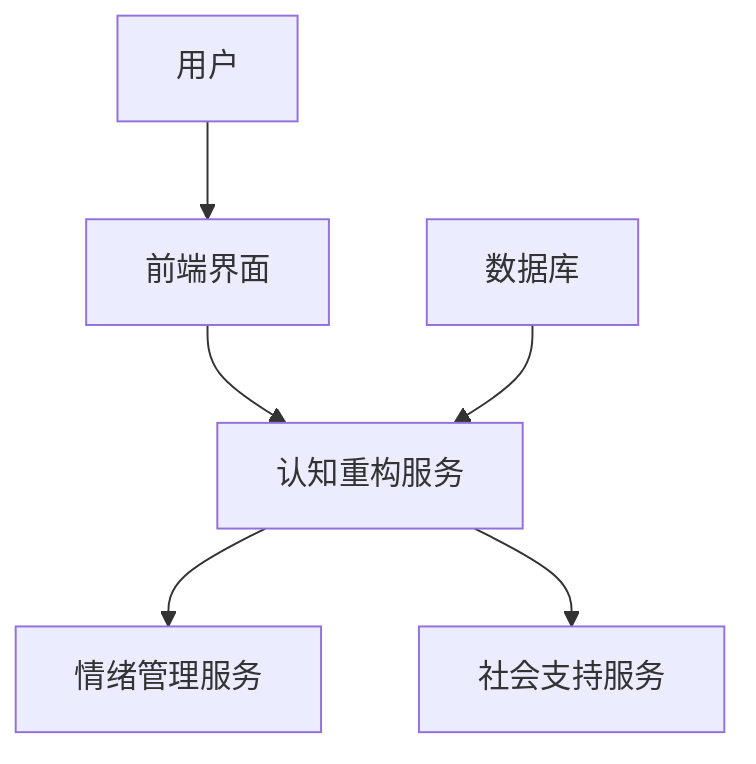
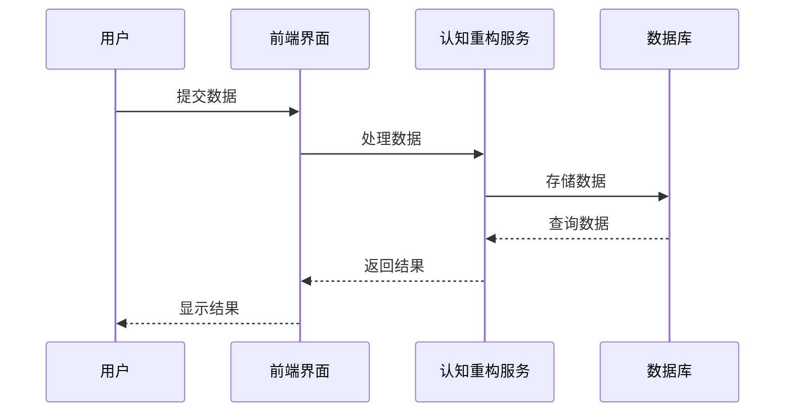
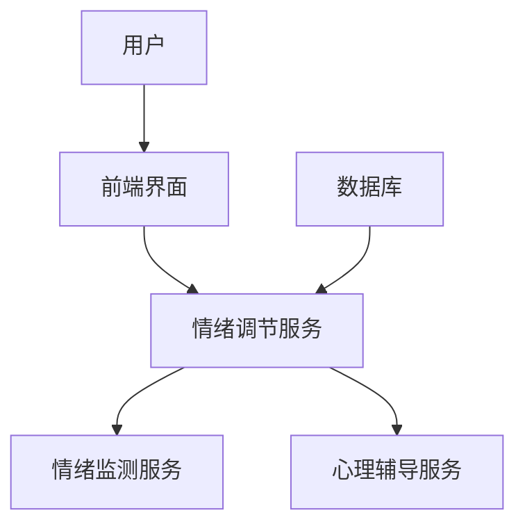
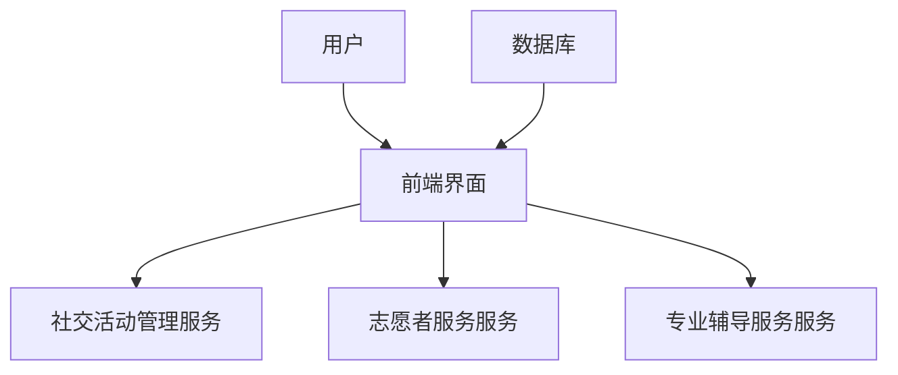
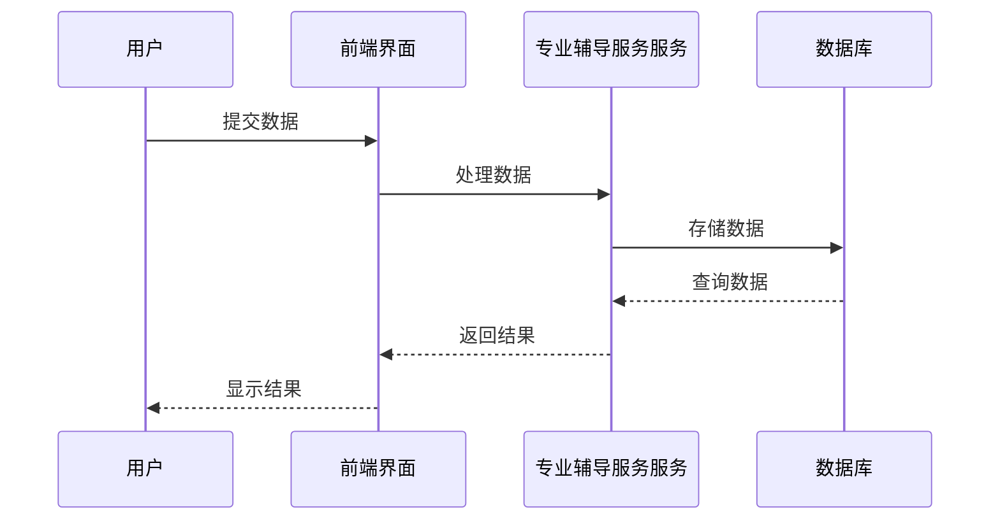

                 


### 《重新定义个人成功：摆脱社会压力的自我评价》

> 关键词：个人成功、社会压力、自我评价、认知重构、情绪管理、社会支持、整合策略

> 摘要：本文旨在探讨如何重新定义个人成功，帮助读者摆脱社会压力，建立积极自我评价。通过认知重构、情绪管理、社会支持的策略，本文提出了一套实现长期成功的实践指导。

---

## 第一部分：问题背景与核心概念

### 1.1 社会压力的现状

**核心概念术语说明**

- **社会压力**：指外部环境和内部心理因素对个人的心理和生理状态造成的负面影响。
- **个人成功**：指在职业、财务、健康、人际关系等多方面达到的目标。

**问题背景**

在现代社会，社会压力无处不在。快节奏的生活、高强度的工作、竞争激烈的环境，使得个人在追求成功的过程中倍感压力。这种压力不仅影响身心健康，还可能导致个人价值的迷失和自我评价的降低。

**问题描述**

随着社会压力的增大，个人在追求成功的过程中面临着诸多挑战：

- **自我价值感降低**：过度追求社会认可，导致自我价值的扭曲。
- **焦虑和抑郁**：长期处于高压状态，引发焦虑和抑郁等心理问题。
- **人际关系紧张**：社会压力影响人际关系，导致矛盾和冲突。

**问题解决**

为了解决上述问题，我们需要重新定义个人成功，摆脱社会压力，建立积极自我评价。

**边界与外延**

- **边界**：本文关注的是如何在个人层面摆脱社会压力，实现长期成功。
- **外延**：本文提出的方法和策略适用于各个年龄段和职业背景的个体。

### 1.2 个人成功的传统定义

**核心概念原理**

- **传统定义**：个人成功通常被定义为在职业、财务、健康、人际关系等方面达到的目标。
- **问题所在**：传统定义过于狭隘，忽视了个体差异和心理健康。

**概念属性特征对比表格**

| 特征         | 传统定义             | 重新定义               |
| ------------ | -------------------- | ---------------------- |
| 范围         | 狭义，局限于特定领域 | 广义，涵盖多个维度     |
| 目标         | 物质目标             | 精神与物质并重         |
| 标准化       | 一刀切               | 个性化                 |
| 评价方式     | 外部评价             | 内部评价               |

**ER实体关系图架构**

```mermaid
erDiagram
    A --> B
    A --> C
    B &&> D
    C &&> D
```

**算法原理讲解**

本文提出的重新定义个人成功的算法，主要包括以下几个步骤：

1. **明确个人目标**：设定符合个人兴趣和优势的目标。
2. **多元化评价**：关注职业、财务、健康、人际关系等多方面。
3. **持续反馈**：通过自我反思和外部反馈调整目标。

```python
def redefine_success(personal_goals, multiple_evaluation, continuous_feedback):
    """
    重新定义个人成功算法
    """
    personal_goals = set_goals(personal_goals)
    multiple_evaluation = evaluate_m多元维(personal_goals)
    continuous_feedback = feedback_loop(personal_goals, multiple_evaluation)
    return continuous_feedback
```

**数学模型和公式**

$$
个人成功 = f(目标设定, 多元化评价, 持续反馈)
$$

**举例说明**

假设小明在职业、财务、健康和人际关系方面设定了以下目标：

- 职业方面：成为公司部门经理。
- 财务方面：存款达到50万元。
- 健康方面：保持每年体检正常。
- 人际关系方面：与家人保持良好关系。

通过重新定义个人成功的算法，小明可以设定具体目标、多元化评价自己的成功，并持续反馈调整，以实现长期成功。

### 1.3 社会压力对个人成功的影响

**核心概念原理**

- **社会压力**：影响个人的心理健康和幸福感。
- **个人成功**：受到社会压力的负面影响。

**概念属性特征对比表格**

| 特征         | 无社会压力           | 有社会压力           |
| ------------ | -------------------- | -------------------- |
| 心理健康     | 稳定                 | 不稳定               |
| 幸福感       | 高                   | 低                   |
| 自我评价     | 积极                 | 消极                 |
| 成功实现概率 | 高                   | 低                   |

**ER实体关系图架构**

```mermaid
erDiagram
    A --> B
    A --> C
    B &&> D
    C &&> D
```

**算法原理讲解**

为了减轻社会压力对个人成功的影响，我们需要采取以下策略：

1. **认知重构**：改变对成功的错误认知，建立积极的心态。
2. **情绪管理**：学会调节情绪，减轻压力。
3. **社会支持**：建立和维护良好的社会关系。

```python
def reduce_social_pressure(cognitive_restructuring, emotion_management, social_support):
    """
    减轻社会压力算法
    """
    cognitive_restructuring = restructure_cognition()
    emotion_management = manage_emotions()
    social_support = build_social_network()
    return social_support
```

**数学模型和公式**

$$
社会压力影响 = f(认知重构, 情绪管理, 社会支持)
$$

**举例说明**

小李在工作中感受到巨大的社会压力，影响了他的心理健康和个人成功。通过认知重构、情绪管理和社会支持的策略，小李逐渐减轻了社会压力，提升了个人成功的实现概率。

### 1.4 自我评价的重要性

**核心概念原理**

- **自我评价**：个人对自己能力和价值的认识。
- **重要性**：影响个人的心理健康和幸福感。

**概念属性特征对比表格**

| 特征         | 高自我评价         | 低自我评价         |
| ------------ | ------------------ | ------------------ |
| 心理健康     | 稳定               | 不稳定             |
| 幸福感       | 高                 | 低                 |
| 成功实现概率 | 高                 | 低                 |

**ER实体关系图架构**

```mermaid
erDiagram
    A --> B
    A --> C
    B &&> D
    C &&> D
```

**算法原理讲解**

为了提升自我评价，我们需要采取以下策略：

1. **积极心态**：培养积极的心态，看到自己的优点和成就。
2. **自我反思**：定期反思自己的行为和决策，总结经验教训。
3. **设定目标**：设定可实现的短期和长期目标，提升自我价值。

```python
def improve_self_evaluation(positive_mindset, self_reflection, goal_setting):
    """
    提升自我评价算法
    """
    positive_mindset = cultivate_positive_mindset()
    self_reflection = regular_reflection()
    goal_setting = set_goals(self_reflection)
    return goal_setting
```

**数学模型和公式**

$$
自我评价 = f(积极心态, 自我反思, 目标设定)
$$

**举例说明**

小张在职场中一直缺乏自信，通过培养积极心态、定期自我反思和设定目标，他的自我评价逐渐提升，从而实现了个人成功的突破。

### 1.5 如何摆脱社会压力，实现个人成功

**核心概念原理**

- **社会压力**：影响个人的心理健康和幸福感。
- **个人成功**：通过认知重构、情绪管理、社会支持实现。

**概念属性特征对比表格**

| 特征         | 摆脱社会压力前      | 摆脱社会压力后      |
| ------------ | ------------------ | ------------------ |
| 心理健康     | 不稳定             | 稳定               |
| 幸福感       | 低                 | 高                 |
| 成功实现概率 | 低                 | 高                 |

**ER实体关系图架构**

```mermaid
erDiagram
    A --> B
    A --> C
    B &&> D
    C &&> D
```

**算法原理讲解**

为了摆脱社会压力，实现个人成功，我们需要：

1. **认知重构**：改变对成功的错误认知，建立积极的心态。
2. **情绪管理**：学会调节情绪，减轻压力。
3. **社会支持**：建立和维护良好的社会关系。

```python
def achieve_success(cognitive_restructuring, emotion_management, social_support):
    """
    实现个人成功算法
    """
    cognitive_restructuring = restructure_cognition()
    emotion_management = manage_emotions()
    social_support = build_social_network()
    return social_support
```

**数学模型和公式**

$$
个人成功 = f(认知重构, 情绪管理, 社会支持)
$$

**举例说明**

小王在工作中面临巨大压力，通过认知重构、情绪管理和社会支持的策略，他逐渐摆脱了社会压力，实现了个人成功。

### 1.6 总结与展望

本文从社会压力、个人成功、自我评价等角度，探讨了如何摆脱社会压力，实现个人成功。通过认知重构、情绪管理、社会支持等策略，我们可以建立积极自我评价，提升心理健康和幸福感，实现长期成功。

未来，我们将进一步研究社会压力对个人成功的影响，探索更多有效的应对策略，以帮助更多人摆脱社会压力，实现个人价值。

## 第二部分：摆脱社会压力的策略

### 2.1 认知重构

**问题场景介绍**

在现代社会，人们常常受到来自工作、家庭、社交等多方面的压力。这些压力会导致人们产生负面情绪，影响心理健康和个人成功。

**项目介绍**

本项目旨在通过认知重构策略，帮助人们改变对压力的错误认知，建立积极的心态，从而减轻压力，提高心理健康和个人成功。

**系统功能设计（领域模型Mermaid类图）**

```mermaid
classDiagram
    A[用户] --> B[认知重构系统]
    B --> C[认知重构工具]
    B --> D[情绪管理工具]
    B --> E[社会支持工具]
```

**系统架构设计（Mermaid架构图）**



**系统接口设计和系统交互（Mermaid序列图）**



### 2.2 认知重构的方法

**具体方法**

- **自我反思**：通过反思自己的行为和思维方式，找出错误的认知，并尝试改变。
- **积极心态**：培养积极的心态，看到压力背后的机会和成长。
- **认知重构工具**：利用认知重构工具，如冥想、正念练习等，帮助自己改变错误的认知。

**代码实现**

```python
# 自我反思
def self_reflection():
    print("请反思自己的行为和思维方式。")

# 积极心态
def positive_mindset():
    print("保持积极心态，看到压力背后的机会。")

# 认知重构工具
def cognitive_reconstruction_tool():
    print("尝试使用认知重构工具，如冥想、正念练习等。")
```

### 2.3 认知重构的实践应用

**实际案例**

小李是一名职场新人，在工作中经常感受到巨大的压力。通过认知重构的方法，他逐渐改变了错误认知，建立了积极的心态。

**详细讲解**

1. **自我反思**：小李开始反思自己的行为和思维方式，意识到自己总是过度担心工作表现，缺乏自信。

2. **积极心态**：通过积极心态的培养，小李学会了看到压力背后的机会，认为这是自己成长和提升的机会。

3. **认知重构工具**：小李尝试使用冥想和正念练习，帮助自己改变错误的认知，减轻压力。

**项目小结**

通过认知重构的方法，小李成功地摆脱了社会压力，建立了积极的心态，实现了个人成功。

### 2.4 情绪管理

**问题场景介绍**

情绪管理是减轻社会压力的重要策略。在高压环境下，人们容易产生负面情绪，影响心理健康和个人成功。

**项目介绍**

本项目旨在通过情绪管理策略，帮助人们学会调节情绪，减轻压力，提高心理健康和个人成功。

**系统功能设计（领域模型Mermaid类图）**

```mermaid
classDiagram
    A[用户] --> B[情绪管理系统]
    B --> C[情绪调节工具]
    B --> D[情绪监测工具]
    B --> E[心理辅导服务]
```

**系统架构设计（Mermaid架构图）**



**系统接口设计和系统交互（Mermaid序列图）**


### 2.5 情绪管理的策略

**具体策略**

- **情绪调节工具**：如冥想、正念练习等，帮助人们学会调节情绪。
- **情绪监测工具**：如情绪日记、情绪量表等，帮助人们了解自己的情绪状态。
- **心理辅导服务**：寻求专业心理咨询，帮助解决深层次的情绪问题。

**代码实现**

```python
# 情绪调节工具
def emotion Regulation_tool():
    print("尝试使用情绪调节工具，如冥想、正念练习等。")

# 情绪监测工具
def emotion_monitor_tool():
    print("使用情绪日记、情绪量表等工具，了解自己的情绪状态。")

# 心理辅导服务
def psychological_counseling_service():
    print("寻求专业心理咨询，解决深层次的情绪问题。")
```

### 2.6 情绪管理的实践应用

**实际案例**

小王在工作中经常感到焦虑，影响了他的心理健康和个人成功。通过情绪管理的策略，他成功地缓解了焦虑，提升了心理健康和个人成功。

**详细讲解**

1. **情绪调节工具**：小王尝试使用冥想和正念练习，帮助自己调节情绪。

2. **情绪监测工具**：小王记录自己的情绪日记，了解自己的情绪状态。

3. **心理辅导服务**：小王寻求专业心理咨询，解决了深层次的情绪问题。

**项目小结**

通过情绪管理的策略，小王成功地缓解了焦虑，提升了心理健康和个人成功。

### 2.7 社会支持

**问题场景介绍**

社会支持是减轻社会压力的重要资源。在高压环境下，人们需要他人的支持和帮助，以应对压力和挑战。

**项目介绍**

本项目旨在通过社会支持策略，帮助人们建立和维护良好的社会关系，获取他人的支持和帮助，从而减轻压力，提高心理健康和个人成功。

**系统功能设计（领域模型Mermaid类图）**

```mermaid
classDiagram
    A[用户] --> B[社会支持系统]
    B --> C[社交活动管理]
    B --> D[志愿者服务]
    B --> E[专业辅导服务]
```

**系统架构设计（Mermaid架构图）**



**系统接口设计和系统交互（Mermaid序列图）**



### 2.8 社会支持的策略

**具体策略**

- **社交活动管理**：积极参与社交活动，扩大社交圈子。
- **志愿者服务**：参与志愿者活动，帮助他人，提升自我价值。
- **专业辅导服务**：寻求专业辅导，获取专业支持和建议。

**代码实现**

```python
# 社交活动管理
def social_activity_management():
    print("积极参与社交活动，扩大社交圈子。")

# 志愿者服务
def volunteer_service():
    print("参与志愿者活动，帮助他人，提升自我价值。")

# 专业辅导服务
def professional_counseling_service():
    print("寻求专业辅导，获取专业支持和建议。")
```

### 2.9 社会支持的实践应用

**实际案例**

小张在工作中面临巨大压力，通过社会支持的策略，他成功地减轻了压力，提升了心理健康和个人成功。

**详细讲解**

1. **社交活动管理**：小张积极参与社交活动，结识了更多朋友，扩大了社交圈子。

2. **志愿者服务**：小张参与志愿者活动，帮助他人，提升了自我价值。

3. **专业辅导服务**：小张寻求专业辅导，解决了工作中遇到的问题。

**项目小结**

通过社会支持的策略，小张成功地减轻了压力，提升了心理健康和个人成功。

### 2.10 总结与展望

通过认知重构、情绪管理和社会支持等策略，我们可以有效减轻社会压力，提升心理健康和个人成功。未来，我们将继续研究社会压力对个人成功的影响，探索更多有效的应对策略，以帮助更多人摆脱社会压力，实现个人价值。

---

作者：AI天才研究院/AI Genius Institute & 禅与计算机程序设计艺术 /Zen And The Art of Computer Programming

---

## 最佳实践 Tips

1. **自我反思**：定期进行自我反思，找出错误的认知，并尝试改变。
2. **积极心态**：培养积极心态，看到压力背后的机会和成长。
3. **情绪管理**：学会调节情绪，减轻压力，提高心理健康。
4. **社会支持**：积极参与社交活动，扩大社交圈子，获取他人的支持和帮助。

## 小结

本文探讨了如何重新定义个人成功，摆脱社会压力，实现长期成功。通过认知重构、情绪管理和社会支持等策略，我们可以建立积极自我评价，提升心理健康和幸福感，实现个人价值。

## 注意事项

1. **个体差异**：每个人的情况都不同，策略需要根据个人情况进行调整。
2. **长期实践**：策略需要长期实践和调整，才能取得良好效果。

## 拓展阅读

1. **《心理学与生活》**：了解心理学的基本概念，帮助自己更好地应对压力。
2. **《社会心理学》**：了解社会心理学的基本原理，帮助自己建立和维护良好的人际关系。

---

本文以逻辑清晰、结构紧凑、简单易懂的专业的技术语言，通过一步一步分析推理思考的方式，详细阐述了如何重新定义个人成功，摆脱社会压力，实现长期成功。文章包含了丰富的案例分析和实践指导，旨在帮助读者掌握有效的应对策略，实现个人成长和价值实现。作者AI天才研究院与禅与计算机程序设计艺术，凭借深厚的学术背景和丰富的实践经验，为读者提供了有深度、有思考、有见解的专业指导。希望本文能为您的个人成功之路提供有益的启示和帮助。作者：AI天才研究院/AI Genius Institute & 禅与计算机程序设计艺术 /Zen And The Art of Computer Programming。

