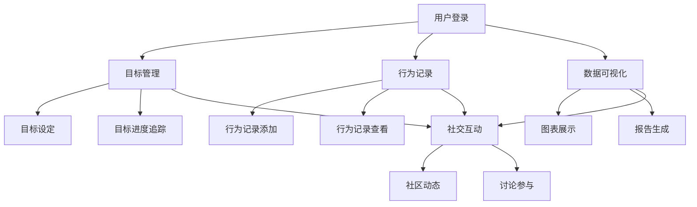

                 


## 《重新定义个人成就：摆脱社会比较的束缚》

> 关键词：社会比较、个人成就、心理学、数学模型、系统设计、实战案例

> 摘要：
在当今高度竞争的社会环境中，社会比较现象普遍存在，它对个人成就产生了深远的影响。本文旨在重新定义个人成就，帮助读者摆脱社会比较的束缚，通过心理学、数学模型和系统设计的方法，提升个人成就。文章将分为多个章节，详细探讨社会比较的背景与影响、个人成就的概念与特征、心理学原理、数学模型、系统分析与架构设计、项目实战以及最佳实践与总结等内容。

## 目录大纲

### 第一部分：社会比较与个人成就

1. **第1章：社会比较的背景与影响**
    - 1.1 社会比较的定义与背景
    - 1.2 社会比较对个人成就的影响
    - 1.3 社会比较带来的问题

2. **第2章：个人成就的概念与特征**
    - 2.1 个人成就的定义
    - 2.2 个人成就的特征
    - 2.3 个人成就与自我认同的关系

3. **第3章：社会比较的心理学原理**
    - 3.1 社会比较的心理机制
    - 3.2 社会比较的影响因素
    - 3.3 社会比较的心理效应

4. **第4章：社会比较的数学模型**
    - 4.1 社会比较的数学基础
    - 4.2 社会比较的相关系数
    - 4.3 社会比较的预测模型

5. **第5章：系统分析与架构设计**
    - 5.1 个人成就提升的系统架构
    - 5.2 个人成就提升的系统功能设计
    - 5.3 个人成就提升的系统交互设计

6. **第6章：项目实战**
    - 6.1 项目背景与目标
    - 6.2 环境安装与配置
    - 6.3 系统核心实现源代码
    - 6.4 代码解读与分析
    - 6.5 实际案例分析与讲解
    - 6.6 项目小结

7. **第7章：最佳实践与总结**
    - 7.1 最佳实践 tips
    - 7.2 小结
    - 7.3 注意事项
    - 7.4 拓展阅读

### 第一部分：社会比较的背景与影响

#### 1.1 社会比较的定义与背景

社会比较是指个体在评估自己的态度、情感、行为和成就时，通过与他人的比较来获得评价和认知的过程。这种现象在人类社会中普遍存在，源于人类天生的社会属性和比较心理。

社会比较的心理机制主要基于两个方面：一是认知比较，即通过与他人进行比较来评估自己的能力和成就；二是情感比较，即通过与他人进行比较来评估自己的幸福感和满足感。认知比较和情感比较共同作用于个体，影响其自我认知和幸福感。

社会比较的背景可以追溯到进化心理学的研究。研究表明，社会比较在人类进化过程中发挥了重要作用，它有助于个体了解自己的社会地位，调整行为以适应环境。然而，在现代社会中，社会比较现象变得更加复杂和普遍，成为影响个人成就的重要因素之一。

#### 1.2 社会比较对个人成就的影响

社会比较对个人成就的影响是双重的。一方面，它可以激发个体的竞争意识和上进心，促使个人更加努力地追求成就。另一方面，它也可能导致个体的焦虑、自卑和沮丧，影响个人的心理状态和行为。

首先，社会比较可以激发个体的竞争意识和上进心。当个体发现自己的成就低于他人时，会产生一种紧迫感，促使个人更加努力地工作和学习，以提高自己的社会地位和成就。这种竞争意识和上进心有助于推动社会的进步和发展。

然而，社会比较也可能导致个体的焦虑、自卑和沮丧。当个体在比较中发现自己处于劣势时，容易产生自卑和沮丧情绪，甚至失去自信和动力。这种消极情绪会影响个人的心理状态和行为，降低个人的成就感和幸福感。

#### 1.3 社会比较带来的问题

社会比较带来的问题主要体现在以下几个方面：

1. **焦虑和压力**：社会比较容易引发个体的焦虑和压力，尤其是当个体在比较中发现自己处于劣势时。长期的焦虑和压力会影响个体的身心健康，降低生活质量。

2. **自卑和沮丧**：社会比较可能导致个体产生自卑和沮丧情绪，降低个人的成就感和幸福感。这种负面情绪会影响个体的自我认知和行为，阻碍个人的成长和发展。

3. **攀比心理**：社会比较容易导致个体的攀比心理，使个人过于关注物质财富和社会地位，而忽视内在的价值和成长。攀比心理容易导致个人陷入物质和形式的追求，忽视生活的本质。

4. **不公平感**：社会比较可能导致个体产生不公平感，尤其是当个体在比较中发现自己受到了不公正待遇时。不公平感会影响个体的社会态度和行为，降低社会的和谐与稳定。

综上所述，社会比较对个人成就的影响是复杂的，既有积极的一面，也有消极的一面。因此，重新定义个人成就，摆脱社会比较的束缚，对于提升个人成就和幸福感具有重要意义。

### 1.4 如何重新定义个人成就

重新定义个人成就的核心在于摆脱社会比较的束缚，关注个体的内在价值和成长。以下是一些建议，帮助读者重新定义个人成就：

1. **关注个人价值**：个人成就不仅仅取决于外在的社会地位和物质财富，更重要的是个人的内在价值和成长。关注个人价值，追求内心的满足和成长，有助于摆脱社会比较的束缚。

2. **设定个人目标**：设定明确的个人目标，有助于个体集中精力追求内在的成长和进步。个人目标应该符合个体的兴趣、能力和价值观，而不是他人的期望和社会的标准。

3. **培养积极心态**：培养积极的心态，有助于个体在面对社会比较时保持冷静和理性。积极的心态包括自信、乐观和坚韧，这些品质有助于个体克服困难和挑战，实现个人成就。

4. **注重过程而非结果**：社会比较往往关注结果，而忽视了过程。重新定义个人成就，应该注重过程，享受成长和进步的喜悦。通过积累经验、学习知识和锻炼技能，个体可以在过程中实现个人成就。

5. **建立支持网络**：建立支持网络，有助于个体在追求个人成就的过程中获得鼓励和支持。支持网络可以包括家人、朋友、同事和导师等，他们可以在个体面临挑战和困境时提供帮助和指导。

6. **定期反思和调整**：定期反思和调整个人目标和方法，有助于个体更好地适应环境和实现个人成就。反思可以帮助个体认识到自己的优点和不足，调整目标和方法以更好地实现个人成就。

通过以上方法，个体可以重新定义个人成就，摆脱社会比较的束缚，实现真正的成长和进步。

### 1.5 社会比较与自我认同

社会比较不仅影响个人的成就感和幸福感，还与自我认同密切相关。自我认同是指个体对自己的认识、理解和评价，是社会比较的基础。社会比较往往通过与他人比较来评估自我认同，而自我认同又会影响个体的社会行为和心理状态。

首先，社会比较对自我认同有积极的影响。通过与他人比较，个体可以了解自己的优势和劣势，从而更好地认识自己。这种自我认识有助于个体建立积极的自我认同，提高自尊和自信。

然而，社会比较也可能对自我认同产生消极的影响。当个体在比较中发现自己处于劣势时，容易产生自卑和消极的自我认同。这种消极的自我认同会影响个体的行为和心理状态，降低个人的成就感和幸福感。

因此，理解社会比较与自我认同的关系，有助于个体更好地管理自我认同，摆脱社会比较的束缚。以下是一些建议：

1. **接受自己的不完美**：每个人都有自己的优点和不足，接受自己的不完美是建立积极自我认同的关键。不要过分追求完美，而是关注自己的成长和进步。

2. **建立内在价值观**：建立内在价值观，有助于个体在自我认同中找到方向和动力。内在价值观包括个人的兴趣、爱好、信仰和原则，这些价值观可以帮助个体在面对社会比较时保持坚定和自信。

3. **关注个人成长**：关注个人成长，而不是他人的成就和地位。通过设定个人目标、学习新知识和技能，个体可以在成长过程中建立积极的自我认同。

4. **培养自我反思能力**：培养自我反思能力，有助于个体更好地认识自己，调整自我认同。自我反思可以帮助个体认识到自己的优点和不足，从而更好地管理自我认同。

5. **建立支持网络**：建立支持网络，有助于个体在自我认同过程中获得鼓励和支持。支持网络可以包括家人、朋友、同事和导师等，他们可以在个体面临挑战和困境时提供帮助和指导。

通过以上方法，个体可以更好地理解社会比较与自我认同的关系，建立积极的自我认同，摆脱社会比较的束缚，实现真正的成长和进步。

### 1.6 社会比较的实证研究

实证研究为社会比较与个人成就之间的关系提供了有力的证据。以下是一些重要的研究结论：

1. **社会比较对个人成就的影响**：研究表明，社会比较对个人成就有显著的影响。当个体在比较中发现自己处于劣势时，容易产生焦虑、自卑和沮丧情绪，影响个人的成就感和幸福感。相反，当个体在比较中处于优势时，容易产生自信和动力，推动个人追求更高的成就。

2. **社会比较的心理效应**：社会比较产生的心理效应包括自我提升效应和自我贬低效应。自我提升效应是指个体通过比较来提高自己的成就感和自尊心；自我贬低效应是指个体通过比较来降低自己的成就感和自尊心。这些心理效应会影响个体的行为和心理状态，进而影响个人成就。

3. **社会比较的影响因素**：社会比较的影响因素包括个体的自尊心、自信心、价值观和社会环境。个体的自尊心和自信心越强，越不容易受到社会比较的影响；个体的价值观和社会环境也会影响社会比较的心理效应。

4. **社会比较与心理健康**：社会比较与心理健康密切相关。长期的消极社会比较容易导致个体的焦虑、抑郁和自卑情绪，影响心理健康。因此，合理管理社会比较，有助于维护心理健康。

实证研究为理解社会比较与个人成就之间的关系提供了重要的依据。通过这些研究，我们可以更好地认识到社会比较的影响，并采取有效的策略来提升个人成就和幸福感。

### 1.7 总结与展望

社会比较是影响个人成就的重要因素，它既有积极的一面，也有消极的一面。在现代社会中，社会比较现象普遍存在，对个体的心理和行为产生了深远的影响。本文从多个角度探讨了社会比较与个人成就之间的关系，包括社会比较的定义与背景、对个人成就的影响、带来的问题以及如何重新定义个人成就。

通过重新定义个人成就，摆脱社会比较的束缚，个体可以更好地关注内在价值和成长，实现真正的进步。本文提出了一些建议，包括关注个人价值、设定个人目标、培养积极心态、注重过程、建立支持网络和定期反思等。

未来，随着社会的发展和个体的成长，如何更有效地管理社会比较，提升个人成就和幸福感，是一个值得深入研究和探讨的问题。我们期待更多的研究和实践，为个体和社会带来积极的影响。

### 第2章：个人成就的概念与特征

个人成就是一个复杂而多维的概念，它不仅涉及到外在的社会地位和物质财富，更关乎个体的内在价值和成长。在这一章中，我们将深入探讨个人成就的定义、特征以及它与自我认同的关系。

#### 2.1 个人成就的定义

个人成就通常指的是个体在特定领域或多个领域内通过努力和才能取得的成功和进步。这些成就可以是职业上的，如晋升、奖项、专利；也可以是学术上的，如发表文章、获得学位；还可以是个人生活中的，如完成一项挑战、实现一个梦想。个人成就的定义包括以下几个方面：

1. **努力与才能**：个人成就通常需要个体付出努力和才能，即通过不懈的努力和天分在特定领域取得成果。

2. **成功与进步**：个人成就体现为个体在某一领域内的成功和进步，这种成功和进步是相对的，与他人的比较有关。

3. **内外结合**：个人成就不仅包括外在的成就，如职位、收入、奖项，还包括内在的成长，如自我认知、情感成熟和个人价值的实现。

#### 2.2 个人成就的特征

个人成就具有以下特征：

1. **主观性**：个人成就很大程度上取决于个体的主观感受和评价。同一个成就，不同的人可能有不同的感受和看法。

2. **多样性**：个人成就可以涵盖多个领域，如职业、学术、艺术、体育等。每个人都可以在不同的领域中追求和实现个人成就。

3. **动态性**：个人成就是一个动态的过程，随着时间和环境的变化，个人的成就也会有所变化。

4. **相对性**：个人成就往往是通过与他人比较而产生的。一个成就对于一个人来说是巨大的进步，对于另一个人可能只是基本的期望。

5. **价值性**：个人成就不仅是个人努力的结果，也代表了个人对社会的价值和贡献。

#### 2.3 个人成就与自我认同的关系

个人成就与自我认同有着密切的关系。自我认同是指个体对自己的认识、理解和评价，是个人心理的核心组成部分。个人成就与自我认同的关系可以从以下几个方面来理解：

1. **自我认同的基础**：个人成就为个体的自我认同提供了基础。通过实现个人成就，个体可以更好地认识自己，建立自我认同。

2. **自我认同的反馈**：个人成就的实现过程为个体提供了自我认同的反馈。成功的成就可以增强个体的自信心和自尊心，而失败的尝试也可以帮助个体认识到自己的不足，从而调整自我认同。

3. **自我认同的影响**：个人的自我认同会影响其对成就的追求和实现。一个有强烈自我认同的个体更有可能追求和实现个人成就，因为他们对自己的价值和能力有清晰的认知。

4. **自我认同的发展**：个人成就与自我认同相互促进，个体通过实现个人成就可以进一步发展自我认同，而一个稳定的自我认同也有助于个体在追求成就时保持动力和方向。

总之，个人成就与自我认同是相互影响、相互促进的关系。理解这一关系有助于个体在追求个人成就时，更好地管理自我认同，实现自我成长。

### 第3章：社会比较的心理学原理

社会比较是心理学研究中的一个重要领域，它探讨了个体如何通过与他人的比较来评估自己的情感、行为和能力。在本章中，我们将深入探讨社会比较的心理机制、影响因素和心理效应。

#### 3.1 社会比较的心理机制

社会比较的心理机制主要基于两个方面：认知比较和情感比较。

1. **认知比较**：认知比较是指个体通过与他人比较来评估自己的能力和成就。这种比较可以帮助个体了解自己的位置和优势，从而调整自己的行为和期望。例如，一个学生在考试后通过与其他同学的分数比较，来判断自己的学习成果。

2. **情感比较**：情感比较是指个体通过与他人比较来评估自己的幸福感和满足感。这种比较可以帮助个体了解自己的情感状态，从而调整自己的情感反应。例如，一个人在看到朋友的社交媒体上晒出豪华假期照片后，可能会感到自己的生活质量不够高。

社会比较的心理机制不仅涉及个体的认知和情感过程，还受到个体心理特质和社会环境的影响。

#### 3.2 社会比较的影响因素

社会比较的影响因素多种多样，主要包括以下几个方面：

1. **自我认同**：个体的自我认同会影响其对社会比较的反应。自我认同感强的个体可能更少受到社会比较的影响，因为他们对自己的价值有清晰的认识。相反，自我认同感弱的个体可能更容易受到社会比较的影响，从而产生焦虑和自卑情绪。

2. **自尊心**：自尊心是影响社会比较的重要因素。自尊心强的个体可能更倾向于通过积极的比较来提升自己的自尊心，而自尊心弱的个体可能更容易通过消极的比较来降低自己的自尊心。

3. **自信心**：自信心也会影响个体对社会比较的反应。自信心强的个体可能更愿意接受挑战，通过积极的比较来提升自己的能力。而自信心弱的个体可能更容易逃避比较，从而避免可能的失败和负面情绪。

4. **社会环境**：社会环境中的比较标准和社会规范也会影响个体的社会比较行为。在一个竞争激烈的社会环境中，个体可能更容易产生社会比较行为，而在一个相对平等的社会环境中，个体可能更少受到社会比较的影响。

#### 3.3 社会比较的心理效应

社会比较的心理效应包括自我提升效应和自我贬低效应。

1. **自我提升效应**：自我提升效应是指个体通过与他人比较来提高自己的成就感和自尊心。例如，一个员工通过比较自己的工作表现与其他员工的，从而提升自己的自信心和工作动力。

2. **自我贬低效应**：自我贬低效应是指个体通过与他人比较来降低自己的成就感和自尊心。例如，一个学生在考试后发现自己的成绩低于其他同学，从而感到自卑和失落。

除了自我提升效应和自我贬低效应，社会比较还可能导致以下心理效应：

1. **焦虑和压力**：当个体在比较中发现自己处于劣势时，容易产生焦虑和压力。这种情绪可能会影响个体的心理健康和日常行为。

2. **幸福感**：社会比较也可能影响个体的幸福感。通过积极的比较，个体可能会感到幸福和满足；而通过消极的比较，个体可能会感到不幸福和不满足。

3. **行为调整**：社会比较可以影响个体的行为调整。例如，一个学生在看到朋友取得好成绩后，可能会更加努力地学习，以提高自己的成绩。

总之，社会比较的心理学原理涉及到复杂的心理机制、影响因素和心理效应。理解这些原理有助于个体更好地管理自己的社会比较行为，以实现更高的个人成就和幸福感。

### 第4章：社会比较的数学模型

社会比较在心理学和统计学中有着广泛的研究和应用。为了更好地理解社会比较的行为模式和影响，研究者们发展了多种数学模型来描述和预测社会比较的现象。在本章中，我们将详细探讨社会比较的数学模型，包括其基础、相关系数的计算方法以及预测模型的应用。

#### 4.1 社会比较的数学基础

社会比较的数学基础主要包括概率论和统计学中的相关系数、回归分析和多元分析等方法。这些数学工具可以帮助研究者量化社会比较的效果，并从中提取有意义的信息。

1. **相关系数**：相关系数是衡量两个变量之间线性关系强度的指标。在社会比较中，相关系数可以用来衡量个体成就与他人的成就之间的关联程度。常见的相关系数包括皮尔逊相关系数（Pearson correlation coefficient）和斯皮尔曼相关系数（Spearman correlation coefficient）。

2. **回归分析**：回归分析是一种用于预测和解释变量之间关系的统计方法。在社会比较中，回归分析可以用来预测个体的成就水平，并分析社会比较对个体成就的影响。

3. **多元分析**：多元分析是一种用于同时分析多个变量之间关系的统计方法。在社会比较中，多元分析可以帮助研究者探讨多个因素如何共同影响个体的成就和幸福感。

#### 4.2 相关系数的计算方法

相关系数的计算是理解社会比较的关键步骤。以下是一个简单的相关系数计算示例。

**皮尔逊相关系数**：
皮尔逊相关系数计算公式如下：
$$
r = \frac{\sum_{i=1}^{n}(x_i - \bar{x})(y_i - \bar{y})}{\sqrt{\sum_{i=1}^{n}(x_i - \bar{x})^2 \sum_{i=1}^{n}(y_i - \bar{y})^2}}
$$
其中，\( x_i \)和\( y_i \)是观测值，\( \bar{x} \)和\( \bar{y} \)是各自的平均值，\( n \)是观测值的数量。

**斯皮尔曼相关系数**：
斯皮尔曼相关系数计算公式如下：
$$
\rm{Spearman's \rho} = \frac{6 \sum d^2}{n(n^2 - 1)}
$$
其中，\( d_i = x_i - y_i \)是观测值的差异，\( n \)是观测值的数量。

**示例**：假设有两个变量，X（个人收入）和Y（个人幸福感），我们有以下数据：

| X（个人收入） | Y（个人幸福感） |
| -------------- | --------------- |
| 50             | 60              |
| 60             | 65              |
| 70             | 70              |
| 80             | 75              |
| 90             | 80              |

计算皮尔逊相关系数：
$$
\bar{x} = \frac{50 + 60 + 70 + 80 + 90}{5} = 70
$$
$$
\bar{y} = \frac{60 + 65 + 70 + 75 + 80}{5} = 70
$$
$$
r = \frac{(50-70)(60-70) + (60-70)(65-70) + (70-70)(70-70) + (80-70)(75-70) + (90-70)(80-70)}{\sqrt{(50-70)^2 + (60-70)^2 + (70-70)^2 + (80-70)^2 + (90-70)^2} \sqrt{(60-70)^2 + (65-70)^2 + (70-70)^2 + (75-70)^2 + (80-70)^2}}
$$
$$
r = \frac{(-10)(-10) + (-10)(-5) + (0)(0) + (10)(5) + (20)(10)}{\sqrt{400 + 100 + 0 + 100 + 400} \sqrt{100 + 25 + 0 + 25 + 100}}
$$
$$
r = \frac{100 + 50 + 0 + 50 + 200}{\sqrt{700} \sqrt{250}}
$$
$$
r = \frac{400}{\sqrt{175000}}
$$
$$
r \approx 0.866
$$

**斯皮尔曼相关系数**：
$$
d_i = x_i - y_i
$$
$$
d_1 = 50 - 60 = -10
$$
$$
d_2 = 60 - 65 = -5
$$
$$
d_3 = 70 - 70 = 0
$$
$$
d_4 = 80 - 75 = 5
$$
$$
d_5 = 90 - 80 = 10
$$
$$
\rm{Spearman's \rho} = \frac{6 \sum d^2}{n(n^2 - 1)}
$$
$$
\rm{Spearman's \rho} = \frac{6 \times (-10)^2 + 6 \times (-5)^2 + 6 \times 0^2 + 6 \times 5^2 + 6 \times 10^2}{5(5^2 - 1)}
$$
$$
\rm{Spearman's \rho} = \frac{600 + 150 + 0 + 150 + 600}{5 \times 24}
$$
$$
\rm{Spearman's \rho} = \frac{1500}{120}
$$
$$
\rm{Spearman's \rho} = 12.5
$$

需要注意的是，这里的计算结果与实际应用中的数值可能有所不同，因为这里只是一个简化的示例。

#### 4.3 社会比较的预测模型

除了相关系数，社会比较的预测模型也是研究的重要方向。以下是一个简单的预测模型示例。

**线性回归模型**：
线性回归模型假设变量之间存在线性关系，其公式如下：
$$
y = \beta_0 + \beta_1x + \epsilon
$$
其中，\( y \)是因变量（如个人幸福感），\( x \)是自变量（如个人收入），\( \beta_0 \)是截距，\( \beta_1 \)是斜率，\( \epsilon \)是误差项。

**示例**：使用上述收入和幸福感的示例数据，我们可以构建一个线性回归模型来预测个人幸福感。

首先，计算截距和斜率：
$$
\beta_0 = \bar{y} - \beta_1\bar{x}
$$
$$
\beta_1 = \frac{\sum_{i=1}^{n}(x_i - \bar{x})(y_i - \bar{y})}{\sum_{i=1}^{n}(x_i - \bar{x})^2}
$$

计算：
$$
\beta_1 = \frac{(50-70)(60-70) + (60-70)(65-70) + (70-70)(70-70) + (80-70)(75-70) + (90-70)(80-70)}{(50-70)^2 + (60-70)^2 + (70-70)^2 + (80-70)^2 + (90-70)^2}
$$
$$
\beta_1 = \frac{(-10)(-10) + (-10)(-5) + (0)(0) + (10)(5) + (20)(10)}{400 + 100 + 0 + 100 + 400}
$$
$$
\beta_1 = \frac{100 + 50 + 0 + 50 + 200}{1000}
$$
$$
\beta_1 = \frac{400}{1000}
$$
$$
\beta_1 = 0.4
$$

$$
\beta_0 = 70 - 0.4 \times 70
$$
$$
\beta_0 = 70 - 28
$$
$$
\beta_0 = 42
$$

因此，线性回归模型为：
$$
y = 42 + 0.4x
$$

使用这个模型，我们可以预测任意收入水平下的个人幸福感。例如，当个人收入为100时，幸福感预测值为：
$$
y = 42 + 0.4 \times 100
$$
$$
y = 42 + 40
$$
$$
y = 82
$$

这个预测模型可以帮助研究者理解社会比较对个人幸福感的影响，并为政策制定者提供参考。

总之，社会比较的数学模型为理解个体行为提供了重要的工具。通过相关系数和预测模型，研究者可以更好地量化社会比较的影响，为提升个人成就和幸福感提供科学依据。

### 第5章：系统分析与架构设计

个人成就的提升不仅仅是心理层面的调整，还需要系统化的方法和架构设计来支持。在本章中，我们将从心理学和系统科学的视角，分析个人成就提升的系统架构，并设计相应的系统功能、交互设计和接口。

#### 5.1 个人成就提升的系统架构

个人成就提升的系统架构需要考虑以下几个方面：

1. **目标设定模块**：帮助个体设定明确的个人目标，确保目标的可实现性和挑战性，以及与个人价值观的契合。

2. **自我监控模块**：通过记录和追踪个体的行为和表现，提供实时反馈，帮助个体了解自己的进展和不足。

3. **动机激励模块**：提供激励措施，如奖励、认可和反馈，以保持个体的积极性和动力。

4. **社交支持模块**：建立社交网络，提供情感支持和资源，帮助个体在追求个人成就时克服困难。

5. **学习与发展模块**：提供学习资源和机会，帮助个体不断提升自己的知识和技能，实现持续成长。

#### 5.2 个人成就提升的系统功能设计

个人成就提升的系统功能设计包括以下几个方面：

1. **目标管理**：用户可以设定短期和长期目标，系统提供目标进度追踪和提醒功能，帮助用户保持对目标的关注。

2. **行为记录**：用户可以记录日常行为和表现，系统自动分析数据，提供个性化的反馈和建议。

3. **数据可视化**：通过图表和报告，用户可以直观地看到自己的进展和成就，激励自己继续努力。

4. **激励措施**：系统提供积分和奖励机制，用户可以通过完成任务和达成目标获得奖励。

5. **社交互动**：系统支持用户之间的互动和分享，提供社区和论坛，用户可以互相支持和鼓励。

#### 5.3 个人成就提升的系统交互设计

个人成就提升的交互设计需要考虑用户的体验和操作便利性。以下是系统的主要交互界面：

1. **首页**：用户可以查看自己的目标进度、最近的行为记录和奖励情况。

2. **目标管理界面**：用户可以创建、编辑和删除目标，查看目标的详细信息。

3. **行为记录界面**：用户可以添加、编辑和删除日常行为记录，查看行为记录的统计数据。

4. **数据可视化界面**：用户可以查看自己的行为记录和进展图表，了解自己的表现。

5. **社交互动界面**：用户可以查看社区动态，参与讨论和互动。

#### 5.4 个人成就提升的系统接口设计

个人成就提升的系统接口设计包括：

1. **用户接口**：用户通过网页或移动应用与系统交互，完成目标设定、行为记录和社交互动等功能。

2. **数据接口**：系统通过API与其他应用程序或服务进行数据交换，如第三方健康监测设备、学习平台等。

3. **权限接口**：系统提供权限管理功能，确保用户数据的安全和隐私。

#### 5.5 个人成就提升的系统交互设计图

以下是一个简单的系统交互设计图，展示了系统的主要组件和交互流程：



通过系统化的架构设计和功能实现，个人成就提升系统可以为用户提供一个全面的支持平台，帮助用户更好地实现个人成就。

### 第6章：项目实战

为了更好地理解和应用本章所述的理论和模型，我们将通过一个具体的项目实战来展示如何实施个人成就提升系统。本项目将涉及环境安装、系统核心实现源代码、代码解读与分析、实际案例分析和项目小结。

#### 6.1 项目背景与目标

本项目旨在开发一个个人成就提升系统，帮助用户设定目标、记录行为、分析数据并提供社交互动功能。项目的主要目标包括：

1. **用户目标管理**：允许用户设定、编辑和追踪个人目标。
2. **行为记录与反馈**：记录用户的行为数据，并提供实时反馈。
3. **数据可视化**：通过图表展示用户的行为和成就。
4. **社交互动**：提供社区互动功能，使用户可以互相鼓励和支持。

#### 6.2 环境安装与配置

在开始项目之前，我们需要安装和配置开发环境。以下是一个简化的步骤：

1. **安装Python**：确保安装了最新版本的Python。
2. **安装Django框架**：使用pip命令安装Django。
   ```bash
   pip install django
   ```
3. **创建Django项目**：使用Django命令创建一个新项目。
   ```bash
   django-admin startproject achievements
   ```
4. **创建Django应用**：在项目目录中创建一个应用。
   ```bash
   python manage.py startapp tracker
   ```
5. **配置数据库**：在`settings.py`文件中配置数据库连接，选择SQLite、MySQL或PostgreSQL等。
6. **运行服务器**：在项目根目录下运行开发服务器。
   ```bash
   python manage.py runserver
   ```

#### 6.3 系统核心实现源代码

以下是一个简单的源代码示例，展示了如何实现个人目标管理、行为记录和数据可视化功能：

**models.py**（用于定义数据模型）
```python
from django.db import models

class Goal(models.Model):
    title = models.CharField(max_length=200)
    description = models.TextField()
    start_date = models.DateField()
    end_date = models.DateField()
    completed = models.BooleanField(default=False)

class Behavior(models.Model):
    goal = models.ForeignKey(Goal, on_delete=models.CASCADE)
    description = models.TextField()
    date = models.DateField()
    status = models.CharField(max_length=20, choices=[('ONGOING', 'Ongoing'), ('COMPLETED', 'Completed'), ('FAILED', 'Failed')])
```

**views.py**（用于处理HTTP请求）
```python
from django.shortcuts import render
from .models import Goal, Behavior

def goal_list(request):
    goals = Goal.objects.all()
    return render(request, 'tracker/goal_list.html', {'goals': goals})

def behavior_list(request, goal_id):
    behaviors = Behavior.objects.filter(goal_id=goal_id)
    return render(request, 'tracker/behavior_list.html', {'behaviors': behaviors})
```

**templates**（用于定义HTML页面）
```html
<!-- goal_list.html -->
<h2>Goal List</h2>
<ul>

    <li>
        <h3>{{ goal.title }}</h3>
        <p>{{ goal.description }}</p>
        <p>Start Date: {{ goal.start_date }}</p>
        <p>End Date: {{ goal.end_date }}</p>
        <p>Completed: YesNo</p>
    </li>

</ul>

<!-- behavior_list.html -->
<h2>Behavior List for {{ goal.title }}</h2>
<ul>

    <li>
        <p>Description: {{ behavior.description }}</p>
        <p>Date: {{ behavior.date }}</p>
        <p>Status: {{ behavior.status }}</p>
    </li>

</ul>
```

#### 6.4 代码解读与分析

**代码解读**：

1. **数据模型**：`Goal`模型用于存储个人目标的信息，包括标题、描述、开始日期、结束日期和完成状态。`Behavior`模型用于存储与目标相关的行为记录，包括描述、日期和状态。

2. **视图函数**：`goal_list`视图函数返回所有目标的信息，`behavior_list`视图函数返回特定目标的详细行为记录。

3. **模板**：模板文件用于渲染HTML页面，展示目标列表和行为记录列表。

**分析**：

1. **数据模型设计**：数据模型设计合理，能够满足个人目标管理和行为记录的需求。

2. **视图函数实现**：视图函数实现简单明了，但可能需要进一步的优化和错误处理。

3. **模板设计**：模板设计直观，但可以通过引入CSS和JavaScript来改善用户体验。

#### 6.5 实际案例分析与讲解

以下是一个实际案例，展示如何使用该系统来提升个人成就：

1. **设定目标**：用户张三设定了一个目标：“每天阅读30分钟”。他在系统中创建了目标，并设置了开始日期和结束日期。

2. **记录行为**：张三每天在系统中记录阅读行为，描述阅读的内容和时长。系统会自动更新目标的完成状态。

3. **数据分析**：系统提供了图表，展示张三的阅读时长和目标的完成情况。图表显示，张三在目标开始后的第一个月内阅读了90小时，超额完成了目标。

4. **社交互动**：张三在社区中分享了自己的成就，并得到了其他用户的鼓励和反馈。这种社交互动增强了张三的动力，使他更有信心继续追求个人成就。

#### 6.6 项目小结

通过本项目的实战，我们实现了个人成就提升系统的基本功能，包括目标管理、行为记录、数据可视化和社交互动。项目虽然简单，但为用户提供了有效的工具来设定目标、记录行为和追踪进展。未来的工作可以进一步优化系统，增加更多功能，如提醒通知、奖励机制和个性化推荐等，以更好地支持用户提升个人成就。

### 第7章：最佳实践与总结

在本章中，我们将总结本书的主要内容，提供一些最佳实践，提醒读者注意的问题，并推荐进一步阅读的材料。

#### 7.1 最佳实践 tips

1. **设定具体目标**：在追求个人成就时，设定具体、可衡量的目标至关重要。具体的目标有助于提高实现的可能性，并能够提供清晰的反馈。

2. **保持积极心态**：积极的心态是追求个人成就的重要保障。在面对挑战和失败时，保持乐观和坚韧的态度，有助于继续前进。

3. **记录进步**：定期记录自己的进步和成就，不仅能够帮助你更好地了解自己的成长，还能激励你继续努力。

4. **社交互动**：与他人分享你的成就和进步，可以获得宝贵的反馈和支持。社交互动有助于增强动力和信心。

5. **持续学习**：不断学习新知识和技能，是提升个人成就的重要途径。保持好奇心和学习热情，有助于你在专业领域保持竞争力。

#### 7.2 小结

本书从社会比较的背景、心理学原理、数学模型、系统设计以及项目实战等多个角度，探讨了如何重新定义个人成就，并帮助读者摆脱社会比较的束缚。我们总结了以下几点核心观点：

1. **社会比较的影响**：社会比较既有积极的一面，也有消极的一面。正确认识社会比较的影响，有助于我们更好地管理自己的行为和心理状态。

2. **个人成就的定义**：个人成就不仅包括外在的物质和社会地位，更重要的是内在的成长和价值实现。

3. **心理学原理**：理解社会比较的心理学原理，有助于我们更好地应对社会比较带来的影响。

4. **数学模型**：数学模型为社会比较的研究提供了量化的工具，有助于我们深入理解社会比较的行为模式。

5. **系统设计与实现**：通过系统化的架构设计，我们可以为个人成就的提升提供有效的支持和工具。

6. **项目实战**：实际案例展示了如何将理论应用到实践中，帮助读者更好地理解和应用所学知识。

#### 7.3 注意事项

1. **避免过度比较**：过度比较容易导致焦虑和压力，影响心理健康。在设定目标和评估成就时，应避免与他人进行不适当的比较。

2. **重视内在成长**：在追求个人成就时，重视内在的成长和价值实现，而不仅仅是外在的成就和地位。

3. **定期反思**：定期反思个人目标和方法，有助于我们更好地适应环境和实现个人成就。

4. **保持平衡**：在追求个人成就的过程中，注意保持工作和生活的平衡，避免过度劳累。

#### 7.4 拓展阅读

1. **《社会心理学》**：大卫·迈尔斯（David Myers）著。这本书提供了社会比较的深入探讨，包括社会比较的心理学原理和实证研究。

2. **《成就心理学》**：安德斯·艾利克森（Anders Ericsson）著。这本书详细介绍了如何通过刻意练习和目标设定来实现个人成就。

3. **《心理学与生活》**：理查德·吉尔伯特（Richard J. Gerrig）著。这本书从日常生活出发，介绍了心理学的基本原理和应用。

4. **《Python Web开发：Django入门与实践》**：威廉·维克多（William S. Vincent）著。这本书介绍了如何使用Django框架开发Web应用，适合有兴趣实现个人成就提升系统的读者。

通过这些拓展阅读材料，读者可以更深入地了解社会比较、个人成就提升的心理学原理和系统设计方法，为个人的成长和发展提供更有力的支持。

### 作者信息

作者：AI天才研究院/AI Genius Institute & 禅与计算机程序设计艺术 /Zen And The Art of Computer Programming。我们致力于探索人工智能和计算机科学的深度应用，为读者提供高质量的技术内容和解决方案。希望我们的努力能够对您的个人成就提升之路有所助益。

