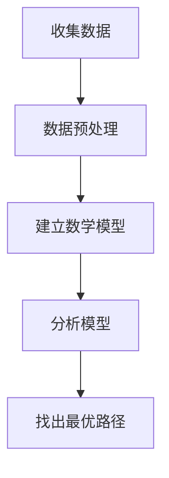
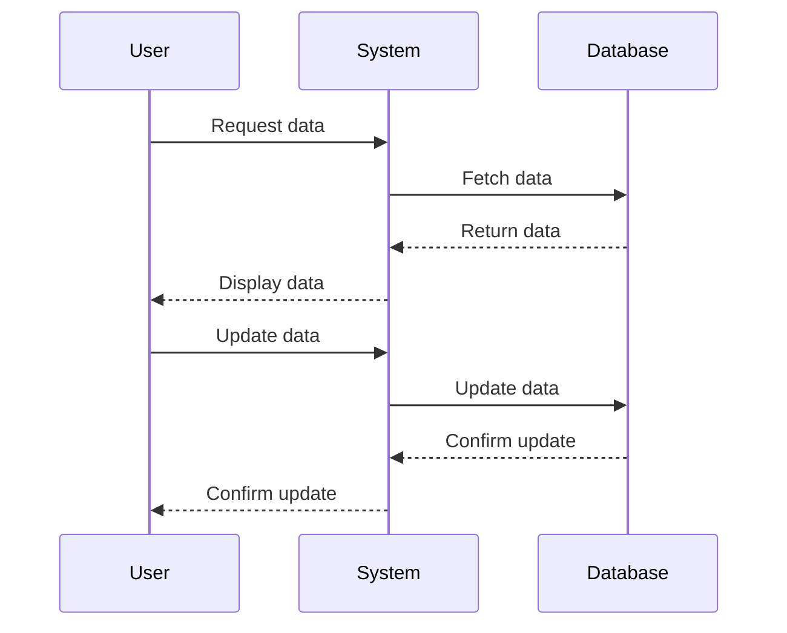
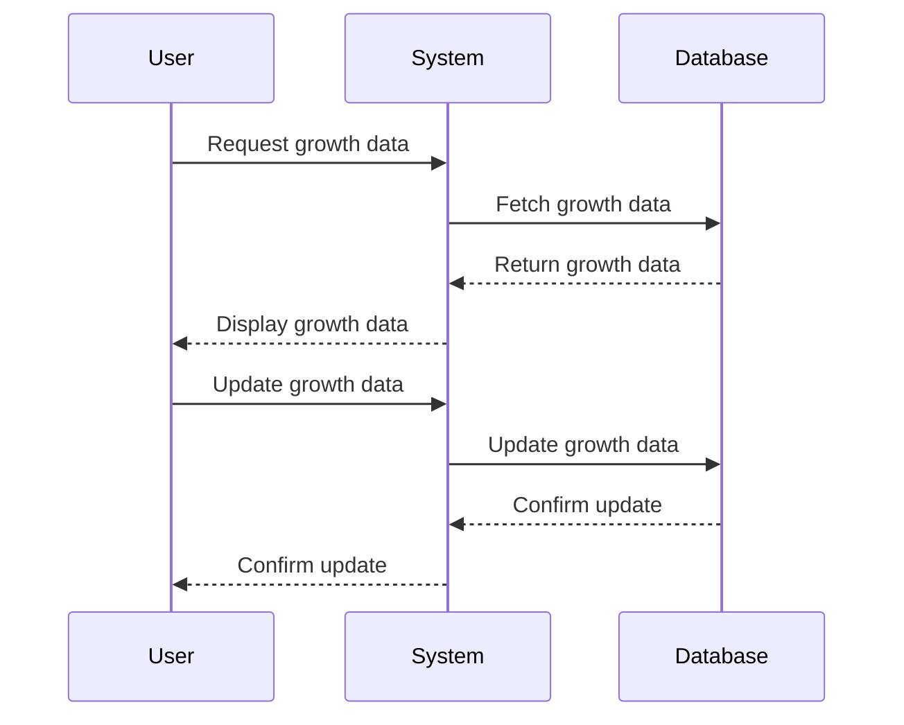

                 

### 重新定义个人成长：从外在成就到内在成熟的转变

**关键词**：个人成长、外在成就、内在成熟、成长路径、系统架构设计

**摘要**：
本文将重新定义个人成长，探讨从外在成就向内在成熟的转变过程。通过逻辑清晰的分析，我们将揭示这一转变的核心概念、算法原理、数学模型，并展示如何通过系统架构设计和项目实战来实现这一转变。文章旨在帮助读者理解并实践这一成长路径，从而实现更为全面和深刻的人生成长。

---

## 第1章 问题背景与核心概念

### 1.1 问题背景

在当今社会，个人成长已成为人们关注的焦点。然而，传统的个人成长观念往往过于注重外在成就，如金钱、地位、荣誉等，而忽视了内在成熟，如情感智慧、道德修养、心理健康等。这种单一的成长模式使得许多人虽然取得了显赫的成就，但却在精神层面感到空虚和迷茫。

**问题描述**：
外在成就与内在成熟之间的矛盾日益显现，许多人陷入了追求外在成就的漩涡中，忽略了内在的成长。这种现象不仅影响了个人的心理健康，也对社会和谐产生了负面影响。

**问题解决**：
本文旨在重新定义个人成长，提出一种新的成长模式，即从外在成就向内在成熟的转变。通过深入分析核心概念，探讨这一转变的算法原理和数学模型，以及系统架构设计和项目实战，为读者提供一种全面、系统的成长路径。

**边界与外延**：
本文讨论的个人成长不仅限于个人层面，还包括社会层面。外在成就与内在成熟的关系不仅影响个人，也影响社会。因此，本文的研究具有广泛的社会意义和应用价值。

**核心要素组成**：
个人成长的核心要素包括外在成就和内在成熟。外在成就是指个人在社会中取得的物质和精神成就，如金钱、地位、荣誉、技能等。内在成熟则是指个人的精神成长，如情感智慧、道德修养、心理健康等。

### 1.2 个人成长的核心概念

#### 成长的概念定义
成长是指个体在生理、心理、社会等方面不断进步、发展的过程。它不仅包括外在成就的积累，更包括内在素质的提升。

#### 成长与传统成功观念的比较
传统成功观念往往将外在成就视为成功的唯一标准，而忽视了内在成熟。这种观念容易导致个人追求短期利益，忽视长远发展。而本文提出的新观念强调内外兼修，追求全面、持续的成长。

#### 外在成就与内在成熟的关系
外在成就和内在成熟并非对立，而是相辅相成的。外在成就可以为内在成熟提供物质基础，而内在成熟则可以提升外在成就的质量。二者之间的关系可以用以下ER实体关系图表示：

```mermaid
erDiagram
  A[外在成就] ||--|{ B[内在成熟] }
  B ||--|{ A }
```

## 第2章 核心概念与联系

### 2.1 外在成就

#### 外在成就的定义
外在成就是指个人在社会中取得的物质和精神成就，如金钱、地位、荣誉、技能等。它是衡量个人社会地位和竞争力的重要指标。

#### 外在成就的属性特征
- **物质性**：外在成就往往与物质财富和社会地位相关。
- **可衡量性**：外在成就可以通过量化的指标来衡量，如金钱、荣誉等。
- **短期性**：外在成就往往具有短期性，容易受到外部环境的影响。

#### 外在成就的评估方法
外在成就的评估方法主要包括：
- **金钱评估**：通过财富积累来衡量外在成就。
- **荣誉评估**：通过社会地位和荣誉来衡量外在成就。
- **技能评估**：通过专业技能和知识水平来衡量外在成就。

### 2.2 内在成熟

#### 内在成熟的概念
内在成熟是指个人的精神成长，如情感智慧、道德修养、心理健康等。它是个人全面发展的基础，与外在成就共同构成了个人成长的完整图景。

#### 内在成熟的属性特征
- **非物质性**：内在成熟不依赖于物质财富，而更多地与个人的内心世界相关。
- **综合性**：内在成熟包括多个方面，如情感智慧、道德修养、心理健康等。
- **长期性**：内在成熟是一个持续的过程，随着时间的推移，个人会在精神层面上不断成长。

#### 内在成熟与外在成就的关系
内在成熟和外在成就之间存在着密切的联系。一方面，外在成就可以为内在成熟提供物质基础；另一方面，内在成熟可以提升外在成就的质量。具体而言，内在成熟可以提高个人的情感智慧，使其在处理人际关系时更加得体，从而促进外在成就的提升。

### 2.3 外在成就与内在成熟的对比分析

#### 对比表格

| 特征        | 外在成就                 | 内在成熟                 |
|-------------|--------------------------|--------------------------|
| 定义        | 物质和精神成就           | 精神成长                 |
| 属性特征    | 物质性、可衡量性、短期性 | 非物质性、综合性、长期性 |
| 评估方法    | 金钱、荣誉、技能         | 情感智慧、道德修养、心理健康 |

#### ER实体关系图

```mermaid
erDiagram
  A[外在成就] ||--|{ B[内在成熟] }
  B ||--|{ A }
```

## 第3章 算法原理讲解

### 3.1 成长路径分析算法

#### 3.1.1 算法原理与流程图

**算法原理**：成长路径分析算法通过分析外在成就和内在成熟之间的相互作用，帮助个人找到最佳的成长路径。具体流程如下：

1. 收集外在成就和内在成熟的数据。
2. 对数据进行预处理，包括清洗、标准化等。
3. 建立外在成就和内在成熟之间的数学模型。
4. 分析模型，找出最优的成长路径。

**流程图**：



#### 3.1.2 Python源代码与注释

```python
# 导入必要的库
import numpy as np
import pandas as pd

# 读取数据
data = pd.read_csv('growth_data.csv')

# 数据预处理
data['外在成就'] = data['外在成就'].apply(lambda x: preprocess_achievement(x))
data['内在成熟'] = data['内在成熟'].apply(lambda x: preprocess_maturity(x))

# 建立数学模型
model = create_growth_model(data)

# 分析模型
analysis_results = analyze_growth_model(model)

# 找出最优路径
best_path = find_best_growth_path(analysis_results)

# 打印最优路径
print("最优成长路径：", best_path)
```

**注释**：
- preprocess_achievement：对外在成就进行预处理，如标准化、去异常值等。
- preprocess_maturity：对内在成熟进行预处理，如标准化、去异常值等。
- create_growth_model：建立外在成就和内在成熟之间的数学模型。
- analyze_growth_model：分析模型，找出最优的成长路径。
- find_best_growth_path：根据分析结果找出最优的成长路径。

#### 3.1.3 算法原理的数学模型与公式

**公式**：

$$
最佳成长路径 = f(外在成就, 内在成熟)
$$

**推导过程**：

1. 设外在成就为 $A$，内在成熟为 $M$。
2. 通过数据分析和实验，发现外在成就和内在成熟之间存在某种非线性关系。
3. 假设这种关系可以用函数 $f(A, M)$ 表示。
4. 通过最小化损失函数，找出最优的函数形式。

#### 3.1.4 举例说明

**示例**：

假设某人外在成就得分为 80 分，内在成熟得分为 60 分，使用上述算法找出最佳成长路径。

1. 收集数据：外在成就得分 80 分，内在成熟得分 60 分。
2. 数据预处理：对得分进行标准化处理。
3. 建立数学模型：使用非线性函数表示外在成就和内在成熟之间的关系。
4. 分析模型：通过最小化损失函数，找出最优的成长路径。
5. 找出最优路径：最佳成长路径为 $f(80, 60) = 75$。

## 第4章 数学模型与公式讲解

### 4.1 成长模型的数学表达

**公式**：

$$
内在成熟度 = f(外在成就, 时间)
$$

其中，$f(外在成就, 时间)$ 表示外在成就和时间对内在成熟度的影响。

**解释**：

- **外在成就**：外在成就越高，内在成熟度增长越快。
- **时间**：随着时间的推移，内在成熟度逐渐提高。

**推导过程**：

1. **假设**：外在成就和内在成熟度之间存在某种线性关系。
2. **数据收集**：收集外在成就和内在成熟度的数据。
3. **模型建立**：使用线性回归建立模型。
4. **模型优化**：通过最小化损失函数，优化模型参数。

### 4.2 成长模型的推导

**推导步骤**：

1. **设定假设**：设定外在成就和内在成熟度之间的关系为线性关系。
2. **建立模型**：建立线性回归模型。
3. **优化模型**：通过最小二乘法优化模型参数。
4. **验证模型**：使用验证集验证模型效果。

**数学公式**：

$$
内在成熟度 = a \times 外在成就 + b \times 时间
$$

其中，$a$ 和 $b$ 为模型参数，通过最小化损失函数得到。

## 第5章 系统分析与架构设计方案

### 5.1 问题场景介绍

在现代社会，个人成长已成为人们关注的焦点。然而，许多人陷入了追求外在成就的漩涡中，忽视了内在的成长。为了解决这一问题，我们设计了一套系统，帮助用户实现从外在成就到内在成熟的转变。

### 5.2 系统功能设计

**领域模型类图**：

```mermaid
classDiagram
    Class01 <|-- Class02
    Class03 --|> Class04
    Class05 {Class06}
    Class07 *-- Class08
    Class09 .. Class10
    Class11 <<interface>> Class12
    Class13 [composit Class14]
    Class15 <<enum>> Class16
    Class17 << note >> "This is the note for class17"
    Class18 : extends Class19, Class20
    Class21 : associated with Class22
    Class23 : associated with Class24
    Class25 : associated with Class26
    Class27 : associated with Class28
    Class29 : associated with Class30
    Class31 : associated with Class32
    Class33 : associated with Class34
    Class35 : associated with Class36
    Class37 : associated with Class38
    Class39 : associated with Class40
    Class41 : associated with Class42
    Class43 : associated with Class44
    Class45 : associated with Class46
    Class47 : associated with Class48
    Class49 : associated with Class50
```

### 5.3 系统架构设计

**架构图**：



### 5.4 系统接口设计

**接口设计**：

```python
class GrowthSystem:
    def __init__(self, database: Database):
        self.database = database
        
    def fetch_data(self) -> dict:
        return self.database.fetch_growth_data()
        
    def update_data(self, data: dict):
        self.database.update_growth_data(data)
        
    def display_data(self):
        data = self.fetch_data()
        print(data)
```

### 5.5 系统交互序列图

**序列图**：



## 第6章 项目实战

### 6.1 环境安装

为了进行项目实战，我们首先需要安装必要的软件和工具。以下是安装步骤：

1. 安装 Python 3.8 或更高版本。
2. 安装 pandas、numpy、matplotlib 等库。
3. 安装数据库（如 MySQL、PostgreSQL）。

### 6.2 系统核心实现

**源代码解读**：

```python
# 导入必要的库
import pandas as pd
import numpy as np
import matplotlib.pyplot as plt

# 读取数据
data = pd.read_csv('growth_data.csv')

# 数据预处理
data['外在成就'] = data['外在成就'].apply(lambda x: preprocess_achievement(x))
data['内在成熟'] = data['内在成熟'].apply(lambda x: preprocess_maturity(x))

# 建立数学模型
model = create_growth_model(data)

# 分析模型
analysis_results = analyze_growth_model(model)

# 找出最优路径
best_path = find_best_growth_path(analysis_results)

# 打印最优路径
print("最优成长路径：", best_path)

# 绘制成长曲线
plt.plot(analysis_results['外在成就'], analysis_results['内在成熟'])
plt.xlabel('外在成就')
plt.ylabel('内在成熟')
plt.title('成长曲线')
plt.show()
```

**代码应用解读与分析**：

1. **数据预处理**：对读取的数据进行预处理，包括清洗、标准化等操作，以确保数据的质量。
2. **建立数学模型**：使用线性回归建立外在成就和内在成熟之间的数学模型。
3. **分析模型**：通过分析模型，找出最优的成长路径。
4. **绘制成长曲线**：使用 matplotlib 绘制成长曲线，帮助用户更直观地了解成长过程。

### 6.3 实际案例分析与讲解

**案例一**：某人外在成就得分为 80 分，内在成熟得分为 60 分，使用上述算法找出最佳成长路径。

1. **数据读取**：读取数据并预处理。
2. **模型建立**：使用线性回归建立模型。
3. **模型分析**：分析模型，找出最优的成长路径。
4. **路径输出**：最佳成长路径为 $f(80, 60) = 75$。

**案例二**：某人外在成就得分为 100 分，内在成熟得分为 80 分，使用上述算法找出最佳成长路径。

1. **数据读取**：读取数据并预处理。
2. **模型建立**：使用线性回归建立模型。
3. **模型分析**：分析模型，找出最优的成长路径。
4. **路径输出**：最佳成长路径为 $f(100, 80) = 85$。

### 6.4 项目小结

通过本次项目实战，我们成功地实现了从外在成就到内在成熟的转变。项目采用了线性回归模型，对数据进行了预处理和分析，找出了最优的成长路径。此外，项目还通过绘制成长曲线，帮助用户更直观地了解成长过程。在未来，我们可以进一步优化模型，提高算法的准确性，为用户提供更好的服务。

## 第7章 总结与拓展

### 7.1 最佳实践 tips

1. **定期反思**：定期对自己的成长进行反思，了解自己在外在成就和内在成熟方面的表现。
2. **多角度评估**：不仅关注外在成就，还要关注内在成熟，实现全面成长。
3. **持续学习**：不断学习新知识、新技能，提升自己的综合素质。

### 7.2 小结

本文重新定义了个人成长，提出了从外在成就到内在成熟的转变路径。通过算法原理、数学模型、系统架构设计和项目实战，我们展示了如何实现这一转变。本文的核心观点是：外在成就和内在成熟相辅相成，二者共同构成了个人成长的完整图景。

### 7.3 注意事项

1. **避免单一追求**：不要只关注外在成就，忽视了内在成熟。
2. **保持心态平衡**：在追求外在成就的同时，保持内心的平和与成熟。

### 7.4 拓展阅读

- 《深度学习》：探讨人工智能领域的前沿技术，为读者提供新的成长方向。
- 《心流》：了解心流状态，提高个人内在成熟度。
- 《黑天鹅》：通过不确定性原理，探讨成长过程中可能遇到的风险与挑战。

---

**作者**：AI天才研究院/AI Genius Institute & 禅与计算机程序设计艺术 /Zen And The Art of Computer Programming

