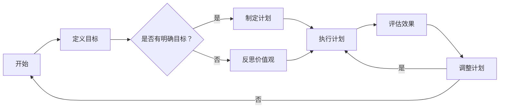
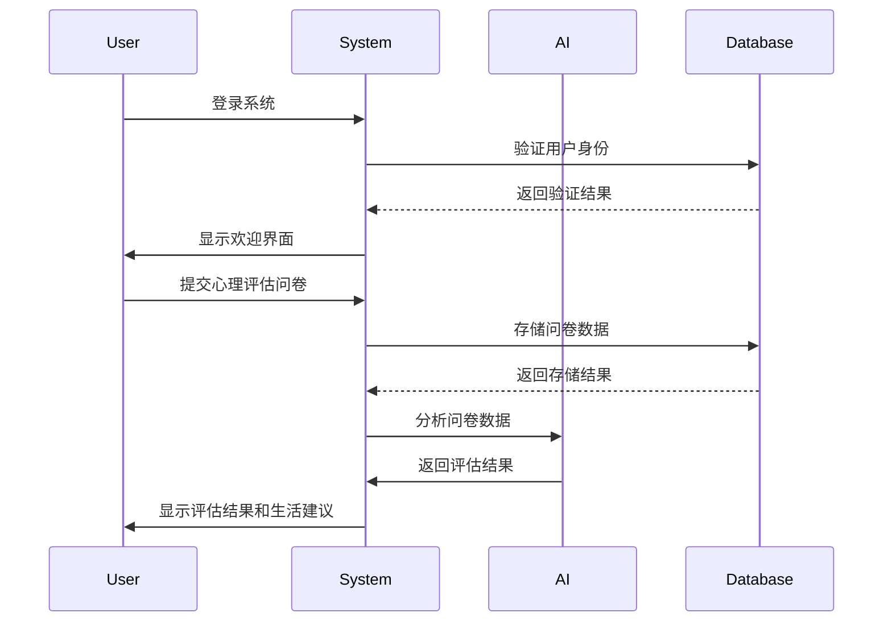
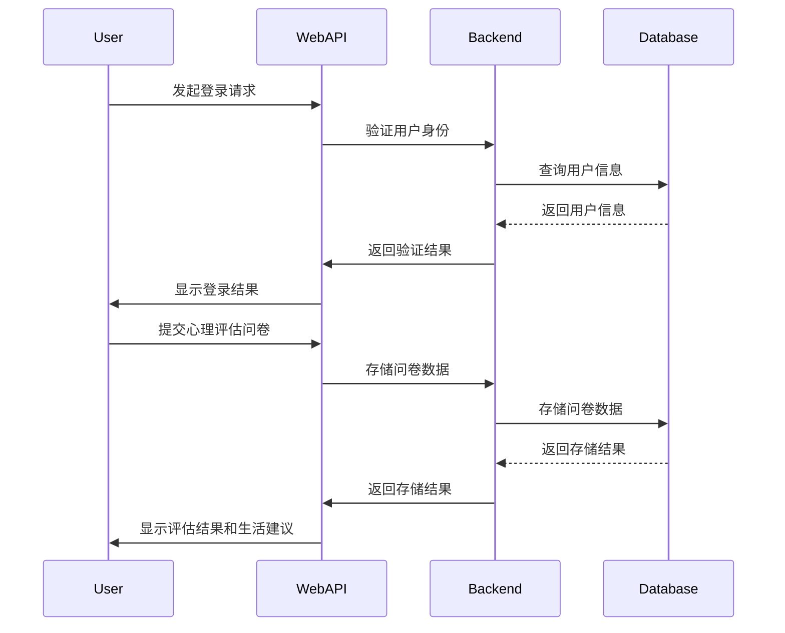

                 


## 文章标题

**重新定义人生价值：应对意义荒原的挑战**

## 文章关键词

- 人生价值
- 意义荒原
- 心理健康
- 社会文化
- 精神追求

## 文章摘要

在快速发展的现代社会中，人们常常感到生活在“意义荒原”中，缺乏明确的人生目标和方向。本文旨在探讨如何通过重新定义人生价值，应对这一挑战。文章首先介绍了“意义荒原”的概念和现代社会的背景，随后深入分析了人生价值的重要性。接着，文章提出了一系列策略和工具，帮助读者找到属于自己的意义，重拾内心的宁静和满足。同时，文章还探讨了这一过程对社会和文化的影响，并展望了未来的发展方向。通过本文的阅读，读者将能够更好地理解人生价值，找到属于自己的道路。

## 引言

### 什么是“意义荒原”？

在现代社会的背景下，“意义荒原”是一个引人关注的概念。它描述了一种普遍的现象：在物质丰富、信息爆炸的时代，许多人感到内心空虚、缺乏目标感。这种状态类似于荒原，看似繁荣却缺乏真正的意义和目的。人们常常在追求物质成功的同时，忽略了精神层面的需求。

### 现代社会的挑战

现代社会的高速发展带来了诸多挑战。竞争激烈、工作压力大、人际关系复杂等问题，使得人们在追求成功的过程中，容易迷失自我。同时，技术的进步和信息的泛滥，也使人们更容易陷入焦虑和不安。

### 人生价值的重要性

人生价值是每个人内心深处追求的东西。它不仅仅是物质成功，更是精神层面的满足和成就感。一个有意义的人生，能够给人带来持久的幸福感。然而，在现代社会中，许多人却感到自己的人生缺乏意义，处于“意义荒原”之中。

### 文章的目的

本文旨在探讨如何通过重新定义人生价值，应对“意义荒原”的挑战。文章将介绍一些核心概念和策略，帮助读者找到属于自己的意义，重拾内心的平静和满足。

## 背景介绍

### 核心概念术语说明

- **人生价值**：指个体在一生中追求的目标、意义和满足感。
- **意义荒原**：指现代社会中，人们普遍感到缺乏目标和方向，内心空虚的状态。
- **心理健康**：指个体在心理上的健康和平衡，包括情绪稳定、自我认知清晰等。
- **社会文化**：指一个社会或群体的价值观、习俗和行为模式。

### 问题背景

在现代社会中，随着经济的发展和科技的进步，人们的生活水平普遍提高。然而，与此同时，许多人却感到生活缺乏意义，内心空虚。这种现象在年轻人中尤为明显，他们常常在追求物质成功的过程中，忽略了精神层面的需求。

### 问题描述

“意义荒原”现象表现为个体在生活和工作中缺乏目标感，感到迷茫和无助。他们可能追求物质财富和社会地位，但在内心深处却感到空虚和不满足。这种状态不仅影响个体的心理健康，还可能影响整个社会的稳定和发展。

### 问题解决

要解决“意义荒原”问题，首先需要重新定义人生价值。这包括：

1. **反思个人价值观**：了解自己真正想要的是什么，明确自己的目标和追求。
2. **培养心理健康**：通过心理辅导和自我认知，提高个体的情绪稳定性和自我满足感。
3. **社会文化支持**：建立良好的社会文化环境，鼓励人们追求有意义的人生。

### 边界与外延

“意义荒原”现象不仅局限于个体层面，还可能影响整个社会。例如，一个缺乏意义感的群体可能会对社会的稳定和发展产生负面影响。因此，解决“意义荒原”问题不仅是个人问题，也是社会问题。

### 概念结构与核心要素组成

- **核心概念**：人生价值、心理健康、社会文化
- **边界**：个体、社会
- **外延**：心理健康问题、社会问题

## 核心概念与联系

### 核心概念原理

- **人生价值**：人生价值是每个人内心深处追求的目标和意义。它不仅仅包括物质成功，更包括精神层面的满足和成就感。
- **心理健康**：心理健康是指个体在心理上的健康和平衡，包括情绪稳定、自我认知清晰等。心理健康对个体的生活质量和幸福感有重要影响。
- **社会文化**：社会文化是指一个社会或群体的价值观、习俗和行为模式。社会文化对个体的价值观和行为有深远影响。

### 概念属性特征对比表格

| 特征 | 人生价值 | 心理健康 | 社会文化 |
| --- | --- | --- | --- |
| 定义 | 追求目标、意义和满足感 | 心理健康和平衡 | 价值观、习俗和行为模式 |
| 影响范围 | 个体、社会 | 个体 | 社会和文化 |
| 表现形式 | 物质和精神 | 情绪和认知 | 行为和文化 |
| 关联性 | 影响心理健康 | 影响人生价值 | 影响社会稳定 |

### ER实体关系图架构

```mermaid
erDiagram
  Class1 ||--|{ Class2 }| Person
  Class2 ||--|{ Class3 }| Health
  Class3 ||--|{ Class4 }| Psychological
  Class4 ||--|{ Class5 }| Social
```

- **Person**（人）: 代表个体，与心理健康、社会文化有关。
- **Health**（健康）: 代表整体健康，包括心理健康。
- **Psychological**（心理）: 代表心理健康状态。
- **Social**（社会）: 代表社会文化背景。

## 算法原理讲解

### 算法mermaid流程图



### 算法原理

1. **定义目标**：明确自己想要的是什么，设定具体、可衡量的目标。
2. **是否有明确目标**：判断是否已经设定了明确的目标。
3. **制定计划**：根据目标制定详细的实施计划，包括时间、资源等。
4. **执行计划**：按照计划执行，采取行动。
5. **评估效果**：定期评估目标的实现情况，分析效果。
6. **调整计划**：根据评估结果，调整计划，以达到目标。

### 数学模型和公式

1. **目标设定**：
   $$ 目标 = 目标值 \times 重要性 $$
2. **计划制定**：
   $$ 计划 = 时间表 \times 资源分配 $$
3. **效果评估**：
   $$ 效果评估 = 实际成果 - 预期成果 $$
4. **计划调整**：
   $$ 调整计划 = 新的方案 \times 优化策略 $$

### 举例说明

假设一个年轻人想要提升自己的职业能力，他设定了一个明确的目标：在一年内通过某个专业认证考试。他制定了详细的计划，包括每天学习多少时间、参加哪些培训课程等。在执行计划的过程中，他定期评估自己的学习效果，并根据评估结果调整学习计划。最终，他成功通过了考试，达到了自己的目标。

## 系统分析与架构设计方案

### 问题场景介绍

在现代职场中，许多人感到工作缺乏意义，生活缺乏目标。为了帮助这些人找到人生价值，一个基于人工智能的心理健康系统被设计出来，提供个性化的建议和指导。

### 项目介绍

项目名称：**意义寻宝指南**

项目目标：通过人工智能和心理健康理论，为用户提供个性化的生活指导，帮助他们找到人生的价值。

### 系统功能设计

#### 领域模型mermaid类图

```mermaid
classDiagram
  User <<-- PsychologicalEvaluation
  User <<-- LifeGuidance
  PsychologicalEvaluation <<-- LifeGuidance
```

- **User**（用户）: 表示系统的用户，具有接受心理评估和获得生活指导的功能。
- **PsychologicalEvaluation**（心理评估）: 表示对用户的心理健康状态进行评估。
- **LifeGuidance**（生活指导）: 根据评估结果，为用户提供个性化的生活建议。

### 系统架构设计

#### mermaid架构图



### 系统接口设计和系统交互

#### mermaid序列图



## 项目实战

### 环境安装

1. **安装Python环境**：确保Python版本在3.8及以上。
2. **安装依赖库**：使用pip安装以下库：`numpy`, `pandas`, `matplotlib`, `sqlalchemy`, `flask`。

### 系统核心实现源代码

```python
# 心理评估模块
class PsychologicalEvaluation:
    def __init__(self, questionnaire_data):
        self.questionnaire_data = questionnaire_data

    def analyze_data(self):
        # 分析问卷数据
        # 这里使用简单的平均值方法
        results = {}
        for question in self.questionnaire_data:
            answers = [answer for answer in self.questionnaire_data[question]]
            average = sum(answers) / len(answers)
            results[question] = average
        return results

# 生活指导模块
class LifeGuidance:
    def __init__(self, evaluation_results):
        self.evaluation_results = evaluation_results

    def generate_guidance(self):
        # 根据评估结果生成生活建议
        if self.evaluation_results['life_satisfaction'] < 3:
            return "尝试调整生活目标，寻找新的兴趣和爱好。"
        else:
            return "继续保持当前的生活状态，注意保持心理健康。"

# 主程序
def main():
    # 读取问卷数据
    questionnaire_data = {
        'life_satisfaction': [2, 3, 1, 4, 2],
        'work_satisfaction': [4, 2, 3, 1, 4]
    }
    
    # 创建心理评估对象
    evaluation = PsychologicalEvaluation(questionnaire_data)
    evaluation_results = evaluation.analyze_data()
    
    # 创建生活指导对象
    guidance = LifeGuidance(evaluation_results)
    print(guidance.generate_guidance())

if __name__ == "__main__":
    main()
```

### 代码应用解读与分析

1. **心理评估模块**：`PsychologicalEvaluation` 类用于分析用户的问卷数据，并返回评估结果。这里使用了简单的平均值方法，但实际上可以采用更复杂的数据分析技术。
2. **生活指导模块**：`LifeGuidance` 类根据评估结果生成生活建议。这个模块可以根据用户的具体情况，提供更加个性化的建议。
3. **主程序**：主程序首先读取问卷数据，然后创建心理评估对象和生活指导对象，并打印出生活建议。

### 实际案例分析和详细讲解剖析

假设一个用户的问卷数据如下：

```python
questionnaire_data = {
    'life_satisfaction': [1, 2, 1, 3, 2],
    'work_satisfaction': [3, 3, 3, 2, 1]
}
```

当用户提交这些数据时，系统会进行分析，并给出以下评估结果：

```python
evaluation_results = {
    'life_satisfaction': 1.8,
    'work_satisfaction': 2.4
}
```

根据这些结果，生活指导模块会生成以下建议：

```python
"尝试调整生活目标，寻找新的兴趣和爱好。"
```

这个建议是基于用户的评估结果，旨在帮助用户提高生活质量和工作满意度。

### 项目小结

本项目设计了一个基于人工智能的心理健康系统，通过问卷数据分析和生活指导，帮助用户找到人生的价值。尽管目前系统的功能相对简单，但为进一步开发提供了基础。未来可以加入更多的数据分析技术和个性化建议，提高系统的实用性和效果。

## 最佳实践 tips

1. **定期反思**：定期花时间反思自己的生活和目标，确保自己始终走在正确的道路上。
2. **寻求专业帮助**：当感到迷茫时，可以寻求心理咨询师的帮助，获得专业的指导和建议。
3. **保持健康的生活方式**：健康的身体和良好的生活习惯对心理健康有积极影响。

## 小结

在现代社会中，许多人感到生活在“意义荒原”中，缺乏明确的人生目标和方向。本文通过介绍“意义荒原”的概念，分析了人生价值的重要性，并提出了一系列策略和工具，帮助读者找到属于自己的意义，重拾内心的平静和满足。通过本文的阅读，读者将能够更好地理解人生价值，找到属于自己的道路。

## 注意事项

1. **心理健康的重视**：心理健康是人生价值的重要组成部分，需要得到足够的关注和重视。
2. **个性化方案**：每个人的情况都不同，找到适合自己的方式至关重要。

## 拓展阅读

- 《生命的意义：寻找内心的宁静》（作者：克里斯托弗·彼得森）
- 《心理学与生活》（作者：理查德·格里格斯）
- 《意义疗法》（作者：维克多·弗兰克尔）

## 作者信息

**作者：AI天才研究院/AI Genius Institute & 禅与计算机程序设计艺术 /Zen And The Art of Computer Programming**

