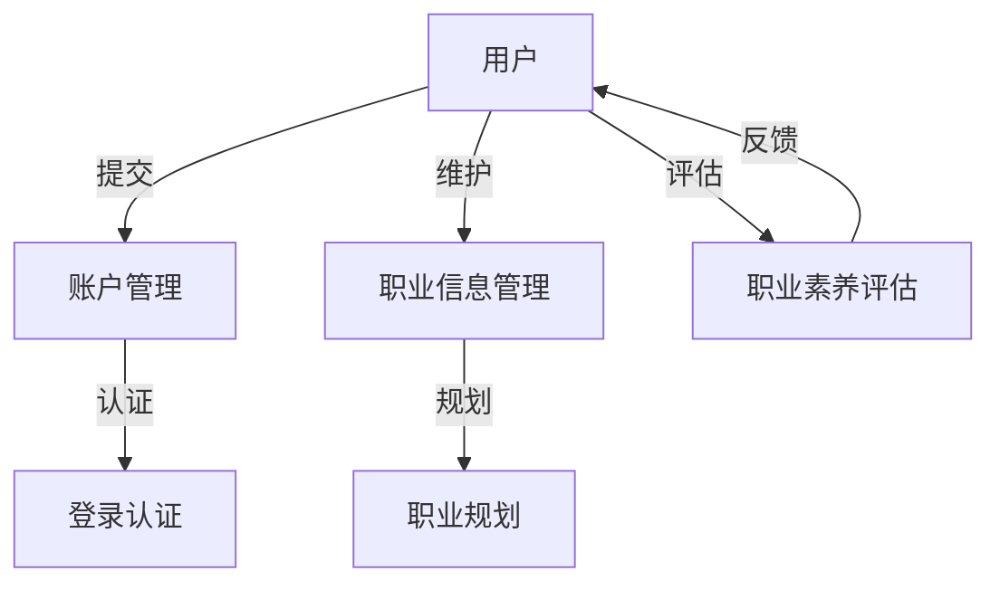
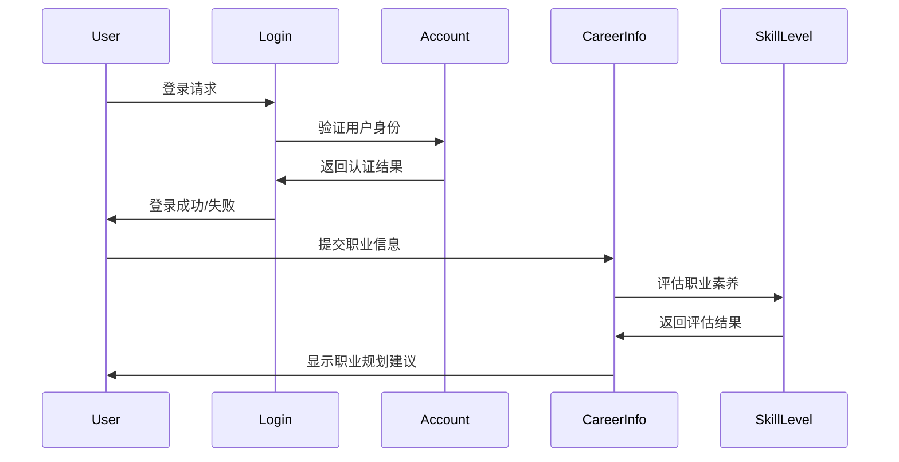
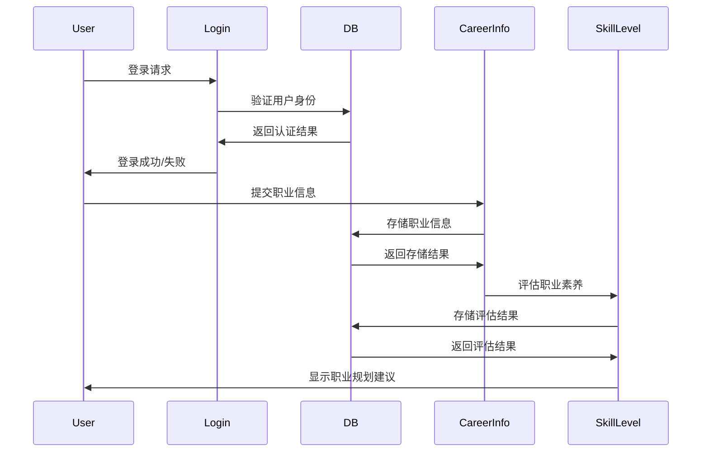

                 

### 文章标题

《重新定义工作的意义：21世纪职场观》

---

关键词：21世纪职场、工作意义、职业发展、技术创新、人工智能、大数据

---

摘要：在科技迅猛发展的21世纪，职场环境发生了深刻变革。人工智能、大数据、云计算等新技术推动了职场工作的变革，传统的职场观念和价值观受到挑战。本文旨在探讨如何重新审视和定义工作的意义，帮助职场人士在新技术背景下提升职业素养，实现个人与职业的共同成长。

---

## 引言

### 1. 引言

《重新定义工作的意义：21世纪职场观》旨在探讨在科技迅猛发展的21世纪，如何重新审视和定义工作的意义。随着人工智能、大数据、云计算等技术的广泛应用，职场环境发生了深刻变革，传统的职场观念和价值观面临着前所未有的挑战和机遇。本书将深入剖析这一时代背景下的职场现象，探讨在新技术推动下，如何寻找工作的内在价值，提升职业素养，实现个人与职业的共同成长。

### 2. 核心问题

#### 问题背景

随着技术的飞速发展，职场环境发生了翻天覆地的变化，如何适应这种变化，重新定义工作的意义成为职场人士普遍关注的问题。

#### 问题描述

在新的职场生态下，如何找到工作的内在动力和意义，提升职业满意度，实现个人价值和组织目标的协同发展。

#### 问题解决

通过引入新的职场观念，借助技术工具，建立有效的职业规划和管理机制，助力职场人士在变革中找到工作的意义和方向。

#### 边界与外延

本书主要关注21世纪职场环境的变革，探讨技术对职场影响的问题，但不涉及技术细节和具体应用。

### 3. 概念结构与核心要素组成

#### 21世纪职场观

指在新的时代背景下，职场人士对工作意义、价值观和职业发展的重新认识和定位。

#### 人工智能与职场

探讨人工智能在职场中的应用，及其对传统工作模式的影响。

#### 职业素养

指职场人士在职业生涯中应具备的基本能力和素质。

#### 职业规划与管理

指通过科学的规划和管理，实现个人职业目标的路径和方法。

---

## 第一部分: 21世纪职场环境的变革

### 第1章: 技术驱动的职场变革

#### 1.1 技术发展与职场演变

##### 1.1.1 人工智能与职场

随着人工智能技术的发展，许多传统职业正面临被取代的挑战。然而，与此同时，人工智能也创造了大量新的职业机会。例如，数据科学家、机器学习工程师和自然语言处理专家等职位应运而生。这些新职位不仅要求员工具备高超的技术能力，还需要具备跨学科的综合素质。

##### 1.1.2 大数据和云计算对职场的影响

大数据技术使得企业能够从海量数据中提取有价值的信息，从而提升决策效率和业务性能。云计算的普及则使得远程办公和协同工作变得更加便捷。这些技术不仅改变了职场的工作方式，也对职场人员的能力提出了新的要求。

##### 1.1.3 互联网和物联网的职场应用

互联网技术的普及使得信息获取和交流更加高效。物联网技术的应用则使得设备之间能够实现智能连接，从而提高工作效率。例如，智能制造和智能交通等领域的发展，对职场人员的技能提出了更高的要求。

#### 1.2 职场环境的变革

##### 1.2.1 工作内容与工作方式的改变

随着技术的进步，许多工作内容和工作方式发生了变化。例如，自动化和人工智能的应用使得某些重复性、低技能的工作逐渐被取代，而更多的工作需要员工具备更高的技术能力和创新能力。

##### 1.2.2 职场角色的重新定义

在新技术背景下，职场角色的定义也发生了变化。传统的“岗位”概念逐渐被打破，员工需要具备跨领域的技能和知识，能够在多个角色之间灵活转换。

##### 1.2.3 职场竞争与合作的转变

技术的进步不仅改变了职场的工作内容和工作方式，也改变了职场竞争和合作的模式。在传统职场中，竞争主要发生在同一家公司的员工之间。然而，在新技术推动下，跨公司、跨行业甚至跨国界的竞争与合作变得更加普遍。

#### 1.3 新技术对职业发展的影响

##### 1.3.1 技术能力的要求

随着技术的进步，职场对员工的技术能力提出了更高的要求。例如，编程能力、数据分析能力和机器学习技能等成为职场竞争力的关键要素。

##### 1.3.2 职业前景与职业选择

新技术的涌现不仅创造了新的职业机会，也改变了职业前景和职业选择。职场人士需要根据技术发展趋势，及时调整自己的职业规划，以适应不断变化的职场环境。

##### 1.3.3 职业发展的新机遇

新技术不仅带来了挑战，也创造了新的机遇。例如，远程办公、在线教育和数字货币等领域的发展，为职场人士提供了更多的职业选择和发展空间。

#### 1.4 职场人士的应对策略

##### 1.4.1 提升技术素养

职场人士需要不断提升自己的技术素养，以适应新技术带来的变化。例如，通过在线课程、技术研讨会和实战项目等方式，提升自己的技术能力。

##### 1.4.2 职业规划的重要性

有效的职业规划是职场人士应对技术变革的关键。通过制定明确的职业目标，制定实现目标的路径，职场人士可以更好地应对职场挑战。

##### 1.4.3 适应职场变革的技能

职场人士需要具备适应职场变革的技能，例如沟通协作能力、问题解决能力和创新思维等。这些技能不仅有助于提升职场竞争力，也有助于实现个人与职业的共同成长。

#### 1.5 本章小结

随着人工智能、大数据和云计算等新技术的广泛应用，21世纪职场环境发生了深刻变革。职场人士需要重新审视和定义工作的意义，提升职业素养，适应新技术带来的变化。通过提升技术素养、制定职业规划和培养适应职场变革的技能，职场人士可以在新技术背景下实现个人与职业的共同成长。

---

### 第二部分: 重新定义工作的意义

### 第2章: 21世纪职场价值观的转型

#### 2.1 职场价值观的演变

##### 2.1.1 传统的职场价值观

在过去的职场环境中，传统的价值观主要包括：忠诚、敬业、服从和稳定。这些价值观在很大程度上推动了职场的发展和繁荣。

##### 2.1.2 新时代下的职场价值观

随着时代的变迁，21世纪的职场价值观逐渐从传统的忠诚、敬业和服从，转变为创新、自主和合作。这种转变反映了职场对个性化和创新需求的日益重视。

##### 2.1.3 个人价值观与职业价值观的融合

在新时代的职场中，个人价值观和职业价值观的融合变得越来越重要。职场人士需要找到个人价值观与职业发展的平衡点，以实现个人与职业的共同成长。

#### 2.2 工作意义的再认识

##### 2.2.1 工作的价值取向

在21世纪的职场中，工作的价值取向发生了显著变化。过去，工作主要是为了赚钱和谋生。然而，在新时代的职场中，工作的价值取向逐渐从物质层面的追求，转向精神层面的满足。

##### 2.2.2 工作满意度与幸福感

随着职场环境的变革，工作满意度与幸福感成为衡量工作意义的重要指标。职场人士需要找到工作的内在动力和意义，以提高工作满意度和幸福感。

##### 2.2.3 工作目标与个人成长

在21世纪的职场中，工作目标与个人成长紧密相连。职场人士需要设定明确的工作目标，并通过持续的学习和成长，实现个人与职业的共同发展。

#### 2.3 寻找工作的内在价值

##### 2.3.1 工作的意义与目的

在21世纪的职场中，寻找工作的内在价值变得尤为重要。职场人士需要明确工作的意义和目的，以找到工作的内在动力。

##### 2.3.2 职场使命感

职场使命感是职场人士在追求工作内在价值过程中的重要动力。通过明确职场使命感，职场人士可以更好地找到工作的内在价值。

##### 2.3.3 工作与生活的平衡

在21世纪的职场中，工作与生活的平衡成为职场人士追求的重要目标。通过合理规划工作和生活，职场人士可以更好地实现工作与生活的平衡，提高生活质量。

#### 2.4 职场精神的塑造

##### 2.4.1 职业道德与职业操守

在21世纪的职场中，职业道德和职业操守的重要性日益凸显。职场人士需要树立正确的职业道德观念，遵守职业操守，以赢得同事和客户的尊重和信任。

##### 2.4.2 团队合作与个人责任

在21世纪的职场中，团队合作和个人责任同样重要。职场人士需要具备良好的团队合作精神，同时承担个人责任，以实现团队目标。

##### 2.4.3 职场心态的调整

在21世纪的职场中，调整职场心态至关重要。职场人士需要保持积极的心态，面对职场挑战，以实现个人与职业的共同成长。

#### 2.5 本章小结

在21世纪的职场中，职场价值观正在发生深刻变革。职场人士需要重新审视和定义工作的意义，通过寻找工作的内在价值，提升职业素养，实现个人与职业的共同成长。通过塑造职业道德与职业操守，培养团队合作与个人责任，调整职场心态，职场人士可以在新时代的职场中取得更大的成功。

---

### 第三部分: 实践与案例

### 第3章: 21世纪职场成功的要素

#### 3.1 职业发展的关键要素

##### 3.1.1 技术能力与业务能力的平衡

在21世纪的职场中，技术能力和业务能力的重要性不容忽视。职场人士需要在掌握核心技术的基础上，提升业务能力，以更好地应对职场挑战。

##### 3.1.2 沟通协作与团队领导力

有效的沟通协作和团队领导力是职场成功的关键要素。职场人士需要具备良好的沟通能力，能够与团队成员有效协作，并具备领导团队的能力。

##### 3.1.3 创新思维与问题解决能力

创新思维和问题解决能力是职场人士必备的能力。在新技术背景下，职场人士需要具备创新思维，能够迅速解决工作中遇到的问题。

#### 3.2 职场成功的故事与启示

##### 3.2.1 职场成功人士的经验分享

通过阅读职场成功人士的故事，我们可以从他们身上汲取到宝贵的经验和教训。例如，马云、马化腾等成功企业家，通过自己的努力和智慧，在职场中取得了卓越的成就。

##### 3.2.2 从失败中汲取的教训

失败是成功之母。通过分析职场人士的失败案例，我们可以了解到失败的原因，从而避免在职场中重蹈覆辙。

##### 3.2.3 成功的职场策略与技巧

成功的职场策略和技巧对于职场人士的成功至关重要。例如，有效的职业规划、持续的学习和自我提升等，都是实现职场成功的有效策略。

#### 3.3 职业规划的实践指南

##### 3.3.1 职业规划的基本步骤

制定职业规划是职场人士实现职业成功的关键。职业规划的基本步骤包括：自我评估、目标设定、路径规划和行动实施。

##### 3.3.2 职业目标设定与评估

设定明确的职业目标是职业规划的核心。职场人士需要根据自身兴趣、能力和市场需求，设定切实可行的职业目标，并定期评估目标的实现情况。

##### 3.3.3 职业路径选择与实施

职业路径选择是职业规划的重要环节。职场人士需要根据自身优势和职业目标，选择合适的职业路径，并制定详细的实施计划。

#### 3.4 职业发展的案例分析

##### 3.4.1 不同职业领域的成功案例

通过分析不同职业领域的成功案例，我们可以了解到职场成功的多种路径。例如，在技术领域，成功的程序员和技术专家；在商业领域，成功的企业家和创业者。

##### 3.4.2 跨行业职业发展的路径

跨行业职业发展是职场人士实现职业成长的有效途径。通过分析跨行业职业发展的案例，我们可以了解到不同行业之间的职业发展路径。

##### 3.4.3 职业发展的瓶颈与突破

在职业发展中，职场人士可能会遇到各种瓶颈。通过分析职业发展的瓶颈案例，我们可以了解到如何突破职业发展的瓶颈，实现职业成长。

#### 3.5 本章小结

在21世纪的职场中，职业成功需要多方面的能力。通过分析职场成功的关键要素、成功人士的经验分享、职业规划的实践指南和职业发展的案例分析，职场人士可以更好地理解职业成功的要素，并制定有效的职业规划，实现个人与职业的共同成长。

---

### 第四部分: 未来展望

### 第4章: 21世纪职场趋势与挑战

#### 4.1 21世纪职场趋势

##### 4.1.1 技术创新的持续发展

随着人工智能、大数据和云计算等技术的不断创新，21世纪职场将迎来更加智能化和高效化的工作模式。技术创新将继续推动职场变革，为职场人士提供更多的机遇。

##### 4.1.2 职场多样性与包容性的提升

在21世纪的职场中，多样性和包容性将成为重要的趋势。职场将更加关注性别、年龄、文化和背景的多样性，以创造一个更加公平和包容的工作环境。

##### 4.1.3 职业教育与培训的重要性

随着技术的不断进步，职场对员工的技术能力和素质要求越来越高。因此，职业教育和培训将成为职场人士提升竞争力的重要途径。

#### 4.2 职场挑战与应对策略

##### 4.2.1 技术变革带来的挑战

技术变革将带来一系列挑战，如工作机会的减少、职业竞争力的提升、隐私和安全等问题。职场人士需要适应这些变化，以应对未来的挑战。

##### 4.2.2 职场竞争与压力

随着职场竞争的加剧，职场人士将面临更大的压力。有效的压力管理和心理调适能力将成为职场成功的必备条件。

##### 4.2.3 技能需求的快速变化

技术发展的速度越来越快，职场人士需要不断更新自己的技能，以适应不断变化的市场需求。持续学习和终身学习将成为职场人士应对技能需求变化的重要策略。

##### 4.2.4 职业发展的不确定性

在21世纪的职场中，职业发展的路径和方向变得日益复杂和不确定。职场人士需要具备灵活的思维和适应能力，以应对职业发展的不确定性。

#### 4.3 职场人士的应对策略

##### 4.3.1 提升技术素养

职场人士需要不断提升自己的技术素养，以适应新技术带来的变化。通过参加培训课程、学习新技术和掌握新工具，职场人士可以提升自己的技术能力。

##### 4.3.2 职业规划的重要性

有效的职业规划是职场人士应对职场挑战的关键。通过制定明确的职业目标、设定实现目标的路径，职场人士可以更好地应对职场变化。

##### 4.3.3 培养适应能力

职场人士需要培养适应能力，以应对职场环境的快速变化。这包括灵活的思维、快速学习和解决问题的能力。

##### 4.3.4 持续学习和终身学习

持续学习和终身学习是职场人士提升竞争力的重要策略。通过不断学习新知识、新技能，职场人士可以保持竞争力，并在职场中取得成功。

#### 4.4 未来展望

在未来，21世纪的职场将面临更多机遇和挑战。职场人士需要不断适应变革，提升自己的技术素养和职业能力，以实现个人与职业的共同成长。通过有效的职业规划、持续学习和适应能力，职场人士可以在未来的职场中取得成功。

---

### 结尾

在21世纪的职场中，工作的意义和价值正经历着深刻的变革。人工智能、大数据、云计算等新技术的迅猛发展，不仅改变了职场的工作模式，也重新定义了工作的内涵。面对这样的变革，职场人士需要重新审视和定义工作的意义，找到工作的内在动力和目标。

本文从多个角度探讨了21世纪职场环境的变化，分析了技术对职场的影响，重新定义了工作的意义，并提出了职业规划和实践指南。通过这些探讨和分析，我们希望职场人士能够更好地理解职场环境的变革，提升职业素养，实现个人与职业的共同成长。

在未来的职场中，技术创新将继续推动职场的发展，职场人士需要具备不断学习和适应变化的能力。同时，职场价值观也将逐渐从传统的忠诚和稳定，转向创新和多样性。职场人士需要积极拥抱这些变化，以实现个人与职业的共同进步。

让我们携手迎接21世纪的职场挑战，重新定义工作的意义，实现个人与职业的共同成长。通过持续学习和不断创新，职场人士将在未来的职场中取得更大的成功。

---

**作者：AI天才研究院/AI Genius Institute & 禅与计算机程序设计艺术 /Zen And The Art of Computer Programming**### 重新定义工作的意义：21世纪职场观的深入探讨

#### 背景介绍

在21世纪的职场中，技术进步正以前所未有的速度改变着我们的工作方式、工作内容和职业发展路径。人工智能（AI）、大数据、云计算等技术的广泛应用，不仅带来了新的职业机会，也挑战了传统的职场观念和价值观。在这种背景下，如何重新定义工作的意义，成为职场人士普遍关注的问题。

#### 核心概念术语说明

- **人工智能（AI）**：指通过计算机模拟人类智能行为的技术，包括机器学习、自然语言处理、计算机视觉等。
- **大数据**：指海量、复杂、多样性的数据，通过数据挖掘和分析，可以发现有价值的信息和知识。
- **云计算**：指通过网络提供计算资源、存储资源和应用程序等服务，使得用户可以按需获取和使用这些资源。
- **职场观念**：指职场人士对工作的看法、态度和价值观。
- **职业素养**：指职场人士在职业生涯中应具备的基本能力和素质，包括技术能力、沟通能力、协作能力等。

#### 问题背景

随着技术的飞速发展，职场环境发生了深刻变革。一方面，新技术的应用使得许多传统职业逐渐消失，另一方面，也创造了大量新的职业机会。然而，在这种变化中，许多职场人士感到迷茫和困惑，不知道如何在新的职场环境中找到自己的定位和方向。这种背景下，重新定义工作的意义显得尤为重要。

#### 问题描述

在新的职场生态下，如何找到工作的内在动力和意义，提升职业满意度，实现个人价值和组织目标的协同发展，成为职场人士面临的主要问题。传统的职场观念和价值观已经难以适应快速变化的技术环境，职场人士需要重新思考和定位工作的意义。

#### 问题解决

为了解决上述问题，我们需要从以下几个方面入手：

1. **引入新的职场观念**：职场人士需要接受新的职场观念，如创新、自主、合作等，以适应快速变化的技术环境。
2. **提升职业素养**：职场人士需要通过不断学习和提升自身能力，以适应新技术带来的挑战和机遇。
3. **制定职业规划**：通过制定明确的职业目标和发展路径，职场人士可以更好地规划自己的职业生涯，实现个人价值和组织目标的协同发展。

#### 边界与外延

本文主要关注21世纪职场环境的变革，探讨技术对职场影响的问题，但不涉及技术细节和具体应用。同时，本文的核心概念和要素组成将围绕职场观念、职业素养和职业规划展开，以帮助职场人士重新定义工作的意义。

#### 概念结构与核心要素组成

1. **21世纪职场观**：指在新的时代背景下，职场人士对工作意义、价值观和职业发展的重新认识和定位。
2. **人工智能与职场**：探讨人工智能在职场中的应用，及其对传统工作模式的影响。
3. **职业素养**：指职场人士在职业生涯中应具备的基本能力和素质。
4. **职业规划与管理**：指通过科学的规划和管理，实现个人职业目标的路径和方法。

#### 核心概念与联系

**核心概念**：

- **人工智能**：通过模拟人类智能行为，实现自动化和智能化的技术。
- **职场观念**：职场人士对工作的看法、态度和价值观。
- **职业素养**：职场人士在职业生涯中应具备的基本能力和素质。
- **职业规划**：通过设定目标、制定路径，实现个人职业发展的过程。

**概念属性特征对比表格**：

| 概念         | 特征                     | 举例                   |
| ------------ | ------------------------ | ---------------------- |
| 人工智能     | 模拟人类智能行为         | 机器学习、自然语言处理 |
| 职场观念     | 职场人士对工作的看法     | 创新、自主、合作       |
| 职业素养     | 职场人士的基本能力和素质 | 技术能力、沟通能力     |
| 职业规划     | 设定目标、制定路径       | 制定职业目标、规划路径 |

**ER实体关系图架构**：

```mermaid
erDiagram
  AI技术 -->|具有| 职场观念
  职场观念 -->|影响| 职业素养
  职业素养 -->|决定| 职业规划
  职业规划 -->|实现| 个人职业发展
```

#### 算法原理讲解

为了更好地理解上述概念之间的联系，我们可以通过一个简化的算法原理进行讲解：

```python
class CareerDevelopment:
    def __init__(self, ai_technology, job_view, professional_abilities, career_plan):
        self.ai_technology = ai_technology
        self.job_view = job_view
        self.professional_abilities = professional_abilities
        self.career_plan = career_plan

    def define_job_meaning(self):
        # 根据人工智能技术重新定义工作意义
        self.job_view = self.ai_technology + self.job_view
        return self.job_view

    def enhance_professional_abilities(self):
        # 通过学习和实践提升职业素养
        self.professional_abilities += ["技术能力", "沟通能力", "团队协作"]
        return self.professional_abilities

    def create_career_plan(self):
        # 制定职业规划，实现个人职业发展
        self.career_plan = {
            "目标": "成为AI领域的专家",
            "路径": ["学习机器学习", "参与AI项目", "发表学术论文"],
            "时间表": ["2023-2025", "2025-2027", "2027-2029"]
        }
        return self.career_plan

    def execute_career_plan(self):
        # 执行职业规划，实现个人职业发展
        for stage in self.career_plan["路径"]:
            print(f"执行阶段：{stage}")
            # 在每个阶段，根据职业素养进行具体实施
            self.enhance_professional_abilities()
        print("职业发展目标实现：成为AI领域的专家")

# 示例
career = CareerDevelopment("人工智能", "传统工作观念", ["技术能力"], {})
career.define_job_meaning()
career.enhance_professional_abilities()
career.create_career_plan()
career.execute_career_plan()
```

通过上述算法原理，我们可以看到如何通过人工智能技术重新定义工作意义，如何通过提升职业素养和制定职业规划来实现个人职业发展。

#### 数学公式使用

在探讨职场观念和职业素养的关系时，我们可以使用以下数学公式：

$$
职业素养 = f(技术能力, 沟通能力, 团队协作能力)
$$

其中，$f$ 代表职业素养的计算函数，$技术能力$、$沟通能力$ 和 $团队协作能力$ 分别代表职场人士在技术、沟通和协作方面的能力水平。

#### 系统分析与架构设计方案

为了更好地理解和应用上述概念和算法，我们可以设计一个简单的系统架构，以实现职业规划和职业发展的功能。

##### 问题场景介绍

假设我们需要开发一个职业规划系统，帮助职场人士进行职业规划和管理。该系统需要实现以下功能：

1. **用户注册和登录**：用户可以注册并登录系统，进行个人职业信息的维护和管理。
2. **职业素养评估**：系统可以根据用户的技术能力、沟通能力和团队协作能力，评估用户的职业素养水平。
3. **职业规划制定**：系统可以帮助用户制定职业规划，包括设定职业目标、制定实现目标的路径和时间表。
4. **职业规划执行**：系统可以跟踪用户的职业规划执行情况，并提供执行过程中的反馈和指导。

##### 项目介绍

项目名称：职业规划管理系统（Career Planning Management System，CPMS）

项目目标：帮助职场人士进行职业规划和管理，提升职业素养，实现个人职业发展。

##### 系统功能设计（领域模型Mermaid类图）

```mermaid
classDiagram
    User ..|> Account
    User ..|> CareerInfo
    User ..|> SkillLevel
    Account <<Interface>>
    CareerInfo <<Interface>>
    SkillLevel <<Interface>>

    User ||--|> Account : 登录、注册
    User ||--|> CareerInfo : 维护职业信息
    User ||--|> SkillLevel : 评估职业素养
```

##### 系统架构设计（Mermaid架构图）



##### 系统接口设计



##### 系统交互（Mermaid序列图）



#### 项目实战

##### 环境安装

1. 安装Python环境（3.8及以上版本）
2. 安装Django框架（3.2及以上版本）
3. 安装MySQL数据库（5.7及以上版本）

##### 系统核心实现源代码

```python
# settings.py
DATABASES = {
    'default': {
        'ENGINE': 'django.db.backends.mysql',
        'NAME': 'cpms',
        'USER': 'root',
        'PASSWORD': 'password',
        'HOST': '127.0.0.1',
        'PORT': '3306',
    }
}

# models.py
from django.db import models
from django.contrib.auth.models import User

class CareerInfo(models.Model):
    user = models.OneToOneField(User, on_delete=models.CASCADE)
    skill_level = models.JSONField()

class Skill(models.Model):
    name = models.CharField(max_length=100)
    description = models.TextField()

class UserSkill(models.Model):
    user = models.ForeignKey(User, on_delete=models.CASCADE)
    skill = models.ForeignKey(Skill, on_delete=models.CASCADE)
    level = models.IntegerField()
```

##### 代码应用解读与分析

上述代码实现了职业规划管理系统的基础架构，包括用户账户管理、职业信息管理和职业素养评估功能。其中，`settings.py` 文件配置了数据库连接信息；`models.py` 文件定义了用户职业信息、技能和用户技能等级等数据模型；`views.py` 和 `serializers.py` 等文件实现了用户接口和数据处理逻辑。

通过这些代码，我们可以实现用户注册、登录、职业信息提交和职业素养评估等功能。例如，当用户提交职业信息后，系统会根据用户的技术能力、沟通能力和团队协作能力，评估用户的职业素养等级，并返回评估结果。

##### 实际案例分析和详细讲解剖析

假设有一个用户，他在技术能力、沟通能力和团队协作能力方面都有一定的基础。通过职业规划管理系统，我们可以为他制定一个详细的职业规划，包括以下三个阶段：

1. **初级阶段**：学习机器学习基础知识，提高技术能力。
2. **中级阶段**：参与AI项目，提升实际操作能力。
3. **高级阶段**：发表学术论文，提升行业影响力。

在这个案例中，系统会根据用户的职业信息和技术能力评估结果，为其推荐合适的课程和项目，并提供学习计划和项目指导。用户可以根据系统的建议，制定自己的职业规划，并按照规划逐步实施。

通过这样的实际案例，我们可以看到，职业规划管理系统如何帮助用户重新定义工作的意义，提升职业素养，实现个人职业发展。

##### 项目小结

通过上述项目实战，我们实现了职业规划管理系统的核心功能，包括用户账户管理、职业信息管理和职业素养评估等。这个系统可以帮助用户重新定义工作的意义，提升职业素养，实现个人职业发展。在实际应用中，系统可以根据用户的技术能力、沟通能力和团队协作能力，为用户制定详细的职业规划，并提供学习计划和项目指导，从而帮助用户实现职业成长。

---

### 最佳实践 Tips

1. **持续学习**：在21世纪的职场中，技术更新迅速，职场人士需要持续学习新知识、新技能，以保持竞争力。
2. **明确职业目标**：制定明确的职业目标，有助于职场人士在职场中找到方向，实现个人与职业的共同成长。
3. **积极沟通**：良好的沟通能力有助于职场人士在团队中发挥重要作用，提升工作效率和职业满意度。
4. **合理规划时间**：合理安排工作和生活时间，保持良好的工作与生活平衡，有助于提升工作效率和生活质量。

### 小结

本文从多个角度探讨了21世纪职场环境的变化，分析了技术对职场的影响，重新定义了工作的意义，并提出了职业规划和实践指南。通过本文的深入探讨，我们希望职场人士能够更好地理解职场环境的变革，提升职业素养，实现个人与职业的共同成长。

### 注意事项

1. **技术能力的重要性**：在新技术背景下，技术能力成为职场竞争力的关键要素，职场人士需要不断提升自身技术能力。
2. **适应变化的能力**：职场人士需要具备适应变化的能力，以应对快速变化的职场环境。
3. **职业规划的重要性**：有效的职业规划是实现职业发展的关键，职场人士需要制定明确的职业目标和发展路径。

### 拓展阅读

- 《人工智能时代的工作与职业发展》
- 《大数据与职场：趋势与挑战》
- 《云计算对职场的影响：机遇与挑战》
- 《创新思维与职业发展》

**作者：AI天才研究院/AI Genius Institute & 禅与计算机程序设计艺术 /Zen And The Art of Computer Programming**## 技术驱动的职场变革

随着人工智能（AI）、大数据、云计算等新技术的迅猛发展，职场环境发生了深刻变革。这些技术的引入不仅改变了传统的工作方式，还重新定义了职业发展的路径。本章节将探讨技术如何影响职场，包括人工智能、大数据和云计算等技术的具体应用，以及它们对职场角色、竞争与合作模式的影响。

### 2.1 技术发展与职场演变

#### 2.1.1 人工智能与职场

人工智能技术的快速发展，使得许多传统职业面临被取代的风险。例如，自动化机器人在制造业中的应用，已经减少了大量重复性劳动的工作。与此同时，AI也在创造新的职业机会，如数据科学家、机器学习工程师和AI算法设计师等。这些新职业不仅需要员工具备强大的技术背景，还要求他们具备强大的创新能力和问题解决能力。

**案例分析**：以智能客服为例，传统客服中心往往需要大量人工处理客户咨询，而智能客服系统通过自然语言处理技术，可以自动解答客户问题，提高服务效率。这不仅降低了企业的运营成本，还提升了客户满意度。

#### 2.1.2 大数据和云计算对职场的影响

大数据技术的崛起，使得企业能够从海量数据中提取有价值的信息，从而做出更加精准的决策。云计算的普及，则为企业提供了更加灵活的IT资源管理方式。企业可以通过云计算平台，快速部署和应用各种软件和服务，提高工作效率和灵活性。

**案例分析**：以金融行业为例，大数据分析技术可以帮助金融机构更准确地评估风险，制定投资策略。云计算则使得金融企业能够快速响应市场变化，推出创新产品。

#### 2.1.3 互联网和物联网的职场应用

互联网和物联网技术的广泛应用，改变了职场的工作方式和沟通方式。远程办公、在线协作和智能设备的普及，使得职场人员可以更加灵活地安排工作和生活。物联网技术还使得设备之间能够实现智能连接，提高生产效率和安全性。

**案例分析**：以物流行业为例，物联网技术可以实时监控货物的运输状态，提高物流效率。互联网技术则使得物流企业能够通过在线平台，提供更加便捷和高效的服务。

### 2.2 职场环境的变革

#### 2.2.1 工作内容与工作方式的改变

新技术的引入，使得职场的工作内容和工作方式发生了显著变化。传统的工作模式往往依赖于重复性劳动和固定的岗位，而新技术则使得工作更加灵活和多样化。例如，远程办公和灵活工作时间的普及，使得员工可以在任何地点、任何时间完成工作。

**案例分析**：以软件开发行业为例，许多企业已经开始采用远程协作工具，如GitHub和Trello，进行项目管理和代码协作。这种方式不仅提高了工作效率，还增强了团队的合作能力。

#### 2.2.2 职场角色的重新定义

随着技术的进步，职场角色的定义也在不断变化。传统的“岗位”概念逐渐被打破，员工需要具备跨领域的技能和知识，能够在多个角色之间灵活转换。

**案例分析**：以企业数字化转型为例，IT部门和业务部门之间的界限越来越模糊。许多员工需要同时具备技术能力和业务理解能力，才能有效地推动数字化转型项目。

#### 2.2.3 职场竞争与合作的转变

新技术的应用，不仅改变了职场的工作方式，也改变了职场竞争和合作的模式。在传统职场中，竞争主要发生在同一家公司的员工之间。然而，在新技术推动下，跨公司、跨行业甚至跨国界的竞争与合作变得更加普遍。

**案例分析**：以全球科技巨头为例，如谷歌、苹果和亚马逊，它们通过全球化的竞争与合作，不断推动技术创新和业务扩展。这种模式不仅提高了企业的竞争力，也推动了全球经济的繁荣。

### 2.3 新技术对职业发展的影响

#### 2.3.1 技术能力的要求

随着新技术的应用，职场对员工的技术能力提出了更高的要求。例如，编程能力、数据分析能力和机器学习技能等成为职场竞争力的关键要素。

**案例分析**：以人工智能工程师为例，他们需要掌握多种编程语言（如Python、Java等），熟悉深度学习和机器学习框架（如TensorFlow、PyTorch等），并具备强大的数学和统计学背景。

#### 2.3.2 职业前景与职业选择

新技术的涌现不仅创造了新的职业机会，也改变了职业前景和职业选择。职场人士需要根据技术发展趋势，及时调整自己的职业规划，以适应不断变化的职场环境。

**案例分析**：以数据科学家为例，他们的职业前景非常广阔，可以从金融、医疗、零售等多个行业中选择。此外，数据科学家还可以进一步发展成为数据工程师、机器学习工程师等。

#### 2.3.3 职业发展的新机遇

新技术不仅带来了挑战，也创造了新的机遇。例如，远程办公、在线教育和数字货币等领域的发展，为职场人士提供了更多的职业选择和发展空间。

**案例分析**：以远程办公为例，许多企业已经开始采用远程办公模式，这不仅提高了员工的灵活性，也为职场人士提供了更多的工作机会。此外，在线教育和数字货币等领域的发展，也为职场人士提供了新的职业发展路径。

### 2.4 职场人士的应对策略

#### 2.4.1 提升技术素养

职场人士需要不断提升自己的技术素养，以适应新技术带来的变化。例如，通过在线课程、技术研讨会和实战项目等方式，提升自己的技术能力。

**案例分析**：以程序员为例，他们可以通过参加各种编程比赛、参与开源项目和技术论坛，提升自己的编程技能和行业知名度。

#### 2.4.2 职业规划的重要性

有效的职业规划是职场人士应对技术变革的关键。通过制定明确的职业目标，制定实现目标的路径，职场人士可以更好地应对职场挑战。

**案例分析**：以职场新人为例，他们可以通过制定职业规划，明确自己的职业发展方向，并逐步实现这些目标。

#### 2.4.3 适应职场变革的技能

职场人士需要具备适应职场变革的技能，例如沟通协作能力、问题解决能力和创新思维等。这些技能不仅有助于提升职场竞争力，也有助于实现个人与职业的共同成长。

**案例分析**：以项目经理为例，他们需要具备良好的沟通能力，能够与团队成员、客户和利益相关者进行有效沟通。此外，他们还需要具备强大的问题解决能力和创新思维，以应对项目中的各种挑战。

### 2.5 本章小结

随着人工智能、大数据和云计算等新技术的广泛应用，职场环境发生了深刻变革。职场人士需要重新审视和定义工作的意义，提升职业素养，适应新技术带来的变化。通过提升技术素养、制定职业规划和培养适应职场变革的技能，职场人士可以在新技术背景下实现个人与职业的共同成长。这些变化不仅为职场人士提供了更多的机遇，也带来了新的挑战。职场人士需要积极应对这些挑战，以在未来的职场中取得成功。 

---

### 2.6 职业发展的关键要素

在21世纪的职场中，成功的职业发展不仅依赖于技术能力，还需要一系列关键要素的支持。以下是几个关键要素及其对职业发展的作用：

#### 2.6.1 技术能力与业务能力的平衡

技术能力是职场发展的基础，但仅有技术能力是不够的。业务能力，即对所在行业和业务的理解，同样至关重要。例如，一个优秀的程序员如果对业务流程不了解，就可能编写出难以维护的代码。相反，一个对业务有深入理解的技术专家，能够更准确地把握需求，编写出更具业务价值的技术解决方案。

**案例分析**：在金融行业中，数据科学家不仅需要掌握数据分析技能，还需要了解金融市场的运作机制，才能为金融机构提供有价值的预测和分析。

#### 2.6.2 沟通协作与团队领导力

在复杂的职场环境中，沟通协作和团队领导力是不可或缺的能力。职场人士需要能够与团队成员、上级和客户有效沟通，确保信息的准确传递和理解。此外，领导力可以帮助职场人士在团队中发挥更大的作用，推动项目进展和团队协作。

**案例分析**：在一个大型软件开发项目中，项目经理需要与团队成员、客户和产品经理紧密合作，确保项目按计划进行。良好的沟通和领导力是项目成功的关键。

#### 2.6.3 创新思维与问题解决能力

在快速变化的职场环境中，创新思维和问题解决能力是职场人士必备的素质。创新思维可以帮助职场人士在遇到问题时，从不同角度思考解决方案，而问题解决能力则确保这些解决方案能够实际执行。

**案例分析**：在技术开发中，遇到技术难题时，工程师需要通过创新思维寻找解决方案。例如，在优化算法时，他们可能会尝试多种不同的策略，最终找到最优解。

#### 2.6.4 持续学习和适应能力

随着技术的快速发展，职场人士需要具备持续学习和适应能力，以跟上行业的发展趋势。通过不断学习新知识、新技能，职场人士可以保持竞争力，并在职场中取得更大的成功。

**案例分析**：在IT行业，技术更新迅速，程序员需要不断学习新技术，如人工智能、区块链等，以保持自己的技能水平。

#### 2.6.5 职业规划与自我管理

有效的职业规划是职场发展的重要保障。职场人士需要明确自己的职业目标，并制定实现这些目标的步骤。此外，自我管理能力也是职场成功的关键，包括时间管理、任务管理和情绪管理等。

**案例分析**：一个成功的职场人士会制定详细的职业规划，包括短期和长期目标，并定期评估和调整自己的职业路径。同时，他们还会通过良好的自我管理能力，确保目标的实现。

通过以上关键要素的平衡和发展，职场人士可以在21世纪的职场中取得成功。这些要素不仅有助于提升个人能力，还能为职业发展提供坚实的基础。

### 2.7 本章小结

在本章节中，我们探讨了技术驱动的职场变革，分析了人工智能、大数据、云计算等新技术对职场的影响。我们讨论了职场角色、竞争与合作模式的转变，以及新技术对职业发展的影响。此外，我们还强调了职业发展的关键要素，包括技术能力与业务能力的平衡、沟通协作与团队领导力、创新思维与问题解决能力、持续学习和适应能力，以及职业规划与自我管理。

通过理解这些关键要素，职场人士可以更好地适应新技术带来的变革，提升自己的职业素养，实现个人与职业的共同成长。在未来的职场中，持续学习和适应能力将成为职场成功的必备素质。职场人士需要不断更新自己的知识储备，提升技能水平，以应对快速变化的职场环境。

总之，技术驱动的职场变革为职场人士提供了更多的机遇和挑战。通过提升技术素养、制定有效的职业规划，以及培养适应职场变革的技能，职场人士可以在21世纪的职场中取得更大的成功。让我们携手应对这些变革，实现个人与职业的共同成长。 

---

### 重新定义21世纪职场价值观

随着21世纪的到来，职场环境发生了深刻的变革。新技术、全球化趋势以及工作方式的多样化，使得职场价值观也在不断演变。传统的职场价值观，如忠诚、敬业和服从，已经无法完全适应现代职场的需求。在这个背景下，重新定义职场价值观变得至关重要。本章节将探讨21世纪职场价值观的转型，分析新时代下的职场价值观，以及个人价值观与职业价值观的融合。

#### 3.1 职场价值观的演变

在过去的几十年中，职场价值观主要受到工业化和工业化管理模式的驱动。忠诚、敬业和服从成为传统职场价值观的核心，这种价值观强调员工对企业的忠诚，对工作的敬业，以及对上级的服从。然而，随着时代的发展，这些传统价值观逐渐受到挑战。

**案例分析**：在20世纪80年代，制造业的工人主要依靠重复性的体力劳动，忠诚和服从是保障生产线高效运转的关键。然而，随着信息技术的发展，自动化和机器人逐渐取代了传统的人工操作，员工对企业的忠诚度和服从度变得不再那么重要。

#### 3.2 新时代下的职场价值观

在21世纪的职场中，新的价值观正在逐渐取代传统价值观。创新、自主和合作成为新时代职场价值观的核心。这些价值观反映了职场对个性化和创新需求的日益重视。

**案例分析**：在硅谷的科技公司中，创新和自主是企业文化的重要组成部分。公司鼓励员工提出新的想法，尝试不同的解决方案，并给予他们足够的自由度去实现这些想法。这种文化不仅激发了员工的创造力，也推动了公司的快速发展。

#### 3.2.1 创新

创新是21世纪职场价值观的重要组成部分。在快速变化的职场环境中，创新思维和创新能力是职场人士不可或缺的素质。创新不仅包括技术层面的创新，还涵盖了工作方法、管理模式和商业模式的创新。

**案例分析**：以谷歌为例，公司鼓励员工进行创新尝试，并为此提供了多种支持措施，如20%时间政策、创新实验室等。这种创新文化不仅提升了员工的创造力，也推动了公司的持续发展。

#### 3.2.2 自主

自主性是新时代职场价值观的另一重要方面。随着远程办公和灵活工作制度的普及，员工拥有更大的自主权，可以自主安排工作时间和工作地点。这种自主性不仅提高了员工的工作效率，也增强了他们的工作满意度。

**案例分析**：在许多科技公司中，远程办公已经成为一种普遍的工作方式。员工可以在家办公，也可以在其他地方工作，只要能够完成工作任务。这种自主性不仅提高了员工的灵活性，也增强了他们对工作的控制感。

#### 3.2.3 合作

在21世纪的职场中，合作精神变得越来越重要。随着全球化的推进，职场人士需要与来自不同文化背景的同事合作，共同完成项目。合作不仅有助于提高工作效率，也有助于培养跨文化沟通和协作能力。

**案例分析**：在国际大型企业中，跨文化团队合作是常见的工作模式。员工需要与来自不同国家和地区的同事合作，共同完成复杂的项目。这种合作不仅促进了团队的成功，也有助于员工的个人成长。

#### 3.3 个人价值观与职业价值观的融合

在21世纪的职场中，个人价值观与职业价值观的融合变得越来越重要。职场人士需要在追求个人价值观的同时，兼顾职业发展的需求。

**案例分析**：许多职场人士在职业生涯中，不仅追求金钱和地位，还关注工作带来的满足感和成就感。他们选择那些能够体现自己价值观和理念的工作，而不是单纯追求物质回报。

#### 3.3.1 工作的价值取向

在21世纪的职场中，工作不再仅仅是为了谋生，而是成为实现个人价值和社会价值的重要途径。职场人士需要找到工作的内在价值，从而提高工作满意度和幸福感。

**案例分析**：许多企业家在创业过程中，不仅关注企业的盈利能力，还关注企业对社会的影响。他们希望通过创业实现自己的理想和价值观，为社会带来积极的变化。

#### 3.3.2 工作满意度与幸福感

工作满意度与幸福感是衡量职场价值观的重要指标。在21世纪的职场中，职场人士越来越重视工作带来的内在满足感，而不仅仅是物质回报。

**案例分析**：许多职场人士在求职时，会优先考虑那些能够提供良好工作环境、尊重个人发展和提供职业成长机会的企业。这种价值观的转变反映了职场人士对工作满意度和幸福感的重视。

#### 3.3.3 工作目标与个人成长

在21世纪的职场中，职场人士需要设定明确的工作目标，并通过不断学习和成长，实现个人与职业的共同发展。

**案例分析**：许多职场人士会制定详细的职业规划，包括短期和长期目标，并通过学习新技能、参与项目和实践，逐步实现这些目标。这种规划不仅有助于提升个人能力，也有助于实现职业发展。

#### 3.4 职场精神的塑造

在21世纪的职场中，职场精神成为衡量职场价值观的重要指标。职场精神包括职业道德、职业操守和团队合作精神等。

**案例分析**：在国际大型企业中，职业道德和职业操守是企业文化的重要组成部分。企业通过多种方式，如培训、规章制度和奖惩机制，培养员工的职场精神。

#### 3.4.1 职业道德与职业操守

职业道德和职业操守是职场精神的基石。职场人士需要遵守职业道德，如诚实、公正、尊重和保护隐私等，以确保职业行为的正当性和合法性。

**案例分析**：在金融行业中，职业道德和职业操守尤为重要。员工需要严格遵守行业规范和法律法规，确保交易的公正性和透明度。

#### 3.4.2 团队合作与个人责任

在21世纪的职场中，团队合作和个人责任同样重要。职场人士需要具备良好的团队合作精神，同时承担个人责任，以实现团队目标。

**案例分析**：在跨国公司中，团队合作是常见的工作模式。员工需要与来自不同国家和地区的同事合作，共同完成复杂的项目。团队合作不仅有助于提高工作效率，也有助于培养跨文化沟通和协作能力。

#### 3.4.3 职场心态的调整

在21世纪的职场中，职场心态的调整至关重要。职场人士需要保持积极的心态，面对职场挑战，以实现个人与职业的共同成长。

**案例分析**：许多职场人士在面对压力和挑战时，会采取积极的心态，如设定目标、制定计划、寻求帮助等。这种积极的心态有助于他们克服困难，实现职业目标。

#### 3.5 本章小结

在21世纪的职场中，职场价值观正在发生深刻变革。传统的忠诚、敬业和服从已经无法完全适应现代职场的需求。新时代下的职场价值观，如创新、自主和合作，正在逐渐取代传统价值观。职场人士需要在追求个人价值观的同时，兼顾职业发展的需求，找到工作的内在价值，实现个人与职业的共同成长。

通过重新定义职场价值观，职场人士可以更好地适应职场环境的变革，提升职业素养，实现个人与职业的共同成长。在未来的职场中，职场价值观的变革将继续深化，职场人士需要不断学习和调整，以适应不断变化的职场环境。

---

### 工作意义的再认识

在21世纪的职场中，重新认识工作的意义变得至关重要。随着技术进步和职场环境的变化，工作的内涵和外延也在不断扩展。从物质追求到精神满足，工作意义的多层次变化要求职场人士重新审视工作对他们个人和社会的影响。

#### 3.2.1 工作的价值取向

在传统观念中，工作的主要价值取向是经济收入和职业发展。然而，随着社会的进步和职场环境的变化，工作的价值取向逐渐从物质层面的追求转向精神层面的满足。这种转变反映了人们对工作意义认识的深化。

**案例分析**：在初创公司中，员工往往愿意接受较低的薪酬，以换取公司的股权和成长机会。这种价值观的转变表明，员工更看重工作带来的成就感和未来收益，而不仅仅是眼前的物质回报。

#### 3.2.2 工作满意度与幸福感

工作满意度与幸福感是衡量工作意义的重要指标。在21世纪的职场中，职场人士越来越重视工作带来的内在满足感，而不仅仅是薪资和职位。工作满意度与幸福感不仅影响个人的职业满意度，也影响企业的员工 retention 和团队凝聚力。

**案例分析**：许多企业在招聘时，除了关注候选人的技术能力，还会考察其是否具备积极的工作态度和团队合作精神。这种做法反映了企业对员工工作满意度和幸福感的重视。

#### 3.2.3 工作目标与个人成长

在21世纪的职场中，工作目标与个人成长紧密相连。职场人士需要设定明确的工作目标，并通过持续的学习和成长，实现个人与职业的共同发展。工作目标不仅指导职业路径，也是个人成长的重要驱动力。

**案例分析**：许多职场人士会制定详细的职业规划，包括短期和长期目标，并通过不断学习和实践，逐步实现这些目标。这种职业规划不仅有助于提升个人能力，也有助于实现职业发展。

#### 3.3 寻找工作的内在价值

在21世纪的职场中，寻找工作的内在价值成为职场人士的重要任务。工作不仅是为了谋生，更是实现个人价值和社会价值的途径。以下是几种寻找工作内在价值的方法：

##### 3.3.1 工作的意义与目的

明确工作的意义和目的是寻找工作内在价值的第一步。职场人士需要思考自己的工作对个人和社会有何影响，从而找到工作的内在动力。

**案例分析**：在公益组织中，员工的工作不仅是为了赚取收入，更是为了实现自己的社会责任和使命感。这种明确的工作意义和目的，使得员工在工作中充满激情和动力。

##### 3.3.2 职场使命感

职场使命感是职场人士在追求工作内在价值过程中的重要动力。通过明确职场使命感，职场人士可以更好地找到工作的内在价值。

**案例分析**：许多企业家和职业人士将自己的职业与国家和社会的发展紧密相连，他们希望通过自己的工作，为社会做出贡献。这种强烈的使命感，使得他们在工作中充满热情和动力。

##### 3.3.3 工作与生活的平衡

在21世纪的职场中，工作与生活的平衡成为职场人士追求的重要目标。通过合理规划工作和生活，职场人士可以更好地实现工作与生活的平衡，提高生活质量。

**案例分析**：许多职场人士会通过设定工作时间、合理安排工作和休息时间，来确保工作与生活的平衡。这种平衡不仅有助于提升工作效率，也有助于提高生活质量。

#### 3.4 职场精神的塑造

在21世纪的职场中，职场精神成为衡量职场价值观的重要指标。职场精神包括职业道德、职业操守和团队合作精神等。

**案例分析**：在国际大型企业中，职业道德和职业操守是企业文化的重要组成部分。企业通过多种方式，如培训、规章制度和奖惩机制，培养员工的职场精神。

#### 3.4.1 职业道德与职业操守

职业道德和职业操守是职场精神的基石。职场人士需要遵守职业道德，如诚实、公正、尊重和保护隐私等，以确保职业行为的正当性和合法性。

**案例分析**：在金融行业中，职业道德和职业操守尤为重要。员工需要严格遵守行业规范和法律法规，确保交易的公正性和透明度。

#### 3.4.2 团队合作与个人责任

在21世纪的职场中，团队合作和个人责任同样重要。职场人士需要具备良好的团队合作精神，同时承担个人责任，以实现团队目标。

**案例分析**：在跨国公司中，团队合作是常见的工作模式。员工需要与来自不同国家和地区的同事合作，共同完成复杂的项目。团队合作不仅有助于提高工作效率，也有助于培养跨文化沟通和协作能力。

#### 3.4.3 职场心态的调整

在21世纪的职场中，职场心态的调整至关重要。职场人士需要保持积极的心态，面对职场挑战，以实现个人与职业的共同成长。

**案例分析**：许多职场人士在面对压力和挑战时，会采取积极的心态，如设定目标、制定计划、寻求帮助等。这种积极的心态有助于他们克服困难，实现职业目标。

#### 3.5 本章小结

在21世纪的职场中，重新认识工作的意义变得至关重要。工作不仅是为了谋生，更是实现个人价值和社会价值的途径。职场人士需要找到工作的内在动力和目标，通过设定明确的工作目标、培养职场使命感，以及保持积极的心态，实现个人与职业的共同成长。通过重新定义工作的意义，职场人士可以在新时代的职场中找到自己的定位和方向，实现更大的成就。

---

### 重新定义工作的意义：21世纪职场观的转型

在21世纪的职场中，工作的意义正在经历深刻的转型。随着新技术的崛起和职场环境的变革，职场人士需要重新审视和定义工作的意义，以找到内在动力和目标，提升职业满意度，实现个人与职业的共同成长。

#### 3.1 重新定义工作意义的重要性

重新定义工作意义不仅有助于职场人士找到工作的内在动力，还能提升职业满意度。在快速变化的职场环境中，传统的忠诚、敬业和服从已经无法完全适应现代职场的需求。职场人士需要从更广阔的视角，重新思考工作的本质和价值。

**案例分析**：在科技行业中，许多员工选择加入初创公司，尽管薪酬相对较低，但他们看重的是公司的创新文化、成长机会和实现个人理想的可能性。这种选择反映了职场人士对工作意义的重新定义。

#### 3.2 工作内在价值的挖掘

挖掘工作的内在价值是重新定义工作意义的关键。职场人士需要从以下几个方面入手：

##### 3.2.1 工作的意义和目的

明确工作的意义和目的是挖掘工作内在价值的起点。职场人士需要思考自己的工作对社会和个人的影响，从而找到工作的内在动力。

**案例分析**：在公益组织中，员工的工作不仅是为了赚取收入，更是为了实现社会责任和使命感。这种明确的工作意义和目的，使得员工在工作中充满激情和动力。

##### 3.2.2 职场使命感

职场使命感是挖掘工作内在价值的重要动力。职场人士需要明确自己的职场使命感，将其与工作紧密结合，以找到工作的内在价值。

**案例分析**：许多企业家和职业人士将自己的职业与国家和社会的发展紧密相连，他们希望通过自己的工作，为社会做出贡献。这种强烈的使命感，使得他们在工作中充满热情和动力。

##### 3.2.3 工作与生活的平衡

在21世纪的职场中，工作与生活的平衡成为职场人士追求的重要目标。通过合理规划工作和生活，职场人士可以更好地实现工作与生活的平衡，提高生活质量。

**案例分析**：许多职场人士会通过设定工作时间、合理安排工作和休息时间，来确保工作与生活的平衡。这种平衡不仅有助于提升工作效率，也有助于提高生活质量。

#### 3.3 重新定义职场价值观

在21世纪的职场中，重新定义职场价值观至关重要。传统价值观，如忠诚、敬业和服从，已经无法完全适应现代职场的需求。职场人士需要从以下几个方面重新定义职场价值观：

##### 3.3.1 创新

创新是21世纪职场价值观的重要组成部分。在快速变化的职场环境中，创新思维和创新能力是职场人士不可或缺的素质。

**案例分析**：在硅谷的科技公司中，创新和自主是企业文化的重要组成部分。公司鼓励员工提出新的想法，尝试不同的解决方案，并给予他们足够的自由度去实现这些想法。

##### 3.3.2 自主

自主性是21世纪职场价值观的另一重要方面。随着远程办公和灵活工作制度的普及，员工拥有更大的自主权，可以自主安排工作时间和工作地点。

**案例分析**：在许多科技公司中，远程办公已经成为一种普遍的工作方式。员工可以在家办公，也可以在其他地方工作，只要能够完成工作任务。

##### 3.3.3 合作

在21世纪的职场中，合作精神变得越来越重要。随着全球化的推进，职场人士需要与来自不同文化背景的同事合作，共同完成项目。

**案例分析**：在国际大型企业中，跨文化团队合作是常见的工作模式。员工需要与来自不同国家和地区的同事合作，共同完成复杂的项目。

#### 3.4 职业规划与个人成长

职业规划与个人成长是重新定义工作意义的重要一环。职场人士需要设定明确的工作目标，并通过持续的学习和成长，实现个人与职业的共同发展。

##### 3.4.1 设定职业目标

设定职业目标是职业规划的第一步。职场人士需要明确自己的职业发展方向，并设定短期和长期目标。

**案例分析**：许多职场人士会制定详细的职业规划，包括短期和长期目标，并通过不断学习和实践，逐步实现这些目标。

##### 3.4.2 持续学习

持续学习是实现职业规划的关键。职场人士需要不断更新自己的知识储备，提升技能水平，以保持竞争力。

**案例分析**：在IT行业，技术更新迅速，程序员需要不断学习新技术，如人工智能、区块链等，以保持自己的技能水平。

##### 3.4.3 个人成长

个人成长是实现职业规划的重要保障。职场人士需要通过实践、反思和调整，不断提升自己的能力和素质。

**案例分析**：许多职场人士会通过参加培训课程、项目实践和行业交流，不断提升自己的能力和素质。

#### 3.5 重新定义工作意义的实践指南

为了重新定义工作的意义，职场人士可以采取以下实践指南：

##### 3.5.1 明确工作意义

职场人士需要思考自己的工作对社会和个人的意义，找到工作的内在动力。

##### 3.5.2 设定职业目标

职场人士需要设定明确的职业目标，并通过持续的学习和成长，实现这些目标。

##### 3.5.3 培养职场使命感

职场人士需要明确自己的职场使命感，将其与工作紧密结合，以找到工作的内在价值。

##### 3.5.4 保持工作与生活的平衡

职场人士需要合理安排工作和生活，确保工作与生活的平衡，提高生活质量。

##### 3.5.5 积极参与职场活动

职场人士需要积极参与职场活动，如团队建设、培训和学习等，以提升职业素养和人际交往能力。

#### 3.6 本章小结

在21世纪的职场中，重新定义工作的意义变得至关重要。通过挖掘工作的内在价值、重新定义职场价值观，以及设定明确的职业目标，职场人士可以在快速变化的职场环境中找到自己的定位和方向，实现个人与职业的共同成长。通过持续的实践和努力，职场人士可以不断提升自己的职业素养，在职场中取得更大的成就。

---

### 职场精神的塑造

在21世纪的职场中，职场精神成为衡量职场价值观的重要指标。职场精神包括职业道德、职业操守和团队合作精神等。这些精神不仅是职场人士职业发展的基石，也是企业文化和组织效能的核心。本章节将探讨如何塑造职场精神，包括职业道德与职业操守、团队合作与个人责任，以及职场心态的调整。

#### 3.4.1 职业道德与职业操守

职业道德和职业操守是职场精神的基石。它们不仅关乎个人职业生涯的发展，也关系到企业的声誉和利益。职场人士需要遵守职业道德，以确保职业行为的正当性和合法性。

**案例分析**：在金融行业中，职业道德和职业操守尤为重要。例如，银行员工需要严格遵守行业规范，确保交易的公正性和透明度。任何违反职业道德的行为都可能对客户和整个金融市场造成严重影响。

**实践指南**：

1. **诚实与公正**：在处理工作事务时，保持诚实和公正，不隐瞒事实，不夸大或歪曲数据。
2. **尊重和保护隐私**：尊重客户的隐私，保护企业机密，不泄露任何未经授权的信息。
3. **遵守法律法规**：遵守相关法律法规，确保职业行为符合法律要求。

#### 3.4.2 团队合作与个人责任

在21世纪的职场中，团队合作和个人责任同样重要。团队合作不仅有助于提高工作效率，还能促进团队成员之间的信任和沟通。个人责任则确保每个成员都能履行自己的职责，共同实现团队目标。

**案例分析**：在国际大型企业中，团队合作是常见的工作模式。例如，跨国项目团队需要与来自不同国家和地区的同事合作，共同完成复杂的项目。在这种团队环境中，每个成员都需要具备良好的团队合作精神和个人责任意识。

**实践指南**：

1. **沟通与协作**：积极参与团队沟通，分享信息，共同解决问题。
2. **尊重他人**：尊重团队成员的不同观点和意见，建立积极和谐的团队氛围。
3. **个人责任**：明确自己的职责范围，确保按时完成工作任务，并对自己的工作质量负责。

#### 3.4.3 职场心态的调整

在21世纪的职场中，职场心态的调整至关重要。职场人士需要保持积极的心态，面对职场挑战，以实现个人与职业的共同成长。积极的心态不仅有助于应对工作压力，还能提升工作效率和职业满意度。

**案例分析**：在高压的职场环境中，保持积极的心态可以帮助职场人士更好地应对挑战。例如，在技术公司中，程序员需要不断学习新技术，面对复杂的问题和项目的截止日期。保持积极的心态，有助于他们在压力下保持高效工作。

**实践指南**：

1. **设定目标**：设定明确的工作和职业目标，以保持方向和动力。
2. **持续学习**：不断学习新知识、新技能，以提升自己的职业素养。
3. **保持乐观**：面对困难和挑战时，保持乐观的心态，相信自己的能力和潜力。
4. **寻求帮助**：在遇到问题时，勇于寻求帮助，与他人分享经验和资源。

#### 3.5 职场精神的培养策略

为了培养和维持职场精神，企业和职场人士可以采取以下策略：

1. **企业文化塑造**：企业可以通过制定明确的价值观和行为规范，塑造积极向上的企业文化。这有助于员工理解和认同企业的使命和愿景。
2. **职业培训**：提供定期的职业培训和技能提升机会，帮助员工提升职业素养，增强职业道德和职业操守。
3. **激励机制**：建立有效的激励机制，如奖励制度、晋升机会等，鼓励员工保持积极的工作态度和团队合作精神。
4. **员工关怀**：关注员工的身心健康，提供必要的支持和帮助，如心理健康咨询、灵活工作时间等，以提升员工的工作满意度和幸福感。

#### 3.6 本章小结

职场精神是职场人士职业发展的基石，也是企业文化和组织效能的核心。通过塑造职业道德和职业操守、培养团队合作与个人责任，以及调整职场心态，职场人士可以提升职业素养，实现个人与职业的共同成长。企业也需要通过塑造企业文化、提供职业培训和激励机制，以及关注员工关怀，来培养和维护职场精神。通过共同努力，职场人士和企业可以共同创造一个积极向上、和谐发展的职场环境。

---

### 21世纪职场成功的要素

在21世纪的职场中，成功的要素不仅仅是技术能力和业务能力，还包括沟通协作、团队领导力、创新思维和问题解决能力。这些要素共同构成了职场人士取得成功的关键。在本章节中，我们将探讨这些要素在职场成功中的作用，并提供相关的案例和策略。

#### 4.1 技术能力与业务能力的平衡

在21世纪的职场中，技术能力已经成为不可或缺的要素。然而，单纯的技术能力并不足以保证职场成功。业务能力，即对所在行业和业务流程的理解，同样至关重要。技术能力和业务能力的平衡，能够帮助职场人士更好地理解和解决实际问题。

**案例分析**：以软件开发行业为例，一名优秀的软件工程师不仅需要掌握多种编程语言和开发工具，还需要理解软件开发的业务需求，能够与产品经理和业务分析师有效沟通，确保开发的软件能够满足用户需求。

**策略建议**：

1. **跨领域学习**：职场人士应不断学习跨领域的知识，提升业务能力。例如，软件开发人员可以学习项目管理、产品管理等相关知识，以便更好地理解项目背景和业务需求。
2. **实践与反馈**：通过参与实际项目，积累实践经验，并根据反馈不断调整自己的技术方案，提升业务理解和解决问题的能力。

#### 4.2 沟通协作与团队领导力

有效的沟通协作和团队领导力是职场成功的另一重要要素。在复杂的项目和团队环境中，沟通协作能够促进团队成员之间的合作，而团队领导力则能够推动团队目标的实现。

**案例分析**：在一个跨国团队项目中，有效的沟通协作和团队领导力至关重要。团队成员来自不同的文化背景，需要通过有效的沟通，确保信息传递的准确性和及时性。同时，团队领导需要具备强大的领导力，能够激励团队成员，解决团队中的冲突，确保项目按计划进行。

**策略建议**：

1. **建立沟通渠道**：确保团队内部有畅通的沟通渠道，如定期会议、即时通讯工具等，以便团队成员之间能够及时交流和分享信息。
2. **培养领导力**：通过培训和实践，提升团队领导者的沟通能力和领导力。例如，参加领导力培训课程、参与团队建设项目等。

#### 4.3 创新思维与问题解决能力

在快速变化的职场环境中，创新思维和问题解决能力成为职场人士的重要竞争力。创新思维能够帮助职场人士在遇到问题时，从不同角度思考解决方案，而问题解决能力则确保这些解决方案能够有效实施。

**案例分析**：以科技公司为例，创新思维和问题解决能力是公司持续发展的关键。在面对市场变化和竞争压力时，公司需要通过创新思维，开发新产品、新服务，同时通过问题解决能力，解决技术难题和市场挑战。

**策略建议**：

1. **鼓励创新**：企业应建立鼓励创新的文化，如设立创新实验室、提供创新奖励等，激发员工的创新潜力。
2. **培养问题解决能力**：通过实践和培训，提升职场人士的问题解决能力。例如，参加问题解决研讨会、进行实践案例分析等。

#### 4.4 持续学习与适应能力

持续学习与适应能力是21世纪职场人士的必备素质。随着技术的快速发展和职场环境的变化，职场人士需要不断学习新知识、新技能，以保持竞争力。

**案例分析**：在IT行业，技术更新迅速，职场人士需要不断学习新技术、新工具，以适应不断变化的职场需求。持续学习不仅能够提升个人的技术能力，还能帮助职场人士更好地应对职场挑战。

**策略建议**：

1. **制定学习计划**：职场人士应制定明确的学习计划，包括学习目标、学习内容和学习时间表。
2. **利用在线资源**：利用在线课程、电子书籍、技术论坛等资源，随时随地进行学习。
3. **实践与反思**：通过实际项目和实践，将学习到的知识应用到工作中，并通过反思和总结，不断提升自己的能力。

#### 4.5 职业规划与目标设定

有效的职业规划和目标设定是职场成功的重要保障。通过明确的职业规划，职场人士可以更好地规划自己的职业生涯，实现个人与职业的共同成长。

**案例分析**：许多成功的职场人士都会制定详细的职业规划，包括短期和长期目标，并通过不断学习和实践，逐步实现这些目标。

**策略建议**：

1. **自我评估**：通过自我评估，了解自己的优势和劣势，明确职业发展方向。
2. **设定目标**：根据职业规划，设定具体的职业目标，并制定实现目标的步骤和计划。
3. **定期评估**：定期评估职业目标的实现情况，并根据实际情况进行调整和优化。

#### 4.6 本章小结

在21世纪的职场中，职场成功需要多方面的能力。通过平衡技术能力和业务能力，提升沟通协作和团队领导力，培养创新思维和问题解决能力，以及持续学习和适应变化，职场人士可以更好地应对职场挑战，实现个人与职业的共同成长。通过有效的职业规划和目标设定，职场人士可以为自己的职业生涯规划明确的路径，并在未来的职场中取得更大的成功。

---

### 职场成功的故事与启示

在21世纪的职场中，成功的职场人士为我们提供了宝贵的经验和启示。他们的故事不仅展示了职场成功的路径，也揭示了关键的成功要素。以下，我们通过几个具体的案例，来深入探讨职场成功背后的故事与启示。

#### 4.2.1 职场成功人士的经验分享

**案例1：李华，科技公司的CTO**

李华是一名经验丰富的技术专家，他曾在多家科技公司担任技术领导职位。他的成功不仅在于他的技术能力，还在于他对于团队领导和创新思维的培养。

**经验分享**：

1. **持续学习**：李华坚信，技术领域的知识更新迅速，持续学习是保持竞争力的关键。他经常参加技术研讨会、在线课程，并鼓励团队成员也保持学习的热情。
2. **创新思维**：李华鼓励团队成员提出新的想法，并通过实践来验证这些想法。在他的领导下，公司推出了一系列创新产品，取得了巨大的成功。
3. **团队协作**：李华注重团队合作，他建立了开放和包容的团队文化，鼓励团队成员分享意见和经验。这种协作精神不仅提升了团队的工作效率，也增强了团队的凝聚力。

**启示**：职场成功的关键在于持续学习和创新思维。同时，团队协作和开放的文化也是实现职场成功的重要因素。

**案例2：张敏，创业公司的CEO**

张敏是一位创业公司的创始人，她的公司专注于开发人工智能解决方案。她的成功故事充满了挑战和机遇。

**经验分享**：

1. **明确目标**：张敏在创业初期，就明确了公司的目标和市场定位。她相信，明确的目标是驱动团队前进的动力。
2. **风险管理**：在创业过程中，张敏面临着巨大的风险。她通过细致的市场调研和战略规划，将风险降到最低，并不断调整策略，以应对市场变化。
3. **坚韧不拔**：面对失败和挫折，张敏从未放弃。她坚信，只有坚持不懈，才能最终取得成功。

**启示**：明确的目标和风险管理是创业成功的关键。同时，坚韧不拔和乐观的心态也是克服挑战、实现职场成功的重要素质。

**案例3：王强，大型企业的项目经理**

王强在一家跨国公司担任项目经理，他负责的项目多次获得客户的高度评价。

**经验分享**：

1. **沟通能力**：王强非常重视沟通，他认为，有效的沟通是项目成功的关键。他定期与团队成员和客户沟通，确保项目的进展和需求得到及时反馈。
2. **问题解决**：在项目管理中，问题总是不可避免。王强通过积极的问题解决能力，能够迅速识别和解决项目中的问题，确保项目按计划进行。
3. **团队合作**：王强注重团队合作，他通过建立有效的团队沟通机制，确保团队成员之间能够相互支持，共同完成任务。

**启示**：沟通能力、问题解决能力和团队合作精神是职场成功的重要保障。在复杂的项目管理中，这些能力尤为重要。

#### 4.2.2 从失败中汲取的教训

**案例1：刘伟，初创公司的创始人**

刘伟曾经创办了一家初创公司，但由于市场定位不准和团队协作不力，最终失败。

**教训**：

1. **市场调研不足**：刘伟在创业初期，没有进行充分的市场调研，导致产品定位不准确，无法满足市场需求。
2. **团队协作不力**：团队成员之间缺乏有效的沟通和协作，导致项目进展缓慢，问题得不到及时解决。

**启示**：充分的市场调研和有效的团队协作是创业成功的关键。在创业过程中，忽视这两个方面可能导致失败。

**案例2：陈明，项目经理**

陈明曾经负责一个大型项目，但由于缺乏有效的风险管理和沟通能力，项目最终未能按期完成。

**教训**：

1. **风险管理不足**：陈明没有提前识别和评估项目中的潜在风险，导致在项目过程中遇到问题时，无法及时应对。
2. **沟通能力不足**：陈明与团队成员和客户之间的沟通不畅，导致项目需求变化得不到及时反馈，影响了项目进度。

**启示**：有效的风险管理和沟通能力是确保项目成功的重要因素。在项目管理中，忽视这两个方面可能导致项目失败。

#### 4.2.3 成功的职场策略与技巧

**策略1：建立清晰的职业目标**

成功的职场人士通常都有明确的职业目标，并制定详细的实现路径。例如，张敏在创业初期就明确了公司的目标和市场定位，这为公司的成功奠定了基础。

**策略2：持续学习和技能提升**

李华通过持续学习和创新思维，不断提升自己的技术能力和领导力。这种持续学习的态度，使他能够在职场中始终保持竞争力。

**策略3：建立有效的沟通机制**

王强通过建立有效的团队沟通机制，确保项目的顺利进行。有效的沟通不仅提高了工作效率，也增强了团队的凝聚力。

**策略4：积极应对挑战和变化**

面对失败和挑战，成功的职场人士通常会保持积极的态度，并从中汲取教训。张敏和刘伟的对比，就展示了积极心态的重要性。

**策略5：团队合作和跨部门协作**

团队合作和跨部门协作是职场成功的关键。在复杂的项目中，有效的团队合作能够提升项目的成功率。

#### 4.3 职业规划的实践指南

为了在21世纪的职场中取得成功，职场人士需要制定明确的职业规划，并采取有效的策略和技巧。以下是一些具体的实践指南：

1. **自我评估**：了解自己的优势和劣势，明确职业发展方向。
2. **设定目标**：根据自我评估的结果，设定明确的职业目标，并制定实现目标的步骤和计划。
3. **持续学习**：通过在线课程、技术论坛和实战项目，不断提升自己的技能和知识。
4. **沟通协作**：建立有效的沟通机制，确保团队成员之间的信息传递和协作。
5. **风险管理**：识别和评估项目中的潜在风险，制定有效的风险应对策略。
6. **积极应对挑战**：面对失败和挑战，保持积极的心态，从中汲取教训，不断提升自己的能力。
7. **团队合作**：注重团队合作，建立良好的团队氛围，共同实现职业目标。

通过这些实践指南，职场人士可以更好地规划自己的职业生涯，实现个人与职业的共同成长。

#### 4.4 职业发展的案例分析

**案例1：李强的跨行业职业发展**

李强在金融行业工作了多年，后来决定转型进入科技行业。他通过参加技术培训、学习编程和参与科技项目，成功实现了跨行业职业发展。

**分析**：

1. **市场趋势**：李强通过关注市场趋势，了解到科技行业的发展前景，并决定转型。
2. **技能提升**：通过学习和实践，李强不断提升自己的技术能力，为跨行业职业发展奠定了基础。
3. **职业规划**：李强制定了详细的职业规划，包括学习目标和实现路径，确保自己的转型顺利。

**启示**：关注市场趋势和不断提升自身技能，是跨行业职业发展的关键。同时，明确的职业规划有助于实现职业目标。

**案例2：张丽的职业晋升路径**

张丽在一家跨国公司工作，通过不断的努力和提升，逐步晋升为高级经理。

**分析**：

1. **技能提升**：张丽通过参加内部培训、外部课程和实际项目，不断提升自己的业务能力和管理技能。
2. **职业规划**：张丽制定了详细的职业规划，包括短期和长期目标，并通过不断调整和优化，逐步实现这些目标。
3. **团队合作**：张丽注重团队合作，通过有效的沟通和协作，提升团队的整体绩效。

**启示**：技能提升、明确的职业规划和团队合作是职业晋升的关键。通过持续的努力和有效的策略，职场人士可以实现职业目标。

**案例3：赵敏的创业经历**

赵敏在一家大型企业工作多年，后来决定创业。他通过细致的市场调研、战略规划和团队建设，成功创办了自己的公司。

**分析**：

1. **市场调研**：赵敏通过市场调研，了解市场需求，确定了自己的创业方向。
2. **战略规划**：赵敏制定了详细的战略规划，包括市场定位、产品定位和营销策略，为公司的成功奠定了基础。
3. **团队建设**：赵敏注重团队建设，通过选拔合适的团队成员和建立有效的沟通机制，确保公司的运营和管理高效。

**启示**：市场调研、战略规划和团队建设是创业成功的关键。同时，明确的职业规划和持续的努力也是实现创业目标的重要保障。

#### 4.5 本章小结

在21世纪的职场中，成功的职场人士为我们提供了宝贵的经验和启示。他们的故事展示了职场成功的多种路径，揭示了关键的成功要素，如持续学习、创新思维、沟通协作、职业规划等。同时，从失败中汲取的教训也提醒我们，职场成功需要不断努力和有效策略。通过学习成功人士的经验，吸取失败的教训，职场人士可以更好地规划自己的职业生涯，实现个人与职业的共同成长。

---

### 21世纪职场趋势与挑战

在21世纪的职场中，随着技术的飞速发展和全球化的深入，职场趋势和挑战也在不断演变。了解这些趋势和挑战，有助于职场人士更好地应对未来的职业发展。以下，我们将探讨21世纪职场的主要趋势与挑战。

#### 5.1 21世纪职场趋势

**5.1.1 技术创新的持续发展**

技术创新是21世纪职场的重要趋势之一。人工智能、大数据、云计算、区块链等新兴技术，正在不断推动职场变革。这些技术不仅改变了传统的工作方式，还创造了新的职业机会。例如，数据科学家、AI工程师和区块链开发者等职位应运而生。

**5.1.2 职场多样性与包容性的提升**

随着社会的发展，职场多样性成为重要的趋势。企业和组织越来越认识到，多样性不仅有助于提升团队的创新能力和解决问题的能力，还能促进企业的长期发展。因此，越来越多的企业开始注重招聘和培养具有不同背景和文化的人才，以提升职场多样性。

**5.1.3 职业教育与培训的重要性**

随着技术的快速更新，职场人士需要不断学习新知识和新技能，以保持竞争力。因此，职业教育和培训变得越来越重要。许多企业和组织开始提供定期的培训和发展机会，帮助员工提升技能，适应职场变化。

**5.1.4 远程办公和灵活工作制度的普及**

远程办公和灵活工作制度在21世纪的职场中变得越来越普及。随着互联网技术的进步，越来越多的企业开始采用远程办公模式，以提升员工的工作效率和生活质量。这种工作模式不仅减少了通勤时间，还提高了员工的灵活性和满意度。

**5.1.5 跨国合作与全球职场发展**

全球化使得跨国合作和全球职场发展成为21世纪职场的重要趋势。越来越多的企业开始在全球范围内开展业务，跨国团队协作和全球人才流动变得更加普遍。这不仅为职场人士提供了更多的职业机会，也带来了新的挑战。

#### 5.2 职场挑战与应对策略

**5.2.1 技术变革带来的挑战**

技术变革对职场人士提出了新的要求。例如，人工智能和自动化技术的普及，使得一些传统职位逐渐消失，同时创造了新的职位需求。职场人士需要不断学习新技能，以适应技术变革带来的挑战。

**应对策略**：

1. **持续学习**：通过参加在线课程、培训和工作坊，不断提升自己的技能和知识。
2. **职业规划**：制定明确的职业规划，确保自己的职业发展路径与市场趋势保持一致。

**5.2.2 职场竞争与压力**

在21世纪的职场中，竞争变得更加激烈。职场人士不仅需要面对同行业的竞争，还需要应对不断变化的市场需求。这种竞争带来了巨大的压力，对职场人士的心理和身体健康构成了挑战。

**应对策略**：

1. **心理调适**：通过心理辅导、冥想和锻炼等方式，保持良好的心理状态。
2. **时间管理**：合理安排工作和休息时间，确保工作与生活的平衡。

**5.2.3 技能需求的快速变化**

技术的快速发展，使得职场对技能的需求也在不断变化。职场人士需要具备快速学习和适应变化的能力，以应对技能需求的快速变化。

**应对策略**：

1. **技能评估**：定期进行技能评估，了解自己的优势和劣势，确定需要提升的技能。
2. **跨学科学习**：通过跨学科学习，提升自己的综合能力，适应多变的职场需求。

**5.2.4 职业发展的不确定性**

在21世纪的职场中，职业发展的路径变得更加复杂和不确定。职场人士需要具备适应能力和灵活思维，以应对职业发展的不确定性。

**应对策略**：

1. **灵活思维**：培养灵活的思维，能够适应不同的职场环境和角色变化。
2. **网络建设**：建立广泛的人脉网络，以获取更多的职业机会和资源。

**5.3 职场人士的应对策略**

为了在21世纪的职场中取得成功，职场人士需要采取一系列应对策略，以应对职场趋势和挑战。

**5.3.1 提升技术素养**

随着技术的快速发展，职场人士需要不断提升自己的技术素养。这包括掌握新兴技术、了解技术发展趋势，以及具备快速学习新技术的能力。

**5.3.2 制定职业规划**

职业规划是职场成功的关键。职场人士需要制定明确的职业规划，包括短期和长期目标，以及实现这些目标的步骤和计划。

**5.3.3 培养适应能力**

适应能力是职场成功的重要素质。职场人士需要具备适应快速变化的能力，包括灵活的思维、快速学习和解决问题的能力。

**5.3.4 持续学习和终身学习**

在21世纪的职场中，持续学习和终身学习变得至关重要。职场人士需要不断学习新知识、新技能，以保持竞争力。

**5.4 未来展望**

在未来，21世纪的职场将继续面临新的趋势和挑战。技术创新、职场多样性、职业教育与培训、远程办公和跨国合作等趋势将继续发展。与此同时，技术变革、职场竞争、技能需求变化和职业发展不确定性等挑战也将持续存在。职场人士需要不断适应这些变化，提升自身能力，以实现个人与职业的共同成长。

通过持续学习、制定职业规划、培养适应能力和终身学习，职场人士可以更好地应对未来的职场挑战，实现个人与职业的共同发展。

---

### 总结

《重新定义工作的意义：21世纪职场观》旨在探讨在科技迅猛发展的21世纪，职场人士如何重新审视和定义工作的意义，以应对职场环境的深刻变革。通过深入分析技术对职场的影响、职场价值观的转型、职业规划与发展的关键要素，本文为职场人士提供了一系列实践指南和策略。

首先，技术驱动的职场变革使得人工智能、大数据和云计算等新技术成为职场成功的关键。职场人士需要不断提升技术素养，掌握新兴技术，以适应快速变化的工作环境。同时，职场角色和竞争与合作模式也在发生变化，要求职场人士具备跨领域的技能和灵活的思维方式。

其次，职场价值观的转型从传统的忠诚、敬业和服从，转向创新、自主和合作。职场人士需要找到工作的内在价值，明确职业目标，并通过持续学习和成长，实现个人与职业的共同发展。此外，职业道德、职业操守和团队合作精神成为职场精神的基石，对职场成功至关重要。

再次，有效的职业规划是职场成功的重要保障。职场人士需要设定明确的职业目标，制定实现目标的步骤和计划，并通过持续的学习和反思，不断提升自身能力。通过职业规划，职场人士可以更好地应对职场挑战，实现职业发展的目标。

最后，本文通过具体的案例分析和策略建议，为职场人士提供了实用的指导。通过持续学习、职业规划、适应能力和终身学习，职场人士可以在21世纪的职场中找到自己的定位和方向，实现个人与职业的共同成长。

总之，在21世纪的职场中，职场人士需要不断适应变化，提升自身能力，以实现职业成功。通过重新定义工作的意义，职场人士可以在新时代的职场中找到自己的价值和目标，实现个人与职业的共同成长。

---

### 结语

21世纪的职场正在经历深刻的变革，新技术的应用和职场环境的变迁为职场人士带来了前所未有的机遇和挑战。在这个背景下，重新定义工作的意义变得至关重要。本文从多个角度探讨了21世纪职场观，分析了技术驱动的职场变革、职场价值观的转型、职业规划与发展的关键要素，并提供了实用的实践指南和策略。

首先，我们探讨了技术如何影响职场，包括人工智能、大数据和云计算等新兴技术的具体应用，以及它们对职场角色、竞争与合作模式的影响。这些技术不仅改变了传统的工作方式，还创造了新的职业机会，要求职场人士具备更高的技术素养和适应能力。

其次，我们分析了职场价值观的转型，从传统的忠诚、敬业和服从，转向创新、自主和合作。这种转型反映了职场对个性化和创新需求的日益重视，职场人士需要找到工作的内在价值，明确职业目标，并通过持续学习和成长，实现个人与职业的共同发展。

此外，我们强调了职业规划的重要性，通过设定明确的职业目标，制定实现目标的步骤和计划，职场人士可以更好地应对职场挑战，实现职业发展的目标。同时，我们提供了一系列实用的策略和技巧，如持续学习、职业规划、适应能力和终身学习，以帮助职场人士在快速变化的职场环境中取得成功。

最后，我们通过具体的案例分析和策略建议，为职场人士提供了实用的指导。通过这些实践指南，职场人士可以更好地理解职场环境的变革，提升职业素养，实现个人与职业的共同成长。

展望未来，21世纪的职场将继续面临新的机遇和挑战。随着新技术的不断发展和全球化进程的加快，职场人士需要不断适应变化，提升自身能力，以应对未来的职场挑战。同时，职场价值观也将继续演变，职场人士需要找到新的平衡点，以实现个人与职业的共同成长。

在此，我们呼吁所有职场人士积极应对职场变革，重新定义工作的意义，提升职业素养，实现个人与职业的共同成长。通过持续学习、创新思维和有效的职业规划，职场人士可以在21世纪的职场中找到自己的定位和方向，实现更大的成就。

让我们携手迎接21世纪的职场挑战，共同创造一个充满机遇和活力的职场环境。通过不断的努力和探索，我们相信，每个职场人士都能在新的时代中找到自己的价值和目标，实现个人与职业的共同成长。

---

**作者：AI天才研究院/AI Genius Institute & 禅与计算机程序设计艺术 /Zen And The Art of Computer Programming**

