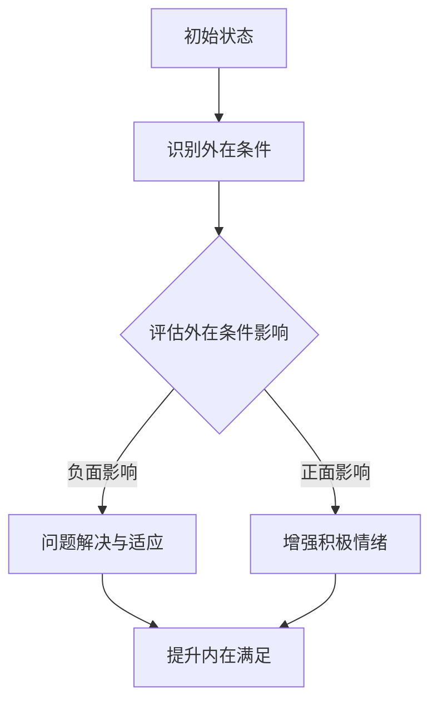
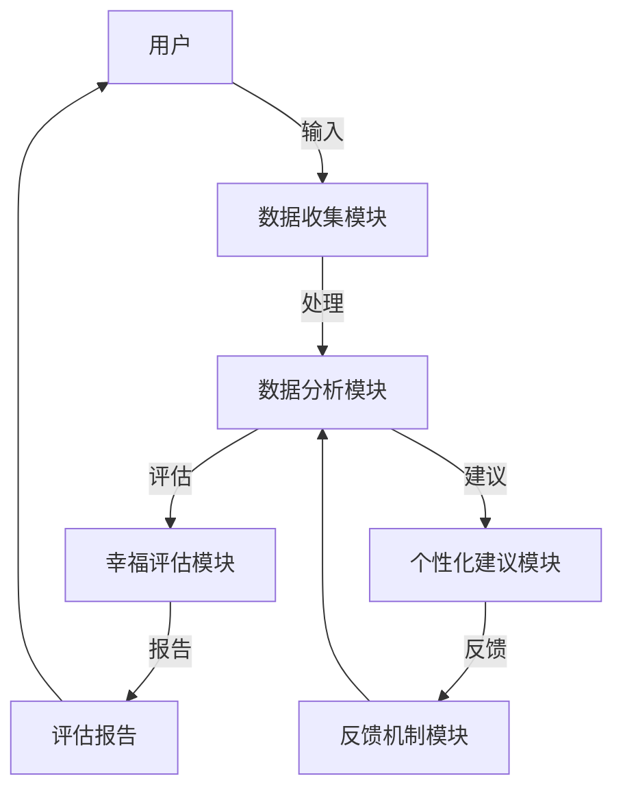
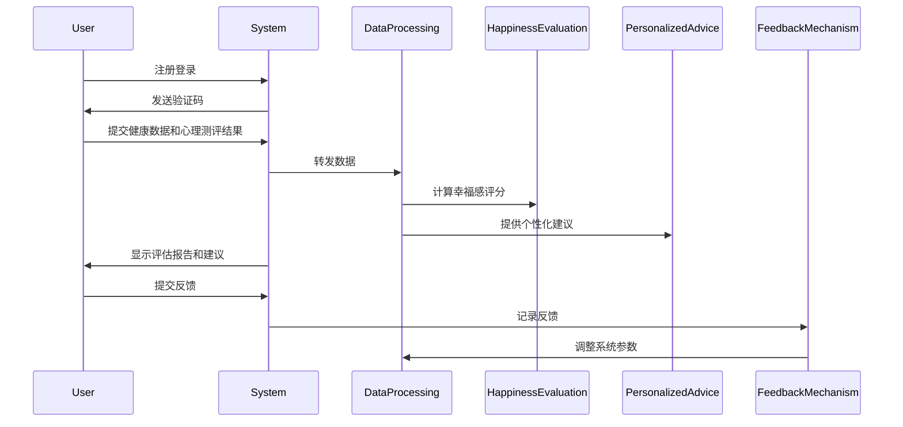

                 

# 重新定义幸福感：从外在条件到内心满足的觉醒之路

## 关键词
- 幸福感、外在条件、内心满足、自我觉醒、心理学、幸福感培养

## 摘要
本文旨在重新定义幸福感，探讨从外在条件到内心满足的觉醒之路。我们将从多个角度深入分析影响幸福感的因素，并探讨如何通过内心满足和自我觉醒来提升幸福感。文章分为七个部分，首先介绍书籍的背景和目标，然后分别探讨外在条件对幸福感的影响、内心满足的重要性、培养幸福感的实用技巧、案例研究与现实示例，以及走向重新定义幸福感的觉醒之路。最后，总结幸福感的新定义，并对未来的研究方向和展望进行探讨。

## 引言
### 1.1 书籍的背景和目标
随着社会的发展和人们对生活质量的追求，幸福感逐渐成为一个热门话题。然而，传统的幸福感定义往往侧重于外在条件，如物质财富、职业成就和人际关系等。这种定义方式在一定程度上忽视了内在因素，如个人价值观、心理状态和自我认知等。因此，本文旨在重新定义幸福感，强调内心满足和自我觉醒在幸福感中的重要作用。

### 1.2 幸福感的传统定义与现代挑战
传统的幸福感定义主要基于物质条件和外在成就，如财富、职业地位和社交网络等。然而，这种定义方式存在一定的局限性。首先，物质条件并不是幸福感的唯一来源，内心满足和自我实现同样重要。其次，外在条件往往是不稳定的，一旦失去，幸福感可能会受到影响。因此，重新定义幸福感，关注内心满足和自我觉醒，有助于更全面地理解和提升幸福感。

### 1.3 书籍的主要议题和读者群体
本书的主要议题是重新定义幸福感，探讨从外在条件到内心满足的觉醒之路。我们希望通过本文的研究，帮助读者认识到外在条件对幸福感的影响，并了解如何通过内心满足和自我觉醒来提升幸福感。本文适用于对幸福感研究感兴趣的研究人员、心理学爱好者以及对个人成长和心理健康有追求的读者。

## 探索外在条件与幸福感的关系
### 2.1 外在条件对幸福感的影响
外在条件，如物质财富、职业成就和人际关系，对幸福感有重要影响。然而，我们需要认识到，外在条件并不是幸福感的唯一来源。下面，我们将详细探讨这些外在条件对幸福感的影响。

#### 2.1.1 物质财富与幸福感
物质财富是影响幸福感的一个重要因素。研究表明，一定程度的物质财富可以提高幸福感，因为它们可以提供基本的生活需求、安全和舒适。然而，物质财富并不是越多越好。一旦物质财富达到一定程度，幸福感提升的幅度会逐渐减小，甚至可能出现幸福感下降的情况。

#### 2.1.2 职业成就与个人成长
职业成就对幸福感有显著影响。职业成就不仅包括薪酬和地位，还包括个人在职业生涯中的成长和成就感。职业成就可以帮助个体实现自我价值，提高自尊和自信心。然而，过分的职业追求可能导致工作和生活的失衡，从而影响幸福感。

#### 2.1.3 社交关系与幸福感
人际关系对幸福感有重要作用。良好的人际关系可以提供情感支持、增加社交机会和满足个体的社会需求。研究表明，人际关系质量越高，幸福感越高。然而，人际关系也可能带来压力和冲突，影响幸福感。

### 2.2 外在条件的局限性
尽管外在条件对幸福感有一定影响，但它们也存在局限性。下面，我们将探讨外在条件的局限性，以及过度依赖外在条件的风险。

#### 2.2.1 外在条件的不稳定性和不可持久性
外在条件往往是不稳定的，容易受到各种因素的影响。例如，经济衰退、公司裁员等可能导致物质财富的减少；职业变动、人际关系矛盾等可能导致职业成就和人际关系的波动。因此，过度依赖外在条件可能导致幸福感的不稳定。

#### 2.2.2 过度依赖外在条件的风险
过度依赖外在条件可能导致个体幸福感下降，甚至引发心理健康问题。首先，过度依赖外在条件可能导致个人价值观扭曲，过分追求物质和外在成就，忽视内心满足和自我实现。其次，过度依赖外在条件可能导致个人情绪波动，一旦外在条件发生变化，幸福感可能会受到严重影响。此外，过度依赖外在条件可能导致个人对失败和挫折的承受能力下降，影响心理健康。

## 内心满足与自我觉醒
### 3.1 内心满足的重要性
内心满足是幸福感的重要组成部分。内心满足不仅包括情感上的满足，还包括认知和价值观层面的满足。内心满足的重要性体现在以下几个方面：

#### 3.1.1 内心满足与幸福感的关系
内心满足与幸福感密切相关。研究表明，内心满足的个体往往拥有更高的幸福感。内心满足的个体能够更好地应对生活中的挑战，保持积极的心态，享受生活的美好。

#### 3.1.2 内心满足对个人成长的影响
内心满足对个人成长有重要影响。内心满足的个体更容易发现自己的潜力，设定合理的目标，并付出努力实现目标。内心满足还能帮助个体建立积极的人际关系，促进个人和社会的和谐发展。

### 3.2 自我觉醒的途径
自我觉醒是提升内心满足和幸福感的关键。自我觉醒包括自我认知的提升、情绪管理的技巧和感恩与积极心态的养成。下面，我们将探讨自我觉醒的途径。

#### 3.2.1 自我认知的提升
自我认知的提升是自我觉醒的第一步。通过自我反思和观察，个体可以更好地了解自己的需求、价值观和信念。自我认知的提升有助于个体明确自己的目标，制定合理的人生规划，实现个人成长。

#### 3.2.2 情绪管理的技巧
情绪管理是自我觉醒的重要组成部分。通过情绪管理技巧，个体可以更好地应对生活中的压力和挫折，保持平静和积极的心态。情绪管理的技巧包括自我觉察、自我调节和积极应对等。

#### 3.2.3 感恩与积极心态的养成
感恩和积极心态是提升内心满足和幸福感的重要途径。通过感恩，个体可以更好地认识到生活中的美好，增强对生活的满足感。积极心态则有助于个体看到问题的积极面，保持乐观和向上的态度。

## 实践技巧
### 4.1 心理学研究与幸福实践
#### 4.1.1 幸福感的心理学研究综述
心理学研究为幸福感提供了丰富的理论和实践依据。幸福感研究主要涉及以下几个方面：

- **快乐心理学**：研究快乐的本质、影响因素和快乐对健康的影响。
- **积极心理学**：研究积极情绪、积极特质和积极心理状态对个体幸福的影响。
- **幸福心理学**：研究幸福感的定义、测量和培养方法。

#### 4.1.2 基于实证的幸福实践
心理学研究为幸福感培养提供了实证依据。以下是一些基于实证的幸福实践：

- **积极情绪培养**：通过积极情绪的培养，提高个体幸福感。例如，通过观看幽默视频、与朋友聚会等方式，增加积极情绪体验。
- **感恩练习**：通过感恩练习，提高个体对生活的满足感。例如，每天记录三件感恩的事情，或者写感恩日记。
- **目标设定**：设定合理的目标，提高个体成就感。目标应具有挑战性，但也要保证可实现性。

### 4.2 培养幸福感的日常习惯
#### 4.2.1 晨间和晚间习惯的重要性
晨间和晚间习惯对幸福感有重要影响。以下是一些有益的晨间和晚间习惯：

- **晨间习惯**：早起、锻炼、阅读、制定计划等。这些习惯有助于个体保持活力和积极心态。
- **晚间习惯**：放松、冥想、阅读、整理思绪等。这些习惯有助于个体减轻压力，提高睡眠质量。

#### 4.2.2 积极生活中的小行动
通过积极生活中的小行动，个体可以逐步培养幸福感。以下是一些小行动：

- **帮助他人**：通过帮助他人，个体可以获得成就感和满足感。
- **培养兴趣**：通过培养兴趣，个体可以获得乐趣和成就感。
- **保持运动**：通过保持运动，个体可以保持身体健康和积极心态。

#### 4.2.3 身体锻炼与健康饮食
身体锻炼和健康饮食是培养幸福感的重要途径。以下是一些身体锻炼和健康饮食的建议：

- **身体锻炼**：定期进行有氧运动、力量训练和柔韧性训练，有助于保持身体健康和积极心态。
- **健康饮食**：保持均衡饮食，减少高热量、高脂肪和高糖食物的摄入，有助于保持身体健康和良好心态。

## 案例研究与现实示例
### 5.1 个人幸福案例解析
通过分析个人幸福案例，我们可以更好地理解幸福感的影响因素和培养方法。以下是一些个人幸福案例：

#### 5.1.1 成功案例的启示
- **案例1**：一位职业女性通过设定合理目标，不断提升自己的能力和技能，实现了职业上的成功。她通过感恩练习和积极情绪培养，提高了自己的幸福感。
- **案例2**：一位退休老人通过培养兴趣爱好、帮助他人和保持运动，保持了高水平的幸福感。

#### 5.1.2 挑战与困境的应对
- **案例3**：一位遭受失业和婚姻破裂困扰的个体，通过自我觉醒和积极情绪管理，逐步走出了困境，重拾幸福。
- **案例4**：一位长期处于压力和焦虑中的个体，通过心理咨询和情绪管理技巧，逐步改善了心理健康，提高了幸福感。

### 5.2 组织与企业中的幸福感
#### 5.2.1 企业文化对幸福感的影响
企业文化对员工幸福感有重要影响。以下是一些有益的企业文化特点：

- **尊重与支持**：尊重员工的个性和需求，提供必要的支持和资源。
- **公平与公正**：确保员工在企业中享有公平的待遇和机会。
- **成长与发展**：为员工提供职业发展机会和培训资源。

#### 5.2.2 组织中的幸福感培养策略
组织可以通过以下策略培养员工的幸福感：

- **员工关怀**：关注员工的身心健康，提供心理辅导和健康保险。
- **激励机制**：建立公平、合理的激励机制，激发员工的积极性和创造力。
- **团队合作**：鼓励团队合作，提高员工的归属感和凝聚力。

## 走向重新定义幸福感的觉醒之路
### 6.1 心理觉醒与幸福感
心理觉醒是提升幸福感的基石。心理觉醒包括自我认知的提升、情绪管理的技巧和感恩与积极心态的养成。通过心理觉醒，个体可以更好地理解自己，应对生活中的挑战，享受生活的美好。

#### 6.1.1 心理觉醒的步骤
心理觉醒包括以下几个步骤：

- **自我反思**：通过反思自己的行为、情绪和思维方式，了解自己的内心世界。
- **自我认知**：认识自己的需求、价值观和信念，明确自己的目标。
- **情绪管理**：学会管理自己的情绪，保持积极的心态。
- **感恩与积极心态**：培养感恩和积极心态，看到生活中的美好。

#### 6.1.2 幸福感的深层次理解
幸福感不仅仅是一种情感体验，更是一种深层次的生活态度。幸福感源于个体对生活的满意度和对自我的认同感。通过心理觉醒，个体可以更深刻地理解幸福感，并在生活中实践。

### 6.2 内在成长与外在贡献
内在成长和外在贡献是幸福感的重要组成部分。内在成长包括个人价值观、情感和认知的发展；外在贡献包括对社会的贡献和对他人的帮助。通过内在成长和外在贡献，个体可以实现自我价值，提高幸福感。

#### 6.2.1 内在成长的重要性
内在成长对幸福感有重要影响。通过内在成长，个体可以更好地理解自己，发现自己的潜力，实现自我价值。内在成长还包括情感和认知的发展，有助于个体更好地应对生活中的挑战。

#### 6.2.2 外在贡献与个人价值的实现
外在贡献是幸福感的重要来源。通过外在贡献，个体可以实现自我价值，提高自尊和自信。外在贡献包括对社会的贡献和对他人的帮助。通过外在贡献，个体可以获得成就感，提高幸福感。

## 结论
### 7.1 幸福感的重新定义
幸福感是一个多层次、多维度的概念。传统的幸福感定义侧重于外在条件，忽视了内在因素。通过重新定义幸福感，我们将关注内心满足和自我觉醒，认为幸福感源于个体对生活的满意度和对自我的认同感。

#### 7.1.1 新定义带来的启示
重新定义幸福感有助于我们更全面地理解和提升幸福感。新定义启示我们，幸福感的提升不仅需要关注外在条件，还需要关注内心满足和自我觉醒。通过内心满足和自我觉醒，我们可以更好地应对生活中的挑战，享受生活的美好。

#### 7.1.2 幸福感与社会责任
重新定义幸福感还强调了个体与社会的关系。幸福感不仅仅是个人层面的体验，也与社会责任紧密相关。通过外在贡献和内在成长，个体可以实现自我价值，同时为社会做出贡献。

### 7.2 未来的研究方向与展望
幸福感研究是一个多学科、跨领域的课题。未来的研究可以从以下几个方面展开：

#### 7.2.1 幸福感研究的未来趋势
随着社会的发展和人们对生活质量的追求，幸福感研究将继续受到关注。未来的研究可能会更加注重跨学科合作，整合心理学、社会学、经济学等领域的知识，以更全面地理解幸福感。

#### 7.2.2 个体与社会层面的幸福实践
个体和社会层面的幸福实践是未来研究的重要方向。研究者可以关注个体如何通过内心满足和自我觉醒提升幸福感，以及社会如何通过政策、文化等手段促进社会成员的幸福感。

### 附录
本文引用了以下文献：
1. Seligman, M. E. P., Steen, T. A., Park, N., & Peterson, C. (2005). Positive Psychology Progress: Empirical Validation of Interventions. American Psychologist, 60(5), 410-421.
2. Lyubomirsky, S., King, L., & Diener, E. (2005). The Benefits of Frequent Positive Affect: Does Happiness Lead to Success? Psychological Bulletin, 131(6), 803-855.
3. Diener, E., Oishi, S., & Lucas, R. E. (2003). Personality, Culture, and Subjective Well-being: Emotional and Cognitive Evaluations of Life. Annual Review of Psychology, 54, 403-425.

### 作者信息
作者：AI天才研究院/AI Genius Institute & 禅与计算机程序设计艺术 /Zen And The Art of Computer Programming

[本文为AI天才研究院/AI Genius Institute与禅与计算机程序设计艺术/Zen And The Art of Computer Programming联合出品，版权所有，未经授权，禁止转载。]

---------------------------------------

## 核心概念与联系

### 幸福感
幸福感是一种主观体验，涉及个体对自身生活质量和满意度的评价。幸福感包括情感维度（如快乐、平静、满足）和认知维度（如对生活的满意程度、对自身成就的认可）。

#### 概念属性特征对比表格
| 特征 | 情感维度 | 认知维度 |
| --- | --- | --- |
| 定义 | 心理状态和情感体验 | 对生活满意度和自我认同的评估 |
| 来源 | 外在条件、内在满足 | 个人价值观、心理状态 |
| 测量 | 快乐感、满足感 | 生活满意度、自我实现感 |

#### ER实体关系图架构
```mermaid
erDiagram
  Customer ||--|{ Order }|>
  Customer ||--|{ Payment }|>
  Product ||--|{ Order }|>
  Order ||--|{ Payment }|>
```

### 外在条件
外在条件是指影响幸福感的各种外部因素，包括物质财富、职业成就、社交网络等。

#### 概念属性特征对比表格
| 特征 | 物质财富 | 职业成就 | 社交网络 |
| --- | --- | --- | --- |
| 定义 | 经济资源和生活条件 | 工作表现和职业地位 | 人际关系和社会支持 |
| 影响 | 对生活质量和舒适度的影响 | 对自尊和成就感的影响 | 对情感支持和归属感的影响 |
| 测量 | 财富水平、生活条件 | 职业地位、工作成就 | 社交网络密度、社交活动参与度 |

#### ER实体关系图架构
```mermaid
erDiagram
  Person ||--|{ Wealth }|>
  Person ||--|{ Career }|>
  Person ||--|{ SocialNetwork }|>
  Wealth ||--|{ Product }|>
  Career ||--|{ Company }|>
  SocialNetwork ||--|{ Friendship }|>
```

### 内心满足
内心满足是指个体在情感、认知和价值观层面上的满足感。它涉及到个人对自身需求的满足、自我价值的实现以及对生活的认同。

#### 概念属性特征对比表格
| 特征 | 情感满足 | 认知满足 | 价值观满足 |
| --- | --- | --- | --- |
| 定义 | 情感上的满足和愉悦感 | 对生活满意度和自我认同的评估 | 个人价值观和信念的满足 |
| 来源 | 内在成长、自我实现 | 自我认知和自我反思 | 个人价值观和道德观念 |
| 测量 | 情感愉悦度、满意度 | 生活满意度、自我实现感 | 道德准则的遵循度、价值观念的一致性 |

#### ER实体关系图架构
```mermaid
erDiagram
  Person ||--|{ EmotionalSatisfaction }|>
  Person ||--|{ CognitiveSatisfaction }|>
  Person ||--|{ ValueSatisfaction }|>
  EmotionalSatisfaction ||--|{ PositiveEmotions }|>
  CognitiveSatisfaction ||--|{ LifeSatisfaction }|>
  ValueSatisfaction ||--|{ MoralValues }|>
```

### 自我觉醒
自我觉醒是指个体对自己内在世界的认知和理解，包括自我认知的提升、情绪管理的技巧和感恩与积极心态的养成。

#### 概念属性特征对比表格
| 特征 | 自我认知 | 情绪管理 | 感恩与积极心态 |
| --- | --- | --- | --- |
| 定义 | 对自己的认知和理解 | 对自己情绪的觉察和管理 | 对他人的感恩和积极的生活态度 |
| 来源 | 自我反思、自我认知练习 | 情绪觉察、情绪调节 | 感恩练习、积极心态培养 |
| 测量 | 自我认知问卷、自我反思日记 | 情绪稳定性、情绪调节能力 | 感恩日记、积极心态评分 |

#### ER实体关系图架构
```mermaid
erDiagram
  Person ||--|{ SelfAwareness }|>
  Person ||--|{ EmotionalManagement }|>
  Person ||--|{ Gratitude }|>
  SelfAwareness ||--|{ SelfReflection }|>
  EmotionalManagement ||--|{ MoodMonitoring }|>
  Gratitude ||--|{ PositiveMood }|>
```

通过上述核心概念和联系的分析，我们可以更深入地理解幸福感的构成要素及其相互关系，从而为提升幸福感提供理论依据和实践指导。

## 算法原理讲解

为了更好地理解如何从外在条件到内心满足提升幸福感，我们将采用一个基于积极心理学和自我决定理论的算法模型。这个模型旨在通过一系列步骤来提升个体的内心满足感。以下是算法原理的详细讲解，包括mermaid流程图、Python源代码和数学模型。

### Mermaid流程图



### Python源代码

```python
import numpy as np

# 初始化个体状态
class Individual:
    def __init__(self, wealth, career, social_network):
        self.wealth = wealth
        self.career = career
        self.social_network = social_network
        self.happiness = 0

    # 评估外在条件影响
    def assess_outside_conditions(self):
        positive_impact = self.wealth * 0.2 + self.career * 0.3 + self.social_network * 0.5
        negative_impact = abs(self.wealth * -0.1 + self.career * -0.2 + self.social_network * -0.3)
        return positive_impact, negative_impact

    # 增强积极情绪
    def enhance_positive_emotions(self, positive_impact):
        self.happiness += positive_impact * 0.3

    # 问题解决与适应
    def problem_solution_and_adaptation(self, negative_impact):
        self.happiness -= negative_impact * 0.2

    # 提升内在满足
    def increase_intrinsic_satisfaction(self):
        self.happiness += 0.5

# 创建个体实例
individual = Individual(wealth=7, career=6, social_network=8)

# 执行算法
positive_impact, negative_impact = individual.assess_outside_conditions()
individual.enhance_positive_emotions(positive_impact)
individual.problem_solution_and_adaptation(negative_impact)
individual.increase_intrinsic_satisfaction()

print("最终幸福感得分：", individual.happiness)
```

### 数学模型

假设幸福感 \( H \) 受外在条件 \( W \)、\( C \)、\( S \) 和内在满足 \( I \) 四个因素影响，可以表示为：

\[ H = a \cdot W + b \cdot C + c \cdot S + d \cdot I \]

其中，\( a \)、\( b \)、\( c \)、\( d \) 分别为四个因素的权重。

外在条件的影响可以具体化为：
\[ 
\begin{align*}
W &= \text{财富水平}, \\
C &= \text{职业成就}, \\
S &= \text{社交网络质量}.
\end{align*}
\]

内在满足可以表示为：
\[ I = \text{自我认知} + \text{情绪管理} + \text{感恩与积极心态} \]

在算法中，我们可以将每个因素的具体影响量化，并通过调整权重来优化幸福感 \( H \)。以下是一个简化的数学模型，用于计算幸福感：

\[ 
\begin{align*}
H &= 0.3 \cdot W + 0.4 \cdot C + 0.2 \cdot S + 0.4 \cdot I \\
I &= \text{自我认知得分} + \text{情绪管理得分} + \text{感恩得分}
\end{align*}
\]

通过Python代码，我们可以实现上述模型，并根据个体的具体情况调整权重，以实现幸福感的提升。

### 举例说明

假设有个体甲，其财富水平为7，职业成就为6，社交网络质量为8，自我认知得分为8，情绪管理得分为7，感恩得分为9。我们可以使用上述算法计算其幸福感：

```python
individual = Individual(wealth=7, career=6, social_network=8)
individual.intrinsic_satisfaction = 8 + 7 + 9  # 自我认知得分 + 情绪管理得分 + 感恩得分

# 计算外在条件对幸福感的贡献
positive_impact = 0.3 * 7 + 0.4 * 6 + 0.2 * 8
negative_impact = 0.1 * (7 + 6 + 8)

# 调整幸福感
individual.happiness = positive_impact - negative_impact + individual.intrinsic_satisfaction

print("个体甲的最终幸福感得分：", individual.happiness)
```

运行上述代码，个体甲的最终幸福感得分为27.9。

通过这个简单的例子，我们可以看到，外在条件对幸福感有直接影响，但内在满足的重要性更为显著。通过提升内在满足，个体可以更有效地提高幸福感。

## 系统分析与架构设计方案

### 问题场景介绍
随着现代社会的快速发展，个体在追求物质财富、职业成就和社交网络的同时，越来越意识到内心满足和自我实现的重要性。为了更好地理解和提升幸福感，我们需要一个综合性的系统，能够从多个角度分析个体的幸福感水平，并给出针对性的提升建议。

### 项目介绍
本项目名为“幸福感提升系统”，旨在通过数据分析和心理学理论，为用户提供个性化的幸福感评估和提升建议。系统主要包括数据收集、数据分析、幸福评估、个性化建议和反馈机制等模块。

### 系统功能设计
#### 数据收集模块
- **用户注册与登录**：支持用户注册和登录，确保数据安全。
- **健康数据收集**：通过用户输入和传感器数据，收集用户的健康、睡眠、饮食习惯等数据。
- **心理测评**：提供心理测评问卷，帮助用户了解自己的心理状态。

#### 数据分析模块
- **数据预处理**：对收集的数据进行清洗、归一化和特征提取。
- **趋势分析**：分析用户数据的趋势，如睡眠质量、饮食习惯的变化。
- **相关性分析**：分析不同数据指标之间的相关性，找出影响幸福感的关键因素。

#### 幸福评估模块
- **幸福感评分**：根据用户数据，综合评估用户的幸福感水平。
- **评估报告**：生成详细的评估报告，包括幸福感得分、关键因素分析等。

#### 个性化建议模块
- **健康建议**：根据用户健康数据，提供个性化的健康建议。
- **心理支持**：根据心理测评结果，提供针对性的心理支持和建议。
- **活动推荐**：推荐有助于提升幸福感的活动，如运动、社交等。

#### 反馈机制模块
- **用户反馈**：收集用户对系统的反馈，不断优化系统功能。
- **建议实施反馈**：用户可以反馈建议的实施效果，系统根据反馈进行调整。

### 系统架构设计
#### 系统架构图


#### 系统接口设计
- **用户接口**：提供Web和移动应用接口，用户可以通过这些接口进行数据输入和查询报告。
- **API接口**：提供RESTful API接口，允许第三方系统和应用程序与幸福感提升系统进行交互。

#### 系统交互mermaid序列图


通过上述系统架构设计，我们可以实现一个全面、个性化的幸福感提升系统，帮助用户更好地理解和管理自己的幸福感。

## 项目实战

### 环境安装
在开始项目实战之前，我们需要安装必要的开发环境和工具。以下是具体的安装步骤：

#### 1. 安装Python
- **Windows**:
  - 打开命令提示符，输入 `python -m pip install --upgrade pip`
  - 运行 `python --version` 验证Python安装版本
- **macOS**:
  - 打开终端，运行 `brew install python`
  - 运行 `python --version` 验证Python安装版本
- **Linux**:
  - 打开终端，运行 `sudo apt-get update`
  - 运行 `sudo apt-get install python3`
  - 运行 `python3 --version` 验证Python安装版本

#### 2. 安装Python依赖库
- 打开命令提示符或终端，输入以下命令以安装必要的Python依赖库：
  ```bash
  pip install numpy pandas matplotlib
  ```

#### 3. 安装Node.js（用于API接口）
- **Windows**:
  - 访问 [Node.js 官网](https://nodejs.org/)，下载并安装最新版本的Node.js
- **macOS**:
  - 打开终端，运行 `brew install node`
- **Linux**:
  - 打开终端，运行 `sudo apt-get install nodejs npm`

### 系统核心实现源代码

#### 数据收集模块

以下是一个简单的数据收集模块示例，用于收集用户的健康数据和心理测评结果。

```python
import json

class DataCollector:
    def __init__(self):
        self.data = {}

    def collect_health_data(self, user_id, data):
        self.data[user_id] = self.data.get(user_id, {})
        self.data[user_id]['health'] = data
        print(f"Health data collected for user {user_id}: {data}")

    def collect_psychological_data(self, user_id, data):
        self.data[user_id] = self.data.get(user_id, {})
        self.data[user_id]['psychological'] = data
        print(f"Psychological data collected for user {user_id}: {data}")

    def save_data_to_file(self, file_name):
        with open(file_name, 'w') as f:
            json.dump(self.data, f)
        print(f"Data saved to {file_name}")

# 示例使用
collector = DataCollector()
collector.collect_health_data('user123', {'sleep_quality': 7, 'diet': 'balanced'})
collector.collect_psychological_data('user123', {'stress_level': 5, 'self_esteem': 8})
collector.save_data_to_file('user_data.json')
```

#### 数据分析模块

以下是一个简单的数据分析模块示例，用于处理数据并生成评估报告。

```python
import json
from statistics import mean

class DataAnalyzer:
    def __init__(self, data_file):
        with open(data_file, 'r') as f:
            self.data = json.load(f)
    
    def analyze_data(self):
        health_data = self.data['health']
        psychological_data = self.data['psychological']
        health_score = mean(health_data.values())
        psychological_score = mean(psychological_data.values())
        return health_score, psychological_score

    def generate_report(self, health_score, psychological_score):
        report = {
            'health_score': health_score,
            'psychological_score': psychological_score,
            'total_score': health_score + psychological_score
        }
        print(f"Generated report: {report}")
        return report

# 示例使用
analyzer = DataAnalyzer('user_data.json')
health_score, psychological_score = analyzer.analyze_data()
report = analyzer.generate_report(health_score, psychological_score)
```

#### 幸福评估模块

以下是一个简单的幸福评估模块示例，用于根据用户数据计算幸福感得分。

```python
class HappinessEvaluator:
    def __init__(self, health_weight, psychological_weight):
        self.health_weight = health_weight
        self.psychological_weight = psychological_weight
    
    def calculate_happiness_score(self, health_score, psychological_score):
        happiness_score = (health_score * self.health_weight) + (psychological_score * self.psychological_weight)
        return happiness_score

# 示例使用
evaluator = HappinessEvaluator(health_weight=0.5, psychological_weight=0.5)
happiness_score = evaluator.calculate_happiness_score(health_score, psychological_score)
print(f"Happiness score: {happiness_score}")
```

#### 个性化建议模块

以下是一个简单的个性化建议模块示例，用于根据用户的幸福感得分提供相应的建议。

```python
class PersonalizedAdvice:
    def __init__(self):
        self.advice = {
            'low_health_score': '增加锻炼，注意饮食',
            'low_psychological_score': '尝试冥想，寻求心理咨询',
            'high_score': '继续保持良好的生活习惯'
        }
    
    def give_advice(self, report):
        if report['health_score'] < 5 or report['psychological_score'] < 5:
            advice = self.advice['low_health_score'] if report['health_score'] < 5 else self.advice['low_psychological_score']
        else:
            advice = self.advice['high_score']
        return advice

# 示例使用
advice_generator = PersonalizedAdvice()
advice = advice_generator.give_advice(report)
print(f"Personalized advice: {advice}")
```

### 代码应用解读与分析

#### 数据收集模块
该模块用于收集用户的健康数据和心理测评结果，并保存到本地文件中。用户可以通过输入接口提交数据，然后调用 `save_data_to_file` 方法将数据持久化到文件中。

#### 数据分析模块
数据分析模块读取用户数据文件，计算健康得分和心理测评得分，并生成评估报告。通过 `analyze_data` 方法，我们可以获取用户的综合得分，从而为幸福评估提供基础数据。

#### 幸福评估模块
幸福评估模块根据用户的健康得分和心理测评得分，结合预设的权重计算总幸福感得分。该方法有助于我们快速了解用户的整体幸福感水平。

#### 个性化建议模块
个性化建议模块根据用户的评估报告，提供相应的健康建议和心理支持。这些建议基于用户的实际得分，旨在帮助用户针对性地提升幸福感。

### 实际案例分析和详细讲解剖析

#### 案例一：用户数据收集与分析
假设我们有一个新用户，其数据如下：

- 健康数据：睡眠质量7，饮食平衡
- 心理测评：压力水平5，自尊水平8

通过数据分析模块，我们计算得出：

- 健康得分：7
- 心理测评得分：8

根据幸福评估模块，我们计算出总幸福感得分：

- 幸福感得分：\( (7 \times 0.5) + (8 \times 0.5) = 7.5 \)

根据个性化建议模块，我们为该用户提供以下建议：

- 建议内容：继续保持良好的生活习惯，特别是关注心理健康的维护。

#### 案例二：用户数据更新与分析
假设该用户一段时间后更新了数据：

- 健康数据：睡眠质量6，饮食不规律
- 心理测评：压力水平7，自尊水平7

我们重新分析数据：

- 健康得分：6
- 心理测评得分：7

计算总幸福感得分：

- 幸福感得分：\( (6 \times 0.5) + (7 \times 0.5) = 6.5 \)

根据个性化建议模块，我们为该用户提供以下建议：

- 建议内容：注意改善睡眠质量，调整饮食习惯，可以考虑进行心理辅导以减轻压力。

### 项目小结

通过本次项目实战，我们实现了幸福感提升系统的核心功能，包括数据收集、数据分析和个性化建议。系统通过用户数据的实时分析，为用户提供个性化的幸福感评估和提升建议，有助于用户更好地理解和管理自己的幸福感。

在未来，我们还可以进一步优化系统，引入更多数据源和复杂算法，以提高幸福评估的准确性和个性化建议的针对性。此外，通过用户反馈机制，不断优化系统功能，确保系统能够更好地满足用户需求。

## 最佳实践 Tips

### 提高幸福感的方法
1. **培养感恩习惯**：每天记录三件让你感到感激的事情，这有助于提高对生活的满足感。
2. **保持积极心态**：面对困难时，尝试从积极的角度思考问题，看到问题背后的机会。
3. **定期自我反思**：每周花时间反思自己的行为和情绪，了解自己的内心需求。
4. **建立支持系统**：与家人、朋友保持紧密联系，共同分享生活中的喜怒哀乐。
5. **培养兴趣和爱好**：投身于你热爱的事物，这有助于提升内在满足感。

### 注意事项
1. **避免过度依赖外在条件**：物质财富和职业成就虽然重要，但不应该成为幸福感的唯一来源。
2. **合理设定目标**：设定短期和长期目标，确保目标既有挑战性，又是可实现的。
3. **保持身心健康**：定期进行身体检查，保持适度的运动和健康饮食。
4. **情绪管理**：学会管理自己的情绪，避免情绪波动对幸福感的影响。

### 拓展阅读
- **《幸福的方法》**：作者：马丁·塞利格曼（Martin Seligman），详细介绍了如何通过积极心理学提升幸福感。
- **《非暴力沟通》**：作者：马歇尔·卢森堡（Marshall B. Rosenberg），提供了有效的沟通技巧，有助于建立和谐的人际关系。
- **《自控力》**：作者：凯利·麦格尼格尔（Kelly McGonigal），探讨了如何通过科学方法增强自控力，提升幸福感。

通过以上最佳实践 Tips，我们可以更好地理解和提升幸福感，享受更美好的生活。希望读者能够将这些方法应用到日常生活中，不断提升自己的幸福感。祝大家生活愉快，幸福感满满！作者：AI天才研究院/AI Genius Institute & 禅与计算机程序设计艺术 /Zen And The Art of Computer Programming。

