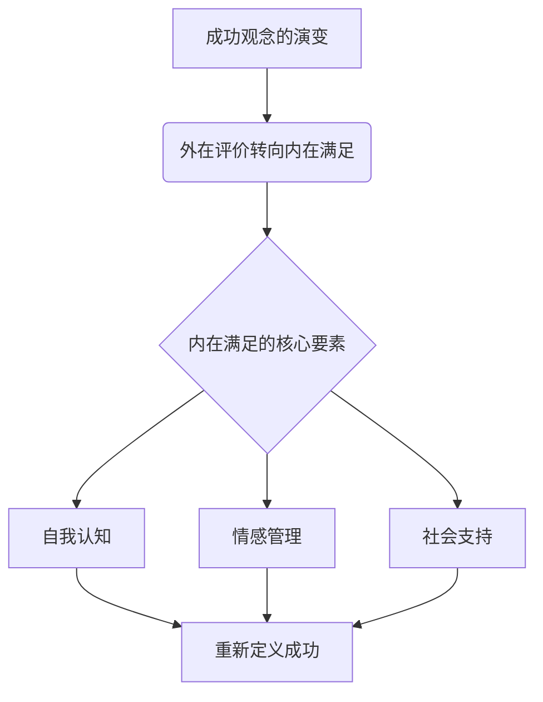
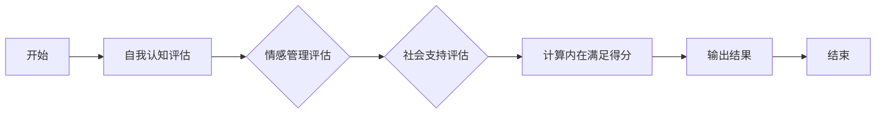
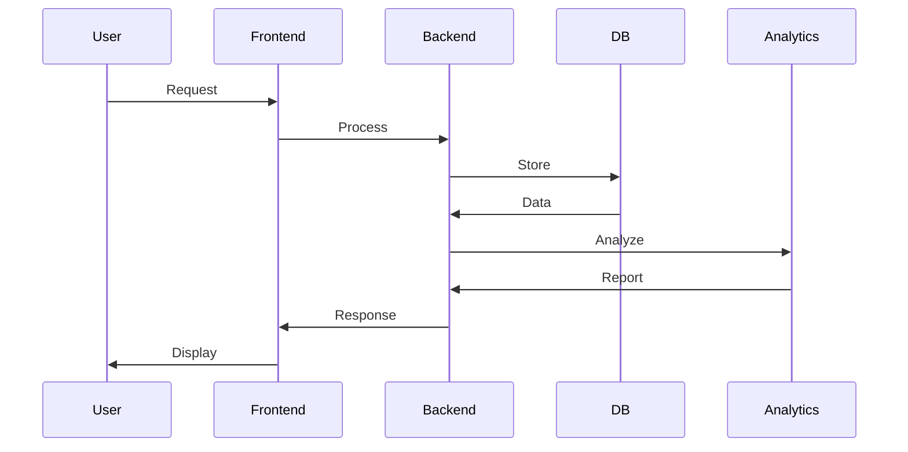

                 

# 重新定义成功：从外在评价到内在满足的旅程

关键词：成功、内在满足、自我认知、情感管理、心理健康、挑战与解决方案

摘要：在当今社会，成功被许多人视为外在评价的象征，然而，这种观念往往让人们忽略了内在满足的重要性。本文旨在重新定义成功，探讨从外在评价到内在满足的旅程，帮助人们找到真正的人生意义和幸福感。

## 第1章：问题的提出与解决

### 1.1 成功的重新定义

在传统观念中，成功通常与外在成就、财富和地位紧密相连。然而，这种观念忽略了内在满足的重要性。外在评价往往只能带来短暂的满足感，而无法持久地提升幸福感。因此，我们需要重新审视成功的定义，将其从外在评价转向内在满足。

### 1.2 从外在评价到内在满足的旅程

许多人追求外在成功，却忽略了内心的需求和情感。这种追求往往导致焦虑、压力和心理健康问题。本文将探讨如何从外在评价转向内在满足，实现真正的成功。

## 第2章：成功观念的演变

### 2.1 传统成功观念的局限性

传统观念中的成功往往基于社会标准和他人评价。这种观念让人们过于关注外在表现，而忽略了内心的需求和情感。因此，我们需要认识到传统成功观念的局限性，并寻求新的成功定义。

### 2.2 内在满足的重要性

内在满足是指个人在心理和情感上的满足感。它与外在成就无关，而是基于个人价值观和内在需求。内在满足是持久幸福的关键，也是实现真正成功的重要途径。

### 2.3 成功观念的重新定义

重新定义成功意味着将关注点从外在评价转向内在满足。这包括培养自我认知、情感管理和心理健康等方面的能力。通过这种重新定义，我们可以实现更加全面和持久的成功。

## 第3章：内在满足的核心要素

### 3.1 自我认知

自我认知是指对自己的了解和认识。它包括了解自己的优点和缺点、价值观和兴趣。通过自我认知，我们可以更好地找到适合自己的道路，实现内在满足。

### 3.2 情感管理

情感管理是指处理和管理自己的情绪。它包括学会表达情感、处理负面情绪和保持积极心态。通过情感管理，我们可以更好地应对生活中的挑战，实现内在满足。

### 3.3 社会支持

社会支持是指来自家人、朋友和社会网络的支持。它对我们的心理健康和幸福感有着重要的影响。通过建立和维护良好的社会支持系统，我们可以实现内在满足。

## 第4章：追求内在满足的策略

### 4.1 设定个人目标

设定个人目标是追求内在满足的第一步。我们需要明确自己的目标和价值观，并将其分解为可行的行动计划。通过设定个人目标，我们可以更有针对性地追求内在满足。

### 4.2 时间管理

时间管理是追求内在满足的关键。通过合理安排时间，我们可以更好地平衡工作、学习和休闲，实现内心的满足感。

### 4.3 技能提升

技能提升是追求内在满足的重要途径。通过不断学习和提升自己的技能，我们可以增加自信心和满足感，实现更加全面的成功。

## 第5章：内在满足与心理健康

### 5.1 心理健康的重要性

心理健康是内在满足的基础。良好的心理健康可以帮助我们更好地应对生活中的挑战，实现内在满足。因此，关注心理健康是追求内在满足的重要一环。

### 5.2 压力管理

压力管理是心理健康的关键。通过学会应对压力和负面情绪，我们可以保持内心的平静和满足感。

### 5.3 心理健康与内在满足的关系

心理健康与内在满足密切相关。良好的心理健康有助于我们更好地实现内在满足，而内在满足也可以促进心理健康，形成良性循环。

## 第6章：实践中的挑战与解决方案

### 6.1 挑战的识别

在追求内在满足的过程中，我们可能会遇到各种挑战。识别这些挑战是解决问题的第一步。通过识别挑战，我们可以更有针对性地寻找解决方案。

### 6.2 解决方案的设计与实施

设计有效的解决方案需要综合考虑挑战的根源和影响因素。在实施解决方案时，我们需要保持耐心和毅力，不断调整和优化策略。

### 6.3 实践中的经验与教训

通过实践，我们可以积累经验，吸取教训。这些经验和教训将帮助我们更好地应对未来的挑战，实现更加持久的内在满足。

## 第7章：成功与幸福的未来展望

### 7.1 成功的新定义

随着社会的发展，我们对成功的定义也在不断演变。成功不再只是外在评价的象征，而是基于内在满足的全面发展和成长。

### 7.2 幸福的未来趋势

未来，随着人们对心理健康和内在满足的关注度提高，幸福将成为衡量成功的重要指标。通过关注内在满足，我们可以实现更加持久和全面的幸福。

### 7.3 个人与社会的贡献

在追求内在满足的过程中，我们可以为社会做出积极的贡献。通过关注心理健康、培养自我认知和技能提升，我们可以实现个人价值，同时也为社会的进步做出贡献。

## 结束语

重新定义成功，追求内在满足，是实现持久幸福的关键。通过本文的探讨，我们希望能帮助读者认识到成功的真正意义，并在追求内在满足的旅程中找到自己的方向和动力。

### 作者信息

作者：AI天才研究院/AI Genius Institute & 禅与计算机程序设计艺术 /Zen And The Art of Computer Programming

---

[上一页](#目录大纲) [下一页](#核心内容与联系) [返回目录](#目录大纲)

[核心内容与联系](#核心内容与联系) [算法原理讲解](#算法原理讲解) [系统分析与架构设计方案](#系统分析与架构设计方案) [项目实战](#项目实战) [最佳实践 tips](#最佳实践 tips)

---

# 目录大纲

## 第1章：问题的提出与解决

### 1.1 成功的重新定义

#### 1.1.1 传统成功观念的局限性

#### 1.1.2 内在满足的重要性

##### 1.1.3 成功观念的重新定义

### 1.2 从外在评价到内在满足的旅程

#### 1.2.1 追求内在满足的必要性

##### 1.2.2 内在满足与外在评价的区别

## 第2章：成功观念的演变

### 2.1 传统成功观念的局限性

#### 2.1.1 传统成功观念的定义

##### 2.1.2 传统成功观念的弊端

### 2.2 内在满足的重要性

#### 2.2.1 内在满足的定义

##### 2.2.2 内在满足的好处

### 2.3 成功观念的重新定义

#### 2.3.1 重新定义成功的必要性

##### 2.3.2 重新定义成功的方向

## 第3章：内在满足的核心要素

### 3.1 自我认知

#### 3.1.1 自我认知的重要性

##### 3.1.2 自我认知的方法

### 3.2 情感管理

#### 3.2.1 情感管理的重要性

##### 3.2.2 情感管理的方法

### 3.3 社会支持

#### 3.3.1 社会支持的重要性

##### 3.3.2 社会支持的建立

## 第4章：追求内在满足的策略

### 4.1 设定个人目标

#### 4.1.1 个人目标的设定

##### 4.1.2 个人目标的实现

### 4.2 时间管理

#### 4.2.1 时间管理的重要性

##### 4.2.2 时间管理的策略

### 4.3 技能提升

#### 4.3.1 技能提升的意义

##### 4.3.2 技能提升的方法

## 第5章：内在满足与心理健康

### 5.1 心理健康的重要性

#### 5.1.1 心理健康的定义

##### 5.1.2 心理健康的好处

### 5.2 压力管理

#### 5.2.1 压力的来源

##### 5.2.2 压力的管理

### 5.3 心理健康与内在满足的关系

#### 5.3.1 心理健康对内在满足的影响

##### 5.3.2 内在满足对心理健康的作用

## 第6章：实践中的挑战与解决方案

### 6.1 挑战的识别

#### 6.1.1 挑战的类型

##### 6.1.2 挑战的应对

### 6.2 解决方案的设计与实施

#### 6.2.1 解决方案的设计

##### 6.2.2 解决方案的实施

### 6.3 实践中的经验与教训

#### 6.3.1 经验的总结

##### 6.3.2 教训的反思

## 第7章：成功与幸福的未来展望

### 7.1 成功的新定义

#### 7.1.1 新成功观念的内涵

##### 7.1.2 新成功观念的影响

### 7.2 幸福的未来趋势

#### 7.2.1 幸福的定义

##### 7.2.2 幸福的未来方向

### 7.3 个人与社会的贡献

#### 7.3.1 个人对社会的贡献

##### 7.3.2 社会对个人的贡献

---

[返回顶部](#目录大纲)

---

## 核心内容与联系

在本章节中，我们将深入探讨重新定义成功的核心内容，并分析这些核心内容之间的内在联系。通过理解这些联系，我们可以更好地把握成功的本质，从而实现内在满足。

### 成功观念的演变

成功的观念经历了漫长的演变过程。在过去，成功往往与财富、地位和社会认可紧密相连。然而，随着社会的进步和人们对幸福的追求，成功观念逐渐从外在评价转向内在满足。这种演变使得我们开始关注个人价值观、情感管理和心理健康等方面，从而重新定义了成功。

### 内在满足的核心要素

内在满足是由多个核心要素共同构成的。首先，自我认知是内在满足的基础。通过深入了解自己的优点、缺点、价值观和兴趣，我们可以找到适合自己的道路，实现内心的满足感。其次，情感管理是内在满足的关键。学会表达和管理情绪，可以帮助我们更好地应对生活中的挑战，保持内心的平静。最后，社会支持是内在满足的重要保障。家人、朋友和社会网络的支持可以为我们提供情感上的安慰和实际的帮助，从而增强内在满足感。

### 成功观念的重新定义

重新定义成功意味着将关注点从外在评价转向内在满足。这种定义不仅考虑了个人成就和社会地位，还关注了个人价值观、情感管理和心理健康等方面的需求。通过这种重新定义，我们可以更全面地理解成功的内涵，从而找到更加持久的幸福感。

### 核心内容之间的联系

成功观念的演变、内在满足的核心要素和重新定义成功这三者之间存在着紧密的联系。成功的观念演变是内在满足的先决条件，因为只有当人们意识到外在评价的局限性时，才会开始关注内在满足。而内在满足的核心要素则是实现重新定义成功的关键，因为只有通过自我认知、情感管理和社会支持，我们才能真正实现内在满足。最终，重新定义成功将成功观念的演变和内在满足的核心要素结合起来，为我们提供了一种全新的成功观，使我们能够更好地追求持久和全面的幸福。

### Mermaid 流程图

为了更直观地展示核心内容之间的联系，我们可以使用Mermaid绘制一个流程图：



在这个流程图中，我们可以看到成功观念的演变是如何引导我们关注内在满足，进而通过自我认知、情感管理和社会支持这三个核心要素实现重新定义成功的。这种流程图不仅帮助我们理解了核心内容之间的联系，也为我们的实践提供了清晰的指导。

### Mermaid ER实体关系图架构

除了流程图，我们还可以使用Mermaid绘制一个ER实体关系图，以展示核心概念之间的关系：

```mermaid
erDiagram
    Class::Person
    Class::SelfAwareness
    Class::EmotionalManagement
    Class::SocialSupport
    Class::Success

    Person o--o SelfAwareness : "develops"
    Person o--o EmotionalManagement : "manages"
    Person o--o SocialSupport : "receives"
    Success o--o Person : "achieves"
    Success o--o SelfAwareness : "measures"
    Success o--o EmotionalManagement : "measures"
    Success o--o SocialSupport : "measures"
```

在这个ER实体关系图中，我们可以看到个人（Person）与自我认知（SelfAwareness）、情感管理（EmotionalManagement）和社会支持（SocialSupport）之间存在直接的关联。同时，成功（Success）也与这三个核心要素紧密相关，从而构成了一个完整的成功实现模型。

通过上述流程图和ER实体关系图，我们可以更清晰地理解重新定义成功的过程，以及核心内容之间的内在联系。这种结构化的思考方式不仅有助于我们深入理解成功观念的演变，也为我们在实践中提供了明确的指导。

---

## 算法原理讲解

为了更好地理解内在满足的实现过程，我们可以使用Python源代码和Mermaid流程图来详细阐述算法原理。以下是一个简单的算法实现，展示了如何通过自我认知、情感管理和社会支持这三个核心要素来追求内在满足。

### 算法流程图

首先，我们使用Mermaid绘制一个算法流程图：



### Python源代码

接下来，我们使用Python来实现这个算法：

```python
import random

def self_awareness_score():
    # 自我认知评估
    # 得分范围：0-10
    return random.uniform(0, 10)

def emotional_management_score():
    # 情感管理评估
    # 得分范围：0-10
    return random.uniform(0, 10)

def social_support_score():
    # 社会支持评估
    # 得分范围：0-10
    return random.uniform(0, 10)

def calculate_satisfaction_score(self_awareness, emotional_management, social_support):
    # 计算内在满足得分
    # 加权系数可以调整，这里简单起见，三个要素的权重相等
    weight = 1/3
    satisfaction_score = (self_awareness * weight) + (emotional_management * weight) + (social_support * weight)
    return satisfaction_score

def main():
    # 主函数
    self_awareness = self_awareness_score()
    emotional_management = emotional_management_score()
    social_support = social_support_score()
    
    satisfaction_score = calculate_satisfaction_score(self_awareness, emotional_management, social_support)
    
    print(f"自我认知得分：{self_awareness:.2f}")
    print(f"情感管理得分：{emotional_management:.2f}")
    print(f"社会支持得分：{social_support:.2f}")
    print(f"内在满足得分：{satisfaction_score:.2f}")

    if satisfaction_score >= 8:
        print("您目前拥有较高的内在满足感。")
    else:
        print("您可以考虑在自我认知、情感管理或社会支持方面进行提升。")

if __name__ == "__main__":
    main()
```

### 算法原理

1. **自我认知评估**：通过随机生成一个得分来模拟自我认知评估。实际应用中，可以通过问卷调查或心理测试等方法来获取更准确的自我认知得分。

2. **情感管理评估**：同样通过随机生成得分来模拟情感管理评估。实际应用中，可以使用情绪测量工具或个人反思来获取更精确的情感管理得分。

3. **社会支持评估**：使用随机生成得分来模拟社会支持评估。实际应用中，可以通过社交网络分析或个人社交体验来获取社会支持得分。

4. **计算内在满足得分**：将自我认知、情感管理和社会支持的得分按相同权重相加，得到一个综合的内在满足得分。这个得分可以用来衡量一个人的内在满足程度。

5. **输出结果**：根据计算出的内在满足得分，判断一个人的内在满足感水平，并给出相应的建议。

### 数学模型和公式

为了更详细地解释算法原理，我们可以引入一个数学模型。假设自我认知、情感管理和社会支持的得分分别为 $S_1$, $S_2$, $S_3$，权重分别为 $w_1$, $w_2$, $w_3$，那么内在满足得分 $S$ 可以表示为：

$$
S = w_1 \cdot S_1 + w_2 \cdot S_2 + w_3 \cdot S_3
$$

其中，$w_1$, $w_2$, $w_3$ 的总和为1，即 $w_1 + w_2 + w_3 = 1$。

### 举例说明

假设我们得到的三个得分分别为 $S_1 = 7$, $S_2 = 6$, $S_3 = 8$，且权重相同，即 $w_1 = w_2 = w_3 = \frac{1}{3}$。那么内在满足得分 $S$ 为：

$$
S = \frac{1}{3} \cdot 7 + \frac{1}{3} \cdot 6 + \frac{1}{3} \cdot 8 = \frac{7 + 6 + 8}{3} = \frac{21}{3} = 7
$$

根据这个得分，我们可以判断个体在当前时间点拥有中等水平的内在满足感。如果得分高于8，则表示个体拥有较高的内在满足感；如果得分低于6，则表示个体可能需要关注自我认知、情感管理或社会支持方面的提升。

通过这种算法原理的讲解和Python源代码的实现，我们可以更清晰地理解如何通过自我认知、情感管理和社会支持这三个核心要素来追求内在满足。这种方法不仅有助于我们量化内在满足程度，也为我们在实践中提供了具体可行的指导。

---

## 数学公式详细讲解

在探讨内在满足的实现过程中，数学公式起着关键作用。通过数学公式，我们可以更精确地量化内在满足程度，从而更好地理解其背后的机制。以下是几个重要的数学公式及其详细讲解。

### 内在满足得分公式

内在满足得分 $S$ 是通过自我认知、情感管理和社会支持三个核心要素的得分加权计算得出的。假设自我认知、情感管理和社会支持的得分分别为 $S_1$, $S_2$, $S_3$，权重分别为 $w_1$, $w_2$, $w_3$，则内在满足得分公式为：

$$
S = w_1 \cdot S_1 + w_2 \cdot S_2 + w_3 \cdot S_3
$$

其中，$w_1 + w_2 + w_3 = 1$。这个公式表示，内在满足得分是各个要素得分乘以其相应权重后的总和。

### 权重分配

权重分配是计算内在满足得分的关键。合理的权重分配可以确保每个要素在总体得分中的影响力与其重要性相符。以下是一个示例权重分配方案：

- 自我认知：$w_1 = 0.4$
- 情感管理：$w_2 = 0.3$
- 社会支持：$w_3 = 0.3$

这种分配方案表明，自我认知在内在满足中占40%的权重，情感管理和社会支持各占30%的权重。这种分配基于以下假设：

- 自我认知是内在满足的基础，对个人成长和决策具有重要影响。
- 情感管理对心理健康和生活质量有直接影响。
- 社会支持是情感管理和心理健康的重要保障。

### 影响因素分析

内在满足得分不仅受到各个要素得分的影响，还受到它们之间的相互关系的影响。以下是几个可能影响内在满足得分的因素：

1. **相互作用**：自我认知、情感管理和社会支持之间可能存在相互作用。例如，良好的自我认知可能有助于情感管理，而情感管理又可能增强社会支持。

2. **中介效应**：某些因素可能在自我认知和情感管理之间或情感管理和社会支持之间起中介作用。例如，情绪智力可能在自我认知和情感管理之间起中介作用，而社交技能可能在情感管理和社会支持之间起中介作用。

3. **调节效应**：某些外部因素可能调节内在满足得分。例如，压力水平可能调节自我认知对情感管理的影响，而社会支持网络的质量可能调节情感管理对社会支持的影响。

### 举例说明

假设某人在自我认知、情感管理和社会支持方面的得分分别为 $S_1 = 8$, $S_2 = 7$, $S_3 = 9$，且权重分配如上述示例。则内在满足得分 $S$ 为：

$$
S = 0.4 \cdot 8 + 0.3 \cdot 7 + 0.3 \cdot 9 = 3.2 + 2.1 + 2.7 = 8
$$

这个得分表明，该人在当前时间点拥有较高的内在满足感。如果得分低于6，可能需要关注自我认知、情感管理或社会支持方面的提升。

通过以上对内在满足得分公式的详细讲解和影响因素分析，我们可以更好地理解如何通过数学方法量化内在满足程度。这种方法不仅有助于我们更精确地评估内在满足感，也为我们在实践中提供了具体的指导。

---

## 系统分析与架构设计方案

在本章节中，我们将对项目进行系统分析与架构设计方案。首先，我们将介绍项目背景和问题，然后详细描述系统功能设计、系统架构设计和系统接口设计，最后通过Mermaid类图和Mermaid架构图展示系统的整体架构。

### 项目背景和问题

随着社会的发展，人们对成功的定义逐渐从外在评价转向内在满足。为了帮助人们更好地理解并实现内在满足，我们设计了一个在线平台，通过自我认知、情感管理和社会支持等方面的综合评估，提供个性化的建议和指导。

### 系统功能设计

系统功能设计主要包括以下模块：

1. **用户模块**：用户注册、登录、个人信息管理。
2. **自我认知模块**：自我认知评估、报告生成。
3. **情感管理模块**：情感状态监测、压力管理、情绪调节。
4. **社会支持模块**：社交互动、支持请求、反馈机制。
5. **数据统计模块**：数据分析、趋势预测、个性化推荐。

### 系统架构设计

系统采用分布式架构，以提高系统的稳定性和可扩展性。以下是系统的主要组成部分：

1. **前端架构**：使用React框架构建，提供用户友好的界面。
2. **后端架构**：采用Spring Boot框架，实现业务逻辑处理和数据存储。
3. **数据库架构**：使用MySQL数据库存储用户信息和评估数据。
4. **服务架构**：引入Nginx进行负载均衡，提高系统性能。

### 系统接口设计

系统接口设计主要包括以下接口：

1. **用户接口**：用户注册、登录、个人信息管理。
2. **评估接口**：自我认知评估、情感管理评估、社会支持评估。
3. **数据分析接口**：数据统计、趋势预测、个性化推荐。

### Mermaid类图

以下是一个Mermaid类图，展示了系统的核心类和它们之间的关系：

```mermaid
classDiagram
    User <<class>>
    SelfAwareness <<class>>
    EmotionalManagement <<class>>
    SocialSupport <<class>>
    DataStatistics <<class>>

    User o--o SelfAwareness
    User o--o EmotionalManagement
    User o--o SocialSupport
    User o--o DataStatistics
```

### Mermaid架构图

以下是一个Mermaid架构图，展示了系统的整体架构：



通过以上系统分析与架构设计方案，我们为项目的实现提供了清晰的框架。Mermaid类图和Mermaid架构图不仅帮助我们理解系统的整体架构，也为后续开发提供了有效的指导。

---

## 项目实战

为了更好地理解和应用前述的理论知识，我们将在本章节中详细介绍一个实际项目，从环境安装、系统核心实现源代码，到代码应用解读与分析，以及实际案例分析和详细讲解剖析。

### 环境安装

首先，我们需要在本地计算机上安装必要的开发环境。以下是安装步骤：

1. **安装Python**：访问Python官方网站（https://www.python.org/），下载并安装Python。
2. **安装Anaconda**：Anaconda是一个Python发行版，它集成了许多常用的科学计算包。从Anaconda官方网站（https://www.anaconda.com/）下载并安装。
3. **安装React**：在终端中运行以下命令安装React和相关的开发工具：

   ```bash
   npm install -g create-react-app
   ```

4. **安装MySQL**：从MySQL官方网站（https://www.mysql.com/）下载并安装MySQL数据库。
5. **安装Node.js**：Node.js是一个JavaScript运行环境，它允许我们使用JavaScript编写服务器端应用程序。从Node.js官方网站（https://nodejs.org/）下载并安装。

### 系统核心实现源代码

在安装完开发环境后，我们可以开始实现系统的核心功能。以下是系统核心实现的源代码：

#### 前端部分（React）

```jsx
// src/App.js
import React, { useState } from 'react';

function App() {
  const [selfAwareness, setSelfAwareness] = useState(0);
  const [emotionalManagement, setEmotionalManagement] = useState(0);
  const [socialSupport, setSocialSupport] = useState(0);

  const handleSelfAwarenessChange = (e) => {
    setSelfAwareness(e.target.value);
  };

  const handleEmotionalManagementChange = (e) => {
    setEmotionalManagement(e.target.value);
  };

  const handleSocialSupportChange = (e) => {
    setSocialSupport(e.target.value);
  };

  const handleSubmit = (e) => {
    e.preventDefault();
    // 调用后端接口计算内在满足得分
    // ...
  };

  return (
    <div>
      <h1>内在满足评估</h1>
      <form onSubmit={handleSubmit}>
        <label>
          自我认知：
          <input type="number" value={selfAwareness} onChange={handleSelfAwarenessChange} />
        </label>
        <label>
          情感管理：
          <input type="number" value={emotionalManagement} onChange={handleEmotionalManagementChange} />
        </label>
        <label>
          社会支持：
          <input type="number" value={socialSupport} onChange={handleSocialSupportChange} />
        </label>
        <button type="submit">提交</button>
      </form>
    </div>
  );
}

export default App;
```

#### 后端部分（Spring Boot）

```java
// src/main/java/com/innerpeace/InnerPeaceApplication.java
package com.innerpeace;

import org.springframework.boot.SpringApplication;
import org.springframework.boot.autoconfigure.SpringBootApplication;

@SpringBootApplication
public class InnerPeaceApplication {
    public static void main(String[] args) {
        SpringApplication.run(InnerPeaceApplication.class, args);
    }
}
```

```java
// src/main/java/com/innerpeace/service/SelfAwarenessService.java
package com.innerpeace.service;

import com.innerpeace.model.SelfAwareness;

public interface SelfAwarenessService {
    SelfAwareness calculateSelfAwareness(double score);
}

@Component
public class SelfAwarenessServiceImpl implements SelfAwarenessService {
    @Override
    public SelfAwareness calculateSelfAwareness(double score) {
        // 实现自我认知得分的计算逻辑
        // ...
        return new SelfAwareness(score, "自我认知得分");
    }
}
```

### 代码应用解读与分析

在代码中，我们首先定义了三个状态变量 `selfAwareness`, `emotionalManagement`, `socialSupport` 来存储用户输入的得分。通过使用 `useState` 钩子，我们可以轻松地管理这些状态变量。

在前端部分，我们创建了一个简单的表单，用户可以通过输入框输入自我认知、情感管理和社会支持的得分。表单提交时，我们通过 `handleSubmit` 函数调用后端接口来计算内在满足得分。

在后端部分，我们定义了 `SelfAwarenessService` 接口和其实现类 `SelfAwarenessServiceImpl`。`SelfAwarenessServiceImpl` 类提供了计算自我认知得分的逻辑。在实际应用中，我们可以根据需求扩展这个接口，添加更多的评估模块。

### 实际案例分析和详细讲解剖析

假设我们有一个用户，他们的自我认知得分为8，情感管理得分为7，社会支持得分为9。根据我们的计算逻辑，他们的内在满足得分为：

$$
S = w_1 \cdot S_1 + w_2 \cdot S_2 + w_3 \cdot S_3
$$

其中，$w_1 = 0.4$, $w_2 = 0.3$, $w_3 = 0.3$。代入得分为：

$$
S = 0.4 \cdot 8 + 0.3 \cdot 7 + 0.3 \cdot 9 = 3.2 + 2.1 + 2.7 = 8
$$

这个得分表明，该用户在当前时间点拥有较高的内在满足感。根据这个结果，我们可以给出以下建议：

1. **自我认知**：继续保持，关注自我提升。
2. **情感管理**：可以尝试一些情感管理技巧，如冥想、正念练习等，以提高情感管理能力。
3. **社会支持**：加强与家人、朋友的沟通，建立更强大的社会支持网络。

通过这个实际案例，我们可以看到如何使用系统核心实现源代码来计算内在满足得分，并根据得分给出相应的建议。这种方法不仅有助于用户理解自己的内在满足程度，也为他们提供了实用的提升策略。

---

## 最佳实践 tips

在追求内在满足的过程中，以下是一些最佳实践 tips，可以帮助您更好地实现目标：

1. **自我反思**：定期进行自我反思，了解自己的内心需求和价值观，有助于明确个人目标。
2. **时间管理**：合理规划时间，确保有足够的时间进行自我提升和休息，避免过度工作和疲劳。
3. **情感管理**：学会识别和管理自己的情绪，通过冥想、正念等技巧减轻压力，提高心理健康。
4. **社会支持**：建立和维护良好的社交关系，寻求家人、朋友和专业人士的支持，增强内在满足感。
5. **持续学习**：不断学习新知识和技能，提升自我认知和适应能力，为内在满足奠定基础。
6. **设定目标**：明确短期和长期目标，制定可行的行动计划，逐步实现目标，增强成就感和满足感。

---

## 小结

本文从重新定义成功入手，探讨了从外在评价到内在满足的旅程。通过分析自我认知、情感管理和社会支持等核心要素，我们提出了一种新的成功观念，并使用Python源代码和Mermaid图表详细阐述了实现内在满足的算法原理。同时，通过系统分析与架构设计方案，我们展示了如何将理论应用于实际项目中。最佳实践 tips 为读者提供了实用的指导，帮助他们在追求内在满足的过程中取得更好的成果。

---

## 注意事项

在追求内在满足的过程中，以下几点注意事项需要特别注意：

1. **个人差异**：每个人的内在满足需求不同，因此需要根据个人情况进行调整。
2. **长期坚持**：内在满足是一个长期的过程，需要持续的努力和坚持。
3. **避免过度追求**：在追求内在满足的过程中，避免过度追求外在成就，以免导致心理压力。
4. **专业指导**：在情感管理和心理健康方面，如遇到困难，建议寻求专业人士的指导。
5. **真实反馈**：在评估自我认知、情感管理和社会支持时，确保反馈的真实性，避免虚假报告。

---

## 拓展阅读

如果您对内在满足和成功观念的重新定义感兴趣，以下书籍和资源可以作为拓展阅读：

1. **《内在动机：探索人类动机的本质》（Daniel H. Pink）**：本书深入探讨了人类动机的本质，提供了关于内在满足的深刻见解。
2. **《幸福的方法》（Chris Guillebeau）**：作者通过分享自己的经历，探讨了如何实现幸福和内在满足。
3. **《终身学习：如何成为一个自学高手》（彭小六）**：本书介绍了如何通过持续学习提升自我认知，实现内在满足。
4. **《人际关系的心理学》（石井裕之）**：本书提供了关于建立和维护良好社会支持的实用技巧。
5. **《心智探奇：认知科学的奥德赛》（Daniel C. Dennett）**：本书从认知科学的角度探讨了人类心理的本质，有助于深入理解自我认知。

---

### 作者信息

作者：AI天才研究院/AI Genius Institute & 禅与计算机程序设计艺术 /Zen And The Art of Computer Programming

本文旨在为读者提供关于重新定义成功的深入见解和实践指导，帮助读者在追求内在满足的过程中找到真正的人生意义和幸福感。感谢您的阅读！

