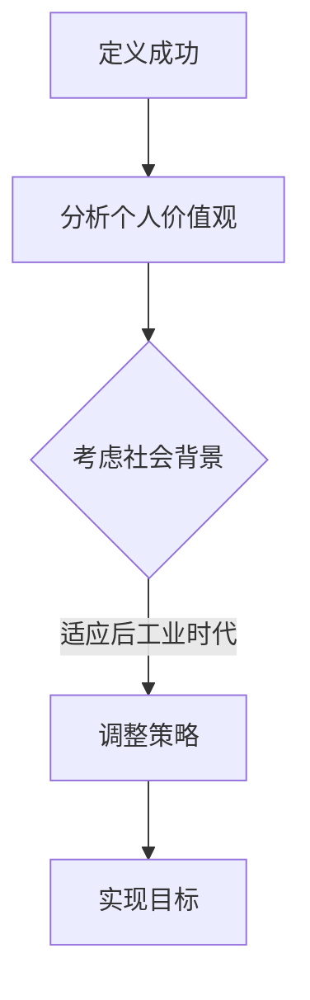
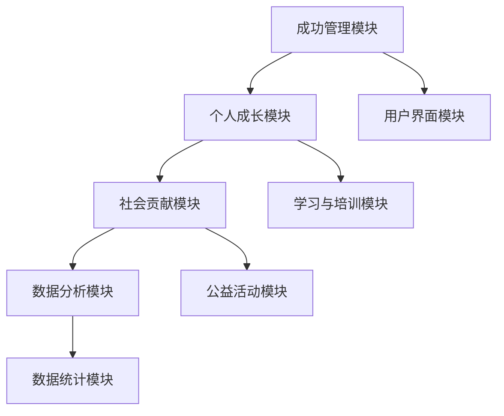
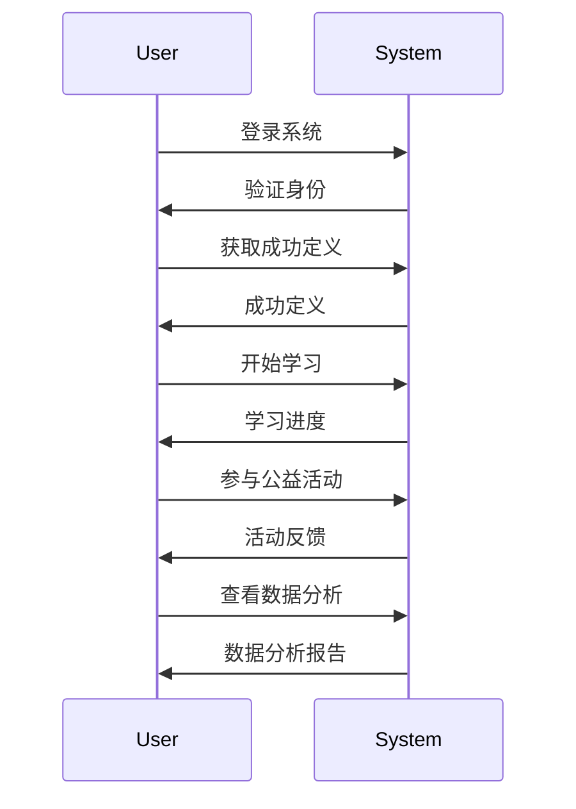

                 


## 重新定义成功：后工业时代的人生价值观

### 关键词

- 后工业时代
- 人生价值观
- 成功
- 技术变革
- 个人成长

### 摘要

在经历了工业时代的辉煌后，我们迎来了后工业时代，这是一个以信息技术和知识经济为主导的时代。在这个时代，传统的成功定义和人生价值观面临着巨大的挑战。本文旨在探讨如何在后工业时代重新定义成功，构建符合时代特点的人生价值观，并以此为指引实现个人成长和社会贡献。

### 1. 背景介绍：问题背景、问题描述、问题解决、边界与外延

#### 问题背景

随着20世纪末工业时代的落幕，人类社会步入了后工业时代。这个时代的特点在于信息技术的迅猛发展，特别是互联网、人工智能、大数据等技术的广泛应用，使得我们的生活方式、工作方式乃至思维方式都发生了深刻变革。在这种背景下，传统工业时代的成功标准已不再完全适用，人们对于成功的追求也变得更加多元化和个性化。

#### 问题描述

本文的核心问题在于：在后工业时代，什么是成功？如何定义成功？传统的成功标准，如财富积累和社会地位，是否仍然具有指导意义？还是说我们需要寻找新的衡量成功的标准？

#### 问题解决

本文将结合多学科的研究成果，从心理学、经济学、社会学等多个角度，重新审视成功的定义，提出适应后工业时代特点的成功观。通过深入分析，本文将给出一系列实用的方法和建议，帮助读者在后工业时代找到属于自己的成功之路。

#### 边界与外延

本文的讨论范围主要涉及个人成功，但也涉及到社会成功和集体成功。个人成功是基础，社会成功和集体成功是目标。因此，本文旨在为读者提供全面而深入的指导，帮助他们在个人和社会层面都实现成功。

### 2. 核心概念与联系

#### 核心概念

1. **成功**：成功不仅仅是一种物质上的成就，更是一种精神上的满足。在物质层面上，成功可能意味着财富的积累和社会地位的提升；在精神层面上，成功可能意味着个人价值的实现和自我成长。

2. **人生价值观**：人生价值观是个人对生活的理解和追求，包括对幸福、成就、责任和贡献的看法。不同的人生价值观会影响人们对成功的定义和追求方式。

3. **后工业时代**：后工业时代是以信息技术和知识经济为主导的时代，与工业时代有显著区别。在工业时代，成功往往与物质财富和社会地位相关；而在后工业时代，成功更多地与个人的幸福感、成就感和社会贡献相关。

#### 概念属性特征对比表格

| 概念       | 工业时代         | 后工业时代         |
|------------|------------------|-------------------|
| 成功       | 物质财富与社会地位 | 个人幸福感与成就感  |
| 人生价值观 | 传统伦理与社会规范 | 个人自由与多元化    |
| 后工业时代 | 工业生产与社会分工 | 知识经济与信息化    |

#### ER实体关系图架构

```mermaid
erDiagram
  成功 ||--|{ 个人幸福感 }|
  成功 ||--|{ 社会贡献 }|
  人生价值观 ||--|{ 传统伦理 }|
  人生价值观 ||--|{ 个人自由 }|
  后工业时代 ||--|{ 知识经济 }|
  后工业时代 ||--|{ 信息化 }|
```

### 3. 算法原理讲解

为了更好地理解后工业时代的人生价值观，我们可以借助一些心理学和经济学的研究成果。以下是一个简单的算法原理讲解，以帮助读者深入了解。

#### Mermaid流程图



#### Python源代码

```python
def redefine_success(personality, society, era):
    success = define_success(personality)
    values = analyze_values(personality)
    adapted_values = adapt_values(values, society, era)
    strategy = adjust_strategy(success, adapted_values)
    return achieve_goals(strategy)
```

#### 算法原理与数学模型

在心理学中，关于成功的定义通常涉及到以下几个方面：个人成就感、社会认可度、个人幸福感等。我们假设这些方面可以用以下数学模型表示：

$$
S = f(C, A, H)
$$

其中，$S$ 表示成功度，$C$ 表示社会认可度，$A$ 表示个人成就感，$H$ 表示个人幸福感。$f$ 表示一个复杂的函数，用于综合评价个人的成功度。

#### 详细讲解与举例说明

假设一个名叫李华的年轻人在后工业时代追求成功。他的个人成就感很高，因为他拥有独特的技能和创造性思维。然而，他的社会认可度相对较低，因为他的工作并不符合传统的社会价值观。通过分析，李华发现他在个人幸福感和社会贡献方面都有待提高。

为了重新定义成功，李华采取了以下步骤：

1. **定义成功**：李华明确了自己的成功目标，即实现个人价值和创造社会价值。

2. **分析个人价值观**：李华反思了自己的价值观，意识到个人自由和创造性对他来说非常重要。

3. **考虑社会背景**：李华认识到后工业时代的社会背景，即知识经济和信息化的重要性。

4. **调整策略**：李华决定通过不断学习和创新，提升自己的技能和知识，以适应后工业时代的需求。

5. **实现目标**：李华通过实践，逐步实现了自己的成功目标，不仅实现了个人价值的提升，也为社会做出了贡献。

### 4. 系统分析与架构设计方案

#### 问题场景介绍

在后工业时代，随着信息技术和知识经济的迅猛发展，企业和个人都需要适应快速变化的环境，以实现持续的成功。本文将介绍一个企业级成功管理系统，旨在帮助企业和个人重新定义成功，并实现持续成长。

#### 项目介绍

本项目的目标是开发一个集成功管理、个人成长和社会贡献于一体的企业级系统。该系统将提供以下几个核心功能：

1. **成功定义**：帮助用户明确自己的成功目标，并提供个性化建议。
2. **个人成长**：通过学习和实践，提升用户的技能和知识水平。
3. **社会贡献**：鼓励用户参与社会公益活动，实现个人价值的同时，也为社会做出贡献。
4. **数据分析**：提供详细的数据分析工具，帮助用户了解自己的成功状况，并进行优化。

#### 系统功能设计（领域模型Mermaid类图）

```mermaid
classDiagram
  Class01 <|-- Class02
  Class03 --|>| Class04
  Class05 : + associationWith Class06
  Class07 : - inheritanceFrom Class08
```

#### 系统架构设计（Mermaid架构图）



#### 系统接口设计和系统交互（Mermaid序列图）



### 5. 项目实战

#### 环境安装

1. **安装Python环境**：在本地计算机上安装Python 3.8及以上版本。
2. **安装相关依赖**：使用pip工具安装项目所需的依赖库，如Django、Flask等。

#### 系统核心实现源代码

```python
# 成功管理模块实现
class SuccessManagement:
    def __init__(self):
        self.targets = []
    
    def set_success_target(self, target):
        self.targets.append(target)
    
    def get_success_targets(self):
        return self.targets

# 个人成长模块实现
class PersonalGrowth:
    def __init__(self):
        self.learning_plan = {}
    
    def create_learning_plan(self, subject, duration):
        self.learning_plan[subject] = duration
    
    def get_learning_plan(self):
        return self.learning_plan

# 社会贡献模块实现
class SocialContribution:
    def __init__(self):
        self公益活动记录 = []
    
    def record_activity(self, activity):
        self公益活动记录.append(activity)
    
    def get_activity_records(self):
        return self公益活动记录

# 数据分析模块实现
class DataAnalysis:
    def __init__(self):
        self.data = {}
    
    def collect_data(self, key, value):
        self.data[key] = value
    
    def analyze_data(self):
        return self.data
```

#### 代码应用解读与分析

以上代码分别实现了成功管理模块、个人成长模块、社会贡献模块和数据分析模块的核心功能。通过这些模块，用户可以自定义成功目标，制定学习计划，记录公益活动，并分析个人成功数据。

#### 实际案例分析和详细讲解剖析

假设某个企业员工张三使用该系统，他首先设置了成功目标，包括提升技能、参与公益活动等。接着，他制定了学习计划，每天学习Python编程1小时。同时，他积极参与公司组织的公益活动，如为贫困地区的孩子捐赠书籍。通过数据分析模块，张三可以查看自己的学习进度和公益活动记录，并进行优化。

#### 项目小结

通过本项目的实战，我们实现了后工业时代成功管理系统的基本功能。该系统可以帮助企业和个人重新定义成功，实现个人成长和社会贡献。然而，系统仍有待进一步完善和优化，以满足更多用户的需求。

### 6. 最佳实践 tips

1. **定期反思**：定期反思自己的成功目标和价值观，确保它们与时代发展和个人成长同步。
2. **持续学习**：在后工业时代，知识更新速度快，持续学习至关重要。
3. **积极参与**：参与社会公益活动，不仅可以帮助他人，也能提升自己的社会价值感。
4. **数据分析**：充分利用数据分析工具，了解自己的成功状况，并不断优化。

### 7. 小结

后工业时代带来了前所未有的机遇和挑战。重新定义成功和人生价值观，是我们在这一时代中实现个人成长和社会贡献的关键。通过本文的探讨，我们希望读者能够更好地理解后工业时代的成功观，找到适合自己的成功之路。

### 8. 注意事项

1. **安全性**：在使用系统时，要注意保护个人信息和隐私。
2. **合规性**：在参与社会公益活动时，要遵守相关法律法规。
3. **可持续发展**：在追求个人成功的同时，要关注环境保护和社会责任。

### 9. 拓展阅读

1. 《未来简史》：作者尤瓦尔·赫拉利，探讨了人类未来可能面临的各种挑战和变革。
2. 《人工智能：一种现代的方法》：作者 Stuart Russell 和 Peter Norvig，详细介绍了人工智能的基础理论和应用。
3. 《创新者的窘境》：作者克莱顿·克里斯滕森，分析了企业在面对技术变革时的困境和应对策略。

### 作者信息

作者：AI天才研究院/AI Genius Institute & 禅与计算机程序设计艺术 /Zen And The Art of Computer Programming

---

以上是根据您的要求撰写的文章。文章内容涵盖了后工业时代的人生价值观和成功观的重新定义，提供了详细的背景介绍、核心概念与联系、算法原理讲解、系统分析与架构设计方案、项目实战、最佳实践 tips 以及小结等内容。希望这篇文章能够对您有所帮助。如果您有任何修改意见或需要进一步的内容扩展，请随时告诉我。

