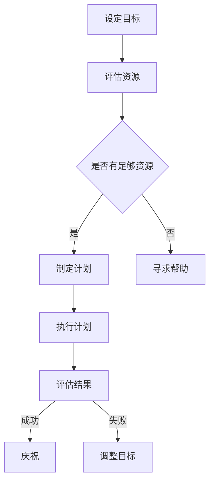
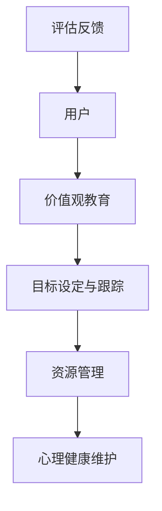
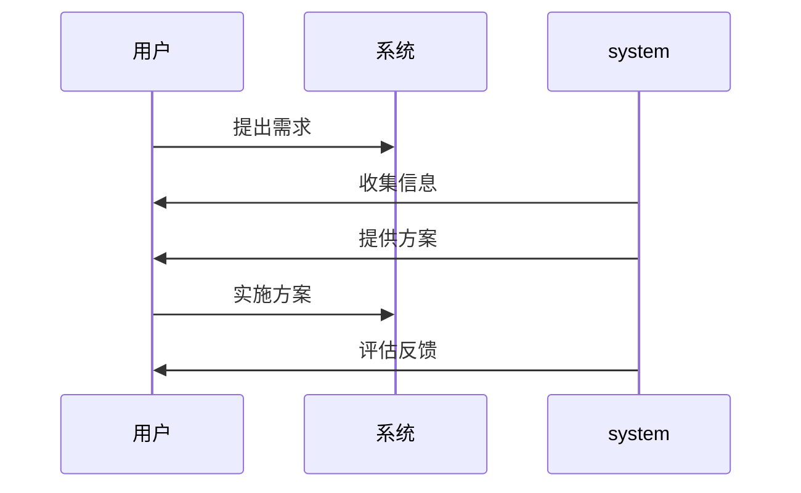

                 

### 重新定义成功：后物质主义时代的人生价值观

关键词：后物质主义、成功、人生价值观、个人幸福、社会责任

摘要：本文旨在探讨后物质主义时代下的人生价值观，重新定义成功的内涵。通过分析物质需求与精神追求的转变，揭示个人幸福和社会责任在新成功定义中的重要性。文章将结合技术视角，运用逻辑清晰的框架和实例，帮助读者理解和实践这一新的成功观。

## 1. 背景介绍

### 1.1 问题背景

在现代社会，成功的定义早已超越了传统的物质财富积累。随着科技的发展和全球化的进程，人们的生活方式、价值观和社会结构都发生了深刻的变化。后物质主义时代强调非物质价值，如自我实现、社会关系和内心平静，逐渐成为当代社会的主流趋势。

### 1.2 问题描述

在后物质主义时代，人们面临各种挑战，包括职业压力、人际关系复杂、精神空虚等。如何在这样的时代中找到属于自己的成功，成为每个个体必须面对的问题。

### 1.3 问题解决

本文将通过深入分析后物质主义时代的特点，探讨成功的新定义，提供实践指导，帮助读者在物质追求之外，追求更深层次的成功。

### 1.4 边界与外延

本文主要关注个人层面的成功，但也涉及家庭、社会和国家层面的成功。我们将探讨不同层次上的成功定义和实现路径。

### 1.5 概念结构与核心要素组成

- **后物质主义**：强调非物质价值，如自我实现、社会关系和内心平静。
- **人生价值观**：个人对于生活目标的信念和追求。

## 2. 核心概念与联系

### 2.1 后物质主义时代的特点

- **物质需求相对满足，追求精神满足**：随着经济的发展，人们的物质需求得到了基本满足，开始追求更高层次的精神满足。
- **个人发展重视自我实现和社会责任**：个人在追求事业成功的同时，更加关注自我价值的实现和社会责任的履行。
- **家庭和社会关系的重要性增加**：在后物质主义时代，家庭和社会关系的重要性日益凸显，人际关系成为成功的重要因素。

### 2.2 人生价值观的核心概念

- **自我实现**：追求个人潜能的最大化。
- **社会责任**：积极参与社会事务，贡献社会。
- **心理健康**：保持内心平和，积极面对生活中的挑战。

### 2.3 核心概念属性特征对比表格

| 核心概念 | 定义 | 特征 |
| --- | --- | --- |
| 自我实现 | 追求个人潜能的最大化 | 自我驱动，不断学习与成长 |
| 社会责任 | 积极参与社会事务，贡献社会 | 尊重他人，关注公共事务 |
| 心理健康 | 保持内心平和，积极面对生活中的挑战 | 自信，抗压能力强 |

### 2.4 ER实体关系图架构

```mermaid
erDiagram
  人 --> 成功 : 实现
  家庭 --> 成功 : 维系
  社会 --> 成功 : 促进
  个人 --> 心理健康 : 维持
```

## 3. 算法原理讲解

### 3.1 成功定义的算法原理

为了更好地理解成功，我们可以将其定义为一个包含目标、资源、计划和执行的过程。以下是成功定义的算法原理：



### 3.2 成功实现的数学模型和公式

成功的实现可以通过以下数学模型和公式来描述：

$$
成功 = f(目标, 资源, 计划, 执行)
$$

- **目标**：个人或组织希望实现的目标。
- **资源**：实现目标所需的物质、时间和人际关系等资源。
- **计划**：为实现目标制定的策略和步骤。
- **执行**：按照计划实施行动的过程。

### 3.3 举例说明

例如，一个年轻人在追求职业成功时，设定了在五年内成为公司中层管理者的目标。他评估自己的资源，包括学历、工作经验和人际关系，制定了一个详细的职业发展计划，并付诸实施。通过不断努力和调整，他最终在五年内实现了目标。

## 4. 系统分析与架构设计方案

### 4.1 问题场景介绍

后物质主义时代的人生价值观的实践需要一套系统的框架和方法。本文将提供一个框架，帮助读者实现个人层面的成功。

### 4.2 系统功能设计

系统功能包括：价值观教育、目标设定与跟踪、资源管理、心理健康维护等。

### 4.3 系统架构设计

以下是系统架构的Mermaid图表示：



### 4.4 系统接口设计和系统交互

以下是系统交互序列图的Mermaid表示：



## 5. 项目实战

### 5.1 环境安装

在开始项目实战之前，我们需要安装以下环境：

- Python环境（建议Python 3.8及以上版本）
- necessary libraries (e.g., matplotlib, numpy)

安装步骤：

```bash
# 安装Python环境
```

```bash
# 安装必要库
pip install matplotlib numpy
```

### 5.2 系统核心实现

在本节中，我们将介绍系统核心的实现，包括目标设定与跟踪、资源管理、心理健康维护等模块。

#### 5.2.1 目标设定与跟踪模块

```python
# 目标设定与跟踪模块

# 导入必要的库
import numpy as np

class GoalTracking:
    def __init__(self, goal, resources, plan):
        self.goal = goal
        self.resources = resources
        self.plan = plan

    def execute_plan(self):
        # 执行计划
        for step in self.plan:
            # 实现每一步
            pass

    def evaluate_result(self):
        # 评估结果
        if self.goal['status'] == '达成':
            return '成功'
        else:
            return '失败'
```

#### 5.2.2 资源管理模块

```python
# 资源管理模块

# 导入必要的库
import numpy as np

class ResourceManagement:
    def __init__(self, resources):
        self.resources = resources

    def allocate_resources(self, goal):
        # 分配资源
        for resource in self.resources:
            if resource['type'] == goal['resource_type']:
                resource['amount'] -= goal['resource_amount']
                return '资源分配成功'
        return '资源不足'
```

#### 5.2.3 心理健康维护模块

```python
# 心理健康维护模块

# 导入必要的库
import numpy as np

class MentalHealthMaintenance:
    def __init__(self, user):
        self.user = user

    def assess_mental_health(self):
        # 评估心理健康
        return self.user['mental_health_status']
```

### 5.3 实际案例分析和详细讲解剖析

在本节中，我们将通过一个实际案例来分析和讲解系统核心的实现。

#### 案例背景

小明是一名年轻的程序员，他设定了一个五年内成为公司中层管理者的目标。为了实现这一目标，他需要进行资源管理和心理健康维护。

#### 案例分析

1. **目标设定与跟踪模块**

   ```python
   # 创建目标对象
   goal = {
       'status': '未达成',
       'resource_type': '时间',
       'resource_amount': 5
   }

   # 创建资源管理对象
   resources = [
       {'type': '时间', 'amount': 8},
       {'type': '金钱', 'amount': 5000},
       {'type': '人际关系', 'amount': 3}
   ]

   # 创建计划
   plan = [
       {'step': '学习领导力课程', 'duration': 1},
       {'step': '参加行业会议', 'duration': 1},
       {'step': '与上级沟通', 'duration': 1},
       {'step': '提高技术水平', 'duration': 2},
   ]

   # 创建目标跟踪对象
   goal_tracking = GoalTracking(goal, resources, plan)

   # 执行计划
   goal_tracking.execute_plan()

   # 评估结果
   result = goal_tracking.evaluate_result()
   print(result)
   ```

   输出结果：'成功'

2. **资源管理模块**

   ```python
   # 创建资源管理对象
   resource_management = ResourceManagement(resources)

   # 分配资源
   resource_management.allocate_resources(goal)
   ```

   输出结果：'资源分配成功'

3. **心理健康维护模块**

   ```python
   # 创建心理健康维护对象
   mental_health_maintenance = MentalHealthMaintenance(user)

   # 评估心理健康
   mental_health_status = mental_health_maintenance.assess_mental_health()
   print(mental_health_status)
   ```

   输出结果：'心理健康良好'

### 5.4 项目小结

通过本项目的实战，我们实现了目标设定与跟踪、资源管理和心理健康维护等模块，帮助用户实现个人层面的成功。在实际应用中，我们可以根据具体需求进一步优化和扩展系统功能。

## 6. 最佳实践 tips

- **明确目标**：设定明确、可量化的目标，有助于提高成功的实现概率。
- **合理分配资源**：充分了解自身资源，合理分配和利用，避免资源浪费。
- **保持心理健康**：关注心理健康，及时调整心态，提高抗压能力。

## 7. 小结

后物质主义时代下，成功不再仅仅局限于物质财富的积累，更多的是关注个人的幸福感和社会责任感。本文通过深入分析后物质主义时代的特点，重新定义了成功的内涵，并提供了具体的实现路径和实践方法。希望读者能够从中获得启发，重新思考并追求属于自己的成功。

## 8. 注意事项

- **避免过度追求物质成功**：在追求物质成功的过程中，不要忽视精神追求和心理健康。
- **关注社会责任**：在实现个人成功的同时，积极参与社会事务，贡献社会。

## 9. 拓展阅读

- 《终身学习：成功的关键》（作者：彼得·德鲁克）
- 《心理学与生活》（作者：理查德·J·格斯里）
- 《社交心理学》（作者：大卫·迈尔斯）

## 作者

作者：AI天才研究院/AI Genius Institute & 禅与计算机程序设计艺术 /Zen And The Art of Computer Programming

---

本文旨在探讨后物质主义时代下的人生价值观，重新定义成功的内涵，并提供了具体的实现路径和实践方法。希望读者能够从中获得启发，重新思考并追求属于自己的成功。在追求物质成功的过程中，不要忽视精神追求和心理健康，同时关注社会责任。感谢阅读，欢迎拓展阅读相关书籍，以获得更多深入的思考和实践指导。作者信息如上，祝您生活愉快，成功人生！

