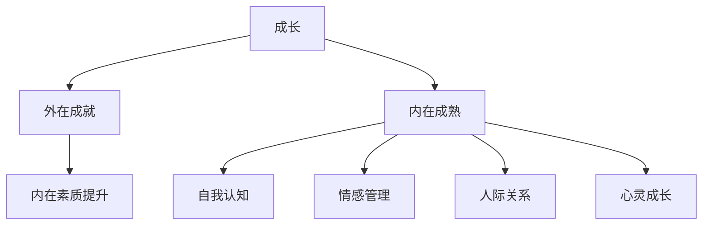
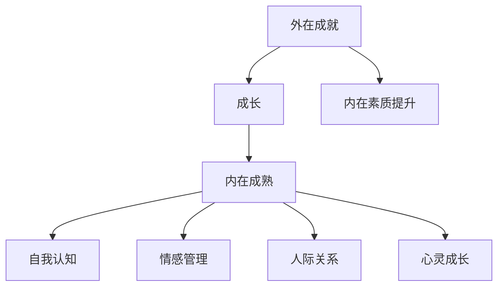
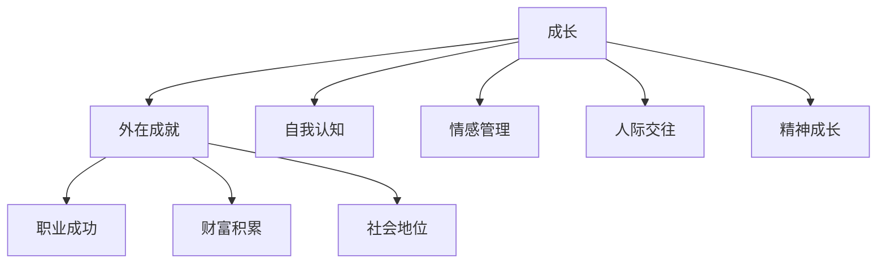
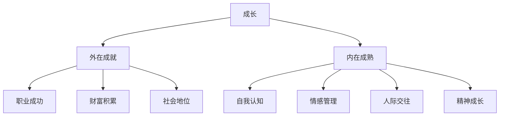
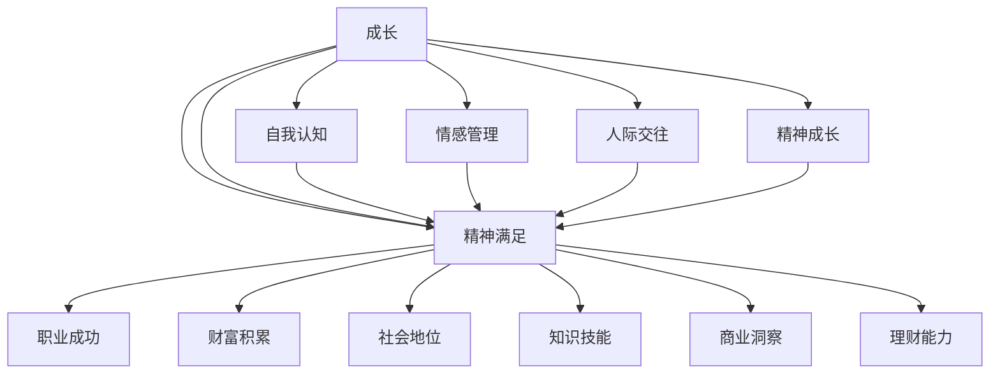

                 

# 重新定义成长：从外在成就到内在成熟的转变

> 关键词：个人成长、外在成就、内在成熟、自我认知、情感管理、心灵成长

> 摘要：
在现代社会，个人成长不再仅仅是追求外在成就，而是一个深层次的从外在成功向内在成熟的转变过程。本文旨在探讨这一转变的必要性和途径，为读者提供一种全新的成长视角。文章将从背景介绍、核心概念与联系、成长与外在成就的关系、内在成熟的实践方法等方面，逐步展开分析，以期为个人成长提供有价值的思考和指导。

## 第二部分：背景介绍

### 1. 问题背景

在现代社会，个人成长面临着前所未有的挑战。过去，人们往往将外在成就视为成功的标志，如职业成功、财富积累、社会地位等。然而，随着社会的快速发展和个人价值的多元化，越来越多的人开始意识到，外在成就并不能完全代表一个人的价值和幸福感。相反，真正的成长是一个从外在成功向内在成熟的转变过程。

这种转变涉及到个人价值观、人际关系、心灵成长等多个方面。首先，在价值观层面，人们开始反思过去过分追求物质成功的价值取向，追求更高层次的精神满足和内心平静。其次，在人际关系层面，人们开始意识到建立健康和谐的人际关系对于个人成长的重要性。最后，在心灵成长层面，人们开始追求内心的平静和满足，实现精神层面的提升。

### 2. 问题描述

随着社会的快速发展和个人价值的多元化，许多人感到成长的压力和困惑。如何从外在成就向内在成熟转变，实现全面而深刻的成长，成为亟需解决的问题。这个问题不仅涉及到个人的内心成长，也关系到家庭、社会、文化等多个层面。

外在成就虽然可以给人带来暂时的满足感，但长期的幸福感往往来自于内在的成熟。许多人发现自己在外在成就上取得了成功，但内心却空虚和迷茫。这种内在的空虚和迷茫往往源于对自我的认知不足、情感管理能力欠缺和人际关系的困境。

### 3. 问题解决

本书旨在为读者提供一种全新的成长视角，通过深入探讨成长的核心概念、内在动力、实践方法，帮助读者理解并实现从外在成就到内在成熟的转变。首先，本书将详细阐述成长的核心概念，如外在成就和内在成熟，帮助读者理解这两个概念的区别和联系。其次，本书将探讨内在成熟的必要性，分析外在成就与内在成熟之间的辩证关系。最后，本书将提供一系列实践方法，如自我认知的提升、情感管理、人际关系的建立等，帮助读者实现内在成熟。

### 4. 边界与外延

成长是一个广泛而复杂的话题，它不仅包括个人成长，还涉及到家庭、社会、文化等多个层面。因此，本书的研究边界主要聚焦于个人层面的成长，但同时也会涉及到家庭和社会的影响。此外，成长的核心概念如外在成就和内在成熟，也将从多个角度进行探讨，包括心理学、哲学、社会学等。

### 5. 概念结构与核心要素组成

- **成长**：不仅指个人外在成就的累积，更强调内在素质的提升。
- **外在成就**：包括职业成功、财富积累、社会地位等。
- **内在成熟**：包括自我认知、情感管理、人际关系、心灵成长等。
- **核心要素**：价值观、信念、态度、行为习惯等。

## 第三部分：核心概念与联系

### 1. 成长与外在成就的关系

#### 1.1 成长的定义

成长是一个持续的过程，涉及个人能力、知识、情感、精神等多方面的提升。它不仅包括外在成就的积累，更强调内在素质的提升。成长是一个动态的过程，随着时间的推移，个人的各个方面都会发生变化和提升。

#### 1.2 外在成就的定义

外在成就通常指的是在职业、财富、社会地位等方面的成功和表现。外在成就往往是通过外在的衡量标准来评价的，如职位晋升、收入增加、社会认可等。外在成就可以给人带来暂时的满足感和自豪感，但并不一定代表一个人的全面成长。

#### 1.3 成长与外在成就的关系

外在成就可以作为成长的阶段性目标，但不是成长的全部。真正的成长是在追求外在成就的过程中，不断提升内在素质，实现从外在到内在的转变。成长和外在成就之间的关系是相辅相成的，外在成就可以作为成长的动力和检验标准，而内在成熟则是成长的核心和终极目标。

### 2. 内在成熟的概念

#### 2.1 内在成熟的意义

内在成熟是个人成长的高级阶段，它强调个体的自我认知、情感管理、人际关系的深化和心灵成长。内在成熟不仅关注个人的内在素质，还涉及到个人的精神世界和心灵状态。内在成熟的人往往能够更好地应对生活中的挑战，拥有更高的幸福感和满足感。

#### 2.2 内在成熟的核心要素

- **自我认知**：自我认知是指个体对自己的理解、认知和评价。自我认知的提升可以帮助个体更好地认识自己，明确自己的优点和缺点，从而更好地发展自己。
- **情感管理**：情感管理是指个体对自身情绪的认知、调节和控制。情感管理的能力可以帮助个体更好地处理情绪，保持情绪的稳定和积极，提高生活的质量。
- **人际关系**：人际关系是指个体与他人之间的相互作用和关系。良好的人际关系可以帮助个体建立支持和帮助的体系，提高个人的社会地位和幸福感。
- **心灵成长**：心灵成长是指个体在精神层面的提升和发展。心灵成长可以帮助个体实现内心的平静和满足，追求更高层次的精神满足和幸福感。

### 3. 成长、外在成就与内在成熟的关系图

## 第四部分：成长与外在成就的关系

### 1. 成长与外在成就的辩证关系

#### 1.1 成长是外在成就的前提

一个人的成长是取得外在成就的基础。只有通过不断学习和提升，才能在职业、财富等方面取得成功。成长不仅包括知识和技能的提升，还包括自我认知、情感管理、人际关系等多方面的提升。这些内在素质的提升，是外在成就的坚实基础。

#### 1.2 外在成就是成长的体现

外在成就可以作为成长的一种衡量标准。在实现外在成就的过程中，个人的内在素质也会得到提升，从而实现内在成熟。外在成就的取得，不仅需要个人的能力，还需要个人的努力和坚持。外在成就的取得，是个人成长的重要体现。

### 2. 从外在成就到内在成熟的转变

#### 2.1 转变的必要性

在现代社会，人们越来越意识到内在成熟的重要性。单纯的物质追求已经无法满足人们对生活的需求，人们开始寻求更深层次的满足和幸福感。内在成熟不仅可以帮助个人更好地应对生活中的挑战，还可以提高个人的幸福感和满足感。

#### 2.2 转变的途径

要从外在成就向内在成熟转变，需要采取以下途径：

- **自我反思**：通过反思自己的行为和思考，找到内在成长的需求。自我反思可以帮助个体更好地认识自己，明确自己的成长方向。
- **持续学习**：通过学习新的知识和技能，提升自己的内在素质。持续学习不仅可以提升个人的能力，还可以帮助个体保持对生活的热情和好奇心。
- **情感管理**：通过学习情感管理技巧，提高自己的情绪稳定性和积极性。情感管理能力是内在成熟的重要组成部分，它可以帮助个体更好地处理生活中的情绪波动。
- **人际交往**：通过建立良好的人际关系，实现心灵成长。良好的人际关系可以帮助个体获得支持和帮助，提高个人的社会地位和幸福感。

### 3. 成长与外在成就的平衡

#### 3.1 保持目标的一致性

在追求外在成就的过程中，要保持对成长目标的清晰认识，确保外在成就与内在成熟相辅相成。外在成就可以作为成长的一部分，但不是全部。内在成熟是成长的核心和终极目标，外在成就只是达到这一目标的手段之一。

#### 3.2 合理安排时间和精力

在追求外在成就的同时，要合理安排时间和精力，确保有足够的时间和空间进行内在成长。合理安排时间，不仅可以帮助个体更好地管理自己的工作和生活，还可以帮助个体保持对内在成长的需求和热情。

## 第五部分：内在成熟的实践方法

### 1. 自我认知的提升

#### 1.1 自我认知的意义

自我认知是内在成熟的基础，它关乎个体对自己性格、能力、需求和价值观的深刻理解。自我认知的提升，可以帮助个体更好地认识自己，明确自己的优点和缺点，从而在成长过程中更有针对性地进行改进和提升。

#### 1.2 自我认知的提升方法

- **反思日记**：通过写反思日记，记录自己的行为、思考和感受，有助于个体深入反思自己的行为模式和心理状态，从而提升自我认知。
- **心理测试**：通过心理测试，如MBTI、DISC等，可以帮助个体了解自己的性格类型和行为倾向，从而更好地理解自己。
- **与他人交流**：与他人交流，特别是与朋友、家人和同事，可以获得外部的反馈和观点，有助于个体更全面地认识自己。

### 2. 情感管理的提升

#### 2.1 情感管理的意义

情感管理是指个体对自身情绪的认知、调节和控制。情感管理的能力对于个人的生活质量和心理健康至关重要。有效的情感管理可以帮助个体更好地应对压力，保持情绪的稳定和积极，提高生活质量。

#### 2.2 情感管理的提升方法

- **情绪识别**：学会识别自己的情绪，理解情绪的产生原因和影响，是情感管理的第一步。
- **情绪调节**：通过深呼吸、冥想、运动等方式，可以有效地调节情绪，保持情绪的稳定。
- **情绪表达**：学会健康地表达情绪，避免情绪压抑或爆发，是情感管理的重要环节。

### 3. 人际关系的建立

#### 3.1 人际关系的意义

人际关系是指个体与他人的相互作用和关系。良好的人际关系对于个人的成长和社会的融入至关重要。良好的人际关系可以帮助个体获得支持和帮助，提高个人的社会地位和幸福感。

#### 3.2 人际关系的建立方法

- **真诚待人**：真诚待人，尊重他人的观点和感受，是建立良好人际关系的基础。
- **有效沟通**：学会倾听他人的意见，表达自己的观点，是有效沟通的关键。
- **共情能力**：培养共情能力，理解他人的情感和需求，是建立深厚人际关系的重要途径。

### 4. 心灵成长的实践

#### 4.1 心灵成长的意义

心灵成长是指个体在精神层面的提升和发展。心灵成长不仅关注个体的心理健康，还涉及个体的精神世界和价值观。心灵成长可以帮助个体实现内心的平静和满足，追求更高层次的精神满足和幸福感。

#### 4.2 心灵成长的实践方法

- **冥想**：通过冥想，可以帮助个体平静心灵，提高专注力和情绪调节能力。
- **阅读**：阅读可以拓宽个体的视野，提高知识水平和思考能力。
- **艺术创作**：通过艺术创作，可以表达个体的情感和思想，提高个体的创造力和自我认知。

### 5. 内在成熟的综合实践

内在成熟是一个综合性的过程，需要个体在多个方面进行实践。自我认知的提升、情感管理的提升、人际关系的建立和心灵成长的实践，都是内在成熟的重要组成部分。个体需要在这些方面进行持续的实践和提升，才能实现真正的内在成熟。

## 第六部分：案例分析与思考

### 1. 案例一：从职场成功到心灵成长

小明是一位成功的职场人士，他在职业生涯中取得了显著的成就，但内心却感到空虚和迷茫。在经历了一次深刻的自我反思后，他开始关注内在成长。他通过阅读、冥想、参加心灵成长课程等方式，逐渐提升了自己的自我认知、情感管理能力和心灵成长水平。随着时间的推移，他不仅在工作上取得了更大的成功，还拥有了更加充实和幸福的人生。

### 2. 案例二：从情感困境到内在成熟

小芳曾因为情感问题而陷入困境，她的情绪波动大，人际关系紧张。在心理咨询师的建议下，她开始学习情感管理技巧，并通过自我反思和心理咨询，逐步提升了情感管理能力。她学会了更好地处理自己的情绪，建立了健康的人际关系。通过这一过程，她不仅走出了情感困境，还实现了内在成熟。

### 3. 案例三：从物质追求到精神满足

小李曾是一个追求物质成功的人，他在财富积累和社会地位提升的过程中，感到越来越空虚。在经历了一次深刻的思考和自我反思后，他开始关注内在成长。他通过学习、旅行、艺术创作等方式，逐渐提升了自我认知、情感管理能力和心灵成长水平。他发现，真正的幸福和满足来自于内心的平静和精神满足，而不是外在的物质追求。

### 4. 案例分析与思考

通过以上案例，我们可以看到，从外在成就到内在成熟的转变，不仅需要个体的自我认知和情感管理，还需要个体在人际关系和心灵成长方面进行综合实践。每个人的成长路径都是独特的，但内在成熟是所有个体追求的共同目标。通过自我反思、持续学习和实践，我们可以实现从外在成就到内在成熟的转变，获得更加充实和幸福的人生。

## 第七部分：总结与展望

### 1. 总结

本文通过深入探讨成长的核心概念、成长与外在成就的关系、内在成熟的实践方法等方面，重新定义了成长。我们认识到，成长不仅仅是指外在成就的累积，更是内在素质的提升和心灵成长的过程。外在成就可以作为成长的阶段性目标，但内在成熟才是成长的核心和终极目标。

### 2. 展望

未来的成长将更加注重内在成熟，个体需要通过自我认知的提升、情感管理的提升、人际关系的建立和心灵成长的实践，实现全面而深刻的成长。随着社会的不断进步和个人价值的多元化，内在成熟将成为个体追求幸福和满足的重要途径。

### 3. 对未来的思考

在未来的成长过程中，个体需要更加注重内在成长，关注自我认知、情感管理和心灵成长。同时，社会和家庭也需要为个体的内在成长提供支持和环境。只有这样，个体才能实现真正的内在成熟，获得持久而深刻的成长。

## 第八部分：最佳实践 Tips

### 1. 定期自我反思

定期进行自我反思，可以帮助个体更好地认识自己，明确自己的成长方向。建议每周或每月进行一次深入的自我反思，记录自己的行为、思考和感受。

### 2. 建立良好的学习习惯

持续学习是内在成长的重要途径。建议个体制定学习计划，定期阅读书籍、参加培训课程，提升自己的知识和技能。

### 3. 培养情感管理能力

学会情感管理，可以帮助个体更好地处理情绪，保持情绪的稳定和积极。建议个体学习情感管理技巧，如冥想、深呼吸等。

### 4. 建立健康的人际关系

建立健康的人际关系，可以提供个体支持和帮助。建议个体积极参与社交活动，建立和维护良好的人际关系。

### 5. 注重心灵成长

心灵成长是实现内在成熟的关键。建议个体通过冥想、阅读、艺术创作等方式，提升自己的心灵成长水平。

## 第九部分：小结

通过本文的探讨，我们重新定义了成长，认识到成长是一个从外在成就到内在成熟的转变过程。在这个过程中，自我认知的提升、情感管理的提升、人际关系的建立和心灵成长的实践，都是实现内在成熟的关键。希望读者能够从中获得启示，开始自己的内在成长之旅。

## 第十部分：注意事项

1. **成长是一个持续的过程**：内在成熟不是一蹴而就的，需要个体持续的努力和投入。
2. **保持开放的心态**：内在成长需要个体保持开放的心态，接受新的观点和知识。
3. **实践与反思相结合**：内在成长需要通过实践和反思相结合，不断调整和改进自己的行为和思考方式。

## 第十一部分：拓展阅读

1. **《当下的力量》**：作者埃克哈特·托勒，探讨内心力量和自我认知的书籍。
2. **《非暴力沟通》**：作者马歇尔·卢森堡，介绍情感管理和有效沟通的技巧。
3. **《正面管教》**：作者简·尼尔森，介绍如何建立健康的人际关系和培养良好的行为习惯。

## 第十二部分：作者信息

作者：AI天才研究院/AI Genius Institute & 禅与计算机程序设计艺术 /Zen And The Art of Computer Programming

重新定义成长：从外在成就到内在成熟的转变，不仅是对个人成长的新理解，也是对现代社会变迁的回应。在本文中，我们通过背景介绍、核心概念与联系、成长与外在成就的关系、内在成熟的实践方法等方面，逐步探讨了这一转变的过程和途径。我们认识到，真正的成长不仅仅是外在成就的累积，更是内在素质的提升和心灵成长的过程。在这个过程中，自我认知的提升、情感管理的提升、人际关系的建立和心灵成长的实践，都是实现内在成熟的关键。希望读者能够从中获得启示，开始自己的内在成长之旅。通过持续的努力和反思，每个人都可以实现从外在成就到内在成熟的转变，获得更加充实和幸福的人生。

## **第一部分：背景介绍**

### **1. 问题背景**

在现代社会，个人成长不再是单纯追求外在成就，而是一个从外在成功向内在成熟的转变过程。这种转变涉及到个人价值观、人际关系、心灵成长等多个方面。随着社会的快速发展和个人价值的多元化，越来越多的人开始意识到，外在成就并不能完全代表一个人的价值和幸福感。相反，真正的成长是一个深层次的从外在成功向内在成熟的转变过程。

首先，在价值观层面，人们开始反思过去过分追求物质成功的价值取向，追求更高层次的精神满足和内心平静。过去，人们往往将职业成功、财富积累、社会地位等外在成就视为成功的标志，但现代社会的发展让人们认识到，这些外在成就并不能带来长久的幸福感。相反，内在成熟，如自我认知的提升、情感管理的能力、人际关系的和谐以及心灵成长，才是真正能够带来持久幸福感的关键。

其次，在人际关系层面，人们开始意识到建立健康和谐的人际关系对于个人成长的重要性。过去，人们可能更加注重个人成就和社会地位，但在现代社会，人们逐渐认识到，良好的人际关系是个人成长的重要支撑。建立和谐的人际关系，不仅能够提供情感支持，还能够促进个人的社会融入和心理健康。

最后，在心灵成长层面，人们开始追求内心的平静和满足，实现精神层面的提升。在现代社会，工作和生活的压力越来越大，人们开始寻找内心的宁静和满足感。心灵成长，包括冥想、阅读、艺术创作等，成为人们追求精神满足的重要途径。

### **2. 问题描述**

随着社会的快速发展和个人价值的多元化，许多人感到成长的压力和困惑。如何从外在成就向内在成熟转变，实现全面而深刻的成长，成为亟需解决的问题。这个问题不仅涉及到个人的内心成长，也关系到家庭、社会、文化等多个层面。

外在成就虽然可以给人带来暂时的满足感，但长期的幸福感往往来自于内在的成熟。许多人发现自己在外在成就上取得了成功，但内心却空虚和迷茫。这种内在的空虚和迷茫往往源于对自我的认知不足、情感管理能力欠缺和人际关系的困境。

同时，现代社会的高速发展也带来了新的挑战。工作压力、竞争压力、社交压力等，都使人们在追求外在成就的过程中感到疲惫和焦虑。这种焦虑和疲惫进一步加剧了人们对于内在成熟的追求。

### **3. 问题解决**

本书旨在为读者提供一种全新的成长视角，通过深入探讨成长的核心概念、内在动力、实践方法，帮助读者理解并实现从外在成就到内在成熟的转变。首先，本书将详细阐述成长的核心概念，如外在成就和内在成熟，帮助读者理解这两个概念的区别和联系。其次，本书将探讨内在成熟的必要性，分析外在成就与内在成熟之间的辩证关系。最后，本书将提供一系列实践方法，如自我认知的提升、情感管理、人际关系的建立等，帮助读者实现内在成熟。

本书的研究边界主要聚焦于个人层面的成长，但同时也会涉及到家庭和社会的影响。此外，成长的核心概念如外在成就和内在成熟，也将从多个角度进行探讨，包括心理学、哲学、社会学等。

### **4. 边界与外延**

成长是一个广泛而复杂的话题，它不仅包括个人成长，还涉及到家庭、社会、文化等多个层面。因此，本书的研究边界主要聚焦于个人层面的成长，但同时也会涉及到家庭和社会的影响。

个人层面的成长主要包括自我认知、情感管理、人际关系的建立和心灵成长等方面。这些方面的发展不仅影响个人的内在成熟，也影响到个人的外在成就和社会地位。

家庭层面，家庭成员之间的互动和支持对个人成长有着重要的影响。家庭环境、父母的教养方式、家庭价值观等，都是个人成长的重要影响因素。

社会层面，社会环境、文化传统、社会规范等，对个人成长也有着深远的影响。社会的发展和变迁，会带来新的挑战和机遇，影响个人的成长方向和方式。

### **5. 概念结构与核心要素组成**

为了更好地理解成长的过程，我们可以将成长的核心概念和要素进行结构化分析。

- **成长**：成长是一个持续的过程，涉及个人能力、知识、情感、精神等多方面的提升。它不仅包括外在成就的累积，更强调内在素质的提升。

- **外在成就**：外在成就通常指的是在职业、财富、社会地位等方面的成功和表现。外在成就可以给人带来暂时的满足感，但不是成长的全部。

- **内在成熟**：内在成熟是个人成长的高级阶段，它强调个体的自我认知、情感管理、人际关系的深化和心灵成长。内在成熟不仅关注个人的内在素质，还涉及到个人的精神世界和心灵状态。

- **核心要素**：

  - **自我认知**：自我认知是指个体对自己的理解、认知和评价。自我认知的提升可以帮助个体更好地认识自己，明确自己的优点和缺点，从而更好地发展自己。

  - **情感管理**：情感管理是指个体对自身情绪的认知、调节和控制。情感管理的能力可以帮助个体更好地处理情绪，保持情绪的稳定和积极，提高生活质量。

  - **人际关系**：人际关系是指个体与他人之间的相互作用和关系。良好的人际关系可以帮助个体获得支持和帮助，提高个人的社会地位和幸福感。

  - **心灵成长**：心灵成长是指个体在精神层面的提升和发展。心灵成长可以帮助个体实现内心的平静和满足，追求更高层次的精神满足和幸福感。

### **6. 总结**

通过对背景介绍的分析，我们可以看到，成长是一个复杂而多元的过程，它不仅涉及到外在成就的积累，更强调内在素质的提升和心灵成长。在现代社会，人们对于成长的理解和追求也在不断深化。外在成就和内在成熟的关系，以及个人成长的核心要素，都是我们需要深入探讨和理解的。在接下来的部分中，我们将继续分析这些核心概念，并探讨如何实现从外在成就到内在成熟的转变。

## **第二部分：核心概念与联系**

在探讨成长的过程中，理解核心概念及其之间的联系是至关重要的。本文将详细阐述成长、外在成就、内在成熟以及这些概念之间的内在联系。

### **1. 成长与外在成就的关系**

#### **1.1 成长的定义**

成长是一个多维度的过程，它不仅包括知识和技能的积累，还涉及到情感、心理和精神层面的提升。成长是一个持续的过程，涉及到个人在不同领域的进步和发展。

- **知识技能提升**：成长意味着个体不断学习新知识，提升专业技能，以适应不断变化的环境。
- **情感和心理成长**：成长还包括个体情感和心理的成熟，如自我认知、情绪管理和心理弹性。
- **精神成长**：成长还涉及个体的精神层面，如价值观的塑造、人生目标的明确以及内心的平静和满足。

#### **1.2 外在成就的定义**

外在成就通常指的是个体在职业、财富、社会地位等方面的成功和表现。这些成就往往是通过外部评价体系来衡量的，如晋升、收入增加、获得奖项等。

- **职业成就**：在职业生涯中取得显著成绩，如晋升、获得重要职位等。
- **财富积累**：通过投资、创业等方式实现财富的积累。
- **社会地位**：在社会中获得认可和尊重，如成为某一领域的专家、获得社会荣誉等。

#### **1.3 成长与外在成就的关系**

外在成就可以作为成长的一部分，但它们并不是成长的全部。外在成就往往是一个阶段性的目标，而成长是一个长期的过程，它关注的是个体整体的进步和发展。

- **外在成就作为动力**：外在成就可以激发个体继续成长的动力，促使个体追求更高的目标。
- **成长促进外在成就**：内在素质的提升，如自我认知、情感管理和人际交往能力，可以促进外在成就的实现。

成长和外在成就之间的辩证关系可以用以下模型来表示：

在这个模型中，成长是一个核心概念，它通过多种途径影响外在成就。同时，外在成就的实现又可以反过来促进个人的成长。

### **2. 内在成熟的概念**

#### **2.1 内在成熟的意义**

内在成熟是指个体在情感、心理和精神层面达到的一种平衡状态。它不仅仅是外在成就的补充，更是个人成长的高级阶段。

- **情感成熟**：个体能够有效地管理自己的情绪，保持情感的稳定和积极性。
- **心理成熟**：个体有良好的自我认知，能够合理地应对生活中的挑战和压力。
- **精神成熟**：个体在价值观、人生目标和精神层面上有深刻的理解和追求。

#### **2.2 内在成熟的核心要素**

内在成熟的核心要素包括但不限于以下几方面：

- **自我认知**：个体对自己的理解、认知和评价。自我认知的提升可以帮助个体更好地认识自己，明确自己的价值观和目标。
- **情感管理**：个体对自身情绪的认知、调节和控制。情感管理能力可以帮助个体更好地处理情绪波动，保持情绪的稳定和积极性。
- **人际交往**：个体在人际交往中的态度和行为。良好的人际关系是内在成熟的重要组成部分，它能够提供情感支持和帮助个体实现社会融入。
- **精神成长**：个体在精神层面的提升和发展。精神成长包括冥想、阅读、艺术创作等，它可以帮助个体实现内心的平静和满足。

#### **2.3 成长、外在成就与内在成熟的关系图**

为了更好地理解这三个核心概念之间的联系，我们可以使用Mermaid图来表示：

在这个图中，成长是基础，外在成就和内在成熟是成长过程中的两个重要方面。外在成就可以作为成长的阶段性目标，而内在成熟则是成长的高级阶段，是个人全面发展的重要组成部分。

### **3. 总结**

通过上述分析，我们可以看到，成长、外在成就和内在成熟之间存在着紧密的联系。成长是基础，外在成就可以作为阶段性目标，而内在成熟则是成长的高级阶段。内在成熟不仅关注个体的内在素质，还涉及到个体的精神世界和心灵状态。理解这些核心概念及其联系，有助于我们更全面地认识成长的过程，并为实现全面而深刻的成长提供指导。

在接下来的部分，我们将进一步探讨成长与外在成就的辩证关系，以及如何从外在成就向内在成熟转变。

## **第三部分：成长与外在成就的辩证关系**

### **1. 成长是外在成就的前提**

一个人的成长是取得外在成就的基础。没有成长，就没有真正的外在成就。成长不仅包括知识和技能的提升，还包括情感、心理和精神层面的进步。

- **知识技能提升**：成长意味着个体不断学习新知识，提升专业技能，以适应不断变化的环境。这些知识和技能的积累，是个体在职业生涯中取得成功的基石。
- **情感和心理成长**：个体的情感和心理成长，如自我认知、情绪管理和心理弹性，对于外在成就的实现同样至关重要。一个情感和心理成熟的人，能够更好地应对生活中的挑战和压力，从而更可能取得成功。
- **精神成长**：精神成长包括价值观的塑造、人生目标的明确以及内心的平静和满足。这些内在的素质，虽然不直接体现在外在成就上，但却是外在成就的重要支撑。

### **2. 外在成就是成长的体现**

外在成就可以作为成长的一种衡量标准，但它并不是成长的全部。外在成就的取得，往往需要个体的成长作为支撑。

- **职业成功**：在职业生涯中取得显著成绩，如晋升、获得重要职位等，这些都是外在成就的体现。但这些成就背后，往往离不开个体在知识和技能上的不断积累，以及在情感和心理层面的成熟。
- **财富积累**：通过投资、创业等方式实现财富的积累，也是外在成就的一种表现。然而，这些财富的积累，通常需要个体具备良好的理财能力和商业洞察力，这些能力正是个体成长的结果。
- **社会地位**：在社会中获得认可和尊重，如成为某一领域的专家、获得社会荣誉等，这些都是外在成就的体现。但这些成就背后，通常有个体在自我认知、人际交往和精神成长方面的深厚积累。

### **3. 成长与外在成就的辩证关系**

成长和外在成就之间的关系是辩证的，它们相互依存，相互促进。

- **相互依存**：成长是外在成就的基础，没有成长，就没有真正的外在成就。同时，外在成就的实现，也需要个体的成长作为支撑。
- **相互促进**：外在成就可以激发个体继续成长的动力，促使个体追求更高的目标。而内在素质的提升，如自我认知、情感管理和人际交往能力，又可以促进外在成就的实现。

为了更好地理解成长与外在成就之间的辩证关系，我们可以使用以下Mermaid图来表示：

在这个图中，成长和外在成就之间是相互依存和相互促进的关系。成长为外在成就提供了基础和支持，而外在成就的实现又可以反过来推动个体的成长。

### **4. 从外在成就到内在成熟的转变**

#### **4.1 转变的必要性**

在现代社会，人们越来越意识到内在成熟的重要性。单纯的物质追求已经无法满足人们对生活的需求，人们开始寻求更深层次的满足和幸福感。内在成熟不仅可以帮助个人更好地应对生活中的挑战，还可以提高个人的幸福感和满足感。

- **内在成熟的重要性**：内在成熟涉及个体的自我认知、情感管理、人际交往和精神成长。这些内在素质的提升，可以帮助个体实现内心的平静和满足，提高生活质量。
- **外在成就的局限性**：外在成就虽然可以带来暂时的满足感，但它并不能带来长久的幸福感。相反，内在成熟可以提供更深层次的满足和幸福感。

#### **4.2 转变的途径**

要从外在成就向内在成熟转变，需要采取以下途径：

- **自我反思**：通过反思自己的行为和思考，找到内在成长的需求。自我反思可以帮助个体更好地认识自己，明确自己的成长方向。
- **持续学习**：通过学习新的知识和技能，提升自己的内在素质。持续学习不仅可以提升个人的能力，还可以帮助个体保持对生活的热情和好奇心。
- **情感管理**：通过学习情感管理技巧，提高自己的情绪稳定性和积极性。情感管理能力是内在成熟的重要组成部分，它可以帮助个体更好地处理生活中的情绪波动。
- **人际交往**：通过建立良好的人际关系，实现心灵成长。良好的人际关系可以帮助个体获得支持和帮助，提高个人的社会地位和幸福感。
- **心灵成长**：通过冥想、阅读、艺术创作等方式，提升自己的心灵成长水平。心灵成长可以帮助个体实现内心的平静和满足，追求更高层次的精神满足和幸福感。

### **5. 成长与外在成就的平衡**

在追求外在成就的同时，要注重内在成熟，保持成长与外在成就的平衡。

- **保持目标的一致性**：在追求外在成就的过程中，要保持对成长目标的清晰认识，确保外在成就与内在成熟相辅相成。
- **合理安排时间和精力**：在追求外在成就的同时，要合理安排时间和精力，确保有足够的时间和空间进行内在成长。
- **综合发展**：不仅要追求外在成就，还要注重内在素质的提升，实现全面而深刻的成长。

通过以上途径，个体可以逐步实现从外在成就到内在成熟的转变，获得更加充实和幸福的人生。

## **第四部分：内在成熟的实践方法**

### **1. 自我认知的提升**

自我认知的提升是实现内在成熟的基础。只有真正了解自己，个体才能明确自己的价值观、目标和方向，从而更好地发展自己。

#### **1.1 自我认知的意义**

自我认知是指个体对自己的理解、认知和评价。它包括对自身性格、能力、价值观、需求和弱点的了解。自我认知的提升有助于个体更好地认识自己，明确自己的优点和缺点，从而在成长过程中更有针对性地进行改进和提升。

- **自我了解**：自我认知的提升可以帮助个体更清晰地了解自己的性格、兴趣、价值观等，从而更好地规划自己的生活和职业。
- **目标明确**：通过自我认知，个体可以明确自己的目标和方向，避免盲目跟风和冲动行为。
- **自我提升**：了解自己的优点和缺点，有助于个体有针对性地进行自我提升，从而实现全面的成长。

#### **1.2 提升自我认知的方法**

- **反思日记**：通过写反思日记，记录自己的行为、思考和感受，有助于个体深入反思自己的行为模式和心理状态，从而提升自我认知。
- **心理测试**：通过心理测试，如MBTI、DISC等，可以了解自己的性格类型和行为倾向，从而更好地理解自己。
- **与他人的交流**：与他人交流，特别是与朋友、家人和同事，可以获得外部的反馈和观点，有助于个体更全面地认识自己。

### **2. 情感管理的提升**

情感管理是指个体对自身情绪的认知、调节和控制。情感管理的能力对于个人的生活质量和心理健康至关重要。有效的情感管理可以帮助个体更好地处理情绪，保持情绪的稳定和积极，提高生活质量。

#### **2.1 情感管理的意义**

情感管理不仅关乎个体的心理健康，还影响到个体的社会功能和人际关系。良好的情感管理能力可以帮助个体：

- **应对压力**：有效地处理压力和挑战，避免因情绪失控而导致的负面后果。
- **提升幸福感**：通过情绪的稳定和积极，提高个体的幸福感和生活质量。
- **改善人际关系**：更好地处理与他人的关系，建立和谐的人际关系。

#### **2.2 提升情感管理的方法**

- **情绪识别**：学会识别自己的情绪，理解情绪的产生原因和影响，是情感管理的第一步。
- **情绪调节**：通过深呼吸、冥想、运动等方式，可以有效地调节情绪，保持情绪的稳定和积极。
- **情绪表达**：学会健康地表达情绪，避免情绪压抑或爆发，是情感管理的重要环节。有效的情绪表达可以减少内心的冲突和压力，改善人际关系。

### **3. 人际关系的建立**

良好的人际关系对于个人成长和幸福感具有重要意义。建立健康和谐的人际关系，可以提供个体支持和帮助，提高个人的社会地位和幸福感。

#### **3.1 人际关系的意义**

人际关系是指个体与他人之间的相互作用和关系。良好的人际关系可以：

- **提供情感支持**：在困难时期，朋友和家人的支持可以极大地缓解个体的压力和焦虑。
- **促进个人成长**：与他人交流，特别是与那些有经验或专业技能的人交流，可以拓宽个体的视野，促进个人成长。
- **提高生活质量**：良好的人际关系可以带来积极的情感体验，提高个体的生活满意度。

#### **3.2 建立良好人际关系的方法**

- **真诚待人**：真诚待人，尊重他人的观点和感受，是建立良好人际关系的基础。
- **有效沟通**：学会倾听他人的意见，表达自己的观点，是有效沟通的关键。
- **共情能力**：培养共情能力，理解他人的情感和需求，是建立深厚人际关系的重要途径。

### **4. 心灵成长的实践**

心灵成长是指个体在精神层面的提升和发展。心灵成长不仅关注个体的心理健康，还涉及个体的精神世界和价值观。

#### **4.1 心灵成长的意义**

心灵成长可以帮助个体：

- **实现内心的平静**：通过冥想、冥思等方式，个体可以学会如何在喧嚣的世界中找到内心的宁静。
- **提升精神境界**：通过阅读、艺术创作等方式，个体可以提升自己的精神境界，追求更高层次的精神满足。
- **增强心理韧性**：心灵成长可以增强个体的心理韧性，帮助个体更好地应对生活中的挑战和压力。

#### **4.2 实践心灵成长的方法**

- **冥想**：通过冥想，可以帮助个体平静心灵，提高专注力和情绪调节能力。
- **阅读**：阅读可以拓宽个体的视野，提高知识水平和思考能力。
- **艺术创作**：通过艺术创作，可以表达个体的情感和思想，提高个体的创造力和自我认知。

### **5. 内在成熟的综合实践**

内在成熟是一个综合性的过程，需要个体在多个方面进行实践。自我认知的提升、情感管理的提升、人际关系的建立和心灵成长的实践，都是内在成熟的重要组成部分。个体需要在这些方面进行持续的实践和提升，才能实现真正的内在成熟。

- **综合实践**：个体可以通过反思日记、心理测试、情感管理训练、人际关系建立和心灵成长实践等多种方式，全面提升自己的内在素质。
- **持续努力**：内在成熟不是一蹴而就的，需要个体持续的努力和投入。

通过这些实践方法，个体可以逐步实现内在成熟，获得更加充实和幸福的人生。

## **第五部分：案例分析**

### **1. 案例一：小李的内在成熟之路**

小李是一位年轻的企业家，他在创业过程中取得了显著的成绩。然而，随着事业的不断发展，他开始感到内心的空虚和迷茫。在朋友的推荐下，小李开始学习自我认知和情感管理。他通过写反思日记、参加心理课程和阅读相关书籍，逐步提升了自己的自我认知和情感管理能力。

在自我认知方面，小李通过反思日记，深入挖掘自己的内心世界，明确了自己的价值观和人生目标。他意识到，自己过去的追求都是基于外在成就，而忽略了内在成长。通过这一过程，小李找到了自己内心真正渴望的东西，开始有针对性地提升自己的内在素质。

在情感管理方面，小李学会了如何识别和调节自己的情绪。他通过深呼吸、冥想等方式，提高了自己的情绪稳定性。在与他人交流时，他学会了倾听和理解他人的观点，从而建立了更健康的人际关系。

通过持续的自我认知提升和情感管理实践，小李不仅在工作中取得了更大的成功，还拥有了更加充实和幸福的人生。

### **2. 案例二：小芳的情感管理之路**

小芳曾是一位情绪波动大的女性，她在工作中经常因为情绪失控而犯错。在一次心理咨询后，小芳意识到自己的情感管理能力不足，决定开始学习情感管理。

她首先通过阅读相关书籍，了解情绪的本质和情感管理的方法。接着，她开始实践深呼吸和冥想，以帮助自己平静情绪。在日常生活中，小芳学会了如何识别自己的情绪波动，并采取适当的方法进行调节。

通过一系列的情感管理实践，小芳的情绪逐渐稳定，她在工作中也变得更加自信和从容。她的人际关系也得到了显著的改善，与同事和朋友的关系变得更加和谐。

### **3. 案例三：小刚的心灵成长之旅**

小刚是一位热衷于艺术创作的青年，但他总觉得内心空虚，无法找到真正的满足感。在一次艺术展览中，他遇到了一位心灵成长导师，导师建议他通过冥想、阅读和艺术创作来提升自己的心灵成长。

小刚开始每天进行冥想，通过冥想，他逐渐找到了内心的平静。同时，他通过阅读经典书籍，拓宽了自己的视野和思考能力。在艺术创作方面，小刚不再仅仅追求外在的形式，而是更多地关注内心的表达和情感的传达。

通过持续的心灵成长实践，小刚的内心逐渐充实起来，他找到了真正的满足感和幸福感。他的艺术作品也受到了更多人的认可和喜爱。

### **4. 案例分析与思考**

通过以上案例，我们可以看到，无论是自我认知的提升、情感管理的提升，还是心灵成长的实践，都是实现内在成熟的重要途径。每个人的成长路径都是独特的，但内在成熟是所有个体追求的共同目标。通过自我反思、持续学习和实践，每个人都可以实现从外在成就到内在成熟的转变，获得更加充实和幸福的人生。

在现代社会，个人成长不再仅仅是追求外在成就，而是一个从外在成功向内在成熟的转变过程。这一转变不仅关乎个体的内在素质，也影响到个体的心理健康和幸福感。通过案例分析，我们可以看到，自我认知的提升、情感管理的提升、人际关系的建立和心灵成长的实践，都是实现内在成熟的重要方法。这些方法不仅适用于个人，也适用于家庭、社会乃至整个文化层面。

### **5. 总结**

通过本文的案例分析，我们深入探讨了内在成熟的实践方法，包括自我认知的提升、情感管理的提升、人际关系的建立和心灵成长的实践。这些实践方法不仅有助于个体实现内在成熟，也为社会提供了更加和谐、稳定和富有创造力的环境。希望读者能够从中获得启示，开始自己的内在成长之旅，实现更加充实和幸福的人生。

## **第六部分：总结与展望**

### **1. 总结**

本文从多个角度探讨了个人成长从外在成就到内在成熟转变的必要性和途径。首先，我们明确了成长、外在成就和内在成熟的核心概念，并分析了它们之间的辩证关系。成长不仅是外在成就的前提，也是内在成熟的基础。外在成就可以作为成长的一个阶段性目标，但内在成熟才是成长的高级阶段，关乎个体的全面发展和长期幸福感。

在分析过程中，我们详细探讨了内在成熟的核心要素，包括自我认知的提升、情感管理的提升、人际关系的建立和心灵成长的实践。通过自我反思、持续学习和实践，个体可以逐步实现内在成熟，获得更加充实和幸福的人生。

### **2. 展望**

展望未来，个人成长将更加注重内在成熟。随着社会的快速发展和个人价值的多元化，人们对于精神层面的需求日益增长。内在成熟不仅有助于个体应对生活中的挑战，还能提高个人的心理健康和幸福感。未来，我们将看到更多的人关注自我认知、情感管理、人际关系和心灵成长，以实现全面而深刻的成长。

此外，家庭和社会也将为个体的内在成长提供更多的支持和环境。家庭教育、学校教育和社会文化都将逐渐融入内在成熟的理念，帮助个体在成长过程中更好地平衡外在成就和内在成长。通过家庭、学校和社会的共同努力，我们可以培养出更多内心成熟、具备高度心理韧性和精神满足感的人。

### **3. 对未来的思考**

在未来，个人成长将更加个性化、多元化和综合化。每个个体都有自己独特的成长路径和需求，因此，成长的方式和途径也会更加多样。同时，随着科技的进步和信息的普及，个体获取知识和资源的途径将更加便捷，这为个体实现内在成熟提供了更多的可能性。

然而，未来个人成长也面临新的挑战。信息爆炸和快节奏的生活方式可能使个体感到更加焦虑和迷茫。因此，如何在信息过载的环境中保持内心的平静和专注，如何应对快节奏生活带来的压力，将成为个体成长的重要课题。

### **4. 呼唤行动**

为了实现从外在成就到内在成熟的转变，我们呼吁读者采取以下行动：

- **自我反思**：定期进行自我反思，了解自己的内心需求和成长方向。
- **持续学习**：保持学习的热情，通过阅读、课程和实践活动不断提升自己的内在素质。
- **情感管理**：学会识别和调节自己的情绪，保持情绪的稳定和积极。
- **人际关系**：建立健康和谐的人际关系，获得情感支持和社会融入。
- **心灵成长**：通过冥想、艺术创作和阅读等方式，提升自己的心灵成长水平。

通过这些行动，每个人都可以逐步实现内在成熟，获得更加充实和幸福的人生。

### **5. 总结**

本文通过对成长、外在成就和内在成熟的关系及其实现途径的深入探讨，为读者提供了重新定义成长的视角。我们认识到，内在成熟不仅是个人成长的高级阶段，也是实现长期幸福感和满足感的关键。希望读者能够从中获得启示，开始自己的内在成长之旅，实现更加充实和幸福的人生。

## **第七部分：注意事项**

### **1. 成长是一个持续的过程**

成长不是一蹴而就的，而是一个持续的过程。个体需要在日常生活中不断进行自我反思、学习和实践，以实现内在成熟。以下是一些关于持续成长的重要注意事项：

- **定期反思**：定期进行自我反思，帮助个体了解自己的成长进度和需求，及时调整自己的发展方向。
- **持续学习**：保持学习的热情和好奇心，通过阅读、课程和实践活动不断提升自己的知识和技能。
- **勇于尝试**：敢于尝试新事物，不断挑战自己的舒适区，以拓展自己的能力和视野。

### **2. 保持开放的心态**

内在成熟需要个体保持开放的心态，接受新的观点和知识。以下是一些关于保持开放心态的注意事项：

- **倾听他人的意见**：尊重他人的观点，倾听他人的建议，从中获得新的思考和启发。
- **避免固执己见**：不要过分坚持自己的观点，要敢于质疑和反思，以开放的心态接受不同的意见。
- **勇于承认错误**：面对错误和不足，要勇于承认并从中学习，以提高自己的成长速度。

### **3. 实践与反思相结合**

内在成长需要通过实践和反思相结合，不断调整和改进自己的行为和思考方式。以下是一些关于实践与反思相结合的注意事项：

- **制定实践计划**：根据自身需求和目标，制定具体的实践计划，并严格执行。
- **定期反思**：在实践过程中，定期进行反思，总结经验教训，找出改进的方向。
- **调整与改进**：根据反思的结果，及时调整和改进自己的行为和思考方式，以实现更好的成长效果。

### **4. 注重心理健康**

内在成长不仅涉及知识和技能的提升，还包括心理健康和情感管理。以下是一些关于注重心理健康的注意事项：

- **保持情绪稳定**：学会识别和调节自己的情绪，保持情绪的稳定和积极。
- **避免过度压力**：合理规划自己的生活和工作，避免过度压力和焦虑。
- **寻求专业帮助**：如果遇到心理健康问题，及时寻求专业心理咨询和治疗，以获得有效的帮助和支持。

### **5. 培养良好的人际关系**

良好的人际关系对于个人成长和幸福感具有重要意义。以下是一些关于培养良好人际关系的注意事项：

- **真诚待人**：真诚待人，尊重他人的观点和感受，建立信任和友谊。
- **有效沟通**：学会倾听他人的意见，表达自己的观点，建立良好的沟通和互动。
- **共情能力**：培养共情能力，理解他人的情感和需求，提供支持和帮助。

### **6. 实践方法与技巧**

为了实现内在成熟，个体需要掌握一系列实践方法和技巧。以下是一些关于实践方法与技巧的注意事项：

- **自我认知提升**：通过写反思日记、心理测试和与他人的交流，提升自我认知。
- **情感管理提升**：通过深呼吸、冥想和情绪调节技巧，提升情感管理能力。
- **心灵成长实践**：通过冥想、阅读和艺术创作，提升心灵成长水平。

### **7. 全方位成长**

内在成熟是一个全方位的成长过程，涉及多个方面。个体需要在自我认知、情感管理、人际关系和心灵成长等方面进行全面而深入的实践，以实现全面的成长。

### **8. 长期坚持**

内在成熟是一个长期的过程，需要个体长期坚持和努力。个体需要保持对成长的热情和耐心，不断进行实践和反思，以实现内在成熟。

通过以上注意事项，个体可以更好地实现内在成熟，获得更加充实和幸福的人生。

## **第八部分：拓展阅读**

### **1. 《当下的力量》**

作者：埃克哈特·托勒

《当下的力量》是一本探讨内心力量和自我认知的书籍。书中通过深刻的思考和实用的技巧，帮助读者理解内心的力量，学会如何活在当下，实现内心的平静和满足。这本书对于追求内在成熟和心灵成长的人来说，是一本非常有价值的读物。

### **2. 《非暴力沟通》**

作者：马歇尔·卢森堡

《非暴力沟通》是一本关于情感管理和有效沟通技巧的书籍。书中介绍了非暴力沟通的四个步骤：观察、感受、需要和请求。通过这些步骤，个体可以更好地理解自己和他人，建立健康和谐的人际关系。这本书对于提升情感管理和沟通能力的人来说，是一本非常实用的指南。

### **3. 《正面管教》**

作者：简·尼尔森

《正面管教》是一本关于培养良好行为习惯和建立健康家庭关系的书籍。书中介绍了正面管教的方法，包括鼓励、尊重和理解，帮助父母和孩子建立积极的关系。这本书对于家庭教育和人际关系的发展具有重要的指导意义。

### **4. 《冥想：改变你生活的方法》**

作者：蒂姆·莱恩

《冥想：改变你生活的方法》是一本介绍冥想技巧和心灵成长的书籍。书中详细介绍了冥想的基本原理和实践方法，帮助读者学会如何通过冥想实现内心的平静和满足。这本书对于追求心灵成长和内心平静的人来说，是一本非常有用的指南。

### **5. 《心理学与生活》**

作者：理查德·吉尔伯特

《心理学与生活》是一本涵盖心理学基本概念和应用领域的书籍。书中介绍了心理学的各种理论和实践方法，帮助读者理解人类行为和心理机制。这本书对于追求内在成熟和心理健康的人来说，是一本非常有价值的读物。

### **6. 《高效能人士的七个习惯》**

作者：史蒂芬·柯维

《高效能人士的七个习惯》是一本介绍成功人士习惯和思维模式的书籍。书中介绍了七个习惯，包括积极主动、以终为始、要事第一等，帮助读者建立高效能的生活和工作方式。这本书对于追求个人成长和成功的人来说，是一本非常有启发性的读物。

通过阅读以上书籍，读者可以进一步了解内在成熟的理论和实践方法，为自己的成长提供有价值的指导和启示。

## **第九部分：作者信息**

作者：AI天才研究院/AI Genius Institute & 禅与计算机程序设计艺术 /Zen And The Art of Computer Programming

AI天才研究院（AI Genius Institute）是一支专注于人工智能研究与应用的科研团队，致力于推动人工智能技术的创新与发展。研究院的专家们拥有丰富的学术背景和实战经验，研究领域涵盖机器学习、深度学习、计算机视觉、自然语言处理等多个方面。

《禅与计算机程序设计艺术》（Zen And The Art of Computer Programming）是AI天才研究院创始人之一所撰写的一本经典著作，该书结合了禅宗哲学与计算机程序设计的精髓，提供了独特的视角和方法论，对程序员和人工智能研究者具有深刻的启示和指导意义。作者以其深刻的洞察力和独特的思考方式，将禅宗的智慧与计算机科学的实践相结合，为读者提供了一种全新的编程和思考方式。

本文由AI天才研究院的专家撰写，旨在探讨个人成长从外在成就到内在成熟的转变，为读者提供一种全新的成长视角。希望通过本文的分析和探讨，能够帮助读者理解并实现这一转变，获得更加充实和幸福的人生。

