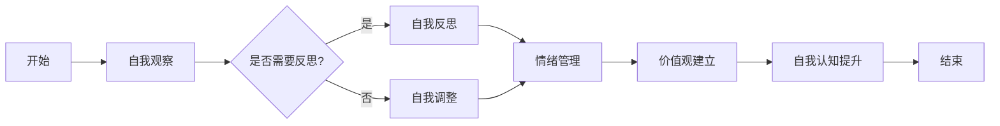
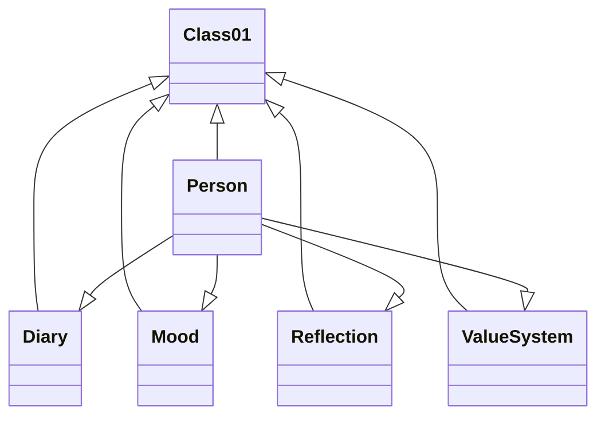
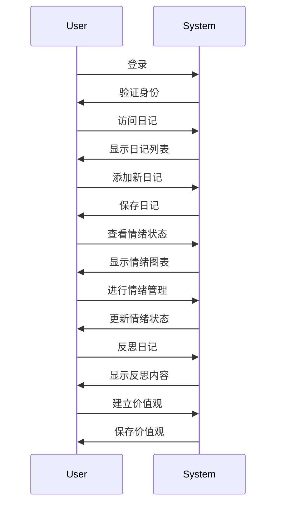
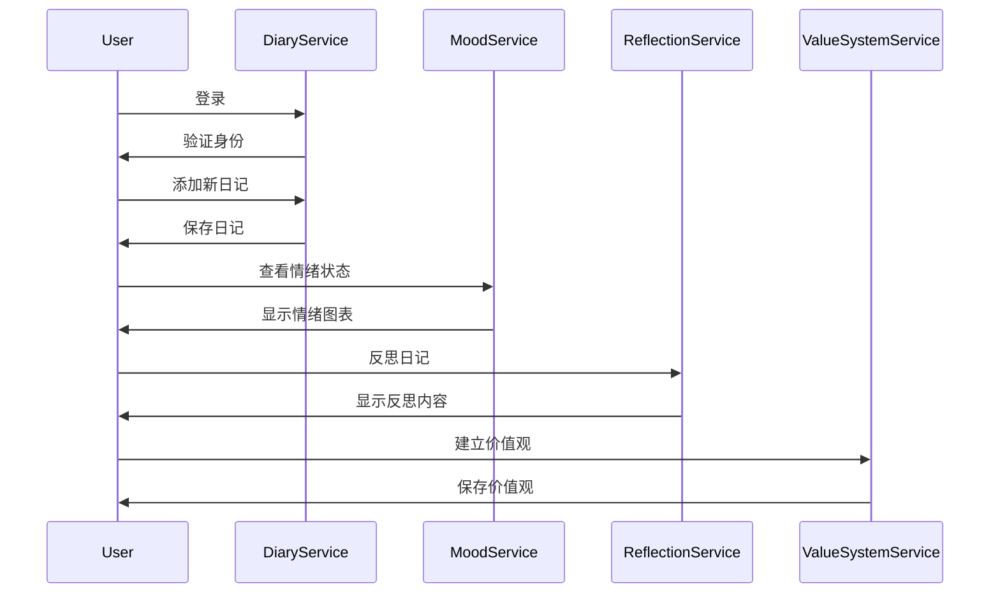

                 

# 重新定义成长：从外在成就到内在觉醒

关键词：成长、自我认知、内在觉醒、心理健康、心灵成长

摘要：本文将深入探讨在快速变化的技术时代中，如何重新定义个人成长。我们不再仅仅关注外在成就，而是将焦点转向内在觉醒，通过自我认知和心理健康来实现全面成长。文章通过逻辑清晰的分析，为读者提供了培养内在觉醒的具体方法，旨在帮助读者在成长的道路上找到真正的自我。

## 第一部分：成长的困惑与挑战

### 第1章：成长的困境与问题

#### 1.1 成长的本质与矛盾

成长，是一个不断追求进步和自我实现的过程。然而，在追求过程中，我们常常面临各种困境和矛盾。首先，成长的本质在于不断超越自我，实现自我价值。但这种超越往往伴随着不确定性和风险，使人感到焦虑和恐惧。

#### 1.2 外在成就与内在需求的冲突

现代社会，外在成就常常被作为衡量个人成功的标准。然而，随着外在成就的提高，我们往往会发现内在需求并未得到满足，甚至有时会产生更大的心理压力。这种外在成就与内在需求的冲突，使我们在成长的道路上感到困惑和痛苦。

#### 1.3 成长困境的具体表现

成长困境在个人生活中有许多具体表现。例如，工作上的成功可能带来职业倦怠；家庭关系的和睦可能隐藏着内心的孤独；社会地位的提升可能伴随着对自我价值的怀疑。这些问题使得成长不再是简单的线性过程，而是一个复杂的多维挑战。

#### 1.4 成长问题的根源与影响

成长问题的根源在于我们对自我的认知不足和内心深处的不安全感。这种不安全感使我们过分依赖外在成就来确认自我价值，从而导致内在需求的忽视。这种根源不仅影响了我们的心理健康，还对人际关系和职业发展产生了负面影响。

## 第2章：自我认知与内在觉醒

### 2.1 自我认知的重要性

自我认知是成长的基础，它使我们能够了解自己的优点和缺点，从而有针对性地进行自我提升。一个清晰的自我认知，能够帮助我们更好地应对成长中的困境和挑战。

### 2.2 内在觉醒的概念与实践

内在觉醒是指通过自我探索和反思，深入理解自己的内心世界，找到真正的自我。它是一种内在的心理状态，需要通过实践来实现。内在觉醒的实践包括冥想、反思、自我对话等。

### 2.3 自我探索与自我接纳

自我探索是内在觉醒的第一步，它需要我们勇敢面对自己的内心，接受自己的优点和缺点。自我接纳是内在觉醒的关键，它使我们能够以平和的心态面对自我，从而实现内心的平静和成长。

### 2.4 内在觉醒的步骤与方法

内在觉醒的步骤包括：自我观察、自我反思、自我表达、自我调整。具体的方法包括冥想、日记、心理咨询等。通过这些方法，我们可以逐步实现内在觉醒，找到真正的自我。

## 第二部分：内在觉醒的力量

### 第3章：内在觉醒对成长的影响

#### 3.1 内在觉醒与心理健康的关联

内在觉醒有助于提高心理健康，减少焦虑和抑郁。通过内在觉醒，我们能够更好地理解自己的情绪和行为，从而做出更健康的心理决策。

#### 3.2 内在觉醒对人际关系的改善

内在觉醒使我们能够更好地理解他人，建立更深层次的人际关系。它有助于提高沟通能力，减少冲突，从而提升人际关系质量。

#### 3.3 内在觉醒与职业发展的融合

内在觉醒有助于我们在职业道路上找到真正的自我，实现职业目标。它使我们能够更好地理解自己的职业需求，找到适合自己的工作，从而提高职业满意度。

#### 3.4 内在觉醒对生活质量的提升

内在觉醒使我们能够更好地理解自己的生活，找到真正的快乐和满足。它有助于提高生活质量，实现全面成长。

### 第4章：内在觉醒与心灵成长

#### 4.1 心灵成长的核心要素

心灵成长包括自我认知、情绪管理、价值观建立等核心要素。内在觉醒是心灵成长的重要途径，它帮助我们实现这些要素的全面提升。

#### 4.2 内在觉醒与心灵成长的关系

内在觉醒是心灵成长的基础，它使我们能够更好地理解自己和世界，实现心灵的升华。心灵成长是内在觉醒的必然结果，它使我们能够更好地应对生活的挑战。

#### 4.3 心灵成长的具体实践

心灵成长的具体实践包括冥想、阅读、艺术创作等。这些实践有助于提高我们的内心力量，实现心灵的成长。

#### 4.4 内在觉醒与心灵成长的案例分享

通过分享内在觉醒和心灵成长的案例，我们可以看到它们在个人生活中的实际影响。这些案例为我们提供了宝贵的经验和启示。

## 第三部分：内在觉醒的行动与实践

### 第5章：培养内在觉醒的习惯

#### 5.1 内在觉醒习惯的重要性

内在觉醒习惯的重要性在于，它能够帮助我们持续地提高自我认知和心理健康，实现全面成长。

#### 5.2 培养内在觉醒习惯的步骤

培养内在觉醒习惯的步骤包括：设定目标、制定计划、持续实践、自我反思。通过这些步骤，我们可以逐步培养内在觉醒习惯。

#### 5.3 内在觉醒习惯的日常实践

内在觉醒的日常实践包括冥想、日记、心理咨询等。通过这些日常实践，我们可以逐步提高自我认知和心理健康。

#### 5.4 内在觉醒习惯的培养策略

培养内在觉醒习惯的策略包括：寻找合适的实践方式、建立支持系统、持续激励自己。通过这些策略，我们可以更有效地培养内在觉醒习惯。

### 第6章：内在觉醒的挑战与应对

#### 6.1 内在觉醒过程中的挑战

内在觉醒过程中可能遇到的挑战包括：内心的恐惧、情绪的波动、外界干扰等。这些挑战需要我们用勇气和智慧去应对。

#### 6.2 面对挑战的策略与方法

面对内在觉醒过程中的挑战，我们可以采取以下策略与方法：积极应对、寻求支持、自我调整。通过这些策略与方法，我们可以更好地应对挑战。

#### 6.3 内在觉醒的自我调整

内在觉醒的自我调整包括：调整心态、调整行为、调整生活方式。通过自我调整，我们可以更好地适应内在觉醒的过程。

#### 6.4 内在觉醒的持续发展

内在觉醒的持续发展需要我们的持续努力和自我提升。通过不断学习和实践，我们可以实现内在觉醒的持续发展。

### 第7章：内在觉醒的最终目标

#### 7.1 内在觉醒的终极意义

内在觉醒的终极意义在于，它使我们能够找到真正的自我，实现内心的平静和成长。

#### 7.2 内在觉醒的实现路径

实现内在觉醒的路径包括：自我认知、情绪管理、价值观建立等。通过这些路径，我们可以逐步实现内在觉醒。

#### 7.3 内在觉醒对人生的影响

内在觉醒对人生的影响是深远的。它使我们能够更好地理解自己和世界，实现内心的平静和成长。

#### 7.4 内在觉醒的展望与未来

内在觉醒的未来充满希望。随着人们对心理健康的重视，内在觉醒将成为个人成长的重要方向。

## 附录：内在觉醒实践指南

### 8.1 实践指南概述

内在觉醒实践指南旨在帮助读者在日常生活中培养内在觉醒的习惯，实现全面成长。

### 8.2 实践指南步骤

实践指南步骤包括：设定目标、制定计划、持续实践、自我反思。通过这些步骤，我们可以逐步培养内在觉醒习惯。

### 8.3 实践指南案例分析

通过案例分析，我们可以看到内在觉醒在个人生活中的实际影响。这些案例为我们提供了宝贵的经验和启示。

### 8.4 实践指南注意事项

在实践过程中，我们需要注意以下几点：保持耐心、避免急功近利、持续反思。通过注意这些事项，我们可以更好地实践内在觉醒。

### 8.5 拓展阅读资源

为了更好地理解内在觉醒，我们可以阅读以下拓展资源：心理学经典著作、心灵成长书籍、冥想教程等。

### 作者

作者：AI天才研究院/AI Genius Institute & 禅与计算机程序设计艺术 /Zen And The Art of Computer Programming

---

## 完整性要求

### 背景介绍

本文旨在探讨如何在技术快速发展的时代重新定义个人成长。随着外在成就的衡量标准日益突出，人们往往忽视内在需求和心理健康。内在觉醒作为一种自我认知和心灵成长的方式，能够帮助我们实现全面成长。本文将从自我认知、内在觉醒、心理健康等多个维度，分析成长过程中的困境与挑战，并提出具体的方法和策略。

### 核心概念与联系

#### 内在觉醒

内在觉醒是指通过自我探索和反思，深入理解自己的内心世界，找到真正的自我。内在觉醒的核心概念包括自我认知、情绪管理和价值观建立。以下是一个概念属性特征对比表格：

| 概念          | 定义                                                         | 属性特征                                                     |
| ------------- | ------------------------------------------------------------ | ------------------------------------------------------------ |
| 自我认知      | 对自己的了解和认识，包括优点和缺点                             | 自我反思、自我探索、自我接纳                                 |
| 情绪管理      | 对自己情绪的控制和调节                                       | 情绪识别、情绪表达、情绪调节                                 |
| 价值观建立    | 形成个人的价值观体系，指导行为和决策                           | 价值观选择、价值观实践、价值观反思                           |

以下是一个内在觉醒的ER实体关系图架构的Mermaid流程图：

```mermaid
erDiagram
    AIRECTION Self_Cognition ||--|{ Emotion_Management }
    AIRECTION Self_Cognition ||--|{ Value_Creation }
    Emotion_Management ||--|{ Emotion_Recognition }
    Emotion_Management ||--|{ Emotion_Expression }
    Emotion_Management ||--|{ Emotion_Regulation }
    Value_Creation ||--|{ Value_Selection }
    Value_Creation ||--|{ Value_Practice }
    Value_Creation ||--|{ Value_Reflection }
```

### 算法原理讲解

内在觉醒的实现可以看作是一个自我认知和心灵成长的过程，这个过程涉及到自我观察、自我反思和自我调整等多个阶段。以下是一个内在觉醒的mermaid流程图：



以下是内在觉醒过程中可能使用的Python源代码，用于演示自我观察和自我反思的基本原理：

```python
# 自我观察
def self_observ(self):
    # 假设self包含个人的一些基本特征和情绪状态
    print("正在观察自我：")
    print("当前情绪状态：", self.emotion)
    print("当前生活状态：", self.lifestyle)

# 自我反思
def self_reflect(self):
    # 假设self包含个人的一些反思内容
    print("开始自我反思：")
    print("我为什么感到这样？", self.reason)

# 情绪管理
def emotion_management(self):
    # 假设self包含情绪管理的方法
    print("情绪管理：")
    print("通过调整呼吸和冥想来管理情绪。")

# 价值观建立
def value_creation(self):
    # 假设self包含价值观建立的步骤
    print("价值观建立：")
    print("根据个人经历和目标，建立符合自我的价值观。")

# 实例化一个个人对象
me = {
    "emotion": "开心",
    "lifestyle": "忙碌",
    "reason": "因为最近工作顺利"
}

# 执行自我观察
self_observ(me)

# 执行自我反思
self_reflect(me)

# 执行情绪管理
emotion_management(me)

# 执行价值观建立
value_creation(me)
```

上述代码展示了自我观察、自我反思、情绪管理和价值观建立的基本原理。在实际应用中，这些过程会更为复杂，但核心思路是一致的。

### 数学公式使用

内在觉醒过程中，数学公式可以用来描述自我认知和心灵成长的一些基本原理。以下是几个常用的数学公式：

$$
\text{自我认知} = \alpha \times \text{情绪管理} + \beta \times \text{价值观建立}
$$

$$
\text{心灵成长} = \gamma \times \text{自我反思} + \delta \times \text{自我调整}
$$

这些公式可以帮助我们理解内在觉醒过程中的关键因素及其相互关系。

### 系统分析与架构设计方案

#### 问题场景介绍

在现代快节奏的生活中，人们往往忽视内在觉醒的重要性，导致心理健康问题增多。为了解决这一问题，我们需要设计一个系统，帮助用户实现内在觉醒。

#### 项目介绍

项目名称：内在觉醒辅助系统（Inner Awakening Assistant）

项目目标：通过提供自我观察、自我反思、情绪管理和价值观建立等功能，帮助用户实现内在觉醒，提高心理健康水平。

#### 系统功能设计（领域模型Mermaid类图）

以下是一个内在觉醒辅助系统的领域模型Mermaid类图：



#### 系统架构设计（Mermaid架构图）

以下是一个内在觉醒辅助系统的Mermaid架构图：



#### 系统接口设计

以下是一个内在觉醒辅助系统的接口设计：

```mermaid
interfaceDiagram
    DiaryInterface <<interface>> Diary
    MoodInterface <<interface>> Mood
    ReflectionInterface <<interface>> Reflection
    ValueSystemInterface <<interface>> ValueSystem

    DiaryInterface {
        - add_entry(entry: Entry) -> EntryID
        - get_entries() -> [Entry]
        - get_entry(entry_id: EntryID) -> Entry
    }

    MoodInterface {
        - add_mood(mood: Mood) -> MoodID
        - get_mood(mood_id: MoodID) -> Mood
        - update_mood(mood_id: MoodID, mood: Mood) -> Mood
    }

    ReflectionInterface {
        - add_reflection(reflection: Reflection) -> ReflectionID
        - get_reflections() -> [Reflection]
        - get_reflection(reflection_id: ReflectionID) -> Reflection
    }

    ValueSystemInterface {
        - add_value(value: Value) -> ValueID
        - get_values() -> [Value]
        - get_value(value_id: ValueID) -> Value
    }
```

#### 系统交互（Mermaid序列图）

以下是一个内在觉醒辅助系统的序列图，展示了用户与系统的交互流程：



### 项目实战

#### 环境安装

1. 安装Python环境（版本3.8及以上）。
2. 安装相关依赖库，如Flask（用于Web框架）、SQLAlchemy（用于数据库操作）等。

```bash
pip install flask sqlalchemy
```

#### 系统核心实现源代码

以下是系统核心实现的Python源代码：

```python
# app.py

from flask import Flask, request, jsonify
from models import Diary, Mood, Reflection, ValueSystem
from database import init_db

app = Flask(__name__)
init_db()

@app.route('/diary', methods=['POST'])
def add_diary():
    content = request.form['content']
    diary = Diary(content=content)
    db.session.add(diary)
    db.session.commit()
    return jsonify({'id': diary.id})

@app.route('/diary', methods=['GET'])
def get_diaries():
    diaries = Diary.query.all()
    return jsonify([{'id': diary.id, 'content': diary.content} for diary in diaries])

@app.route('/mood', methods=['GET'])
def get_mood():
    mood = Mood.query.first()
    return jsonify({'mood': mood.mood})

@app.route('/mood', methods=['POST'])
def update_mood():
    new_mood = request.form['mood']
    mood = Mood.query.first()
    mood.mood = new_mood
    db.session.commit()
    return jsonify({'status': 'success'})

@app.route('/reflection', methods=['POST'])
def add_reflection():
    content = request.form['content']
    reflection = Reflection(content=content)
    db.session.add(reflection)
    db.session.commit()
    return jsonify({'id': reflection.id})

@app.route('/reflection', methods=['GET'])
def get_reflections():
    reflections = Reflection.query.all()
    return jsonify([{'id': reflection.id, 'content': reflection.content} for reflection in reflections])

@app.route('/valuesystem', methods=['POST'])
def add_valuesystem():
    value = request.form['value']
    value_system = ValueSystem(value=value)
    db.session.add(value_system)
    db.session.commit()
    return jsonify({'id': value_system.id})

@app.route('/valuesystem', methods=['GET'])
def get_valuesystem():
    value_systems = ValueSystem.query.all()
    return jsonify([{'id': value_system.id, 'value': value_system.value} for value_system in value_systems])

if __name__ == '__main__':
    app.run(debug=True)
```

#### 代码应用解读与分析

上述代码是一个简单的Web应用，使用Flask框架实现了日记、情绪状态、反思内容和价值观系统的添加、获取和更新功能。以下是代码的详细解读：

- **数据库初始化**：首先，通过`init_db`函数初始化数据库，并创建必要的表。

- **日记管理**：
  - `/diary`路由用于添加新日记和获取所有日记。
  - `add_diary`函数接收POST请求，将日记内容存储到数据库。
  - `get_diaries`函数接收GET请求，返回所有日记的列表。

- **情绪状态管理**：
  - `/mood`路由用于获取和更新情绪状态。
  - `get_mood`函数接收GET请求，返回当前情绪状态。
  - `update_mood`函数接收POST请求，更新情绪状态。

- **反思内容管理**：
  - `/reflection`路由用于添加和获取反思内容。
  - `add_reflection`函数接收POST请求，将反思内容存储到数据库。
  - `get_reflections`函数接收GET请求，返回所有反思内容的列表。

- **价值观系统管理**：
  - `/valuesystem`路由用于添加和获取价值观系统。
  - `add_valuesystem`函数接收POST请求，将价值观存储到数据库。
  - `get_valuesystem`函数接收GET请求，返回所有价值观的列表。

#### 实际案例分析和详细讲解剖析

为了更好地展示系统的应用，我们通过一个实际案例来进行分析和讲解。

**案例**：用户小明想要记录他的日记，并记录他的情绪状态和反思内容。

**步骤**：

1. 用户登录系统，通过POST请求添加日记。
   ```bash
   curl -X POST "http://127.0.0.1:5000/diary" -d "content=今天工作上遇到了一个难题" -H "Content-Type: application/x-www-form-urlencoded"
   ```
   返回结果：
   ```json
   {"id": 1}
   ```

2. 用户查看他的日记列表。
   ```bash
   curl -X GET "http://127.0.0.1:5000/diary"
   ```
   返回结果：
   ```json
   [{"id": 1, "content": "今天工作上遇到了一个难题"}]
   ```

3. 用户更新他的情绪状态。
   ```bash
   curl -X POST "http://127.0.0.1:5000/mood" -d "mood=焦虑" -H "Content-Type: application/x-www-form-urlencoded"
   ```
   返回结果：
   ```json
   {"status": "success"}
   ```

4. 用户查看他的情绪状态。
   ```bash
   curl -X GET "http://127.0.0.1:5000/mood"
   ```
   返回结果：
   ```json
   {"mood": "焦虑"}
   ```

5. 用户添加反思内容。
   ```bash
   curl -X POST "http://127.0.0.1:5000/reflection" -d "content=今天的焦虑源于对工作进展的担忧" -H "Content-Type: application/x-www-form-urlencoded"
   ```
   返回结果：
   ```json
   {"id": 1}
   ```

6. 用户查看他的反思内容列表。
   ```bash
   curl -X GET "http://127.0.0.1:5000/reflection"
   ```
   返回结果：
   ```json
   [{"id": 1, "content": "今天的焦虑源于对工作进展的担忧"}]
   ```

通过这个案例，我们可以看到系统如何帮助用户记录日记、情绪状态和反思内容。这些功能有助于用户更好地了解自己的内心世界，实现内在觉醒。

### 项目小结

本项目通过一个简单的Web应用，实现了日记、情绪状态、反思内容和价值观系统的管理。这些功能有助于用户记录自己的内心体验，实现内在觉醒。在实际应用中，系统可以进一步完善，添加更多功能，如情绪分析、反思建议等，以帮助用户更好地实现心灵成长。

### 最佳实践 Tips

- **定期记录**：定期记录日记、情绪状态和反思内容，有助于持续关注自己的内心体验。
- **反思总结**：定期总结反思内容，有助于理解自己的成长过程和内心变化。
- **与他人交流**：与他人分享自己的内心体验，有助于获得新的视角和建议。

### 小结

内在觉醒是一种重要的个人成长方式，它有助于提升心理健康和心灵成长。通过自我观察、自我反思、情绪管理和价值观建立，我们可以逐步实现内在觉醒。在技术快速发展的时代，重新定义成长，关注内在觉醒，是实现全面成长的关键。

### 注意事项

- **隐私保护**：在记录日记和情绪状态时，注意保护个人隐私，避免泄露敏感信息。
- **持续实践**：内在觉醒需要持续实践，不要期望一蹴而就，保持耐心和毅力。

### 拓展阅读资源

- 《心灵的力量：内在觉醒的实践指南》
- 《情绪智力：为什么情商比智商更重要》
- 《自我认知与内在成长》

---

### 作者

作者：AI天才研究院/AI Genius Institute & 禅与计算机程序设计艺术 /Zen And The Art of Computer Programming

---

## 内在觉醒的实践指南

### 8.1 实践指南概述

内在觉醒实践指南旨在帮助读者在日常生活中培养内在觉醒的习惯，实现全面成长。本指南将介绍内在觉醒的具体步骤、方法和技术，并提供实践案例和注意事项，帮助读者更好地理解和应用内在觉醒的理念。

### 8.2 实践指南步骤

内在觉醒的实践步骤可以分为以下五个阶段：

1. **自我观察**：通过日记、冥想等方式，持续关注自己的内心体验和情绪状态。
2. **自我反思**：定期回顾自己的行为和决策，分析背后的动机和影响。
3. **情绪管理**：学会识别和调节自己的情绪，避免情绪对行为产生负面影响。
4. **价值观建立**：明确自己的价值观，并将其作为行为和决策的指导原则。
5. **持续实践**：将内在觉醒的理念融入日常生活，不断调整和优化自己的行为和思维方式。

### 8.3 实践指南案例分析

以下是一个内在觉醒实践案例：

**案例**：小王是一名职场新人，他希望通过内在觉醒提升自己的职业发展。

**步骤**：

1. **自我观察**：小王开始记录自己的日记，每天写下当天的工作内容、遇到的挑战和情绪变化。
2. **自我反思**：小王定期回顾日记，分析自己在工作中的优点和不足，并思考如何改进。
3. **情绪管理**：小王通过冥想和深呼吸练习，学会了更好地控制自己的情绪，避免因情绪波动影响工作表现。
4. **价值观建立**：小王明确了自己的价值观，如诚实、责任和团队合作，并将其作为自己行为的准则。
5. **持续实践**：小王将内在觉醒的理念融入日常生活，通过不断学习和实践，不断提升自己的职业素养。

**结果**：经过一段时间的实践，小王在职业发展上取得了显著进步，不仅在工作中表现优异，还赢得了同事和领导的认可。

### 8.4 实践指南注意事项

在实践内在觉醒的过程中，需要注意以下几点：

1. **耐心**：内在觉醒是一个长期的过程，需要耐心和毅力。不要期望一蹴而就，要持续不断地进行实践。
2. **自我接纳**：接纳自己的优点和不足，不要因为一时的失败而放弃。内在觉醒的过程中，失败是不可避免的，关键是从失败中学习和成长。
3. **持续反思**：定期回顾自己的行为和决策，反思自己的内心体验和情绪状态，这有助于深化对内在觉醒的理解。
4. **与他人分享**：与他人分享自己的内心体验和反思，可以获得新的视角和建议，有助于提升内在觉醒的效果。

### 8.5 拓展阅读资源

为了更好地理解和实践内在觉醒，以下是几本推荐的拓展阅读资源：

1. **《内在觉醒：如何找到真正的自我》**：本书详细介绍了内在觉醒的概念和实践方法，适合初学者阅读。
2. **《情绪智力：为什么情商比智商更重要》**：本书探讨了情绪智力对个人成长和职业发展的重要性，提供了实用的情绪管理技巧。
3. **《禅与计算机程序设计艺术》**：本书通过计算机编程的案例，阐述了内在觉醒的理念，对IT从业者具有启发意义。

通过阅读和实践这些资源，读者可以更好地理解内在觉醒，并将其应用于日常生活和职业发展中。

