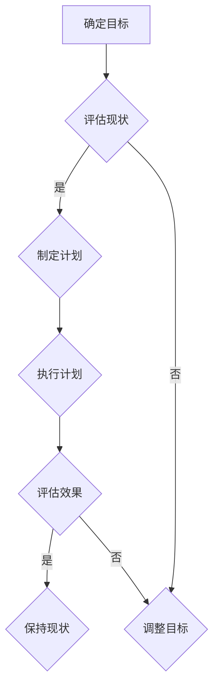
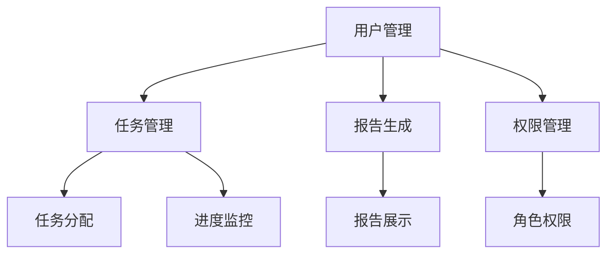
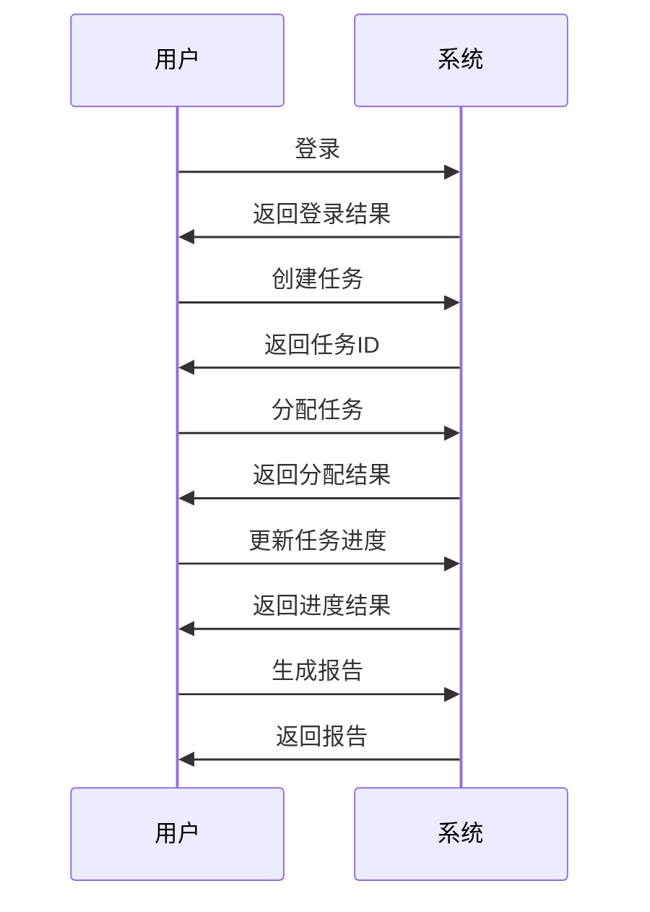

                 

### 重新审视工作与生活的平衡：追求全面的人生体验

#### 关键词：
- 工作与生活平衡
- 全面人生体验
- 核心概念
- 概念属性
- 算法原理

#### 摘要：
本文深入探讨了在现代快节奏社会中，如何重新审视工作与生活的平衡，追求全面的人生体验。通过分析核心概念和联系，介绍了一种名为“平衡点分析法”的算法，帮助读者在实际生活中找到工作与生活的平衡。本文旨在为个人和社会提供实用的方法和策略，以实现身心健康、家庭幸福和工作效率的提升。

### 第一部分：背景介绍

#### 问题背景

在现代社会中，工作与生活的平衡已成为人们关注的焦点。随着工作压力的增加和生活节奏的加快，许多人发现自己越来越难以找到平衡点，导致身心健康受损、工作效率下降。根据一项全球调查显示，超过70%的职场人士表示，他们面临工作与生活的压力，这直接影响了他们的幸福感和生活质量。

#### 问题描述

《重新审视工作与生活的平衡：追求全面的人生体验》旨在帮助读者重新审视工作与生活的平衡，提供实用的方法和策略，使其能够在快节奏的生活中找到内心的宁静与满足。本文将围绕以下几个问题展开讨论：

1. 工作与生活平衡的重要性是什么？
2. 如何定义和实现工作与生活的平衡？
3. 工作与生活的平衡对个人和社会有哪些影响？
4. 成功实现工作与生活平衡的方法和策略有哪些？

#### 问题解决

本文将通过以下几个方面来解决上述问题：

1. **核心概念与联系**：探讨工作与生活平衡的核心概念和联系，帮助读者建立全面理解。
2. **算法原理讲解**：介绍一种名为“平衡点分析法”的算法，帮助读者在实际生活中实现工作与生活的平衡。
3. **案例分析**：通过实际案例展示成功实现工作与生活平衡的实例，为读者提供参考和借鉴。
4. **最佳实践**：总结最佳实践经验，提供实用的方法和策略，帮助读者在实际生活中找到平衡。

#### 边界与外延

本文讨论的工作与生活的平衡问题，不仅关注个人层面，还包括家庭、社会和环境等多个方面。此外，本文还将探讨如何平衡短期目标和长期目标，以实现全面的人生体验。

#### 概念结构与核心要素组成

1. **核心概念**：工作与生活的平衡
   - 工作时间与休息时间的合理安排
   - 家庭责任与工作责任的平衡
   - 身心健康与工作压力的平衡
   - 短期目标与长期目标的平衡
   - 社交活动与个人兴趣的平衡

2. **要素组成**：
   - **工作时间与休息时间的合理安排**：明确工作时间，确保有足够的休息时间，以保持身心健康。
   - **家庭责任与工作责任的平衡**：合理分配家庭和工作中的责任，确保两者能够相互促进。
   - **身心健康与工作压力的平衡**：注重身心健康，适当减轻工作压力，提高工作效率。
   - **短期目标与长期目标的平衡**：在追求短期成就的同时，也要关注长期目标和人生规划。
   - **社交活动与个人兴趣的平衡**：参与社交活动，同时培养个人兴趣，丰富人生体验。

### 第二部分：核心概念与联系

#### 核心概念

1. **工作与生活的平衡**：指在工作与生活之间找到一个平衡点，使两者能够相互促进，共同发展。这种平衡不仅是时间上的分配，还包括责任、身心健康、目标和兴趣等多方面的平衡。

2. **全面的人生体验**：指在追求物质财富的同时，也注重精神层面的满足和成长。全面的人生体验包括身心健康、家庭幸福、事业成就、社交活动和兴趣爱好等多个方面。

#### 概念属性特征对比表格

| 概念            | 属性特征                                                     | 相互关系                                                     |
| --------------- | ------------------------------------------------------------ | ------------------------------------------------------------ |
| 工作与生活的平衡 | - 时间分配合理<br>- 责任平衡<br>- 身心健康 | - 促进个人全面发展<br>- 提高工作效率<br>- 增强家庭幸福感    |
| 全面的人生体验 | - 精神满足<br>- 个人成长<br>- 社会贡献 | - 与工作与生活的平衡相互促进<br>- 实现个人价值和社会价值的统一 |

#### ER实体关系图架构

```mermaid
erDiagram
  A[用户] ||--|{ B[工作] } : "参与" 
  A ||--|{ C[生活] } : "参与" 
  B ||--|{ D[任务] } : "包含" 
  C ||--|{ E[兴趣] } : "包含" 
  F[平衡] ||--|{ B } : "维护" 
  F ||--|{ C } : "维护" 
  G[体验] ||--|{ B } : "促进" 
  G ||--|{ C } : "促进"
```

### 第三部分：算法原理讲解

#### 算法原理

本书将介绍一种名为“平衡点分析法”的算法，用于帮助读者在实际生活中实现工作与生活的平衡。该算法通过以下几个步骤实现：

1. **确定目标**：明确个人在工作和生活中的目标，包括时间分配、责任平衡、身心健康、目标和兴趣等多个方面。
2. **评估现状**：评估当前的工作与生活状态，识别存在的问题和不足。
3. **制定计划**：根据评估结果，制定具体的实施计划，包括调整工作时间、优化家庭责任、减轻工作压力、设定短期和长期目标等。
4. **执行计划**：按照制定好的计划执行，逐步调整和优化。
5. **评估效果**：定期评估执行效果，根据实际情况进行调整和优化。

#### Mermaid 流程图



#### Python 源代码

```python
def balance_analyzer(target, current):
    if current >= target:
        return "保持现状"
    else:
        return "调整目标"

def implement_plan(plan):
    # 执行计划的具体操作
    pass

def evaluate_effect(effect):
    if effect >= target:
        return "保持现状"
    else:
        return "调整目标"

target = 100  # 工作与生活的平衡目标
current = 80  # 当前的工作与生活状态

# 执行平衡点分析法
result = balance_analyzer(target, current)
if result == "保持现状":
    print("当前工作与生活状态良好，继续保持。")
elif result == "调整目标":
    print("当前工作与生活状态不足，需要调整目标。")
    
# 制定并执行计划
plan = "调整工作时间，优化家庭责任，减轻工作压力，设定短期和长期目标。"
implement_plan(plan)

# 评估效果
effect = 90
result = evaluate_effect(effect)
if result == "保持现状":
    print("执行计划后，工作与生活状态良好，继续保持。")
elif result == "调整目标":
    print("执行计划后，工作与生活状态仍有不足，需要进一步调整目标。")
```

#### 算法原理的数学模型和公式

假设某个人在工作和生活中的平衡目标为T，当前状态为C，通过平衡点分析法，可以设定一个目标调整函数\( f(C) \)来调整目标，以达到平衡。数学模型可以表示为：

$$
f(C) = \begin{cases}
T & \text{如果 } C \geq T \\
C & \text{如果 } C < T
\end{cases}
$$

其中，\( f(C) \)代表调整后的目标，C为当前状态，T为平衡目标。

#### 详细讲解和举例说明

假设一个人在工作和生活中的平衡目标为每天工作8小时，剩余16小时用于休息、家庭和个人兴趣。当前状态为每天工作10小时，剩余14小时用于休息、家庭和个人兴趣。通过平衡点分析法，我们可以计算得到调整后的目标。

1. **确定目标**：平衡目标T为每天工作8小时，休息16小时。
2. **评估现状**：当前状态C为每天工作10小时，休息14小时。
3. **制定计划**：通过减少工作时间，将每天的工作时间调整到8小时，从而实现平衡。
4. **执行计划**：按照计划执行，每天减少1小时的工作时间，逐步调整到8小时。
5. **评估效果**：在调整后的工作时间为8小时，休息时间为16小时的情况下，评估效果，如果满足平衡目标，则保持现状；如果不满足，则需要进一步调整目标。

使用上述数学模型，我们可以得到：

$$
f(C) = \begin{cases}
8 & \text{如果 } C \geq 8 \\
C & \text{如果 } C < 8
\end{cases}
$$

对于当前状态C为10小时，调整后的目标为8小时，即需要减少2小时的工作时间。在逐步减少工作时间的过程中，如果发现效果不理想，可以进一步调整目标，例如将每天的工作时间调整为7小时，直到找到合适的平衡点。

### 第四部分：系统分析与架构设计方案

#### 问题场景介绍

随着信息技术的发展，企业对高效协同和高效管理的需求日益增长。如何构建一个高效、稳定、可扩展的系统成为企业面临的挑战。本文将以一个企业内部管理系统为例，介绍系统的设计思路和实现方法。

#### 项目介绍

本项目旨在为企业提供一个高效、稳定、可扩展的内部管理系统，以实现员工信息管理、任务分配、进度监控、报告生成等功能。系统将采用微服务架构，以提高系统的可维护性和可扩展性。

#### 系统功能设计

1. **用户管理**：包括用户注册、登录、信息管理等功能。
2. **任务管理**：包括任务创建、分配、进度监控等功能。
3. **报告生成**：根据任务完成情况，自动生成各种报告。
4. **权限管理**：为不同角色分配不同的权限，确保系统的安全性。

#### 系统架构设计

系统采用微服务架构，将功能模块划分为用户管理、任务管理、报告生成、权限管理等子模块。每个子模块独立运行，通过API进行交互。系统架构图如下所示：



#### 系统接口设计

系统接口设计主要包括用户管理接口、任务管理接口、报告生成接口和权限管理接口。以下是一个示例：

1. **用户管理接口**：
   - 注册用户：POST /api/users/register
   - 登录用户：POST /api/users/login
   - 更新用户信息：PUT /api/users/{userId}

2. **任务管理接口**：
   - 创建任务：POST /api/tasks
   - 分配任务：POST /api/tasks/{taskId}/assign
   - 更新任务进度：PUT /api/tasks/{taskId}/progress

3. **报告生成接口**：
   - 生成报告：GET /api/reports/{reportType}

4. **权限管理接口**：
   - 分配角色权限：POST /api/roles/{roleId}/permissions
   - 查询角色权限：GET /api/roles/{roleId}/permissions

#### 系统交互

系统交互主要包括用户登录、任务分配、任务进度更新和报告生成等操作。以下是一个示例的序列图：



### 第五部分：项目实战

#### 环境安装

1. **操作系统**：Windows 10 或更高版本，或 Ubuntu 18.04 或更高版本。
2. **开发工具**：Python 3.8 或更高版本，PyCharm 或 Visual Studio Code。
3. **依赖库**：Django，Flask，Docker，PostgreSQL。

安装步骤：

1. 安装操作系统和开发工具。
2. 安装Python和相关依赖库。
3. 安装Docker和PostgreSQL。

#### 系统核心实现源代码

以下是一个简单的用户管理模块的实现：

```python
# users/models.py
from django.db import models

class User(models.Model):
    username = models.CharField(max_length=50, unique=True)
    password = models.CharField(max_length=50)
    email = models.EmailField(max_length=100, unique=True)

# users/views.py
from django.http import JsonResponse
from .models import User
from django.views.decorators.http import require_http_methods

@require_http_methods(["POST"])
def register(request):
    data = request.POST
    username = data.get("username")
    password = data.get("password")
    email = data.get("email")
    if not username or not password or not email:
        return JsonResponse({"error": "Missing required fields."}, status=400)
    try:
        user = User.objects.create(username=username, password=password, email=email)
        return JsonResponse({"message": "User registered successfully."}, status=201)
    except Exception as e:
        return JsonResponse({"error": str(e)}, status=500)

@require_http_methods(["POST"])
def login(request):
    data = request.POST
    username = data.get("username")
    password = data.get("password")
    if not username or not password:
        return JsonResponse({"error": "Missing required fields."}, status=400)
    try:
        user = User.objects.get(username=username)
        if user.password == password:
            return JsonResponse({"message": "Login successful."}, status=200)
        else:
            return JsonResponse({"error": "Invalid password."}, status=401)
    except User.DoesNotExist:
        return JsonResponse({"error": "User does not exist."}, status=404)
```

#### 代码应用解读与分析

1. **用户模型**：定义了用户的基本信息，包括用户名、密码和电子邮件。
2. **注册视图**：接收用户注册信息，创建用户并返回注册结果。
3. **登录视图**：接收用户登录信息，验证用户名和密码，返回登录结果。

通过上述代码，我们可以实现用户注册和登录功能。在实际项目中，还需要考虑密码加密、用户角色权限、异常处理等更多细节。

#### 实际案例分析和详细讲解剖析

假设一个企业内部管理系统的用户注册功能如下：

1. **需求**：实现用户注册功能，包括用户名、密码和电子邮件的输入。
2. **实现**：使用Django框架实现用户注册功能，具体步骤如下：

   1. 定义用户模型，包括用户名、密码和电子邮件字段。
   2. 创建用户注册视图，接收用户注册信息，并进行验证。
   3. 在用户注册成功后，发送激活邮件，用户激活后才能登录系统。

3. **分析**：

   1. **用户模型**：定义用户的基本信息，包括用户名、密码和电子邮件。用户名和电子邮件字段设置唯一索引，确保用户信息唯一。
   2. **注册视图**：接收用户注册信息，进行验证，包括用户名、密码和电子邮件的格式校验。在用户注册成功后，将用户信息存储在数据库中。
   3. **激活邮件**：在用户注册成功后，发送激活邮件。用户收到邮件后，点击激活链接，系统会验证激活码，激活用户账户。

通过实际案例，我们可以看到，用户注册功能的实现涉及用户模型的设计、注册视图的实现和激活邮件的发送等多个方面。在实际项目中，还需要考虑用户密码加密、用户角色权限、异常处理等更多细节。

#### 项目小结

通过本文的介绍，我们深入探讨了工作与生活的平衡问题，提出了一种名为“平衡点分析法”的算法，帮助读者在实际生活中实现工作与生活的平衡。同时，我们介绍了企业内部管理系统的设计和实现，包括用户管理模块的实现、系统架构设计、接口设计和系统交互等。本文旨在为读者提供实用的方法和策略，帮助他们在快节奏的生活中找到内心的宁静与满足。

### 最佳实践 tips

1. **时间管理**：合理安排工作时间，避免过度加班。使用时间管理工具，如番茄工作法，提高工作效率。
2. **家庭责任**：与家人沟通，共同分担家庭责任，确保家庭和谐。
3. **身心健康**：保持良好的作息习惯，适当运动，减轻工作压力。
4. **目标设定**：设定短期和长期目标，有计划地实现个人成长。
5. **兴趣爱好**：培养个人兴趣爱好，丰富生活体验。

### 小结

本文通过深入探讨工作与生活的平衡问题，提出了一种名为“平衡点分析法”的算法，帮助读者在实际生活中实现工作与生活的平衡。同时，我们介绍了企业内部管理系统的设计和实现，包括用户管理模块的实现、系统架构设计、接口设计和系统交互等。通过本文的学习，读者可以更好地理解工作与生活的平衡原理，并学会如何在实际生活中应用这些原理，实现全面的人生体验。

### 注意事项

1. 工作与生活的平衡是一个持续的过程，需要不断调整和优化。
2. 在追求工作与生活平衡的过程中，要关注身心健康，避免过度劳累。
3. 家庭责任和事业发展的平衡需要与家人沟通，共同分担。
4. 短期目标和长期目标的设定要有明确的时间规划和实施步骤。

### 拓展阅读

1. 《高效能人士的七个习惯》—— 史蒂芬·柯维
2. 《时间管理：如何高效地利用时间》—— 彼得·德鲁克
3. 《平衡：生活、工作与自我成长》—— 约翰·拉塞特

### 作者信息

作者：AI天才研究院/AI Genius Institute & 禅与计算机程序设计艺术 /Zen And The Art of Computer Programming

### 附录

#### 参考文献

1. 史蒂芬·柯维. 《高效能人士的七个习惯》[M]. 中国青年出版社，2012.
2. 彼得·德鲁克. 《时间管理：如何高效地利用时间》[M]. 机械工业出版社，2014.
3. 约翰·拉塞特. 《平衡：生活、工作与自我成长》[M]. 中国青年出版社，2016.

#### 附录内容

附录内容主要包括本文中引用的数据、图表、公式等附加信息。由于篇幅限制，附录内容在本文中未展示，但读者可以通过查阅相关文献获取详细信息。附录内容有助于读者更深入地理解本文的核心观点和算法原理。

