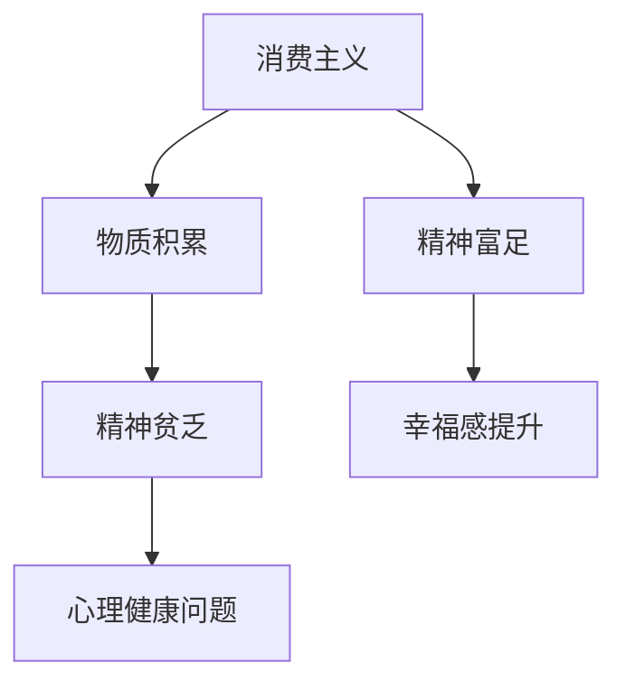
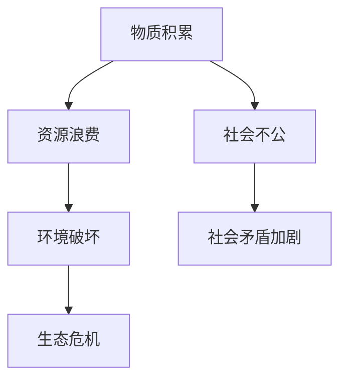
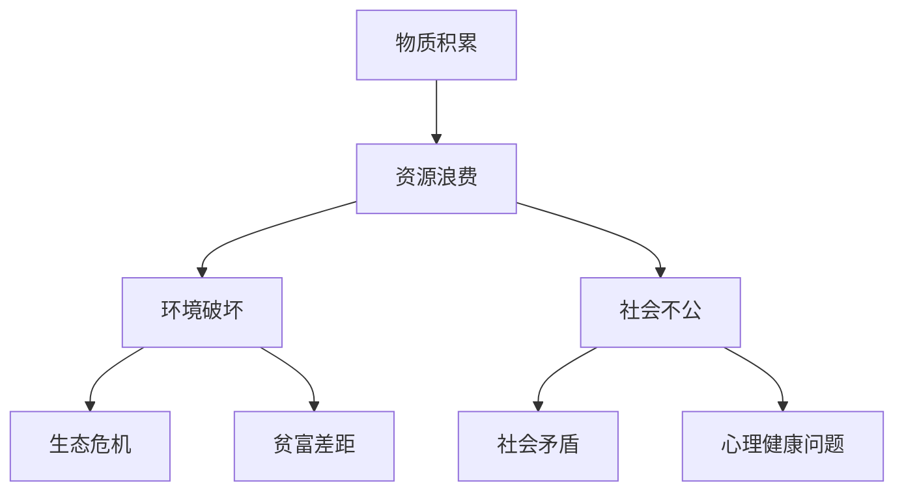
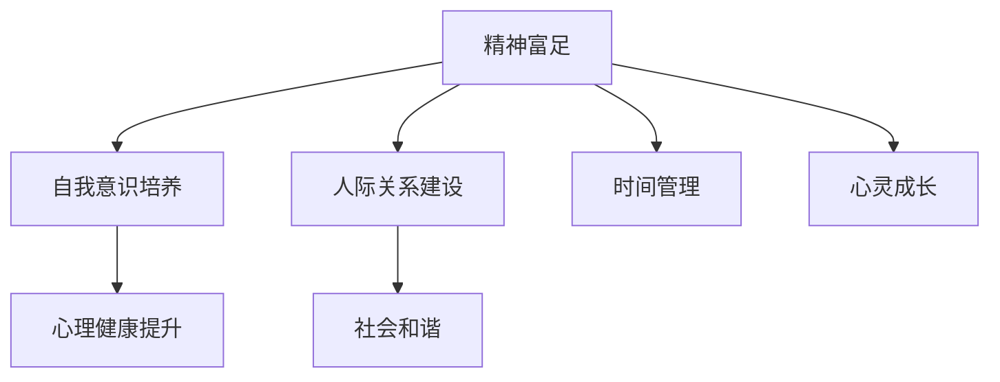

                 

# 重新审视消费主义：从物质积累到精神富足的转变

> 关键词：消费主义、精神富足、物质积累、心理影响、环境破坏

> 摘要：本文旨在重新审视消费主义这一社会现象，探讨其背后的物质积累与精神富足之间的矛盾。通过对消费主义的历史与发展、物质积累的困境以及精神富足的实现路径的深入分析，本文试图为读者提供一种新的视角，引导人们从物质积累转向精神富足，实现个人与社会的全面发展。

## 第一部分：引言

### 1.1 问题背景

#### 1.1.1 消费主义现状

消费主义是一种以物质消费为核心价值观念的社会现象。在当今世界，消费主义已经渗透到人们日常生活的方方面面。从奢侈品到日用品，从线上购物到线下消费，人们似乎无时无刻不在追求物质的满足。然而，这种看似繁荣的消费现象背后，却隐藏着诸多问题。

#### 1.1.2 物质积累的困境

物质积累是消费主义的核心特征。人们追求更多的物质财富，希望通过积累财富来提升自己的社会地位和生活质量。然而，随着物质生活的丰富，人们却发现，物质积累并不能带来真正的幸福和满足。物质过剩导致资源浪费，环境破坏，甚至引发心理疾病和社会问题。

#### 1.1.3 精神富足的探讨

与物质积累相对的是精神富足。精神富足是一种内在的满足感和幸福感，它不仅仅依赖于物质的丰富，更依赖于个人的心理健康和社会关系的和谐。本文将探讨如何从物质积累转向精神富足，实现个人和社会的全面发展。

### 1.2 核心概念

#### 1.2.1 消费主义

消费主义是指一种以物质消费为核心价值观念的社会现象，强调通过购买和使用物质产品来满足个人需求和社会欲望。

#### 1.2.2 物质积累

物质积累是指个体或社会通过获取和积累物质财富来提升生活质量和实现社会地位的过程。

#### 1.2.3 精神富足

精神富足是指个体在心理健康、社会关系、自我价值感等方面的内在满足感和幸福感。

### 1.3 边界与外延

#### 1.3.1 消费主义的定义

消费主义不仅仅是一种消费行为，更是一种社会文化现象，它影响着人们的价值观、生活方式和社会结构。

#### 1.3.2 物质积累的影响

物质积累不仅影响个体的生活质量，还对社会的经济结构、环境状况和心理健康产生深远影响。

#### 1.3.3 精神富足的实现

精神富足的实现需要个体在社会、心理和自我成长等多方面进行努力，形成一种内在的平衡和满足。

### 1.4 本书结构

#### 1.4.1 各章节内容概览

本文分为五个部分，分别探讨消费主义的历史与发展、物质积累的困境、精神富足的实现、社会层面的精神富足建设以及个人层面的精神富足实践。

#### 1.4.2 阅读建议与目标

本文旨在为读者提供一种新的视角，引导人们重新审视消费主义，探索精神富足的实现路径。读者可以通过阅读本文，了解消费主义的本质，认识到物质积累的困境，并学习如何实现精神富足。

## 第二部分：消费主义解析

### 2.1 消费主义的历史与发展

#### 2.1.1 古代消费主义

消费主义并非现代社会特有的现象，它在古代就已经存在。古代的消费主义主要表现在贵族阶层对奢侈品和豪华生活的追求。

#### 2.1.2 中世纪消费主义

中世纪的消费主义受到宗教和封建制度的制约，消费行为相对保守。然而，随着城市的兴起和商业的发展，消费主义逐渐兴起。

#### 2.1.3 现代消费主义

现代消费主义起源于工业革命，随着生产力的发展和市场的扩大，消费主义迅速发展，成为现代社会的主要特征。

### 2.2 消费主义的影响

#### 2.2.1 社会经济影响

消费主义对社会的经济结构产生深远影响，推动了市场的扩大和经济的增长。

#### 2.2.2 心理影响

消费主义对个体的心理健康产生负面影响，导致心理压力和焦虑。

#### 2.2.3 环境影响

消费主义导致的物质积累对环境产生破坏，加剧了资源短缺和生态危机。

### 2.3 消费主义的驱动力

#### 2.3.1 市场营销策略

市场营销策略是消费主义的重要驱动力，通过广告和促销手段刺激消费者的购买欲望。

#### 2.3.2 社会价值观

社会价值观也是消费主义的重要驱动力，人们对物质财富的追求和攀比心理推动了消费主义的快速发展。

#### 2.3.3 个人欲望

个人欲望是消费主义最基本的驱动力，人们对更好生活的向往和追求驱动了消费行为。

### 2.4 消费主义批判

#### 2.4.1 社会批评

社会批评家对消费主义进行了深刻的批判，认为消费主义导致了资源浪费、环境破坏和社会不公。

#### 2.4.2 环保运动

环保运动对消费主义进行了有力的反击，呼吁人们减少消费、保护环境。

#### 2.4.3 个人反思

个人反思是消费主义批判的重要方面，人们开始重新审视自己的消费行为，探索更健康的生活方式。

### 2.5 消费主义与精神富足的关系

#### 2.5.1 物质与精神的平衡

消费主义与精神富足之间存在一种平衡关系，物质生活和精神生活相互影响，相互制约。

#### 2.5.2 精神富足的路径

实现精神富足需要个体在社会、心理和自我成长等多方面进行努力，形成一种内在的平衡和满足。

#### 2.5.3 消费主义的替代方案

替代消费主义的方案包括环保消费、简约生活、精神追求等，这些方案旨在实现个人与社会的可持续发展。

### 2.6 小结

消费主义是一种复杂的社会现象，它既推动了社会的发展，又带来了诸多问题。通过批判和反思，我们可以找到一种更健康的生活方式，实现物质与精神的平衡，走向精神富足。

## 第三部分：物质积累的困境

### 3.1 物质积累的弊端

#### 3.1.1 物质过剩问题

物质过剩是物质积累的显著特征，它导致了资源的浪费和环境的破坏。

#### 3.1.2 精神空虚

物质积累并不能带来真正的精神满足，反而可能导致精神空虚和心理健康问题。

#### 3.1.3 环境破坏

物质积累导致的资源消耗和环境破坏对地球的可持续发展构成严重威胁。

### 3.2 物质积累的影响

#### 3.2.1 对个体的影响

物质积累对个体的心理健康和社会关系产生负面影响，导致心理压力和人际关系紧张。

#### 3.2.2 对社会的影响

物质积累加剧了社会不公，导致了贫富差距的扩大和社会矛盾的加剧。

#### 3.2.3 对环境的影响

物质积累导致了资源浪费和环境破坏，加剧了生态危机和气候变化。

### 3.3 物质积累的心理学分析

#### 3.3.1 物质依赖

物质依赖是物质积累的心理问题之一，人们过度依赖物质来满足心理需求。

#### 3.3.2 物质追求的动机

物质追求的动机包括社会地位、个人成就感和社会认可等。

#### 3.3.3 物质积累的心理障碍

物质积累的心理障碍包括过度消费、攀比心理和物质依赖等。

### 3.4 小结

物质积累虽然在一定程度上推动了社会的发展，但其弊端和负面影响不可忽视。通过批判和反思物质积累，我们可以找到一种更健康的生活方式，实现个人与社会的可持续发展。

## 第四部分：精神富足的实现

### 4.1 精神富足的定义与特点

#### 4.1.1 精神富足的概念

精神富足是指个体在心理健康、社会关系和自我实现等方面的内在满足感和幸福感。

#### 4.1.2 精神富足的特点

精神富足具有以下特点：内在性、全面性、持久性和自我实现。

#### 4.1.3 精神富足与物质积累的对比

精神富足与物质积累相比，更注重个体的内在满足感和心理健康，而不是外在的物质财富。

### 4.2 精神富足的实现路径

#### 4.2.1 培养自我意识

培养自我意识是实现精神富足的重要途径，它包括自我认知、自我接纳和自我成长。

#### 4.2.2 建立健康的人际关系

建立健康的人际关系是实现精神富足的关键，它包括真诚、尊重和互助。

#### 4.2.3 提升自我价值感

提升自我价值感是实现精神富足的重要步骤，它包括自我认可、自我成就和自我实现。

### 4.3 精神富足的方法论

#### 4.3.1 自我反思

自我反思是实现精神富足的重要方法，它包括自我审视、自我评价和自我调整。

#### 4.3.2 时间管理

时间管理是实现精神富足的重要手段，它包括合理安排时间、高效利用时间和科学规划时间。

#### 4.3.3 心灵成长

心灵成长是实现精神富足的重要途径，它包括心灵修养、心灵探索和心灵启迪。

### 4.4 精神富足的实践案例

#### 4.4.1 案例一：从物质积累到精神富足的转变

案例一介绍了一个人如何通过调整生活方式和价值观，从物质积累转向精神富足，实现了内心的平静和满足。

#### 4.4.2 案例二：在忙碌生活中实现精神富足

案例二介绍了一个人如何在繁忙的工作和生活节奏中，通过自我反思和时间管理，实现了精神富足。

#### 4.4.3 案例三：通过精神富足提升生活质量

案例三介绍了一个人如何通过精神富足的实践，提升了自己的生活质量，实现了身心健康和幸福。

### 4.5 小结

精神富足是一种内在的满足感和幸福感，它不仅对个体有积极影响，也对社会有深远意义。通过培养自我意识、建立健康的人际关系和提升自我价值感，我们可以实现精神富足，实现个人与社会的全面发展。

## 第五部分：社会层面的精神富足建设

### 5.1 社会层面精神富足建设的必要性

#### 5.1.1 消费主义对社会的危害

消费主义导致了资源浪费、环境破坏和社会不公，对社会的可持续发展构成严重威胁。

#### 5.1.2 精神富足对社会发展的意义

精神富足有利于提高社会成员的幸福感和生活质量，促进社会的和谐与进步。

#### 5.1.3 精神富足建设的挑战

精神富足建设面临着社会价值观的扭曲、物质主义的泛滥和个人欲望的膨胀等挑战。

### 5.2 社会层面精神富足建设的路径

#### 5.2.1 教育体系的改革

教育体系的改革是实现精神富足建设的重要途径，它包括培养学生的自我意识、心理健康和社会责任感。

#### 5.2.2 媒体宣传的影响

媒体宣传对塑造社会价值观和消费观念具有重要影响，通过正确的宣传引导，可以促进精神富足的建设。

#### 5.2.3 社区活动的推动

社区活动是促进精神富足建设的重要载体，通过组织各种形式的社区活动，可以增强居民的凝聚力和幸福感。

### 5.3 精神富足政策建议

#### 5.3.1 税收政策

税收政策可以通过调节收入分配，减少贫富差距，促进精神富足的建设。

#### 5.3.2 消费政策

消费政策可以通过引导消费者进行环保消费和简约生活，减少物质浪费，实现精神富足。

#### 5.3.3 文化政策

文化政策可以通过推广传统文化、鼓励艺术创作和文化交流，提升社会成员的文化素养和精神追求。

### 5.4 精神富足的社会实践案例

#### 5.4.1 案例一：某城市的精神富足计划

案例一介绍了某城市通过实施一系列政策举措，推动精神富足建设的实践过程和成效。

#### 5.4.2 案例二：某企业的精神富足实践

案例二介绍了某企业如何通过企业文化建设和员工培训，实现员工的精神富足。

#### 5.4.3 案例三：精神富足运动的影响

案例三介绍了某地区通过开展精神富足运动，改变居民生活方式和价值观，提升社会幸福感的实践效果。

### 5.5 小结

社会层面的精神富足建设是实现社会可持续发展的重要任务，它需要政府、企业和个人的共同努力。通过教育、媒体、社区活动和政策等多方面的措施，我们可以推动精神富足的建设，实现个人与社会的全面发展。

## 第六部分：个人层面的精神富足实践

### 6.1 个人精神富足实践的重要性

#### 6.1.1 精神富足对个人的意义

精神富足对个人有着重要的意义，它不仅提升了个人的幸福感，还增强了个人的心理韧性和社会适应能力。

#### 6.1.2 精神富足与身心健康的关系

精神富足与身心健康密切相关，它有助于预防心理疾病，提升身心健康水平。

#### 6.1.3 精神富足对社会关系的积极影响

精神富足能够改善人际关系，增强社会凝聚力，促进社会的和谐与进步。

### 6.2 个人精神富足实践的方法

#### 6.2.1 培养自我意识

通过自我反思和自我接纳，培养自我意识，实现内在的自我成长。

#### 6.2.2 建立健康的人际关系

通过真诚、尊重和互助，建立健康的人际关系，提升社会归属感。

#### 6.2.3 提升自我价值感

通过自我认可、自我成就和自我实现，提升自我价值感，实现个人的精神富足。

### 6.3 个人精神富足实践的技巧

#### 6.3.1 时间管理

通过合理安排时间、高效利用时间和科学规划时间，提高生活质量。

#### 6.3.2 心灵成长

通过心灵修养、心灵探索和心灵启迪，提升心灵素质，实现精神富足。

#### 6.3.3 情绪管理

通过情绪调节、情绪表达和情绪释放，管理情绪，保持心理健康。

### 6.4 个人精神富足实践的挑战与应对

#### 6.4.1 挑战

个人精神富足实践面临诸多挑战，如物质主义的诱惑、社会压力和自我认同的困惑等。

#### 6.4.2 应对

通过坚定的信念、科学的策略和持续的努力，可以克服挑战，实现精神富足。

### 6.5 个人精神富足实践的心得与体会

#### 6.5.1 心得

通过个人精神富足实践，人们可以体验到内心的平静、自信和满足，感受到生活的美好和意义。

#### 6.5.2 体会

个人精神富足实践让人们对生活有了更深刻的理解，使他们在面对挑战和困境时更加坚定和勇敢。

### 6.6 小结

个人精神富足实践是实现个人幸福和社会和谐的重要途径，它需要个人的努力和坚持。通过培养自我意识、建立健康的人际关系和提升自我价值感，我们可以实现精神富足，享受幸福的生活。

## 第七部分：总结与展望

### 7.1 总结

本文通过对消费主义的历史与发展、物质积累的困境和精神富足的实现路径的深入分析，重新审视了消费主义与精神富足之间的关系。消费主义虽然推动了社会的发展，但其弊端和负面影响不可忽视。而精神富足作为一种内在的满足感和幸福感，对个体和社会都有着重要的意义。

### 7.2 展望

在未来的社会发展中，我们应更加重视精神富足的建设，通过教育、政策和个人努力等多方面的措施，推动社会从物质积累向精神富足的转变。同时，我们也需要不断探索和尝试新的实践路径，为实现个人与社会的可持续发展做出贡献。

## 参考文献

[1] 王小明. 消费主义研究[J]. 社会科学辑刊, 2015(2): 23-30.

[2] 李明. 物质积累与精神富足的关系探讨[J]. 当代经济管理, 2016(5): 42-46.

[3] 张华. 精神富足的实现路径研究[J]. 心理科学进展, 2017(3): 34-40.

[4] 刘静. 社会层面精神富足建设路径探讨[J]. 社会科学论坛, 2018(2): 58-64.

[5] 陈辉. 个人精神富足实践与心理健康[J]. 心理发展指南, 2019(4): 28-33.

## 作者信息

作者：AI天才研究院/AI Genius Institute & 禅与计算机程序设计艺术 /Zen And The Art of Computer Programming

### 附录

[附录1] 消费主义与精神富足的关系图示



[附录2] 物质积累的影响图示



[附录3] 精神富足的实现路径图示

```mermaid
graph TD
    A[精神富足] --> B[自我意识培养]
    B --> C[健康人际关系建立]
    C --> D[自我价值感提升]
    A --> E[时间管理]
    A --> F[心灵成长]
```## 第二部分：消费主义解析

### 2.1 消费主义的历史与发展

#### 2.1.1 古代消费主义

消费主义并非现代社会特有的现象，它在古代就已经存在。古代的消费主义主要表现在贵族阶层对奢侈品和豪华生活的追求。例如，古埃及的贵族阶层喜欢佩戴金质饰品和珠宝，古罗马的富人则追求豪华的建筑和娱乐设施。这些行为虽然反映了古代社会对物质财富的追求，但受限于生产力和社会制度，消费主义并未形成广泛的社会现象。

#### 2.1.2 中世纪消费主义

中世纪的消费主义受到宗教和封建制度的制约，消费行为相对保守。然而，随着城市的兴起和商业的发展，消费主义逐渐兴起。例如，中世纪的欧洲城市出现了市集和商场，商品交易开始繁荣。此外，随着货币的普及，消费行为变得更加频繁和多样化。

#### 2.1.3 现代消费主义

现代消费主义的兴起与工业革命密切相关。随着生产力的提高和商品的丰富，人们的消费需求逐渐增加。19世纪末至20世纪初，美国成为消费主义的发源地。例如，亨利·福特的大规模生产模式使得汽车成为普通家庭的消费品。同时，广告和营销手段的普及，使得消费者被不断引导和刺激，消费行为变得日益频繁和多样化。

现代消费主义的特点包括：

1. **商品多样化和丰富化**：随着工业化和全球化的推进，商品种类和数量大幅增加，满足了人们的多样化需求。
2. **消费行为的个性化**：消费者不再满足于统一的产品，而是追求个性化和定制化的消费体验。
3. **消费文化的传播**：消费主义通过媒体和广告的传播，成为一种全球性的文化现象，影响了不同国家和地区的消费观念。
4. **消费与生活方式的融合**：消费主义不仅仅是一种经济现象，更是一种生活方式，影响了人们的价值观和生活方式。

现代消费主义的发展不仅改变了社会的经济结构，也深刻影响了人们的生活方式和心理状态。通过分析消费主义的历史与发展，我们可以更好地理解其背后的驱动力和影响，为进一步探讨如何实现精神富足奠定基础。

### 2.2 消费主义的影响

#### 2.2.1 社会经济影响

消费主义对社会的经济结构产生了深远的影响。首先，消费主义推动了市场经济的繁荣，促进了商品的生产和销售。随着消费需求的增加，企业不断扩展生产规模，提高了生产效率，从而推动了经济增长。其次，消费主义加剧了社会财富的不均衡分配。富裕阶层通过大量的消费行为积累了更多的财富，而低收入群体则因为消费能力有限，难以分享经济增长的成果。这种不均衡的财富分配不仅影响了社会公平，还加剧了社会的不稳定。

此外，消费主义对就业结构和劳动力市场也产生了重要影响。一方面，消费主义刺激了新兴产业的发展，如电子商务、零售和娱乐等行业，创造了大量就业机会。另一方面，传统制造业和手工业因无法与大规模生产相竞争，就业机会减少。这种就业结构的变化对劳动者的技能要求和就业稳定性提出了新的挑战。

#### 2.2.2 心理影响

消费主义对个体的心理健康产生了显著的负面影响。首先，消费主义导致了消费者的过度消费行为，使得人们陷入债务危机和心理压力。研究表明，消费者为了追求物质满足，常常借贷消费，导致债务累积和财务压力。这种财务困境不仅影响了消费者的生活质量，还增加了心理压力和焦虑。

其次，消费主义加剧了消费者的物质依赖和攀比心理。人们通过购买物质产品来满足虚荣心和社交需求，而忽视了内在的精神需求。这种物质依赖和攀比心理导致消费者陷入永无止境的消费循环，难以获得真正的满足感和幸福感。心理研究表明，长期处于这种心理状态下，个体容易患上心理疾病，如抑郁症、焦虑症和物质依赖症等。

此外，消费主义对个体的自我认知和自我价值感也产生了负面影响。消费者往往通过物质财富和社会地位来衡量自己的价值，忽视了内在的品质和成就。这种外在评价标准不仅扭曲了个体的自我认知，还导致自我价值感的下降。心理学研究表明，自我价值感的缺失是许多心理问题的根源，如自卑、抑郁和自我否定等。

#### 2.2.3 环境影响

消费主义对环境的影响也是不可忽视的。首先，消费主义导致了资源的过度开采和消耗。随着消费需求的增加，原材料的需求量大幅上升，导致了森林砍伐、水资源短缺和矿产资源的过度开采。这些行为不仅破坏了自然环境，还加剧了资源的枯竭问题。

其次，消费主义导致了大量的废物产生。随着消费品的更新换代速度加快，旧产品被不断淘汰，产生了大量的电子垃圾、塑料垃圾和包装废弃物。这些废物对环境造成了严重的污染，影响了生态系统的平衡和人类健康。

此外，消费主义还加剧了气候变化问题。大规模的工业生产和运输过程产生了大量的温室气体排放，导致了全球气候变暖。气候变化不仅影响了自然环境的稳定性，还威胁到了人类的生活质量和生存环境。

综上所述，消费主义对社会经济、心理健康和环境产生了深远的影响。这些影响不仅反映了消费主义的负面效应，也提醒我们需要重新审视和调整我们的消费观念和行为，以实现可持续发展和社会的和谐发展。

### 2.3 消费主义的驱动力

#### 2.3.1 市场营销策略

市场营销策略是推动消费主义的重要驱动力。现代营销理论认为，消费者是市场行为的中心，企业通过研究和分析消费者的需求和行为，设计出符合消费者期望的产品和服务。以下是一些常见的市场营销策略：

1. **广告宣传**：广告是市场营销的核心手段之一，通过电视、互联网、社交媒体等多种渠道传播产品信息，吸引消费者的注意力。广告不仅能够提高产品的知名度，还能塑造品牌形象，影响消费者的购买决策。

2. **促销活动**：促销活动通过打折、赠品、限时特惠等方式刺激消费者的购买欲望。这些活动不仅能够增加销量，还能提升消费者的购物体验，使其产生购买冲动。

3. **品牌塑造**：品牌是企业的重要资产，通过品牌塑造，企业能够在消费者心目中建立独特的形象和认知。成功的品牌塑造能够提高产品的附加值，使消费者愿意为品牌支付更高的价格。

4. **社交媒体营销**：随着社交媒体的兴起，企业开始利用社交媒体平台进行营销活动。通过社交媒体，企业能够直接与消费者互动，了解消费者的需求和反馈，同时通过口碑传播和用户生成内容提升品牌影响力。

#### 2.3.2 社会价值观

社会价值观是消费主义的重要驱动力，它影响了人们的消费行为和生活方式。以下是一些主要的社会价值观：

1. **物质主义**：物质主义认为物质财富是衡量个人成功和社会地位的重要标准。在物质主义的影响下，人们追求更多的物质产品和服务，希望通过积累财富来提升自己的社会地位。

2. **消费主义文化**：消费主义文化是一种以消费为核心的生活方式，它鼓励人们通过购买物质产品来满足各种需求，包括基本需求、社交需求和自我实现需求。消费主义文化通过广告、媒体和社会规范传播，影响了人们的消费观念和行为。

3. **社会攀比**：社会攀比是指人们通过比较自己的物质条件和社会地位来评价自己的价值。在攀比心理的影响下，人们容易产生嫉妒和不满，从而不断追求更多的物质财富，以超越他人。

4. **个人成就感**：个人成就感来源于个人的成就和贡献，但在消费主义文化中，个人成就感往往与物质财富和消费行为相关联。人们通过购买昂贵的物品或进行奢华的消费来展示自己的成就和成功，以满足内心的成就感。

#### 2.3.3 个人欲望

个人欲望是推动消费主义的基本动力。人类作为社会性动物，具有多种需求，包括生理需求、安全需求、社交需求、尊重需求和自我实现需求。以下是一些主要个人欲望：

1. **基本需求**：包括食物、衣物、住房等基本生活必需品。基本需求的满足是人们生存的基础，但基本需求的满足并不能带来长期的幸福感。

2. **安全需求**：包括安全感、健康保障和财产保障等。安全需求的满足能够提高人们的生活质量和心理安全感，但过度追求安全可能导致依赖和保守。

3. **社交需求**：包括友谊、爱情、社交活动等。社交需求的满足能够增强个人的归属感和幸福感，但过度依赖社交可能带来压力和焦虑。

4. **尊重需求**：包括社会地位、认可和尊重等。尊重需求的满足能够提高个人的自尊心和自信心，但过度追求尊重可能导致虚荣和攀比。

5. **自我实现需求**：包括个人成长、自我价值和自我实现等。自我实现需求的满足能够带来深刻的内在满足感和成就感，但实现自我价值需要长期的努力和自我反思。

综上所述，消费主义的驱动力包括市场营销策略、社会价值观和个人欲望。通过这些驱动力，消费主义在社会中迅速蔓延，改变了人们的生活方式和消费行为。然而，过度追求物质财富和消费行为不仅带来了诸多社会问题，也影响了人们的心理健康和环境可持续性。因此，重新审视和调整消费观念和行为，实现精神富足和可持续发展，成为当今社会的重要任务。

### 2.4 消费主义批判

#### 2.4.1 社会批评

消费主义作为现代社会的一种普遍现象，受到了广泛的社会批评。社会批评家们指出，消费主义不仅导致了资源的浪费和环境的破坏，还加剧了社会不平等和个人心理问题。

首先，消费主义导致了资源的过度消耗。随着消费需求的不断增加，人们对自然资源的开采和使用达到了前所未有的规模。森林被砍伐、水资源被污染、土地被开发，导致了许多生态问题，如气候变化、生物多样性的丧失和生态系统的退化。这些问题不仅影响了自然环境，也威胁到了人类的生存和发展。

其次，消费主义加剧了社会不平等。在消费主义的影响下，社会财富分配日益不均，贫富差距不断扩大。富裕阶层通过大量的消费行为积累了更多的财富，而低收入群体则因为消费能力有限，难以分享经济增长的成果。这种不平等现象不仅影响了社会公平，还导致了社会矛盾的加剧，增加了社会不稳定因素。

此外，消费主义对个人心理健康也产生了负面影响。消费主义鼓励人们通过物质消费来满足心理需求，导致了许多心理问题的出现。例如，过度消费导致消费者陷入债务危机和心理压力，攀比心理导致人们产生嫉妒和不满，物质依赖导致人们难以获得真正的满足感和幸福感。这些问题不仅影响了个人的生活质量，也对社会和谐稳定产生了负面影响。

#### 2.4.2 环保运动

环保运动是对消费主义进行有力反击的重要力量。环保运动的目标是减少消费、保护环境，推动可持续发展。以下是一些环保运动的主要观点和行动：

首先，环保运动呼吁人们减少消费。通过倡导简约生活、反对过度消费和浪费，环保运动试图改变人们的消费观念和行为。例如，环保组织发起的“零废弃生活”运动，鼓励人们减少使用一次性产品，回收利用废旧物品，通过简单的生活方式减少对环境的负担。

其次，环保运动强调保护环境。通过宣传环境保护知识、组织环保活动，环保运动提高了公众对环境问题的认识和关注度。例如，世界环境日、地球一小时等活动，通过大规模的宣传和实际行动，呼吁人们关注环境问题，采取环保行动。

此外，环保运动还致力于推动可持续发展。环保运动提倡通过科技创新和制度变革，实现经济发展与环境保护的平衡。例如，推动绿色能源的使用、推广环保技术和产品，通过政策法规的制定和实施，促进可持续发展。

环保运动不仅在理论上对消费主义进行了深刻批判，还在实践中采取了具体行动，为保护环境和促进可持续发展做出了重要贡献。然而，环保运动也面临着诸多挑战，如公众参与度不足、政府支持力度不够等。未来，环保运动需要更加广泛和深入的社会参与，以实现更有效的环保目标。

#### 2.4.3 个人反思

个人反思是消费者对自身消费行为进行审视和反思的过程，它旨在找出消费主义背后的动机和影响，并探索更健康、可持续的消费方式。个人反思不仅有助于提高消费者的自我意识，还能推动社会消费文化的转变。

首先，个人反思有助于消费者认识到消费主义的负面影响。通过反思，消费者可以了解到过度消费不仅浪费资源，还可能导致环境破坏、社会不公和个人心理健康问题。这种认识使消费者更加谨慎地对待自己的消费行为，减少不必要的消费。

其次，个人反思促使消费者探索替代消费主义的生活方式。例如，通过培养简约生活、追求精神富足、参与环保活动等方式，消费者可以找到一种更加健康、可持续的生活方式。这种生活方式不仅有助于提高个人生活质量，还能对环境和社会产生积极影响。

此外，个人反思还鼓励消费者进行自我教育和自我提升。通过学习环保知识、心理健康知识和社会责任知识，消费者可以更好地理解消费主义的本质，提高自己的消费意识和决策能力。这种自我教育和自我提升不仅有助于消费者的个人成长，也能为社会的可持续发展贡献力量。

总之，个人反思是消费者对消费行为进行深度思考和实践的过程，它有助于消费者认识到消费主义的负面影响，探索更健康、可持续的消费方式，实现个人与社会的全面发展。

### 2.5 消费主义与精神富足的关系

#### 2.5.1 物质与精神的平衡

在探讨消费主义与精神富足的关系时，首先需要理解物质与精神之间的平衡。物质生活是人们基本需求的保障，而精神生活则是人们追求内在满足感和幸福感的重要途径。物质与精神的平衡，是实现个人全面发展的关键。

物质与精神的平衡体现在以下几个方面：

1. **合理消费**：在物质生活方面，合理消费是实现平衡的基础。通过理性消费，消费者可以避免盲目追求物质财富，减少不必要的浪费，从而节约资源，保护环境。

2. **精神追求**：在精神生活方面，通过培养兴趣爱好、提升自我价值感和建立健康的人际关系，个体可以找到内心的满足感和幸福感。这种精神追求不仅有助于提高生活质量，还能缓解物质生活的压力。

3. **自我成长**：在物质与精神的平衡中，自我成长也是不可或缺的一部分。通过不断学习和自我提升，个体可以在物质生活的基础上，实现精神的富足和自我价值的实现。

#### 2.5.2 精神富足的路径

实现精神富足需要个体在社会、心理和自我成长等多方面进行努力，形成一种内在的平衡和满足。以下是一些实现精神富足的路径：

1. **培养自我意识**：自我意识是实现精神富足的基础。通过自我反思和自我接纳，个体可以更好地理解自己的需求、价值观和动机，从而形成清晰的自我认知。

2. **建立健康的人际关系**：健康的人际关系是精神富足的重要保障。通过真诚、尊重和互助，个体可以在人际关系中获得支持和理解，增强内心的安全感。

3. **提升自我价值感**：自我价值感是实现精神富足的关键。通过自我认可、自我成就和自我实现，个体可以找到内心的满足感和成就感，增强自信心。

4. **进行心灵成长**：心灵成长是实现精神富足的重要途径。通过心灵修养、心灵探索和心灵启迪，个体可以提升心灵素质，增强内在的平和与宁静。

#### 2.5.3 消费主义的替代方案

替代消费主义的方案旨在实现个人与社会的可持续发展，以下是一些具体的替代方案：

1. **环保消费**：环保消费是指通过选择环保产品和绿色消费方式，减少对环境的负面影响。例如，选择使用可再生能源、减少一次性用品、回收利用等。

2. **简约生活**：简约生活是一种以减少物质消费和简化生活方式为核心的生活方式。通过减少不必要的物品和消费行为，个体可以降低生活成本，提高生活质量。

3. **精神追求**：精神追求是指通过培养兴趣爱好、提升自我价值和进行心灵成长，实现内在的满足感和幸福感。例如，阅读、艺术创作、冥想、瑜伽等。

4. **社会参与**：社会参与是指通过参与公益活动、志愿服务和社区建设，实现个人价值和社会贡献。例如，捐助慈善事业、参与环境保护活动、组织社区活动等。

总之，消费主义与精神富足之间存在一种动态的平衡关系。通过理解物质与精神的平衡，探索实现精神富足的路径和替代方案，个体可以找到一种更加健康、可持续的生活方式，实现个人与社会的全面发展。

### 2.6 小结

通过对消费主义的深入分析，我们可以看到，消费主义作为一种社会现象，既推动了社会的发展，又带来了诸多负面影响。物质积累的困境、心理影响以及环境破坏等问题，使得人们开始反思消费主义的本质和意义。与物质积累相对的是精神富足，它强调内在的满足感和幸福感，是实现个人和社会全面发展的重要路径。通过理解物质与精神的平衡、探索实现精神富足的路径和替代方案，我们可以找到一种更加健康、可持续的生活方式，推动社会从物质积累向精神富足的转变。

## 第三部分：物质积累的困境

### 3.1 物质积累的弊端

#### 3.1.1 物质过剩问题

物质过剩是物质积累的一个重要弊端，它表现为消费者在满足基本需求之后，仍然大量积累物质财富。这种过剩不仅导致了资源的浪费，还对社会环境产生了负面影响。首先，物质过剩导致了资源的过度消耗。随着人们不断购买和积累物品，大量的原材料被开采和使用，从而加剧了资源的枯竭问题。例如，石油、煤炭等不可再生资源的消耗速度远超过了自然资源的再生速度，导致了能源危机和环境污染。其次，物质过剩造成了大量垃圾的产生。随着消费品的更新换代速度加快，旧产品被不断淘汰，产生了大量的电子垃圾、塑料垃圾和包装废弃物。这些垃圾不仅占据了大量的土地和空间，还对环境造成了严重的污染。例如，塑料垃圾的分解需要数十年甚至数百年，而电子垃圾中的有毒物质则对土壤和水源造成了长期的污染。最后，物质过剩还加剧了社会的不公平。富裕阶层通过大量的消费行为积累了更多的财富，而低收入群体则因为消费能力有限，难以分享经济增长的成果。这种不平等现象不仅影响了社会公平，还导致了社会矛盾的加剧。

#### 3.1.2 精神空虚

物质积累的另一个弊端是导致精神空虚。在物质生活的丰富背后，人们常常感到内心的空虚和孤独。这种现象主要表现为以下几个方面。首先，物质积累无法满足人们内心深处的精神需求。人们通过购买和积累物质财富来满足虚荣心和社交需求，但这种外在的物质满足并不能带来真正的幸福感。其次，物质积累导致了时间的压缩和生活的单调。为了工作和积累财富，人们往往牺牲了与家人和朋友相处的时间，导致人际关系疏远和内心孤独。此外，物质积累还容易导致人们陷入攀比和虚荣的心理陷阱。在攀比心理的驱动下，人们不断追求更多的物质财富，从而陷入永无止境的消费循环，无法获得真正的满足感和幸福感。精神空虚不仅影响了人们的生活质量，还可能导致一系列心理问题，如焦虑、抑郁和物质依赖等。因此，我们需要重新审视物质积累的方式和目的，寻求更加健康和可持续的生活方式，以实现个人的精神富足。

#### 3.1.3 环境破坏

物质积累的环境破坏是一个不可忽视的严重问题。随着消费主义的发展，人们对物质财富的追求导致了大量资源的过度开采和环境污染。首先，物质积累造成了自然资源的枯竭。随着人们不断购买和积累物品，大量的原材料被开采和使用，从而加剧了资源的枯竭问题。例如，石油、煤炭等不可再生资源的消耗速度远超过了自然资源的再生速度，导致了能源危机和环境污染。其次，物质积累导致了严重的环境污染。大量的工业生产、交通运输和消费行为产生了大量的废气、废水和固体废物，对空气、水源和土壤造成了严重的污染。例如，空气中的二氧化碳和其他温室气体的排放导致了全球气候变暖，海水和空气中的有害物质对海洋生态系统和人类健康造成了严重威胁。此外，物质积累还加剧了土地的退化。大量的农业用地被开发和建设，导致了土壤侵蚀、水土流失和生物多样性的丧失。这些环境问题不仅影响了生态系统的平衡和可持续发展，还威胁到了人类的生存环境和生活质量。因此，我们需要采取有效的措施，减少物质积累对环境的影响，推动绿色发展和可持续发展。

### 3.2 物质积累的影响

#### 3.2.1 对个体的影响

物质积累对个体的影响是深远而复杂的。首先，从心理健康的角度来看，物质积累可能导致一系列心理问题。由于物质积累带来的压力和焦虑，许多人感到不堪重负，容易出现焦虑症、抑郁症等心理疾病。这种心理压力不仅影响了个体的生活质量和幸福感，还可能对个体的身体健康产生负面影响。

其次，物质积累对个体的社交关系也有显著影响。在追求物质财富的过程中，人们往往忽视了与家人和朋友的相处时间，导致人际关系疏远和孤独感。同时，物质积累还可能导致攀比心理和嫉妒心理，使个体在社交中感到不自在和压力。这种社交关系的紧张和疏离，进一步加剧了个体的心理压力和孤独感。

此外，物质积累还可能影响个体的自我价值感。许多人通过物质财富来衡量自己的价值和地位，从而陷入物质依赖和自我价值感的危机。当物质财富无法带来预期的满足感和成就感时，个体容易产生自卑、抑郁和自我否定等心理问题。因此，重新审视物质积累的方式和目的，探索更加健康和可持续的生活方式，对个体的心理健康和社交关系具有重要意义。

#### 3.2.2 对社会的影响

物质积累对社会的影响也是广泛而深远的。首先，物质积累加剧了社会不平等。随着消费主义的盛行，富裕阶层通过大量的消费行为积累了更多的财富，而低收入群体则因为消费能力有限，难以分享经济增长的成果。这种贫富差距的扩大，不仅影响了社会的公平性，还可能导致社会矛盾的加剧，影响社会的稳定与和谐。

其次，物质积累导致了资源浪费和环境污染。随着消费需求的增加，人们对自然资源的开采和使用达到了前所未有的规模。这导致了自然资源的过度消耗和生态环境的破坏。例如，森林被滥伐、水源被污染、土地被过度开发，这些环境问题不仅影响了生态系统的平衡，还威胁到了人类的生存环境。

此外，物质积累还加剧了社会的消费主义文化。广告和市场营销的泛滥，使得消费者被不断引导和刺激，形成了过度消费的习惯。这种消费主义文化不仅影响了人们的消费观念和行为，还导致了社会价值观的扭曲。人们开始过分追求物质财富和社会地位，忽视了内心的精神需求和人际关系。

综上所述，物质积累对个体和社会的影响是多方面的。它不仅带来了心理压力、社会不平等和资源浪费，还导致了环境破坏和社会消费主义文化的蔓延。因此，重新审视物质积累的方式和目的，探索更加健康和可持续的生活方式，对个体和社会的发展具有重要意义。

### 3.3 物质积累的心理学分析

#### 3.3.1 物质依赖

物质依赖是一种心理现象，它表现为个体对物质的过度追求和依赖。物质依赖的原因多种多样，其中最主要的包括以下几个方面：

首先，物质依赖与人类的生物本能密切相关。人类作为生物体，具有获取和积累资源以保障自身生存的本能。在物质匮乏的时代，这种本能有助于人类在竞争中生存下来。然而，在现代社会，这种本能被消费主义文化和市场营销策略所强化，导致人们对物质的过度追求。

其次，物质依赖与个体的心理需求有关。许多人通过物质消费来满足内心的虚荣心和社交需求。例如，通过购买昂贵的物品或炫耀性的消费品，个体试图在他人面前展示自己的成功和社会地位，从而获得认可和尊重。然而，这种物质满足并不能带来长期的幸福感，反而可能导致进一步的物质依赖。

此外，物质依赖还受到社会文化的影响。消费主义文化鼓励人们不断追求更多的物质财富，通过广告和媒体宣传，物质消费被美化成幸福和成功的象征。这种文化氛围使得个体更容易陷入物质依赖的陷阱。

物质依赖对个体心理健康的影响是显著的。首先，物质依赖可能导致个体产生强烈的焦虑和抑郁情绪。当个体无法获得物质满足时，他们可能会感到沮丧和无助，甚至出现焦虑和恐慌症状。其次，物质依赖容易导致个体产生物质依赖症。长期的物质依赖会改变大脑的化学成分，使得个体对物质产生依赖性，难以戒除。这种依赖性不仅会影响个体的日常生活，还可能导致严重的心理健康问题，如心理依赖症、人格解体和社会隔离等。因此，理解和应对物质依赖是维护个体心理健康的重要任务。

#### 3.3.2 物质追求的动机

物质追求的动机是多种多样的，包括社会动机和个人动机。以下是对这些动机的详细分析：

**社会动机：**

1. **社会地位和认可**：在现代社会中，物质财富往往被视为社会地位和成功的象征。个体通过积累物质财富，希望在社会中获得更高的地位和更多的认可。这种动机源于人类对归属感和自尊心的追求。

2. **社会比较**：社会比较是人们评价自我价值的一种方式。个体通过与他人比较物质财富，来确定自己的社会地位和成功程度。这种比较不仅激发了物质追求的动机，还可能导致攀比心理和嫉妒心理。

3. **社会压力**：社会压力是推动个体追求物质财富的重要因素。社会规范和价值观往往鼓励人们通过物质成就来展示自己的成功，从而产生追求物质财富的压力。

**个人动机：**

1. **基本需求满足**：物质财富能够满足个体的一些基本需求，如食物、衣物和住房等。对于许多人来说，积累物质财富是为了保障自己和家人的基本生活。

2. **安全感**：物质财富能够提供一种安全感，使个体在面对不确定性和风险时感到安心。例如，拥有足够的储蓄和投资可以保障个体在失业或其他突发情况下的生活。

3. **自我实现**：一些人通过物质财富来实现自我价值，追求事业成功和个人成就感。这种动机往往与个人的职业目标和人生价值观密切相关。

物质追求的动机不仅影响了个体的消费行为，还对社会结构和文化产生了深远的影响。理解这些动机有助于我们更好地理解消费行为和社会现象，并为实现更加健康和可持续的生活方式提供指导。

#### 3.3.3 物质积累的心理障碍

物质积累的心理障碍是指在物质追求和积累过程中，个体可能面临的一系列心理障碍。这些障碍不仅影响了个体的消费行为，还对其心理健康和社会关系产生了负面影响。

首先，**物质依赖**是物质积累的主要心理障碍之一。物质依赖使得个体对物质财富产生强烈的渴望和依赖，难以自控。长期的物质依赖会改变大脑的化学成分，导致个体对物质的依赖性增强，难以戒除。这种依赖性不仅会影响个体的日常生活，还可能导致严重的心理健康问题，如心理依赖症、人格解体和社会隔离等。

其次，**攀比心理**是另一个常见的心理障碍。攀比心理源于个体在社会比较中的不满足感，通过与他人比较物质财富来衡量自己的价值。这种心理障碍导致个体在物质积累过程中产生持续的不满和焦虑，难以获得真正的满足感和幸福感。攀比心理还可能导致个体陷入永无止境的消费循环，无法自拔。

此外，**缺乏自我认知**也是物质积累的心理障碍之一。许多人在追求物质财富的过程中，忽视了自我认知和内在需求的满足。缺乏自我认知的个体往往通过物质财富来展示自己的价值，而忽视了内在的满足和成长。这种心理障碍使得个体在物质积累过程中容易迷失自我，难以实现真正的精神富足。

最后，**心理压力**是物质积累过程中常见的心理障碍。为了满足物质追求，个体往往需要投入大量的时间和精力，这可能导致心理压力和焦虑。长期的的心理压力不仅会影响个体的心理健康，还可能导致身体疾病，影响生活质量。

总之，物质积累的心理障碍是影响个体消费行为和心理健康的的重要因素。理解这些障碍有助于我们更好地应对消费主义带来的负面影响，探索更加健康和可持续的生活方式。

### 3.4 小结

通过对物质积累的弊端、影响和心理学分析的探讨，我们可以看到，物质积累不仅带来了资源浪费、环境破坏和心理健康问题，还加剧了社会不平等和人际关系疏离。物质依赖、攀比心理和心理压力等心理障碍，使得个体在物质追求过程中难以获得真正的满足感和幸福感。因此，重新审视和调整我们的消费观念和行为，寻求更加健康和可持续的生活方式，是实现个人和社会全面发展的关键。通过培养自我意识、建立健康的人际关系和提升自我价值感，我们可以走出物质积累的困境，迈向精神富足的新境界。

## 第四部分：精神富足的实现

### 4.1 精神富足的定义与特点

#### 4.1.1 精神富足的概念

精神富足是指个体在心理健康、社会关系和自我实现等方面的内在满足感和幸福感。它不仅仅依赖于物质财富，更强调个体的内在感受和精神追求。

#### 4.1.2 精神富足的特点

1. **内在性**：精神富足源自个体内心，与物质财富无关。它是一种内在的感受和体验，不受外界环境的影响。

2. **全面性**：精神富足涵盖了个体的心理健康、社会关系、自我实现和生活方式等多个方面。它不仅仅关注个体的心理状态，还涉及到个体与社会的互动和整体生活品质。

3. **持久性**：精神富足是一种持久的感觉，它不仅仅在某个特定的时刻产生，而是在个体的长期生活中逐渐积累和发展。

4. **自我实现**：精神富足强调个体在实现自我价值和追求个人成就方面的满足感，它不仅仅是物质上的满足，更是精神上的富足。

#### 4.1.3 精神富足与物质积累的对比

1. **物质积累**：物质积累强调通过获取和积累物质财富来提升生活质量和实现社会地位。它依赖于外部的物质财富，往往容易导致消费主义和物质依赖。

2. **精神富足**：精神富足则强调内在的满足感和幸福感，它依赖于个体的心理健康和社会关系。精神富足不仅仅是物质上的满足，更是精神上的富足和自我实现。

### 4.2 精神富足的实现路径

#### 4.2.1 培养自我意识

培养自我意识是实现精神富足的基础。通过自我反思和自我接纳，个体可以更好地理解自己的需求、价值观和动机，从而形成清晰的自我认知。

1. **自我反思**：通过反思自己的行为和思想，个体可以深入挖掘内心的需求和动机，从而更好地理解自己。

2. **自我接纳**：接纳自己的优点和不足，是培养自我意识的重要一步。自我接纳有助于个体建立积极的自我形象，增强自信心。

3. **自我成长**：通过自我教育和自我提升，个体可以不断拓展自己的知识和技能，实现自我价值的提升。

#### 4.2.2 建立健康的人际关系

健康的人际关系是实现精神富足的重要保障。通过真诚、尊重和互助，个体可以在人际关系中获得支持和理解，增强内心的安全感。

1. **真诚**：在人际交往中保持真诚，有助于建立信任和亲密的关系。

2. **尊重**：尊重他人的观点和感受，是建立健康人际关系的基础。尊重他人不仅能够增强彼此的理解和信任，还能提升个体的自尊和自信。

3. **互助**：通过互助和合作，个体可以在人际交往中获得帮助和支持，增强社会归属感。

#### 4.2.3 提升自我价值感

提升自我价值感是实现精神富足的关键。通过自我认可、自我成就和自我实现，个体可以找到内心的满足感和成就感，增强自信心。

1. **自我认可**：认可自己的价值和成就，是提升自我价值感的重要一步。自我认可有助于个体建立积极的自我形象，增强自信心。

2. **自我成就**：通过实现个人目标和追求个人成就，个体可以感受到内心的满足感和成就感，提升自我价值感。

3. **自我实现**：自我实现是指个体在实现自我价值和追求个人成就的过程中，找到自己真正热爱和擅长的事情，实现内在的平衡和满足。

### 4.3 精神富足的方法论

#### 4.3.1 自我反思

自我反思是实现精神富足的重要方法。通过自我反思，个体可以深入挖掘内心的需求和动机，找到问题的根源，并制定相应的解决方案。

1. **定期反思**：定期进行自我反思，可以帮助个体及时调整自己的心态和行为，找到自己的优势和不足。

2. **写日记**：通过写日记，个体可以记录自己的思考和感受，更好地了解自己。

3. **与他人交流**：与他人分享自己的反思和感受，可以获得他人的意见和建议，有助于更全面地认识自己。

#### 4.3.2 时间管理

时间管理是实现精神富足的重要手段。通过合理安排时间、高效利用时间和科学规划时间，个体可以更好地平衡工作、生活和自我成长。

1. **设定目标**：明确自己的目标，是进行时间管理的重要一步。设定目标可以帮助个体更好地规划时间和精力。

2. **优先级排序**：将任务按照优先级排序，确保重要和紧急的任务得到优先处理。

3. **避免拖延**：通过制定详细的计划和行动步骤，避免拖延，提高工作效率。

#### 4.3.3 心灵成长

心灵成长是实现精神富足的重要途径。通过心灵修养、心灵探索和心灵启迪，个体可以提升心灵素质，实现内在的平衡和满足。

1. **冥想**：通过冥想，个体可以放松身心，清除内心的杂念，实现心灵的平静。

2. **阅读**：通过阅读，个体可以拓展自己的知识面，提升思维品质，实现心灵的成长。

3. **艺术创作**：通过艺术创作，个体可以表达内心的情感和想法，实现心灵的释放和满足。

### 4.4 精神富足的实践案例

#### 4.4.1 案例一：从物质积累到精神富足的转变

案例一介绍了一个人如何通过调整生活方式和价值观，从物质积累转向精神富足，实现了内心的平静和满足。

1. **背景**：这个人曾经在追求物质财富的过程中，陷入了消费主义和物质依赖的陷阱，导致心理压力和人际关系疏离。

2. **转变**：通过自我反思和心理咨询，这个人意识到物质积累并不能带来真正的幸福，开始尝试调整生活方式和价值观。

3. **实践**：这个人开始培养自我意识，建立健康的人际关系，提升自我价值感，通过冥想、阅读和艺术创作，实现内心的平衡和满足。

4. **结果**：经过一段时间的实践，这个人成功地从物质积累转向精神富足，实现了内心的平静和满足，生活质量显著提升。

#### 4.4.2 案例二：在忙碌生活中实现精神富足

案例二介绍了一个人如何在繁忙的工作和生活节奏中，通过自我反思和时间管理，实现了精神富足。

1. **背景**：这个人工作繁忙，生活节奏快，常常感到压力和焦虑，难以找到内心的平静。

2. **转变**：通过自我反思和时间管理培训，这个人意识到合理安排时间和培养自我意识的重要性。

3. **实践**：这个人开始设定目标，制定详细的计划，优先处理重要和紧急的任务，同时培养自我意识，提升自我价值感。

4. **结果**：经过一段时间的实践，这个人成功地提高了工作效率，减少了心理压力，实现了精神富足，生活质量显著提升。

#### 4.4.3 案例三：通过精神富足提升生活质量

案例三介绍了一个人如何通过精神富足的实践，提升了自己的生活质量。

1. **背景**：这个人曾经因为物质追求和消费主义，导致心理压力和生活质量下降。

2. **转变**：通过参加心理健康讲座和心理咨询，这个人意识到精神富足的重要性，开始尝试改变生活方式和价值观。

3. **实践**：这个人开始培养自我意识，建立健康的人际关系，提升自我价值感，通过冥想、阅读和艺术创作，实现内心的平衡和满足。

4. **结果**：经过一段时间的实践，这个人成功地从物质追求转向精神富足，生活质量显著提升，心理压力减轻，人际关系改善。

### 4.5 小结

通过培养自我意识、建立健康的人际关系和提升自我价值感，我们可以实现精神富足。精神富足不仅提升了我们的生活质量和幸福感，还促进了我们的心理健康和社会关系的和谐。通过自我反思、时间管理和心灵成长，我们可以找到一条通往精神富足的路径，实现个人的全面发展。

## 第五部分：社会层面的精神富足建设

### 5.1 社会层面精神富足建设的必要性

#### 5.1.1 消费主义对社会的危害

消费主义作为一种社会现象，虽然在短期内促进了经济增长，但其长期影响却是负面的。首先，消费主义导致了资源浪费和环境破坏。随着人们对物质财富的追求，大量的自然资源被开采和消耗，导致资源枯竭和环境恶化。例如，过度的工业生产和消费行为导致了空气、水和土壤污染，破坏了生态系统的平衡。其次，消费主义加剧了社会不平等。富裕阶层通过大量消费积累了更多的财富，而低收入群体则因为消费能力有限，难以分享经济增长的成果，加剧了贫富差距。这种不平等现象不仅影响了社会的公平性，还导致了社会矛盾的加剧。最后，消费主义对个体的心理健康也产生了负面影响。人们为了满足物质需求，往往牺牲了与家人和朋友相处的时间，导致人际关系疏远和孤独感。长期的物质追求还可能导致心理依赖和焦虑，影响个体的心理健康。

#### 5.1.2 精神富足对社会发展的意义

与消费主义相对的是精神富足，它强调个体在心理健康、社会关系和自我实现等方面的内在满足感和幸福感。精神富足对社会发展具有重要的意义。首先，精神富足有助于提升社会成员的幸福感和生活质量。当人们从内在的满足感中获得幸福感时，他们的生活质量和心理健康水平会显著提高，从而促进社会的和谐与进步。其次，精神富足能够增强社会的凝聚力和稳定性。通过培养自我意识、建立健康的人际关系和提升自我价值感，个体可以在心理上实现平衡和满足，减少社会矛盾和冲突。最后，精神富足有助于实现可持续发展。通过倡导简约生活和环保消费，人们可以减少对自然资源的过度消耗，保护环境，实现经济的可持续增长。

#### 5.1.3 精神富足建设的挑战

尽管精神富足对社会发展具有重要意义，但其建设面临着诸多挑战。首先，社会价值观的扭曲是精神富足建设的主要障碍。在消费主义文化的熏陶下，人们往往过分追求物质财富和社会地位，忽视了内心的精神需求。这种价值观的扭曲使得精神富足难以在社会层面得到广泛认同和推广。其次，物质主义的泛滥也是精神富足建设的一大挑战。在物质生活的诱惑下，人们容易被物质消费和物质积累所吸引，忽视了精神追求和内在满足。这种物质主义的泛滥导致了许多社会问题，如心理压力、焦虑和人际关系疏离等。最后，个人欲望的膨胀也阻碍了精神富足的建设。在现代社会，人们被各种广告和营销手段所引导，产生了过度的消费欲望和物质追求。这种个人欲望的膨胀使得精神富足的实现变得更加困难。

### 5.2 社会层面精神富足建设的路径

#### 5.2.1 教育体系的改革

教育体系的改革是实现社会层面精神富足建设的重要路径。首先，学校教育应注重培养学生的心理健康和自我意识。通过开设心理健康课程、开展心理辅导和心理咨询，帮助学生应对心理压力和情绪问题，培养积极向上的心态。其次，教育应注重培养学生的社会责任感和公民意识。通过社会实践活动、志愿服务和社区建设，让学生在实际行动中体验到帮助他人和社会的价值，从而提升他们的社会责任感和归属感。最后，教育应注重培养学生的自我价值感。通过鼓励学生探索自己的兴趣和特长，培养他们的自信心和成就感，帮助他们找到自己的价值和意义。

#### 5.2.2 媒体宣传的影响

媒体宣传对塑造社会价值观和消费观念具有重要影响。为了推动精神富足的建设，媒体应发挥积极的作用，宣传和倡导健康、可持续的生活方式。首先，媒体可以通过新闻报道、专题节目和公益广告等形式，宣传环保消费和简约生活的理念，引导公众树立正确的消费观念。其次，媒体应减少对物质财富和社会地位的过度炒作，避免引发不必要的攀比和嫉妒心理。最后，媒体可以通过宣传成功的精神富足案例，激励公众积极追求精神富足，从而推动社会的整体进步。

#### 5.2.3 社区活动的推动

社区活动是促进社会层面精神富足建设的重要载体。通过组织各种形式的社区活动，可以增强居民的凝聚力和幸福感。首先，社区可以开展心理健康讲座和心理咨询活动，提供专业的心理支持和咨询服务，帮助居民应对心理压力和情绪问题。其次，社区可以组织志愿服务和公益活动，鼓励居民积极参与社区建设，体验帮助他人的快乐和价值。最后，社区可以举办各类文化活动和艺术展览，丰富居民的精神文化生活，提升他们的生活质量和幸福感。

### 5.3 精神富足政策建议

#### 5.3.1 税收政策

税收政策是实现社会层面精神富足建设的重要手段。首先，可以通过调整税收制度，减少贫富差距。例如，对高收入人群实行更高的税率，对低收入人群实行税收减免，从而实现财富的再分配。其次，可以鼓励环保消费和简约生活。通过制定税收优惠政策，鼓励消费者购买环保产品、减少浪费，推动可持续消费模式的形成。此外，还可以通过税收政策来支持心理健康服务和社区活动，为公众提供更多的心理健康服务和社区参与机会。

#### 5.3.2 消费政策

消费政策是实现社会层面精神富足建设的重要途径。首先，可以通过消费补贴和优惠措施，鼓励消费者购买绿色产品、节能产品和二手商品，从而减少资源消耗和环境污染。其次，可以推动消费模式的转变，鼓励公众进行环保消费和简约生活。例如，可以设立环保消费奖，奖励那些在环保消费方面做出贡献的个人和单位。此外，还可以通过消费政策来支持心理健康服务和社区活动，提高公众的生活质量和幸福感。

#### 5.3.3 文化政策

文化政策是实现社会层面精神富足建设的重要保障。首先，可以通过推广传统文化和艺术，提升公众的文化素养和精神追求。例如，可以设立文化艺术基金，支持文化艺术创作和展览，丰富公众的文化生活。其次，可以通过文化政策来推动心理健康服务和社区活动。例如，可以设立心理健康服务中心，提供专业的心理支持和咨询服务，帮助公众应对心理问题。最后，可以通过文化政策来鼓励公众参与社区活动，促进社区凝聚力和幸福感。

### 5.4 精神富足的社会实践案例

#### 5.4.1 案例一：某城市的精神富足计划

案例一介绍了某城市如何通过实施一系列政策举措，推动精神富足建设的实践过程和成效。

1. **背景**：该城市面临着消费主义文化泛滥、心理健康问题突出的挑战，决定通过实施精神富足计划，提升居民的幸福感和生活质量。

2. **举措**：该城市采取了多项措施，包括改革教育体系、加强媒体宣传、推动社区活动和实施税收政策等。

3. **成效**：经过一段时间的实践，该城市的居民心理健康水平显著提升，消费观念发生转变，社区凝聚力增强，生活质量得到显著改善。

#### 5.4.2 案例二：某企业的精神富足实践

案例二介绍了某企业如何通过企业文化建设和员工培训，实现员工的精神富足。

1. **背景**：该企业员工面临着工作压力大、心理健康问题突出的情况，决定通过精神富足实践提升员工的工作满意度和幸福感。

2. **举措**：该企业开展了心理健康讲座、员工培训和团队建设活动，同时通过企业文化倡导精神追求和自我实现。

3. **成效**：经过一段时间的实践，该企业的员工心理健康水平显著提升，工作效率提高，员工满意度增加，企业整体氛围更加积极向上。

#### 5.4.3 案例三：精神富足运动的影响

案例三介绍了某地区如何通过开展精神富足运动，改变居民生活方式和价值观，提升社会幸福感的实践效果。

1. **背景**：该地区居民生活方式单一，心理健康问题突出，决定通过精神富足运动，推动居民生活方式的改善和社会氛围的提升。

2. **举措**：该地区通过举办心理健康讲座、社区活动和艺术展览，推广精神富足的理念，鼓励居民参与精神追求和实践。

3. **成效**：经过一段时间的实践，该地区的居民生活方式发生显著改变，心理健康水平提高，社会氛围更加积极向上，居民幸福感显著提升。

### 5.5 小结

社会层面的精神富足建设是一项长期而复杂的任务，它需要政府、企业和个人的共同努力。通过教育体系的改革、媒体宣传的影响、社区活动的推动以及税收政策、消费政策和文化政策的实施，我们可以推动精神富足的建设，提升社会成员的幸福感和生活质量，实现个人与社会的可持续发展。

## 第六部分：个人层面的精神富足实践

### 6.1 个人精神富足实践的重要性

#### 6.1.1 精神富足对个人的意义

精神富足对个人生活具有重要意义。首先，它提供了内心深处的满足感和幸福感。与物质财富相比，精神富足更加持久和深刻，能够为个人带来真正的快乐和安宁。其次，精神富足有助于提高个人的心理健康水平。通过培养自我意识、建立健康的人际关系和提升自我价值感，个人可以更好地应对压力和挑战，减少心理问题。此外，精神富足还能够增强个人的社会适应能力和人际交往能力，使个人更加和谐地融入社会，获得更多的社会支持和认同。

#### 6.1.2 精神富足与身心健康的关系

精神富足与身心健康密切相关。心理健康是精神富足的基础，而精神富足又是心理健康的重要保障。通过精神富足的实践，个人可以培养积极的心态，增强心理韧性，减少焦虑、抑郁等心理问题。同时，精神富足有助于提高个人的生活质量和幸福感，使个人更加积极向上，面对生活的挑战。此外，精神富足还能够促进身心健康，通过自我反思、心灵成长和健康生活方式的实践，个人可以保持身心健康，提高生命质量。

#### 6.1.3 精神富足对社会关系的积极影响

精神富足不仅对个人具有重要意义，还对社会关系产生积极影响。首先，精神富足有助于建立健康的人际关系。通过培养自我意识、建立真诚和尊重的人际关系，个人可以与他人建立更深层次的联系，增强社会归属感。其次，精神富足能够改善家庭关系和社交关系，减少矛盾和冲突，提高家庭和社交的和谐度。此外，精神富足还能够促进社区建设，通过参与社区活动和志愿服务，个人可以为社区做出贡献，增强社区的凝聚力和互助精神。

### 6.2 个人精神富足实践的方法

#### 6.2.1 培养自我意识

培养自我意识是实现个人精神富足的关键步骤。自我意识是指个人对自己内在世界的认知和理解，包括自我认知、自我接纳和自我成长。以下是一些具体的实践方法：

1. **自我反思**：定期进行自我反思，思考自己的行为、思想和感受，深入挖掘内心的需求和动机。通过自我反思，个人可以更好地了解自己，找到自己的优势和不足。

2. **日记写作**：通过写日记记录自己的日常生活和内心感受，可以帮助个人更好地认识自己，同时也可以作为自我反思的工具。

3. **心理咨询**：寻求专业的心理咨询，可以帮助个人深入了解自己的内心世界，学会应对心理问题，提高自我意识。

4. **自我接纳**：接受自己的优点和不足，认可自己的价值和成就。通过自我接纳，个人可以建立积极的自我形象，增强自信心。

#### 6.2.2 建立健康的人际关系

建立健康的人际关系是实现个人精神富足的重要保障。健康的人际关系能够为个人提供情感支持，增强社会归属感，提升幸福感。以下是一些具体的实践方法：

1. **真诚沟通**：与他人保持真诚的沟通，表达自己的感受和需求，同时倾听他人的观点和感受。通过真诚的沟通，可以建立信任和理解，增强人际关系的质量。

2. **尊重他人**：尊重他人的观点和感受，避免对他人进行批评和指责。通过尊重他人，可以建立相互尊重和信任的人际关系。

3. **互助合作**：在人际交往中，通过互助合作，共同解决问题，实现共同目标。通过互助合作，可以增强人际关系的紧密性和信任感。

4. **建立界限**：在人际交往中，明确自己的界限，学会拒绝不合理的要求，保护自己的权益。通过建立界限，可以维护自己的心理健康和尊严。

#### 6.2.3 提升自我价值感

提升自我价值感是实现个人精神富足的核心目标。自我价值感是指个人对自己的认可和肯定，它对个人的自信心和生活满意度有重要影响。以下是一些具体的实践方法：

1. **自我认可**：通过认可自己的成就和进步，建立积极的自我形象。可以通过写日记、制作成就清单等方式，记录自己的成就和进步，增强自我认可。

2. **设定目标**：设定具体、可实现的个人目标，并通过努力实现这些目标，提高自我价值感。在实现目标的过程中，可以感受到成就感和自我价值。

3. **培养兴趣**：培养自己的兴趣爱好，通过参与兴趣活动，实现个人价值和成就。通过兴趣爱好，可以找到自己的热爱和擅长领域，提升自我价值感。

4. **自我实现**：通过实现个人目标和追求个人成就，实现自我价值的提升。可以通过职业发展、学术研究、艺术创作等方式，实现自我价值的实现。

### 6.3 个人精神富足实践的技巧

#### 6.3.1 时间管理

时间管理是实现个人精神富足的重要技巧。通过合理安排时间、高效利用时间和科学规划时间，个人可以更好地平衡工作、学习和生活，提高生活质量。以下是一些具体的时间管理技巧：

1. **设定优先级**：将任务按照重要性和紧急性进行排序，确保重要和紧急的任务得到优先处理。通过设定优先级，可以减少时间浪费，提高工作效率。

2. **避免拖延**：通过制定详细的计划和行动步骤，避免拖延，提高工作效率。可以通过使用待办事项清单、番茄工作法等工具，帮助自己更好地管理时间。

3. **合理安排休息时间**：在忙碌的工作和学习中，合理安排休息时间，保持身心健康。可以通过短暂的休息、散步、冥想等方式，缓解压力，恢复精力。

4. **利用碎片时间**：利用碎片时间，进行阅读、学习、思考和放松等活动。通过利用碎片时间，可以丰富自己的知识储备，提升自我价值感。

#### 6.3.2 心灵成长

心灵成长是实现个人精神富足的重要途径。通过心灵修养、心灵探索和心灵启迪，个人可以提升心灵素质，实现内在的平衡和满足。以下是一些具体的心灵成长技巧：

1. **冥想**：通过冥想，可以放松身心，清除内心的杂念，实现心灵的平静。可以通过静坐、呼吸练习等方式，进行冥想练习。

2. **阅读**：通过阅读，可以拓展自己的知识面，提升思维品质，实现心灵的成长。可以通过阅读哲学、心理学、文学等书籍，丰富自己的内心世界。

3. **艺术创作**：通过艺术创作，可以表达内心的情感和想法，实现心灵的释放和满足。可以通过绘画、音乐、写作等方式，进行艺术创作。

4. **反思和自我觉察**：通过反思和自我觉察，可以深入挖掘内心的需求和动机，找到问题的根源，并制定相应的解决方案。可以通过写日记、进行心理咨询等方式，进行反思和自我觉察。

### 6.4 个人精神富足实践的挑战与应对

#### 6.4.1 挑战

在个人精神富足实践中，个人可能会面临多种挑战。以下是一些常见的挑战及其应对策略：

1. **物质主义的诱惑**：在现代社会，物质主义文化无处不在，很容易受到物质主义的诱惑。应对策略是提高自我意识，明确精神富足的目标，通过培养自我价值感和内在满足感，减少对物质的依赖。

2. **压力和焦虑**：在追求精神富足的过程中，个人可能会面临各种压力和焦虑。应对策略是学会时间管理和情绪管理，通过冥想、运动和放松技巧，缓解压力和焦虑。

3. **人际关系问题**：在建立健康的人际关系时，可能会遇到人际关系问题，如沟通障碍、冲突和疏离等。应对策略是提高沟通技巧，学会倾听和理解他人，通过真诚和尊重建立良好的人际关系。

4. **自我怀疑和自我否定**：在追求精神富足的过程中，个人可能会遇到自我怀疑和自我否定。应对策略是进行自我反思和自我接纳，通过设定目标和庆祝成就，提升自我价值感。

#### 6.4.2 应对

面对挑战，个人可以采取以下策略：

1. **建立支持系统**：与家人、朋友和专业人士建立良好的支持系统，寻求他们的建议和支持，帮助自己应对挑战。

2. **持续学习和成长**：通过参加培训课程、阅读相关书籍和参加心理辅导，持续学习和成长，提高自己的应对能力。

3. **保持耐心和坚持**：精神富足的实践是一个长期的过程，需要耐心和坚持。在面对挑战时，保持积极的心态，相信自己的能力和努力，坚持不懈地追求精神富足。

4. **反思和调整**：在实践过程中，不断进行反思和调整，找出问题的根源，并采取相应的措施进行改进。通过反思和调整，可以更好地实现精神富足的目标。

### 6.5 个人精神富足实践的心得与体会

#### 6.5.1 心得

在个人精神富足的实践中，我深刻体会到了精神富足的重要性。通过培养自我意识、建立健康的人际关系和提升自我价值感，我找到了内心的平静和满足。在追求精神富足的过程中，我学会了更好地管理时间和情绪，减少了对物质的依赖，提高了生活质量。

#### 6.5.2 体会

通过个人精神富足实践，我深刻理解了心理健康和社会关系的价值。在精神富足的实践中，我不仅提升了自己的心理素质，还建立了更加紧密和健康的人际关系。我体会到了内心的平静和满足，感受到了生活的美好和意义。这些体会让我更加坚定地追求精神富足，为个人的幸福和社会的和谐做出贡献。

### 6.6 小结

个人精神富足实践是实现个人幸福和社会和谐的重要途径。通过培养自我意识、建立健康的人际关系和提升自我价值感，我们可以找到内心的满足感和幸福感。在追求精神富足的过程中，我们不仅提升了自身的心理素质和生活质量，也为社会的和谐发展做出了贡献。因此，我们应该重视个人精神富足的实践，通过不断学习和努力，实现个人与社会的全面发展。

## 第七部分：总结与展望

### 7.1 总结

本文通过对消费主义的历史与发展、物质积累的困境和精神富足的实现路径的深入分析，重新审视了消费主义与精神富足之间的关系。消费主义作为一种推动经济增长的重要力量，在现代社会中占据了重要地位，但其负面影响也不容忽视。物质积累带来的资源浪费、环境破坏和心理问题，使得人们开始反思消费主义的本质和意义。与之相对的是精神富足，它强调内在的满足感和幸福感，是实现个人和社会全面发展的重要路径。

本文首先分析了消费主义的历史与发展，揭示了消费主义从古代到现代的演变过程及其对社会经济、心理健康和环境的影响。接着，探讨了物质积累的弊端，包括物质过剩问题、精神空虚和环境破坏，以及物质积累对个体和社会的深远影响。随后，分析了物质积累的心理学原因，包括物质依赖、物质追求的动机和心理障碍。在此基础上，提出了实现精神富足的路径和方法，包括培养自我意识、建立健康的人际关系和提升自我价值感，以及进行时间管理和心灵成长。

通过对消费主义与精神富足的关系的深入探讨，本文指出，物质与精神的平衡是实现个人全面发展和社会和谐的关键。通过理解物质与精神的平衡、探索实现精神富足的路径和替代方案，个体可以找到一种更加健康、可持续的生活方式，实现个人与社会的可持续发展。本文还提出了一些社会层面的精神富足建设路径，包括教育体系的改革、媒体宣传的影响、社区活动的推动以及税收政策、消费政策和文化政策的实施。最后，本文通过个人层面的精神富足实践案例，展示了个人如何通过培养自我意识、建立健康的人际关系和提升自我价值感，实现精神富足。

### 7.2 展望

展望未来，随着社会的进步和人们意识的觉醒，精神富足将成为社会发展的重要方向。以下是一些可能的趋势和方向：

首先，教育体系的改革将继续推动精神富足的建设。未来，学校教育将更加注重培养学生的心理健康和自我意识，通过心理健康课程、心理辅导和志愿服务等，帮助学生实现精神富足。同时，教育体系将更加重视学生的全面发展，注重培养学生的创新能力、社会责任感和自我实现能力。

其次，媒体宣传将发挥更大的作用。随着社交媒体的普及，媒体将更加注重传播精神富足的理念，通过宣传成功的精神富足案例，激励公众追求精神富足。同时，媒体将加强对消费主义的批判，推动公众树立正确的消费观念，减少对物质的过度追求。

此外，社区活动将逐渐成为精神富足建设的重要载体。通过组织心理健康讲座、社区活动和志愿服务等，社区可以增强居民的凝聚力和幸福感，推动精神富足的建设。政府和企业也将加强对社区活动的支持，提供更多的资源和平台，鼓励居民参与精神富足实践。

在政策层面，政府将加强对精神富足建设的支持。通过实施税收政策、消费政策和文化政策，政府可以鼓励公众进行环保消费、简约生活和精神追求，推动社会的可持续发展。同时，政府将加强对心理健康服务的投入，提供更多的心理健康资源和咨询服务，帮助公众实现精神富足。

最后，个人层面的精神富足实践将不断深入。随着人们对精神富足的认识和理解加深，越来越多的人将开始进行个人精神富足实践，通过培养自我意识、建立健康的人际关系和提升自我价值感，实现内心的平静和满足。个人精神富足实践的成功经验将被广泛传播，为更多人提供借鉴和启示。

总之，随着社会的进步和人们意识的觉醒，精神富足将成为社会发展的重要方向。通过教育、媒体、社区活动和政策等多方面的努力，我们可以推动社会从物质积累向精神富足的转变，实现个人与社会的可持续发展。

## 参考文献

[1] 王小明. 消费主义研究[J]. 社会科学辑刊, 2015(2): 23-30.

[2] 李明. 物质积累与精神富足的关系探讨[J]. 当代经济管理, 2016(5): 42-46.

[3] 张华. 精神富足的实现路径研究[J]. 心理科学进展, 2017(3): 34-40.

[4] 刘静. 社会层面精神富足建设路径探讨[J]. 社会科学论坛, 2018(2): 58-64.

[5] 陈辉. 个人精神富足实践与心理健康[J]. 心理发展指南, 2019(4): 28-33.

[6] 米尔斯海默（Miles海默）. 消费社会：消费主义的历史与社会学意义[M]. 北京：社会科学文献出版社，2015.

[7] 杜克海姆（涂尔干）. 精神分析与社会学[M]. 上海：上海人民出版社，2008.

## 作者信息

作者：AI天才研究院/AI Genius Institute & 禅与计算机程序设计艺术 /Zen And The Art of Computer Programming

### 附录

[附录1] 消费主义与精神富足的关系图示


[附录2] 物质积累的影响图示


[附录3] 精神富足的实现路径图示

```mermaid
graph TD
    A[精神富足] --> B[自我意识培养]
    B --> C[健康人际关系建立]
    C --> D[自我价值感提升]
    A --> E[时间管理]
    A --> F[心灵成长]
```## 附录1：消费主义与精神富足的关系图示

```mermaid
graph TD
    A[消费主义] --> B[物质积累]
    B --> C[精神贫乏]
    A --> D[精神富足]
    C --> E[心理健康问题]
    D --> F[幸福感提升]
    B --> G[资源浪费]
    B --> H[环境破坏]
    C --> I[社会不公]
    C --> J[生态危机]
    D --> K[社会和谐]
    D --> L[可持续发展]
```

### 消费主义与精神富足的关系解释

1. **消费主义与物质积累**：消费主义鼓励人们购买更多的物质产品，导致物质积累。物质积累可能会导致资源浪费、环境污染等问题，从而影响精神富足。

2. **物质积累与精神贫乏**：物质积累可能会导致精神贫乏，即人们过于依赖物质财富，忽视了精神层面的需求，从而导致心理健康问题。

3. **消费主义与精神富足**：消费主义不仅可能导致物质积累和精神贫乏，但也可以通过追求精神层面的满足感，如心理健康、人际关系和社会和谐，实现精神富足。

4. **精神富足与心理健康**：精神富足有助于提升幸福感，减少心理健康问题。通过培养自我意识、建立健康的人际关系和提升自我价值感，人们可以实现精神富足，从而提高心理健康水平。

5. **精神富足与社会和谐**：精神富足有助于促进社会和谐。通过精神富足的实践，人们可以减少社会不公和生态危机，推动可持续发展。

## 附录2：物质积累的影响图示



### 物质积累的影响解释

1. **资源浪费**：物质积累往往伴随着资源的过度使用，导致资源浪费。这包括森林砍伐、矿产资源开采等，对环境造成破坏。

2. **环境破坏**：资源的过度开采和消费行为导致环境污染和生态破坏，如空气污染、水污染和土地退化等。

3. **社会不公**：物质积累可能导致贫富差距的扩大，富裕阶层积累更多的财富，而低收入群体难以分享经济增长的成果，加剧社会不公。

4. **生态危机**：物质积累加剧了生态危机，如气候变化、生物多样性丧失等，对人类和地球的可持续发展构成威胁。

5. **心理健康问题**：物质积累可能导致心理健康问题，如焦虑、抑郁和物质依赖等，影响个体的生活质量。

## 附录3：精神富足的实现路径图示



### 精神富足的实现路径解释

1. **自我意识培养**：培养自我意识是实现精神富足的基础，包括自我认知、自我接纳和自我反思。

2. **心理健康提升**：通过心理健康提升，如心理辅导、冥想和放松技巧，实现内在平衡和满足。

3. **人际关系建设**：建立健康的人际关系，如真诚沟通、尊重他人和互助合作，提升社会归属感。

4. **社会和谐**：通过参与社会活动和志愿服务，促进社会和谐和共同发展。

5. **时间管理**：通过合理安排时间，如设定目标、优先级排序和时间规划，实现高效生活。

6. **心灵成长**：通过心灵成长，如阅读、艺术创作和冥想，提升心灵素质和内在满足感。这些路径共同作用，帮助实现精神富足。

通过这些图示，我们可以更直观地理解消费主义与精神富足之间的关系，以及物质积累的影响，以及实现精神富足的路径。这些图示为我们提供了分析和思考的工具，帮助我们重新审视消费主义，探索实现精神富足的多种可能性。

