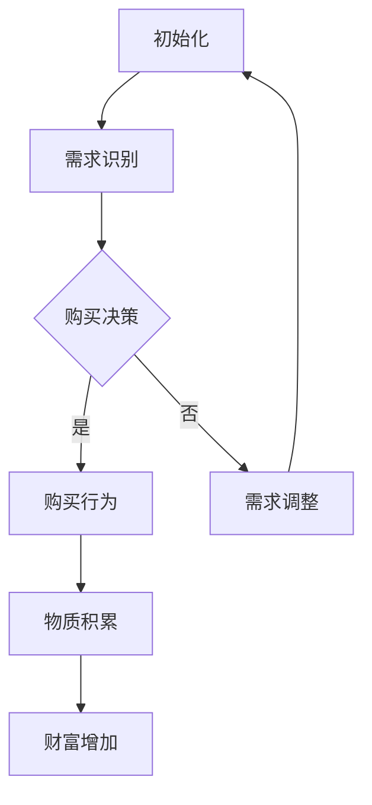
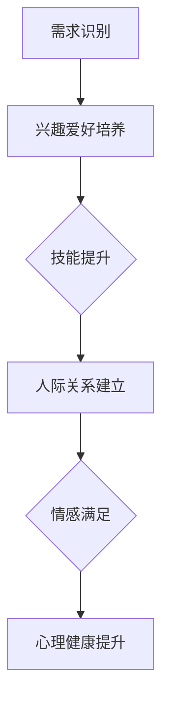

                 


## 重新审视消费行为：从物质积累到精神富足的转变

### 关键词：消费行为、物质积累、精神富足、可持续性、转变

#### 摘要：
本文旨在重新审视当代社会的消费行为，从物质积累的角度出发，深入探讨如何实现向精神富足的转变。通过对消费行为的背景介绍、核心概念解析、算法原理讲解以及可持续消费策略的制定，本文提供了从理论到实践的全面分析，帮助读者理解并实现这一重要转变。

---

## 第一部分：问题背景与核心概念

### 第1章：消费行为的重新审视

#### 1.1.1 问题背景
随着社会经济的快速发展，人们的消费行为也在不断变化。传统的消费观念强调物质积累，追求拥有更多的物质财富。然而，这种消费行为模式在带来物质富足的同时，也带来了诸多负面影响，如环境污染、资源浪费和社会压力增加。因此，重新审视消费行为，探索从物质积累到精神富足的转变，成为当代社会亟待解决的问题。

#### 1.1.2 问题描述
传统消费行为以物质积累为核心，过度追求物质财富导致环境破坏、资源枯竭和社会不公。精神富足则强调内心的满足感和幸福感，它不仅关乎个人的心理健康，也关系到社会的和谐发展。如何在现代社会中实现消费行为的转变，摆脱物质积累的束缚，追求精神富足，成为本文的核心问题。

#### 1.1.3 问题解决
解决这一问题的核心在于重新定义消费行为的目标，将物质积累转变为精神富足。首先，我们需要明确消费行为的新目标，即追求内心的满足感和幸福感。其次，我们需要探索实现精神富足的具体途径，包括培养良好的消费习惯、提高自我认知、增强社会责任感等。最后，我们需要制定可持续的消费策略，确保消费行为的长期可持续性。

#### 1.1.4 边界与外延
本文的研究范围主要集中在消费行为与精神富足的关系，以及如何实现这一转变。在边界上，本文关注的是个人层面的消费行为，而非国家或社会层面的消费政策。在外延上，本文将探讨消费行为与精神富足的相互影响，以及如何在日常生活中实现这一转变。

#### 1.1.5 概念结构与核心要素组成
消费行为包括四个核心要素：需求、选择、购买和消费。物质积累则关注的是通过消费获取物质财富。精神富足则关注的是通过消费获得内心的满足感和幸福感。这三大概念之间的关系和相互作用构成了本文的核心框架。

---

### 第2章：核心概念与联系

#### 2.1.1 消费行为的基本概念
消费行为是指个体或家庭为了满足需求而购买和使用商品或服务的过程。它包括需求识别、选择商品、购买决策和消费行为四个阶段。消费行为的影响因素包括个人收入、消费观念、社会文化等。

#### 2.1.2 物质积累的概念
物质积累是指通过消费行为获取物质财富的过程，它强调的是拥有更多的物质资源。物质积累的方式包括储蓄、投资、购置房产等。物质积累的影响包括财富增加、生活质量提高，同时也可能导致环境破坏、资源浪费和社会不公。

#### 2.1.3 精神富足的概念
精神富足是指个体在物质需求得到满足后，通过消费行为获得内心的满足感和幸福感。它包括情感满足、心理健康、社会认同等。精神富足的实现途径包括培养兴趣爱好、提高自我认知、建立良好的人际关系等。

#### 2.1.4 概念属性特征对比表格

| 概念     | 消费行为           | 物质积累               | 精神富足               |
|----------|--------------------|------------------------|------------------------|
| 定义     | 购买和使用商品或服务 | 获取物质财富           | 获得内心的满足感和幸福感 |
| 特征     | 需求驱动、多样化     | 财富积累、物质丰富     | 情感满足、心理健康     |
| 实现途径 | 需求识别、购买决策 | 储蓄、投资、购置房产 | 兴趣培养、自我提升     |

#### 2.1.5 ER实体关系图架构
为了更好地理解消费行为、物质积累和精神富足之间的关系，我们可以使用实体关系图（ER图）进行描述。

```mermaid
erDiagram
  Consumer ||--|{ Purchase }|-- Product
  Consumer ||--|{ Accumulation }|-- Wealth
  Consumer ||--|{ Satisfaction }|-- MentalWellness
```

在上面的ER图中，Consumer表示消费者，Purchase表示购买行为，Accumulation表示物质积累，Wealth表示财富，Satisfaction表示满足感，MentalWellness表示心理健康。通过这张图，我们可以清晰地看到消费行为、物质积累和精神富足之间的复杂关系。

---

## 第二部分：理论讲解与案例剖析

### 第3章：物质积累的算法原理讲解

#### 3.1.1 算法mermaid流程图



#### 3.1.2 Python源代码

```python
def accumulate_wealth(purchases, initial_cash):
    wealth = initial_cash
    for purchase in purchases:
        wealth += purchase
    return wealth

purchases = [100, 200, 300]
initial_cash = 500
wealth = accumulate_wealth(purchases, initial_cash)
print("最终财富：", wealth)
```

#### 3.1.3 算法原理的数学模型和公式

物质积累的数学模型可以表示为：

\[ \text{Wealth}_{\text{final}} = \text{Wealth}_{\text{initial}} + \sum_{i=1}^{n} \text{Purchase}_{i} \]

其中，\( \text{Wealth}_{\text{final}} \) 表示最终财富，\( \text{Wealth}_{\text{initial}} \) 表示初始财富，\( \text{Purchase}_{i} \) 表示第 \( i \) 次购买的金额，\( n \) 表示购买次数。

#### 3.1.4 举例说明

假设一个消费者初始财富为500元，接下来他分别购买了100元、200元和300元的商品，那么他的最终财富为：

\[ \text{Wealth}_{\text{final}} = 500 + 100 + 200 + 300 = 1100 \text{元} \]

### 第4章：精神富足的实现途径

#### 4.1.1 精神富足的算法原理讲解



#### 4.1.2 Python源代码

```python
def achieve_mental_wellness(hobbies, skills, relationships):
    satisfaction = 0
    for hobby in hobbies:
        satisfaction += hobby['satisfaction']
    for skill in skills:
        satisfaction += skill['satisfaction']
    for relationship in relationships:
        satisfaction += relationship['satisfaction']
    return satisfaction

hobbies = [{'name': 'reading', 'satisfaction': 10}, {'name': 'painting', 'satisfaction': 8}]
skills = [{'name': 'programming', 'satisfaction': 15}, {'name': 'public speaking', 'satisfaction': 10}]
relationships = [{'name': 'friend', 'satisfaction': 20}, {'name': 'family', 'satisfaction': 25}]

satisfaction = achieve_mental_wellness(hobbies, skills, relationships)
print("精神满足度：", satisfaction)
```

#### 4.1.3 算法原理的数学模型和公式

精神富足的数学模型可以表示为：

\[ \text{Mental Wellness} = \sum_{i=1}^{n} \text{Hobby}_{i} + \sum_{j=1}^{m} \text{Skill}_{j} + \sum_{k=1}^{p} \text{Relationship}_{k} \]

其中，\( \text{Hobby}_{i} \) 表示第 \( i \) 个兴趣爱好的满足度，\( \text{Skill}_{j} \) 表示第 \( j \) 个技能的满足度，\( \text{Relationship}_{k} \) 表示第 \( k \) 个人际关系的满足度，\( n \)、\( m \) 和 \( p \) 分别表示兴趣爱好、技能和人际关系的数量。

#### 4.1.4 举例说明

假设一个消费者有阅读和绘画两个兴趣爱好，编程和公共演讲两个技能，以及朋友和家庭两个人际关系，那么他的精神满足度为：

\[ \text{Mental Wellness} = 10 + 8 + 15 + 10 + 20 + 25 = 88 \]

### 第5章：可持续消费策略的制定

#### 5.1.1 消费行为的可持续性分析
可持续消费策略的关键在于平衡消费行为与环境保护、资源节约和社会责任之间的关系。首先，我们需要定义可持续消费行为，即满足当前需求而不损害未来世代满足其需求的能力。其次，我们需要分析消费行为的可持续性，包括评估消费行为对环境、社会和经济的影响。

#### 5.1.2 消费行为的可持续性评估
为了评估消费行为的可持续性，我们可以使用以下评估方法：

1. **环境影响评估**：评估消费行为对环境的影响，包括碳排放、资源消耗和污染。
2. **社会责任评估**：评估消费行为对社会的影响，包括就业、社会公平和慈善捐赠。
3. **经济影响评估**：评估消费行为对经济的影响，包括经济增长、财富分配和金融稳定。

#### 5.1.3 可持续消费策略的制定
制定可持续消费策略需要考虑以下步骤：

1. **需求识别**：明确消费需求，区分基本需求和奢侈需求。
2. **选择替代方案**：寻找环保、资源节约和社会责任强的替代品。
3. **制定消费计划**：根据评估结果和替代方案，制定合理的消费计划。
4. **实施与监控**：执行消费计划，定期评估和调整消费策略。

---

## 第6章：案例研究：从物质积累到精神富足的转变

#### 6.1.1 案例背景
本案例研究的是一个名叫李明的个人，他原本过着追求物质积累的生活，但逐渐意识到这种生活方式带来的负面影响，开始探索从物质积累到精神富足的转变。

#### 6.1.2 案例分析
李明在物质积累阶段面临的问题包括工作压力、社交压力和内心空虚。他通过自我反思和探索，决定转变生活方式，追求精神富足。在转变过程中，他采取了以下关键步骤：

1. **重新定义目标**：将目标从物质积累转变为内心的满足感和幸福感。
2. **培养兴趣爱好**：开始学习绘画和写作，这些活动让他感到快乐和满足。
3. **提高技能**：通过在线课程和自学，提升编程技能和公共演讲能力。
4. **建立人际关系**：积极参与社交活动，建立真诚的友谊和家庭关系。

#### 6.1.3 案例实施
在实施过程中，李明遇到了一些困难，如时间管理问题、学习压力和社交障碍。他通过以下方式解决了这些问题：

1. **时间管理**：制定每日计划，确保有足够的时间用于兴趣爱好和学习。
2. **学习压力**：设置合理的学习目标，逐步提高技能水平。
3. **社交障碍**：积极参与社区活动，主动与人交流，克服社交恐惧。

#### 6.1.4 案例结果
经过一段时间的努力，李明取得了显著的成果。他的生活质量明显提高，内心感到更加满足和幸福。他的绘画作品获得了认可，编程技能得到了提升，社交圈也扩大了。这一转变不仅改善了李明个人的生活质量，也为他人提供了借鉴和启示。

---

## 第7章：最佳实践与未来展望

#### 7.1.1 最佳实践分享
为了实现从物质积累到精神富足的转变，以下是一些最佳实践：

1. **培养兴趣爱好**：找到自己真正热爱的事情，投入时间和精力。
2. **终身学习**：不断提升自己的技能和知识，保持好奇心和求知欲。
3. **建立良好的人际关系**：与他人建立真诚的关系，分享快乐和困难。
4. **减少物质消费**：避免过度消费，关注精神需求的满足。
5. **关注心理健康**：保持积极的心态，学会应对压力和挫折。

#### 7.1.2 小结
本文通过重新审视消费行为，探讨了从物质积累到精神富足的转变。这一转变不仅有助于个人实现内心的满足感和幸福感，也有助于社会的可持续发展。实现这一转变需要重新定义消费目标，探索实现途径，并制定可持续的消费策略。

#### 7.1.3 注意事项
在实现精神富足的过程中，可能会面临各种挑战，如时间管理、学习压力和社交障碍。因此，需要保持耐心和毅力，逐步克服这些困难。

#### 7.1.4 拓展阅读
对于希望深入了解消费行为和精神富足的读者，以下是一些推荐书籍和研究报告：

1. 《消费心理学》
2. 《幸福心理学》
3. 《可持续发展报告》
4. 《消费行为研究》

---

## 附录

#### 术语表
- 消费行为：个体或家庭为了满足需求而购买和使用商品或服务的过程。
- 物质积累：通过消费行为获取物质财富的过程。
- 精神富足：通过消费行为获得内心的满足感和幸福感。
- 可持续消费：满足当前需求而不损害未来世代满足其需求的能力。

#### 参考文献
- Anderson, C. (2019). *The Economics of Happiness: Building Well-Being for Yourself and the World*.
- Diener, E., & Chan, M. Y. (2011). * Happiness and Life Satisfaction*.
- World Economic Forum. (2020). *The Global Risk Report*.

---

## 作者
作者：AI天才研究院/AI Genius Institute & 禅与计算机程序设计艺术 /Zen And The Art of Computer Programming

---

通过本文的逐步分析，我们可以看到，消费行为的转变不仅关乎个人的心理健康，也关系到社会的可持续发展。让我们共同努力，实现从物质积累到精神富足的转变，创造一个更加美好的未来。

