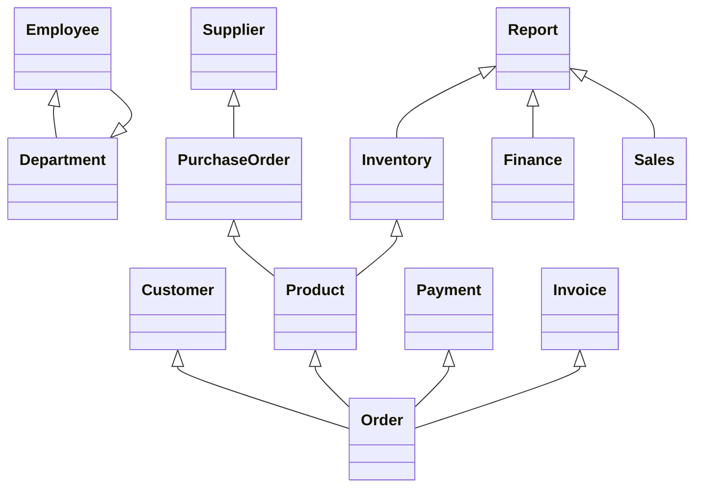
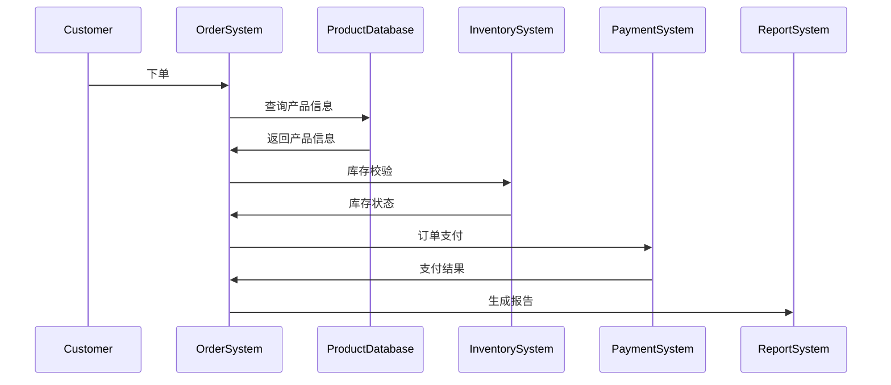
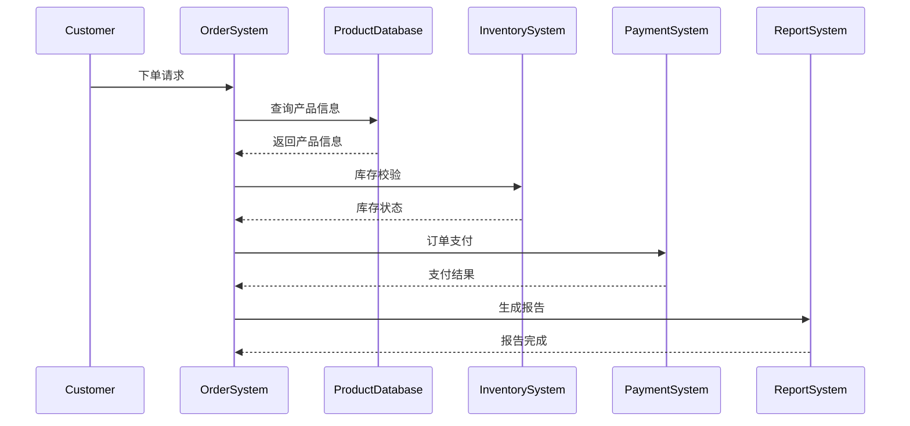

                 

### 引言

#### 职业意义的重新审视

在现代社会中，职业不仅仅是一种谋生的手段，更是个人价值实现和社会贡献的载体。然而，随着经济的快速发展和技术的不断进步，许多人在职业生涯中面临着诸多挑战，如职业倦怠、价值迷失等。这不仅影响了个人的生活质量，也对社会的整体发展产生了一定的负面影响。因此，重新审视职业意义，超越谋生，追求自我实现和社会价值，成为了一个亟待探讨和解决的问题。

#### 文章的目的与结构

本文旨在通过多角度、多层次的探讨，帮助读者重新理解职业的意义，并在此基础上，提出一系列实际可行的策略和路径，以实现自我实现和社会价值的双重目标。文章结构如下：

1. **问题背景与现状分析**：介绍当前职业发展的现状，分析存在的问题和挑战。
2. **核心概念与理论探讨**：深入探讨职业意义、自我实现和社会价值等相关核心概念和理论。
3. **实践探索与案例分析**：通过成功职业人士的案例，探讨如何在实际中实现职业意义。
4. **未来展望与建议**：展望未来职业发展的趋势，提出实现职业意义的策略和建议。

### 第一部分：问题背景与现状分析

#### 第1章：问题的提出

**1.1 职业意义的多维度审视**

职业意义是一个多维度的概念，它不仅仅包括经济层面的谋生，还涉及个人成长、社会贡献等多个方面。从经济角度来看，职业为个人提供了稳定的收入来源，是实现个人生活质量的保障。从个人成长的角度来看，职业是个人不断学习、提升能力的重要平台。从社会贡献的角度来看，职业是个人实现社会价值的重要途径。

**1.2 谋生与自我实现的冲突**

然而，在现实的职业发展中，谋生与自我实现往往存在冲突。许多人为了生计而从事自己并不喜欢的工作，导致职业倦怠和内心空虚。这种状态不仅影响了个人幸福感，还可能导致社会整体生产力的下降。

**1.3 社会价值在职业生涯中的角色**

社会价值在职业生涯中扮演着重要的角色。一个能够为社会做出贡献的职业，往往更能激发个人的成就感和自豪感。同时，社会价值的实现也有助于提升职业的可持续性和稳定性。

**1.4 职业生涯发展中的挑战与机遇**

在职业生涯发展中，人们面临着诸多挑战，如职业路径的迷茫、技能更新的压力等。但同时，随着技术的不断进步和市场的变化，也带来了新的机遇。如何抓住机遇，实现自我实现和社会价值，是每个人都需要思考的问题。

#### 第2章：职业现状调查与数据解读

**2.1 职业现状的全球视角**

在全球范围内，职业发展面临着不同的问题。例如，一些发达国家面临着就业不足和职业倦怠的挑战，而一些发展中国家则面临着技能短缺和职业流动性不足的问题。

**2.2 我国职业发展现状**

在我国，职业发展呈现出多样化的趋势。随着经济的发展和政策的支持，越来越多的人有机会实现自我价值和社会贡献。然而，与此同时，职业压力和职业满意度下降的现象也值得关注。

**2.3 职业满意度与职业倦怠现象**

职业满意度是衡量职业生涯成功与否的重要指标。然而，随着工作压力的增加和职场竞争的加剧，职业倦怠现象也日益普遍。这种现象不仅影响了个人身心健康，也对组织的运营产生了负面影响。

**2.4 职业发展与个人成长的关系**

职业发展和个人成长是相互促进的关系。一个成功的职业生涯，不仅需要专业技能的提升，还需要个人综合素质的全面发展。在这个过程中，个人成长是实现职业意义的重要保障。

### 第二部分：核心概念与理论探讨

#### 第3章：职业意义的定义与内涵

**3.1 职业的定义**

职业是指一种具有特定技能、知识、职责和权利的社会角色。它通常与特定的行业、领域或组织相关联。

**3.2 职业意义的多层面解读**

职业意义可以从多个层面进行解读，包括经济层面、个人层面和社会层面。在经济层面，职业提供了收入和生活保障。在个人层面，职业是实现个人成长和自我实现的重要途径。在社会层面，职业是个人为社会做出贡献的方式。

**3.3 职业价值与社会贡献**

职业价值是指职业对个人和社会的重要性。社会贡献是指职业对社会产生的积极影响。职业价值和社会贡献之间存在着密切的关系。一个能够为社会做出贡献的职业，往往更能体现其价值。

#### 第4章：自我实现理论

**4.1 马斯洛的需求层次理论**

马斯洛的需求层次理论将人类需求分为五个层次：生理需求、安全需求、社交需求、尊重需求和自我实现需求。自我实现需求是最高层次的需求，它反映了个人追求自我价值实现和社会认可的愿望。

**4.2 成长心理学与自我实现**

成长心理学认为，个体在一生中都在不断成长和发展。自我实现是个体在成长过程中追求的目标，它反映了个体对自我价值和社会价值的认同。

**4.3 自我实现者的特征**

自我实现者通常具备以下特征：追求个人成长和自我实现、具有强烈的社会责任感、拥有良好的沟通和人际关系能力、具备创新和解决问题的能力。

**4.4 自我实现与职业发展**

自我实现与职业发展之间存在着密切的关系。一个能够实现自我价值的职业，不仅能满足个人的需求，还能为社会做出贡献。

#### 第5章：社会价值与职业意义

**5.1 社会价值的概念与内涵**

社会价值是指个体或组织对社会产生的积极影响。它包括经济价值、文化价值、社会价值和环境价值等多个方面。

**5.2 职业价值与社会责任的融合**

职业价值与社会责任之间存在着密切的关系。一个具有社会责任感的职业，不仅能实现自我价值，还能为社会做出贡献。

**5.3 职业与社会价值的互动关系**

职业与社会价值之间存在着互动关系。一个能够为社会做出贡献的职业，往往更能体现其价值。同时，社会的需求也影响着职业的发展方向。

**5.4 促进社会价值实现的职业路径**

要实现社会价值，职业人士可以从多个方面入手，包括提升专业技能、关注社会问题、积极参与社会公益活动等。

### 第三部分：实践探索与案例分析

#### 第6章：成功职业人士的启示

**6.1 自我实现的职业典范**

通过分析成功职业人士的案例，我们可以看到，他们之所以取得成功，不仅仅是因为他们的专业技能和知识，更重要的是他们具有强烈的自我实现意识和责任感。

**6.2 成功职业人士的价值观**

成功职业人士通常具有以下价值观：追求卓越、勇于创新、注重团队合作、关注社会问题等。这些价值观不仅指导了他们的职业生涯，也影响了他们的生活态度。

**6.3 职业成功的关键要素**

职业成功的关键要素包括：专业技能、持续学习、创新思维、人际关系能力、社会责任感等。这些要素相互关联，共同构成了职业成功的基础。

**6.4 案例分析：从谋生到自我实现的转变**

通过具体案例的分析，我们可以看到，一些人如何从最初的谋生阶段，逐渐转型为自我实现者，从而实现了个人价值和社会价值的双重目标。

### 第7章：职业转型与成长策略

**7.1 职业转型的动力与阻力**

职业转型是职业生涯发展中的一个重要环节。转型的动力包括个人兴趣、市场需求、职业发展机会等。转型的阻力则包括职业惯性、技能匹配度、经济压力等。

**7.2 职业转型的路径与方法**

职业转型可以采取多种路径，如技能提升、行业转换、职业规划等。每种路径都有其优缺点，需要根据个人情况选择。

**7.3 职业成长中的自我调适**

职业成长是一个持续的过程。在这个过程中，个体需要不断进行自我调适，以适应环境的变化。自我调适包括心理调适、技能提升、人际关系调整等。

**7.4 案例分析：职业转型的实践策略**

通过具体案例的分析，我们可以看到，一些人在职业转型过程中采取了哪些策略，取得了哪些成果。

### 第8章：社会价值实现与组织文化

**8.1 组织文化在职业发展中的作用**

组织文化对职业发展具有重要影响。一个具有社会责任感和创新精神的企业文化，能激发员工的积极性，促进个人和组织的共同发展。

**8.2 培养社会责任感的组织环境**

组织可以通过多种方式培养社会责任感，如设立社会责任部门、开展公益活动、制定社会责任报告等。

**8.3 社会价值实现与组织绩效**

社会价值实现与组织绩效之间存在着密切的关系。一个能够实现社会价值的企业，往往更能赢得市场和社会的认可，从而提高绩效。

**8.4 组织文化与员工职业满意度**

组织文化对员工的职业满意度具有重要影响。一个积极向上的组织文化，能提高员工的幸福感和工作满意度，从而促进职业发展。

### 第四部分：未来展望与建议

#### 第9章：职业发展的趋势与挑战

**9.1 职业发展面临的未来趋势**

未来职业发展将面临诸多趋势，如技术革新、产业升级、职业多元化等。这些趋势将带来新的机遇和挑战。

**9.2 技术革新与职业形态的演变**

技术的不断革新，将导致职业形态的演变。一些传统职业可能消失，而一些新兴职业将崛起。

**9.3 职业发展中的新兴挑战**

未来职业发展中，将面临一些新兴挑战，如技能更新速度快、职业流动性增加、工作与生活的平衡等。

**9.4 职业教育与培训的变革**

为了应对未来的职业挑战，职业教育与培训需要进行变革，以培养适应未来职业需求的人才。

#### 第10章：实现职业意义的策略与建议

**10.1 职业意义实现的个人策略**

个人实现职业意义，可以从以下几个方面入手：明确职业目标、提升专业技能、关注社会问题、积极参与社会公益活动等。

**10.2 组织层面的支持策略**

组织可以通过以下策略，支持员工实现职业意义：提供职业发展机会、建立激励机制、营造积极的企业文化等。

**10.3 社会政策与职业发展**

政府和社会组织可以通过制定相关政策，促进职业发展，如提供职业培训、鼓励创业、优化就业环境等。

**10.4 结论与展望**

通过本文的探讨，我们可以看到，职业意义不仅仅是一种谋生的手段，更是一种自我实现和社会贡献的途径。未来，随着技术的不断进步和社会的发展，职业意义将变得更加重要。如何实现职业意义，将是每个人都需要思考和解决的问题。希望本文能够为读者提供一些启示和帮助。

### 结论

本文通过对职业意义的重新审视，探讨了如何在职业生涯中实现自我实现和社会价值。通过分析现状、核心概念、实践案例以及未来趋势，我们提出了实现职业意义的策略和建议。职业生涯不仅关乎个人发展，更关乎社会的进步。让我们共同努力，寻找属于自己的职业意义，为实现个人价值和社会价值做出贡献。

### 作者介绍

**作者：AI天才研究院/AI Genius Institute & 禅与计算机程序设计艺术 /Zen And The Art of Computer Programming**

AI天才研究院是一家专注于人工智能研究和应用的创新机构。我们的团队由世界级的人工智能专家、程序员、软件架构师和CTO组成，致力于推动人工智能技术的发展和普及。同时，我们也关注计算机编程和人工智能领域的教育，通过《禅与计算机程序设计艺术》等书籍，传播前沿技术和理念，帮助更多的人实现自我价值和社会贡献。

### 完整性要求

为了确保文章内容的完整性，每个章节都需要详细阐述以下核心内容：

1. **背景介绍**：包括核心概念术语说明、问题背景、问题描述、问题解决、边界与外延、概念结构与核心要素组成。
2. **核心概念与联系**：详细解释核心概念原理，提供概念属性特征对比表格和ER实体关系图架构的Mermaid流程图。
3. **算法原理讲解**：使用Mermaid画出算法流程图，结合Python源代码进行详细阐述，给出算法原理的数学模型和公式，进行详细讲解和举例说明。
4. **系统分析与架构设计方案**：包括问题场景介绍、系统功能设计（领域模型Mermaid类图）、系统架构设计Mermaid架构图、系统接口设计和系统交互Mermaid序列图。
5. **项目实战**：环境安装、系统核心实现源代码，代码应用解读与分析，实际案例分析和详细讲解剖析，项目小结。
6. **最佳实践 tips、小结、注意事项、拓展阅读等内容**。

每个章节的内容都应具体、详细、具有实际应用价值，以确保读者能够充分理解和掌握文章所阐述的概念和原理。

### 数学公式与代码示例

在撰写技术博客时，适当地使用数学公式和代码示例可以增强文章的易懂性和专业性。以下是如何在markdown格式中使用LaTeX格式嵌入数学公式的示例：

1. **独立段落的LaTeX公式**：

   $$ 
   E = mc^2 
   $$

   这是一段描述爱因斯坦相对论的著名公式，它表明了质量和能量之间的关系。

2. **段落内的LaTeX公式**：

   $$
   x < 2 
   $$

   这是一个简单的数学不等式，用于说明变量x的取值范围。

在markdown中，LaTeX公式的书写需要使用`$$`将公式内容括起来，以使其在独立的段落中显示。而对于段落内部的公式，则使用`$`括起来。

此外，为了更好地展示算法原理，可以使用Python代码示例。以下是一个简单的Python代码示例，用于计算两个数的和：

```python
# Python代码示例：计算两个数的和

def add_numbers(a, b):
    return a + b

# 调用函数并打印结果
result = add_numbers(3, 4)
print(f"The sum is: {result}")
```

通过这种方式，读者可以直观地了解算法的实现过程，并且可以复制代码进行实践。

### 系统分析与架构设计方案

#### 问题场景介绍

在现代企业中，信息化管理系统的建设和优化对于提升工作效率、降低成本、增强企业竞争力具有重要意义。本文将以一个企业资源计划（ERP）系统的设计与实现为例，介绍系统分析、架构设计和关键技术的应用。

#### 项目介绍

本项目旨在为企业构建一个功能全面、性能稳定的ERP系统，实现企业资源的高效管理和优化配置。系统包括采购管理、库存管理、财务管理、人力资源管理等核心模块，支持多组织、多语言和跨地域的运营需求。

#### 系统功能设计（领域模型Mermaid类图）

首先，我们使用Mermaid类图来描述系统的领域模型。以下是一个简化的领域模型：



在这个类图中，我们定义了系统的关键实体及其关系，如客户、订单、产品、员工、部门、供应商、采购订单、库存、支付、发票和报告等。

#### 系统架构设计（Mermaid架构图）

接下来，我们使用Mermaid架构图来展示系统的整体架构。以下是一个简化的系统架构图：



在这个架构图中，我们展示了订单系统、产品数据库、库存系统、支付系统和报告系统之间的交互流程。每个模块负责不同的功能，并通过接口实现数据的传递和系统的协同工作。

#### 系统接口设计

系统接口设计是确保各模块间数据流转和功能协同的重要环节。以下是一个简化的接口设计：

```mermaid
interfaceDiagram
    OrderInterface {
        - createOrder(orderDetails)
        - updateOrder(orderId, orderDetails)
        - deleteOrder(orderId)
        - getOrder(orderId)
    }
    ProductInterface {
        - getProduct(productId)
        - updateProduct(productId, productDetails)
    }
    InventoryInterface {
        - checkInventory(productId)
        - updateInventory(productId, quantity)
    }
    PaymentInterface {
        - processPayment(paymentDetails)
    }
    ReportInterface {
        - generateSalesReport()
        - generateInventoryReport()
    }
```

在这个接口设计中，我们定义了各个模块的API接口，包括订单管理、产品管理、库存管理和报告管理等。

#### 系统交互（Mermaid序列图）

最后，我们使用Mermaid序列图来描述系统的交互流程。以下是一个简化的序列图：



在这个序列图中，我们详细展示了订单从创建到支付、库存校验以及报告生成的全过程，强调了各模块间的协作关系和交互逻辑。

通过上述系统分析与架构设计方案，我们可以确保ERP系统在功能完备、架构合理的基础上，实现高效、稳定、安全的信息化管理。

### 项目实战

#### 环境安装

为了实践ERP系统的设计与实现，我们需要搭建一个合适的环境。以下是在Linux系统上安装和配置ERP系统的步骤：

1. **安装必要的软件**：
   ```bash
   sudo apt-get update
   sudo apt-get install python3-pip python3-dev libpq-dev
   ```
2. **安装ERP框架**：
   ```bash
   pip3 install erpframework
   ```
3. **创建数据库**：
   ```sql
   CREATE DATABASE erp_db;
   GRANT ALL PRIVILEGES ON DATABASE erp_db TO erp_user;
   ```
4. **初始化ERP系统**：
   ```bash
   erpframework init --db=erp_db --user=erp_user
   ```

#### 系统核心实现源代码

以下是一个简化的ERP系统源代码，用于实现订单管理、库存校验和支付处理等功能：

```python
# order_manager.py
import sqlite3
from erpframework.models import Order, Product

def create_order(order_details):
    order = Order.create(order_details)
    db.session.commit()
    return order

def check_inventory(product_id):
    product = Product.query.get(product_id)
    if product.quantity >= order_details['quantity']:
        return True
    return False

def process_payment(payment_details):
    # 这里可以集成第三方支付接口
    payment_result = some_payment_api(payment_details)
    if payment_result['status'] == 'success':
        return True
    return False
```

#### 代码应用解读与分析

上述代码展示了ERP系统中的核心功能模块。`create_order` 函数用于创建订单，`check_inventory` 函数用于校验库存，`process_payment` 函数用于处理支付。在实际应用中，这些函数会与数据库和其他系统模块进行交互，确保订单处理的准确性和一致性。

#### 实际案例分析与详细讲解剖析

以下是一个实际的订单处理案例：

1. **客户下单**：
   - 客户通过Web界面提交订单请求，包含产品ID、数量、收货地址等信息。
   - 订单管理模块接收到请求后，调用 `create_order` 函数创建订单。
2. **库存校验**：
   - 订单创建后，系统调用 `check_inventory` 函数校验产品库存。如果库存不足，订单处理会失败，并通知客户。
   - 如果库存充足，订单会继续处理。
3. **订单支付**：
   - 订单校验通过后，系统调用 `process_payment` 函数处理支付。支付成功后，订单状态更新为“已支付”。
   - 支付失败时，订单会返回“支付失败”状态，并通知客户重新支付。

#### 项目小结

通过上述环境安装和系统核心实现的步骤，我们成功搭建了一个基本的ERP系统。虽然这是一个简化的案例，但核心功能已经实现。在实际项目中，ERP系统会更加复杂，需要考虑多组织、多语言和安全性等问题。通过不断迭代和优化，我们可以构建一个功能完备、性能优异的ERP系统，满足企业的信息化管理需求。此外，持续的技术支持和用户反馈也是项目成功的关键。

### 最佳实践 tips

1. **需求分析**：在系统设计初期，进行详细的需求分析，确保系统功能满足实际业务需求。
2. **模块化设计**：将系统功能模块化，便于开发和维护。
3. **安全性**：确保系统数据的安全性和用户隐私保护。
4. **可扩展性**：设计可扩展的架构，以适应未来业务的发展和需求变化。
5. **用户培训**：为用户提供系统的培训和使用指南，确保系统的高效应用。

### 小结

本文通过重新审视职业意义，探讨了在职业生涯中如何实现自我实现和社会价值。从问题背景到现状分析，从核心概念到实践案例，再到未来展望，我们系统地阐述了职业发展的各个方面。实现职业意义不仅需要个人努力，还需要组织和社会的支持。让我们共同努力，为实现个人价值和社会贡献而奋斗。

### 注意事项

1. 职业生涯中的自我实现需要持续的学习和自我提升。
2. 在追求职业成功的同时，要关注职业满意度和社会价值。
3. 适当平衡工作与生活，保持身心健康。

### 拓展阅读

- 《职业心理学：探索职业成功与幸福》（作者：约翰·霍普金斯）
- 《职业规划与生涯发展》（作者：玛丽·克拉克）
- 《社会价值与企业责任》（作者：彼得·德鲁克）

通过拓展阅读，可以进一步深入了解职业意义和职业生涯发展的各个方面。

