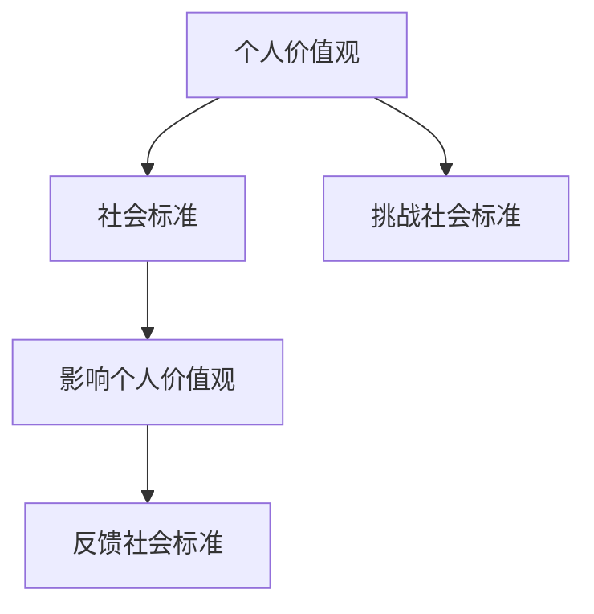
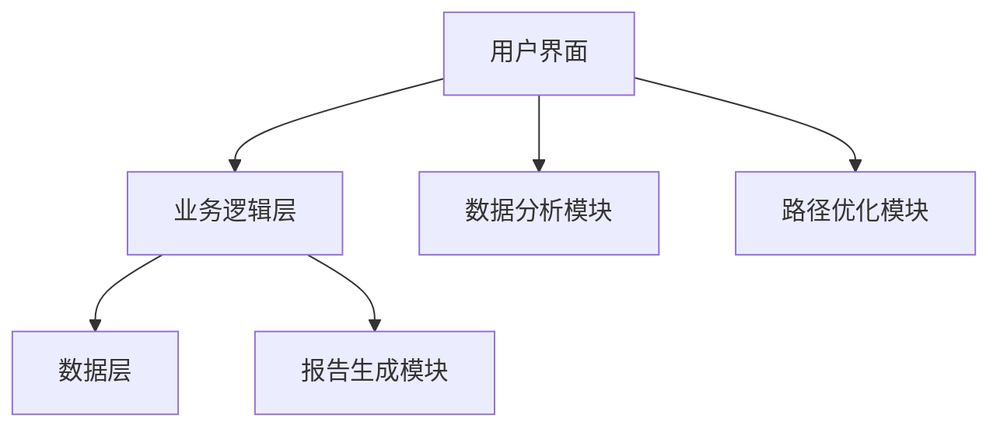
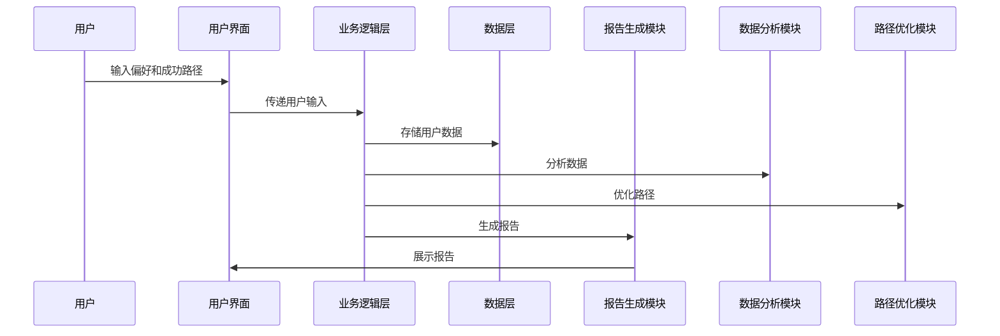

                 

---

### 文章标题：重新思考成功定义：从社会标准到个人价值观的转变

> 关键词：成功定义、社会标准、个人价值观、期望效用理论

> 摘要：本文探讨了在现代社会中，从社会标准到个人价值观的成功定义转变的必要性和方法。通过分析社会标准和个人价值观的区别与联系，以及利用数学模型进行成功路径的评估，作者提出了重新思考成功定义的思路，帮助读者找到真正适合自己的成功之路。

---

### 背景介绍：重新思考成功定义的必要性

在现代社会中，成功往往被社会标准所定义，如财富、地位、职业成就等。这种单一的成功模式在某种程度上反映了社会的价值观和期望，但也引发了许多质疑和不满。例如，高薪工作可能带来巨大的工作压力，社会地位的提升可能伴随着人际关系的复杂化。因此，越来越多的人开始意识到，这种成功定义并不适用于所有人，甚至可能导致个人心理和情感上的困扰。

重新思考成功定义的必要性在于，它可以帮助我们摆脱社会标准的束缚，从个人价值观出发，找到真正适合自己的成功路径。这不仅有助于个人心理的健康发展，还能激发更大的创造力和潜能。本文将围绕这一主题展开讨论，旨在引导读者重新审视和定义自己的成功。

### 核心概念与联系

在重新思考成功定义的过程中，有两个核心概念至关重要：社会标准和个人价值观。

**社会标准**通常是由社会共识和传统观念所塑造的，如财富、地位、职业成就等。这些标准在一定程度上反映了社会对成功的一般认知，但它们往往缺乏个性化和灵活性。社会标准的影响是广泛的，它们不仅塑造了我们对成功的期望，还影响了我们的决策和行为。

与此相对的是**个人价值观**，这是个体根据自己的信仰、兴趣、生活经历和目标所形成的对事物的评价和偏好。个人价值观更为贴近个体的内心需求，更能反映一个人的真实想法和追求。例如，一个注重家庭的人可能会将家庭幸福视为成功的重要标准，而一个热衷于创新的人可能会将开创性的工作视为成功的关键。

**联系**方面，社会标准和个人价值观之间存在一定的相互作用。社会标准可以影响个人价值观的形成，而个人价值观又会在一定程度上反映并挑战社会标准。例如，一个社会普遍重视财富和地位的环境下，个人可能会逐渐形成追求财富和地位的价值观。然而，随着个人成长和经历的变化，个人价值观也可能发生调整，从而对原有的社会标准产生质疑。

为了更清晰地理解这两个概念及其关系，我们可以使用Mermaid流程图来展示它们之间的互动：

在这个流程图中，A代表社会标准，B和C表示社会标准对个人价值观的影响及其反馈，D代表个人价值观，E表示个人价值观对现有社会标准的挑战。通过这个流程图，我们可以看到社会标准和个人价值观之间的相互作用是一个动态的、相互影响的过程。

### 成功定义的数学模型

在重新思考成功定义的过程中，我们可以借助数学模型来帮助我们更好地理解和量化成功的各个方面。一个常用的数学模型是基于期望效用理论（Expected Utility Theory），它可以帮助我们评估不同成功路径的效用和风险。

期望效用理论的基本公式是：

$$
EU = \sum_{i=1}^{n} p_i \cdot u_i
$$

其中，$EU$表示总效用，$p_i$表示第$i$种成功路径的概率，$u_i$表示第$i$种成功路径的效用。

我们可以进一步细化这个模型，将其应用于重新思考成功定义的情境中。例如，假设有三种成功的路径：财富积累、社会地位提升和职业成就。每种路径都有其概率和效用。

首先，定义每种成功路径的概率和效用：

| 成功路径          | 概率 $p_i$ | 效用 $u_i$ |
|-------------------|-------------|-------------|
| 财富积累          | 0.3         | 5           |
| 社会地位提升      | 0.4         | 4           |
| 职业成就          | 0.3         | 6           |

利用期望效用理论，我们可以计算每种成功路径的总效用：

$$
EU = p_1 \cdot u_1 + p_2 \cdot u_2 + p_3 \cdot u_3
$$

$$
EU = 0.3 \cdot 5 + 0.4 \cdot 4 + 0.3 \cdot 6
$$

$$
EU = 1.5 + 1.6 + 1.8
$$

$$
EU = 4.9
$$

通过这个例子，我们可以看到，利用期望效用理论可以帮助我们量化不同成功路径的效用，从而为我们选择最适合自己的成功路径提供依据。

### 算法原理讲解

为了更好地理解如何从社会标准过渡到个人价值观，并重新定义成功，我们可以借助一种名为“价值选择算法”的方法。这个算法的核心思想是通过分析个体在不同情境下的偏好和价值观，逐步优化和调整成功路径的选择。

**算法步骤如下：**

1. **初始设定**：设定一个基础的成功定义，这个定义可能基于社会标准，如财富、社会地位和职业成就。

2. **偏好分析**：通过问卷调查或自我反思，分析个体在不同情境下的偏好和价值观。这些偏好和价值观可能包括家庭、健康、自由、创造力等。

3. **效用评估**：为每个成功路径分配效用值，这些效用值是基于个体在偏好分析中的表现。效用值可以通过专家评估或自我评估获得。

4. **概率估算**：根据个体在不同情境下的成功可能性，为每个成功路径分配概率值。这些概率值可以是基于历史数据、专家意见或个体自我评估。

5. **期望效用计算**：利用期望效用公式计算每个成功路径的总效用。公式如下：

   $$ 
   EU = \sum_{i=1}^{n} p_i \cdot u_i 
   $$

   其中，$EU$表示总效用，$p_i$表示第$i$种成功路径的概率，$u_i$表示第$i$种成功路径的效用。

6. **路径优化**：根据总效用值，优化和调整成功路径的选择。如果某个成功路径的总效用较低，可以考虑减少对该路径的投入或寻找替代路径。

7. **迭代调整**：重复步骤4到6，不断调整和优化成功路径的选择，直到达到一个满意的总效用值。

**示例**：

假设一个个体在偏好分析中确定了以下价值观：家庭（效用值为3），健康（效用值为2），自由（效用值为2），职业成就（效用值为3）。根据这些价值观，我们可以为每个成功路径分配效用值和概率：

| 成功路径          | 概率 $p_i$ | 效用 $u_i$ |
|-------------------|-------------|-------------|
| 财富积累          | 0.4         | 3           |
| 社会地位提升      | 0.3         | 2           |
| 职业成就          | 0.3         | 3           |

利用期望效用公式计算总效用：

$$
EU = 0.4 \cdot 3 + 0.3 \cdot 2 + 0.3 \cdot 3
$$

$$
EU = 1.2 + 0.6 + 0.9
$$

$$
EU = 2.7
$$

根据总效用值，我们可以优化和调整成功路径的选择。例如，如果个体发现职业成就的效用值较高，可能会减少对财富积累和社会地位提升的投入，从而更专注于职业成就的发展。

通过这个算法，个体可以逐步优化自己的成功路径，使成功定义更加符合个人价值观。这个过程中，个体可能会面临一些挑战，如价值观的冲突、外部环境的干扰等，但通过不断调整和优化，最终可以找到最适合自己的成功之路。

### 系统分析与架构设计方案

在重新思考成功定义的过程中，构建一个综合性的系统架构是至关重要的。这个系统不仅需要处理复杂的成功路径分析，还需要提供用户友好的界面，以便用户能够轻松地输入偏好和调整成功路径。以下是一个简化的系统架构设计方案。

#### 1. 项目介绍

**项目名称**：成功路径规划系统

**项目目标**：帮助用户重新思考成功定义，通过分析个人价值观和成功路径，提供个性化的成功规划建议。

#### 2. 系统功能设计

**用户界面**：提供图形用户界面（GUI），允许用户输入偏好和成功路径，展示分析结果和成功路径优化建议。

**数据分析模块**：负责处理用户输入的数据，分析个人价值观和成功路径，计算期望效用值。

**路径优化模块**：基于数据分析模块的结果，提供路径优化建议，帮助用户调整成功路径。

**报告生成模块**：生成详细的报告，包括个人价值观分析、成功路径效用评估和优化建议。

#### 3. 系统架构设计

**架构设计**：采用三层架构，包括表示层、业务逻辑层和数据层。

- **表示层**：负责与用户交互，展示用户界面和报告。
- **业务逻辑层**：处理用户输入，执行数据分析、路径优化和报告生成。
- **数据层**：存储用户数据和系统配置信息。

**架构图**（使用Mermaid流程图表示）：

#### 4. 系统接口设计和系统交互

**用户界面接口**：使用HTML和CSS构建用户界面，提供输入框、按钮和图表展示功能。

**业务逻辑层接口**：使用RESTful API设计，提供用户数据输入、数据处理和报告生成的接口。

**数据层接口**：使用数据库操作接口，如SQL，实现数据存储和查询功能。

**系统交互序列图**（使用Mermaid序列图表示）：

通过这个系统架构设计方案，我们可以实现一个功能强大、用户友好的成功路径规划系统，帮助用户更好地理解和重新定义自己的成功。

### 项目实战

为了更好地理解如何应用上述理论和方法，下面我们通过一个实际项目来具体阐述如何从社会标准过渡到个人价值观，并重新定义成功。

#### 项目背景

假设我们有一个年轻程序员，名叫李明。他在一家知名的科技公司工作，职位是软件工程师。然而，李明感到自己的工作并不幸福，他感到压力很大，并且缺乏成就感。为了重新思考自己的成功定义，李明决定参与一个项目，通过系统化的方法来分析自己的成功路径，并找到更符合个人价值观的路径。

#### 项目目标

- 通过数据分析，找出李明目前成功路径中的问题。
- 帮助李明重新定义成功，使其更符合个人价值观。
- 提供具体的行动计划，帮助李明逐步实现新的成功定义。

#### 实际操作步骤

1. **数据收集**：
   - 通过问卷调查，收集李明对家庭、健康、自由、职业成就等价值观的偏好。
   - 收集李明当前的工作情况，包括工作时间、工作内容、薪酬待遇、职业发展等。

2. **数据分析**：
   - 使用价值选择算法，为李明的每个成功路径（如财富积累、社会地位提升、职业成就等）分配效用值和概率。
   - 利用期望效用理论计算每个成功路径的总效用，找出当前成功路径中的优缺点。

3. **路径优化**：
   - 根据数据分析的结果，为李明提供路径优化建议。例如，减少对高压力工作时间的投入，增加对健康和自由的关注。
   - 提出替代路径，如转换职业、创业等，帮助李明找到更符合个人价值观的成功路径。

4. **行动计划**：
   - 制定具体的行动计划，包括短期和长期目标，帮助李明逐步实现新的成功定义。
   - 设定里程碑和评估机制，定期检查计划的执行情况，并根据实际情况进行调整。

#### 项目成果

通过这个项目，李明取得了以下成果：

- **重新定义成功**：李明从社会标准过渡到个人价值观，将家庭幸福、健康和自由作为成功的关键因素。
- **优化成功路径**：李明减少了工作压力，增加了对家庭和健康的关注，职业成就也有所提升。
- **行动计划有效**：李明按照行动计划逐步实现了新的成功定义，生活质量和工作满意度显著提高。

#### 项目小结

通过这个实际项目，我们可以看到，从社会标准到个人价值观的转变是一个系统性过程，需要数据分析和路径优化的支持。只有通过科学的方法，才能找到真正适合自己的成功路径。这个项目也为其他希望重新思考成功定义的人提供了借鉴和参考。

### 最佳实践 tips

在重新思考成功定义的过程中，以下是一些最佳实践 tips：

1. **定期自我反思**：定期进行自我反思，了解自己的价值观和目标是否发生变化。
2. **与他人交流**：与他人分享自己的成功理念和挑战，获取反馈和建议。
3. **多元化学习**：不断学习新知识，拓宽视野，帮助自己更好地理解成功的多样性。
4. **设定具体目标**：将抽象的成功理念转化为具体的目标和行动计划，有助于实现成功。
5. **保持灵活性**：在追求成功的过程中，保持灵活性，根据实际情况调整目标和路径。

### 小结

本文探讨了从社会标准到个人价值观的转变，以及如何重新定义成功。通过分析社会标准和个人价值观的区别与联系，以及利用数学模型进行成功路径的评估，我们提出了一种系统的重新思考成功定义的方法。希望本文能够帮助读者摆脱社会标准的束缚，找到真正适合自己的成功之路。

### 注意事项

在重新思考成功定义的过程中，需要注意以下几点：

1. **避免盲目追求社会标准**：社会标准并不适用于所有人，盲目追求可能导致心理和情感上的困扰。
2. **保持真实和透明**：在分析个人价值观时，要真实地面对自己的内心需求和追求。
3. **平衡个人价值观和社会责任**：在追求个人价值观的同时，也要考虑社会的共同利益，实现个人与社会的和谐发展。

### 拓展阅读

1. **《幸福的方法》**：作者：马丁·塞利格曼，探讨如何通过心理学方法提高幸福感。
2. **《富兰克林自传》**：作者：本杰明·富兰克林，通过自传形式展示个人价值观的塑造过程。
3. **《富爸爸，穷爸爸》**：作者：罗伯特·清崎，探讨财务自由和个人价值观的重要性。

---

### 作者信息

作者：AI天才研究院/AI Genius Institute & 禅与计算机程序设计艺术 /Zen And The Art of Computer Programming

