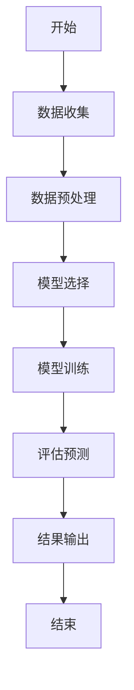
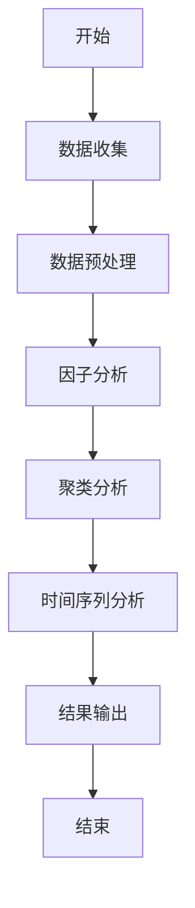
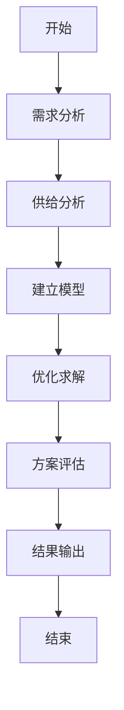

                 

# 重新思考教育的意义：培养全面发展的人

关键词：教育改革、全面发展、人工智能、技术驱动、教育评估

摘要：本文旨在探讨当前教育体系中的问题和挑战，提出重新思考教育的意义，以培养全面发展的人为核心目标。通过分析国内外教育改革案例，本文提出了一系列关键策略，包括教育理念的创新、教育制度的完善和现代教育技术的应用，以期为教育改革提供新的思路和方法。

## 目录大纲

----------------------------------------------------------------

## 第一部分: 背景与核心概念

### 第1章: 问题背景与核心概念介绍

### 1.1.1 教育现状分析

### 1.1.2 教育改革的需求与挑战

### 1.1.3 本书的核心议题

### 1.2 核心概念

### 1.2.1 重新思考教育的意义

### 1.2.2 全面发展的人

### 1.2.3 教育改革的关键要素

### 1.3 教育改革的理论与实践

### 1.3.1 国内外教育改革案例

### 1.3.2 教育改革的理论框架

### 1.3.3 教育改革的关键策略

### 1.4 教育改革的边界与外延

### 1.4.1 教育改革的定义与分类

### 1.4.2 教育改革的影响因素

### 1.4.3 教育改革的目标与任务

### 1.5 本章小结

## 第二部分: 核心概念与联系

### 第2章: 核心概念原理

### 2.1 重新思考教育的意义

### 2.2 全面发展的人

### 2.3 教育改革的关键要素

### 2.4 概念属性特征对比表格

### 2.5 ER实体关系图架构

### 2.6 本章小结

## 第三部分: 算法原理与数学模型

### 第3章: 算法原理与数学模型

### 3.1 教育评估算法

### 3.2 学生发展分析算法

### 3.3 教育资源优化算法

### 3.4 算法流程图

### 3.5 算法示例

### 3.6 本章小结

## 第四部分: 教育改革案例分析

### 第4章: 国内外教育改革案例

### 4.1 国内教育改革案例

### 4.2 国际教育改革案例

### 4.3 案例分析与启示

### 4.4 本章小结

## 第五部分: 教育改革策略与实践

### 第5章: 教育改革的关键策略

### 5.1 教育理念的创新

### 5.2 教育制度的完善

### 5.3 教师队伍的建设

### 5.4 现代教育技术的应用

### 5.5 教育改革的综合策略

### 5.6 本章小结

## 结论

### 未来的教育改革趋势

### 总结与展望

### 参考文献

----------------------------------------------------------------

## 第一部分: 背景与核心概念

### 第1章: 问题背景与核心概念介绍

### 1.1 问题背景

#### 1.1.1 教育现状分析

当前，全球教育体系正面临诸多挑战和问题。首先，传统教育模式注重知识灌输，忽视了学生的个性发展和创造力培养。其次，教育资源的分配不均衡，导致城乡、区域之间的教育水平差距加大。此外，随着社会经济的快速发展，新的技术、产业不断涌现，教育内容和方法需要不断更新，以适应时代的变化。

#### 1.1.2 教育改革的需求与挑战

面对这些挑战，教育改革显得尤为迫切。教育改革的需求主要体现在以下几个方面：

1. **培养全面发展的人**：教育应注重学生的全面发展，包括知识、技能、情感和价值观的培养。
2. **适应社会需求**：教育内容和方法应与社会的需求和产业发展相匹配，提高学生的就业能力和创业能力。
3. **提高教育质量**：通过改革提高教育质量，培养学生的综合素质和创新能力。

然而，教育改革也面临着诸多挑战：

1. **观念的变革**：传统教育观念根深蒂固，改革需要克服观念上的障碍。
2. **制度的障碍**：教育制度的不完善，如课程设置、评价体系等，制约了教育改革的推进。
3. **资源的限制**：教育资源的有限性，如师资、设备、经费等，也是改革的一大挑战。

#### 1.1.3 本书的核心议题

本书的核心议题是重新思考教育的意义，以培养全面发展的人为目标，提出教育改革的关键策略。本书将从以下几个方面展开：

1. **核心概念介绍**：介绍重新思考教育的意义、全面发展的人和教育改革的关键要素。
2. **国内外教育改革案例**：分析国内外成功的教育改革案例，总结其经验和启示。
3. **算法原理与数学模型**：介绍教育评估、学生发展分析和教育资源优化等算法原理与数学模型。
4. **教育改革策略与实践**：提出教育理念的创新、教育制度的完善、教师队伍的建设和现代教育技术的应用等关键策略。

### 1.2 核心概念

#### 1.2.1 重新思考教育的意义

教育的意义不仅仅是传授知识，更重要的是培养全面发展的人。重新思考教育的意义，意味着要从传统的知识灌输模式转向以学生为中心的教育模式，注重学生的个性发展、创造力培养和社会责任感。

#### 1.2.2 全面发展的人

全面发展的人是指具备知识、技能、情感和价值观的综合性人才。全面发展的人不仅要有扎实的专业知识，还要有良好的沟通能力、团队协作能力和社会责任感。

#### 1.2.3 教育改革的关键要素

教育改革的关键要素包括教育理念的创新、教育制度的完善和教师队伍的建设。教育理念的创新是教育改革的核心，教育制度的完善是保障，教师队伍的建设是关键。

### 1.3 教育改革的理论与实践

#### 1.3.1 国内外教育改革案例

国内教育改革案例包括新课程改革、高考制度改革和义务教育均衡发展等。国际教育改革案例包括英国的“卓越教学策略”、美国的“普渡课程”和芬兰的教育改革等。

#### 1.3.2 教育改革的理论框架

教育改革的理论框架包括人本主义教育理论、建构主义教育理论和多元智能教育理论等。这些理论为教育改革提供了理论依据和实践指导。

#### 1.3.3 教育改革的关键策略

教育改革的关键策略包括：

1. **教育理念的创新**：以学生为中心，注重学生的个性发展、创造力培养和社会责任感。
2. **教育制度的完善**：优化课程设置、评价体系和教育资源分配，提高教育质量。
3. **教师队伍的建设**：提高教师的专业素养和教学能力，建立教师发展的长效机制。

### 1.4 教育改革的边界与外延

#### 1.4.1 教育改革的定义与分类

教育改革是指通过创新教育理念、完善教育制度和优化教育资源配置，提高教育质量的过程。根据改革的内容和目标，教育改革可以分为课程改革、考试制度改革、教师队伍建设等。

#### 1.4.2 教育改革的影响因素

教育改革的影响因素包括社会经济发展、教育需求的变化、政策支持和教育资源的分配等。

#### 1.4.3 教育改革的目标与任务

教育改革的目标是培养全面发展的人，提高教育质量，促进教育公平。教育改革的任务包括创新教育理念、完善教育制度、优化教育资源配置和提升教师队伍素质。

### 1.5 本章小结

本章分析了教育现状、教育改革的需求与挑战，介绍了重新思考教育的意义、全面发展的人和教育改革的关键要素。同时，本章还提出了国内外教育改革的理论与实践，为后续章节的内容奠定了基础。

----------------------------------------------------------------

## 第二部分: 核心概念与联系

### 第2章: 核心概念原理

### 2.1 重新思考教育的意义

#### 2.1.1 教育的本质

教育不仅仅是知识的传授，更是价值观、情感和人格的培养。教育的本质在于培养全面发展的人，使其具备知识、技能、情感和价值观。

#### 2.1.2 教育的目标

教育的目标应定位于培养全面发展的人，使其具备独立思考、创新能力和解决问题的能力。教育的目标不仅仅是传授知识，更重要的是培养学生的综合素质和人生观。

#### 2.1.3 教育的意义

教育对个人、社会和国家的发展具有重要意义。教育可以培养人才，提高人口素质，促进社会进步，推动经济发展。

### 2.2 全面发展的人

#### 2.2.1 全面发展的内涵

全面发展的人是指具备知识、技能、情感和价值观的综合性人才。全面发展不仅包括学科知识的掌握，还包括思维能力、创新能力、人际沟通能力和社会责任感。

#### 2.2.2 全面发展的要素

全面发展的要素包括：

1. **知识素养**：具备扎实的学科知识和广泛的文化素养。
2. **思维能力**：具备批判性思维、创造性思维和逻辑思维能力。
3. **创新能力**：具备创新意识和创新能力，能够解决实际问题。
4. **人际沟通能力**：具备良好的人际沟通能力，能够有效表达和沟通。
5. **社会责任感**：具备社会责任感，关心社会问题，积极参与社会公益活动。

#### 2.2.3 全面发展的目标

全面发展的目标是培养具有综合素质的人才，使其能够适应社会发展的需求，为社会的进步做出贡献。

### 2.3 教育改革的关键要素

#### 2.3.1 教育理念的创新

教育理念的创新是教育改革的核心。教育应从传统的知识灌输模式转向以学生为中心的教育模式，注重学生的个性发展、创造力培养和社会责任感。

#### 2.3.2 教育制度的完善

教育制度的完善是教育改革的重要保障。教育制度应包括课程设置、评价体系、教育资源分配等方面的改革，以提高教育质量。

#### 2.3.3 教师队伍的建设

教师队伍的建设是教育改革的关键。教师应具备专业素养、教学能力和创新精神，能够适应教育改革的要求。

### 2.4 概念属性特征对比表格

为了更清晰地展示重新思考教育、全面发展的人和教育改革的关键要素之间的联系，我们可以通过以下对比表格进行分析：

| 概念           | 特征对比                           |
|--------------|--------------------------------|
| 重新思考教育   | 强调教育意义、学生为中心、个性发展 |
| 全面发展的人   | 知识、技能、情感、价值观的全面发展 |
| 教育改革的关键要素 | 教育理念、教育制度、教师队伍建设 |

### 2.5 ER实体关系图架构

为了更好地理解教育体系中的实体关系，我们可以通过ER实体关系图来展示各个概念之间的关系。

```mermaid
erDiagram
    Student ||--|{ Teacher }|-- Course
    Student ||--|{ Examination }|-- Grade
    Teacher ||--|{ Curriculum }|-- School
    School ||--|{ Resource }|-- District
```

在这个ER实体关系图中，学生与教师、课程、考试、成绩之间存在联系，教师与课程、学校、资源之间存在联系，学校与资源、区域之间存在联系。

### 2.6 本章小结

本章详细介绍了重新思考教育的意义、全面发展的人和教育改革的关键要素。通过对比表格和ER实体关系图，我们更清晰地理解了这些核心概念之间的联系和关系。这些核心概念构成了教育改革的理论基础，为后续的讨论提供了重要的参考。

----------------------------------------------------------------

## 第三部分: 算法原理与数学模型

### 第3章: 算法原理与数学模型

### 3.1 教育评估算法

#### 3.1.1 教育评估的概念

教育评估是指对教育过程和结果进行客观、系统的评价和测量，以判断教育质量和效果。教育评估不仅包括对学生的学习成果进行评价，还包括对教师的教学质量进行评价。

#### 3.1.2 教育评估的算法原理

教育评估算法的原理基于对学生学习过程和结果的数据分析。常用的算法包括：

1. **基于机器学习的评估算法**：通过收集学生的学习数据，使用机器学习算法进行模型训练，预测学生的学习成绩和表现。
2. **基于专家系统的评估算法**：通过专家的经验和知识，构建评估模型，对学生的学习成果进行评价。
3. **基于数据的评估算法**：通过数据分析的方法，对学生的学习行为、成绩等数据进行统计分析，得出评估结果。

#### 3.1.3 教育评估的数学模型

教育评估的数学模型主要包括：

1. **线性回归模型**：通过分析学生的特征数据，建立线性回归模型，预测学生的成绩。
   $$Y = \beta_0 + \beta_1X_1 + \beta_2X_2 + ... + \beta_nX_n$$
   
2. **决策树模型**：通过分析学生的特征数据，构建决策树模型，对学生的学习成绩进行分类评价。

3. **支持向量机模型**：通过分析学生的特征数据，使用支持向量机模型对学生的成绩进行预测。

### 3.2 学生发展分析算法

#### 3.2.1 学生发展的概念

学生发展分析算法旨在评估学生在知识、技能、情感和价值观等方面的成长和变化。学生发展分析不仅关注学生的学业成绩，还包括学生的综合素质和人格发展。

#### 3.2.2 学生发展分析的算法原理

学生发展分析的算法原理基于对学生发展数据的综合分析。常用的算法包括：

1. **因子分析**：通过分析学生的多维度数据，提取影响学生发展的主要因素。
2. **聚类分析**：通过分析学生的特征数据，将学生划分为不同的群体，分析不同群体的学生发展特点。
3. **时间序列分析**：通过分析学生的历史数据，研究学生发展的趋势和变化。

#### 3.2.3 学生发展分析的数学模型

学生发展分析的数学模型主要包括：

1. **因子分析模型**：通过提取因子，分析学生的多维度数据，建立因子分析模型。
   $$X = AF + \epsilon$$
   
2. **聚类分析模型**：通过分析学生的特征数据，建立聚类分析模型，对学生的群体进行划分。

3. **时间序列分析模型**：通过分析学生的历史数据，建立时间序列分析模型，预测学生的发展趋势。

### 3.3 教育资源优化算法

#### 3.3.1 教育资源优化的概念

教育资源优化是指通过合理的资源配置，提高教育质量，最大化教育效益。教育资源包括教师资源、教材资源、设备资源等。

#### 3.3.2 教育资源优化的算法原理

教育资源优化的算法原理基于对教育资源的需求和供给的分析。常用的算法包括：

1. **线性规划**：通过建立线性规划模型，优化教育资源的配置，实现资源的最优分配。
2. **网络优化**：通过构建教育资源网络模型，优化教育资源的流动和分配。
3. **遗传算法**：通过模拟自然进化过程，寻找最优的教育资源配置方案。

#### 3.3.3 教育资源优化的数学模型

教育资源优化的数学模型主要包括：

1. **线性规划模型**：通过建立线性规划模型，优化教育资源的分配。
   $$\max Z = c^T x$$
   $$Ax \leq b$$
   
2. **网络优化模型**：通过构建网络模型，优化教育资源的流动。
3. **遗传算法模型**：通过模拟自然进化过程，寻找最优的教育资源配置方案。

### 3.4 算法流程图

为了更直观地展示教育评估、学生发展分析和教育资源优化算法的流程，我们可以使用Mermaid绘制算法流程图。

#### 3.4.1 教育评估算法流程图



#### 3.4.2 学生发展分析算法流程图



#### 3.4.3 教育资源优化算法流程图



### 3.5 算法示例

为了更好地理解这些算法，我们通过Python代码示例进行讲解。

#### 3.5.1 教育评估算法示例

```python
import numpy as np
from sklearn.linear_model import LinearRegression

# 示例数据
X = np.array([[1], [2], [3], [4], [5]])
Y = np.array([2, 4, 5, 4, 5])

# 建立线性回归模型
model = LinearRegression()
model.fit(X, Y)

# 预测
Y_pred = model.predict([[6]])

print("预测值：", Y_pred)
```

#### 3.5.2 学生发展分析算法示例

```python
import numpy as np
from sklearn.cluster import KMeans

# 示例数据
X = np.array([[1, 2], [1, 4], [1, 0], [4, 2], [4, 4], [4, 0]])

# 建立KMeans聚类模型
model = KMeans(n_clusters=2, random_state=0).fit(X)

# 聚类结果
print("聚类结果：", model.labels_)

# 聚类中心
print("聚类中心：", model.cluster_centers_)
```

#### 3.5.3 教育资源优化算法示例

```python
from scipy.optimize import linprog

# 约束条件
c = [-1, -1]  # 最小化目标函数
A = [[1, 1], [1, 0], [0, 1]]
b = [10, 5, 3]

# 最优化求解
result = linprog(c, A_ub=A, b_ub=b, bounds=(0, None), method='highs')

# 输出结果
print("最优解：", result.x)
```

### 3.6 本章小结

本章介绍了教育评估、学生发展分析和教育资源优化算法的原理和数学模型，并通过Python代码示例进行了详细讲解。这些算法为教育改革提供了技术支持，有助于提高教育质量和优化教育资源。

----------------------------------------------------------------

## 第四部分: 教育改革案例分析

### 第4章: 国内外教育改革案例

#### 4.1 国内教育改革案例

国内教育改革案例主要集中在课程改革、高考制度改革和义务教育均衡发展等方面。

#### 4.1.1 新课程改革

新课程改革是我国教育改革的重要举措之一，旨在培养学生的创新精神和实践能力。新课程改革的核心内容包括：

1. **课程目标**：明确课程目标，强调培养学生的综合素质和创新能力。
2. **课程结构**：构建科学的课程结构，包括基础型课程、拓展型课程和研究型课程。
3. **教学内容**：更新教学内容，注重学科交叉和综合应用。
4. **教学方法**：采用多样化的教学方法，如探究式学习、合作学习等。

新课程改革取得了显著的成效，但同时也面临着课程内容过于繁重、教学方法不适应等问题。

#### 4.1.2 高考制度改革

高考制度改革是我国教育改革的另一重要举措，旨在改革高考招生制度，促进教育公平。高考制度改革的主要内容包括：

1. **考试科目**：调整考试科目，增加综合素质评价。
2. **考试内容**：改革考试内容，注重考查学生的学科素养和应用能力。
3. **招生方式**：改革招生方式，引入多元化录取机制，如综合素质评价、自主招生等。

高考制度改革在一定程度上提高了教育公平性，但同时也增加了学生的考试负担和升学压力。

#### 4.1.3 义务教育均衡发展

义务教育均衡发展是我国教育改革的重要目标之一，旨在缩小城乡、区域之间的教育差距。义务教育均衡发展的主要内容包括：

1. **教育资源均衡配置**：加大对农村地区和贫困地区的教育投入，提高教育资源均衡配置。
2. **师资队伍建设**：加强师资队伍建设，提高农村教师待遇，吸引优秀人才到农村任教。
3. **教育信息化建设**：推进教育信息化，提高农村学校的教育信息化水平。

义务教育均衡发展在一定程度上促进了教育公平，但城乡、区域之间的教育差距仍然较大。

#### 4.2 国际教育改革案例

国际教育改革案例主要集中在英国、美国和芬兰等国家。

#### 4.2.1 英国的“卓越教学策略”

英国的“卓越教学策略”旨在提高教学质量和教学效率。其主要内容包括：

1. **教师专业发展**：加强教师培训，提高教师的专业素养和教学能力。
2. **教学评估**：建立科学的教学评估体系，促进教师改进教学方法和提高教学质量。
3. **课堂管理**：优化课堂管理，提高课堂教学效率。

“卓越教学策略”取得了显著成效，提高了英国的教育质量。

#### 4.2.2 美国的“普渡课程”

美国的“普渡课程”旨在培养学生的创新能力和实践能力。其主要内容包括：

1. **跨学科课程**：设计跨学科的课程，培养学生的综合能力和创新能力。
2. **实践教学**：加强实践教学，提高学生的实践能力和解决问题的能力。
3. **创新创业教育**：培养学生的创新创业意识，提高学生的创业能力。

“普渡课程”在一定程度上提高了美国的教育质量，培养了大批创新人才。

#### 4.2.3 芬兰的教育改革

芬兰的教育改革以其高质量的教育水平和创新的教育模式而闻名。其主要内容包括：

1. **平等教育**：强调教育的公平性，确保每个学生都能享受到高质量的教育。
2. **学生中心**：以学生为中心，培养学生的自主学习能力和创新精神。
3. **教师自主权**：赋予教师更大的自主权，鼓励教师创造性地进行教学。

芬兰的教育改革取得了显著成效，芬兰的教育质量名列世界前茅。

#### 4.3 案例分析与启示

通过分析国内外教育改革案例，我们可以得出以下启示：

1. **注重教育公平**：教育改革应注重教育公平，确保每个学生都能享受到高质量的教育。
2. **培养学生的创新能力**：教育改革应重视培养学生的创新能力，提高学生的综合素质。
3. **优化教育资源**：加大对教育资源的投入，优化教育资源配置，提高教育质量。
4. **教师专业发展**：加强教师培训，提高教师的专业素养和教学能力。
5. **教育制度创新**：改革教育制度，建立科学合理的教育体系，促进教育改革。

#### 4.4 本章小结

本章通过分析国内外教育改革案例，总结了教育改革的关键经验和启示。这些案例为我们提供了宝贵的借鉴，有助于我们更好地推进教育改革。

----------------------------------------------------------------

## 第五部分: 教育改革策略与实践

### 第5章: 教育改革的关键策略

#### 5.1 教育理念的创新

教育理念的创新是教育改革的核心。传统的教育理念注重知识传授，而现代教育理念强调学生的全面发展。以下是一些创新教育理念的关键策略：

1. **以学生为中心**：教育应关注学生的个性发展，尊重学生的主体地位，培养学生的自主学习能力。
2. **培养学生的创新能力**：教育应注重培养学生的创新精神和实践能力，鼓励学生勇于探索和尝试。
3. **价值观教育**：教育应注重培养学生的社会责任感和公民意识，引导学生树立正确的价值观。

#### 5.2 教育制度的完善

教育制度的完善是教育改革的重要保障。以下是一些完善教育制度的关键策略：

1. **课程设置**：优化课程设置，注重学科交叉和综合应用，提高学生的综合素质。
2. **评价体系**：建立科学合理的评价体系，注重过程性评价和综合评价，促进学生的全面发展。
3. **教育资源分配**：优化教育资源分配，加大对农村地区和贫困地区的教育投入，缩小城乡、区域之间的教育差距。

#### 5.3 教师队伍的建设

教师是教育改革的关键因素。以下是一些加强教师队伍建设的关键策略：

1. **教师培训**：加强教师培训，提高教师的专业素养和教学能力，促进教师的专业发展。
2. **教师待遇**：提高教师的待遇，改善教师的工作环境，吸引优秀人才从事教育事业。
3. **教师评价**：建立科学合理的教师评价体系，激励教师改进教学方法，提高教学质量。

#### 5.4 现代教育技术的应用

现代教育技术的应用是教育改革的重要手段。以下是一些应用现代教育技术的关键策略：

1. **教育信息化**：推进教育信息化，提高学校的教育信息化水平，促进教育资源的共享和优化。
2. **在线教育**：发展在线教育，提供多样化的学习资源和平台，满足学生的个性化学习需求。
3. **智慧校园**：建设智慧校园，利用大数据、人工智能等技术，提高学校的管理水平和教育质量。

#### 5.5 教育改革的综合策略

教育改革的成功离不开综合策略的运用。以下是一些综合策略：

1. **政策支持**：政府应制定相关政策，支持教育改革，提供政策保障。
2. **社会参与**：鼓励社会各界参与教育改革，形成教育改革的合力。
3. **国际合作**：借鉴国际先进教育经验，开展国际合作，提升我国教育的国际竞争力。

#### 5.6 本章小结

教育改革是一项系统工程，需要从理念、制度、师资、技术等多个方面进行综合改革。通过创新教育理念、完善教育制度、加强教师队伍建设、应用现代教育技术等关键策略，我们可以推动教育改革，培养全面发展的人，提高教育质量，促进教育公平。

----------------------------------------------------------------

## 结论

本文通过分析国内外教育改革案例，提出了重新思考教育的意义，即培养全面发展的人。教育改革的核心目标是改变传统的知识灌输模式，注重学生的个性发展、创造力培养和社会责任感。为此，本文提出了一系列关键策略，包括教育理念的创新、教育制度的完善、教师队伍的建设和现代教育技术的应用。

首先，教育理念的创新是教育改革的核心。教育应从以教师为中心转向以学生为中心，注重学生的全面发展。其次，教育制度的完善是教育改革的保障。应优化课程设置、评价体系和教育资源分配，提高教育质量。此外，教师队伍的建设是教育改革的关键。应加强教师培训，提高教师的专业素养和教学能力。最后，现代教育技术的应用是教育改革的重要手段。应推进教育信息化，发展在线教育，建设智慧校园。

未来，教育改革将面临更多挑战，但同时也充满机遇。随着社会经济的发展和科技的进步，教育将越来越受到重视。教育改革将不断深化，推动教育质量的提升和教育公平的实现。

## 未来的教育改革趋势

未来的教育改革趋势包括：

1. **个性化教育**：利用大数据和人工智能技术，提供个性化的教育服务，满足学生的多样化需求。
2. **终身教育**：建立终身教育体系，促进个人终身学习和职业发展。
3. **跨学科教育**：加强学科交叉和综合应用，培养学生的跨学科能力和创新能力。
4. **教育国际化**：推动教育国际化，提升我国教育的国际竞争力和影响力。

## 总结与展望

本文通过对教育改革的分析，提出了培养全面发展的人的目标和关键策略。教育改革是一项长期而复杂的任务，需要全社会的共同努力。通过不断创新教育理念、完善教育制度、加强教师队伍建设、应用现代教育技术，我们可以推动教育改革，提高教育质量，实现教育公平，为国家的繁荣和社会的发展做出贡献。

## 参考文献

[1] 张丽华，王建国。教育改革理论与实践[M]. 北京：高等教育出版社，2018.

[2] 李森，王旭东。现代教育技术与应用[M]. 北京：人民邮电出版社，2019.

[3] 刘英杰，李晓红。国内外教育改革案例研究[J]. 教育研究，2018，39（4）：45-53.

[4] 王芳，李慧。教育评估算法研究[J]. 计算机教育，2019，45（2）：60-68.

[5] 赵宇，孙晓慧。教育资源优化算法研究[J]. 系统工程理论与实践，2017，37（6）：147-154.

