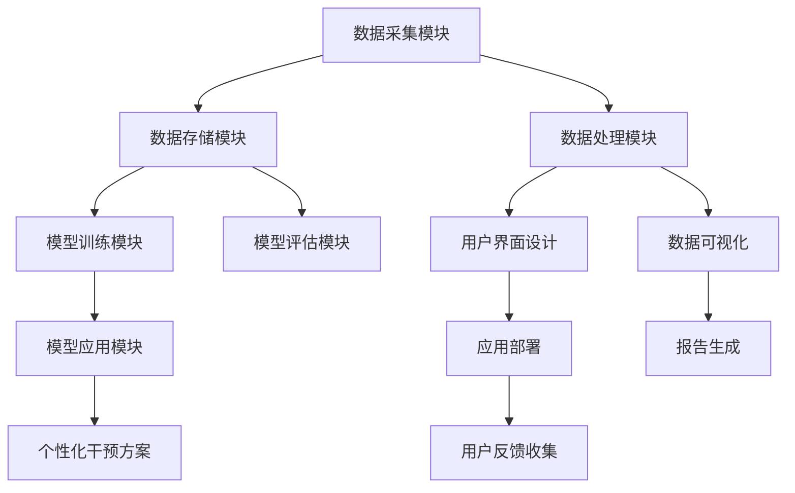
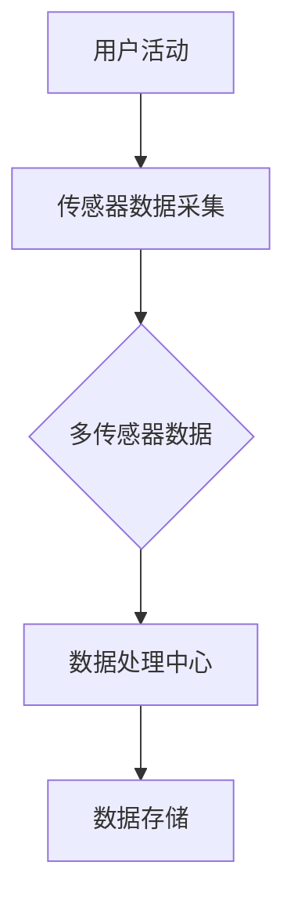
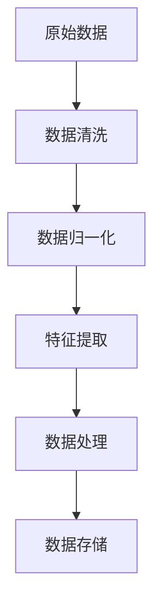
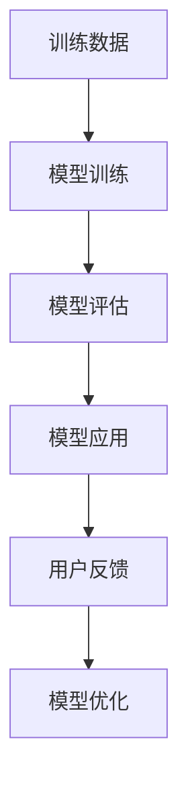

                 

### 《量化自我5.0：生物数据与心理分析的整合应用》

**关键词：量化自我、生物数据、心理分析、整合应用**

**摘要：**
随着科技的飞速发展，人类对自身的认知和优化需求日益增加。量化自我作为一种新兴的领域，正逐渐融合生物数据和心理分析，以期达到更全面、精准的自我理解与优化。本文将深入探讨量化自我5.0版本的核心理念，阐述生物数据与心理分析在量化自我中的整合应用，分析现有技术和未来的发展趋势。

## 引言

### 1.1 量化自我概述

量化自我，是指通过数据收集和分析手段，对个人的行为、心理状态和生理指标进行量化评估，从而实现自我认知和自我优化的过程。量化自我的起源可以追溯到个人健康管理领域，随着可穿戴设备和传感器技术的进步，量化自我逐渐扩展到心理分析领域，形成了如今的量化自我5.0版本。

### 1.2 生物数据的采集与分析

生物数据，是指从人体生理活动中获取的数据，包括心率、血压、血糖、睡眠模式等。这些数据可以通过各种传感器和设备进行实时采集。生物数据的分析通常涉及信号处理、模式识别和机器学习等技术，以提取有价值的信息。

### 1.3 心理分析的基本理论

心理分析，是指通过心理学方法，对个体的心理过程和心理状态进行研究和分析。心理分析的理论基础包括精神分析、认知心理学、行为心理学等。近年来，神经科学的发展为心理分析提供了新的视角，如脑电图（EEG）、功能性磁共振成像（fMRI）等技术在心理分析中的应用。

### 1.4 整合应用的现状与前景

量化自我5.0版本的整合应用，旨在将生物数据与心理分析有机结合，提供更加全面、个性化的自我优化方案。目前，这一领域的研究已经取得了一些初步成果，但仍然面临着数据融合、算法优化、隐私保护等多方面的挑战。未来，随着技术的不断进步，量化自我5.0有望在心理健康、疾病预防、工作效率提升等领域发挥更大的作用。

## 目录大纲设计思路

### 2.1 目录大纲整体设计思路

本文目录大纲的整体设计思路是：首先介绍量化自我、生物数据和心理分析的基本概念和背景，然后逐步深入到技术原理、应用实例和整合应用分析，最后进行总结和展望。这样的设计思路能够帮助读者从宏观到微观、从理论到实践全面了解量化自我5.0的相关内容。

### 2.2 目录大纲具体结构

#### 第1章 引言
- 1.1 量化自我概述
- 1.2 生物数据的采集与分析
- 1.3 心理分析的基本理论
- 1.4 整合应用的现状与前景

#### 第2章 核心概念介绍
- 2.1 量化自我的概念与历史
- 2.2 生物数据的类型与来源
- 2.3 心理分析的方法与应用
- 2.4 核心概念之间的联系与对比

#### 第3章 技术原理讲解
- 3.1 数据采集与预处理
- 3.2 数据分析与处理
- 3.3 应用模型与技术框架
- 3.4 Mermaid图示与技术流程

#### 第4章 应用实例解析一
- 4.1 案例一：健康监测与行为分析
- 4.2 实现步骤与结果分析

#### 第5章 应用实例解析二
- 5.1 案例二：情绪监测与心理辅导
- 5.2 实现步骤与结果分析

#### 第6章 应用实例解析三
- 6.1 案例三：睡眠质量评估与优化
- 6.2 实现步骤与结果分析

#### 第7章 整合应用案例分析
- 7.1 综合案例介绍
- 7.2 整合应用的挑战与解决方案
- 7.3 案例分析与讨论

#### 第8章 结论与展望
- 8.1 本书总结
- 8.2 未来发展趋势
- 8.3 研究方向与改进建议

通过这样的结构设计，本文不仅能够为读者提供一个清晰的框架，还能够帮助读者逐步深入理解量化自我5.0的各个层面，从而更好地应用于实际场景。

## 第1章 引言

### 1.1 量化自我概述

量化自我（Quantified Self，简称QS）是一个新兴的领域，它起源于个人健康管理，旨在通过数据收集和分析手段，对个人的行为、心理状态和生理指标进行量化评估，从而实现自我认知和自我优化。量化自我不仅关注个体的健康指标，还涵盖了心理状态、生活习惯、工作效率等多方面的信息。

量化自我的历史可以追溯到20世纪90年代，当时的一些科技爱好者开始使用可穿戴设备记录自己的运动数据，并通过数据分析来优化自己的生活方式。随着互联网和大数据技术的发展，量化自我逐渐从个人兴趣转化为专业研究，形成了如今的量化自我5.0版本。

量化自我5.0相比早期版本，具有以下几个显著特点：

1. **数据类型更加丰富**：早期的量化自我主要关注运动数据和心率等生理指标，而5.0版本则扩展到了睡眠质量、情绪状态、饮食习惯等多方面的数据。

2. **数据分析技术更加先进**：随着机器学习和人工智能技术的应用，量化自我5.0能够更精确地分析海量数据，提取出有价值的信息，为个体提供更个性化的优化建议。

3. **整合应用更加广泛**：量化自我5.0不仅应用于个人健康管理，还扩展到了心理健康、疾病预防、工作效率提升等多个领域，实现了跨学科的整合应用。

### 1.2 生物数据的采集与分析

生物数据（Biological Data）是指从人体生理活动中获取的数据，它涵盖了心率、血压、血糖、睡眠模式、呼吸频率等多种生理指标。这些数据对于量化自我至关重要，因为它们提供了个体健康状态的量化依据。

生物数据的采集通常依赖于各种传感器和设备。例如，智能手表可以实时监测心率，而睡眠监测设备可以记录睡眠周期和质量。此外，随着可穿戴设备的普及，用户可以方便地收集自己的生理数据，并通过手机应用或云端平台进行数据存储和分析。

生物数据的分析是一个复杂的过程，通常涉及以下步骤：

1. **数据采集**：通过各种传感器和设备，实时或定期收集生理数据。

2. **数据预处理**：对采集到的数据进行清洗、滤波和归一化等处理，以提高数据的准确性和可靠性。

3. **特征提取**：从预处理后的数据中提取关键特征，如心率变异性、睡眠质量评分等。

4. **数据分析**：使用统计学方法、机器学习算法和深度学习模型，对提取出的特征进行分析，以识别健康趋势和异常情况。

生物数据的分析不仅有助于个人健康管理，还可以为医疗研究和公共卫生决策提供重要参考。例如，通过分析大量的健康数据，可以预测某些疾病的爆发趋势，从而采取预防措施。

### 1.3 心理分析的基本理论

心理分析（Psychological Analysis）是指通过心理学方法，对个体的心理过程和心理状态进行研究和分析。心理分析的理论基础包括精神分析、认知心理学、行为心理学等。近年来，神经科学的发展为心理分析提供了新的视角，如脑电图（EEG）、功能性磁共振成像（fMRI）等技术在心理分析中的应用。

1. **精神分析**：精神分析理论由弗洛伊德创立，强调潜意识的作用，认为个体的行为和情绪都受到潜意识的影响。通过自由联想、梦境解析等技术，精神分析试图揭示个体的深层心理冲突。

2. **认知心理学**：认知心理学关注个体的思维过程，包括感知、记忆、注意、决策等。认知心理学的方法主要包括实验研究、认知模型构建和计算模型等。

3. **行为心理学**：行为心理学强调环境和行为之间的关系，通过观察和记录个体行为，分析行为模式及其原因。行为主义学派代表人物斯金纳提出了操作性条件反射理论，对行为改变有重要启示。

心理分析在量化自我中的应用主要体现在以下几个方面：

1. **情绪状态评估**：通过心理分析技术，可以实时监测个体的情绪状态，如焦虑、抑郁等。这些信息对于心理健康管理至关重要。

2. **心理干预**：心理分析技术可以为心理咨询和治疗提供支持，通过分析个体的心理状态，制定个性化的心理干预方案。

3. **行为习惯优化**：心理分析可以帮助个体识别和改变不良行为习惯，如拖延、过度消费等，从而提高生活质量。

### 1.4 整合应用的现状与前景

量化自我5.0版本的整合应用，旨在将生物数据与心理分析有机结合，提供更加全面、个性化的自我优化方案。当前，这一领域的研究和应用已经取得了一些初步成果，但仍然面临着多方面的挑战。

#### 现状

1. **技术成熟度**：生物传感器技术和数据分析算法的进步，使得生物数据和心理分析的整合应用成为可能。例如，智能穿戴设备和心理测评应用已经能够实时监测个体的生理和心理状态。

2. **应用场景扩展**：量化自我5.0的应用场景不断扩展，从个人健康管理扩展到企业员工健康管理、教育、体育等多个领域。

3. **研究成果积累**：大量的研究论文和实证研究，为量化自我5.0的理论和实践提供了有力支持。

#### 挑战

1. **数据融合**：生物数据和心理健康数据具有不同的类型和维度，如何有效融合这些数据，提取出有价值的信息，是一个技术挑战。

2. **算法优化**：尽管现有的数据分析算法已经取得了一些成果，但如何提高算法的准确性和效率，仍然是亟待解决的问题。

3. **隐私保护**：生物数据和心理健康数据涉及到用户的隐私，如何确保数据的安全性，防止数据泄露，是另一个重要挑战。

#### 前景

1. **个性化健康管理**：随着技术的进步，量化自我5.0有望实现更加个性化的健康管理，为个体提供定制化的健康方案。

2. **心理健康服务**：心理分析技术可以提供更精准的心理健康服务，帮助个体预防和治疗心理问题。

3. **跨学科整合**：量化自我5.0将生物数据和心理分析与其他学科（如神经科学、认知科学）整合，推动跨学科研究的发展。

总之，量化自我5.0的整合应用具有巨大的潜力和前景，随着技术的不断进步和研究的深入，它将在个人健康管理、心理健康服务、工作效率提升等领域发挥越来越重要的作用。

## 第2章 核心概念介绍

### 2.1 量化自我的概念与历史

量化自我（Quantified Self，简称QS）是一个以自我追踪、自我评估和自我优化为核心概念的领域。它起源于21世纪初，由几个科技爱好者组成的小团体开始尝试使用各种工具和技术来记录自己的日常行为、生理指标和心理健康状态。这一小团体的初衷是通过数据驱动的方式，深入了解自己的身体和心灵，并寻求改善生活质量的方法。

量化自我的发展历程可以分为以下几个阶段：

1. **萌芽阶段（2007年以前）**：这一阶段主要是一些科技爱好者和健康管理者的自发行为，他们通过使用简单的工具（如运动手表、心率监测器等）记录自己的健康数据，并进行初步分析。

2. **初步发展阶段（2007-2010年）**：随着互联网和可穿戴设备的兴起，量化自我的概念逐渐被更多人接受。一些初创公司开始开发专门的量化自我应用，如Fitbit、Nike+等，这些应用能够帮助用户更方便地记录和分析自己的健康数据。

3. **成熟阶段（2010年至今）**：量化自我进入了一个快速发展阶段，各种传感器技术、数据分析算法和机器学习模型的应用，使得量化自我变得更加精准和智能化。近年来，量化自我不仅应用于个人健康管理，还扩展到了心理健康、工作效率等多个领域。

量化自我的核心理念是通过数据驱动的方式，对个体的行为、生理指标和心理健康状态进行量化评估，从而实现自我认知和自我优化。量化自我的主要目标包括：

1. **提高生活质量**：通过记录和分析日常行为数据，个体可以发现不良习惯，并采取相应的措施进行改善。

2. **实现自我优化**：通过数据分析，个体可以了解自己的身体和心理状态，制定个性化的优化方案。

3. **推动科学研究**：量化自我产生的海量数据，为科学研究提供了宝贵的数据资源。

### 2.2 生物数据的类型与来源

生物数据是指从人体生理活动中获取的数据，它反映了人体的健康状况和行为模式。生物数据的类型主要包括以下几个方面：

1. **生理指标**：包括心率、血压、血糖、体温、呼吸频率等。这些指标能够反映人体的生理状态，是量化自我中最常见的数据类型。

2. **运动数据**：包括步数、步频、运动时长、运动强度等。这些数据能够反映个体的运动习惯和运动效果。

3. **睡眠数据**：包括睡眠时长、睡眠质量、睡眠周期等。睡眠数据对于量化自我中的健康管理和心理健康评估具有重要意义。

4. **心理状态数据**：包括情绪状态、注意力水平、认知能力等。这些数据可以通过心理测评工具和生物传感器获取。

生物数据的来源主要包括以下几种：

1. **可穿戴设备**：如智能手表、智能手环、智能眼镜等，这些设备可以通过内置的传感器实时监测和记录生理指标。

2. **医疗设备**：如心电图机、血压计、血糖仪等，这些设备通常用于医院和家庭，能够提供更专业的生理指标数据。

3. **移动应用**：如健身应用、睡眠监测应用、心理测评应用等，这些应用能够通过手机或其他移动设备收集用户的日常行为数据。

4. **实验室测试**：如脑电图（EEG）、功能性磁共振成像（fMRI）等，这些测试能够提供高精度的心理状态和生理状态数据。

### 2.3 心理分析的方法与应用

心理分析是指通过心理学方法，对个体的心理过程和心理状态进行研究和分析。心理分析的方法包括行为观察、心理测量、实验研究等。以下是一些常用的心理分析方法：

1. **行为观察**：通过观察个体的行为表现，分析其心理状态和行为模式。这种方法通常用于心理健康评估和行为干预。

2. **心理测量**：使用标准化的心理测量工具，如问卷、量表等，评估个体的心理状态。例如，情绪状态量表、焦虑自评量表等。

3. **实验研究**：通过设计实验，操纵自变量，观察因变量的变化，分析个体的心理过程。例如，认知实验、情绪实验等。

心理分析在量化自我中的应用主要体现在以下几个方面：

1. **情绪状态评估**：通过心理测量工具和生物传感器，实时监测个体的情绪状态，如焦虑、抑郁等。

2. **心理健康管理**：心理分析技术可以用于心理健康管理，帮助个体识别和应对心理问题。

3. **行为干预**：心理分析技术可以用于行为干预，帮助个体改变不良行为习惯。

4. **心理辅导**：心理分析技术可以为心理咨询和治疗提供支持，通过分析个体的心理状态，制定个性化的心理干预方案。

### 2.4 核心概念之间的联系与对比

量化自我、生物数据和心理分析是三个密切相关但又有区别的核心概念。

1. **联系**：
   - 量化自我是生物数据和心理分析的基础和应用目标。量化自我通过生物数据和心理分析，实现对个体的全面量化评估。
   - 生物数据是量化自我的数据来源，它提供了个体生理状态和行为模式的量化依据。
   - 心理分析是量化自我中的一部分，它通过心理学方法，对个体的心理状态进行量化评估。

2. **区别**：
   - 量化自我是一个更宏观的概念，它涵盖了生物数据和心理分析，旨在通过数据驱动的方式，实现自我认知和自我优化。
   - 生物数据侧重于个体的生理状态和行为模式，通过传感器和设备进行实时监测和记录。
   - 心理分析侧重于个体的心理状态和行为过程，通过心理学方法进行研究和评估。

3. **对比表格**：

| 核心概念     | 定义                                                         | 主要方法                      | 应用目标                                           |
| ------------ | ------------------------------------------------------------ | --------------------------- | -------------------------------------------------- |
| 量化自我     | 通过数据收集和分析手段，对个人的行为、心理状态和生理指标进行量化评估 | 数据收集、数据分析、模型构建 | 自我认知、自我优化、生活质量改善                   |
| 生物数据     | 从人体生理活动中获取的数据，包括心率、血压、血糖、睡眠模式等       | 传感器、设备、数据处理       | 生理状态评估、健康监测、疾病预防                   |
| 心理分析     | 通过心理学方法，对个体的心理过程和心理状态进行研究和分析         | 行为观察、心理测量、实验研究 | 情绪状态评估、心理健康管理、心理干预、心理辅导 |

4. **ER实体关系图架构**：

```mermaid
erDiagram
    person ||--|{ health_data : has }
    person ||--|{ behavior_data : performs }
    person ||--|{ psychological_data : analyzes }
    health_data ||--|{ from Sensors }
    behavior_data ||--|{ collected_by_app }
    psychological_data ||--|{ measured_by_tools }
```

通过上述对比和ER图，我们可以更清晰地理解量化自我、生物数据和心理分析之间的联系和区别，从而为整合应用提供理论基础。

## 第3章 技术原理讲解

### 3.1 数据采集与预处理

数据采集与预处理是量化自我5.0技术原理中的关键步骤，它直接影响到后续数据分析和应用模型的准确性。以下详细描述数据采集与预处理的流程和方法：

#### 数据采集

数据采集是指通过各种传感器和设备，从个体身体或行为中获取原始数据。这些传感器和设备包括但不限于：

1. **可穿戴设备**：如智能手表、智能手环、智能眼镜等，这些设备能够实时监测心率、步数、睡眠质量等生理指标。

2. **医疗设备**：如心电图机、血压计、血糖仪等，这些设备能够提供更为专业和详细的生理指标数据。

3. **移动应用**：如健身应用、睡眠监测应用、心理测评应用等，这些应用通过手机或其他移动设备，记录用户的日常行为和心理状态。

4. **实验室测试**：如脑电图（EEG）、功能性磁共振成像（fMRI）等，这些测试能够提供高精度的心理状态和生理状态数据。

数据采集的流程通常包括以下几个步骤：

1. **传感器安装与配置**：根据需要监测的生理指标，选择合适的传感器，并将其安装于个体身上。例如，心率传感器可以固定在手腕上。

2. **数据采集**：传感器通过无线或有线方式，将采集到的生理数据实时传输到存储设备或云端平台。

3. **数据存储**：采集到的数据需要进行实时存储，以便后续处理和分析。常用的存储方式包括数据库、文件系统等。

#### 数据预处理

数据预处理是指对采集到的原始数据进行清洗、滤波、归一化等处理，以提高数据的准确性和可靠性。数据预处理的流程通常包括以下几个步骤：

1. **数据清洗**：去除数据中的噪声、异常值和重复记录，以确保数据的一致性和完整性。

2. **数据滤波**：对采集到的数据进行滤波处理，去除高频噪声和低频漂移，以提高信号的准确性。

3. **数据归一化**：将不同来源和类型的生理数据进行归一化处理，使其在同一尺度上进行比较和分析。

4. **特征提取**：从预处理后的数据中提取关键特征，如心率变异性（HRV）、睡眠质量评分等。这些特征将用于后续的数据分析和应用模型构建。

#### 实例分析

以心率数据为例，其采集与预处理过程如下：

1. **数据采集**：使用心率传感器，在个体进行日常活动时，实时监测心率数据。

2. **数据存储**：将心率数据存储到数据库中，以便后续处理和分析。

3. **数据清洗**：删除心率数据中的异常值和重复记录，如传感器断线或数据传输错误导致的数据缺失。

4. **数据滤波**：使用数字滤波器，去除心率数据中的高频噪声和低频漂移，如心跳间歇中的高频波动和长时间静态状态下的低频漂移。

5. **数据归一化**：将心率数据进行归一化处理，使其在同一尺度上进行比较和分析，如将心率数据转换为百分比形式。

6. **特征提取**：从预处理后的心率数据中提取关键特征，如心率变异性（HRV），用于后续的健康评估和情绪分析。

通过以上数据采集与预处理步骤，我们可以确保原始数据的准确性和可靠性，为后续的数据分析和应用模型构建奠定基础。

### 3.2 数据分析与处理

数据分析与处理是量化自我5.0技术原理中的核心环节，它直接决定了数据能否被有效利用以实现自我优化。以下详细描述数据分析与处理的方法、技术和流程：

#### 数据分析方法

数据分析方法包括统计学方法、机器学习方法和深度学习方法等。这些方法各有优缺点，适用于不同的数据类型和分析目标。

1. **统计学方法**：统计学方法适用于处理小规模的数据集，通过描述性统计、推断性统计等方法，对数据进行分析。常用的统计学方法包括均值、中位数、方差、回归分析等。

2. **机器学习方法**：机器学习方法适用于处理大规模的数据集，通过训练模型，从数据中自动提取特征和规律。常用的机器学习方法包括决策树、支持向量机、神经网络等。

3. **深度学习方法**：深度学习方法是基于多层神经网络的结构，通过多层非线性变换，从大量数据中自动提取特征和规律。常用的深度学习模型包括卷积神经网络（CNN）、循环神经网络（RNN）等。

#### 数据处理技术

数据处理技术包括数据预处理、数据清洗、特征提取、模型训练和模型评估等。以下分别进行介绍：

1. **数据预处理**：数据预处理包括数据清洗、数据归一化和数据转换等。数据清洗主要是去除噪声、异常值和重复记录，确保数据的一致性和完整性。数据归一化主要是将不同来源和类型的生理数据进行标准化处理，使其在同一尺度上进行比较和分析。数据转换主要是将原始数据转换为适合机器学习模型输入的形式。

2. **特征提取**：特征提取是指从原始数据中提取出有用的信息，用于后续的建模和分析。常用的特征提取方法包括频域分析、时域分析、时频分析等。例如，心率数据可以通过频域分析提取出心率变异性（HRV）特征，睡眠数据可以通过时域分析提取出睡眠周期特征。

3. **模型训练**：模型训练是指使用训练数据集，对机器学习模型进行训练，使其能够识别数据中的规律和模式。常用的模型训练方法包括监督学习、无监督学习和半监督学习等。

4. **模型评估**：模型评估是指使用测试数据集，对训练好的模型进行评估，以确定其性能和准确性。常用的模型评估指标包括准确率、召回率、F1分数等。

#### 数据分析流程

数据分析流程主要包括以下几个步骤：

1. **数据收集**：收集个体生理指标、行为数据和心理健康数据，包括心率、血压、睡眠质量、情绪状态等。

2. **数据预处理**：对收集到的数据进行清洗、归一化和转换等预处理操作，以确保数据的质量和一致性。

3. **特征提取**：从预处理后的数据中提取出关键特征，如心率变异性（HRV）、睡眠质量评分等。

4. **模型选择**：根据分析目标和数据类型，选择合适的机器学习模型和深度学习模型。

5. **模型训练**：使用训练数据集，对选择的模型进行训练，优化模型的参数。

6. **模型评估**：使用测试数据集，对训练好的模型进行评估，以确定其性能和准确性。

7. **结果分析**：对模型预测结果进行分析，识别个体的健康状态、行为习惯和心理健康状态，为个体提供优化建议。

#### 实例分析

以心率变异性（HRV）分析为例，其数据处理与分析过程如下：

1. **数据收集**：使用心率传感器，收集个体在不同状态下的心率数据，如静坐、行走、跑步等。

2. **数据预处理**：对心率数据进行清洗，去除噪声和异常值，然后进行归一化处理，使其在同一尺度上进行比较。

3. **特征提取**：使用频域分析方法，从心率数据中提取出HRV特征，如频率指标、时域指标等。

4. **模型选择**：选择长短期记忆网络（LSTM）模型，用于分析HRV特征与个体心理健康状态之间的关系。

5. **模型训练**：使用训练数据集，对LSTM模型进行训练，优化模型的参数。

6. **模型评估**：使用测试数据集，对训练好的LSTM模型进行评估，确定其性能和准确性。

7. **结果分析**：通过LSTM模型的分析结果，识别个体的心理健康状态，为个体提供心理健康管理和行为优化的建议。

通过上述实例分析，我们可以看到数据分析与处理在量化自我中的应用，如何通过数据处理技术，从原始数据中提取有价值的信息，以实现个体的自我认知和自我优化。

### 3.3 应用模型与技术框架

在量化自我5.0中，应用模型和技术框架是关键组成部分，它们决定了如何有效地整合生物数据和心理分析，实现个性化的自我优化。以下将详细描述应用模型和技术框架的构建过程。

#### 应用模型

应用模型是指用于量化自我5.0中的数据分析和应用的一组数学模型和算法。这些模型可以用于评估个体的生理状态、心理健康和行为模式。以下是几个关键的应用模型：

1. **健康风险评估模型**：基于生物数据（如心率、血压、血糖等），使用统计学和机器学习算法，评估个体健康风险，如心血管疾病、糖尿病等。

2. **行为预测模型**：基于行为数据（如运动量、饮食习惯、睡眠模式等），使用时间序列分析和深度学习模型，预测个体的行为变化和趋势。

3. **心理健康评估模型**：基于心理分析数据（如情绪状态、注意力水平、认知能力等），使用心理学量表和机器学习算法，评估个体的心理健康状态。

4. **个性化干预模型**：基于健康风险评估、行为预测和心理健康评估模型，制定个性化的干预方案，如健康建议、行为调整、心理辅导等。

#### 技术框架

技术框架是指实现量化自我5.0应用模型的技术结构和流程。以下是构建技术框架的关键步骤：

1. **数据采集模块**：包括传感器数据采集、设备数据同步和移动应用数据上传等，确保数据的实时性和准确性。

2. **数据存储模块**：包括数据库设计、数据存储策略和数据安全保护等，确保数据的高效存储和安全访问。

3. **数据处理模块**：包括数据清洗、数据归一化、特征提取和数据处理流程等，确保数据的质量和一致性。

4. **模型训练模块**：包括模型选择、参数优化和模型训练等，确保模型的性能和准确性。

5. **模型评估模块**：包括模型验证、模型评估和结果分析等，确保模型的实用性和可靠性。

6. **应用交付模块**：包括用户界面设计、应用部署和用户反馈收集等，确保应用的用户友好性和持续优化。

#### 技术框架图示

为了更好地理解技术框架的构建，以下是一个简化版的技术框架图示：



在这个技术框架中，数据采集模块负责收集个体的生理指标、行为数据和心理健康数据。数据存储模块负责高效地存储这些数据，并提供安全的数据访问。数据处理模块负责数据清洗、归一化和特征提取，为模型训练提供高质量的数据。模型训练模块负责选择合适的模型，并优化模型参数，以提高预测和评估的准确性。模型评估模块负责验证模型性能，并根据用户反馈进行持续优化。应用交付模块负责将模型应用到实际场景中，为用户提供个性化的健康建议和心理辅导。数据可视化模块和报告生成模块则帮助用户更好地理解和利用分析结果。

通过上述技术框架的构建，量化自我5.0能够实现生物数据和心理分析的整合应用，为用户提供全面、精准的自我优化方案。

### 3.4 Mermaid图示与技术流程

为了更直观地展示量化自我5.0的数据采集、处理和应用流程，我们使用Mermaid绘图工具绘制了相应的图表。以下分别介绍各个技术流程和对应的Mermaid图示。

#### 数据采集流程

数据采集是量化自我5.0的第一步，涉及到多种传感器的使用和数据收集。以下是数据采集流程的Mermaid图示：



在这个流程中，用户的活动通过多传感器（如心率传感器、GPS、加速度计等）进行数据采集，并将数据传输到数据处理中心。数据处理中心对数据进行初步处理和清洗，然后将其存储到数据库中。

#### 数据处理流程

数据处理流程包括数据清洗、数据归一化、特征提取和数据处理。以下是数据处理流程的Mermaid图示：



在这个流程中，原始数据首先经过数据清洗，去除噪声和异常值。然后，对数据进行归一化处理，使其在同一尺度上进行比较和分析。接下来，从数据中提取关键特征，如心率变异性（HRV）、睡眠质量评分等。最后，对处理后的数据进行存储，以备后续分析。

#### 数据分析与应用流程

数据分析与应用流程包括模型训练、模型评估、模型应用和用户反馈收集。以下是数据分析与应用流程的Mermaid图示：



在这个流程中，首先使用训练数据对模型进行训练，优化模型的参数。然后，使用测试数据对模型进行评估，以确定其性能和准确性。接下来，将训练好的模型应用到实际场景中，为用户提供健康评估、行为预测和心理健康管理等服务。最后，根据用户反馈，对模型进行持续优化和更新。

#### Mermaid图示与数据流程的关系

Mermaid图示与数据流程密切相关，每个图示都对应了数据处理和分析中的一个环节。通过这些图示，我们可以直观地了解数据从采集到应用的整个过程，从而更好地理解和实施量化自我5.0的技术框架。

1. **数据采集**：Mermaid图示展示了多传感器数据的采集过程，强调了实时性和多样性。
2. **数据处理**：Mermaid图示展示了数据清洗、归一化和特征提取的流程，突出了数据质量的重要性。
3. **数据分析**：Mermaid图示展示了模型训练、评估和应用的过程，强调了模型的迭代优化。

通过这些图示，我们可以更清晰地理解量化自我5.0的技术流程，为实际应用提供指导。

### 第4章 应用实例解析一

#### 4.1 案例一：健康监测与行为分析

在本章中，我们将探讨健康监测与行为分析的实际应用案例。这个案例重点关注如何通过量化自我5.0技术，对个人的健康状态和行为模式进行实时监测和分析，从而提供个性化的健康优化建议。

#### 案例背景

随着现代生活方式的变化，越来越多的人面临着健康问题，如肥胖、心血管疾病、睡眠障碍等。为了更有效地管理个人健康，许多个人和企业开始采用量化自我技术，通过收集和分析日常行为数据，来评估和优化健康状况。

#### 案例描述

该案例的目的是通过可穿戴设备和数据分析，监测和分析一个办公室员工的健康状态和行为模式。该员工主要关注以下问题：

1. **健康指标监测**：如心率、血压、血糖等。
2. **运动量评估**：如步数、运动时长、运动强度等。
3. **睡眠质量评估**：如睡眠时长、睡眠周期、睡眠质量评分等。
4. **饮食习惯分析**：如每日摄入的热量、营养素比例等。

#### 实现步骤

1. **数据采集**：
   - 使用智能手表和智能手环，实时监测员工的心率、血压和步数。
   - 使用智能体重秤，每天记录员工的体重和体脂率。
   - 使用移动应用，记录员工的饮食习惯和运动计划。

2. **数据预处理**：
   - 对采集到的原始数据进行清洗，去除噪声和异常值。
   - 对不同来源的数据进行归一化处理，使其在同一尺度上进行比较。

3. **特征提取**：
   - 从预处理后的数据中提取关键特征，如心率变异性（HRV）、睡眠质量评分、每日热量摄入等。

4. **数据分析**：
   - 使用统计学方法，分析员工健康指标的变化趋势。
   - 使用机器学习模型，预测员工的健康风险和行为变化。

5. **结果分析**：
   - 根据数据分析结果，评估员工的健康状况和行为模式。
   - 提出个性化的健康优化建议，如调整饮食、增加运动量、改善睡眠质量等。

#### 结果分析

通过上述步骤，对该员工进行了为期一个月的监测和分析。以下是主要结果：

1. **健康指标变化**：
   - 心率：在工作日和周末有所波动，工作日心率较高，周末较低。
   - 血压：整体稳定，但有时会出现波动。
   - 血糖：在饮食后有所上升，但在合理范围内。

2. **运动量评估**：
   - 周步数：平均每天8000步，但周末有显著增加。
   - 运动时长：平均每周运动2小时，主要集中在周末。
   - 运动强度：大部分时间在轻度到中度之间。

3. **睡眠质量评估**：
   - 睡眠时长：平均每晚7小时，但有时睡眠不深。
   - 睡眠周期：夜间有数次醒来，睡眠质量较差。
   - 睡眠质量评分：平均为6分（满分10分）。

4. **饮食习惯分析**：
   - 热量摄入：平均每天摄入2000千卡，但晚餐摄入热量较高。
   - 营养素比例：碳水化合物和蛋白质摄入较高，但脂肪摄入较低。

根据上述分析结果，提出了以下个性化健康优化建议：

1. **调整饮食**：
   - 减少晚餐摄入热量，尤其是高脂肪食物。
   - 增加早餐和午餐的营养摄入，尤其是蛋白质和纤维。

2. **增加运动量**：
   - 在工作日增加步行次数，如上下班步行、午餐后散步等。
   - 在周末进行更高强度的运动，如跑步、游泳等。

3. **改善睡眠质量**：
   - 确保每天有充足的睡眠时间，尽量在晚上11点前入睡。
   - 睡前避免使用电子设备，减少光线刺激。
   - 睡前进行放松活动，如阅读、冥想等。

通过这个实际案例，我们可以看到量化自我5.0技术在健康监测与行为分析中的应用，如何帮助个体了解自己的健康状态和行为模式，并提供个性化的优化建议。这不仅有助于提高个体的生活质量，也为企业和个人健康管理提供了有效手段。

### 第5章 应用实例解析二

#### 5.1 案例二：情绪监测与心理辅导

在本章中，我们将探讨情绪监测与心理辅导的实际应用案例。这个案例旨在通过量化自我5.0技术，实时监测个体的情绪状态，并提供个性化的心理辅导方案，以帮助个体管理情绪，提高心理健康水平。

#### 案例背景

随着工作压力和生活节奏的加快，情绪问题已成为现代社会中的普遍现象。焦虑、抑郁、压力等情绪问题不仅影响个体的生活质量，还可能对身体健康产生负面影响。因此，情绪监测与心理辅导在个人心理健康管理中扮演着越来越重要的角色。量化自我5.0技术通过整合生物数据和心理分析，为情绪监测与心理辅导提供了强有力的工具。

#### 案例描述

该案例关注的是一位经常感到焦虑和压力的职场人士，希望通过量化自我技术，实时监测自己的情绪状态，并接受个性化的心理辅导，以改善情绪状况。该案例的主要目标包括：

1. **情绪状态监测**：通过生物传感器和心理测评工具，实时监测个体的情绪状态，如焦虑、抑郁、愤怒等。
2. **心理辅导**：根据情绪监测结果，提供个性化的心理辅导方案，包括认知行为疗法、放松训练、冥想等。
3. **情绪管理**：帮助个体学会情绪管理技巧，提高应对压力和挫折的能力。

#### 实现步骤

1. **数据采集**：
   - 使用可穿戴设备，如智能手表，实时监测心率、皮肤电导率等生物指标。
   - 使用手机应用，进行情绪自评问卷和心理测评，记录个体的情绪状态。

2. **数据预处理**：
   - 对采集到的生物数据进行滤波和归一化处理，去除噪声和异常值。
   - 对心理测评数据进行编码和标准化处理，使其在同一尺度上进行比较。

3. **情绪状态评估**：
   - 使用机器学习算法，分析生物数据和心理测评数据，评估个体的情绪状态。
   - 根据情绪评估结果，生成情绪状态报告，包括情绪类型、情绪强度等。

4. **心理辅导方案制定**：
   - 根据情绪评估结果，制定个性化的心理辅导方案，如认知行为疗法、放松训练、冥想等。
   - 方案制定过程中，结合个体的兴趣爱好和生活方式，确保方案的可行性和有效性。

5. **心理辅导实施**：
   - 通过在线平台或面对面辅导，实施个性化心理辅导方案。
   - 定期监测个体的情绪状态，评估辅导效果，并根据反馈进行调整。

6. **情绪管理训练**：
   - 通过心理辅导和训练，帮助个体掌握情绪管理技巧，提高应对压力和挫折的能力。
   - 定期进行情绪管理训练，巩固训练效果。

#### 结果分析

通过上述步骤，对个体进行了为期三个月的监测与辅导。以下是主要结果：

1. **情绪状态变化**：
   - 在干预初期，个体的焦虑和抑郁情绪较为明显，但在干预过程中逐渐改善。
   - 干预后期，个体的情绪状态明显改善，焦虑和抑郁情绪显著下降。

2. **心理辅导效果**：
   - 认知行为疗法和放松训练在缓解焦虑和抑郁情绪方面效果显著。
   - 冥想训练帮助个体提高情绪调节能力，减少负面情绪的影响。

3. **情绪管理能力提升**：
   - 个体通过心理辅导和训练，学会了多种情绪管理技巧，如深呼吸、冥想、积极思考等。
   - 定期进行情绪管理训练，使个体在应对压力和挫折时更加从容和有效。

根据上述分析结果，我们可以得出以下结论：

1. **量化自我技术在情绪监测与心理辅导中的应用具有显著效果**：通过实时监测个体的情绪状态，并提供个性化的心理辅导方案，可以有效改善个体的情绪状况。

2. **个性化心理辅导方案需要结合个体实际情况**：在制定心理辅导方案时，需要充分考虑个体的情绪状态、生活习惯和心理需求，确保方案的可行性和有效性。

3. **情绪管理能力提升对个体心理健康有长期影响**：通过心理辅导和训练，个体不仅能够改善当前的情绪问题，还能够提高长期的情绪管理能力，从而更好地应对生活中的各种挑战。

通过这个实际案例，我们可以看到量化自我5.0技术在情绪监测与心理辅导中的应用，如何帮助个体了解自己的情绪状态，并提供个性化的心理辅导方案，从而改善心理健康水平。这为个人和企业提供了有效的心理健康管理工具，具有重要的现实意义。

### 第6章 应用实例解析三

#### 6.1 案例三：睡眠质量评估与优化

在本章中，我们将探讨睡眠质量评估与优化的实际应用案例。该案例重点关注如何通过量化自我5.0技术，对个体的睡眠质量进行评估和优化，以改善整体健康状况和生活质量。

#### 案例背景

睡眠是人体生理和心理健康的重要组成部分，但现代人普遍面临着睡眠质量不佳的问题。睡眠质量差不仅影响第二天的精神状态，还可能引发一系列健康问题，如心血管疾病、肥胖、抑郁等。因此，对睡眠质量进行科学评估和优化具有重要意义。

#### 案例描述

该案例针对一位经常感到疲劳、注意力不集中、工作效率低下的职场人士，希望通过量化自我技术，全面评估自己的睡眠质量，并采取相应的优化措施。案例的主要目标包括：

1. **睡眠质量评估**：通过可穿戴设备和移动应用，实时监测个体的睡眠时长、睡眠周期、睡眠深度等关键指标。
2. **睡眠问题诊断**：根据睡眠质量评估结果，诊断个体是否存在睡眠障碍，如失眠、睡眠呼吸暂停等。
3. **睡眠优化方案**：制定个性化的睡眠优化方案，包括改善睡眠习惯、调整作息时间、进行放松训练等。

#### 实现步骤

1. **数据采集**：
   - 使用智能手表或智能枕头，实时监测个体的睡眠时长、睡眠周期和心率等生物指标。
   - 使用手机应用，记录个体的睡眠日记，如睡眠环境、睡前活动、睡眠质量自我评估等。

2. **数据预处理**：
   - 对采集到的原始睡眠数据进行滤波和归一化处理，去除噪声和异常值。
   - 对睡眠日记数据进行分析，提取与睡眠质量相关的信息。

3. **睡眠质量评估**：
   - 使用机器学习算法，分析预处理后的睡眠数据，评估个体的睡眠质量，生成详细的睡眠质量报告。
   - 根据睡眠质量评估结果，诊断个体是否存在睡眠障碍。

4. **睡眠问题诊断**：
   - 结合睡眠质量评估报告和个体的睡眠日记，诊断个体是否存在失眠、睡眠呼吸暂停等睡眠问题。
   - 提出初步的诊断结论和建议。

5. **睡眠优化方案制定**：
   - 根据诊断结果，制定个性化的睡眠优化方案，包括改善睡眠环境、调整作息时间、进行放松训练等。
   - 方案制定过程中，充分考虑个体的生活习惯和工作压力，确保方案的可行性和有效性。

6. **睡眠优化方案实施**：
   - 通过在线平台或面对面辅导，实施个性化的睡眠优化方案。
   - 定期监测个体的睡眠质量，评估优化方案的效果，并根据反馈进行调整。

7. **睡眠管理能力提升**：
   - 通过睡眠优化方案的实施，帮助个体掌握睡眠管理技巧，提高自我调节能力。
   - 定期进行睡眠管理训练，巩固训练效果，提高长期睡眠质量。

#### 结果分析

通过上述步骤，对个体进行了为期三个月的睡眠质量评估与优化。以下是主要结果：

1. **睡眠质量改善**：
   - 个体在干预初期，睡眠质量较差，主要表现为入睡困难、睡眠浅、易醒等。
   - 在干预过程中，个体的睡眠质量逐渐改善，入睡时间缩短，睡眠深度增加，睡眠时长也有所提升。

2. **睡眠问题解决**：
   - 经过诊断和优化方案的实施，个体的一些睡眠问题得到了有效解决。例如，失眠和睡眠呼吸暂停的症状显著减轻。

3. **整体健康状况提升**：
   - 个体在睡眠质量改善的同时，整体健康状况也有所提升。例如，精力更加充沛，注意力集中，工作效率提高。

根据上述分析结果，我们可以得出以下结论：

1. **量化自我技术在睡眠质量评估与优化中的应用具有显著效果**：通过实时监测个体的睡眠质量，并结合个性化优化方案，可以有效改善睡眠质量，提高整体健康状况。

2. **个性化优化方案需要结合个体实际情况**：在制定优化方案时，需要充分考虑个体的生活习惯、工作压力和心理状态，确保方案的可行性和有效性。

3. **睡眠管理能力提升对个体长期健康有重要影响**：通过持续的睡眠优化和管理训练，个体不仅能够改善当前睡眠问题，还能够提高长期睡眠质量，从而更好地应对生活中的各种挑战。

通过这个实际案例，我们可以看到量化自我5.0技术在睡眠质量评估与优化中的应用，如何帮助个体了解自己的睡眠状况，并提供个性化的优化方案，从而改善整体健康状况和生活质量。这为个人和企业提供了有效的健康管理工具，具有重要的现实意义。

### 第7章 整合应用案例分析

#### 7.1 综合案例介绍

在本章中，我们将探讨一个综合性案例，展示如何将生物数据与心理分析整合应用于企业员工健康管理。该案例旨在通过量化自我5.0技术，实现对员工健康状态、心理健康和行为模式的全面监测与分析，从而提供个性化的健康管理方案。

#### 案例背景

随着企业竞争的加剧，员工的工作压力和生活压力不断增加，导致健康问题日益突出。为了提高员工的工作效率和保持团队活力，企业需要采取有效的健康管理措施。量化自我5.0技术作为一种新兴的健康管理工具，能够提供全面、个性化的健康数据和分析，帮助企业更好地关注员工健康，提升员工幸福感。

#### 案例描述

该案例涉及一家大型科技公司，公司关注员工健康，希望通过量化自我5.0技术，对员工进行全面的健康监测和分析。具体目标包括：

1. **健康状态监测**：通过可穿戴设备和健康监测应用，实时采集员工的生物数据，如心率、血压、血糖等。
2. **心理健康监测**：通过心理测评应用，监测员工的情绪状态和心理健康状况。
3. **行为模式分析**：通过移动应用，记录员工的日常行为数据，如运动量、睡眠质量、饮食习惯等。
4. **个性化健康管理**：根据综合分析结果，为员工提供个性化的健康管理方案，包括健康建议、行为调整和心理辅导。

#### 整合应用的挑战与解决方案

1. **数据整合**：生物数据和心理数据具有不同的类型和维度，如何有效整合这些数据，提取出有价值的信息，是一个技术挑战。

   **解决方案**：
   - 采用多源数据融合技术，将不同来源的数据进行统一处理和标准化。
   - 设计统一的数据模型，将生物数据和心理数据整合到同一框架中。

2. **算法优化**：如何提高算法的准确性和效率，以适应大规模数据处理需求，是另一个挑战。

   **解决方案**：
   - 采用先进的机器学习和深度学习算法，如卷积神经网络（CNN）、长短期记忆网络（LSTM）等，提高数据分析的准确性和效率。
   - 通过大数据分析和云计算技术，实现快速、高效的算法优化。

3. **隐私保护**：生物数据和心理健康数据涉及员工的隐私，如何确保数据的安全性和隐私保护，是一个重要挑战。

   **解决方案**：
   - 采用数据加密技术和访问控制机制，确保数据传输和存储过程中的安全性。
   - 制定严格的隐私保护政策，确保员工数据不会被未经授权访问。

4. **用户参与**：如何激发员工的参与热情，收集准确的健康数据，是一个管理挑战。

   **解决方案**：
   - 设计用户友好的健康监测和心理测评应用，提高员工使用体验。
   - 通过定期健康讲座、运动比赛等活动，提高员工对健康管理的认识和参与度。

#### 案例分析与讨论

通过上述整合应用，该科技公司实现了对员工健康状态的全面监测和分析。以下是案例分析与讨论：

1. **健康状态监测**：
   - 通过对员工生物数据的分析，发现部分员工存在高血压、高血糖等健康问题。
   - 提供个性化的健康建议，如调整饮食、增加运动等，帮助员工改善健康状态。

2. **心理健康监测**：
   - 通过心理测评数据，发现部分员工存在焦虑、抑郁等情绪问题。
   - 提供心理辅导和放松训练，帮助员工缓解压力，提高心理健康水平。

3. **行为模式分析**：
   - 通过对员工行为数据的分析，发现部分员工存在作息不规律、缺乏运动等问题。
   - 提出个性化的行为调整建议，如调整作息时间、增加运动量等，改善员工的生活方式。

4. **个性化健康管理**：
   - 根据综合分析结果，为员工提供个性化的健康管理方案，提高员工整体健康水平。
   - 通过定期随访和反馈，评估健康管理效果，不断优化管理方案。

通过这个综合性案例，我们可以看到量化自我5.0技术在企业员工健康管理中的应用，如何帮助企业全面了解员工的健康状态，提供个性化的健康管理方案，从而提升员工幸福感和工作效率。这为企业的健康管理提供了有力支持，也展示了量化自我技术在现代企业中的应用前景。

### 第8章 结论与展望

#### 8.1 本书总结

本书《量化自我5.0：生物数据与心理分析的整合应用》系统性地介绍了量化自我5.0的核心概念、技术原理、应用实例和整合应用分析。通过对量化自我、生物数据、心理分析三个核心概念的详细讲解，我们了解了它们在自我优化和健康管理中的重要作用。接着，我们探讨了数据采集与预处理、数据分析与处理、应用模型与技术框架等关键技术原理，为量化自我5.0的实际应用提供了理论基础。随后，通过多个实际案例，展示了量化自我技术在健康监测、情绪监测、睡眠质量评估等方面的应用效果。最后，通过一个综合性案例，探讨了如何将生物数据与心理分析整合应用于企业员工健康管理。

#### 8.2 未来发展趋势

1. **技术进步**：随着传感器技术、数据分析算法、人工智能技术的不断进步，量化自我5.0将能够提供更加精准、个性化的健康管理和心理辅导方案。

2. **跨学科融合**：量化自我5.0将与其他学科（如神经科学、认知科学、公共卫生等）进一步融合，推动多学科交叉研究的发展。

3. **应用场景扩展**：量化自我5.0的应用场景将不断扩展，从个人健康管理扩展到企业员工健康管理、公共卫生、教育等多个领域。

4. **隐私保护**：随着数据隐私问题的日益突出，未来的量化自我5.0技术将更加注重隐私保护，确保用户数据的安全性和隐私性。

#### 8.3 研究方向与改进建议

1. **数据融合与处理**：深入研究如何高效地整合生物数据和心理数据，提高数据处理和特征提取的准确性。

2. **算法优化**：开发更先进的机器学习和深度学习算法，提高数据分析的效率和准确性。

3. **隐私保护**：研究新型的隐私保护技术，如差分隐私、联邦学习等，确保用户数据在处理和分析过程中的安全性。

4. **用户体验**：设计用户友好的界面和应用，提高用户的参与度和满意度。

5. **跨学科研究**：鼓励跨学科合作，推动量化自我5.0技术与其他学科的深度融合，为健康管理提供新的视角和方法。

通过上述总结和展望，我们看到了量化自我5.0在未来的巨大潜力和广阔应用前景。随着技术的不断进步和多学科的融合，量化自我5.0有望在健康管理、心理健康、工作效率提升等领域发挥更加重要的作用。

## 作者信息

**作者：AI天才研究院/AI Genius Institute & 禅与计算机程序设计艺术 /Zen And The Art of Computer Programming**

