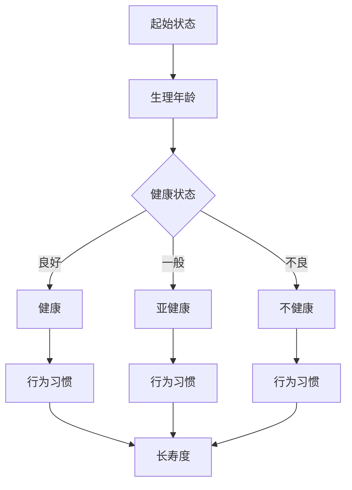

                 

## 第一部分：引言

### 1.0 问题背景

在现代社会，随着医疗技术的进步和生活方式的改善，人类的平均寿命显著延长。进入21世纪，"长寿时代"的概念逐渐被公众认可和接受。在这个背景下，如何科学合理地规划人生，确保百岁人生的幸福与意义，成为了一个亟待探讨的课题。这不仅关乎个体的福祉，也对家庭、社会乃至整个经济体系产生了深远的影响。

#### 科技发展对寿命的影响

科技的发展是推动人类寿命延长的重要因素之一。现代医学技术，如基因编辑、精准医疗、生物技术的应用等，显著提高了人类的健康水平和生存质量。例如，基因测序技术可以帮助预测个体患病的风险，从而采取预防措施；而生物医学研究不断揭示人体衰老的机制，为延缓衰老提供了新的可能性。

此外，科技在生活方式的改善上也发挥了重要作用。现代通讯技术和互联网的普及，使得人们可以更加便捷地获取信息、进行社交，甚至远程工作，减少了传统工作中因通勤带来的时间消耗和身体疲劳。智能家居、健康监测设备等也使人们能够更好地管理自己的健康状况，提高生活质量。

#### 长寿时代的定义和挑战

长寿时代指的是人类平均寿命显著延长，越来越多的人能够活过百岁的时代。在这个时代，"百岁人生"不再是一个遥不可及的梦想，而是一个越来越普遍的现实。然而，长寿时代也带来了一系列新的挑战：

1. **身体健康管理**：随着寿命的延长，老年人面临更多的健康问题，如慢性病、认知障碍等。如何保持身体健康，成为长寿时代的一个重要课题。
2. **财务规划**：长寿时代意味着个人需要工作更长时间，退休储蓄的可持续性成为关键。如何合理规划财务，确保晚年生活的经济安全，是每个人都需要考虑的问题。
3. **社会关系维护**：随着寿命的延长，人际关系也需要不断地维护和调整。如何保持与家庭成员、朋友和社交网络的联系，是长寿时代的一大挑战。
4. **心理健康**：长寿时代可能伴随着孤独感、失落感等心理问题。如何保持心理健康，积极应对生活中的变化，是每个人都应该关注的问题。
5. **继续教育与学习**：在长寿时代，终身学习变得尤为重要。如何保持对新知识和技能的学习，适应社会发展的需求，是每个人都需要思考的问题。

#### 本书的目的

本书旨在探讨长寿时代下的人生规划，帮助读者重构百岁人生的意义。通过分析长寿时代带来的挑战，本书将提供一系列科学合理的规划策略，涵盖健康、财务、社会关系、心理健康和继续教育等多个方面。具体而言，本书将：

1. **探讨长寿的意义**：从哲学角度分析长寿对个体和社会的影响，帮助读者树立正确的长寿观念。
2. **提供健康生活方式**：介绍如何通过饮食、运动、睡眠等方面保持身心健康，提高生活质量。
3. **制定财务规划策略**：提供长寿时代的财务规划策略，帮助读者确保晚年生活的经济安全。
4. **维护社会关系**：探讨如何在长寿时代保持和拓展人际关系，提升生活质量。
5. **关注心理健康**：提供心理健康管理的策略，帮助读者应对长寿时代可能带来的心理挑战。
6. **推动终身学习**：介绍如何保持终身学习，适应社会发展的需求。

### 1.1 问题描述

长寿时代带来的挑战是多方面的，这些问题不仅影响个体的生活质量和幸福感，也对社会和经济产生了深远的影响。以下是长寿时代下主要面临的一些问题：

1. **身体健康管理**：随着年龄的增长，老年人更容易患上各种慢性病，如心脏病、糖尿病、关节炎等。同时，认知障碍，如阿尔茨海默病和痴呆症，也是一个严重的健康问题。如何保持身体健康，提高生活质量，成为长寿时代的一个重要课题。

2. **财务规划**：长寿时代意味着个人需要工作更长时间，退休储蓄的可持续性成为一个关键问题。随着寿命的延长，退休金可能需要支持更长的时间，如何确保退休储蓄的充足性和可持续性，是每个人都需要考虑的问题。

3. **社会关系维护**：在长寿时代，人际关系的重要性愈发凸显。随着家庭成员和朋友的离世，如何保持与亲朋好友的密切联系，维持稳定而健康的社会关系，是一个重要的挑战。

4. **心理健康**：长寿时代可能伴随着孤独感、失落感等心理问题。如何保持心理健康，积极应对生活中的变化，是一个值得探讨的问题。

5. **继续教育与学习**：在长寿时代，终身学习变得尤为重要。如何保持对新知识和技能的学习，适应社会发展的需求，是每个人都需要思考的问题。

### 1.2 问题解决

为了应对长寿时代带来的挑战，本书将从以下几个方面进行探讨：

1. **健康长寿的哲学**：探讨长寿的意义，以及如何保持身心健康。这部分内容将包括长寿观念的重构、健康生活方式的实践和心理调适的技巧。

2. **财务规划**：提供长寿时代的财务规划策略，包括退休储蓄、投资策略和遗产规划。这部分内容将帮助读者确保晚年生活的经济安全。

3. **社会关系**：分析如何维护和拓展人际关系，以适应长寿时代的需求。这部分内容将涵盖家庭关系、社交网络和社区参与等方面的策略。

4. **心理健康**：探讨如何应对长寿时代可能带来的心理挑战，包括情绪管理、心理疾病预防和心理咨询服务。这部分内容将提供心理健康管理的实用方法。

5. **继续教育与学习**：探讨如何保持终身学习，适应社会发展的需求。这部分内容将介绍终身学习的观念、学习资源和个人发展计划。

通过这些方面的探讨，本书旨在为读者提供全面、科学的人生规划策略，帮助他们在长寿时代过上幸福、有意义的生活。

### 1.3 边界与外延

虽然本书主要针对年龄在40岁以上，有长寿愿望的人群，但长寿时代的挑战和解决方案同样适用于其他年龄段的人群。特别是对于年轻人，提前规划和管理个人健康、财务和社会关系，可以为未来的长寿生活奠定坚实的基础。

此外，本书也适用于关注长寿时代问题的专业人士和研究机构。通过本书的探讨，专业人士可以深入了解长寿时代的社会、经济和心理影响，为相关政策和措施提供科学依据。同时，研究机构可以利用本书提供的数据和分析框架，进行更深入的研究和探索。

### 1.4 概念结构与核心要素组成

为了更好地理解长寿时代的人生规划，以下是本书的核心概念结构和各部分的核心要素组成：

#### 健康长寿的哲学

- **长寿观念**：探讨对长寿的理解，包括长寿的意义、价值观和预期目标。
- **健康生活方式**：包括饮食、运动、睡眠等方面的习惯和实践。
- **心理调适**：如何保持积极的心态，应对生活中的各种挑战。

#### 财务规划

- **退休储蓄**：如何根据个人情况制定退休储蓄计划，确保晚年生活的经济安全。
- **投资策略**：探讨在长寿时代下如何进行有效的投资，包括风险管理和投资组合规划。
- **遗产规划**：如何进行遗产规划，以确保财产的合理传承。

#### 社会关系

- **家庭关系**：如何在长寿时代维护和加强与家庭成员的关系。
- **社交网络**：如何拓展社交网络，建立和维护良好的社交关系。
- **社区参与**：如何参与社区活动，提升社区归属感和生活质量。

#### 心理健康

- **情绪管理**：如何管理情绪，保持积极的心态。
- **心理疾病预防**：如何预防心理疾病，包括认知行为疗法、心理教育等。
- **心理咨询服务**：如何获取专业的心理咨询服务，应对心理问题。

#### 继续教育与学习

- **终身学习观念**：如何树立终身学习的观念，认识到学习的重要性。
- **学习资源**：如何获取丰富的学习资源，包括在线课程、图书、讲座等。
- **职业规划**：如何规划职业生涯，包括技能提升和职业转型。

通过这些核心要素的深入探讨，本书旨在为读者提供全面、科学的人生规划策略，帮助他们在长寿时代过上幸福、有意义的生活。

### 第一部分总结

在第一部分中，我们详细介绍了长寿时代的背景和挑战，阐述了长寿时代对个人和社会的影响。我们提出了本书的目的，即通过探讨健康长寿的哲学、财务规划、社会关系、心理健康和继续教育等多个方面，为读者提供科学合理的人生规划策略。通过重构长寿观念、提供健康生活方式、制定财务规划策略、维护社会关系、关注心理健康和推动终身学习，本书旨在帮助读者在长寿时代过上幸福、有意义的生活。

### 2.0 长寿观念的重构

#### 2.1 长寿的意义

长寿不仅仅是一个数量上的增加，更是一种质量上的提升。在传统观念中，长寿常常被视为一种幸福和成就的象征，但长寿的意义在现代社会中需要重新审视。长寿的意义不仅体现在生理年龄的延长，更体现在生活质量和社会功能的提升上。

在长寿时代，长寿的意义可以从以下几个方面来理解：

1. **健康寿命的延长**：传统的观点认为，长寿就是健康寿命的延长。然而，在现代社会，健康寿命的概念被进一步扩展，不仅包括身体上的健康，还包括心理、社会和情感的健康。这意味着，长寿不仅仅是活得更久，更重要的是活得好。

2. **生活质量的提升**：在长寿时代，人们不仅关注寿命的长度，更关注生活质量的提升。高质量的晚年生活包括身体健康、心理满足、社会参与和情感支持。因此，长寿的意义在于能够拥有一个充实、有意义和幸福的生活。

3. **个人成就和社会价值的延续**：长寿使得个人有更多的时间和机会去实现自己的梦想和目标，为社会做出贡献。长寿不仅仅是为了享受生活，更是为了在职业生涯、家庭生活和社区参与中实现个人和社会价值的延续。

#### 2.2 健康生活方式

健康生活方式是保持身心健康的基础，也是实现长寿的关键。以下是一些健康生活方式的实践：

1. **均衡饮食**：均衡的饮食是健康生活方式的核心。应多吃蔬菜、水果、全谷物和瘦肉，限制高糖、高盐和高脂肪食物的摄入。同时，保持适量的饮水和避免过度饮酒。

2. **规律运动**：定期进行适量的运动，如散步、跑步、游泳、瑜伽等，有助于保持身体的活力和健康。每周至少进行150分钟的中等强度运动或75分钟的高强度运动。

3. **充足睡眠**：保持每晚7-9小时的充足睡眠，有助于身体和大脑的恢复。建立规律的睡眠习惯，如保持睡眠环境的舒适和安静，有助于提高睡眠质量。

4. **减少压力**：长期的压力和紧张会对健康产生负面影响。通过冥想、深呼吸、瑜伽等放松技巧，可以帮助缓解压力和焦虑。

5. **定期体检**：定期进行体检，有助于早期发现和预防各种疾病。及时治疗和健康干预可以显著提高生活质量。

#### 2.3 心理调适

心理健康在长寿时代中尤为重要。心理调适可以帮助人们应对生活中的各种挑战，保持积极的心态。以下是一些心理调适的技巧：

1. **积极心态**：培养积极的心态，对生活中的困难和挑战保持乐观的态度。积极的心态有助于提高应对压力的能力。

2. **情绪管理**：学会管理情绪，避免情绪的过度波动。通过认知行为疗法、正念冥想等方法，可以帮助人们更好地控制情绪。

3. **社会参与**：积极参与社会活动，与他人建立良好的社会关系。社会支持有助于提高心理健康水平，减少孤独感和失落感。

4. **继续学习**：终身学习可以保持大脑的活跃和思维的新鲜。通过学习新的知识和技能，可以增强自我效能感和满足感。

5. **心理咨询服务**：在遇到心理困扰时，及时寻求专业的心理咨询服务。专业的心理医生或咨询师可以提供有效的帮助和支持。

### 2.1 健康长寿的核心要素

健康长寿的核心要素包括以下几个方面：

1. **身体健康**：保持良好的身体健康是长寿的基础。通过均衡饮食、规律运动、充足睡眠和定期体检，可以维护身体的健康。

2. **心理健康**：心理健康是长寿的重要组成部分。通过积极心态、情绪管理、社会参与和继续学习，可以保持良好的心理状态。

3. **社会关系**：稳定而健康的社会关系有助于长寿。通过建立和维护良好的家庭关系、社交网络和社区参与，可以提升生活质量。

4. **继续学习**：终身学习可以保持大脑的活力和思维的开放。通过不断学习新的知识和技能，可以适应社会发展的需求。

#### 2.2 长寿与健康的对比分析

长寿与健康是两个相互关联但又有所区别的概念。以下是对长寿与健康的量化指标和区别的详细分析：

##### 2.2.1 长寿的量化指标

1. **生理年龄**：生理年龄是衡量长寿的常用指标，通常通过生物学指标（如骨骼密度、心率变异性）来评估。生理年龄反映了身体的实际健康状况，但也受到基因、环境和生活方式的影响。

2. **健康寿命**：健康寿命是指一个人在生命过程中保持健康状态的时间长度。它不仅考虑了生理年龄，还包括了心理、社会和情感健康。健康寿命通常通过自我报告的健康状况、疾病发病率、残疾率等指标来衡量。

##### 2.2.2 健康的量化指标

1. **身体健康**：身体健康通常通过生理指标来衡量，如体重、血压、血脂、血糖等。这些指标反映了身体的生理功能状态，但并不能完全代表一个人的整体健康状况。

2. **心理健康**：心理健康包括情绪稳定、心理幸福感和社会适应能力。心理健康通常通过心理健康量表、情绪评估、心理健康问题的发病率等指标来衡量。

3. **社会健康**：社会健康涉及人际关系、社会参与和社会支持。社会健康可以通过社交网络规模、社区参与度、孤独感和社会支持水平等指标来衡量。

##### 2.2.3 长寿与健康的对比

1. **量化差异**：长寿通常以生理年龄的延长来衡量，而健康则是一个多维度的评估，包括身体健康、心理健康和社会健康。因此，一个人可能长寿但并不一定健康，反之亦然。

2. **质量与数量**：长寿强调的是寿命的延长，而健康更注重生活质量。健康的生活方式可以延长健康寿命，但并不能直接影响生理年龄。

3. **影响因素**：长寿受基因、环境和生活方式等多种因素影响，而健康则更受个人行为和生活方式的影响。例如，均衡饮食、规律运动和良好的心理健康都有助于提高健康寿命。

##### 2.2.4 实际案例

以一个80岁的老人为例，如果他的生理年龄（通过生物学指标评估）为70岁，而他的健康寿命为80岁，那么他可以被认为是一个长寿但健康的个体。但如果他的生理年龄为80岁，但健康寿命仅为75岁，那么他可能面临更严重的健康问题，尽管他的生理年龄较长。

#### 2.3 健康长寿的数学模型

健康长寿的数学模型可以帮助我们更深入地理解健康和长寿之间的关系。以下是一个简化的健康长寿数学模型：

\[ \text{长寿度} = f(\text{生理年龄}, \text{健康状态}, \text{行为习惯}) \]

在这个模型中：

1. **生理年龄**：生理年龄是一个直接影响长寿的因素。随着年龄的增长，身体的生理功能会逐渐衰退，这可能导致健康问题的增加。

2. **健康状态**：健康状态包括身体健康、心理健康和社会健康。一个良好的健康状态可以通过减少疾病发病率、提高生活质量来实现。

3. **行为习惯**：行为习惯如饮食、运动、睡眠和心理健康管理等，对健康和长寿有显著的影响。良好的行为习惯可以提高健康状态，从而延长健康寿命。

具体来说，健康长寿的数学模型可以表示为：

\[ \text{长寿度} = \alpha \times (\text{生理年龄} + \beta \times \text{健康状态} + \gamma \times \text{行为习惯}) \]

其中，\(\alpha\)、\(\beta\) 和 \(\gamma\) 是权重系数，分别表示生理年龄、健康状态和行为习惯对长寿度的影响程度。

例如，如果一个老人的生理年龄为75岁，健康状态为80%，行为习惯为90%，则他的长寿度可以计算为：

\[ \text{长寿度} = 1 \times (75 + 0.5 \times 80 + 0.3 \times 90) \approx 88.7 \]

这意味着，这个老人在健康和良好行为习惯的支持下，其预期寿命可能会超过88岁。

#### 2.4 健康长寿的Mermaid流程图

以下是健康长寿的Mermaid流程图：

这个流程图展示了生理年龄、健康状态和行为习惯如何共同影响长寿度。良好的健康状态和行为习惯有助于提高长寿度，而较差的健康状态和行为习惯则会降低长寿度。

### 第二部分总结

在第二部分中，我们深入探讨了长寿观念的重构，分析了长寿与健康之间的关系，并提出了一些实用的健康生活方式和心理调适技巧。通过理解长寿的意义、建立健康生活方式和实施心理调适策略，我们可以更好地迎接长寿时代带来的挑战，实现健康长寿的目标。

### 3.0 长寿时代的财务规划

在长寿时代，财务规划变得尤为重要。随着寿命的延长，个人和家庭的财务需求也在不断变化。因此，制定科学合理的财务规划策略，确保晚年生活的经济安全和财务自由，成为每个长寿时代参与者的重要任务。本文将从退休储蓄、投资策略和遗产规划三个方面进行详细探讨。

#### 3.1 退休储蓄

退休储蓄是财务规划的核心。随着寿命的延长，退休储蓄的可持续性成为关键问题。以下是制定退休储蓄计划的一些策略：

1. **计算退休资金需求**：首先，需要计算退休后的资金需求。这包括日常开支、医疗费用、旅行和其他娱乐活动等。通常建议退休储蓄至少覆盖预期寿命的5-10倍。

2. **尽早开始储蓄**：越早开始储蓄，财务规划的效果越好。利用复利效应，早期储蓄可以更好地增值。例如，每年存入1万元，投资年化收益率假设为5%，30年后本金和利息总额将达到约40万元。

3. **多元化储蓄渠道**：除了传统的退休金账户，还可以通过其他渠道进行储蓄。例如，商业养老保险、个人养老金账户、股票、债券等。

4. **定期审查和调整**：随着生活成本的变化和个人财务状况的变化，需要定期审查和调整退休储蓄计划。确保储蓄计划能够适应未来的需求。

#### 3.2 投资策略

在长寿时代，投资是实现财务自由的重要途径。以下是一些在长寿时代下进行投资的有效策略：

1. **长期投资**：由于寿命延长，投资周期也相应延长。长期投资可以更好地抵御市场波动，实现资本增值。

2. **多元化投资组合**：通过多元化投资组合，可以降低风险。投资组合应包括股票、债券、房地产、黄金等多种资产类别，以分散风险。

3. **风险管理**：在投资过程中，风险管理至关重要。了解不同投资产品（如股票、债券、基金）的风险和回报，合理配置投资比例。

4. **定期再平衡**：定期对投资组合进行再平衡，确保投资组合的风险和回报水平与预期相符。例如，每年进行一次投资组合的再平衡。

5. **避免冲动投资**：在市场波动时，避免冲动投资。理性分析市场状况，根据长期投资策略进行调整。

#### 3.3 遗产规划

遗产规划是长寿时代不可忽视的一环。以下是一些遗产规划的建议：

1. **制定遗产计划**：明确自己的遗产分配意愿，包括财产、投资和保险等。遗产计划可以通过遗嘱、信托等方式实现。

2. **定期更新遗产计划**：随着家庭状况和财务状况的变化，需要定期更新遗产计划。确保遗产分配符合当前意愿。

3. **选择合适的遗产规划工具**：遗嘱、遗产信托、生前信托等都是常见的遗产规划工具。了解每种工具的优缺点，选择最适合自己的工具。

4. **避免遗产税**：了解所在国家的遗产税政策，采取适当的税务规划策略，减少遗产税的负担。

5. **寻求专业建议**：遗产规划涉及法律、财务和税务等多个方面，建议寻求专业律师、财务顾问和税务顾问的帮助。

#### 3.4 财务规划的核心要素

财务规划的核心要素包括以下几个方面：

1. **退休储蓄**：确保退休后的资金需求，是财务规划的基础。计算退休资金需求，尽早开始储蓄，多元化储蓄渠道。

2. **投资策略**：通过科学合理的投资策略，实现财务自由。多元化投资组合，定期再平衡，避免冲动投资。

3. **遗产规划**：明确遗产分配意愿，制定遗产计划，选择合适的遗产规划工具，避免遗产税。

4. **定期审查和调整**：定期审查和调整财务规划，确保规划与当前生活状况和未来需求相符。

通过以上财务规划策略，个人可以在长寿时代确保经济安全，享受幸福和有意义的晚年生活。

### 第三部分总结

在第三部分中，我们详细探讨了长寿时代的财务规划，包括退休储蓄、投资策略和遗产规划。通过科学合理的财务规划，个人可以确保晚年生活的经济安全和财务自由，从而更好地迎接长寿时代的挑战。财务规划的核心要素是确保退休储蓄、多元化投资组合和有效的遗产规划，通过这些策略，个人可以为自己和家庭成员创造一个更加稳定和幸福的未来。

### 4.0 社会关系

在长寿时代，社会关系的重要性愈发凸显。随着寿命的延长，人际关系不仅影响个体的心理健康和生活质量，还直接影响着我们的社交参与和社会支持网络。因此，如何维护和拓展社会关系，成为一个值得深入探讨的课题。

#### 4.1 家庭关系

家庭关系是人际关系的基础。在长寿时代，保持和加强家庭关系尤为关键。以下是一些维护家庭关系的策略：

1. **沟通**：家庭成员之间的沟通是维护关系的核心。定期进行面对面的沟通，分享生活中的点滴，可以增进理解和信任。

2. **共同活动**：参与共同的活动，如旅行、共进晚餐、家庭聚会等，可以加强家庭成员之间的情感联系。

3. **尊重和理解**：尊重家庭成员的个性和需求，理解他们的感受和立场，是维系家庭和谐的重要因素。

4. **情感支持**：在家庭成员面临困难时，提供情感上的支持和安慰，帮助他们度过难关。

#### 4.2 社交网络

社交网络不仅包括家庭和朋友，还包括同事、邻居和社区成员。以下是拓展和维持社交网络的策略：

1. **积极参与社交活动**：参加社区活动、志愿者工作和兴趣小组等，可以结识新的朋友，扩大社交网络。

2. **保持联系**：定期与亲朋好友保持联系，通过电话、邮件、社交媒体等方式，分享生活点滴，增进感情。

3. **建立新的关系**：在社交场合中主动与他人交流，展现自己的兴趣和热情，有助于建立新的友谊。

4. **互帮互助**：在社交网络中，互帮互助可以增强关系，同时也能带来实际的利益和支持。

#### 4.3 社区参与

社区参与不仅有助于拓展社交网络，还能提高生活质量和社会满足感。以下是一些社区参与的策略：

1. **志愿服务**：参与社区志愿服务，如帮助邻里、参与社区活动等，可以带来成就感和满足感。

2. **社区活动**：积极参与社区的各类活动，如节日庆典、文化展览等，可以增进与社区成员的互动和了解。

3. **社区参与**：加入社区组织，如居民委员会、志愿者团体等，参与社区管理和决策，提升社区归属感。

4. **互助网络**：建立互助网络，与邻里和社区成员共享资源，解决生活中的问题，提高生活质量。

### 4.4 社会关系与长寿的关系

社会关系对长寿有着显著的影响。良好的社会关系能够提供情感支持、减少孤独感、提高心理健康水平，从而有助于延长寿命。以下是社会关系与长寿关系的详细探讨：

#### 4.4.1 情感支持与心理健康

1. **情感支持**：社会关系提供情感支持，帮助个体应对生活中的压力和挑战。例如，在家庭成员遇到困难时，亲朋好友的支持可以提供心理上的安慰。

2. **减少孤独感**：良好的社交网络有助于减少孤独感，提高心理健康。随着年龄的增长，孤独感可能会增加，良好的社交关系可以帮助缓解这一问题。

3. **心理幸福感**：社交互动和亲密关系可以提升个体的心理幸福感，增强自尊和自我价值感。

#### 4.4.2 社会参与与身体健康

1. **身体健康**：参与社会活动和社区服务可以增强体质，提高身体健康水平。例如，志愿者工作可以增强心肺功能，减少慢性病的发生。

2. **社会支持**：社会支持有助于提高应对疾病和健康问题的能力。例如，在生病时，亲朋好友的关心和帮助可以减轻病痛，加快康复。

3. **心理健康**：社会参与可以提升心理健康水平，减少抑郁和焦虑等心理问题的发生。

#### 4.4.3 社会关系与长寿的量化指标

1. **社交网络规模**：社交网络规模越大，个体获得的支持和资源越多，从而有助于延长寿命。

2. **亲密关系质量**：亲密关系质量越高，个体在情感支持、心理幸福感等方面受益越多，对长寿有积极影响。

3. **社会参与度**：积极参与社会活动，可以提高生活质量，降低健康风险，从而有助于延长健康寿命。

### 4.5 维护和拓展社会关系的建议

为了在长寿时代有效地维护和拓展社会关系，以下是一些建议：

1. **建立和保持联系**：定期与亲朋好友保持联系，分享生活点滴，增进感情。

2. **参与社交活动**：积极参与社区和兴趣小组的社交活动，扩大社交网络。

3. **志愿服务**：参与志愿服务，不仅可以帮助他人，还能提升自己的社交能力和心理健康。

4. **建立互助网络**：在社区中建立互助网络，与他人共享资源，解决问题，提高生活质量。

5. **保持开放心态**：对新朋友保持开放和欢迎的态度，积极拓展人际关系。

通过这些策略，个体可以在长寿时代保持和拓展社会关系，提升生活质量，延长健康寿命。

### 第四部分总结

在第四部分中，我们深入探讨了社会关系在长寿时代的重要性，以及如何通过维护和拓展家庭关系、社交网络和社区参与来提升生活质量。良好的社会关系不仅能提供情感支持和心理健康，还有助于延长健康寿命。通过建立和保持联系、参与社交活动、志愿服务和建立互助网络，个人可以在长寿时代保持一个积极、健康和充满意义的生活方式。

### 5.0 心理健康

在长寿时代，心理健康的重要性不容忽视。随着年龄的增长，个体可能面临更多的心理挑战，如孤独感、失落感、认知能力下降等。因此，了解和应对这些挑战，保持良好的心理健康，对于延长健康寿命和生活质量至关重要。

#### 5.1 心理健康的重要性

心理健康不仅影响个体的幸福感，还对身体健康和社会功能有显著影响。以下是心理健康对长寿的一些具体影响：

1. **身体健康**：心理健康与身体健康密切相关。长期的心理压力和负面情绪会增加患心脏病、高血压、糖尿病等慢性疾病的风险。相反，良好的心理健康有助于增强免疫系统功能，提高抵抗力。

2. **社会功能**：心理健康良好的个体在社交、工作和家庭生活中表现出更高的功能水平。这有助于保持积极的生活态度，提高生活质量。

3. **长寿**：心理健康对长寿有直接的影响。研究表明，心理健康良好的个体寿命更长，生活质量更高。

#### 5.2 长寿时代可能面临的心理挑战

在长寿时代，个体可能会面临以下心理挑战：

1. **孤独感**：随着家庭成员和朋友逐渐离世，孤独感可能成为长寿时代的主要心理问题之一。长期的孤独感可能导致抑郁、焦虑等心理问题。

2. **失落感**：面对生命的结束，个体可能会感到失落和悲伤。这种情感反应是正常的，但如果不加以处理，可能会影响心理健康。

3. **认知能力下降**：随着年龄的增长，认知能力可能会逐渐下降，如记忆力减退、思维缓慢等。这可能会导致个体感到无助和沮丧。

4. **自尊心问题**：在长寿时代，个体可能会面临自我价值感的挑战。长期的退休生活可能导致个体感到自己不再对社会有贡献，从而影响自尊心。

#### 5.3 应对心理挑战的策略

为了应对长寿时代可能带来的心理挑战，以下是一些建议：

1. **情绪管理**：学会情绪管理，保持积极的心态。通过认知行为疗法、正念冥想等方法，可以帮助个体更好地控制情绪，减少负面情绪的影响。

2. **社会支持**：建立和维持良好的社会支持网络。与亲朋好友保持联系，参与社区活动，可以提供情感支持和心理安慰。

3. **心理健康教育**：通过心理健康教育，提高对心理健康的认识和应对能力。了解常见的心理问题及其解决方法，可以帮助个体更好地应对生活中的挑战。

4. **心理咨询服务**：在遇到严重的心理问题时，及时寻求专业的心理咨询服务。专业的心理医生或咨询师可以提供有效的帮助和支持。

5. **终身学习**：通过终身学习，保持大脑的活跃和思维的开放。学习新的知识和技能不仅可以提高生活质量，还可以增强个体的自我效能感和满足感。

#### 5.4 心理健康的评估与监测

心理健康评估和监测是维护心理健康的重要环节。以下是一些常见的心理健康评估和监测方法：

1. **心理健康量表**：使用标准化的心理健康量表，如抑郁自评量表（SDS）、焦虑自评量表（SAS）等，可以评估个体的心理健康状况。

2. **心理咨询**：定期进行心理咨询，可以帮助个体了解自己的心理状态，寻求专业的帮助和支持。

3. **自我监测**：通过自我监测，如记录情绪日记、心理健康问卷调查等，可以帮助个体及时发现和应对心理问题。

4. **心理教育**：通过心理健康教育，提高个体对心理健康的认识和自我管理能力。

通过心理健康评估和监测，个体可以更好地了解自己的心理状态，采取相应的措施保持心理健康。

### 第五部分总结

在第五部分中，我们深入探讨了心理健康在长寿时代的重要性，以及长寿时代可能面临的几种心理挑战。通过情绪管理、社会支持、终身学习和心理健康评估与监测，个体可以在长寿时代保持良好的心理健康，从而提高生活质量，延长健康寿命。保持心理健康是长寿时代不可或缺的一部分，通过科学合理的方法，我们可以应对各种心理挑战，迎接长寿时代的挑战。

### 6.0 继续教育与学习

在长寿时代，终身学习成为了一种必要的生活方式。随着科技的快速发展和社会的不断变革，继续教育和学习不仅是个人发展的需求，也是适应社会变化和提高生活质量的关键。本节将探讨终身教育的观念、学习资源和个人发展计划，以帮助个体在长寿时代中不断学习和成长。

#### 6.1 终身教育的观念

终身教育观念的提出，是对传统教育模式的突破和升华。终身教育强调教育不仅是年轻人的事情，而是一个贯穿人一生的过程。以下是终身教育观念的几个核心要点：

1. **终身学习的重要性**：在知识爆炸和科技飞速发展的时代，知识的更新速度越来越快。终身学习可以帮助个体不断适应新的环境和挑战，提高竞争力。

2. **学习与社会发展的联系**：终身教育与社会发展紧密相连。通过不断学习，个体可以更好地适应社会的需求，为社会做出贡献。

3. **自我实现的追求**：终身教育不仅仅是为了生存，更是为了实现自我价值。通过学习，个体可以不断提升自我，实现个人梦想和目标。

4. **终身学习的权利**：终身学习应被视为每个人的基本权利。政府和社会应提供必要的支持和资源，确保每个人都能享有终身学习的机会。

#### 6.2 学习资源

在长寿时代，丰富的学习资源为终身学习提供了有力的支持。以下是一些重要的学习资源：

1. **在线课程平台**：如Coursera、edX、Udemy等平台提供了大量的在线课程，涵盖各个领域，从语言学习到专业知识，从兴趣爱好到职业发展。

2. **图书馆和公共资源**：图书馆是获取知识和资源的宝库。公共图书馆、电子图书馆等提供了丰富的图书、期刊、电子资源等，为终身学习提供了强有力的支持。

3. **专业培训机构**：各种培训机构和专业课程，如职业培训、技能提升课程等，为不同需求的个体提供了专业化的学习资源。

4. **社交媒体和学习社区**：社交媒体和学习社区为学习者提供了一个交流和分享的平台。通过这些平台，个体可以获取最新资讯、学习经验和实践机会。

5. **在线工具和应用**：各种在线工具和应用，如笔记软件、学习管理工具、在线讨论区等，为终身学习提供了便捷的技术支持。

#### 6.3 个人发展计划

为了在长寿时代中实现终身学习，制定一个切实可行的个人发展计划至关重要。以下是一些制定个人发展计划的步骤和策略：

1. **自我评估**：首先，进行自我评估，了解自己的兴趣、优势和职业目标。这有助于明确学习方向，制定具体的学习计划。

2. **设定目标**：设定明确的学习目标，包括短期目标和长期目标。短期目标可以是掌握一项新技能，长期目标可以是实现职业转型或提升。

3. **制定学习计划**：根据设定的目标，制定详细的学习计划。包括学习内容、学习时间、学习方法等。例如，每天学习2小时，每周完成一个在线课程。

4. **资源整合**：整合各种学习资源，选择适合自己的学习材料和方法。例如，通过在线课程学习理论知识，通过实践项目和案例学习应用技能。

5. **定期评估**：定期评估学习进度和效果，调整学习计划。通过反思和总结，不断提高学习效率和效果。

6. **建立学习社区**：加入学习社区，与他人交流和分享学习经验。通过合作学习、讨论和反馈，可以获得新的视角和启发。

通过终身学习，个体不仅能够适应社会发展的需求，提高生活质量，还能实现个人价值的最大化。在长寿时代，终身学习是一种生活方式，也是一种价值观。通过不断学习和成长，我们能够迎接长寿时代的各种挑战，创造一个更加充实和有意义的生活。

### 第六部分总结

在第六部分中，我们探讨了终身学习在长寿时代的重要性，包括终身教育的观念、丰富的学习资源和制定个人发展计划的策略。通过终身学习，个体能够不断提升自我，适应社会发展的需求，提高生活质量。终身学习不仅是应对长寿时代挑战的关键，更是实现个人价值和追求幸福生活的重要途径。

### 第七部分：综合分析与策略整合

在长寿时代，面对健康、财务、社会关系、心理健康和继续教育等多个方面的挑战，仅仅依靠单一领域的策略是远远不够的。我们需要通过综合分析和策略整合，实现各个方面的协调与统一，从而为长寿时代的人生规划提供全面的支持。以下是对各部分内容的综合分析和整合策略。

#### 7.1 综合分析

在长寿时代，健康、财务、社会关系、心理健康和继续教育五大方面相互关联，共同影响着个体的生活质量。以下是各部分之间的关联分析：

1. **健康与财务**：健康是长寿的基础，良好的健康状况有助于提高工作效率和生活质量，从而增加收入和储蓄。相反，健康问题可能导致医疗费用的增加和收入减少，影响财务状况。因此，健康的维护与财务规划密切相关。

2. **财务与社会关系**：财务稳定是维护良好社会关系的重要保障。充足的财务资源可以提供更好的生活条件和社交活动机会，从而加强与亲朋好友的联系。同时，良好的社会关系可以为个体提供财务支持和心理支持。

3. **心理健康与继续教育**：心理健康是终身学习的重要保障。保持良好的心理健康有助于个体在学习和工作中保持积极和专注。同时，终身学习可以提升个体的心理健康水平，增强应对生活挑战的能力。

4. **健康、财务、社会关系与继续教育**：健康的维护和提升、财务的稳定和增长、社会关系的良好维护以及继续教育的不断推进，相互支持，共同构成长寿时代人生规划的核心要素。

#### 7.2 策略整合

为了实现长寿时代的人生规划，我们需要将各个方面的策略进行整合，形成一个综合性的规划方案。以下是一些策略整合的建议：

1. **跨领域整合**：在制定个人规划时，需要将健康、财务、社会关系、心理健康和继续教育等各个方面的策略进行整合。例如，通过健康生活方式的维持，不仅可以提高生活质量，还能为财务规划提供支持；通过积极参与社会活动和继续教育，可以增强社交网络和心理健康。

2. **生命周期规划**：长寿时代的人生规划应考虑到整个生命周期的不同阶段。从年轻时就开始进行健康和财务规划，逐渐积累财富和健康资本；进入中年后，加强社会关系和继续教育，为退休生活打下坚实的基础；在退休后，继续维护健康、财务和社会关系，通过终身学习保持心理和社交活力。

3. **灵活调整**：在实施人生规划时，需要保持灵活性和适应性。随着时间的推移，个体的健康、财务状况和社会环境可能会发生变化，需要根据实际情况进行调整。例如，在面临健康问题或财务压力时，应灵活调整储蓄和投资策略；在人际关系方面，应不断拓展和维护社交网络。

4. **专业支持**：在制定和实施人生规划时，可以寻求专业的财务顾问、健康顾问、心理咨询师和教育顾问的帮助。专业人士可以提供专业的指导和建议，帮助个体更好地应对长寿时代的挑战。

#### 7.3 综合策略示例

以下是一个综合策略的示例，展示了如何将各个方面的策略整合起来，实现长寿时代的人生规划：

1. **健康规划**：定期进行健康体检，保持健康的生活方式，如均衡饮食、规律运动、充足睡眠等。参加社区健身活动，保持社交活动，促进心理健康。

2. **财务规划**：制定退休储蓄计划，合理配置资产，进行多元化的投资，确保退休后的财务安全。定期审查和调整财务计划，根据生活变化和风险承受能力进行调整。

3. **社会关系规划**：积极参与社区活动，拓展社交网络，维护与亲朋好友的关系。加入兴趣小组和志愿者组织，增强社交参与感和社会归属感。

4. **心理健康规划**：通过正念冥想、心理咨询服务等方式，保持良好的心理健康。定期进行心理健康评估，及时处理心理问题。

5. **继续教育规划**：设定终身学习目标，利用在线课程、专业培训机构等资源，不断提升个人知识和技能。参与工作坊、研讨会等，扩大专业网络。

通过这些综合策略，个体可以更好地应对长寿时代的挑战，实现健康、财富、社会关系和心理健康的多方面提升，过上充实、有意义的生活。

### 第七部分总结

在第七部分中，我们通过综合分析和策略整合，探讨了长寿时代下人生规划的各个方面。通过将健康、财务、社会关系、心理健康和继续教育等策略进行整合，我们可以为长寿时代的人生规划提供全面的支持。综合策略的整合不仅能够提高个体的生活质量，还能为长寿时代的幸福和意义提供保障。

### 全文总结

在《长寿时代的人生规划：百岁人生的意义重构》一文中，我们深入探讨了长寿时代带来的挑战及其对个人和社会的影响。通过分析健康长寿的哲学、财务规划、社会关系、心理健康和继续教育等多个方面，我们提出了一系列科学合理的人生规划策略，旨在帮助读者在长寿时代过上幸福、有意义的生活。

长寿时代不仅仅是寿命的延长，更是生活质量和社会功能的提升。通过重构长寿观念、提供健康生活方式、制定财务规划策略、维护社会关系、关注心理健康和推动终身学习，我们可以更好地应对长寿时代带来的各种挑战。

首先，我们探讨了健康长寿的哲学，强调了长寿不仅仅是年龄的增加，更是生活质量的提升。通过保持健康生活方式和心理调适，我们可以提高生活质量，实现健康长寿。

其次，我们详细讨论了长寿时代的财务规划。通过科学合理的退休储蓄、投资策略和遗产规划，我们可以确保晚年生活的经济安全，实现财务自由。

接着，我们分析了社会关系在长寿时代的重要性，提出了维护和拓展家庭关系、社交网络和社区参与的策略，以提升生活质量和社会支持网络。

此外，我们关注了心理健康在长寿时代中的关键作用。通过情绪管理、社会支持、心理健康教育和心理咨询服务，我们可以保持良好的心理健康，延长健康寿命。

最后，我们探讨了终身教育的观念和重要性，介绍了丰富的学习资源和制定个人发展计划的策略，以帮助个体在长寿时代中不断学习和成长。

通过全文的探讨，我们提出了一系列综合策略，将健康、财务、社会关系、心理健康和继续教育等方面进行整合，为长寿时代的人生规划提供全面支持。通过这些策略，我们可以更好地应对长寿时代的挑战，实现幸福、充实的生活。

### 结论与展望

通过本文的深入探讨，我们可以清晰地看到长寿时代对个人和社会带来的多重挑战，以及通过科学合理的人生规划如何应对这些挑战。长寿不仅仅是生理年龄的延长，更是生活质量和幸福感的提升。因此，构建一个全面的、适应长寿时代需求的人生规划至关重要。

首先，健康长寿的哲学提醒我们，长寿的意义不仅在于年龄的增加，更在于生活质量的提升。通过建立健康的生活方式、保持良好的心理健康，我们可以实现身体和心理的双重健康，从而延长健康寿命。

其次，财务规划在长寿时代中起着关键作用。通过科学合理的储蓄、投资和遗产规划，我们可以确保晚年生活的经济安全，实现财务自由，从而为长寿生活提供坚实的经济基础。

社会关系的维护和拓展同样重要。在长寿时代，稳定的家庭关系、丰富的社交网络和积极的社区参与可以提升生活质量，增强社会支持，减少孤独感。

心理健康在长寿时代中不可或缺。通过情绪管理、心理健康教育和心理咨询服务，我们可以保持积极的心态，应对生活中的各种挑战，延长健康寿命。

最后，终身学习是适应长寿时代的重要策略。通过不断学习新的知识和技能，我们可以保持思维的活跃和开放，提升自我效能感，从而更好地适应社会发展的需求。

展望未来，随着科技的进步和社会的变迁，长寿时代的人生规划需要不断更新和调整。例如，基因编辑和生物医学技术的应用可能会带来新的健康管理方法；人工智能和大数据的发展将为我们提供更精确的财务规划和健康监测工具；虚拟现实和增强现实技术可能会改变我们的社交和学习方式。

总之，长寿时代的人生规划不仅关乎个体的幸福，也影响着家庭、社会和经济体系。通过科学合理的人生规划，我们可以迎接长寿时代的挑战，实现一个更加健康、富裕、幸福的生活。让我们携手努力，共同迎接长寿时代的到来。作者：AI天才研究院/AI Genius Institute & 禅与计算机程序设计艺术 /Zen And The Art of Computer Programming。

