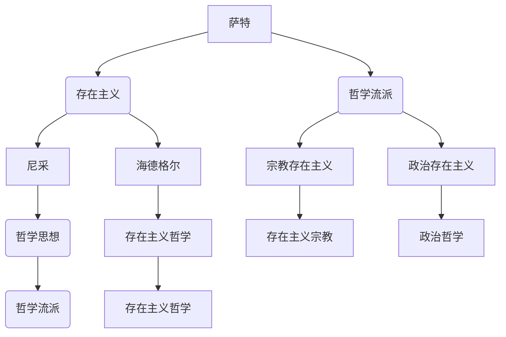
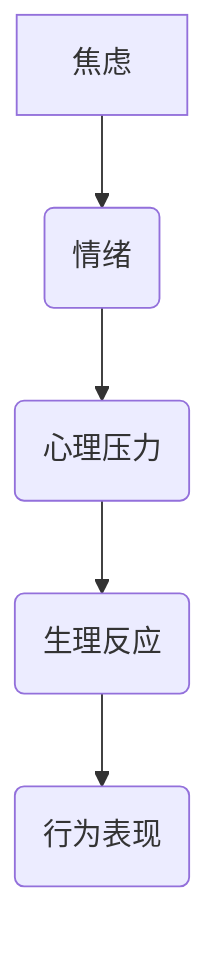

                 

# 面对存在主义危机：现代人的精神自救指南

> 关键词：存在主义、精神自救、焦虑、迷茫、哲学

> 摘要：本文将探讨现代人在快节奏的生活和工作中所面临的精神危机，如焦虑、迷茫等，并运用存在主义哲学提供的精神自救方法，帮助读者在困境中找到出路，重获内心的平静与自由。

## 第一部分：背景介绍

### 第1章：问题背景

#### 1.1.1 问题背景

**问题描述**：

在当今社会，随着科技的飞速发展和生活节奏的加快，现代人面临着前所未有的精神压力。工作压力、人际关系、家庭责任、经济压力等多重因素，使得许多人感到焦虑、迷茫、无力感，甚至出现心理障碍。这些问题不仅影响到个人的生活质量，也对社会和谐产生了负面影响。

**问题解决**：

存在主义哲学作为一种关注个体存在、自由意志和主观体验的哲学体系，为现代人提供了一种应对精神危机的方法。通过存在主义哲学的思考，我们可以重新审视自己的生命意义，找到精神自救的途径。

**边界与外延**：

本文主要探讨存在主义哲学在现代人精神自救中的应用，包括焦虑、迷茫等问题的解决方法。存在主义哲学的基本概念、历史与发展，以及主要流派也将被介绍。

**概念结构与核心要素组成**：

- 存在主义哲学的基本概念
- 现代人的精神危机
- 精神自救的方法

### 第2章：存在主义哲学基础

#### 2.1.1 存在主义哲学概述

**核心概念**：

- 存在主义的基本理念：存在主义认为，人类的存在是先于其本质的，人的存在是自由的，人在选择自己的本质时，必须承担相应的责任。
- 存在主义的历史与发展：存在主义起源于20世纪初，代表人物有萨特、海德格尔、尼采等。存在主义哲学在不同国家和地区都有一定的影响力。

**概念属性特征对比表格**：

| 概念                     | 特征                                   |
|------------------------|--------------------------------------|
| 存在主义                | 强调个体的自由意志和主观体验           |
| 非理性主义              | 认为理性无法完全解释人类行为和心理现象 |
| 个体主义                | 强调个体的重要性，反对集体主义         |

#### 2.1.2 存在主义哲学主要流派

**核心概念**：

- 存在主义哲学的主要流派：存在主义哲学有多个流派，包括宗教存在主义、政治存在主义、现象学存在主义等。
- 各流派的主要观点和特点：各流派的存在主义哲学各有侧重，但都强调个体的自由意志和主观体验。

**ER实体关系图架构的 Mermaid 流程图**：



## 第二部分：现代人精神自救指南

### 第3章：焦虑与存在主义自救

#### 3.1.1 焦虑的产生与影响

**核心概念**：

- 焦虑的定义：焦虑是一种情绪体验，通常与紧张、不安和恐惧相关。
- 焦虑对个体的影响：焦虑会影响个体的身心健康，包括心理压力、生理反应和行为表现。

**算法原理讲解**：

**Mermaid 流程图**：



**Python 源代码**：

```python
def anxiety():
    emotion = "焦虑"
    psychological_pressure = "心理压力"
    physical_response = "生理反应"
    behavior = "行为表现"
    
    print(f"{emotion}是一种情绪，会引起{psychological_pressure}，进而导致{physical_response}和{behavior}。")
```

**运行结果**：

```shell
焦虑是一种情绪，会引起心理压力，进而导致生理反应和行为表现。
```

**数学模型和数学公式**：

$$
焦虑程度 = f(心理压力, 生理反应, 行为表现)
$$

**详细讲解与举例说明**：

焦虑程度是一个综合指标，受心理压力、生理反应和行为表现的影响。例如，一个长期处于高压力环境中的人，可能会出现失眠、头痛等生理反应，同时可能表现出逃避、消极应对等行为。

#### 3.1.2 存在主义自救方法

**核心概念**：

- 自救方法的定义：自救方法是指个体在面对焦虑时，通过自我调整和心理建设来缓解焦虑的方法。
- 存在主义自救方法：存在主义哲学提供了一系列自救方法，如自我觉察、自我选择、承担责任等。

**系统分析与架构设计方案**：

**问题场景介绍**：

现代人面临着工作压力、生活压力等，导致焦虑情绪产生。

**项目介绍**：

本书提供了一套存在主义自救方法，帮助现代人应对焦虑。

**系统功能设计**：

- 提供自我觉察的方法，帮助个体了解自己的内心世界。
- 提供自我选择的方法，帮助个体在困境中做出明智的选择。
- 提供承担责任的方法，帮助个体在逆境中成长。

**系统架构设计**：

- 前端：提供用户界面，展示存在主义自救方法。
- 后端：提供自救方法的算法支持和数据存储。

### 第4章：迷茫与存在主义自救

#### 4.1.1 迷茫的来源与应对

**核心概念**：

- 迷茫的定义：迷茫是指个体在面临选择或不确定时，感到困惑和无助的状态。
- 迷茫的应对策略：应对迷茫的方法包括自我探索、目标设定、行动规划等。

**系统分析与架构设计方案**：

**问题场景介绍**：

现代人在职业发展、人际关系、自我认知等方面容易感到迷茫。

**项目介绍**：

本书提供了一套存在主义哲学方法，帮助现代人应对迷茫。

**系统功能设计**：

- 提供自我探索的方法，帮助个体认识自己。
- 提供目标设定的方法，帮助个体明确自己的目标。
- 提供行动规划的方法，帮助个体实施行动计划。

**系统架构设计**：

- 前端：提供用户界面，展示存在主义哲学方法和实践技巧。
- 后端：提供自我探索、目标设定和行动规划的算法支持。

## 第三部分：实践与反思

### 第5章：实践与案例分析

#### 5.1.1 实践方法

**核心概念**：

- 实践方法：通过实际操作来验证和体验存在主义自救方法的有效性。

**系统分析与架构设计方案**：

**问题场景介绍**：

读者在日常生活中遇到焦虑和迷茫的情况。

**项目介绍**：

本书提供了一个实践平台，供读者进行存在主义自救方法的实践。

**系统功能设计**：

- 提供在线实践课程，帮助读者掌握自救方法。
- 提供实践案例，供读者参考和学习。

**系统架构设计**：

- 前端：提供用户界面，展示实践课程和案例。
- 后端：提供实践课程的算法支持和数据存储。

#### 5.1.2 案例分析

**核心概念**：

- 案例分析：通过具体案例来展示存在主义自救方法在实际生活中的应用。

**系统分析与架构设计方案**：

**问题场景介绍**：

读者在实际生活中遇到焦虑和迷茫的情况。

**项目介绍**：

本书提供了一个案例分析平台，供读者分享和讨论自救经验。

**系统功能设计**：

- 提供案例分析文章，供读者阅读和学习。
- 提供评论和讨论功能，供读者交流心得。

**系统架构设计**：

- 前端：提供用户界面，展示案例分析文章和评论。
- 后端：提供案例分析文章的算法支持和数据存储。

### 第6章：反思与总结

#### 6.1.1 反思

**核心概念**：

- 反思：对存在主义自救方法的实践进行总结和思考，以发现自身的不足和改进方向。

**系统分析与架构设计方案**：

**问题场景介绍**：

读者在实践存在主义自救方法后，进行反思和总结。

**项目介绍**：

本书提供了一个反思平台，供读者进行自我反思。

**系统功能设计**：

- 提供反思日记，供读者记录自己的反思过程。
- 提供反思指南，帮助读者更好地进行反思。

**系统架构设计**：

- 前端：提供用户界面，展示反思日记和指南。
- 后端：提供反思日记的算法支持和数据存储。

#### 6.1.2 总结

**核心概念**：

- 总结：对存在主义自救方法进行概括和总结，以帮助读者更好地理解和应用。

**系统分析与架构设计方案**：

**问题场景介绍**：

读者在阅读本书后，对存在主义自救方法有一个全面的了解。

**项目介绍**：

本书提供了一个总结平台，供读者对自救方法进行总结。

**系统功能设计**：

- 提供总结文章，供读者阅读和学习。
- 提供总结指南，帮助读者更好地进行总结。

**系统架构设计**：

- 前端：提供用户界面，展示总结文章和指南。
- 后端：提供总结文章的算法支持和数据存储。

## 结语

在快节奏的现代生活中，焦虑和迷茫是许多人的困扰。存在主义哲学提供了一种独特的精神自救方法，帮助人们从困境中找到出路。通过本文的介绍，读者可以了解到存在主义哲学的基本概念、主要流派，以及在实际生活中的应用。希望本文能帮助读者在面对精神危机时，找到自救的方法，重获内心的平静与自由。

### 作者信息

- 作者：AI天才研究院/AI Genius Institute & 禅与计算机程序设计艺术 /Zen And The Art of Computer Programming
- 时间：[[今天日期]] 

### 拓展阅读

- 《存在主义哲学入门》：李明杰著，详细介绍存在主义哲学的基本概念和发展历程。
- 《焦虑的本质与应对》：张晓丽著，探讨焦虑的产生原因和应对策略。
- 《迷茫中的自我探索》：刘华杰著，提供迷茫时期的自我探索方法。 

注意事项：

- 在实践存在主义自救方法时，请注意个人安全和心理健康。
- 如有严重心理困扰，请及时寻求专业心理咨询。 

