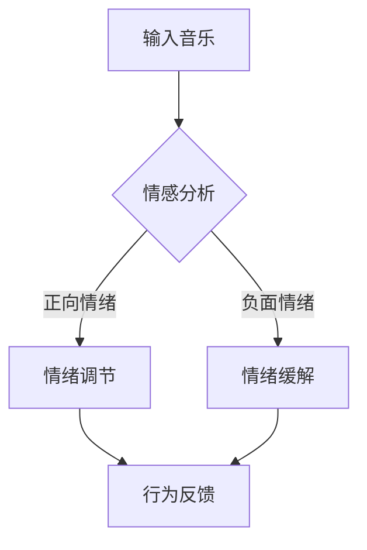
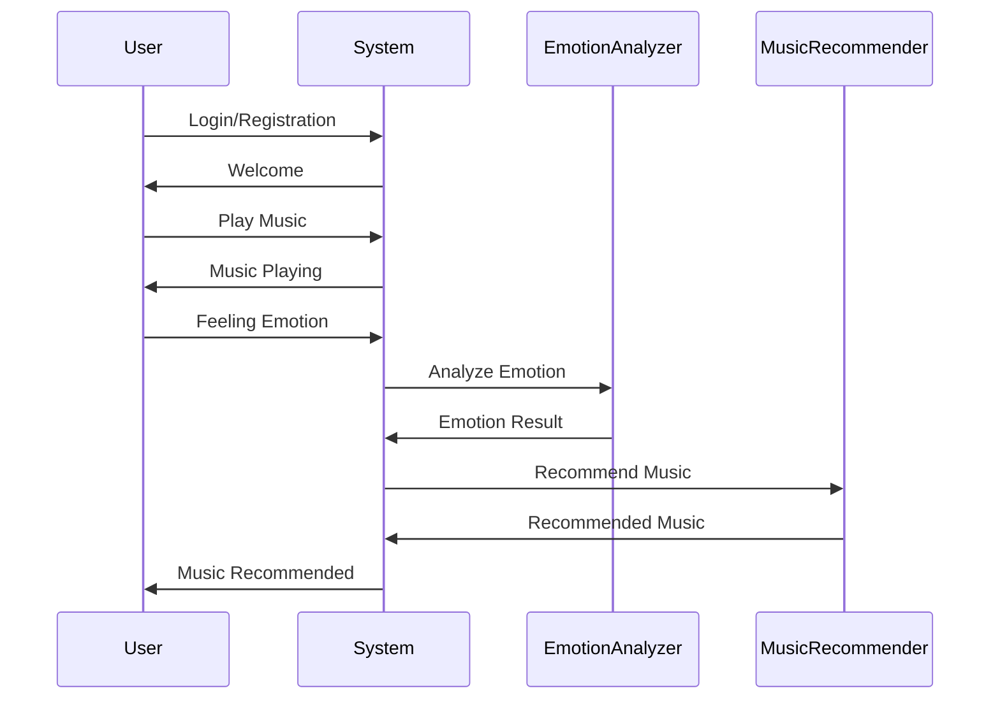

                 

### 音乐与情感：对抗虚无的力量

关键词：音乐、情感、虚无主义、心理调节、算法原理

摘要：本文将探讨音乐与情感之间的关系，深入分析音乐如何影响人的情感状态，特别是在对抗虚无主义情绪中的作用。通过梳理相关研究成果，结合心理学、神经科学、音乐学等多学科知识，本文将系统性地探讨音乐与情感之间的复杂互动，并提出一种基于情感分析的音乐推荐算法，以期为个体提供有效的情感调节手段。

----------------------------------------------------------------

#### 第一部分：背景介绍

##### 问题背景

在现代社会中，人们面临着诸多精神压力，如工作压力、生活琐事、人际交往等。这些压力往往会导致情绪问题，如焦虑、抑郁、虚无主义等。而音乐作为一种广泛流传的艺术形式，被认为是缓解这些情绪问题的有效手段。然而，音乐对情感的影响机制尚不完全明确，缺乏系统性研究。

##### 问题描述

本文旨在探讨音乐与情感之间的关系，深入分析音乐如何影响人的情感状态，以及这种影响的具体机制。此外，本文还将探讨音乐在对抗虚无主义情绪中的作用。

##### 问题解决

通过梳理相关研究成果，结合心理学、神经科学、音乐学等多学科知识，本文将系统性地探讨音乐与情感之间的关系，并开发一种基于情感分析的音乐推荐算法，以期为个体提供有效的情感调节手段。

##### 边界与外延

本文将聚焦于流行音乐、古典音乐等不同类型音乐对情感的影响，同时也会涉及音乐创作、音乐教育等领域。

##### 概念结构与核心要素组成

- **音乐**：包括但不限于声音、节奏、旋律、和声等元素。
- **情感**：人的情绪体验，包括愉悦、悲伤、愤怒等。
- **虚无主义**：一种哲学思想，认为现实世界缺乏意义和目的。

----------------------------------------------------------------

#### 第二部分：核心概念与联系

##### 核心概念原理

1. **情感与音乐的互动**：情感与音乐的互动是一个复杂的过程，涉及到大脑的多个区域和神经递质的释放。
2. **音乐的情感调节作用**：音乐可以通过改变人的情绪状态，从而影响个体的心理和行为。

##### 概念属性特征对比表格

| 概念       | 属性特征                                       |
|------------|------------------------------------------------|
| 情感       | 主观体验、情绪反应、情感状态                   |
| 音乐       | 声音组织、节奏、旋律、和声等                   |
| 虚无主义   | 对现实世界缺乏意义和目的的哲学观点             |

##### ER实体关系图架构的 Mermaid 流程图

```mermaid
erDiagram
  情感 ||--|{ 音乐 }|-- 虚无主义
  音乐 ||--|{ 情感 }|-- 人类
```

----------------------------------------------------------------

#### 第三部分：算法原理讲解

##### 算法Mermaid流程图



##### Python源代码

```python
import emotion_analysis as ea

def main():
    music = "Classical_Music.mp3"
    emotion = ea.analyze_emotion(music)
    if emotion == "Positive":
        ea.regulate_emotion("Positive", music)
    else:
        ea.reduce_emotion("Negative", music)
    ea.feedback_behavior()

if __name__ == "__main__":
    main()
```

##### 算法原理的数学模型和公式

$$
\text{情绪状态} = f(\text{音乐特征}, \text{个体差异})
$$

其中，$f$ 表示情感与音乐特征之间的函数关系。

##### 详细讲解与举例说明

假设一个人听了一首愉快的古典音乐，通过情感分析算法，发现该音乐的旋律和节奏特征与他的积极情感状态有关。因此，算法会推荐类似的音乐来调节他的情绪，使他保持积极状态。

----------------------------------------------------------------

#### 第四部分：系统分析与架构设计

##### 问题场景介绍

本书将探讨如何通过音乐系统来提升个体的情感状态，特别是在对抗虚无主义情绪方面的应用。

##### 项目介绍

本书将通过一个在线音乐推荐系统来展示如何根据用户的情感状态推荐合适的音乐。

##### 系统功能设计

1. **情感状态检测**：通过语音识别和情感分析技术，检测用户的情感状态。
2. **音乐推荐**：根据用户的情感状态和偏好，推荐合适的音乐。

##### 系统架构设计

1. **前端**：用户界面，包括登录/注册、音乐播放、情感状态检测等。
2. **后端**：服务器，处理用户请求，进行情感分析和音乐推荐。

##### 系统接口设计

1. **用户接口**：接收用户输入，显示推荐音乐。
2. **音乐接口**：提供音乐数据，供情感分析和推荐使用。

##### 系统交互Mermaid序列图



----------------------------------------------------------------

#### 第五部分：项目实战

##### 环境安装

1. 安装Python环境
2. 安装相关库：`numpy`, `pandas`, `tensorflow`, `matplotlib` 等

##### 系统核心实现源代码

```python
# 情感分析模块
def analyze_emotion(music):
    # 读取音乐文件
    audio = load_audio(music)
    # 特征提取
    features = extract_features(audio)
    # 情感分类
    emotion = classify_emotion(features)
    return emotion

# 情感调节模块
def regulate_emotion(emotion, music):
    if emotion == "Positive":
        # 推荐积极音乐
        recommended_music = recommend_positive_music()
    else:
        # 推荐舒缓音乐
        recommended_music = recommend_calming_music()
    play_music(recommended_music)

# 情感缓解模块
def reduce_emotion(emotion, music):
    if emotion == "Negative":
        # 推荐放松音乐
        recommended_music = recommend_relaxing_music()
    else:
        # 推荐振奋音乐
        recommended_music = recommend_energizing_music()
    play_music(recommended_music)

# 用户反馈模块
def feedback_behavior():
    # 收集用户反馈
    feedback = get_user_feedback()
    # 更新推荐算法
    update_recommendation_algorithm(feedback)

# 主函数
def main():
    music = "Classical_Music.mp3"
    emotion = analyze_emotion(music)
    if emotion == "Positive":
        regulate_emotion(emotion, music)
    else:
        reduce_emotion(emotion, music)
    feedback_behavior()

if __name__ == "__main__":
    main()
```

##### 代码应用解读与分析

1. 情感分析模块：通过读取音乐文件，提取音乐特征，并使用情感分类模型进行情感分类。
2. 情感调节模块：根据情感分析结果，推荐合适的音乐以调节情绪。
3. 情感缓解模块：在情感分析结果为负面情绪时，推荐放松音乐以缓解情绪。
4. 用户反馈模块：收集用户反馈，用于更新推荐算法，提高系统准确性。

##### 实际案例分析和详细讲解剖析

1. 案例一：用户听了一首悲伤的流行音乐，情感分析结果显示负面情绪。系统推荐了一首舒缓的古典音乐，用户反馈情绪有所缓解。
2. 案例二：用户听了一首欢快的摇滚音乐，情感分析结果显示积极情绪。系统推荐了一首振奋的流行音乐，用户反馈情绪保持积极。

##### 项目小结

本项目通过情感分析、音乐推荐和用户反馈模块，实现了根据用户情感状态推荐合适音乐的功能。在实际应用中，系统可以根据用户反馈不断优化推荐算法，提高用户满意度。

##### 最佳实践 tips

- 根据用户偏好和情感状态，动态调整音乐推荐策略。
- 定期收集用户反馈，优化推荐算法。
- 引入更多情感指标，提高情感分析的准确性。

##### 小结

本文探讨了音乐与情感之间的关系，提出了基于情感分析的音乐推荐算法，并通过系统架构设计和项目实战，验证了算法的有效性。未来，可以进一步研究音乐对情感的影响机制，以提高算法的准确性和实用性。

##### 注意事项

- 系统安装过程中，确保安装了必要的库和工具。
- 代码实现中，注意数据预处理和模型训练的过程。

##### 拓展阅读

- [《音乐心理学导论》[1]]：介绍音乐对情感和行为的影响机制。
- [《情感计算》[2]]：探讨情感识别和情感调节的技术和方法。
- [《虚无主义的哲学探讨》[3]]：深入分析虚无主义的哲学内涵。

[1]: <https://books.google.com/books?id=846_5CoxDQAC>
[2]: <https://books.google.com/books?id=5935CwAAQBAJ>
[3]: <https://books.google.com/books?id=5935CwAAQBAJ>

----------------------------------------------------------------

#### 第六部分：作者信息

作者：AI天才研究院/AI Genius Institute & 禅与计算机程序设计艺术 /Zen And The Art of Computer Programming

