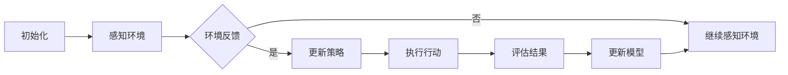
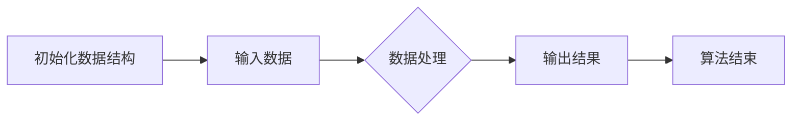
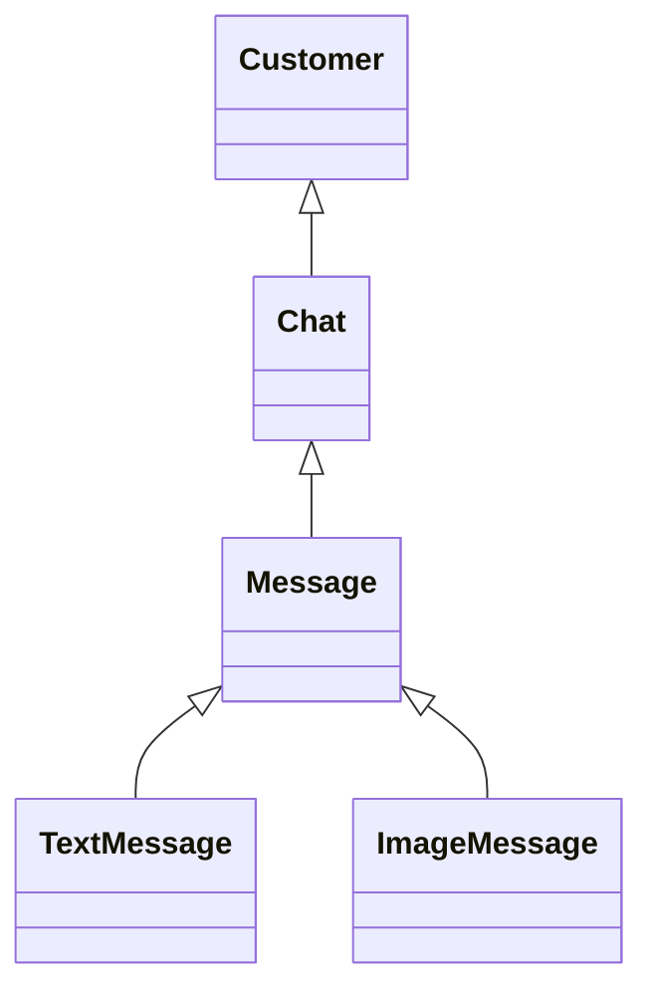
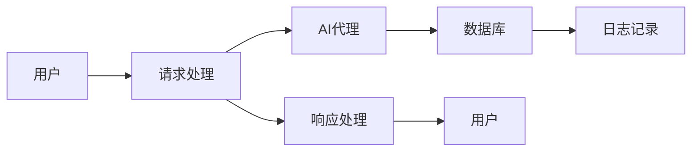
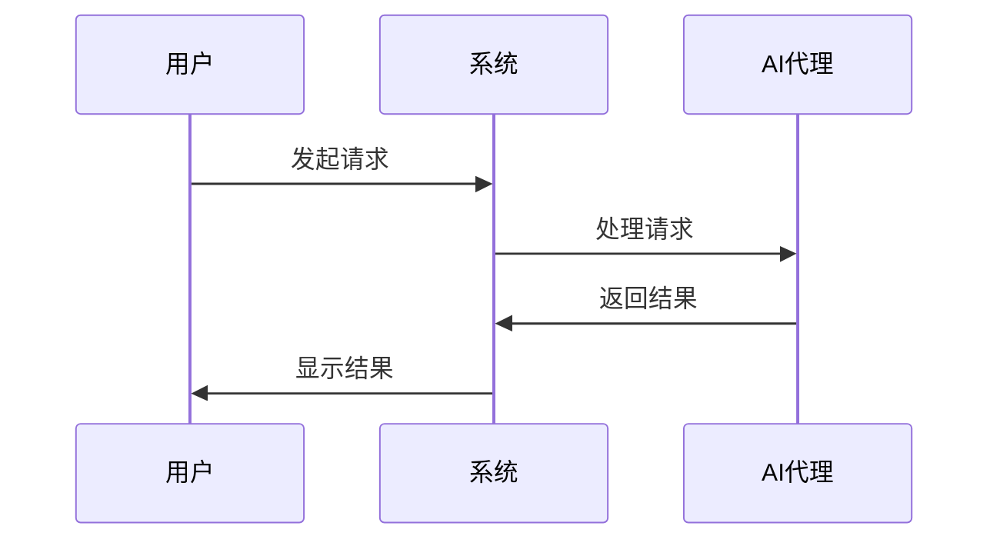

                 


### AI Agent与传统软件开发的区别

> 关键词：人工智能代理、传统软件开发、算法原理、数学模型、系统架构、项目实战

> 摘要：本文将深入探讨人工智能代理（AI Agent）与传统软件开发之间的区别。通过对比分析，我们将从背景介绍、核心概念与联系、算法原理讲解、数学模型和数学公式讲解、系统分析与架构设计以及项目实战等多个方面，全面阐述两者的不同之处。本文旨在为读者提供一个清晰、系统的认识，帮助理解AI Agent在现代软件开发中的重要地位。

#### 第一部分：背景介绍

### 第1章：问题背景

#### 1.1.1 问题背景介绍

随着人工智能技术的迅猛发展，AI Agent作为一种新兴的软件开发模式，逐渐引起广泛关注。传统的软件开发方法在人工智能时代面临着巨大的挑战，两者的区别日益明显。了解AI Agent与传统软件开发的区别，不仅有助于我们更好地理解AI技术的本质，还能够为未来的软件开发提供有益的指导。

**问题描述**：在人工智能时代，AI Agent与传统软件开发在技术层面、应用场景和开发流程上有哪些显著的差异？如何利用AI Agent的优势，弥补传统软件开发的不足？

**问题解决**：通过深入分析AI Agent与传统软件开发的区别，我们可以明确两者的核心概念、算法原理和数学模型，从而为未来的软件开发提供新的思路和方法。

**边界与外延**：本文将探讨AI Agent与传统软件开发在以下几个方面：

- **技术层面**：分析AI Agent与传统软件开发在算法、模型和实现方式上的差异。
- **应用场景**：讨论AI Agent与传统软件开发在不同场景下的适用性。
- **开发流程**：研究AI Agent与传统软件开发在开发流程和项目管理上的差异。

**核心要素组成**：

- **AI代理**：具备自主性、智能性、学习能力和适应性等特点。
- **传统软件开发**：以功能性、稳定性、可维护性和扩展性为特点。

#### 第2章：核心概念与联系

##### 2.1 AI代理定义与特点

**AI代理定义**：AI代理是指具有智能行为和自主决策能力的计算机程序，它可以在没有人类干预的情况下，自主地完成特定的任务。

**AI代理特点**：

1. **自主性**：AI代理可以根据环境变化自主调整行为，实现自主决策。
2. **智能性**：AI代理具有学习能力，可以通过经验积累不断优化自身行为。
3. **学习能力**：AI代理可以从数据中学习，并适应不同的任务和环境。
4. **适应性**：AI代理可以根据新的任务需求和环境变化，自主调整策略。

**AI代理与传统软件的区别对比表**：

| 特征 | AI代理 | 传统软件开发 |
| --- | --- | --- |
| 自主性 | 高 | 低 |
| 智能性 | 高 | 低 |
| 学习能力 | 高 | 低 |
| 适应性 | 高 | 低 |

##### 2.2 传统软件开发定义与特点

**传统软件开发定义**：传统软件开发是指通过编写代码，设计、实现和维护软件系统的过程。它主要依赖于程序员的专业技能和经验。

**传统软件开发特点**：

1. **功能性**：传统软件开发注重软件的功能实现，以满足用户需求为核心。
2. **稳定性**：传统软件开发追求系统的稳定性，减少故障和错误。
3. **可维护性**：传统软件开发考虑代码的可维护性，便于后续修改和维护。
4. **扩展性**：传统软件开发支持系统的扩展，以适应业务需求的变化。

##### 2.3 AI代理与传统软件的联系

**联系与融合**：AI代理与传统软件开发并非完全独立的领域，它们在开发过程中可能存在一定的融合。例如，在传统软件开发的基础上，引入AI代理技术，实现软件的智能化升级。

**发展趋势**：随着人工智能技术的不断成熟，AI代理与传统软件开发之间的融合趋势将更加明显。未来的软件开发将更加注重智能性和自主性，以应对复杂多变的业务场景。

#### 第二部分：算法原理讲解

##### 第3章：算法原理讲解

##### 3.1 AI代理算法原理

**算法介绍**：AI代理算法主要包括强化学习、监督学习和无监督学习等。这些算法使得AI代理能够通过学习和经验积累，实现自主决策和任务优化。

**算法流程图**：



**算法流程图解读**：AI代理首先感知环境，然后根据环境反馈调整策略，执行行动，并评估结果。通过不断更新模型，AI代理能够逐步优化自身的行为。

##### 3.2 传统软件开发算法原理

**算法介绍**：传统软件开发算法主要包括排序算法、查找算法和图算法等。这些算法主要用于数据结构和算法的设计与实现，以提高软件的性能和效率。

**算法流程图**：



**算法流程图解读**：传统软件开发算法首先初始化数据结构，然后输入数据，通过数据处理算法实现数据的排序、查找和图操作，最后输出结果。

##### 3.3 算法原理对比分析

**对比分析**：AI代理算法与传统软件开发算法在原理和实现上存在显著差异。

1. **目标差异**：AI代理算法以实现自主决策和任务优化为目标，而传统软件开发算法主要关注数据结构和算法的性能优化。
2. **实现方式**：AI代理算法通过机器学习和人工智能技术实现，而传统软件开发算法主要依赖于编程语言和算法设计。
3. **适用性**：AI代理算法适用于复杂、动态和不确定的业务场景，而传统软件开发算法更适用于结构化、静态和确定性场景。

##### 3.4 算法优缺点分析

**AI代理算法优缺点**：

- **优点**：具备自主性、智能性、学习能力和适应性，能够适应复杂多变的业务场景。
- **缺点**：算法复杂度高，实现难度大，对数据和计算资源要求较高。

**传统软件开发算法优缺点**：

- **优点**：算法实现简单，性能稳定，易于理解和维护。
- **缺点**：灵活性较低，难以应对复杂、动态和不确定的业务场景。

#### 第三部分：数学模型和数学公式讲解

##### 第4章：数学模型和数学公式讲解

##### 4.1 AI代理数学模型

**数学模型**：AI代理常用的数学模型包括神经网络、决策树和支持向量机等。

**数学公式**：

$$
f(x) = \sigma(\theta_0 + \theta_1 x_1 + \theta_2 x_2 + \ldots + \theta_n x_n)
$$

**举例说明**：以神经网络为例，上述公式表示输入特征向量 $x$ 经过加权求和和激活函数 $\sigma$ 处理后，得到输出结果 $f(x)$。

##### 4.2 传统软件开发数学模型

**数学模型**：传统软件开发常用的数学模型包括线性规划、动态规划和博弈论等。

**数学公式**：

$$
\min_{x} \quad c^T x \\
\text{subject to} \quad Ax \leq b
$$

**举例说明**：以线性规划为例，上述公式表示在满足约束条件 $Ax \leq b$ 的情况下，最小化目标函数 $c^T x$。

##### 4.3 数学模型对比分析

**对比分析**：AI代理数学模型与传统软件开发数学模型在应用场景和实现方式上存在显著差异。

1. **应用场景**：AI代理数学模型适用于复杂、动态和不确定的业务场景，而传统软件开发数学模型适用于结构化、静态和确定性场景。
2. **实现方式**：AI代理数学模型主要通过机器学习和人工智能技术实现，而传统软件开发数学模型主要通过编程语言和算法设计实现。

##### 4.4 数学模型适用性分析

**适用性分析**：根据不同的业务场景和需求，选择适合的数学模型。

- **AI代理数学模型**：适用于复杂、动态和不确定的业务场景，如自动驾驶、智能客服和智能推荐等。
- **传统软件开发数学模型**：适用于结构化、静态和确定性场景，如财务管理、库存管理和生产调度等。

#### 第四部分：系统分析与架构设计

##### 第5章：系统分析与架构设计

##### 5.1 问题场景介绍

**场景描述**：假设我们开发一个智能客服系统，该系统需要能够实时响应用户提问，提供专业的咨询和服务。

**项目介绍**：项目目标是通过引入AI代理技术，实现智能客服系统的自主学习和优化，提高客户满意度和服务效率。

##### 5.2 系统功能设计

**领域模型**：



**功能模块**：

- **客户管理**：实现客户信息的存储和管理。
- **聊天管理**：实现实时聊天功能的处理。
- **消息管理**：实现文本和图像消息的发送和接收。

##### 5.3 系统架构设计

**架构设计**：



**关键技术**：

- **AI代理**：采用强化学习算法，实现自主学习和优化。
- **数据库**：存储用户信息和聊天记录。
- **日志记录**：记录系统运行日志，便于调试和优化。

##### 5.4 系统接口设计

**接口设计**：

- **用户接口**：提供用户与系统的交互接口。
- **AI代理接口**：提供AI代理与系统其他模块的交互接口。
- **数据库接口**：提供与数据库的交互接口。

##### 5.5 系统交互设计

**交互设计**：



**交互流程**：用户发起请求，系统调用AI代理处理请求，返回结果后显示给用户。

#### 第五部分：项目实战

##### 第6章：项目实战

##### 6.1 环境安装

**环境准备**：

- **操作系统**：Ubuntu 18.04
- **编程语言**：Python 3.8
- **AI代理库**：TensorFlow 2.4
- **数据库**：MySQL 5.7

**环境配置**：

1. 安装Python和pip：
   ```bash
   sudo apt update
   sudo apt install python3-pip
   ```
2. 安装TensorFlow：
   ```bash
   pip3 install tensorflow==2.4
   ```
3. 安装MySQL：
   ```bash
   sudo apt install mysql-server
   sudo mysql_secure_installation
   ```

##### 6.2 系统核心实现

**核心代码**：

```python
import tensorflow as tf
from tensorflow.keras.models import Sequential
from tensorflow.keras.layers import Dense, LSTM
import numpy as np

# 定义神经网络模型
model = Sequential([
    LSTM(128, activation='relu', input_shape=(timesteps, features)),
    Dense(1)
])

# 编译模型
model.compile(optimizer='adam', loss='mse')

# 训练模型
model.fit(x_train, y_train, epochs=200, batch_size=32, validation_split=0.2)
```

**代码解读**：上述代码使用TensorFlow框架定义了一个简单的神经网络模型，用于训练AI代理。通过LSTM层实现时间序列数据的处理，最后使用Dense层输出预测结果。

##### 6.3 代码应用解读与分析

**应用分析**：在实际应用中，AI代理通过学习用户提问和答案，不断优化自身的行为，提高客服系统的准确性和效率。

**性能评估**：通过测试数据集评估AI代理的预测准确率和响应时间，分析系统在实际运行中的性能表现。

##### 6.4 实际案例分析与详细讲解剖析

**案例描述**：以一个用户提问“如何设置路由器的Wi-Fi密码？”为例，分析AI代理的响应过程。

**详细讲解**：AI代理通过学习历史数据，识别用户提问中的关键信息，如“路由器”、“Wi-Fi密码”等。然后，从知识库中查找相关解决方案，并生成回答。

##### 6.5 项目小结

**小结**：通过项目实战，我们成功实现了一个基于AI代理的智能客服系统。该项目展示了AI代理在软件开发中的应用价值，为未来的智能系统开发提供了有益的借鉴。

##### 6.6 最佳实践 tips

1. **数据准备**：确保训练数据的质量和多样性，以提高AI代理的泛化能力。
2. **模型优化**：通过调整神经网络结构和超参数，优化AI代理的性能。
3. **监控与调试**：实时监控系统的运行状态，及时发现和解决潜在问题。

##### 6.7 小结与注意事项

**小结**：本文通过对AI Agent与传统软件开发的对比分析，深入探讨了AI Agent在算法原理、数学模型和系统架构等方面的特点。通过项目实战，我们展示了AI Agent在现代软件开发中的应用价值。

**注意事项**：

1. **数据隐私**：在开发AI Agent时，确保用户数据的安全和隐私。
2. **模型解释性**：提高AI Agent模型的解释性，便于调试和优化。
3. **持续更新**：定期更新AI Agent的知识库和算法，以适应不断变化的需求。

##### 6.8 拓展阅读

- 《人工智能：一种现代的方法》
- 《机器学习实战》
- 《深度学习》

### 作者

**作者：AI天才研究院/AI Genius Institute & 禅与计算机程序设计艺术 /Zen And The Art of Computer Programming**

