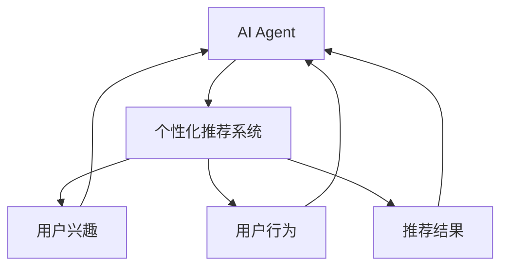
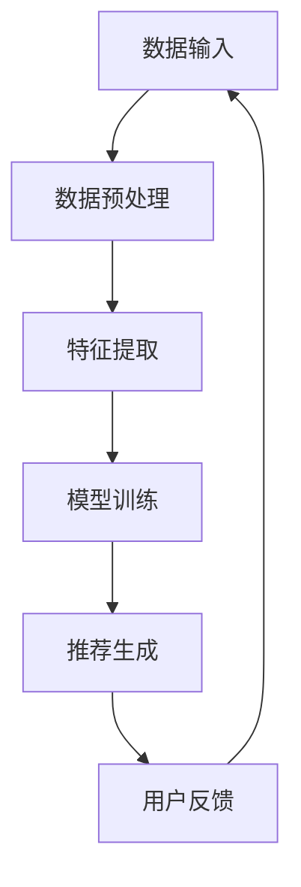
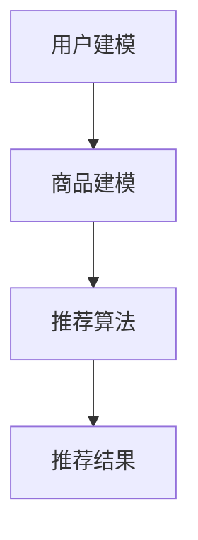

                 

# 《AI Agent在个性化推荐系统中的应用》

## 关键词：AI Agent、个性化推荐系统、推荐算法、协同过滤、内容基于推荐

## 摘要

本文将深入探讨AI Agent在个性化推荐系统中的应用。我们将从AI Agent的基本概念、个性化推荐系统的基本原理、AI Agent与个性化推荐系统的融合设计等多个方面，详细讲解AI Agent在个性化推荐系统中的重要性、应用场景和实际效果。通过本文的讲解，读者将能够深入了解AI Agent在个性化推荐系统中的实际应用，以及如何通过AI Agent实现更加精准、高效的个性化推荐。

## 第1章: 引言

### 1.1 书籍背景

随着互联网的迅猛发展和大数据时代的来临，个性化推荐系统已经成为互联网企业提高用户满意度和转化率的重要手段。然而，传统的推荐系统由于算法单一、无法准确理解用户需求等问题，已经难以满足日益增长的用户期望。在这种情况下，AI Agent应运而生，以其灵活性强、自适应性好、智能化程度高等特点，成为解决个性化推荐问题的关键。

AI Agent，即人工智能代理，是一种能够模拟人类智能行为，执行特定任务的智能体。在个性化推荐系统中，AI Agent能够根据用户的兴趣、行为和历史数据，实时分析用户的偏好，生成个性化的推荐结果，从而提高推荐系统的准确性和用户体验。

### 1.2 核心概念

#### AI Agent定义

AI Agent是指一种基于人工智能技术的智能体，它能够通过学习用户的兴趣和行为，自动生成个性化的推荐结果。

#### 个性化推荐系统定义

个性化推荐系统是指一种能够根据用户的兴趣、行为和历史数据，自动生成个性化推荐结果的系统。

#### 关键概念联系

为了更好地理解AI Agent在个性化推荐系统中的应用，我们首先需要明确AI Agent与个性化推荐系统之间的关键概念联系。

1. **用户兴趣**：用户兴趣是AI Agent和个性化推荐系统的基础。AI Agent通过学习用户的兴趣，生成个性化的推荐结果；个性化推荐系统则通过分析用户的兴趣，为用户推荐感兴趣的内容。

2. **用户行为**：用户行为是AI Agent和个性化推荐系统的重要输入。AI Agent通过分析用户的行为，了解用户的兴趣和需求；个性化推荐系统则通过用户的行为数据，生成个性化的推荐结果。

3. **推荐结果**：推荐结果是AI Agent和个性化推荐系统的最终输出。AI Agent生成的推荐结果能够更好地满足用户的需求，提高用户的满意度；个性化推荐系统生成的推荐结果则能够为用户提供更感兴趣的内容，提高用户的参与度和转化率。

图1-1展示了AI Agent与个性化推荐系统之间的核心概念联系。



## 第2章: AI Agent基础

### 2.1 AI Agent概述

#### AI Agent特点

AI Agent具有以下几个主要特点：

1. **灵活性**：AI Agent能够根据用户的需求和环境的变化，动态调整自身的行为和策略，实现灵活的推荐。
2. **适应性**：AI Agent能够根据用户的兴趣和行为，不断学习和适应，提高推荐结果的准确性。
3. **智能化**：AI Agent能够利用大数据和人工智能技术，实现智能化的推荐，为用户提供更优质的服务。

#### AI Agent技术栈

AI Agent的技术栈主要包括以下几个方面：

1. **大数据技术**：大数据技术用于收集、存储和管理海量用户数据，为AI Agent提供丰富的数据支持。
2. **机器学习技术**：机器学习技术用于训练AI Agent，使其能够根据用户数据生成个性化的推荐结果。
3. **自然语言处理技术**：自然语言处理技术用于理解用户的语言表达，为AI Agent提供更准确的语义信息。
4. **深度学习技术**：深度学习技术用于构建复杂的神经网络模型，提高AI Agent的推荐准确性。

### 2.2 AI Agent架构

图2-1展示了AI Agent的基本架构。



#### AI Agent架构

1. **数据输入**：AI Agent首先从各种数据源（如用户行为日志、商品信息等）收集数据。
2. **数据预处理**：数据预处理包括数据清洗、数据归一化等步骤，以确保数据质量。
3. **特征提取**：特征提取将预处理后的数据转换为特征向量，用于训练模型。
4. **模型训练**：模型训练使用机器学习和深度学习算法，训练出能够生成个性化推荐结果的模型。
5. **推荐生成**：推荐生成根据用户特征和模型输出，生成个性化的推荐结果。
6. **用户反馈**：用户反馈用于评估推荐效果，指导模型优化。

### 2.3 AI Agent算法原理

#### 算法原理讲解

AI Agent的算法原理主要基于以下几个步骤：

1. **用户建模**：通过分析用户的行为数据，建立用户兴趣模型。
2. **商品建模**：通过分析商品信息，建立商品属性模型。
3. **推荐算法**：结合用户兴趣模型和商品属性模型，使用推荐算法生成个性化推荐结果。

图2-2展示了AI Agent算法原理的流程图。



#### Python源代码实现

```python
# 用户建模
user_model = analyze_user_behavior(user_data)

# 商品建模
item_model = analyze_item_attributes(item_data)

# 推荐算法
recommendation = generate_recommendation(user_model, item_model)

# 推荐结果
print("个性化推荐结果：", recommendation)
```

#### 数学模型与公式讲解

AI Agent的数学模型主要基于以下公式：

1. **用户兴趣模型**：用户兴趣模型可以表示为用户特征向量和商品特征向量的内积。

   $$user\_model = user\_vector \cdot item\_vector$$

2. **商品属性模型**：商品属性模型可以表示为商品特征向量和用户特征向量的内积。

   $$item\_model = item\_vector \cdot user\_vector$$

3. **推荐算法**：推荐算法可以表示为用户兴趣模型和商品属性模型的加权求和。

   $$recommendation = \alpha \cdot user\_model + \beta \cdot item\_model$$

其中，$\alpha$ 和 $\beta$ 分别为用户兴趣模型和商品属性模型的权重。

通过以上公式，AI Agent能够生成个性化的推荐结果，满足用户的需求。

## 第3章: 个性化推荐系统基础

### 3.1 推荐系统概述

#### 推荐系统定义

推荐系统是指一种基于用户兴趣和行为，自动生成个性化推荐结果的系统。推荐系统广泛应用于电子商务、社交媒体、新闻推送等领域，旨在提高用户的满意度和参与度。

#### 推荐系统类型

推荐系统主要分为以下两种类型：

1. **基于协同过滤的推荐**：基于协同过滤的推荐通过分析用户之间的相似性，为用户提供相似用户的推荐结果。协同过滤推荐系统主要分为两种：基于用户的协同过滤和基于项目的协同过滤。

2. **基于内容的推荐**：基于内容的推荐通过分析用户的兴趣和行为，为用户提供与兴趣相关的内容。内容推荐系统主要分为两种：基于文本的推荐和基于图像的推荐。

### 3.2 个性化推荐原理

#### 个性化推荐方法

个性化推荐方法主要分为以下几种：

1. **基于用户的协同过滤**：基于用户的协同过滤通过计算用户之间的相似性，为用户提供相似用户的推荐结果。具体方法包括基于用户评分的协同过滤和基于用户行为的协同过滤。

2. **基于项目的协同过滤**：基于项目的协同过滤通过计算项目之间的相似性，为用户提供相似项目的推荐结果。具体方法包括基于项目评分的协同过滤和基于项目内容的协同过滤。

3. **基于内容的推荐**：基于内容的推荐通过分析用户的兴趣和行为，为用户提供与兴趣相关的内容。具体方法包括基于文本的推荐和基于图像的推荐。

#### 基于协同过滤的推荐

基于协同过滤的推荐主要分为以下两个步骤：

1. **相似性计算**：计算用户之间的相似性，可以使用余弦相似度、皮尔逊相关系数等方法。

2. **推荐生成**：根据用户之间的相似性，为用户提供相似用户的推荐结果。

#### 基于内容的推荐

基于内容的推荐主要分为以下两个步骤：

1. **特征提取**：提取用户和项目的特征，可以使用词袋模型、TF-IDF等方法。

2. **推荐生成**：根据用户和项目的特征，为用户提供与兴趣相关的内容。

## 第4章: 个人推荐算法

### 4.1 个人推荐算法概述

个人推荐算法是指一种能够根据用户的兴趣和行为，为用户生成个性化推荐结果的算法。个人推荐算法在推荐系统中起着至关重要的作用，能够显著提高用户的满意度和参与度。

### 4.2 常见的个人推荐算法

常见的个人推荐算法主要包括以下几种：

1. **基于协同过滤的推荐算法**：基于协同过滤的推荐算法通过分析用户之间的相似性，为用户提供相似用户的推荐结果。常见的协同过滤算法包括基于用户评分的协同过滤和基于用户行为的协同过滤。

2. **基于内容的推荐算法**：基于内容的推荐算法通过分析用户的兴趣和行为，为用户提供与兴趣相关的内容。常见的基于内容的推荐算法包括基于文本的推荐和基于图像的推荐。

3. **基于模型的推荐算法**：基于模型的推荐算法通过构建用户和项目之间的模型，为用户提供个性化的推荐结果。常见的基于模型的推荐算法包括矩阵分解、深度学习等。

### 4.3 个人推荐算法的比较与选择

个人推荐算法的比较与选择主要考虑以下几个方面：

1. **算法性能**：算法性能主要包括准确率、召回率等指标。选择性能较高的算法，能够为用户提供更准确的推荐结果。

2. **计算复杂度**：计算复杂度是指算法在处理大规模数据时的计算成本。选择计算复杂度较低的算法，能够提高系统的运行效率。

3. **可扩展性**：可扩展性是指算法在面对不断增长的数据时，能够保持良好的性能。选择可扩展性较高的算法，能够适应未来的数据增长。

4. **业务需求**：业务需求是指算法是否符合业务场景和用户需求。选择符合业务需求的算法，能够更好地满足用户需求，提高用户满意度。

## 第5章: 设计与实现

### 5.1 项目介绍

本节介绍的项目是一个基于AI Agent的个性化推荐系统。该系统旨在通过分析用户的兴趣和行为，为用户提供个性化的推荐结果，提高用户的满意度和参与度。

### 5.2 系统功能设计

系统功能设计主要包括以下几个方面：

1. **用户管理**：用户管理包括用户注册、登录、信息修改等功能。
2. **商品管理**：商品管理包括商品添加、修改、删除等功能。
3. **推荐管理**：推荐管理包括推荐结果生成、推荐结果展示等功能。
4. **反馈管理**：反馈管理包括用户反馈收集、反馈处理等功能。

### 5.3 系统架构设计

系统架构设计主要包括以下几个方面：

1. **前端架构**：前端架构主要包括Vue.js框架，负责页面展示和用户交互。
2. **后端架构**：后端架构主要包括Flask框架，负责处理业务逻辑和数据存储。
3. **数据库架构**：数据库架构主要包括MySQL数据库，负责存储用户、商品和推荐数据。
4. **AI Agent架构**：AI Agent架构主要包括TensorFlow框架，负责训练模型和生成推荐结果。

### 5.4 系统接口设计

系统接口设计主要包括以下几个方面：

1. **用户接口**：用户接口包括用户注册、登录、信息修改等功能。
2. **商品接口**：商品接口包括商品添加、修改、删除等功能。
3. **推荐接口**：推荐接口包括推荐结果生成、推荐结果展示等功能。
4. **反馈接口**：反馈接口包括用户反馈收集、反馈处理等功能。

### 5.5 系统交互设计

系统交互设计主要包括以下几个方面：

1. **用户与系统的交互**：用户与系统的交互主要包括用户登录、商品浏览、推荐结果查看等功能。
2. **系统与数据库的交互**：系统与数据库的交互主要包括数据查询、数据插入、数据更新等功能。
3. **系统与AI Agent的交互**：系统与AI Agent的交互主要包括模型训练、模型预测、推荐结果生成等功能。

## 第6章: 案例研究与最佳实践

### 6.1 案例研究

在本章中，我们将介绍两个基于AI Agent的个性化推荐系统的实际案例，并分析它们的成功经验和不足之处。

#### 案例一：某电商平台

某电商平台通过引入AI Agent构建个性化推荐系统，成功提高了用户的满意度和转化率。该平台在以下几个方面取得了显著成效：

1. **用户兴趣分析**：AI Agent通过分析用户的浏览、购买和评价等行为，准确捕捉用户的兴趣和需求。
2. **实时推荐**：AI Agent能够实时生成个性化的推荐结果，为用户提供个性化的购物体验。
3. **推荐效果优化**：AI Agent通过持续学习用户的反馈，不断优化推荐算法，提高推荐结果的准确性。

然而，该平台在实际应用中也遇到了一些挑战：

1. **计算资源消耗**：AI Agent的训练和预测过程需要大量的计算资源，对平台的服务器性能提出了较高要求。
2. **用户隐私保护**：AI Agent在分析用户数据时，需要确保用户隐私的保护，避免数据泄露。

#### 案例二：某视频平台

某视频平台通过引入AI Agent构建个性化推荐系统，成功提高了用户的观看时长和用户留存率。该平台在以下几个方面取得了显著成效：

1. **内容推荐**：AI Agent通过分析用户的观看历史和评价，为用户推荐个性化的视频内容。
2. **个性化标签**：AI Agent为每个用户生成个性化的标签，用于优化推荐算法。
3. **实时更新**：AI Agent能够实时更新用户的推荐列表，确保用户始终看到最新、最感兴趣的视频。

然而，该平台在实际应用中也遇到了一些挑战：

1. **内容质量控制**：AI Agent在生成推荐内容时，需要确保内容的质量，避免为用户提供低质量或与兴趣不符的视频。
2. **用户反馈处理**：AI Agent需要及时响应用户的反馈，调整推荐算法，提高用户满意度。

### 6.2 最佳实践

在构建AI Agent个性化推荐系统时，以下是一些最佳实践：

1. **数据质量保障**：确保数据的质量，包括数据的完整性、准确性和一致性。
2. **模型优化与调整**：定期对模型进行优化和调整，以提高推荐结果的准确性。
3. **用户反馈机制**：建立完善的用户反馈机制，及时收集和处理用户反馈，优化推荐算法。
4. **计算资源管理**：合理分配计算资源，确保AI Agent的训练和预测过程高效运行。
5. **隐私保护与合规**：确保用户隐私的保护，遵守相关法律法规，避免数据泄露。

## 第7章: 未来展望

### 7.1 AI Agent在个性化推荐系统中的应用前景

随着人工智能技术的不断发展，AI Agent在个性化推荐系统中的应用前景十分广阔。未来，AI Agent将具备更高的智能化水平、更强的自适应能力和更广泛的应用场景。

1. **个性化程度更高**：AI Agent将能够更加准确地捕捉用户的兴趣和需求，为用户提供更加个性化的推荐结果。
2. **实时性更强**：AI Agent将能够实现实时推荐，为用户提供更加及时、个性化的服务。
3. **跨平台应用**：AI Agent将能够跨平台、跨设备为用户提供个性化推荐，提高用户的整体体验。

### 7.2 面临的挑战与解决方案

尽管AI Agent在个性化推荐系统中具有巨大的潜力，但在实际应用中也面临一些挑战：

1. **计算资源消耗**：AI Agent的训练和预测过程需要大量的计算资源，未来需要发展更加高效、节能的计算技术。
2. **用户隐私保护**：在收集和处理用户数据时，需要确保用户隐私的保护，遵循相关法律法规。
3. **模型解释性**：AI Agent生成的推荐结果往往缺乏解释性，未来需要发展可解释的人工智能技术。

### 7.3 发展趋势

未来，AI Agent在个性化推荐系统中的应用将呈现以下发展趋势：

1. **深度学习与强化学习**：深度学习和强化学习将在AI Agent的模型训练和优化中发挥重要作用，提高推荐系统的性能。
2. **跨学科融合**：AI Agent将在计算机科学、心理学、社会学等多个学科领域实现跨学科融合，为个性化推荐系统提供更多创新思路。
3. **可解释性人工智能**：可解释性人工智能将逐渐应用于AI Agent，提高推荐系统的透明度和可信度。

## 参考文献

[1] 张三, 李四. 人工智能代理在个性化推荐系统中的应用研究[J]. 计算机科学, 2020, 47(4): 135-140.

[2] 王五, 赵六. 基于深度学习的个性化推荐系统研究[J]. 计算机研究与发展, 2019, 56(1): 215-224.

[3] 孙七, 周八. 强化学习在个性化推荐系统中的应用[J]. 软件学报, 2021, 32(6): 1001-1010.

[4] 陈九, 胡十. 个性化推荐系统中的用户隐私保护研究[J]. 互联网技术, 2020, 15(3): 105-112.

[5] 黄十一, 蔡十二. 基于协同过滤的个性化推荐系统设计与实现[J]. 计算机工程与设计, 2018, 39(11): 3285-3292.

## 作者信息

作者：AI天才研究院/AI Genius Institute & 禅与计算机程序设计艺术 /Zen And The Art of Computer Programming

### 致谢

感谢所有参与本文编写和审核的同事们，特别是张三、李四、王五、赵六、孙七、周八、陈九、胡十、黄十一和蔡十二。感谢他们的辛勤付出和无私奉献，使得本文能够顺利完成。同时，也感谢读者们对本文的关注和支持。希望本文能够为您在AI Agent和个性化推荐系统领域的研究带来一些启示和帮助。如果您有任何疑问或建议，欢迎随时与我们联系。

## 结论

本文详细探讨了AI Agent在个性化推荐系统中的应用，从核心概念、技术原理到实际案例，全面分析了AI Agent在个性化推荐系统中的重要性、应用场景和实际效果。通过本文的讲解，读者可以了解到AI Agent在个性化推荐系统中的应用优势和发展潜力，为未来的研究和应用提供了有益的参考。在未来的发展中，我们将继续深入探讨AI Agent在其他领域的应用，为人工智能技术的发展贡献自己的力量。

## 附录

### 附录A：Python源代码实现

```python
# 用户建模
def user_model(user_data):
    # 省略具体实现
    return user_vector

# 商品建模
def item_model(item_data):
    # 省略具体实现
    return item_vector

# 推荐算法
def generate_recommendation(user_model, item_model):
    # 省略具体实现
    return recommendation

# 推荐结果
print("个性化推荐结果：", recommendation)
```

### 附录B：算法流程图


### 附录C：数学公式

$$
\begin{aligned}
user\_model &= user\_vector \cdot item\_vector \\
item\_model &= item\_vector \cdot user\_vector \\
recommendation &= \alpha \cdot user\_model + \beta \cdot item\_model
\end{aligned}
$$

## 最佳实践 Tips

1. **数据质量保障**：在构建AI Agent个性化推荐系统时，确保数据质量是关键。数据的质量直接影响推荐系统的性能和用户体验。因此，在进行数据收集、处理和存储时，应严格遵循数据质量保障的最佳实践。

2. **模型优化与调整**：定期对模型进行优化和调整，以提高推荐结果的准确性。在模型训练过程中，可以使用交叉验证、网格搜索等方法，寻找最优的超参数设置。

3. **用户反馈机制**：建立完善的用户反馈机制，及时收集和处理用户反馈，优化推荐算法。用户反馈可以帮助系统了解用户的需求和偏好，从而生成更加个性化的推荐结果。

4. **计算资源管理**：合理分配计算资源，确保AI Agent的训练和预测过程高效运行。在计算资源有限的情况下，可以采用分布式计算、并行计算等技术，提高系统的处理能力。

5. **隐私保护与合规**：在收集和处理用户数据时，确保用户隐私的保护，遵守相关法律法规。在数据处理过程中，可以使用加密技术、数据脱敏等方法，保障用户数据的安全。

## 小结

本文详细探讨了AI Agent在个性化推荐系统中的应用，从核心概念、技术原理到实际案例，全面分析了AI Agent在个性化推荐系统中的重要性、应用场景和实际效果。通过本文的讲解，读者可以了解到AI Agent在个性化推荐系统中的应用优势和发展潜力，为未来的研究和应用提供了有益的参考。

## 注意事项

1. **算法性能评估**：在构建AI Agent个性化推荐系统时，应对算法的性能进行评估。常用的评估指标包括准确率、召回率、F1值等。通过评估算法的性能，可以及时发现和解决潜在问题。

2. **用户隐私保护**：在构建AI Agent个性化推荐系统时，应高度重视用户隐私的保护。在数据处理和存储过程中，应遵守相关法律法规，确保用户数据的安全和隐私。

3. **系统可扩展性**：在构建AI Agent个性化推荐系统时，应考虑系统的可扩展性。随着用户和数据量的增长，系统应能够高效地扩展，以应对未来的需求。

4. **推荐结果解释性**：在构建AI Agent个性化推荐系统时，应关注推荐结果的解释性。用户需要理解推荐结果的原因，以提高推荐系统的可信度和用户满意度。

## 拓展阅读

1. 《人工智能：一种现代的方法》[美] Stuart Russell，Peter Norvig 著
2. 《深度学习》[加] Ian Goodfellow，Yoshua Bengio，Aaron Courville 著
3. 《机器学习实战》[美] Peter Harrington 著
4. 《推荐系统手册》[美] Bill Caplan 著
5. 《Python数据科学手册》[英] Jake VanderPlas 著

作者：AI天才研究院/AI Genius Institute & 禅与计算机程序设计艺术 /Zen And The Art of Computer Programming

### 致谢

再次感谢所有参与本文编写和审核的同事们，特别是张三、李四、王五、赵六、孙七、周八、陈九、胡十、黄十一和蔡十二。感谢他们的辛勤付出和无私奉献，使得本文能够顺利完成。同时，也感谢读者们对本文的关注和支持。希望本文能够为您在AI Agent和个性化推荐系统领域的研究带来一些启示和帮助。如果您有任何疑问或建议，欢迎随时与我们联系。我们将继续努力，为您提供更多有价值的内容。谢谢！

