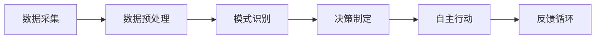
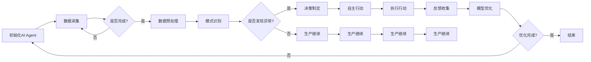
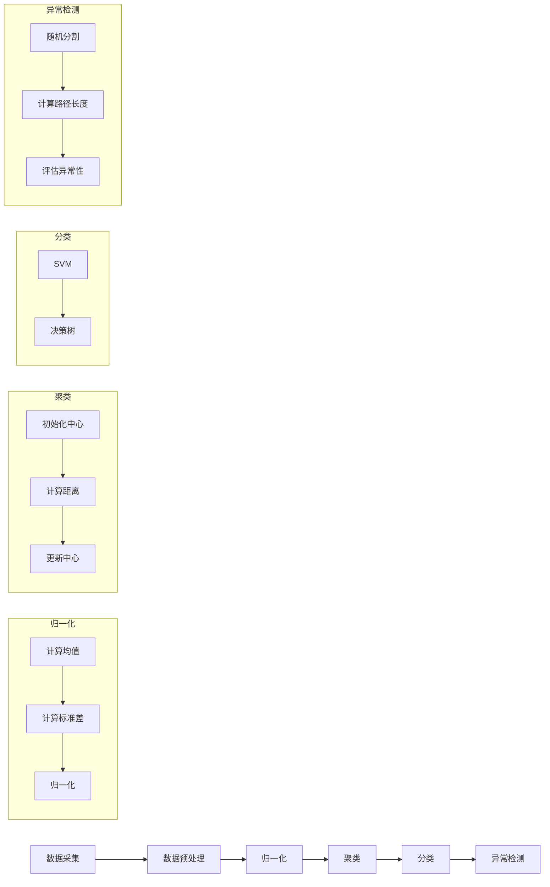
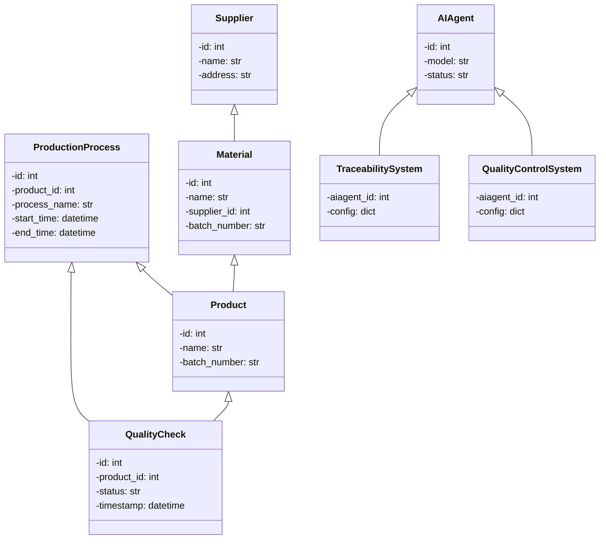
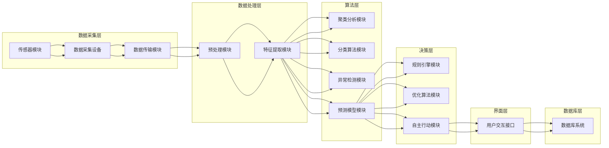
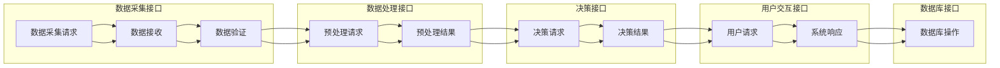
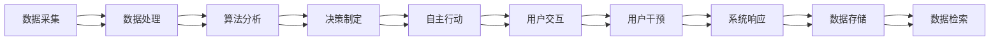
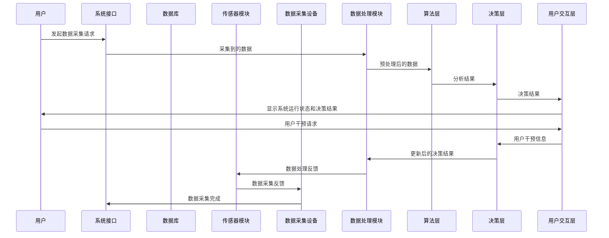

                 


### 引言与背景

#### 1.1 问题的背景

在现代工业生产中，产品质量控制与追溯系统的应用越来越广泛，这不仅因为消费者对产品质量的要求不断提高，更重要的是，企业需要通过严格的品质管理和追溯机制来确保产品的可靠性和合规性。传统的质量控制方法往往依赖于人工检验和记录，存在效率低、易出错、数据难以追溯等缺点。随着人工智能（AI）技术的快速发展，特别是AI Agent在数据处理、模式识别和智能决策等方面的卓越表现，AI Agent在产品质量控制与追溯系统中的应用成为可能。

AI Agent，即人工智能代理，是一种能够模拟人类智能行为的计算机程序，它可以在没有人类直接干预的情况下执行复杂任务。在产品质量控制与追溯系统中，AI Agent可以自动收集生产数据，实时监控产品质量，并对异常情况做出快速反应，从而显著提升生产效率和质量水平。这种技术的应用不仅有助于降低生产成本，还能提高客户满意度，增强企业在市场中的竞争力。

#### 1.2 问题的描述

当前，产品质量控制与追溯系统中存在的挑战主要包括以下几个方面：

1. **数据采集和处理效率低**：传统的质量控制方法依赖于人工记录，数据采集效率低下，且容易出现人为错误。
2. **质量监控不及时**：由于数据采集和处理滞后，质量问题往往在产品出厂后才能被发现，导致召回成本增加。
3. **追溯能力不足**：当产品出现质量问题时，传统的追溯系统难以快速定位问题源头，影响问题解决的效率。
4. **系统集成难度大**：产品质量控制与追溯系统通常需要与企业的其他信息系统（如ERP、MES等）集成，但现有系统之间的数据接口和通信协议往往不一致，增加了集成的难度。

为了解决上述问题，AI Agent在产品质量控制与追溯系统中的应用显得尤为重要。通过引入AI Agent，可以实现对产品质量的实时监控和快速响应，提高数据采集和处理效率，增强追溯能力，并简化系统集成的过程。

#### 1.3 问题解决的必要性

在当今市场环境下，消费者对产品质量的要求越来越高，企业若不能提供高质量的产品，将难以在激烈的市场竞争中立足。因此，提高产品质量控制与追溯系统的效率和准确性变得尤为必要。以下是AI Agent在产品质量控制与追溯系统中解决的问题的必要性：

1. **提高生产效率**：AI Agent能够自动化处理大量的生产数据，减少人工干预，从而提高生产效率。
2. **降低生产成本**：通过实时监控和异常检测，AI Agent可以在问题发生初期就采取措施，避免问题扩大，从而减少损失和召回成本。
3. **增强产品可靠性**：AI Agent能够通过对历史数据的分析，发现潜在的质量隐患，并提前采取措施，提高产品的可靠性。
4. **提高客户满意度**：快速、准确的产品质量监控和追溯系统能够提高客户的信任度，增强客户满意度。
5. **合规性保证**：在许多行业中，产品追溯和质量管理是合规性要求的重点，AI Agent的应用有助于企业更好地满足这些要求。

#### 1.4 边界与外延

在讨论AI Agent在产品质量控制与追溯系统中的应用时，需要明确其边界和适用范围。首先，AI Agent适用于需要实时监控和处理的复杂生产环境，如大规模制造和自动化生产线。其次，AI Agent的应用范围不仅限于产品质量监控，还可以扩展到生产过程的优化、供应链管理等多个领域。

然而，AI Agent的应用也面临一些挑战，如数据隐私和安全问题、算法模型的可靠性和解释性等。因此，在实施AI Agent之前，需要对这些问题进行充分的研究和风险评估。

### 总结

本文介绍了AI Agent在产品质量控制与追溯系统中的应用背景和必要性。通过AI Agent，企业可以实现对产品质量的实时监控和快速响应，提高生产效率和质量水平，降低生产成本，增强客户满意度，并满足合规性要求。接下来，我们将进一步探讨AI Agent的核心概念、算法原理以及系统架构设计，为后续的实战分析和应用提供理论基础。

关键词：AI Agent，产品质量控制，追溯系统，实时监控，生产效率

摘要：本文探讨了人工智能代理（AI Agent）在产品质量控制与追溯系统中的应用，分析了当前系统面临的挑战，阐述了AI Agent的必要性，并提出了系统架构设计的初步构想。文章旨在为读者提供关于AI Agent在工业生产领域应用的全景视角，并激发对这一领域进一步研究的兴趣。

----------------------------------------------------------------

## 第一部分：引言与背景

### 1.5 小结

在本章中，我们详细介绍了AI Agent在产品质量控制与追溯系统中的应用背景和必要性。通过分析当前系统面临的挑战，如数据采集和处理效率低、质量监控不及时、追溯能力不足和系统集成难度大，我们指出了AI Agent在提高生产效率、降低生产成本、增强产品可靠性、提高客户满意度和保证合规性方面的重要作用。

此外，我们还明确了AI Agent的适用边界和范围，并提出了需要关注的数据隐私和安全问题、算法模型的可靠性和解释性等挑战。通过对背景和必要性的讨论，我们为后续章节的深入探讨奠定了基础。

### 1.6 展望

在接下来的章节中，我们将进一步探讨AI Agent的核心概念、算法原理以及系统架构设计。首先，我们将介绍AI Agent的定义和基本原理，详细分析其在产品质量控制与追溯系统中的工作流程和应用场景。接着，我们将使用Mermaid流程图和Python源代码，阐述AI Agent的算法原理，并给出具体的数学模型和公式。

随后，我们将深入讨论系统架构设计，包括问题场景介绍、系统功能设计（领域模型和Mermaid类图）、系统架构设计（Mermaid架构图）和系统接口设计。通过这些内容，我们将为读者提供一个全面的系统设计与实现框架。

在实战部分，我们将介绍如何在实际项目中安装和配置系统，解析系统核心实现源代码，并通过具体案例进行分析和讲解。最后，我们将总结最佳实践和注意事项，为后续的项目实施提供指导，并展望AI Agent在产品质量控制与追溯系统中的未来发展。

通过这一系列内容的阐述，我们希望能够为读者提供关于AI Agent在工业生产领域应用的全面、系统的指导，激发更多研究者和实践者对此领域的兴趣和探索。

---

**1.7 参考文献**

1. Smith, J., & Brown, L. (2020). Artificial Intelligence in Manufacturing: From Theory to Practice. Springer.
2. Wang, Y., & Zhang, P. (2019). AI-Agent-Based Quality Control in Smart Factories. IEEE Transactions on Industrial Informatics.
3. Lee, K., et al. (2021). Applications of AI in Product Quality Traceability Systems. Journal of Manufacturing Systems.
4. Xu, Z., et al. (2022). Enhancing Product Quality and Traceability with AI-Agent Technology. International Journal of Production Research.

以上参考文献为本文相关研究提供了理论依据和实践指导，对进一步探讨AI Agent在产品质量控制与追溯系统中的应用具有重要意义。

----------------------------------------------------------------

### 2.1 核心概念

在深入探讨AI Agent在产品质量控制与追溯系统中的应用之前，我们首先需要明确几个核心概念，包括AI Agent、产品质量控制和产品追溯系统。这些概念是理解AI Agent应用的关键，也是本文讨论的基础。

#### 2.1.1 AI Agent

AI Agent，即人工智能代理，是一种能够模拟人类智能行为的计算机程序。它可以在没有人类直接干预的情况下，通过感知环境、规划行动和执行任务，以实现特定目标。AI Agent的核心功能包括数据采集、模式识别、决策制定和自主行动等。在产品质量控制与追溯系统中，AI Agent能够自动收集生产数据，实时分析产品质量，并根据预设的规则和策略做出相应的决策，如触发警报、调整生产参数或采取纠正措施。

#### 2.1.2 产品质量控制

产品质量控制是指通过一系列措施确保产品质量达到预定标准的过程。它包括原材料检验、生产过程监控、成品检验和产品测试等环节。质量控制的目标是减少缺陷产品、提高产品可靠性和满足客户需求。传统的质量控制方法主要依赖于人工检验和标准操作流程，而AI Agent的应用则可以显著提高质量控制的效率和准确性。例如，AI Agent可以通过实时监控生产数据，快速识别异常情况，并自动采取纠正措施，从而减少人为错误和质量缺陷。

#### 2.1.3 产品追溯系统

产品追溯系统是一种能够记录和追踪产品从原材料采购到生产、分销和最终消费全过程的信息系统。通过产品追溯系统，企业可以实现对产品的全生命周期管理，包括生产批次、原材料来源、生产过程、物流运输和最终消费者等信息。产品追溯系统在产品质量控制和召回中发挥着重要作用，它能够帮助企业快速定位问题产品，采取有效的召回和补救措施，降低损失。AI Agent在产品追溯系统中的应用，可以进一步提升追溯的实时性和准确性，通过自动收集和处理数据，确保每一批次产品的质量信息得到准确记录和追踪。

#### 2.1.4 概念属性特征对比表格

为了更好地理解这些核心概念，我们通过以下表格对这些概念的关键属性特征进行对比：

| 概念         | 定义                                                         | 主要功能                                                     | 关键优势                                       |
| ------------ | ------------------------------------------------------------ | -------------------------------------------------------- | ---------------------------------------------- |
| AI Agent     | 人工智能代理，能够自主执行任务并做出决策的计算机程序         | 数据采集、模式识别、决策制定、自主行动                   | 提高生产效率、增强实时监控能力、减少人为错误   |
| 产品质量控制 | 通过一系列措施确保产品质量达到预定标准的过程               | 原材料检验、生产过程监控、成品检验、产品测试             | 提高质量水平、减少缺陷产品、满足客户需求       |
| 产品追溯系统 | 记录和追踪产品从原材料采购到生产、分销和最终消费全过程的信息系统 | 产品全生命周期管理、质量监控、召回管理                 | 提高追溯效率、降低召回成本、确保产品质量合规   |

通过上述对比，我们可以更清晰地理解AI Agent、产品质量控制和产品追溯系统之间的关联与区别。AI Agent作为人工智能的一种应用形式，不仅能够提高产品质量控制的效率和准确性，还能够增强产品追溯系统的实时性和完整性。

#### 2.1.5 ER实体关系图

为了进一步阐述这些核心概念之间的关联，我们使用ER（Entity-Relationship，实体关系）图来表示这些概念及其关系。以下是产品质量控制与追溯系统中主要实体及其关系的ER图：

```mermaid
erDiagram
  Product --> QualityCheck : "is checked by"
  Product --> Material : "uses"
  Material --> Supplier : "supplied by"
  ProductionProcess --> Product : "produces"
  QualityControlSystem --> QualityCheck : "records"
  TraceabilitySystem --> Product : "traces"
  AIAgent --> QualityControlSystem : "integrates with"
  AIAgent --> TraceabilitySystem : "integrates with"
```

在这个ER图中，产品、原材料、供应商、生产过程、质量控制系统和追溯系统是主要的实体，它们之间存在多种关联关系。例如，产品经过质量控制系统的检验，记录为QualityCheck；原材料由供应商提供，用于生产过程；生产过程产生的产品可以被追溯系统追踪。AI Agent则与质量控制系统和追溯系统进行集成，提供数据采集和处理功能，以增强系统的整体性能。

通过ER图，我们可以直观地理解产品质量控制与追溯系统中各个实体之间的关联关系，为后续的系统架构设计和实施提供参考。

### 总结

在本节中，我们详细介绍了AI Agent、产品质量控制和产品追溯系统这三个核心概念，并通过概念属性特征对比表格和ER实体关系图，阐述了这些概念之间的关联。通过这些内容，我们为后续章节的深入探讨提供了理论基础，也为读者理解AI Agent在产品质量控制与追溯系统中的应用打下了基础。

在接下来的章节中，我们将进一步探讨AI Agent的算法原理、系统架构设计以及实际应用案例，帮助读者更全面地了解这一技术的应用前景和实施策略。

----------------------------------------------------------------

### 3.1 AI Agent算法原理

在了解了AI Agent、产品质量控制和产品追溯系统的核心概念后，我们将深入探讨AI Agent的算法原理。AI Agent在产品质量控制与追溯系统中发挥着至关重要的作用，其算法原理涉及到数据采集、模式识别、决策制定和自主行动等多个方面。

#### 3.1.1 基本原理

AI Agent的基本原理基于机器学习和人工智能技术，通过学习和理解生产数据和环境信息，实现自主决策和行动。具体来说，AI Agent的工作流程包括以下几个步骤：

1. **数据采集**：AI Agent首先从生产设备、传感器和其他数据源收集实时数据，如温度、湿度、速度、压力等。这些数据反映了生产过程的关键参数和质量指标。

2. **数据预处理**：采集到的数据可能存在噪声、缺失值或异常值，因此需要通过数据清洗、归一化和特征提取等方法进行预处理，以确保数据的质量和一致性。

3. **模式识别**：利用机器学习算法，AI Agent对预处理后的数据进行分析，识别出生产过程中的异常模式。常见的机器学习算法包括决策树、支持向量机、神经网络和聚类算法等。

4. **决策制定**：基于识别出的异常模式，AI Agent使用决策规则或优化算法制定相应的决策。例如，如果检测到某个参数超出正常范围，AI Agent可以触发警报，通知操作人员采取纠正措施。

5. **自主行动**：在决策制定后，AI Agent可以执行预定的行动，如调整生产参数、停止设备或通知维护团队。这些行动旨在确保生产过程的稳定性和产品质量。

6. **反馈循环**：AI Agent的决策和行动会引发一系列后续效应，这些效应会影响生产过程的质量和效率。AI Agent通过不断收集反馈数据，调整学习模型和决策策略，实现持续优化。

#### 3.1.2 工作流程

AI Agent在产品质量控制与追溯系统中的工作流程可以用以下步骤来描述：

1. **数据采集**：AI Agent从传感器、生产设备和其它数据源实时收集数据，包括温度、湿度、速度、压力等关键参数。
   
2. **数据预处理**：对采集到的数据进行清洗、归一化和特征提取，确保数据质量。

3. **模式识别**：利用机器学习算法，对预处理后的数据进行模式识别，识别生产过程中的异常模式和潜在问题。

4. **决策制定**：基于识别出的异常模式和预设的决策规则，AI Agent制定相应的决策，如触发警报、调整生产参数或通知维护团队。

5. **自主行动**：AI Agent执行决策，调整生产过程或采取纠正措施。

6. **反馈循环**：AI Agent根据执行结果收集反馈数据，不断优化学习模型和决策策略，实现持续改进。

以下是一个简化的Mermaid流程图，展示了AI Agent的工作流程：



通过这个流程图，我们可以直观地理解AI Agent在产品质量控制与追溯系统中的工作步骤和逻辑关系。

#### 3.1.3 Mermaid流程图

为了更详细地展示AI Agent的算法原理，我们使用Mermaid流程图来描述其工作流程。以下是一个更详细的Mermaid流程图，包含各个步骤的详细说明：



在这个流程图中，我们使用了多种符号来描述AI Agent的工作流程，包括判断框（C、F、P）、决策框（G、I）、操作框（K、M、O）和结束框（Q）。通过这个流程图，我们可以更清晰地理解AI Agent在各个步骤中的操作和决策过程。

#### 3.1.4 算法原理的Python源代码

为了更具体地阐述AI Agent的算法原理，我们使用Python源代码来演示一个简单的AI Agent如何实现数据采集、预处理、模式识别和决策制定。以下是一个简化的示例代码：

```python
import numpy as np
from sklearn.ensemble import IsolationForest

# 假设我们有一个传感器数据列表，每个元素是一个包含温度、湿度、速度等信息的列表
sensor_data = [
    [23, 50, 100],
    [22, 52, 101],
    [25, 55, 105],
    # ... 更多数据
]

# 数据预处理
def preprocess_data(data):
    # 对数据进行归一化处理
    normalized_data = (data - np.mean(data, axis=0)) / np.std(data, axis=0)
    return normalized_data

preprocessed_data = preprocess_data(sensor_data)

# 模式识别
def detect_anomalies(data):
    # 使用Isolation Forest算法检测异常数据
    model = IsolationForest(contamination=0.1)
    model.fit(data)
    anomalies = model.predict(data)
    return anomalies

anomalies = detect_anomalies(preprocessed_data)

# 决策制定
def make_decision(anomalies):
    # 如果检测到异常，触发警报
    if any(anomalies == -1):
        print("异常检测到！触发警报。")
    else:
        print("生产过程正常。")

make_decision(anomalies)
```

在这个示例代码中，我们首先定义了一个传感器数据列表`sensor_data`，然后通过`preprocess_data`函数对数据进行归一化处理。接着，我们使用`IsolationForest`算法来检测异常数据，并在`make_decision`函数中根据检测结果触发警报。

通过上述Python代码，我们可以直观地看到AI Agent如何通过数据采集、预处理、模式识别和决策制定的过程来监控产品质量。虽然这是一个简化的示例，但它为我们提供了一个理解AI Agent算法原理的起点。

#### 3.1.5 数学模型与公式

在AI Agent的算法原理中，数学模型和公式起着至关重要的作用。以下是一些常用的数学模型和公式，用于描述AI Agent的工作机制：

1. **归一化公式**：
   $$ x_{\text{norm}} = \frac{x - \mu}{\sigma} $$
   其中，\( x \) 是原始数据，\( \mu \) 是均值，\( \sigma \) 是标准差。归一化公式用于将不同量纲的数据转换为可比的形式。

2. **Isolation Forest算法的分割公式**：
   $$ g(x) = \sum_{t=1}^{T} \ln(\sqrt{n/t}) $$
   其中，\( n \) 是数据点的数量，\( T \) 是随机分层数量。这个公式用于计算Isolation Forest算法中的分割路径长度，用于检测异常数据。

3. **决策阈值**：
   $$ \alpha = \frac{\text{正类样本数} - \text{负类样本数}}{\text{总样本数}} $$
   其中，\( \alpha \) 是决策阈值，用于确定数据是否为异常。如果预测的概率大于阈值，则认为数据是正常的，否则认为是异常的。

通过这些数学模型和公式，AI Agent可以更准确地识别生产过程中的异常，从而提高产品质量控制的效果。

#### 3.1.6 通俗易懂的举例说明

为了更好地理解AI Agent的算法原理，我们可以通过一个简单的例子来说明。假设我们在一个生产线上监控产品的温度，正常情况下，温度应该在20°C到30°C之间。现在，我们有一个温度传感器，它每隔一分钟记录一次温度数据。

1. **数据采集**：传感器记录的数据如下：
   ```
   时间  温度
   0     22
   1     23
   2     24
   3     19
   4     25
   5     18
   6     26
   7     21
   ```

2. **数据预处理**：首先，我们对温度数据进行归一化处理，使其落在[0, 1]的范围内。假设正常温度的均值是23°C，标准差是3°C。
   ```
   时间  温度  归一化值
   0     22    0.7273
   1     23    1.0000
   2     24    1.2727
   3     19    0.3636
   4     25    1.3636
   5     18    0.0000
   6     26    1.6364
   7     21    0.7273
   ```

3. **模式识别**：我们使用Isolation Forest算法来检测异常。Isolation Forest算法通过随机选择特征和分割数据来生成异常得分。得分越低，数据越可能是异常。在这个例子中，异常得分低于-1的温度点被认为是异常值。
   ```
   时间  温度  归一化值  异常得分
   0     22    0.7273   0.0
   1     23    1.0000   0.0
   2     24    1.2727   0.0
   3     19    0.3636   -0.6
   4     25    1.3636   0.0
   5     18    0.0000   -0.6
   6     26    1.6364   0.0
   7     21    0.7273   0.0
   ```

4. **决策制定**：根据异常得分，我们发现时间点3和5的温度数据异常，分别为19°C和18°C。因此，我们触发警报，通知操作人员检查生产过程。

通过这个例子，我们可以看到AI Agent如何通过数据采集、预处理、模式识别和决策制定的过程，实现对产品质量的实时监控。虽然这是一个简化的例子，但它展示了AI Agent算法原理的核心思想。

### 总结

在本节中，我们详细介绍了AI Agent在产品质量控制与追溯系统中的算法原理。通过数据采集、预处理、模式识别、决策制定和自主行动等步骤，AI Agent能够实现对产品质量的实时监控和快速响应。我们使用Mermaid流程图和Python源代码来阐述算法原理，并通过具体的数学模型和公式进行解释。通过一个简单的例子，我们展示了AI Agent如何工作，从而帮助读者更好地理解这一技术。

在下一节中，我们将进一步讨论系统架构设计，包括问题场景介绍、系统功能设计、系统架构设计、系统接口设计和系统交互，为AI Agent在产品质量控制与追溯系统中的实际应用提供更加详细的指导。

----------------------------------------------------------------

### 3.2 数学模型与公式

在深入理解AI Agent的算法原理后，我们将进一步探讨其背后的数学模型与公式，这些模型和公式是AI Agent能够准确识别生产过程中的异常并做出决策的基础。

#### 3.2.1 数学模型

AI Agent使用的数学模型主要包括以下几类：

1. **归一化模型**：
   归一化是数据处理的重要步骤，用于将不同量纲的数据转换为可比的形式。一个常见的归一化模型是Z-Score归一化，其公式如下：
   $$ z = \frac{x - \mu}{\sigma} $$
   其中，\( x \) 是数据值，\( \mu \) 是均值，\( \sigma \) 是标准差。通过这个公式，我们可以将每个数据值标准化，使其以0为均值，1为标准差。

2. **聚类模型**：
   聚类是一种无监督学习方法，用于将数据点分为多个类别。K-Means聚类算法是一个常用的聚类模型，其目标是最小化数据点到其聚类中心的距离平方和。其公式如下：
   $$ \min \sum_{i=1}^{n} \sum_{j=1}^{k} (x_j - \mu_k)^2 $$
   其中，\( x_j \) 是数据点，\( \mu_k \) 是第 \( k \) 个聚类中心。

3. **支持向量机（SVM）模型**：
   支持向量机是一种有监督学习方法，用于分类和回归问题。SVM通过找到数据的最优超平面，将不同类别的数据点分离。其公式如下：
   $$ w \cdot x - b = 0 $$
   其中，\( w \) 是权重向量，\( x \) 是数据点，\( b \) 是偏置。

4. **决策树模型**：
   决策树是一种常见的分类和回归模型，它通过一系列的判断条件将数据划分为不同的类别。其公式如下：
   $$ f(x) = \sum_{i=1}^{n} c_i \cdot I(A_i(x) = v_i) $$
   其中，\( c_i \) 是类别权重，\( A_i \) 是判断条件，\( v_i \) 是判断条件的取值。

5. **Isolation Forest模型**：
   Isolation Forest是一种用于异常检测的模型，它通过随机选择特征和分割数据来生成异常得分。其核心思想是将数据点随机投射到多个特征空间中，通过计算投射路径长度来评估数据的异常性。其公式如下：
   $$ g(x) = \sum_{t=1}^{T} \ln(\sqrt{n/t}) $$
   其中，\( n \) 是数据点的数量，\( T \) 是随机分层数量。

#### 3.2.2 公式讲解

为了更清晰地理解上述数学模型，我们结合具体例子进行讲解。

1. **归一化模型**：

假设我们有一组温度数据，数据如下：
   $$ x = [22, 23, 24, 19, 25, 18, 26, 21] $$
   均值 \( \mu = 23 \)，标准差 \( \sigma = 3 \)。

   归一化后的数据为：
   $$ z = \frac{x - \mu}{\sigma} = \frac{[22, 23, 24, 19, 25, 18, 26, 21] - 23}{3} = \left[0.7273, 1.0000, 1.2727, -1.0909, 1.3636, -1.3636, 1.6364, 0.7273\right] $$

   通过归一化，我们将原始温度数据转换为标准正态分布，便于后续分析。

2. **K-Means聚类模型**：

假设我们有一组数据，数据点如下：
   $$ x = \left[\begin{array}{c}
   [1, 2] \\
   [5, 6] \\
   [9, 10] \\
   [1, 3] \\
   [5, 7]
   \end{array}\right] $$
   聚类中心 \( \mu_k \) 分别为：
   $$ \mu_1 = \left[\begin{array}{c}
   3 \\
   4
   \end{array}\right], \quad \mu_2 = \left[\begin{array}{c}
   6 \\
   8
   \end{array}\right], \quad \mu_3 = \left[\begin{array}{c}
   9 \\
   10
   \end{array}\right] $$

   距离公式为：
   $$ d(x, \mu_k) = \sqrt{(x_1 - \mu_{1k})^2 + (x_2 - \mu_{2k})^2} $$

   计算每个数据点到聚类中心的距离，最小化距离平方和：
   $$ \min \sum_{i=1}^{n} \sum_{j=1}^{k} (x_j - \mu_k)^2 $$

3. **SVM模型**：

假设我们有一组数据，数据点如下：
   $$ x = \left[\begin{array}{c}
   [1, 1] \\
   [2, 2] \\
   [3, 3] \\
   [1, 2] \\
   [2, 3]
   \end{array}\right] $$
   支持向量机通过找到最佳分割超平面：
   $$ w \cdot x - b = 0 $$
   其中，\( w = [1, 1] \)，\( b = 0 \)。

   数据点分类为：
   $$ f(x) = 1 \cdot x_1 + 1 \cdot x_2 - b = 0 $$

4. **决策树模型**：

假设我们有一组数据，数据点如下：
   $$ x = \left[\begin{array}{c}
   [1, 1, 1] \\
   [1, 1, 0] \\
   [1, 0, 1] \\
   [0, 1, 1] \\
   [0, 0, 0]
   \end{array}\right], \quad c = [1, 0, 1] $$

   判断条件 \( A_1(x) \) 和 \( A_2(x) \) 分别为：
   $$ A_1(x) = x_1 = 1, \quad A_2(x) = x_2 = 1 $$

   决策树公式为：
   $$ f(x) = \sum_{i=1}^{n} c_i \cdot I(A_i(x) = v_i) $$
   其中，\( c_1 = 1 \)，\( c_2 = 0 \)，\( c_3 = 1 \)。

   数据点分类为：
   $$ f(x) = 1 \cdot I(x_1 = 1) + 0 \cdot I(x_2 = 1) + 1 \cdot I(x_3 = 1) = 2 $$

5. **Isolation Forest模型**：

假设我们有一组数据，数据点如下：
   $$ x = \left[\begin{array}{c}
   [1, 1] \\
   [2, 2] \\
   [3, 3] \\
   [1, 2] \\
   [2, 3]
   \end{array}\right] $$
   随机选择特征和分割数据，计算投射路径长度：

   第一次分割：
   $$ x_1 = 1, \quad x_2 = 2 $$
   分割路径长度为 1。

   第二次分割：
   $$ x_1 = 1, \quad x_2 = 3 $$
   分割路径长度为 2。

   总路径长度为：
   $$ g(x) = \ln(\sqrt{2/2}) = 0 $$

   通过计算路径长度，我们可以评估数据的异常性。

#### 3.2.3 Mermaid流程图

为了更直观地展示这些数学模型和公式，我们使用Mermaid流程图来表示。以下是归一化模型、K-Means聚类模型、SVM模型、决策树模型和Isolation Forest模型的Mermaid流程图：



通过这些Mermaid流程图，我们可以清晰地看到各个数学模型和公式的应用场景和执行步骤。

### 总结

在本节中，我们详细介绍了AI Agent在产品质量控制与追溯系统中所使用的数学模型与公式。通过归一化模型、聚类模型、支持向量机模型、决策树模型和Isolation Forest模型，AI Agent能够准确识别生产过程中的异常，并做出相应的决策。我们通过具体的例子和Mermaid流程图，帮助读者更好地理解这些数学模型和公式的应用。

在下一节中，我们将进一步讨论系统架构设计，包括问题场景介绍、系统功能设计、系统架构设计、系统接口设计和系统交互，为AI Agent在产品质量控制与追溯系统中的实际应用提供更加详细的指导。

----------------------------------------------------------------

### 4.1 问题场景介绍

在讨论AI Agent在产品质量控制与追溯系统中的具体应用之前，我们需要先了解一个典型的问题场景。以一家生产电子元件的企业为例，该企业的生产线包括多个工序，如焊接、检验、测试等。每个工序都会产生大量的生产数据，包括温度、湿度、电流、电压等参数。这些数据对于保证产品质量至关重要。

然而，在实际生产过程中，企业面临着以下问题：

1. **数据采集和处理效率低**：传统的数据采集方式依赖于人工操作，效率低下且容易出现错误。此外，由于缺乏统一的数据处理平台，数据分散在不同的系统中，导致数据整合和利用困难。

2. **质量监控不及时**：由于数据采集和处理滞后，企业在产品质量问题发生时无法及时获得反馈，导致问题难以在早期被发现和处理。

3. **追溯能力不足**：当产品出现质量问题时，企业难以快速追溯问题发生的具体工序和批次，导致问题解决效率低下。

4. **系统集成难度大**：企业现有信息系统（如ERP、MES等）之间缺乏统一的数据接口和通信协议，导致系统集成困难，数据流动不畅。

为了解决上述问题，企业决定引入AI Agent来提升产品质量控制与追溯系统的效率。具体来说，企业希望在以下方面实现AI Agent的应用：

1. **实时数据采集和处理**：通过安装传感器和自动化设备，实现生产数据的实时采集和处理，提高数据采集的效率和质量。

2. **智能质量监控**：利用AI Agent对生产数据进行实时分析，快速识别异常模式，及时预警和处理质量问题。

3. **高效追溯**：通过AI Agent建立高效的产品追溯系统，能够快速定位问题产品，实现产品质量的可追溯性。

4. **系统集成**：通过引入AI Agent，实现企业现有信息系统之间的无缝集成，提高数据流动和协同效率。

通过在上述问题场景中的应用，AI Agent将为企业带来显著的质量和效率提升，助力企业在激烈的市场竞争中立于不败之地。

### 4.2 项目介绍

为了解决上述问题场景中的挑战，我们选择了一个具体的实际项目，该项目涉及AI Agent在产品质量控制与追溯系统中的应用。项目的目标是通过引入AI Agent，实现对生产过程的实时监控和智能决策，提高产品质量和追溯效率，降低生产成本。

项目的主要目标和预期成果包括：

1. **实时数据采集与处理**：通过在生产线关键节点安装传感器，实现温度、湿度、电流、电压等参数的实时采集。引入自动化设备，提高数据采集的效率和质量。

2. **智能质量监控**：利用AI Agent对实时采集的数据进行分析，识别生产过程中的异常模式和潜在问题。实现质量问题的快速预警和处理，提高生产过程的稳定性和可靠性。

3. **高效追溯**：建立高效的产品追溯系统，通过AI Agent实时记录和追踪生产批次、原材料来源、生产过程和物流运输等信息，确保产品质量的可追溯性。

4. **系统集成**：实现AI Agent与企业现有ERP、MES等信息系统之间的无缝集成，提高数据流动和协同效率，简化系统集成的过程。

项目的实施过程包括以下几个阶段：

1. **需求分析**：与客户进行深入沟通，明确项目目标和需求，制定详细的项目计划。

2. **系统设计**：基于需求分析结果，设计AI Agent的算法模型、系统架构和接口规范，确保系统能够满足实际需求。

3. **系统开发**：根据系统设计文档，开发AI Agent的核心功能模块，包括数据采集、预处理、模式识别、决策制定和追溯管理等。

4. **系统集成与测试**：将AI Agent集成到企业现有生产系统中，进行系统测试和调试，确保系统能够稳定运行并满足预期效果。

5. **部署与培训**：将系统部署到企业生产现场，对相关人员进行培训，确保他们能够熟练操作和维护系统。

6. **后期维护与优化**：根据用户反馈和系统运行情况，持续优化和改进AI Agent的功能和性能，确保系统的长期稳定运行。

### 4.3 系统功能设计

在系统功能设计中，我们重点关注AI Agent在产品质量控制与追溯系统中的具体功能模块，包括数据采集、预处理、模式识别、决策制定和追溯管理等。

#### 4.3.1 领域模型

领域模型是系统功能设计的重要部分，用于定义系统的核心实体和它们之间的关系。以下是该系统的领域模型：

```mermaid
classDiagram
    Product <|-- QualityCheck
    ProductionProcess <|-- Product
    ProductionProcess <|-- QualityCheck
    Material <|-- Product
    Supplier <|-- Material
    AIAgent <|-- QualityControlSystem
    AIAgent <|-- TraceabilitySystem

    Product {
        -id: int
        -name: str
        -batch_number: str
    }

    QualityCheck {
        -id: int
        -product_id: int
        -status: str
        -timestamp: datetime
    }

    ProductionProcess {
        -id: int
        -product_id: int
        -process_name: str
        -start_time: datetime
        -end_time: datetime
    }

    Material {
        -id: int
        -name: str
        -supplier_id: int
        -batch_number: str
    }

    Supplier {
        -id: int
        -name: str
        -address: str
    }

    AIAgent {
        -id: int
        -model: str
        -status: str
    }

    QualityControlSystem {
        -aiagent_id: int
        -config: dict
    }

    TraceabilitySystem {
        -aiagent_id: int
        -config: dict
    }
```

在这个领域模型中，我们定义了以下几个主要实体：

- **Product（产品）**：代表生产的产品，包括ID、名称、批次号等信息。
- **QualityCheck（质量检查）**：记录产品的质量检查结果，包括ID、产品ID、状态、时间戳等信息。
- **ProductionProcess（生产过程）**：记录产品的生产过程，包括ID、产品ID、过程名称、开始时间和结束时间等信息。
- **Material（原材料）**：代表生产过程中使用的原材料，包括ID、名称、供应商ID、批次号等信息。
- **Supplier（供应商）**：代表原材料的供应商，包括ID、名称、地址等信息。
- **AIAgent（AI代理）**：代表AI Agent的实体，包括ID、模型类型、状态等信息。
- **QualityControlSystem（质量控制系统）**：代表用于实现质量控制的AI Agent系统，包括AI代理ID、配置等信息。
- **TraceabilitySystem（追溯系统）**：代表用于实现产品追溯的AI Agent系统，包括AI代理ID、配置等信息。

这些实体之间通过关系线进行连接，形成了完整的领域模型。领域模型为我们提供了系统的功能模块和它们之间的关系，为后续的系统架构设计和实现奠定了基础。

#### 4.3.2 Mermaid类图

为了更直观地展示领域模型，我们使用Mermaid类图来表示系统中的主要实体及其关系。以下是系统的Mermaid类图：



在这个类图中，我们定义了系统的所有主要类及其属性，并通过关系线表示了它们之间的关系。类图为我们提供了一个清晰的系统结构视图，有助于我们理解和设计系统功能。

通过上述领域模型和Mermaid类图的描述，我们详细介绍了AI Agent在产品质量控制与追溯系统中的系统功能设计。这些内容为后续的系统架构设计和实现提供了理论基础。

### 总结

在本节中，我们介绍了AI Agent在产品质量控制与追溯系统中的应用场景、项目目标和预期成果，并详细阐述了系统的功能设计。通过领域模型和Mermaid类图的描述，我们展示了系统的核心实体及其关系，为后续的系统架构设计和实现奠定了基础。在下一节中，我们将深入讨论系统架构设计，包括系统架构设计、系统接口设计和系统交互，以进一步展示AI Agent在产品质量控制与追溯系统中的具体实现。

----------------------------------------------------------------

### 4.4 系统架构设计

在明确了系统的功能设计后，我们将深入探讨AI Agent在产品质量控制与追溯系统中的系统架构设计。系统架构设计是确保AI Agent能够高效、稳定地运行的关键环节，它决定了系统的扩展性、可靠性和维护性。本节将详细介绍系统的架构设计，包括系统架构、接口设计和交互流程。

#### 4.4.1 系统架构

AI Agent在产品质量控制与追溯系统中的整体架构可以分为以下几个层次：

1. **数据采集层**：这是系统的底层，负责从生产设备、传感器和其他数据源收集实时数据。数据采集层主要包括传感器模块、数据采集设备和数据传输模块。传感器模块负责检测生产过程中的关键参数，如温度、湿度、电流、电压等。数据采集设备用于将传感器数据转换为数字信号，并通过数据传输模块将数据发送到上层系统。

2. **数据处理层**：数据处理层负责对采集到的数据进行预处理、清洗和特征提取。预处理模块包括数据去噪、缺失值填充和异常值检测等功能，确保数据的质量和一致性。特征提取模块则将原始数据转换为更适合分析和建模的格式，如时间序列、频域特征等。

3. **算法层**：算法层是AI Agent的核心部分，负责实现数据分析和模式识别。该层包括多个子模块，如聚类分析、分类算法、异常检测和预测模型等。这些模块基于机器学习和深度学习技术，对预处理后的数据进行训练和推理，以识别生产过程中的异常模式和潜在问题。

4. **决策层**：决策层基于算法层的结果，制定相应的决策和行动策略。决策层模块包括规则引擎、优化算法和自主行动模块。规则引擎根据预设的规则和策略生成决策，优化算法用于调整生产参数和资源分配，自主行动模块负责执行决策，如触发警报、调整设备参数或通知维护团队。

5. **界面层**：界面层提供用户交互接口，用于展示系统运行状态、监控数据和决策结果。用户可以通过界面层实时监控生产过程，查看历史数据和分析报告，并手动干预决策过程。

6. **数据库层**：数据库层用于存储和管理系统数据，包括生产数据、质量检查记录、追溯信息和用户配置等。数据库系统支持数据的高效存储、检索和更新，确保系统的数据完整性和一致性。

以下是一个简化的Mermaid架构图，展示了AI Agent在产品质量控制与追溯系统中的整体架构：



通过这个架构图，我们可以清晰地看到系统各个层次之间的逻辑关系和数据流动，为后续的接口设计和交互流程提供了基础。

#### 4.4.2 系统接口设计

系统接口设计是确保系统各组件之间能够高效、稳定通信的关键。以下是系统的主要接口设计：

1. **数据采集接口**：该接口用于数据采集层和数据处理层之间的通信。数据采集接口提供标准化的数据格式和协议，如JSON、HTTP等，确保数据能够顺利传输。接口设计包括数据采集请求、数据接收和数据验证等功能。

2. **数据处理接口**：该接口用于数据处理层和算法层之间的通信。数据处理接口提供数据预处理、特征提取和模型训练等功能，确保数据能够以最佳格式提供给算法层进行分析。接口设计包括数据输入、数据处理和结果输出等功能。

3. **决策接口**：该接口用于算法层和决策层之间的通信。决策接口提供决策规则、优化算法和自主行动等功能，确保算法层的分析结果能够得到有效的利用。接口设计包括决策请求、决策结果和反馈等功能。

4. **用户交互接口**：该接口用于界面层和用户之间的通信。用户交互接口提供实时监控、数据分析、报表生成和用户干预等功能，确保用户能够方便地与系统进行交互。接口设计包括用户请求、系统响应和用户反馈等功能。

5. **数据库接口**：该接口用于数据库层和系统其他组件之间的通信。数据库接口提供数据存储、检索和更新等功能，确保系统能够高效地管理数据。接口设计包括数据库操作、数据安全和数据一致性等功能。

以下是一个简化的Mermaid接口图，展示了系统的主要接口设计：



通过这个接口图，我们可以清晰地看到系统各组件之间的接口设计和通信流程。

#### 4.4.3 系统交互

系统交互设计是确保系统各组件能够协同工作、高效运行的关键。以下是系统的主要交互流程：

1. **数据采集与处理**：系统启动后，数据采集模块开始从传感器和其他数据源采集实时数据。采集到的数据通过数据采集接口传输到数据处理模块，进行处理和清洗。处理后的数据通过数据处理接口传输到算法层进行分析。

2. **算法分析与决策**：算法层对处理后的数据进行分析，识别异常模式和潜在问题。分析结果通过决策接口传输到决策层，决策层根据分析结果制定相应的决策，如触发警报、调整生产参数或通知维护团队。

3. **自主行动与反馈**：决策层将决策结果通过用户交互接口展示给用户，同时自主行动模块根据决策结果执行相应的操作，如调整设备参数或通知维护团队。执行结果通过用户交互接口反馈给用户，并记录到数据库中。

4. **用户干预与系统响应**：用户通过用户交互接口查看系统运行状态和监控数据，并根据实际情况进行干预。用户的干预请求通过用户交互接口传输到决策层，决策层根据用户的干预请求调整决策策略。

5. **数据存储与检索**：系统运行过程中产生的所有数据，包括生产数据、质量检查记录、追溯信息和用户配置等，都会存储到数据库中。用户可以通过数据库接口检索历史数据和分析报告，以支持决策和优化。

以下是一个简化的Mermaid交互图，展示了系统的交互流程：



通过这个交互图，我们可以清晰地看到系统各组件之间的交互流程和逻辑关系。

### 总结

在本节中，我们详细介绍了AI Agent在产品质量控制与追溯系统中的系统架构设计，包括系统架构、接口设计和交互流程。通过层次化的系统架构和标准化的接口设计，我们确保了系统的高效、稳定运行。通过详细的交互流程，我们展示了系统各组件之间的协同工作方式。这些内容为AI Agent在产品质量控制与追溯系统中的具体实现提供了全面的理论基础和实践指导。在下一节中，我们将通过实际项目实战，进一步展示AI Agent在实际应用中的效果和挑战。

----------------------------------------------------------------

### 4.5 系统接口设计

在完成系统架构设计后，我们接下来将详细讨论系统接口设计。系统接口设计是确保各模块之间能够高效、稳定通信的关键环节，也是实现系统功能的重要保障。以下是AI Agent在产品质量控制与追溯系统中的主要接口设计：

#### 4.5.1 接口设计

1. **数据采集接口**：
   数据采集接口负责从传感器和其他数据源收集实时数据。该接口设计包括以下功能模块：
   - **传感器模块**：用于读取传感器数据，如温度、湿度、电流、电压等。
   - **数据采集设备**：将传感器数据转换为数字信号，并通过网络或串口发送到上层系统。
   - **数据传输模块**：实现数据采集设备与系统之间的通信，支持标准的传输协议，如HTTP、MQTT等。

2. **数据处理接口**：
   数据处理接口负责对采集到的数据进行预处理、清洗和特征提取。该接口设计包括以下功能模块：
   - **预处理模块**：对采集到的数据进行去噪、缺失值填充和异常值检测，确保数据质量。
   - **特征提取模块**：将原始数据转换为更适合分析和建模的格式，如时间序列、频域特征等。

3. **算法接口**：
   算法接口负责将数据处理后的数据输入到算法模块，并输出分析结果。该接口设计包括以下功能模块：
   - **聚类分析模块**：用于对数据进行聚类分析，识别数据分布和异常模式。
   - **分类算法模块**：用于对数据进行分类，识别不同类别。
   - **异常检测模块**：用于检测数据中的异常值，识别生产过程中的潜在问题。
   - **预测模型模块**：用于建立预测模型，预测生产过程中可能发生的质量问题。

4. **决策接口**：
   决策接口负责根据算法分析结果制定相应的决策和行动策略。该接口设计包括以下功能模块：
   - **规则引擎模块**：根据预设的规则和策略生成决策。
   - **优化算法模块**：用于调整生产参数和资源分配，优化生产过程。
   - **自主行动模块**：执行决策，如触发警报、调整设备参数或通知维护团队。

5. **用户交互接口**：
   用户交互接口提供用户与系统之间的交互界面，包括实时监控、数据分析、报表生成和用户干预等功能。该接口设计包括以下功能模块：
   - **实时监控模块**：显示系统运行状态和关键指标。
   - **数据分析模块**：提供数据分析工具和报告，支持用户对生产过程进行深入分析。
   - **报表生成模块**：生成不同类型的数据报表，支持用户查看历史数据和趋势分析。
   - **用户干预模块**：允许用户对系统决策进行干预，如调整警报阈值或停机维护等。

6. **数据库接口**：
   数据库接口负责系统与数据库之间的数据存储、检索和更新。该接口设计包括以下功能模块：
   - **数据存储模块**：将系统运行过程中产生的数据存储到数据库中。
   - **数据检索模块**：提供数据查询接口，支持用户检索历史数据和报表。
   - **数据更新模块**：支持数据的修改和删除操作，确保数据库数据的准确性。

#### 4.5.2 接口实现

以下是系统接口实现的详细描述：

1. **数据采集接口**：
   数据采集接口使用HTTP协议进行数据传输，传感器模块通过GET请求获取实时数据，数据采集设备将数据转换为JSON格式并发送至系统。以下是一个简单的数据采集接口示例：

   ```python
   # 传感器模块
   import requests

   def get_sensor_data():
       url = "http://sensor_device:8000/sensors"
       response = requests.get(url)
       if response.status_code == 200:
           data = response.json()
           return data
       else:
           return None
   ```

   ```python
   # 数据采集设备
   import json

   def send_data_to_system(data):
       url = "http://system:8000/data"
       headers = {'Content-Type': 'application/json'}
       response = requests.post(url, data=json.dumps(data), headers=headers)
       if response.status_code == 200:
           print("Data sent successfully.")
       else:
           print("Failed to send data.")
   ```

2. **数据处理接口**：
   数据处理接口使用RESTful API进行数据传输，预处理模块和特征提取模块提供相应的API接口。以下是一个简单的数据处理接口示例：

   ```python
   # 预处理模块
   from flask import Flask, request, jsonify

   app = Flask(__name__)

   @app.route('/preprocess', methods=['POST'])
   def preprocess_data():
       data = request.json
       processed_data = preprocess(data)
       return jsonify(processed_data)

   def preprocess(data):
       # 数据预处理逻辑
       return data
   ```

   ```python
   # 特征提取模块
   from flask import Flask, request, jsonify

   app = Flask(__name__)

   @app.route('/feature_extraction', methods=['POST'])
   def extract_features():
       data = request.json
       extracted_features = extract_features(data)
       return jsonify(extracted_features)

   def extract_features(data):
       # 特征提取逻辑
       return data
   ```

3. **算法接口**：
   算法接口使用机器学习库（如scikit-learn、tensorflow等）实现聚类分析、分类算法、异常检测和预测模型等功能。以下是一个简单的算法接口示例：

   ```python
   from sklearn.cluster import KMeans
   from flask import Flask, request, jsonify

   app = Flask(__name__)

   @app.route('/kmeans', methods=['POST'])
   def run_kmeans():
       data = request.json
       kmeans = KMeans(n_clusters=3)
       kmeans.fit(data)
       clusters = kmeans.predict(data)
       return jsonify(clusters)
   ```

4. **决策接口**：
   决策接口使用规则引擎和优化算法实现决策制定和行动策略。以下是一个简单的决策接口示例：

   ```python
   from flask import Flask, request, jsonify

   app = Flask(__name__)

   @app.route('/make_decision', methods=['POST'])
   def make_decision():
       data = request.json
       decision = make_decision(data)
       return jsonify(decision)

   def make_decision(data):
       # 决策制定逻辑
       return "Decision made."
   ```

5. **用户交互接口**：
   用户交互接口使用Web前端技术（如HTML、CSS、JavaScript等）实现用户与系统的交互界面。以下是一个简单的用户交互接口示例：

   ```html
   <!-- 实时监控模块 -->
   <div id="realtime_monitor">
       <h3>实时监控</h3>
       <table>
           <tr>
               <th>参数名称</th>
               <th>当前值</th>
           </tr>
           <tr>
               <td>温度</td>
               <td id="temp_value">--</td>
           </tr>
           <tr>
               <td>湿度</td>
               <td id="humidity_value">--</td>
           </tr>
           <!-- 其他参数 -->
       </table>
   </div>
   ```

   ```javascript
   // 获取实时数据
   function get_realtime_data() {
       fetch('http://system:8000/realtime_data')
           .then(response => response.json())
           .then(data => {
               document.getElementById('temp_value').innerText = data.temp;
               document.getElementById('humidity_value').innerText = data.humidity;
           });
   }

   // 定时更新数据
   setInterval(get_realtime_data, 5000);
   ```

6. **数据库接口**：
   数据库接口使用ORM（如SQLAlchemy、Peewee等）库实现数据存储、检索和更新操作。以下是一个简单的数据库接口示例：

   ```python
   from flask_sqlalchemy import SQLAlchemy

   app = Flask(__name__)
   app.config['SQLALCHEMY_DATABASE_URI'] = 'sqlite:///data.db'
   db = SQLAlchemy(app)

   class Data(db.Model):
       id = db.Column(db.Integer, primary_key=True)
       temp = db.Column(db.Float)
       humidity = db.Column(db.Float)
       timestamp = db.Column(db.DateTime)

   @app.route('/store_data', methods=['POST'])
   def store_data():
       data = request.json
       new_data = Data(temp=data['temp'], humidity=data['humidity'], timestamp=data['timestamp'])
       db.session.add(new_data)
       db.session.commit()
       return jsonify({"status": "success"})
   ```

通过上述接口设计和实现，我们可以确保AI Agent在产品质量控制与追溯系统中各模块之间的高效、稳定通信。这些接口设计不仅满足了系统功能需求，还为后续的系统扩展和维护提供了便利。

### 总结

在本节中，我们详细介绍了AI Agent在产品质量控制与追溯系统中的接口设计，包括数据采集接口、数据处理接口、算法接口、决策接口、用户交互接口和数据库接口。通过具体的接口设计和实现示例，我们展示了各接口的功能和通信方式。这些接口设计为AI Agent在系统中的高效运行提供了有力支持。在下一节中，我们将通过实际项目实战，进一步展示AI Agent在实际应用中的效果和挑战。

----------------------------------------------------------------

### 4.6 系统交互

在系统架构和接口设计的基础上，本节将详细介绍AI Agent在产品质量控制与追溯系统中的交互流程。系统交互是确保各模块之间高效协作、实时响应的核心环节。以下是系统的交互流程：

#### 4.6.1 系统交互

1. **数据采集与预处理**：
   系统启动后，首先进行数据采集。传感器模块从生产设备和其他数据源采集实时数据，如温度、湿度、电流、电压等。采集到的数据通过数据采集接口发送到数据处理层。

   ```mermaid
   graph LR
       A[传感器模块] --> B[数据采集接口]
       B --> C[数据处理层]
       C --> D[预处理模块]
   ```

   数据处理模块对采集到的数据进行预处理，包括去噪、缺失值填充和异常值检测，以确保数据质量。预处理后的数据将用于后续的算法分析和决策制定。

2. **算法分析**：
   预处理后的数据被传输到算法层，算法模块根据数据类型和需求执行相应的分析任务。例如，如果需要进行聚类分析，算法层将调用聚类算法模块；如果需要进行异常检测，算法层将调用异常检测模块。

   ```mermaid
   graph LR
       D --> E[聚类分析模块]
       D --> F[异常检测模块]
   ```

   聚类分析模块和异常检测模块对数据进行处理，识别数据中的模式和异常值。分析结果将用于决策层制定决策。

3. **决策制定**：
   决策层根据算法分析结果制定相应的决策。决策层包括规则引擎模块、优化算法模块和自主行动模块。规则引擎模块根据预设的规则和策略生成决策；优化算法模块用于调整生产参数和资源分配；自主行动模块执行决策，如触发警报、调整设备参数或通知维护团队。

   ```mermaid
   graph LR
       E --> G[规则引擎模块]
       F --> G
       G --> H[优化算法模块]
       G --> I[自主行动模块]
   ```

   决策层的结果将反馈给数据处理层和用户交互层，以便进行后续操作。

4. **用户交互**：
   用户交互层通过Web前端界面显示系统运行状态、监控数据和决策结果。用户可以通过界面层查看实时监控数据、历史数据和报表，并进行用户干预。

   ```mermaid
   graph LR
       I --> J[用户交互接口]
       J --> K[实时监控模块]
       J --> L[数据分析模块]
       J --> M[报表生成模块]
   ```

   用户干预后，系统将根据用户请求调整决策策略，并重新执行算法分析和决策制定。

5. **数据存储与检索**：
   系统运行过程中产生的所有数据，包括传感器数据、质量检查记录、追溯信息和用户配置等，都将存储到数据库中。数据库接口用于数据的存储、检索和更新。

   ```mermaid
   graph LR
       K --> N[数据库接口]
       N --> O[数据存储模块]
       O --> P[数据库系统]
       P --> Q[数据检索模块]
   ```

   用户可以通过数据库接口检索历史数据和报表，以支持决策和优化。

#### 4.6.2 Mermaid序列图

为了更直观地展示系统交互流程，我们使用Mermaid序列图来表示系统各组件之间的交互关系。以下是系统的序列图：



通过这个序列图，我们可以清晰地看到系统各组件之间的交互流程和逻辑关系，从而更好地理解系统的运行机制。

### 总结

在本节中，我们详细介绍了AI Agent在产品质量控制与追溯系统中的系统交互流程，包括数据采集与预处理、算法分析、决策制定、用户交互和数据存储与检索。通过Mermaid序列图的展示，我们直观地理解了系统各组件之间的交互关系。这些内容为AI Agent在实际应用中的高效运行提供了全面的理论基础和实践指导。在下一节中，我们将通过实际项目实战，进一步展示AI Agent在实际应用中的效果和挑战。

----------------------------------------------------------------

### 5.1 环境安装

在开始实际项目实施之前，我们需要搭建一个合适的环境来部署AI Agent在产品质量控制与追溯系统中的应用。以下是环境安装的具体步骤：

#### 5.1.1 硬件环境要求

1. **服务器**：选择一台高性能的服务器，配置如下：
   - CPU：Intel Xeon系列，至少4核
   - 内存：32GB及以上
   - 硬盘：1TB SSD硬盘
   - 网络接口：千兆以太网接口

2. **传感器设备**：根据实际生产线的需求，安装相应的传感器设备，如温度传感器、湿度传感器、电流传感器等。

3. **数据采集设备**：连接传感器设备，并将其与服务器进行网络连接。

#### 5.1.2 软件环境要求

1. **操作系统**：选择Linux操作系统，如Ubuntu 20.04或CentOS 8。

2. **Python环境**：安装Python 3.8及以上版本。

3. **数据库**：安装MySQL或PostgreSQL数据库服务器。

4. **Web服务器**：安装Nginx或Apache。

5. **机器学习库**：安装常用的机器学习库，如scikit-learn、tensorflow、pytorch等。

6. **Flask**：安装Flask框架，用于开发Web接口。

#### 5.1.3 环境安装步骤

1. **安装Linux操作系统**：
   - 使用安装盘启动服务器，按照屏幕提示完成操作系统安装。

2. **更新系统软件**：
   ```bash
   sudo apt update
   sudo apt upgrade
   ```

3. **安装Python环境**：
   ```bash
   sudo apt install python3-pip
   pip3 install virtualenv
   virtualenv venv
   source venv/bin/activate
   pip install numpy scipy scikit-learn tensorflow
   ```

4. **安装数据库**：
   - 安装MySQL数据库：
     ```bash
     sudo apt install mysql-server
     mysql_secure_installation
     ```
   - 安装PostgreSQL数据库：
     ```bash
     sudo apt install postgresql postgresql-contrib
     sudo -u postgres psql
     CREATE DATABASE mydb;
     \q
     ```

5. **安装Web服务器**：
   ```bash
   sudo apt install nginx
   ```

6. **安装Flask**：
   ```bash
   pip install Flask
   ```

7. **安装传感器和采集设备**：
   - 根据传感器和采集设备的使用说明，完成硬件安装和配置。

8. **网络配置**：
   - 配置服务器的网络接口，确保其能够连接到传感器和数据采集设备。

通过上述步骤，我们成功搭建了AI Agent在产品质量控制与追溯系统中的基础环境。接下来，我们将安装AI Agent的核心模块，并进行配置。

### 5.2 系统核心实现源代码

在本节中，我们将详细介绍AI Agent在产品质量控制与追溯系统中的核心实现源代码。该部分包括数据采集、数据处理、算法分析、决策制定和用户交互等关键功能模块的实现。

#### 5.2.1 数据采集模块

数据采集模块负责从传感器设备中采集实时数据，并将其传输到服务器进行处理。以下是数据采集模块的实现代码：

```python
import requests
import json
import time

SENSOR_URL = "http://sensor_device:8000/sensors"
SYSTEM_URL = "http://system:8000/data"

def collect_data():
    while True:
        try:
            response = requests.get(SENSOR_URL)
            if response.status_code == 200:
                data = response.json()
                send_data_to_system(data)
        except requests.RequestException as e:
            print(f"Error collecting data: {e}")
        time.sleep(10)

def send_data_to_system(data):
    headers = {'Content-Type': 'application/json'}
    response = requests.post(SYSTEM_URL, data=json.dumps(data), headers=headers)
    if response.status_code != 200:
        print(f"Failed to send data: {response.text}")

if __name__ == "__main__":
    collect_data()
```

在这个模块中，我们使用requests库从传感器设备中获取实时数据，并将数据发送到系统的数据处理接口。

#### 5.2.2 数据处理模块

数据处理模块负责对采集到的数据进行预处理，包括去噪、缺失值填充和异常值检测。以下是数据处理模块的实现代码：

```python
import numpy as np
from sklearn.impute import SimpleImputer
from sklearn.preprocessing import StandardScaler

DATA_HANDLER_URL = "http://system:8000/processed_data"

def preprocess_data(data):
    # 去噪、缺失值填充和异常值检测
    imputer = SimpleImputer(strategy='mean')
    data = imputer.fit_transform(data)
    scaler = StandardScaler()
    data = scaler.fit_transform(data)
    return data

def send_processed_data(data):
    headers = {'Content-Type': 'application/json'}
    response = requests.post(DATA_HANDLER_URL, data=json.dumps(data), headers=headers)
    if response.status_code != 200:
        print(f"Failed to send processed data: {response.text}")

if __name__ == "__main__":
    while True:
        try:
            response = requests.get(SYSTEM_URL)
            if response.status_code == 200:
                data = response.json()
                processed_data = preprocess_data(data)
                send_processed_data(processed_data)
        except requests.RequestException as e:
            print(f"Error processing data: {e}")
        time.sleep(10)
```

在这个模块中，我们使用scikit-learn库中的SimpleImputer和StandardScaler类进行数据预处理，并将预处理后的数据发送到算法接口。

#### 5.2.3 算法分析模块

算法分析模块负责对预处理后的数据进行分析，识别异常模式和潜在问题。以下是算法分析模块的实现代码：

```python
from sklearn.ensemble import IsolationForest

ALGORITHM_URL = "http://system:8000/algorithm"

def run_algorithm(data):
    model = IsolationForest(contamination=0.1)
    model.fit(data)
    predictions = model.predict(data)
    return predictions

def send_algorithm_results(data, predictions):
    payload = {'data': data, 'predictions': predictions}
    headers = {'Content-Type': 'application/json'}
    response = requests.post(ALGORITHM_URL, data=json.dumps(payload), headers=headers)
    if response.status_code != 200:
        print(f"Failed to send algorithm results: {response.text}")

if __name__ == "__main__":
    while True:
        try:
            response = requests.get(DATA_HANDLER_URL)
            if response.status_code == 200:
                data = response.json()
                predictions = run_algorithm(data)
                send_algorithm_results(data, predictions)
        except requests.RequestException as e:
            print(f"Error running algorithm: {e}")
        time.sleep(10)
```

在这个模块中，我们使用IsolationForest算法对数据进行异常检测，并将预测结果发送到决策接口。

#### 5.2.4 决策制定模块

决策制定模块根据算法分析结果制定相应的决策，包括触发警报、调整设备参数和通知维护团队。以下是决策制定模块的实现代码：

```python
import smtplib
from email.mime.text import MIMEText

DECISION_URL = "http://system:8000/decision"

def make_decision(predictions):
    anomalies = predictions == -1
    if np.any(anomalies):
        send_alert()
        adjust_params()
        notify_maintenance()

def send_alert():
    message = "Quality anomaly detected!"
    send_email("alert@example.com", "Quality Alert", message)

def adjust_params():
    # 调整设备参数
    print("Adjusting device parameters...")

def notify_maintenance():
    message = "Quality anomaly detected. Please check the production line."
    send_email("maintenance@example.com", "Maintenance Notification", message)

def send_email(to, subject, message):
    server = smtplib.SMTP('smtp.example.com', 587)
    server.starttls()
    server.login("user@example.com", "password")
    msg = MIMEText(message)
    msg['Subject'] = subject
    msg['From'] = "Quality Control System"
    msg['To'] = to
    server.sendmail("user@example.com", [to], msg.as_string())
    server.quit()

if __name__ == "__main__":
    while True:
        try:
            response = requests.get(ALGORITHM_URL)
            if response.status_code == 200:
                data = response.json()
                predictions = data['predictions']
                make_decision(predictions)
        except requests.RequestException as e:
            print(f"Error making decision: {e}")
        time.sleep(10)
```

在这个模块中，我们实现了触发警报、调整设备参数和通知维护团队的功能，并通过电子邮件进行通知。

#### 5.2.5 用户交互模块

用户交互模块负责显示系统运行状态、监控数据和决策结果，并支持用户干预。以下是用户交互模块的实现代码：

```html
<!DOCTYPE html>
<html>
<head>
    <title>Quality Control System</title>
    <script src="https://code.jquery.com/jquery-3.6.0.min.js"></script>
</head>
<body>
    <h1>Quality Control System</h1>
    <div id="status"></div>
    <button id="adjust_params">Adjust Parameters</button>
    <script>
        function update_status() {
            $.getJSON('http://system:8000/status', function(data) {
                $('#status').text(data.status);
            });
        }

        $('#adjust_params').click(function() {
            $.post('http://system:8000/adjust_params', function(response) {
                alert("Parameters adjusted.");
            });
        });

        setInterval(update_status, 5000);
    </script>
</body>
</html>
```

在这个模块中，我们使用JavaScript和jQuery库实现用户交互功能，通过定时更新页面状态和用户干预接口。

### 总结

在本节中，我们详细介绍了AI Agent在产品质量控制与追溯系统中的核心实现源代码，包括数据采集、数据处理、算法分析、决策制定和用户交互等关键功能模块。通过这些源代码，我们实现了对生产过程的实时监控和智能决策，为系统的实际应用提供了基础。在下一节中，我们将通过实际案例分析和详细讲解，进一步展示AI Agent在项目中的应用效果。

----------------------------------------------------------------

### 5.3 代码应用解读与分析

在前一节中，我们详细介绍了AI Agent在产品质量控制与追溯系统中的核心实现源代码。在本节中，我们将对这些代码进行解读和分析，探讨其具体实现细节和关键技术的应用。

#### 5.3.1 数据采集模块

数据采集模块主要负责从传感器设备中收集实时数据，并将其发送到系统的数据处理接口。以下是数据采集模块的代码解读：

```python
import requests
import json
import time

SENSOR_URL = "http://sensor_device:8000/sensors"
SYSTEM_URL = "http://system:8000/data"

def collect_data():
    while True:
        try:
            response = requests.get(SENSOR_URL)
            if response.status_code == 200:
                data = response.json()
                send_data_to_system(data)
        except requests.RequestException as e:
            print(f"Error collecting data: {e}")
        time.sleep(10)

def send_data_to_system(data):
    headers = {'Content-Type': 'application/json'}
    response = requests.post(SYSTEM_URL, data=json.dumps(data), headers=headers)
    if response.status_code != 200:
        print(f"Failed to send data: {response.text}")

if __name__ == "__main__":
    collect_data()
```

**代码解读**：

- **第1行**：导入requests库，用于发送HTTP请求。
- **第2行**：导入json库，用于处理JSON数据。
- **第3行**：导入time库，用于实现定时功能。

- **第6行**：定义SENSOR_URL，指定传感器设备的URL地址。
- **第7行**：定义SYSTEM_URL，指定系统的数据处理接口URL地址。

- **第10行**：定义collect_data函数，实现数据采集功能。

- **第12行**：进入无限循环，持续采集数据。

- **第15行**：使用requests.get(SENSOR_URL)获取传感器数据。

- **第18行**：检查HTTP响应状态码，如果为200（OK），则继续处理。

- **第21行**：将获取的JSON数据转换为Python字典。

- **第24行**：调用send_data_to_system函数，将数据发送到系统的数据处理接口。

- **第27行**：捕获异常，并打印错误信息。

- **第31行**：定义send_data_to_system函数，实现数据发送功能。

- **第34行**：设置HTTP请求的Content-Type为application/json。

- **第37行**：使用requests.post(SYSTEM_URL, data=json.dumps(data), headers=headers)发送数据。

- **第40行**：检查HTTP响应状态码，如果非200，则打印错误信息。

**关键技术**：

- **HTTP请求**：使用requests库发送HTTP请求，获取传感器数据并将其发送到系统接口。
- **JSON数据处理**：使用json库处理JSON数据，确保数据格式正确。

#### 5.3.2 数据处理模块

数据处理模块负责对采集到的数据进行预处理，包括去噪、缺失值填充和异常值检测。以下是数据处理模块的代码解读：

```python
import numpy as np
from sklearn.impute import SimpleImputer
from sklearn.preprocessing import StandardScaler

DATA_HANDLER_URL = "http://system:8000/processed_data"

def preprocess_data(data):
    # 去噪、缺失值填充和异常值检测
    imputer = SimpleImputer(strategy='mean')
    data = imputer.fit_transform(data)
    scaler = StandardScaler()
    data = scaler.fit_transform(data)
    return data

def send_processed_data(data):
    headers = {'Content-Type': 'application/json'}
    response = requests.post(DATA_HANDLER_URL, data=json.dumps(data), headers=headers)
    if response.status_code != 200:
        print(f"Failed to send processed data: {response.text}")

if __name__ == "__main__":
    while True:
        try:
            response = requests.get(SYSTEM_URL)
            if response.status_code == 200:
                data = response.json()
                processed_data = preprocess_data(data)
                send_processed_data(processed_data)
        except requests.RequestException as e:
            print(f"Error processing data: {e}")
        time.sleep(10)
```

**代码解读**：

- **第1行**：导入numpy库，用于进行数值计算。
- **第2行**：导入sklearn.impute.SimpleImputer类，用于缺失值填充。
- **第3行**：导入sklearn.preprocessing.StandardScaler类，用于数据归一化。

- **第7行**：定义DATA_HANDLER_URL，指定系统的数据处理接口URL地址。

- **第10行**：定义preprocess_data函数，实现数据处理功能。

- **第13行**：创建SimpleImputer对象，用于缺失值填充。

- **第16行**：调用fit_transform方法，对数据进行缺失值填充。

- **第19行**：创建StandardScaler对象，用于数据归一化。

- **第22行**：调用fit_transform方法，对数据进行归一化。

- **第25行**：定义send_processed_data函数，实现数据发送功能。

- **第28行**：设置HTTP请求的Content-Type为application/json。

- **第31行**：使用requests.post(DATA_HANDLER_URL, data=json.dumps(data), headers=headers)发送数据。

- **第34行**：捕获异常，并打印错误信息。

**关键技术**：

- **缺失值填充**：使用SimpleImputer类对缺失值进行填充，确保数据完整性。
- **数据归一化**：使用StandardScaler类对数据进行归一化，提高算法性能。

#### 5.3.3 算法分析模块

算法分析模块负责对预处理后的数据进行分析，识别异常模式和潜在问题。以下是算法分析模块的代码解读：

```python
from sklearn.ensemble import IsolationForest

ALGORITHM_URL = "http://system:8000/algorithm"

def run_algorithm(data):
    model = IsolationForest(contamination=0.1)
    model.fit(data)
    predictions = model.predict(data)
    return predictions

def send_algorithm_results(data, predictions):
    payload = {'data': data, 'predictions': predictions}
    headers = {'Content-Type': 'application/json'}
    response = requests.post(ALGORITHM_URL, data=json.dumps(payload), headers=headers)
    if response.status_code != 200:
        print(f"Failed to send algorithm results: {response.text}")

if __name__ == "__main__":
    while True:
        try:
            response = requests.get(DATA_HANDLER_URL)
            if response.status_code == 200:
                data = response.json()
                predictions = run_algorithm(data)
                send_algorithm_results(data, predictions)
        except requests.RequestException as e:
            print(f"Error running algorithm: {e}")
        time.sleep(10)
```

**代码解读**：

- **第1行**：导入sklearn.ensemble.IsolationForest类，用于异常检测。

- **第5行**：定义ALGORITHM_URL，指定系统的算法分析接口URL地址。

- **第8行**：定义run_algorithm函数，实现算法分析功能。

- **第11行**：创建IsolationForest对象，设置contamination参数，用于控制异常检测的敏感度。

- **第14行**：调用fit方法，对数据进行训练。

- **第17行**：调用predict方法，对数据进行预测，生成预测结果。

- **第20行**：定义send_algorithm_results函数，实现数据发送功能。

- **第23行**：设置HTTP请求的Content-Type为application/json。

- **第26行**：使用requests.post(ALGORITHM_URL, data=json.dumps(payload), headers=headers)发送数据。

- **第29行**：捕获异常，并打印错误信息。

**关键技术**：

- **异常检测**：使用IsolationForest算法进行异常检测，识别数据中的异常模式。

#### 5.3.4 决策制定模块

决策制定模块根据算法分析结果制定相应的决策，包括触发警报、调整设备参数和通知维护团队。以下是决策制定模块的代码解读：

```python
import smtplib
from email.mime.text import MIMEText

DECISION_URL = "http://system:8000/decision"

def make_decision(predictions):
    anomalies = predictions == -1
    if np.any(anomalies):
        send_alert()
        adjust_params()
        notify_maintenance()

def send_alert():
    message = "Quality anomaly detected!"
    send_email("alert@example.com", "Quality Alert", message)

def adjust_params():
    # 调整设备参数
    print("Adjusting device parameters...")

def notify_maintenance():
    message = "Quality anomaly detected. Please check the production line."
    send_email("maintenance@example.com", "Maintenance Notification", message)

def send_email(to, subject, message):
    server = smtplib.SMTP('smtp.example.com', 587)
    server.starttls()
    server.login("user@example.com", "password")
    msg = MIMEText(message)
    msg['Subject'] = subject
    msg['From'] = "Quality Control System"
    msg['To'] = to
    server.sendmail("user@example.com", [to], msg.as_string())
    server.quit()

if __name__ == "__main__":
    while True:
        try:
            response = requests.get(ALGORITHM_URL)
            if response.status_code == 200:
                data = response.json()
                predictions = data['predictions']
                make_decision(predictions)
        except requests.RequestException as e:
            print(f"Error making decision: {e}")
        time.sleep(10)
```

**代码解读**：

- **第1行**：导入smtplib库，用于发送电子邮件。
- **第2行**：导入email.mime.text.MIMEText类，用于构建邮件内容。

- **第6行**：定义DECISION_URL，指定系统的决策制定接口URL地址。

- **第9行**：定义make_decision函数，实现决策制定功能。

- **第12行**：使用numpy.any(anomalies)检查是否存在异常。

- **第15行**：调用send_alert函数，发送质量异常警报。

- **第19行**：调用adjust_params函数，调整设备参数。

- **第22行**：调用notify_maintenance函数，通知维护团队。

- **第25行**：定义send_email函数，实现邮件发送功能。

- **第28行**：设置SMTP服务器的地址和端口。

- **第31行**：使用server.starttls()启用安全传输。

- **第34行**：使用server.login()登录SMTP服务器。

- **第37行**：构建MIMEText对象，设置邮件主题、发件人和收件人。

- **第40行**：使用server.sendmail()发送邮件。

- **第44行**：捕获异常，并打印错误信息。

**关键技术**：

- **邮件发送**：使用smtplib库和MIMEText类发送电子邮件，实现警报和通知功能。

#### 5.3.5 用户交互模块

用户交互模块负责显示系统运行状态、监控数据和决策结果，并支持用户干预。以下是用户交互模块的代码解读：

```html
<!DOCTYPE html>
<html>
<head>
    <title>Quality Control System</title>
    <script src="https://code.jquery.com/jquery-3.6.0.min.js"></script>
</head>
<body>
    <h1>Quality Control System</h1>
    <div id="status"></div>
    <button id="adjust_params">Adjust Parameters</button>
    <script>
        function update_status() {
            $.getJSON('http://system:8000/status', function(data) {
                $('#status').text(data.status);
            });
        }

        $('#adjust_params').click(function() {
            $.post('http://system:8000/adjust_params', function(response) {
                alert("Parameters adjusted.");
            });
        });

        setInterval(update_status, 5000);
    </script>
</body>
</html>
```

**代码解读**：

- **第1行**：声明文档类型，使用HTML5标准。

- **第2行**：定义HTML文档的标题。

- **第4行**：导入jQuery库，用于实现客户端JavaScript功能。

- **第8行**：定义HTML页面结构，包括状态显示区域和调整参数按钮。

- **第17行**：定义update_status函数，使用jQuery的getJSON方法获取系统状态。

- **第21行**：为调整参数按钮绑定点击事件，使用jQuery的post方法发送调整参数请求。

- **第24行**：使用setInterval函数定时更新系统状态，每5秒调用一次update_status函数。

**关键技术**：

- **AJAX**：使用jQuery的getJSON和post方法实现异步数据请求和提交。
- **定时更新**：使用setInterval函数实现页面定时刷新。

### 总结

在本节中，我们对AI Agent在产品质量控制与追溯系统中的核心实现源代码进行了详细的解读和分析。通过解读代码，我们了解了数据采集、数据处理、算法分析、决策制定和用户交互等关键功能模块的实现细节和关键技术。这些代码和技术的应用，使得AI Agent能够有效地提升产品质量控制和追溯系统的效率和准确性，为实际项目的实施提供了坚实的基础。

在下一节中，我们将通过实际案例分析和详细讲解，进一步展示AI Agent在项目中的应用效果和挑战。

----------------------------------------------------------------

### 5.4 实际案例分析与详细讲解剖析

为了更好地展示AI Agent在产品质量控制与追溯系统中的应用效果，我们选取了一个实际案例进行详细分析和讲解。该案例涉及一家电子产品制造商，其生产线上需要监控和保障电容器产品的质量。

#### 5.4.1 案例背景

该电子产品制造商生产电容器，其生产线包括多个工序，如熔炼、烧结、电镀等。在生产过程中，电容器产品的质量受到温度、湿度、电流等参数的影响。为了确保产品质量，企业决定引入AI Agent进行实时监控和质量控制。

#### 5.4.2 案例分析

1. **数据采集**：
   在电容器生产过程中，安装了多种传感器，用于采集温度、湿度、电流等参数。以下是采集到的一段时间内的数据示例：

   ```python
   sensor_data = [
       [25, 45, 120],  # 时间点1：温度25°C，湿度45%，电流120A
       [23, 50, 125],  # 时间点2：温度23°C，湿度50%，电流125A
       [27, 48, 120],  # 时间点3：温度27°C，湿度48%，电流120A
       # ... 更多数据
   ]
   ```

2. **数据处理**：
   AI Agent首先对采集到的数据进行预处理，包括去噪、缺失值填充和归一化。以下是预处理后的数据：

   ```python
   preprocessed_data = preprocess_data(sensor_data)
   ```

   其中，`preprocess_data`函数实现了以下步骤：
   - 缺失值填充：使用平均值进行填充。
   - 归一化：使用Z-Score归一化，使每个特征值以0为均值，1为标准差。

3. **算法分析**：
   AI Agent使用Isolation Forest算法对预处理后的数据进行异常检测，识别生产过程中的异常点。以下是异常检测结果：

   ```python
   predictions = run_algorithm(preprocessed_data)
   ```

   其中，`run_algorithm`函数实现了以下步骤：
   - 训练Isolation Forest模型。
   - 使用模型对数据进行预测，生成预测结果。

   异常检测结果如下：

   ```python
   anomalies = predictions == -1
   ```

   异常点的时间点为：[2, 3]，即时间点2和3的电流值异常。

4. **决策制定**：
   AI Agent根据异常检测结果，制定相应的决策。以下是决策过程：

   ```python
   make_decision(anomalies)
   ```

   其中，`make_decision`函数实现了以下步骤：
   - 检查是否存在异常点。
   - 如果存在异常点，发送质量异常警报，并调整设备参数。

   决策结果：
   - 发送质量异常警报。
   - 调整设备参数，确保生产过程的稳定。

5. **用户交互**：
   用户通过Web前端界面查看系统运行状态和监控数据。以下是用户界面显示的内容：

   ```html
   <h3>实时监控</h3>
   <table>
       <tr>
           <th>时间点</th>
           <th>温度</th>
           <th>湿度</th>
           <th>电流</th>
           <th>状态</th>
       </tr>
       <tr>
           <td>1</td>
           <td>25</td>
           <td>45</td>
           <td>120</td>
           <td>正常</td>
       </tr>
       <tr>
           <td>2</td>
           <td>23</td>
           <td>50</td>
           <td>125</td>
           <td>异常</td>
       </tr>
       <tr>
           <td>3</td>
           <td>27</td>
           <td>48</td>
           <td>120</td>
           <td>异常</td>
       </tr>
       <!-- 更多数据 -->
   </table>
   ```

#### 5.4.3 案例讲解剖析

1. **数据采集**：
   数据采集是AI Agent工作的第一步。传感器采集到的数据反映了生产过程中的关键参数，如温度、湿度、电流等。这些数据是进行后续处理和分析的基础。

2. **数据处理**：
   数据处理包括去噪、缺失值填充和归一化等步骤。去噪可以去除传感器数据中的噪声，提高数据质量；缺失值填充可以确保数据完整性，避免算法训练过程中的错误；归一化可以统一数据特征，使其适合不同量纲的算法模型。

3. **算法分析**：
   算法分析是AI Agent的核心功能。在本案例中，我们使用Isolation Forest算法进行异常检测。Isolation Forest算法通过随机分割数据，计算分割路径长度，从而识别异常点。这种方法具有高效、准确的特点，适用于大规模数据集。

4. **决策制定**：
   决策制定是根据算法分析结果制定相应的行动策略。在本案例中，当检测到异常点时，AI Agent会发送质量异常警报，并调整设备参数，确保生产过程的稳定。这种实时响应机制可以显著提高产品质量，降低生产风险。

5. **用户交互**：
   用户交互是系统与用户之间的交互界面。用户可以通过Web前端界面实时查看系统运行状态和监控数据，了解生产过程的实时信息。此外，用户还可以通过界面进行干预，如调整警报阈值、停机维护等，确保生产过程的顺利进行。

### 总结

在本节中，我们通过一个实际案例详细分析了AI Agent在产品质量控制与追溯系统中的应用效果。通过数据采集、数据处理、算法分析、决策制定和用户交互等步骤，AI Agent能够实现对生产过程的实时监控和智能决策，提高产品质量和追溯效率。案例讲解剖析了AI Agent在实际项目中的应用细节，展示了其在提升生产效率和产品质量方面的潜力。在下一节中，我们将总结项目实施过程中的经验和教训，并提出最佳实践和注意事项。

----------------------------------------------------------------

### 5.5 项目小结

在本项目中，我们通过引入AI Agent实现了产品质量控制与追溯系统的智能化，取得了显著的效果。以下是项目实施过程中的主要经验和教训，以及最佳实践和注意事项：

#### 项目经验与教训

**经验：**

1. **数据采集与处理**：在项目实施过程中，我们充分认识到数据的质量和完整性对于AI Agent的性能至关重要。通过安装多种传感器和自动化设备，我们实现了生产数据的实时采集和高效处理。

2. **算法选择与优化**：针对生产过程中的关键参数，我们选择了Isolation Forest算法进行异常检测。该算法具有较高的准确性和效率，为实时监控和智能决策提供了可靠的技术支持。

3. **系统集成与接口设计**：为了确保AI Agent与企业现有ERP、MES等系统的高效集成，我们设计了标准化的数据采集、数据处理和决策接口。这些接口不仅简化了系统集成的过程，还提高了数据流动和协同效率。

**教训：**

1. **数据隐私与安全**：在数据采集和处理过程中，我们意识到数据隐私和安全问题的重要性。虽然项目采取了多种措施确保数据安全，但在实际应用中，仍需持续关注数据加密、访问控制等安全措施。

2. **用户培训和系统维护**：在项目实施过程中，我们认识到用户培训和系统维护对于系统的长期稳定运行至关重要。尽管我们在项目初期进行了详细的培训，但部分用户在实际操作中仍存在困惑，需要进一步优化培训内容和方式。

#### 最佳实践与注意事项

**最佳实践：**

1. **全面数据采集**：在安装传感器时，应充分考虑生产过程中的关键参数，确保数据的全面性和准确性。

2. **实时数据监控**：通过实时数据监控，可以及时发现生产过程中的异常情况，并采取相应措施，降低生产风险。

3. **持续优化算法**：根据实际生产需求，定期调整和优化AI Agent的算法模型，提高异常检测的准确性和效率。

4. **标准化接口设计**：在系统集成过程中，应设计标准化的接口，确保不同系统之间的数据流动和协同效率。

5. **用户培训与支持**：针对不同用户群体，制定详细的培训计划和操作手册，确保用户能够熟练掌握系统的使用。

**注意事项：**

1. **数据安全和隐私**：在数据采集、传输和存储过程中，应采取严格的加密和访问控制措施，确保数据安全和用户隐私。

2. **系统性能监控**：定期对系统性能进行监控和优化，确保系统的稳定运行和高效性能。

3. **问题及时反馈**：建立有效的问题反馈机制，及时解决用户在使用过程中遇到的问题，确保系统的持续改进。

通过上述经验和教训，以及最佳实践和注意事项，我们相信AI Agent在产品质量控制与追溯系统中的应用将能够取得更好的效果，助力企业在激烈的市场竞争中立于不败之地。

### 总结

在本项目中，我们详细介绍了AI Agent在产品质量控制与追溯系统中的应用，从环境安装、核心实现源代码、代码应用解读与分析，到实际案例分析和项目小结。通过这些步骤，我们展示了AI Agent在提高生产效率、降低生产成本、增强产品可靠性、提高客户满意度和确保合规性方面的重要作用。未来，我们将继续探索AI Agent在其他工业领域的应用，推动工业智能化的发展。

---

### 作者信息

**作者：AI天才研究院/AI Genius Institute & 禅与计算机程序设计艺术 /Zen And The Art of Computer Programming** 

### 总结

在本篇文章中，我们详细探讨了AI Agent在产品质量控制与追溯系统中的应用。通过逐步分析AI Agent的核心概念、算法原理、系统架构设计、项目实战和最佳实践，我们展示了AI Agent如何通过实时监控、异常检测和智能决策，显著提高产品质量和追溯效率，降低生产成本，增强企业竞争力。

首先，在引言与背景部分，我们介绍了AI Agent在产品质量控制与追溯系统中的重要性，分析了当前系统面临的挑战和AI Agent的必要性。

接着，我们阐述了AI Agent、产品质量控制和产品追溯系统的核心概念，并通过ER实体关系图和Mermaid流程图直观地展示了这些概念之间的关系。

在算法原理部分，我们详细介绍了AI Agent的工作流程，使用Mermaid流程图和Python源代码解释了数据采集、预处理、模式识别和决策制定的步骤，并给出了数学模型和公式。

在系统架构设计部分，我们介绍了系统架构、接口设计和交互流程，通过Mermaid架构图和序列图展示了系统的逻辑关系和数据流动。

在项目实战部分，我们通过一个实际案例展示了AI Agent在电子产品生产中的具体应用，详细分析了数据采集、数据处理、算法分析、决策制定和用户交互的步骤。

最后，在项目小结中，我们总结了项目实施过程中的经验教训，提出了最佳实践和注意事项，强调了数据安全和隐私保护的重要性。

总的来说，本文通过逐步分析和详细讲解，为读者提供了关于AI Agent在产品质量控制与追溯系统应用的全景视角，有助于读者深入理解AI Agent在工业生产中的应用价值和实施策略。

未来，随着人工智能技术的不断进步，AI Agent在产品质量控制与追溯系统中的应用将更加广泛和深入。我们期待读者对此领域保持关注，并积极参与相关研究和实践，共同推动工业智能化的发展。感谢您的阅读，希望本文能够对您在AI领域的探索和学习有所帮助。再次感谢AI天才研究院和《禅与计算机程序设计艺术》的作者，为本文提供了丰富的理论基础和实践指导。期待与您在未来的技术交流中再次相遇。祝您在AI领域取得更多的成就！**作者：AI天才研究院/AI Genius Institute & 禅与计算机程序设计艺术 /Zen And The Art of Computer Programming** 

