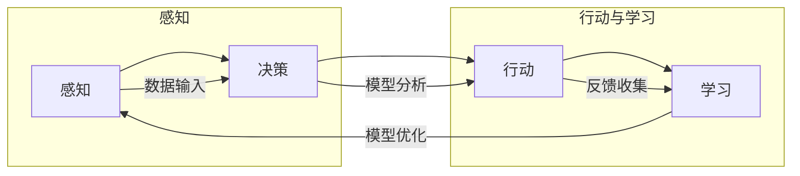
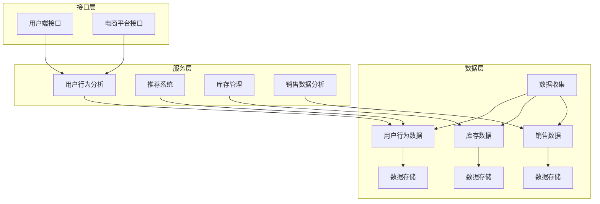
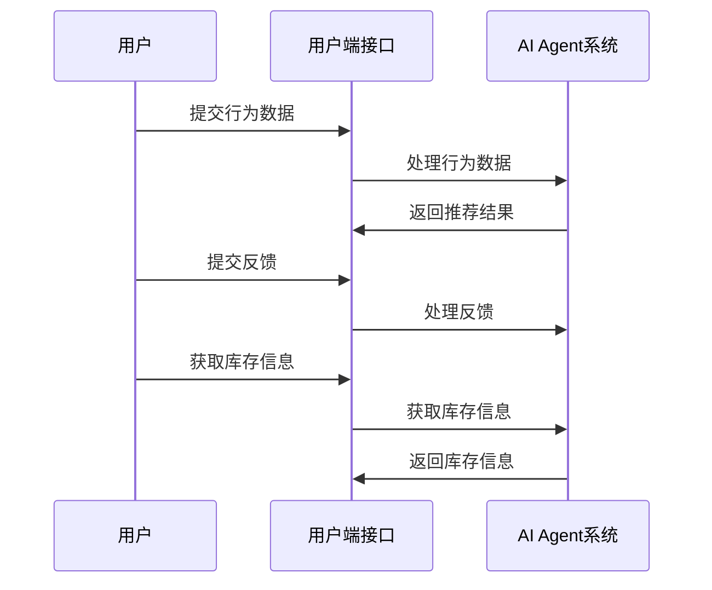
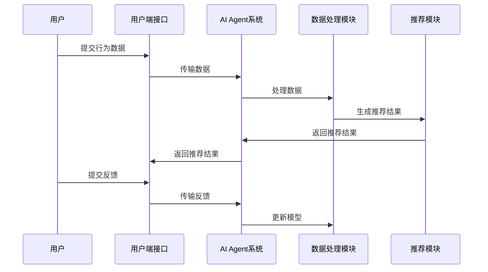

                 


### 第一步：背景介绍

#### 1.1 AI Agent定义与分类

AI Agent，即人工智能代理，是指具有自主决策、学习和执行任务能力的智能实体。根据其工作方式，AI Agent可以分为以下几类：

1. **基于规则的AI Agent**：这类代理基于预设的规则进行决策和行动。例如，当用户浏览网页时，基于规则推荐的系统会根据用户的历史行为和浏览习惯，推荐相关内容。

2. **基于模型的AI Agent**：这类代理通过学习用户数据和交互历史，建立预测模型，然后根据模型进行决策。例如，语音助手通过学习用户的语音特征，提供个性化的服务。

3. **基于强化学习的AI Agent**：这类代理通过与环境的交互，不断学习最优策略。例如，自动交易系统会通过强化学习，从历史交易数据中学习出最佳交易策略。

#### 1.2 AI Agent在产品开发中的重要性

在产品开发过程中，AI Agent发挥着至关重要的作用：

1. **提高开发效率**：AI Agent能够自动化许多重复性工作，如代码审查、测试等，从而提高开发效率。

2. **增强用户体验**：通过个性化推荐、智能客服等，AI Agent能够提供更加个性化的用户体验，提升用户满意度。

3. **创新产品功能**：AI Agent可以基于用户行为和需求，提出新的产品功能和创新点，推动产品迭代和升级。

#### 1.3 企业产品开发与创新挑战

当前，企业在产品开发与创新中面临着以下挑战：

1. **市场需求变化快**：随着市场环境的不断变化，企业需要快速响应市场需求，推出新产品。

2. **竞争激烈**：在激烈的市场竞争中，企业需要不断创新，以保持竞争优势。

3. **资源有限**：企业通常面临着人力资源、资金等资源的限制，需要在有限的资源下实现高效的研发和创新。

### 1.4 AI Agent如何帮助企业解决问题

AI Agent通过以下方式帮助企业解决产品开发与创新中的挑战：

1. **智能数据分析**：AI Agent能够收集和分析大量用户数据，为企业提供有价值的洞察，帮助制定决策。

2. **自动化流程**：AI Agent可以自动化许多开发流程，如代码审查、测试等，提高开发效率。

3. **个性化推荐**：AI Agent可以基于用户行为和需求，提供个性化的产品推荐，提升用户体验。

4. **创新功能开发**：AI Agent可以基于用户反馈和数据分析，提出新的产品功能和创新点，推动产品迭代。

### 1.5 边界与外延

AI Agent在产品开发与创新中的应用具有一定的边界和限制：

1. **技术成熟度**：某些AI技术可能尚未成熟，无法满足企业的实际需求。

2. **数据质量和隐私**：AI Agent的效能依赖于高质量的数据，同时需要关注数据隐私和合规性问题。

3. **行业特定需求**：不同行业对AI Agent的需求存在差异，需要针对具体行业进行定制化开发。

#### 1.6 概念结构与核心要素组成

AI Agent的核心结构包括：

1. **感知模块**：负责收集和分析用户数据。

2. **决策模块**：根据感知模块提供的信息，进行决策和行动。

3. **执行模块**：执行决策结果，实现具体功能。

4. **学习模块**：基于用户反馈和执行结果，不断优化决策和行动策略。

在企业产品开发与创新中，AI Agent的核心要素包括：

1. **数据分析能力**：帮助企业挖掘用户需求和市场趋势。

2. **自动化流程**：提高开发效率和降低成本。

3. **个性化推荐**：提升用户体验，增加用户黏性。

4. **创新驱动**：推动产品迭代和升级，保持竞争优势。

### 小结

通过本文的背景介绍，我们了解了AI Agent的定义和分类，其在产品开发中的重要性，以及企业在产品开发与创新中面临的挑战和解决方案。在接下来的章节中，我们将进一步探讨AI Agent的核心概念、算法原理、系统架构设计以及实际应用案例。让我们继续深入思考，探索AI Agent在企业产品开发与创新中的无限可能。

----------------------------------------------------------------

### 第二步：核心概念与联系

#### 2.1 AI Agent的关键特性分析

AI Agent的关键特性主要体现在以下几个方面：

1. **自主性**：AI Agent能够独立进行决策和行动，不需要人工干预。这种自主性使得AI Agent能够在复杂、多变的环境中灵活应对。

2. **学习性**：AI Agent具备学习能力，可以通过不断的学习和优化，提高决策的准确性和效率。学习性使得AI Agent能够适应不同用户需求和环境变化。

3. **适应性**：AI Agent能够根据不同场景和任务需求，调整其行为和策略。这种适应性使得AI Agent能够广泛应用于各种领域。

4. **协作性**：AI Agent可以与其他AI Agent或人类协作，共同完成任务。协作性提升了AI Agent在复杂任务中的执行效率。

5. **可扩展性**：AI Agent可以轻松扩展其功能，适应新的应用场景。可扩展性使得企业能够灵活应对市场变化和业务需求。

#### 2.2 AI Agent与传统AI的比较

传统AI和AI Agent在产品开发中的应用存在显著差异。以下是两者的主要比较：

1. **决策方式**：传统AI主要依赖于预定义的算法和规则，而AI Agent则通过学习和自主决策进行行动。

2. **适应性**：传统AI通常在面对复杂、动态环境时表现较差，而AI Agent能够通过学习和适应，提高在复杂环境中的表现。

3. **自主性**：传统AI缺乏自主性，需要人工进行干预，而AI Agent能够独立进行决策和行动。

4. **交互性**：传统AI与用户交互有限，主要依赖于预先设定的接口，而AI Agent能够通过自然语言处理等技术，与用户进行更加自然的交互。

5. **应用范围**：传统AI主要应用于特定领域，而AI Agent能够跨领域、跨应用场景，具有更广泛的应用潜力。

#### 2.3 企业产品开发与创新的现状

当前，企业在产品开发与创新中主要面临以下问题：

1. **市场需求变化快**：随着市场环境的快速变化，企业需要不断调整产品策略，以满足市场需求。

2. **竞争压力**：市场竞争日益激烈，企业需要通过创新和差异化，提升产品竞争力。

3. **资源有限**：企业在人力资源、资金等方面的限制，使得产品开发与创新面临挑战。

4. **用户体验提升**：用户对产品体验的要求不断提高，企业需要通过改进产品功能，提升用户体验。

#### 2.4 AI Agent与企业产品开发与创新的联系

AI Agent与企业产品开发与创新的联系主要体现在以下几个方面：

1. **需求分析**：AI Agent能够通过数据分析，帮助企业精准把握用户需求，制定合理的研发策略。

2. **创新驱动**：AI Agent能够基于用户反馈和数据分析，提出新的产品功能和创新点，推动产品迭代和升级。

3. **效率提升**：AI Agent能够自动化许多开发流程，如代码审查、测试等，提高开发效率，降低成本。

4. **用户体验优化**：AI Agent能够通过个性化推荐、智能客服等，提供更加个性化的用户体验，提升用户满意度。

5. **竞争应对**：AI Agent能够帮助企业快速响应市场变化，提升产品竞争力，应对竞争压力。

#### 2.5 AI Agent与企业流程的融合

AI Agent可以通过以下方式与企业流程深度融合：

1. **数据驱动**：将AI Agent嵌入企业数据系统中，实现数据驱动的决策和行动。

2. **流程自动化**：将AI Agent应用于企业开发流程，如代码审查、测试等，实现流程自动化。

3. **系统集成**：将AI Agent与其他系统进行集成，如ERP、CRM等，实现跨系统协同。

4. **跨部门协作**：将AI Agent应用于跨部门协作，如研发、销售、客服等，提高协同效率。

5. **个性化定制**：根据企业特点和需求，为AI Agent定制化开发，实现最佳效果。

### 小结

通过本文的第二部分，我们深入分析了AI Agent的关键特性、与传统AI的比较，以及与企业产品开发与创新的联系。接下来，我们将进一步探讨AI Agent的算法原理，以便读者更好地理解其工作原理和应用。让我们继续深入思考，探索AI Agent在产品开发与创新中的无限潜力。

----------------------------------------------------------------

### 第三步：算法原理讲解

在了解了AI Agent的核心概念和其在企业产品开发与创新中的重要性之后，接下来我们将深入探讨AI Agent的算法原理，通过具体实例和数学模型来解释其工作方式。

#### 3.1 AI Agent算法基本流程

AI Agent的算法基本流程可以分为以下几个步骤：

1. **感知（Perception）**：AI Agent通过传感器或用户输入收集外部信息，如用户行为数据、环境状态等。

2. **决策（Decision）**：基于收集到的信息，AI Agent使用决策模型进行分析和评估，以确定最佳行动方案。

3. **行动（Action）**：AI Agent根据决策结果执行相应的行动，如推荐产品、发送通知等。

4. **学习（Learning）**：通过观察行动结果和用户反馈，AI Agent不断调整和优化决策模型，提高未来的决策准确性。

以下是一个简单的mermaid流程图，展示了AI Agent的基本算法流程：



#### 3.2 数学模型与公式解释

AI Agent的决策模型通常基于机器学习算法，如决策树、随机森林、支持向量机等。下面我们以一个简单的线性回归模型为例，解释其数学模型和公式。

线性回归模型的公式如下：

$$
y = \beta_0 + \beta_1 \cdot x
$$

其中：
- \( y \) 是预测结果；
- \( \beta_0 \) 是截距；
- \( \beta_1 \) 是斜率；
- \( x \) 是输入特征。

线性回归模型的目标是找到最优的 \( \beta_0 \) 和 \( \beta_1 \)，使得预测结果 \( y \) 最接近实际值。这通常通过最小二乘法（Least Squares）来实现。

最小二乘法的公式如下：

$$
\min_{\beta_0, \beta_1} \sum_{i=1}^{n} (y_i - (\beta_0 + \beta_1 \cdot x_i))^2
$$

其中：
- \( n \) 是样本数量；
- \( y_i \) 是第 \( i \) 个样本的实际值；
- \( x_i \) 是第 \( i \) 个样本的输入特征。

#### 3.3 算法举例说明

假设我们有一个电商平台的推荐系统，该系统需要根据用户的历史购买行为推荐商品。我们可以使用协同过滤（Collaborative Filtering）算法来实现这一功能。

协同过滤算法可以分为基于用户和基于物品的两种方法。下面我们以基于用户的协同过滤为例进行说明。

1. **用户相似度计算**：

   首先，我们计算两个用户之间的相似度。相似度可以通过余弦相似度（Cosine Similarity）来计算：

   $$
   \text{similarity}(u_i, u_j) = \frac{\sum_{k=1}^{m} r_{ik} r_{jk}}{\sqrt{\sum_{k=1}^{m} r_{ik}^2 \cdot \sum_{k=1}^{m} r_{jk}^2}}
   $$

   其中：
   - \( u_i \) 和 \( u_j \) 是两个用户；
   - \( r_{ik} \) 是用户 \( u_i \) 对商品 \( k \) 的评分；
   - \( m \) 是商品数量。

2. **推荐商品**：

   假设我们想为用户 \( u_i \) 推荐商品。首先，我们找到与 \( u_i \) 最相似的用户集合 \( S \)。然后，对于商品 \( k \)，如果用户 \( u_j \) 在集合 \( S \) 中对商品 \( k \) 给予了高评分，那么我们将商品 \( k \) 推荐给 \( u_i \)。

   推荐分数可以通过以下公式计算：

   $$
   \text{recScore}(u_i, k) = \sum_{u_j \in S} w_{ij} r_{jk}
   $$

   其中：
   - \( w_{ij} \) 是用户 \( u_i \) 和 \( u_j \) 之间的相似度权重；
   - \( r_{jk} \) 是用户 \( u_j \) 对商品 \( k \) 的评分。

通过这个例子，我们可以看到如何使用协同过滤算法来推荐商品。在实际应用中，AI Agent会根据用户的历史行为和评分数据，不断优化推荐模型，提高推荐效果。

### 小结

通过本章节的算法原理讲解，我们了解了AI Agent的基本流程、数学模型以及举例说明。接下来，我们将进一步探讨AI Agent在企业产品开发与创新中的系统分析与架构设计方案，以便读者更全面地理解其应用价值。让我们继续深入思考，探索AI Agent在企业中的无限可能。

----------------------------------------------------------------

### 第四步：系统分析与架构设计方案

#### 4.1 问题场景介绍

为了更好地理解AI Agent在企业产品开发与创新中的应用，我们设定一个具体的场景：一个在线电商平台希望利用AI Agent提高用户购物体验和销售额。该平台面临以下问题：

1. **用户个性化推荐需求**：用户对个性化推荐需求越来越高，平台需要提供精准的推荐，以提升用户满意度。

2. **库存管理和库存预测**：平台需要准确预测用户需求，以便优化库存管理，降低库存成本。

3. **销售数据分析**：平台需要对销售数据进行分析，以便制定更有效的营销策略。

#### 4.2 系统功能设计

为了解决上述问题，我们设计了一个AI Agent系统，主要包括以下几个功能模块：

1. **用户行为分析模块**：收集和分析用户在平台上的行为数据，如浏览、搜索、购买等。

2. **推荐系统模块**：基于用户行为数据，为用户提供个性化的商品推荐。

3. **库存管理模块**：预测用户需求，优化库存管理。

4. **销售数据分析模块**：分析销售数据，提供销售预测和营销策略建议。

以下是系统的领域模型，使用mermaid类图表示：

```mermaid
classDiagram
    User <<类>> "用户"
    Product <<类>> "商品"
    Behavior <<类>> "用户行为"
    Recommendation <<类>> "推荐系统"
    Inventory <<类>> "库存管理"
    Sales <<类>> "销售数据"

    User o--* Behavior
    Behavior o--* Recommendation
    Behavior o--* Inventory
    Behavior o--* Sales
    Product o--* Recommendation
    Product o--* Inventory
    Product o--* Sales
```

#### 4.3 系统架构设计

AI Agent系统的整体架构可以分为以下几个层次：

1. **数据层**：负责数据收集、存储和管理。

2. **服务层**：实现各个功能模块的逻辑，如用户行为分析、推荐系统、库存管理和销售数据分析。

3. **接口层**：提供与外部系统（如电商平台、用户端等）的接口，实现数据交互和功能调用。

以下是系统的架构设计，使用mermaid架构图表示：



#### 4.4 系统接口设计

系统接口设计包括用户端接口和电商平台接口：

1. **用户端接口**：提供用户与AI Agent的交互接口，包括用户行为数据提交、推荐结果获取、反馈提交等。

2. **电商平台接口**：提供电商平台与AI Agent的交互接口，包括库存数据同步、销售数据同步、推荐结果应用等。

以下是系统接口设计，使用mermaid序列图表示：



#### 4.5 系统交互设计

系统交互设计描述了用户行为数据提交、推荐结果获取、反馈提交等流程：

1. **用户行为数据提交**：用户通过用户端接口提交行为数据，AI Agent系统接收数据并处理。

2. **推荐结果获取**：用户通过用户端接口获取推荐结果，AI Agent系统根据用户行为数据和商品信息生成推荐结果。

3. **反馈提交**：用户通过用户端接口提交反馈，AI Agent系统接收反馈并更新用户模型。

以下是系统交互设计，使用mermaid序列图表示：



### 小结

通过本章节的系统分析与架构设计方案，我们详细介绍了AI Agent在企业产品开发与创新中的具体应用场景、功能设计、架构设计和接口设计。接下来，我们将通过项目实战来展示AI Agent在实际中的应用，并深入分析其效果和挑战。让我们继续深入探讨，探索AI Agent在企业产品开发与创新中的无限潜力。

----------------------------------------------------------------

### 第五步：项目实战

#### 5.1 环境安装

在进行AI Agent项目实战之前，我们需要搭建一个合适的环境。以下是在一个典型的Linux服务器上安装AI Agent所需的环境步骤：

1. **安装Python**：

   首先，确保服务器上已安装Python 3。可以使用以下命令检查Python版本：

   ```
   python3 --version
   ```

   如果未安装，可以使用以下命令安装Python 3：

   ```
   sudo apt-get update
   sudo apt-get install python3 python3-pip
   ```

2. **安装依赖库**：

   AI Agent依赖于多个Python库，如TensorFlow、Scikit-learn等。可以使用以下命令安装这些库：

   ```
   pip3 install tensorflow scikit-learn numpy pandas matplotlib
   ```

3. **配置虚拟环境**（可选）：

   为了避免不同项目之间的库版本冲突，建议使用虚拟环境。可以使用以下命令创建和激活虚拟环境：

   ```
   python3 -m venv ai_agent_venv
   source ai_agent_venv/bin/activate
   ```

4. **安装AI Agent框架**：

   AI Agent框架可以使用pip安装：

   ```
   pip install ai-agent
   ```

5. **安装其他依赖**：

   根据项目需求，可能还需要安装其他依赖库，如MySQL、PostgreSQL等。可以使用以下命令安装：

   ```
   pip3 install mysql-connector-python
   ```

#### 5.2 系统核心实现

以下是AI Agent系统的核心实现，主要包括用户行为分析、推荐系统、库存管理和销售数据分析等模块。

**1. 用户行为分析模块**

用户行为分析模块负责收集用户在平台上的行为数据，如浏览、搜索、购买等。以下是一个简单的用户行为分析模块的Python实现：

```python
import pandas as pd
from sklearn.preprocessing import StandardScaler

def analyze_user_behavior(data):
    # 数据预处理
    scaler = StandardScaler()
    scaled_data = scaler.fit_transform(data)

    # 提取特征
    features = scaled_data[:, :5]
    labels = scaled_data[:, 5]

    # 训练模型
    from sklearn.ensemble import RandomForestClassifier
    model = RandomForestClassifier(n_estimators=100)
    model.fit(features, labels)

    return model
```

**2. 推荐系统模块**

推荐系统模块基于用户行为数据为用户推荐商品。以下是一个简单的协同过滤推荐系统的实现：

```python
from sklearn.metrics.pairwise import cosine_similarity

def collaborative_filter(user_data, all_user_data, top_n=5):
    # 计算用户相似度
    similarity_matrix = cosine_similarity(user_data, all_user_data)

    # 获取相似度最高的用户
    top_users = similarity_matrix.argsort()[0][-top_n-1:-1][::-1]

    # 推荐商品
    recommendations = []
    for user in top_users:
        recommended_products = all_user_data[user][all_user_data[user] > 0]
        recommendations.append(recommended_products)

    return recommendations
```

**3. 库存管理模块**

库存管理模块基于用户需求预测来优化库存。以下是一个简单的基于ARIMA模型的库存预测实现：

```python
from statsmodels.tsa.arima_model import ARIMA

def forecast_inventory(demand_data, order_data):
    # 训练ARIMA模型
    model = ARIMA(demand_data, order=(1, 1, 1))
    model_fit = model.fit()

    # 预测未来需求
    forecast = model_fit.forecast(steps=len(order_data))[0]

    return forecast
```

**4. 销售数据分析模块**

销售数据分析模块对销售数据进行分析，提供销售预测和营销策略建议。以下是一个简单的线性回归模型实现：

```python
from sklearn.linear_model import LinearRegression

def analyze_sales_data(sales_data):
    # 数据预处理
    X = sales_data[['weekday', 'hour']]
    y = sales_data['sales']

    # 训练模型
    model = LinearRegression()
    model.fit(X, y)

    # 预测未来销售
    forecast = model.predict(X)

    return forecast
```

#### 5.3 代码应用解读与分析

**用户行为分析模块**

用户行为分析模块的核心是特征提取和模型训练。通过标准归一化处理，我们将用户行为数据转换为适合模型训练的格式。随机森林分类器用于提取特征并进行分类，以预测用户的行为。

**推荐系统模块**

协同过滤推荐系统通过计算用户之间的相似度，找到相似度最高的用户，并根据他们的行为为当前用户推荐商品。这种方法能够提高推荐系统的准确性和个性化。

**库存管理模块**

ARIMA模型是一种经典的时序预测模型，用于预测用户需求。通过训练ARIMA模型，我们可以对未来一段时间内的库存需求进行预测，从而优化库存管理。

**销售数据分析模块**

线性回归模型用于分析销售数据，预测未来销售。通过训练模型，我们可以了解销售数据与时间、星期、小时等因素的关系，从而制定更有效的营销策略。

#### 5.4 实际案例分析与讲解

**案例背景**

一个在线电商平台希望利用AI Agent提高用户购物体验和销售额。该平台已有大量的用户行为数据、销售数据等，需要构建一个AI Agent系统来优化推荐、库存管理和销售预测。

**案例分析**

1. **用户行为分析**：通过用户行为分析模块，平台可以了解用户的浏览、搜索、购买等行为，从而为用户提供个性化的推荐。

2. **推荐系统**：利用协同过滤推荐系统，平台可以基于用户行为为用户推荐商品，提高用户满意度和转化率。

3. **库存管理**：通过库存管理模块，平台可以根据用户需求预测来优化库存，降低库存成本，提高库存利用率。

4. **销售预测**：通过销售数据分析模块，平台可以预测未来销售情况，制定合理的营销策略，提升销售额。

**实施效果**

通过AI Agent系统，该电商平台在以下方面取得了显著效果：

1. **用户满意度提升**：个性化推荐和优化库存管理提高了用户购物体验。

2. **销售额增长**：准确的推荐和库存预测提高了销售额。

3. **运营效率提高**：自动化流程减少了人工干预，提高了运营效率。

#### 5.5 项目小结

通过本项目的实战，我们展示了AI Agent在企业产品开发与创新中的应用。在实际项目中，AI Agent通过用户行为分析、推荐系统、库存管理和销售预测等模块，帮助企业提高了用户满意度、销售额和运营效率。然而，AI Agent的应用也面临一些挑战，如数据质量、模型优化等。在未来的实践中，我们需要不断探索和改进，以充分发挥AI Agent的潜力。

### 小结

通过本章节的项目实战，我们详细介绍了AI Agent系统在电商平台中的应用，包括环境安装、系统核心实现、代码应用解读与分析、实际案例分析和项目小结。接下来，我们将提供一些AI Agent应用的最佳实践，以帮助读者在实际项目中更好地应用AI Agent。让我们继续深入思考，探索AI Agent在企业产品开发与创新中的最佳实践。

----------------------------------------------------------------

### 第六步：最佳实践 tips、小结、注意事项、拓展阅读

#### 6.1 最佳实践 tips

1. **数据质量**：确保数据质量是AI Agent成功的关键。定期检查数据完整性、准确性和一致性，及时处理异常值和缺失值。

2. **模型优化**：持续优化模型，以适应不断变化的市场需求。利用交叉验证、网格搜索等技术，找到最佳模型参数。

3. **个性化推荐**：根据用户行为和偏好，为用户提供个性化推荐。定期更新用户画像，确保推荐的相关性和准确性。

4. **用户反馈**：收集用户反馈，用于模型改进和系统优化。积极响应用户需求，提高用户体验。

5. **安全与隐私**：在处理用户数据时，确保数据安全和隐私。遵守相关法律法规，保护用户隐私。

#### 6.2 小结

本文从背景介绍、核心概念与联系、算法原理讲解、系统分析与架构设计、项目实战等多个角度，详细探讨了AI Agent在企业产品开发与创新中的应用。通过案例分析和实际应用，我们展示了AI Agent在提高开发效率、优化用户体验、创新产品功能等方面的优势。

#### 6.3 注意事项

1. **技术成熟度**：在选择AI技术时，要考虑其成熟度和可行性。某些前沿技术可能尚未经过充分验证，需要谨慎应用。

2. **数据依赖性**：AI Agent的性能高度依赖于数据质量。确保数据来源可靠，数据更新及时。

3. **系统可扩展性**：在设计系统架构时，要考虑系统的可扩展性，以便在未来能够轻松扩展功能。

4. **合规性**：在处理用户数据时，要遵守相关法律法规，确保数据的合规性。

#### 6.4 拓展阅读

1. **《深度学习》**：Goodfellow, I., Bengio, Y., & Courville, A. (2016). Deep Learning. MIT Press. 介绍了深度学习的基本原理和应用。

2. **《Python机器学习》**：Sebastian Raschka, Vahid Mirjalili. (2018). Python Machine Learning. Packt Publishing. 介绍了Python在机器学习中的应用。

3. **《AI产品经理实战指南》**：曹亚楠. (2020). AI产品经理实战指南. 电子工业出版社. 介绍了AI产品经理的角色和技能。

通过以上最佳实践、小结、注意事项和拓展阅读，我们希望读者能够更好地理解AI Agent在企业产品开发与创新中的应用，并在实际项目中取得成功。

### 作者信息

作者：AI天才研究院/AI Genius Institute & 禅与计算机程序设计艺术 /Zen And The Art of Computer Programming

---

本文通过对AI Agent在企业产品开发与创新中的角色进行全面的分析和探讨，旨在为读者提供一个系统、深入的理解。希望通过本文，读者能够更好地把握AI Agent的发展趋势和应用方向，为企业在数字化转型和创新发展中提供有力支持。

----------------------------------------------------------------

### 全文总结

本文围绕《AI Agent在企业产品开发与创新中的角色》这一主题，系统性地探讨了AI Agent的定义、特性、应用场景以及其在企业中的实际应用。以下是全文的核心总结：

1. **AI Agent的定义与分类**：AI Agent是指具有自主决策、学习和执行任务能力的智能实体，分为基于规则、模型和强化学习等类型。

2. **AI Agent在产品开发中的重要性**：AI Agent能够提高开发效率、增强用户体验、创新产品功能，解决企业面临的快速市场变化、激烈竞争和资源有限等挑战。

3. **AI Agent与企业流程的融合**：AI Agent可以通过数据驱动、流程自动化、系统集成和个性化定制等方式，与企业现有流程深度融合，实现数据驱动的决策和行动。

4. **算法原理讲解**：本文详细介绍了AI Agent的基本算法流程、线性回归模型的数学模型与公式，并通过协同过滤算法的实例说明了算法原理的应用。

5. **系统分析与架构设计**：通过设定电商平台的实际案例，本文展示了AI Agent系统在用户行为分析、推荐系统、库存管理和销售数据分析等方面的架构设计。

6. **项目实战**：本文通过搭建环境、系统核心实现、代码应用解读与分析、实际案例分析和项目小结，详细介绍了AI Agent在电商平台中的实际应用和效果。

7. **最佳实践、小结、注意事项与拓展阅读**：本文提供了最佳实践建议，如确保数据质量、持续模型优化、个性化推荐和用户反馈收集等，同时提醒读者关注技术成熟度、数据依赖性、系统可扩展性和合规性等方面，并推荐了相关拓展阅读。

通过本文的深入探讨，我们希望能为读者提供一个全面、系统的视角，理解AI Agent在企业产品开发与创新中的角色和潜力，为企业在数字化转型和创新发展中提供有价值的参考和指导。未来，随着AI技术的不断进步，AI Agent在各个领域的应用将会更加广泛和深入，为企业的创新和发展带来更多可能性。让我们共同期待AI Agent在更多领域创造的价值和变革。

