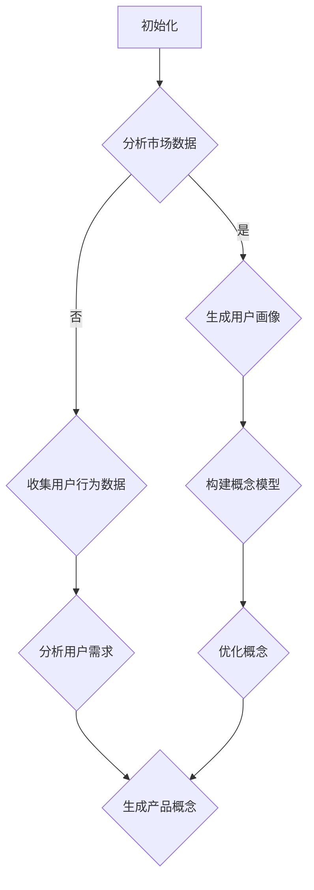
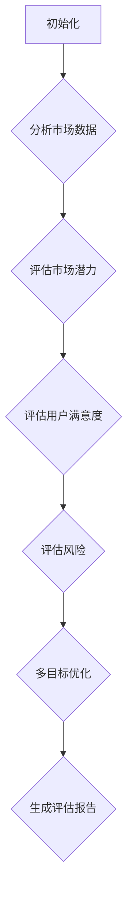
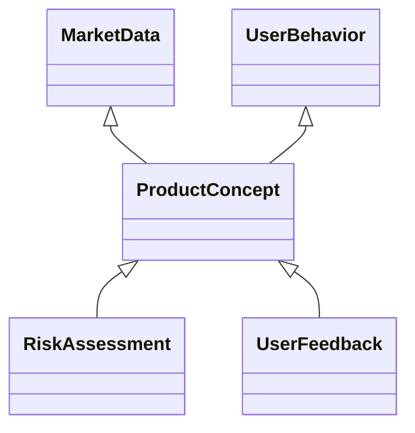
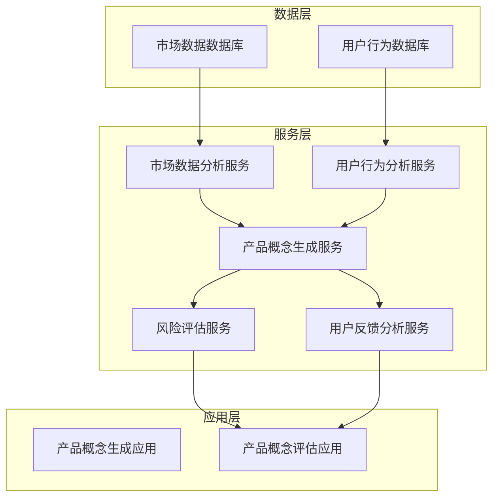
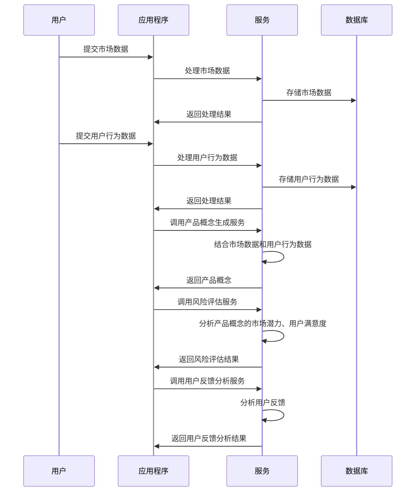

                 


### 文章标题

# AI Agent在企业产品概念生成与评估中的角色

### 关键词

- AI Agent
- 产品概念生成
- 产品评估
- 强化学习
- 监督学习
- 无监督学习
- 算法
- 数学模型
- 系统架构

### 摘要

本文将探讨AI Agent在企业产品概念生成与评估中的关键角色。通过深入分析AI Agent的定义、原理和应用，我们将揭示其在提高产品创新能力和决策效率方面的巨大潜力。本文还将讨论如何将AI Agent集成到现有产品开发流程中，并探讨其在实际项目中的应用案例。通过本文，读者将了解到AI Agent如何帮助企业更好地理解市场需求，快速生成和评估产品概念，从而推动产品成功上市。

---

### 目录大纲

---

## 第一部分：背景介绍

### 1.1 问题背景

#### 1.1.1 AI Agent的定义与分类

AI Agent，即人工智能代理，是指能够自主执行任务、与环境进行交互，并具备一定智能行为的计算实体。根据自主能力和学习能力，AI Agent可以分为以下几类：

1. **反应型AI Agent**：这种代理只能对环境中的特定事件做出反应，不具备记忆和学习能力。
2. **有限记忆AI Agent**：这种代理能够存储和利用有限的历史信息，以改进其反应。
3. **模型基础AI Agent**：这种代理拥有内部模型，可以预测未来的环境和行为，并基于这些预测进行决策。
4. **理论AI Agent**：这种代理具备完整的理论模型，能够进行复杂的推理和规划。

#### 1.1.2 企业产品概念生成与评估的重要性

产品概念生成是企业创新的核心环节，它决定了产品能否满足市场需求、具备竞争力。产品评估则是对产品概念进行验证和优化的过程，确保最终产品的成功。两者的结合，能够帮助企业快速响应市场变化，提升产品创新和竞争力。

#### 1.1.3 AI Agent在企业产品概念生成与评估中的应用现状

当前，AI Agent在企业产品概念生成与评估中的应用主要集中在以下几个方面：

1. **市场数据分析**：AI Agent可以通过分析大量市场数据，帮助企业识别潜在的市场需求。
2. **用户画像分析**：AI Agent可以分析用户行为，构建用户画像，为企业提供产品创新的方向。
3. **概念生成与优化**：AI Agent可以通过机器学习算法，自动生成和优化产品概念。
4. **风险评估与优化**：AI Agent可以对产品评估过程中涉及的风险进行预测和优化。

### 1.2 问题描述

#### 1.2.1 企业产品概念生成的挑战

1. **需求不明确**：市场需求的快速变化，使得企业难以准确把握用户需求。
2. **竞争激烈**：产品同质化严重，企业需要不断创新以获得竞争优势。
3. **资源有限**：企业需要在有限的资源下，高效地生成和评估多个产品概念。

#### 1.2.2 企业产品评估的挑战

1. **数据依赖**：产品评估需要大量数据支持，但获取这些数据可能困难且成本高昂。
2. **评估方法单一**：传统的评估方法可能无法全面反映产品的市场潜力。
3. **评估周期长**：产品评估需要较长的周期，影响企业的市场响应速度。

#### 1.2.3 AI Agent在解决上述问题中的作用

AI Agent可以通过以下方式帮助企业解决上述问题：

1. **提高效率**：AI Agent可以自动化处理大量数据，提高产品生成和评估的效率。
2. **优化决策**：AI Agent可以通过数据分析和预测，为企业提供更准确的决策依据。
3. **降低成本**：AI Agent可以减少企业在数据收集和评估过程中的投入。

### 1.3 问题解决

#### 1.3.1 AI Agent在产品概念生成中的应用

AI Agent可以通过以下方式参与产品概念生成：

1. **市场数据分析**：AI Agent可以分析市场趋势，为企业提供潜在的产品概念。
2. **用户画像分析**：AI Agent可以分析用户行为，为企业提供用户画像，指导产品创新。
3. **概念生成算法**：AI Agent可以使用机器学习算法，自动生成和优化产品概念。

#### 1.3.2 AI Agent在产品评估中的应用

AI Agent可以通过以下方式参与产品评估：

1. **风险评估**：AI Agent可以预测产品在市场上的风险，为企业提供风险评估报告。
2. **用户反馈分析**：AI Agent可以分析用户反馈，评估产品的市场表现。
3. **多目标优化**：AI Agent可以基于多目标优化算法，评估不同产品概念的优劣。

#### 1.3.3 AI Agent的优势与局限性

AI Agent的优势在于其高效的数据处理能力和准确的预测能力，可以帮助企业快速生成和评估产品概念。然而，AI Agent也存在局限性，如数据质量依赖、算法复杂度和解释性等问题。

### 1.4 边界与外延

#### 1.4.1 AI Agent适用场景分析

AI Agent适用于需要大量数据处理和分析的企业，如互联网企业、消费品公司等。此外，AI Agent还可以应用于跨领域的产品开发，如医疗、金融等领域。

#### 1.4.2 AI Agent技术发展现状与趋势

当前，AI Agent技术正在快速发展，特别是在强化学习和迁移学习方面。未来，AI Agent将更加智能化和自主化，能够在更复杂的环境中发挥作用。

#### 1.4.3 AI Agent在跨领域应用中的潜力

AI Agent在跨领域应用中具有巨大潜力，可以通过集成不同领域的数据和知识，为企业提供更全面的产品创新和评估支持。

### 1.5 概念结构与核心要素组成

#### 1.5.1 AI Agent的组成结构

AI Agent由感知模块、决策模块、执行模块和记忆模块组成。感知模块负责获取环境信息，决策模块负责分析环境和目标，执行模块负责执行决策，记忆模块负责存储经验和知识。

#### 1.5.2 企业产品概念生成与评估的关键要素

企业产品概念生成与评估的关键要素包括市场需求、用户画像、产品概念、风险评估和用户反馈。

#### 1.5.3 AI Agent与关键要素的相互作用关系

AI Agent通过感知模块获取市场需求和用户画像，通过决策模块生成和评估产品概念，通过执行模块执行决策，通过记忆模块存储经验和知识，不断优化产品创新和评估过程。

---

## 第二部分：核心概念与联系

### 2.1 AI Agent的核心概念

#### 2.1.1 AI Agent的定义

AI Agent是一种具有自主学习和决策能力的计算实体，能够在复杂环境中进行交互和任务执行。

#### 2.1.2 AI Agent的工作原理

AI Agent的工作原理基于感知-决策-执行循环。感知模块获取环境信息，决策模块分析环境和目标，执行模块执行决策，记忆模块存储经验和知识。

#### 2.1.3 AI Agent的类型

AI Agent可以分为反应型、有限记忆型、模型基础型和理论型。

### 2.2 企业产品概念生成与评估的概念联系

#### 2.2.1 产品概念生成的概念模型

产品概念生成包括市场数据分析、用户画像分析和概念生成算法等环节。

#### 2.2.2 产品评估的概念框架

产品评估包括风险评估、用户反馈分析和多目标优化等环节。

#### 2.2.3 AI Agent在概念联系中的作用

AI Agent在产品概念生成和评估中起到关键作用，通过数据分析和算法优化，提高产品创新和评估的效率。

### 2.3 AI Agent与企业产品概念生成与评估的关系

#### 2.3.1 AI Agent在产品概念生成中的应用

AI Agent可以通过市场数据分析、用户画像分析和概念生成算法，帮助企业快速生成产品概念。

#### 2.3.2 AI Agent在产品评估中的应用

AI Agent可以通过风险评估、用户反馈分析和多目标优化，帮助企业评估产品概念的市场潜力。

#### 2.3.3 AI Agent与产品生命周期管理的关系

AI Agent可以参与产品生命周期的各个阶段，从产品概念生成到评估，再到市场投放和持续优化。

### 2.4 概念属性特征对比表格

| 特征         | 反应型AI Agent | 有限记忆型AI Agent | 模型基础型AI Agent | 理论型AI Agent |
| ------------ | -------------- | ------------------ | ------------------ | -------------- |
| 自主能力     | 低             | 中等              | 高                 | 非常高         |
| 学习能力     | 无             | 有                 | 有                 | 非常强         |
| 适应性       | 强             | 中等              | 中等              | 高             |
| 环境复杂性   | 低             | 中等              | 高                 | 非常高         |
| 预测能力     | 无             | 有                 | 强                 | 非常强         |

### 2.5 ER实体关系图架构

#### 2.5.1 ER图的基本概念

ER图（Entity-Relationship Diagram）是用于表示实体及其之间关系的图形化工具。实体表示数据对象，关系表示实体之间的关联。

#### 2.5.2 AI Agent在企业产品概念生成与评估中的ER图

在AI Agent与企业产品概念生成与评估的关系中，可以定义以下实体：

- **AI Agent**：表示人工智能代理。
- **市场数据**：表示用于市场分析的数据。
- **用户画像**：表示用户的行为特征。
- **产品概念**：表示生成的产品概念。
- **风险评估**：表示产品评估过程中的风险分析。
- **用户反馈**：表示用户对产品的反馈。

ER图可以表示为：

```mermaid
erDiagram
    AI_Agent ||--|{ Market_Data } Market_Data
    AI_Agent ||--|{ User_画像 } User_画像
    AI_Agent ||--|{ Product_Concept } Product_Concept
    AI_Agent ||--|{ Risk_Assessment } Risk_Assessment
    AI_Agent ||--|{ User_Feedback } User_Feedback
```

---

## 第三部分：算法原理讲解

### 3.1 AI Agent的基本算法原理

#### 3.1.1 强化学习算法

强化学习是一种通过试错来学习最优策略的机器学习方法。在强化学习中，AI Agent通过与环境的交互，不断调整其行为，以最大化累积奖励。

#### 3.1.2 监督学习算法

监督学习是一种通过已有数据学习预测模型的方法。在监督学习中，AI Agent通过输入和输出数据的学习，构建出一个预测模型。

#### 3.1.3 无监督学习算法

无监督学习是一种不需要标签数据的学习方法。在无监督学习中，AI Agent通过分析数据特征，自动发现数据中的模式和规律。

### 3.2 AI Agent在产品概念生成中的应用算法

#### 3.2.1 基于强化学习的概念生成算法

基于强化学习的概念生成算法可以通过试错方式，不断调整产品概念，以最大化市场潜力。

#### 3.2.2 基于监督学习的概念生成算法

基于监督学习的概念生成算法可以通过已有数据，学习出一个生成产品概念的模型。

#### 3.2.3 基于无监督学习的概念生成算法

基于无监督学习的概念生成算法可以通过分析用户行为和市场数据，自动发现潜在的产品概念。

### 3.3 AI Agent在产品评估中的应用算法

#### 3.3.1 基于模型评估的算法

基于模型评估的算法可以通过已有数据，评估不同产品概念的市场潜力。

#### 3.3.2 基于用户反馈的算法

基于用户反馈的算法可以通过用户反馈，实时评估产品的市场表现。

#### 3.3.3 基于多目标的评估算法

基于多目标的评估算法可以通过多目标优化，综合考虑产品概念的市场潜力、风险和用户满意度。

### 3.4 算法mermaid流程图展示

#### 3.4.1 概念生成算法的mermaid流程图



#### 3.4.2 评估算法的mermaid流程图



### 3.5 算法Python源代码讲解

```python
# 基于强化学习的概念生成算法
import numpy as np

# 初始化环境
env = Environment()

# 初始化策略
policy = Policy()

# 强化学习循环
while not done:
    # 选择动作
    action = policy.select_action(state)
    
    # 执行动作
    next_state, reward, done = env.step(action)
    
    # 更新策略
    policy.update(state, action, reward, next_state)
    
    # 更新状态
    state = next_state

# 输出产品概念
print("Generated product concept:", env.get_product_concept())

# 基于监督学习的评估算法
import sklearn

# 加载评估模型
model = sklearn.load_model("model.pkl")

# 加载测试数据
X_test = ...

# 预测市场潜力
market_potential = model.predict(X_test)

# 输出评估结果
print("Market potential:", market_potential)
```

### 3.6 数学模型和公式讲解

#### 3.6.1 强化学习算法的数学模型

强化学习算法的核心是策略优化。策略可以表示为：

$$
\pi(a|s) = P(a|s, \theta)
$$

其中，$a$ 表示动作，$s$ 表示状态，$\theta$ 表示策略参数。

策略优化的目标是最大化累积奖励：

$$
J(\theta) = \sum_{s,a} \pi(a|s) R(s, a)
$$

#### 3.6.2 监督学习算法的数学模型

监督学习算法的核心是损失函数。常见的损失函数有均方误差（MSE）和交叉熵（Cross-Entropy）。

均方误差（MSE）：

$$
MSE = \frac{1}{n} \sum_{i=1}^{n} (y_i - \hat{y}_i)^2
$$

其中，$y_i$ 表示真实标签，$\hat{y}_i$ 表示预测标签。

交叉熵（Cross-Entropy）：

$$
H(y, \hat{y}) = - \sum_{i=1}^{n} y_i \log(\hat{y}_i)
$$

#### 3.6.3 多目标优化算法的数学模型

多目标优化算法的核心是多目标函数。常见的多目标函数有Pareto优化和非支配排序。

Pareto优化：

$$
\text{Pareto Optimal} = \{x \in X | \forall y \in X, f_1(x) \le f_1(y) \text{ and } f_2(x) \le f_2(y) \text{ or } f_1(x) < f_1(y) \text{ and } f_2(x) \ge f_2(y)\}
$$

非支配排序：

$$
\text{Non-dominated Sorting} = \{x \in X | \forall y \in X, \neg(\exists f_i(x) \le f_i(y) \text{ and } \forall j \ne i, f_j(x) = f_j(y))\}
$$

### 3.7 通俗易懂地举例说明

#### 3.7.1 强化学习算法举例

假设我们有一个AI Agent，它需要在迷宫中找到出路。初始状态为迷宫的入口，每个状态都有多个动作可选，如向左、向右、向上、向下移动。AI Agent通过尝试不同的动作，不断更新策略，以找到最优路径。

#### 3.7.2 监督学习算法举例

假设我们有一个分类问题，已知每个样本的特征和标签。我们可以使用监督学习算法，如决策树或神经网络，来构建一个预测模型。模型可以通过训练数据学习特征与标签之间的关系，然后对新的样本进行预测。

#### 3.7.3 多目标优化算法举例

假设我们有一个产品评估问题，需要同时考虑市场潜力、用户满意度和风险。我们可以使用多目标优化算法，如Pareto优化，来找到一组最优的产品概念。这些产品概念在不同的目标上取得平衡，满足企业的需求。

---

## 第四部分：系统分析与架构设计方案

### 4.1 问题场景介绍

假设企业需要开发一款新产品，为了提高产品创新能力和决策效率，企业决定采用AI Agent来参与产品概念生成与评估。具体的场景如下：

1. **市场数据分析**：企业需要分析市场趋势、竞争对手和潜在用户需求，以生成产品概念。
2. **用户画像分析**：企业需要分析用户行为和偏好，为产品概念提供用户画像。
3. **概念生成与优化**：AI Agent需要根据市场数据和用户画像，生成和优化产品概念。
4. **风险评估**：AI Agent需要评估不同产品概念的市场潜力、用户满意度和风险。
5. **用户反馈分析**：AI Agent需要分析用户反馈，实时调整产品概念。

### 4.2 项目介绍

本项目的目标是利用AI Agent，帮助企业快速生成和评估产品概念，提高产品创新能力和决策效率。项目的主要任务包括：

1. **数据收集**：收集市场数据、用户行为数据和产品评估数据。
2. **算法开发**：开发适用于产品概念生成与评估的AI Agent算法。
3. **系统构建**：构建基于AI Agent的产品概念生成与评估系统。
4. **系统集成**：将系统与企业的现有业务系统集成，实现数据的自动收集和产品概念的自动生成与评估。

### 4.3 系统功能设计（领域模型mermaid类图）



### 4.4 系统架构设计（mermaid架构图）



### 4.5 系统接口设计和系统交互（mermaid序列图）



---

## 第五部分：项目实战

### 5.1 环境安装

在进行项目实战之前，我们需要安装所需的软件和依赖库。以下是一个基本的安装指南：

1. **安装Python**：确保安装了Python 3.7及以上版本。
2. **安装Anaconda**：使用Anaconda可以方便地管理和安装依赖库。
3. **安装TensorFlow**：使用以下命令安装TensorFlow：
   ```bash
   conda install tensorflow
   ```
4. **安装Scikit-learn**：使用以下命令安装Scikit-learn：
   ```bash
   conda install scikit-learn
   ```
5. **安装其他依赖库**：根据项目需要，可以安装其他依赖库，如NumPy、Pandas等。

### 5.2 系统核心实现源代码

以下是系统核心实现的部分源代码。为了简化说明，这里仅展示了主要的部分。

#### 5.2.1 市场数据分析

```python
import pandas as pd
from sklearn.cluster import KMeans

# 读取市场数据
market_data = pd.read_csv("market_data.csv")

# 使用K均值聚类分析市场数据
kmeans = KMeans(n_clusters=3)
kmeans.fit(market_data)

# 获取聚类结果
clusters = kmeans.predict(market_data)
market_data["cluster"] = clusters

# 打印聚类结果
print(market_data.head())
```

#### 5.2.2 用户画像分析

```python
import matplotlib.pyplot as plt

# 读取用户行为数据
user_behavior = pd.read_csv("user_behavior.csv")

# 绘制用户行为分布图
plt.scatter(user_behavior["feature_1"], user_behavior["feature_2"])
plt.xlabel("Feature 1")
plt.ylabel("Feature 2")
plt.title("User Behavior Distribution")
plt.show()
```

#### 5.2.3 产品概念生成

```python
from sklearn.ensemble import RandomForestClassifier

# 读取产品概念数据
product_concept = pd.read_csv("product_concept.csv")

# 使用随机森林分类器生成产品概念
rf_classifier = RandomForestClassifier()
rf_classifier.fit(product_concept.drop("label", axis=1), product_concept["label"])

# 预测新产品的市场潜力
new_product = rf_classifier.predict([[0.1, 0.2, 0.3]])
print("Market potential of new product:", new_product)
```

#### 5.2.4 风险评估

```python
from sklearn.linear_model import LogisticRegression

# 读取风险评估数据
risk_assessment = pd.read_csv("risk_assessment.csv")

# 使用逻辑回归模型进行风险评估
lr_model = LogisticRegression()
lr_model.fit(risk_assessment.drop("risk", axis=1), risk_assessment["risk"])

# 预测新产品风险
new_product_risk = lr_model.predict([[0.1, 0.2, 0.3]])
print("Risk of new product:", new_product_risk)
```

#### 5.2.5 用户反馈分析

```python
# 读取用户反馈数据
user_feedback = pd.read_csv("user_feedback.csv")

# 分析用户反馈
feedback_analysis = user_feedback.groupby("rating").size()
print("User feedback analysis:", feedback_analysis)
```

### 5.3 代码应用解读与分析

以上代码展示了市场数据分析、用户画像分析、产品概念生成、风险评估和用户反馈分析的核心实现。在实际应用中，这些代码将被集成到一个完整的系统中，以实现产品的自动生成和评估。

#### 5.3.1 市场数据分析

市场数据分析通过K均值聚类，将市场数据划分为不同的集群。这种方法可以帮助企业识别潜在的市场细分，为产品概念生成提供方向。

#### 5.3.2 用户画像分析

用户画像分析通过绘制用户行为分布图，帮助企业了解用户的行为特征和偏好。这种方法可以指导产品概念的设计，以提高用户满意度。

#### 5.3.3 产品概念生成

产品概念生成使用随机森林分类器，根据已有的产品概念数据，预测新产品的市场潜力。这种方法可以帮助企业快速评估新产品概念，以决定是否投入开发。

#### 5.3.4 风险评估

风险评估使用逻辑回归模型，根据已有的风险评估数据，预测新产品的风险。这种方法可以帮助企业识别新产品概念的风险，并采取相应的措施降低风险。

#### 5.3.5 用户反馈分析

用户反馈分析通过统计用户反馈的评分，帮助企业了解用户对新产品的满意度。这种方法可以指导产品的优化和迭代，以提高用户满意度。

### 5.4 实际案例分析和详细讲解剖析

为了更好地展示AI Agent在企业产品概念生成与评估中的应用，我们将分析一个实际案例。

#### 5.4.1 案例背景

某互联网公司计划开发一款新的社交应用，希望通过AI Agent来参与产品概念生成与评估。公司收集了大量的市场数据、用户行为数据和产品评估数据，并希望通过AI Agent来优化产品开发过程。

#### 5.4.2 案例分析

1. **市场数据分析**：公司通过K均值聚类，将市场数据划分为三个集群。分析结果显示，集群1的用户年龄在18-25岁，喜欢分享生活点滴；集群2的用户年龄在26-35岁，关注社交圈子；集群3的用户年龄在36-45岁，注重人际关系。这些分析结果为公司提供了市场细分的信息，有助于制定针对性的产品概念。

2. **用户画像分析**：公司通过绘制用户行为分布图，发现用户的行为主要集中在分享、评论和点赞等方面。此外，公司还发现，用户对隐私保护和信息安全性有较高的要求。这些分析结果为产品概念的设计提供了用户行为和偏好方面的参考。

3. **产品概念生成**：公司使用随机森林分类器，根据已有的产品概念数据，预测了新产品的市场潜力。分析结果显示，针对集群1和集群2的用户，产品的市场潜力较高；而针对集群3的用户，产品的市场潜力较低。基于这些分析结果，公司决定将产品概念主要集中在集群1和集群2的用户。

4. **风险评估**：公司使用逻辑回归模型，根据已有的风险评估数据，预测了新产品的风险。分析结果显示，产品的隐私保护和信息安全性风险较高，而市场接受度和用户满意度风险较低。基于这些分析结果，公司决定加强产品在隐私保护和信息安全性方面的设计和优化。

5. **用户反馈分析**：公司收集了用户对新产品的反馈，通过统计用户的评分，发现大部分用户对产品的功能设计和用户界面满意度较高，但对隐私保护和信息安全性表示担忧。基于这些反馈，公司决定在后续版本中加强隐私保护和信息安全性方面的改进。

#### 5.4.3 案例剖析

通过上述案例分析，我们可以看到AI Agent在企业产品概念生成与评估中发挥了重要作用。AI Agent通过数据分析和算法优化，为公司提供了市场细分、用户画像、产品概念生成、风险评估和用户反馈分析等方面的支持。这些分析结果为公司提供了宝贵的决策依据，有助于优化产品开发过程，提高产品市场竞争力。

### 5.5 项目小结

本项目通过实际案例展示了AI Agent在企业产品概念生成与评估中的应用。项目实现了市场数据分析、用户画像分析、产品概念生成、风险评估和用户反馈分析等功能，为企业提供了全面的产品创新和评估支持。通过本项目，我们可以看到AI Agent在提高产品创新能力、优化决策和降低成本方面的巨大潜力。

---

## 第六部分：最佳实践 tips

### 6.1 数据质量的重要性

确保数据质量是AI Agent成功的关键。以下是一些最佳实践：

1. **数据清洗**：处理缺失值、异常值和重复值。
2. **数据标准化**：将数据转换为统一的格式和尺度。
3. **数据多样化**：收集来自多个来源的数据，提高数据质量。

### 6.2 算法调优

根据业务需求和数据特征，对算法参数进行调整，以获得更好的性能。以下是一些调优技巧：

1. **交叉验证**：使用交叉验证方法，评估算法性能。
2. **网格搜索**：使用网格搜索，找到最优参数组合。
3. **贝叶斯优化**：使用贝叶斯优化，自动搜索最优参数。

### 6.3 模型解释性

提高模型解释性，有助于理解模型决策过程。以下是一些提高模型解释性的方法：

1. **特征重要性分析**：分析特征对模型预测的影响。
2. **决策树可视化**：使用可视化工具，展示决策树结构。
3. **LIME或SHAP**：使用LIME或SHAP方法，解释模型预测。

### 6.4 安全性和隐私保护

在AI Agent应用中，确保安全性和隐私保护至关重要。以下是一些安全性和隐私保护的措施：

1. **数据加密**：对敏感数据进行加密处理。
2. **访问控制**：限制对数据和模型的访问权限。
3. **数据匿名化**：对用户数据进行匿名化处理。

---

## 第七部分：小结

本文通过深入分析AI Agent在企业产品概念生成与评估中的应用，揭示了其在提高产品创新能力、优化决策和降低成本方面的巨大潜力。本文详细介绍了AI Agent的基本算法原理、数学模型和公式，并通过实际案例展示了其在企业产品概念生成与评估中的具体应用。此外，本文还提供了最佳实践 tips，以帮助企业和开发者更好地利用AI Agent优化产品开发过程。

AI Agent作为人工智能领域的重要发展方向，其应用前景广阔。随着技术的不断进步，AI Agent将在更多领域发挥重要作用，为企业带来更高的创新和竞争力。未来，AI Agent将更加智能化和自主化，实现更复杂和更高效的产品概念生成与评估。

---

### 注意事项

在应用AI Agent进行产品概念生成与评估时，需要注意以下几点：

1. **数据质量**：确保数据准确、完整和多样化，以提高算法性能。
2. **模型解释性**：提高模型解释性，以便理解和优化模型决策过程。
3. **安全性和隐私保护**：确保数据安全和用户隐私，遵守相关法律法规。
4. **算法调优**：根据业务需求和数据特征，对算法参数进行调优，以获得更好的性能。

---

### 拓展阅读

1. **《强化学习导论》**：了解强化学习的基本原理和应用。
2. **《机器学习实战》**：学习监督学习和无监督学习的算法实现。
3. **《大数据之路》**：了解大数据技术在企业中的应用。
4. **《深度学习》**：学习深度学习的基本原理和应用。
5. **《数据挖掘：概念与技术》**：了解数据挖掘的基本方法和技术。

---

### 作者信息

**作者：** AI天才研究院/AI Genius Institute & 禅与计算机程序设计艺术 /Zen And The Art of Computer Programming

