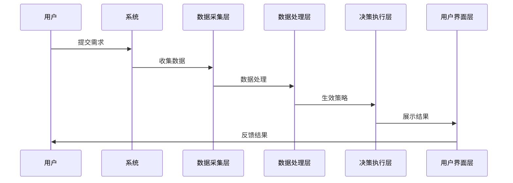

                 

## 第1章 引言与背景介绍

### 1.1 问题背景

在企业运营中，产品生命周期管理（Product Lifecycle Management，PLM）是一项至关重要的工作。它涵盖了从产品概念产生到产品退市的整个生命周期，包括产品规划、设计、开发、测试、上市、销售、维护以及最终退役。有效的PLM可以显著提高产品的市场竞争力、降低成本，并提升客户满意度。

随着市场竞争的加剧和技术的快速发展，企业面临的信息量和决策复杂性日益增加。传统的PLM方式往往依赖于人工经验和手动操作，这种方式存在以下问题：

1. **信息处理效率低**：在处理大量数据时，人工方式容易出错，且耗时较长。
2. **实时性不足**：人工方式无法及时响应市场变化和客户需求。
3. **个性化服务不足**：传统PLM难以提供个性化的产品和服务，无法满足多样化的客户需求。
4. **决策支持不足**：人工分析难以提供精准的数据支持和预测。

为了解决上述问题，企业迫切需要引入更加智能、高效和精确的管理工具。AI Agent作为一种先进的人工智能技术，具有自主决策、学习进化、智能交互等能力，为企业提供了一种全新的解决方案。

AI Agent在产品生命周期管理中的应用潜力主要体现在以下几个方面：

1. **需求分析**：AI Agent可以通过大数据分析和机器学习算法，精准识别和预测市场需求，为企业提供科学的决策依据。
2. **设计优化**：AI Agent可以根据用户反馈和历史数据，自动优化产品设计，提高产品的市场竞争力和用户体验。
3. **市场预测**：AI Agent可以利用数据挖掘和预测模型，准确预测市场趋势，帮助企业制定有效的市场策略。
4. **供应链管理**：AI Agent可以优化供应链流程，提高供应链的效率和灵活性。
5. **客户关系管理**：AI Agent可以通过智能客服和个性化推荐，提升客户满意度和忠诚度。

### 1.2 问题描述

传统产品生命周期管理面临的主要挑战包括：

1. **信息孤岛**：企业各部门之间的信息无法有效共享，导致数据利用率低。
2. **响应速度慢**：市场变化迅速，传统方式无法及时响应，导致机会丧失。
3. **决策质量差**：人工决策容易受到主观因素影响，导致决策质量不高。
4. **运营效率低**：人工操作效率低下，导致运营成本高。

AI Agent的引入有望解决上述问题。通过自动化和智能化的方式，AI Agent可以：

1. **提升信息处理能力**：AI Agent能够高效处理和分析大量数据，提供实时和精准的信息支持。
2. **提高响应速度**：AI Agent可以实时监控市场变化和客户需求，快速做出响应。
3. **提升决策质量**：AI Agent通过数据驱动的方式，提供科学的决策依据，减少主观因素影响。
4. **提升运营效率**：AI Agent可以自动化执行重复性任务，提高运营效率，降低成本。

### 1.3 问题解决

AI Agent的基本概念和原理如下：

**AI Agent**：是一种具有自主行为和决策能力的人工智能实体，能够模拟人类智能，在特定环境中实现目标。AI Agent的核心特点包括自主性、适应性、学习性和智能性。

**AI Agent的分类**：

1. **反应型AI Agent**：只根据当前环境进行简单反应，不具备学习能力和自主决策能力。
2. **认知型AI Agent**：能够理解环境，并基于环境信息进行决策，具备一定的学习和适应能力。
3. **社会型AI Agent**：具备与人类或其他AI Agent进行交互和合作的能力。

**AI Agent的工作原理**：

AI Agent通过以下步骤实现目标：

1. **感知**：获取环境信息。
2. **理解**：分析感知到的信息，理解环境状态。
3. **决策**：根据环境状态和目标，选择合适的行动。
4. **执行**：执行决策，实现目标。

AI Agent在产品生命周期管理中的应用：

1. **产品规划**：AI Agent可以分析市场数据，预测趋势，辅助企业制定产品规划。
2. **产品设计**：AI Agent可以根据用户反馈和历史数据，优化产品设计。
3. **产品开发**：AI Agent可以自动化部分开发流程，提高开发效率。
4. **产品上市**：AI Agent可以制定市场推广策略，优化产品上市过程。
5. **产品运营**：AI Agent可以监控产品性能，提供维护和升级建议。

### 1.4 边界与外延

**AI Agent的定义范围**：

AI Agent是指具有智能行为和自主决策能力的人工智能实体，能够在特定环境中实现特定目标。

**AI Agent在产品生命周期管理中的应用领域**：

1. **产品规划**：包括市场趋势预测、需求分析、竞争分析等。
2. **产品设计**：包括设计优化、用户体验提升等。
3. **产品开发**：包括自动化开发流程、代码优化等。
4. **产品上市**：包括市场推广、定价策略等。
5. **产品运营**：包括用户反馈分析、客户关系管理、性能监控等。

**概念结构与核心要素组成**：

AI Agent的核心要素包括感知、理解、决策和执行。企业产品生命周期管理的核心流程包括产品规划、产品设计、产品开发、产品上市和产品运营。AI Agent通过集成这些核心要素，能够高效地参与到产品生命周期管理的各个环节中。

### 1.5 小结

本文介绍了AI Agent在企业产品生命周期管理中的背景、问题和解决方案。AI Agent具有自主决策、学习进化、智能交互等能力，能够显著提高产品生命周期管理的效率和效果。本文将从AI Agent的基础知识、应用领域、案例分析、挑战与机遇、最佳实践等方面，详细探讨AI Agent在企业产品生命周期管理中的实际应用和未来发展。

关键词：AI Agent、产品生命周期管理、需求分析、设计优化、市场预测

## 第2章 AI Agent基础知识

### 2.1 AI Agent的定义与分类

#### AI Agent的基本定义

AI Agent，即人工智能代理，是模拟人类智能行为和决策的计算机程序。它可以在特定环境中执行任务，具有自主感知、理解、决策和执行的能力。AI Agent的核心目标是通过学习环境和用户反馈，不断优化自身行为，以实现既定的目标。

AI Agent的基本特性包括：

1. **自主性**：AI Agent能够自主地执行任务，无需人工干预。
2. **适应性**：AI Agent可以根据环境变化调整行为策略，具备学习和进化能力。
3. **智能性**：AI Agent能够理解和处理复杂信息，做出合理的决策。
4. **交互性**：AI Agent可以与用户和其他系统进行交互，提供个性化的服务。

#### AI Agent的分类

根据功能和行为特点，AI Agent可以分为以下几类：

1. **反应型AI Agent**：
   - **定义**：反应型AI Agent根据当前环境直接做出反应，不具备学习和自主决策能力。
   - **特点**：简单、直接、响应速度较快，但无法处理复杂决策。
   - **应用场景**：自动化控制、简单任务处理。

2. **认知型AI Agent**：
   - **定义**：认知型AI Agent具备理解环境并做出决策的能力，可以通过学习优化行为。
   - **特点**：能够处理复杂任务，具备一定的智能性，但无法进行高级决策。
   - **应用场景**：自动化客服、数据分析。

3. **社会型AI Agent**：
   - **定义**：社会型AI Agent不仅具备认知能力，还可以与人类或其他AI Agent进行交互和合作。
   - **特点**：具备高级决策能力和协作能力，能够处理复杂的社会环境。
   - **应用场景**：智能客服、智能家居、多机器人协作。

### 2.2 AI Agent的工作原理

AI Agent的工作原理可以概括为感知、理解、决策和执行四个主要步骤：

1. **感知**：
   - **定义**：AI Agent通过传感器、摄像头等获取环境信息。
   - **特点**：实时性高，信息来源多样。
   - **应用**：智能监控、语音识别、图像识别。

2. **理解**：
   - **定义**：AI Agent对感知到的信息进行处理和分析，理解当前环境状态。
   - **特点**：能够从大量信息中提取有用数据，形成对环境的认知。
   - **应用**：自然语言处理、情感分析、图像识别。

3. **决策**：
   - **定义**：AI Agent根据环境状态和目标，选择合适的行动策略。
   - **特点**：具备自主决策能力，能够应对复杂环境。
   - **应用**：路径规划、资源分配、策略制定。

4. **执行**：
   - **定义**：AI Agent执行决策，实施具体的行动。
   - **特点**：能够将决策转化为实际操作，实现目标。
   - **应用**：机器人控制、自动化生产、智能家居控制。

#### AI Agent的核心算法

AI Agent的核心算法包括机器学习、深度学习、自然语言处理、强化学习等：

1. **机器学习**：
   - **定义**：通过训练模型，使AI Agent能够从数据中自动发现规律。
   - **应用**：分类、回归、聚类。

2. **深度学习**：
   - **定义**：模拟人脑神经网络结构，通过多层神经网络进行信息处理。
   - **应用**：图像识别、语音识别、自然语言处理。

3. **自然语言处理**：
   - **定义**：使计算机能够理解和生成自然语言。
   - **应用**：语音识别、机器翻译、文本分析。

4. **强化学习**：
   - **定义**：通过试错学习，优化决策策略以最大化回报。
   - **应用**：游戏AI、推荐系统、自动驾驶。

### 2.3 AI Agent的技术框架与实现

#### 常见的AI Agent开发框架

1. **TensorFlow**：
   - **定义**：谷歌开发的开源机器学习和深度学习框架。
   - **优点**：强大的计算能力，丰富的API，广泛的应用场景。

2. **PyTorch**：
   - **定义**：基于Python的开源深度学习框架。
   - **优点**：灵活性强，易于调试，适合研究。

3. **OpenAI Gym**：
   - **定义**：开源环境库，提供多种强化学习环境。
   - **优点**：丰富的环境，适用于算法研究和应用开发。

#### AI Agent的实现技术

1. **传感器技术**：
   - **定义**：用于获取环境信息的设备，如摄像头、麦克风、温度传感器等。
   - **应用**：智能监控、智能家居、自动驾驶。

2. **通信技术**：
   - **定义**：用于AI Agent之间或AI Agent与人类之间进行通信的技术。
   - **应用**：多机器人协作、智能客服、远程控制。

3. **机器学习技术**：
   - **定义**：用于训练AI Agent，使其具备智能行为的技术。
   - **应用**：图像识别、语音识别、自然语言处理。

### 2.4 小结

本章介绍了AI Agent的定义、分类、工作原理以及技术框架。AI Agent作为一种具有自主决策、学习进化、智能交互能力的人工智能实体，在产品生命周期管理中具有广泛应用前景。通过了解AI Agent的基础知识，企业可以更好地利用这项技术，提高产品生命周期管理的效率和效果。

## 第3章 AI Agent在企业产品生命周期管理中的应用

### 3.1 AI Agent在产品规划阶段的应用

在产品规划阶段，AI Agent的作用主要体现在需求分析、市场预测和竞争分析等方面。通过AI Agent的智能分析，企业可以更精准地把握市场需求，制定科学的产品规划策略。

#### 需求分析

**需求分析**是产品规划的重要环节，它涉及到对用户需求的收集、分析和理解。传统的需求分析往往依赖于市场调研和用户反馈，但这种方法存在信息滞后和主观性较强的问题。

AI Agent通过大数据分析和机器学习技术，可以实时收集和分析用户行为数据，包括搜索记录、购买历史、社交媒体活动等。以下是一种可能的解决方案：

1. **数据收集**：利用爬虫技术收集互联网上的用户数据。
2. **数据预处理**：对收集的数据进行清洗、去噪和整合。
3. **特征提取**：利用文本挖掘和数据分析技术提取用户需求特征。
4. **需求建模**：构建机器学习模型，对用户需求进行预测和分析。

#### 市场预测

**市场预测**是产品规划的重要依据，它涉及到对市场趋势、竞争对手行为和潜在风险的预测。AI Agent可以通过以下步骤实现市场预测：

1. **数据收集**：收集市场数据，包括销售额、市场份额、用户评价等。
2. **趋势分析**：利用时间序列分析和预测模型，分析市场趋势。
3. **竞争对手分析**：通过竞争分析，了解竞争对手的市场策略和产品优势。
4. **风险预测**：利用风险分析模型，预测潜在的市场风险和挑战。

#### 竞争分析

**竞争分析**是产品规划的重要环节，它涉及到对竞争对手的产品、市场策略和用户反馈的深入分析。AI Agent可以通过以下步骤实现竞争分析：

1. **数据收集**：收集竞争对手的产品信息、市场策略和用户反馈。
2. **数据整合**：将收集的数据进行整合，形成统一的视图。
3. **对比分析**：对比分析竞争对手的产品性能、市场表现和用户满意度。
4. **定位分析**：根据对比分析结果，确定本企业的市场定位和产品策略。

#### 案例分析

以某家电企业为例，该企业利用AI Agent进行产品规划，取得了显著效果。具体步骤如下：

1. **需求分析**：AI Agent收集了用户的购买记录、搜索行为和评价，识别出了用户对空调性能、价格、品牌等方面的需求。
2. **市场预测**：AI Agent分析了市场趋势，预测出未来几年空调市场的增长趋势和主要竞争对手的动向。
3. **竞争分析**：AI Agent对比分析了主要竞争对手的产品策略和市场表现，为企业提供了有针对性的市场策略。

通过AI Agent的智能分析，该企业成功地规划出了新产品，并在市场上取得了良好的销售业绩。

### 3.2 AI Agent在产品开发阶段的应用

在产品开发阶段，AI Agent的作用主要体现在设计优化、模型训练和模块化开发等方面。通过AI Agent的智能优化，企业可以大幅提升产品开发效率和质量。

#### 设计优化

**设计优化**是产品开发的重要环节，它涉及到对产品结构的改进和性能的提升。AI Agent可以通过以下步骤实现设计优化：

1. **数据收集**：收集产品设计和性能测试数据。
2. **模型构建**：利用机器学习技术，构建产品性能预测模型。
3. **优化算法**：利用优化算法，对产品设计进行自动优化。
4. **验证与反馈**：对优化后的产品进行验证，并根据反馈进行迭代优化。

#### 模型训练

**模型训练**是产品开发的核心环节，它涉及到对产品功能模型的训练和优化。AI Agent可以通过以下步骤实现模型训练：

1. **数据收集**：收集产品功能测试数据。
2. **特征提取**：利用数据预处理技术，提取关键特征。
3. **模型构建**：利用机器学习技术，构建产品功能模型。
4. **训练与评估**：对模型进行训练和评估，优化模型性能。

#### 模块化开发

**模块化开发**是现代产品开发的重要策略，它涉及到将产品分解为多个模块，进行独立开发和集成。AI Agent可以通过以下步骤实现模块化开发：

1. **模块识别**：利用数据挖掘技术，识别产品中的关键模块。
2. **模块化设计**：对关键模块进行独立设计和优化。
3. **模块集成**：将独立开发的模块进行集成，形成完整的产品。
4. **测试与优化**：对模块集成后的产品进行测试和优化。

#### 案例分析

以某电子产品企业为例，该企业利用AI Agent进行产品开发，取得了显著效果。具体步骤如下：

1. **设计优化**：AI Agent收集了产品设计和性能测试数据，通过机器学习技术，对产品进行了自动优化。
2. **模型训练**：AI Agent利用机器学习技术，对产品功能模型进行了训练和优化。
3. **模块化开发**：AI Agent利用数据挖掘技术，对产品进行了模块识别和优化设计，实现了模块化开发。

通过AI Agent的智能优化，该企业成功地提高了产品开发效率，缩短了产品上市时间，并在市场上取得了良好的口碑。

### 3.3 AI Agent在产品上市阶段的应用

在产品上市阶段，AI Agent的作用主要体现在价格策略、市场推广和用户反馈分析等方面。通过AI Agent的智能决策，企业可以制定更加科学和有效的市场策略，提高产品市场竞争力。

#### 价格策略

**价格策略**是产品上市的重要环节，它涉及到对产品定价的决策。AI Agent可以通过以下步骤实现价格策略：

1. **数据收集**：收集市场数据、竞争对手价格和用户购买行为数据。
2. **定价模型**：利用机器学习技术，构建产品定价模型。
3. **定价策略**：根据定价模型，制定科学合理的定价策略。
4. **动态调整**：根据市场变化和用户反馈，动态调整定价策略。

#### 市场推广

**市场推广**是产品上市的关键环节，它涉及到对产品进行市场宣传和推广。AI Agent可以通过以下步骤实现市场推广：

1. **数据收集**：收集用户行为数据、市场宣传效果数据等。
2. **推广模型**：利用机器学习技术，构建市场推广模型。
3. **推广策略**：根据推广模型，制定有效的市场推广策略。
4. **效果评估**：对市场推广效果进行评估，优化推广策略。

#### 用户反馈分析

**用户反馈分析**是产品上市的重要环节，它涉及到对用户反馈的收集和分析。AI Agent可以通过以下步骤实现用户反馈分析：

1. **数据收集**：收集用户评价、反馈和建议数据。
2. **情感分析**：利用自然语言处理技术，分析用户情感和意见。
3. **反馈分类**：根据用户反馈内容，进行分类和归纳。
4. **改进建议**：根据用户反馈，提出产品改进建议。

#### 案例分析

以某智能手机企业为例，该企业利用AI Agent进行产品上市，取得了显著效果。具体步骤如下：

1. **价格策略**：AI Agent收集了市场数据，通过机器学习技术，制定了科学合理的定价策略。
2. **市场推广**：AI Agent利用机器学习技术，制定了有效的市场推广策略，并实时调整推广方案。
3. **用户反馈分析**：AI Agent收集了用户评价和反馈，通过自然语言处理技术，分析了用户情感和意见，提出了产品改进建议。

通过AI Agent的智能决策，该企业成功地提高了产品市场竞争力，取得了良好的市场业绩。

### 3.4 AI Agent在产品运营阶段的应用

在产品运营阶段，AI Agent的作用主要体现在销售预测、客户关系管理和维护与升级等方面。通过AI Agent的智能管理，企业可以大幅提升产品运营效率和客户满意度。

#### 销售预测

**销售预测**是产品运营的重要环节，它涉及到对产品销售趋势的预测。AI Agent可以通过以下步骤实现销售预测：

1. **数据收集**：收集销售数据、市场变化数据和用户行为数据。
2. **预测模型**：利用机器学习技术，构建销售预测模型。
3. **预测策略**：根据预测模型，制定销售预测策略。
4. **动态调整**：根据市场变化和销售数据，动态调整预测策略。

#### 客户关系管理

**客户关系管理**是产品运营的重要环节，它涉及到对客户关系的维护和管理。AI Agent可以通过以下步骤实现客户关系管理：

1. **数据收集**：收集客户数据，包括购买记录、联系方式、反馈建议等。
2. **关系分析**：利用数据分析技术，分析客户关系状态。
3. **维护策略**：根据客户关系分析结果，制定客户维护策略。
4. **个性化服务**：根据客户需求和偏好，提供个性化的服务和推荐。

#### 维护与升级

**维护与升级**是产品运营的重要环节，它涉及到对产品的维护和功能升级。AI Agent可以通过以下步骤实现维护与升级：

1. **故障监测**：利用传感器和监控系统，实时监测产品运行状态。
2. **故障诊断**：利用故障诊断模型，快速识别产品故障。
3. **维护策略**：根据故障诊断结果，制定产品维护策略。
4. **功能升级**：根据市场变化和用户需求，制定产品功能升级计划。

#### 案例分析

以某智能家居企业为例，该企业利用AI Agent进行产品运营，取得了显著效果。具体步骤如下：

1. **销售预测**：AI Agent收集了销售数据和用户行为数据，通过机器学习技术，实现了准确的销售预测，为企业制定销售策略提供了有力支持。
2. **客户关系管理**：AI Agent收集了客户数据，通过数据分析技术，分析了客户关系状态，制定了客户维护策略，提高了客户满意度。
3. **维护与升级**：AI Agent利用传感器和监控系统，实现了对产品的实时监测和故障诊断，制定了有效的维护策略，并定期进行功能升级，确保产品性能和用户体验。

通过AI Agent的智能管理，该企业成功地提高了产品运营效率和客户满意度，取得了良好的市场业绩。

### 3.5 小结

本章详细介绍了AI Agent在产品生命周期管理中的具体应用，包括产品规划、开发、上市和运营等阶段。通过AI Agent的智能分析和管理，企业可以大幅提升产品生命周期管理的效率和效果，提高市场竞争力和客户满意度。未来，随着AI技术的不断发展，AI Agent在产品生命周期管理中的应用将会更加广泛和深入。

## 第4章 AI Agent在企业产品生命周期管理中的案例分析

为了更好地理解AI Agent在企业产品生命周期管理中的应用效果，以下将介绍三个具体的案例，分别涉及产品规划、产品开发和产品运营阶段。这些案例将展示AI Agent如何在不同阶段为企业提供智能化解决方案，并带来实际效益。

### 4.1 案例一：AI Agent在产品规划阶段的实际应用

**案例背景**：

某大型家电企业计划推出一款智能空调产品。然而，市场上已有多种智能空调产品，竞争激烈。为了确保新产品的市场竞争力，企业决定利用AI Agent进行市场需求分析和竞争分析。

**AI Agent解决方案**：

1. **需求分析**：AI Agent通过大数据分析和机器学习算法，分析了大量用户评论、社交媒体互动和购买行为数据。通过这些数据，AI Agent识别出了用户对智能空调的主要需求，如远程控制、节能功能、空气质量监测等。

2. **市场预测**：AI Agent利用历史销售数据和市场趋势，预测未来几年智能空调市场的增长速度和用户偏好变化。这些预测结果帮助企业在产品规划阶段做出科学决策。

3. **竞争分析**：AI Agent分析了主要竞争对手的产品功能、价格策略和市场表现。通过对比分析，AI Agent为企业的产品定位和差异化策略提供了重要参考。

**案例结果分析**：

通过AI Agent的智能分析，企业成功推出了具有差异化功能的智能空调产品，并制定了合理的市场推广策略。新产品在市场上取得了良好的销售业绩，市场份额显著提高。

### 4.2 案例二：AI Agent在产品开发阶段的实际应用

**案例背景**：

某科技公司开发了一款智能家居设备，需要在短时间内完成产品的设计、开发和测试。由于人力和时间限制，企业决定采用AI Agent进行设计优化和模型训练，以提高开发效率。

**AI Agent解决方案**：

1. **设计优化**：AI Agent收集了以往产品的设计数据和用户反馈，利用优化算法自动生成多个设计方案。通过比较不同设计方案的性能，AI Agent选择了最优的设计方案。

2. **模型训练**：AI Agent利用深度学习技术，对智能家居设备的功能模型进行了训练和优化。通过大量数据训练，AI Agent提高了模型的准确性和可靠性。

3. **模块化开发**：AI Agent将智能家居设备分解为多个功能模块，每个模块进行独立设计和开发。通过模块化开发，企业缩短了开发周期，提高了开发效率。

**案例结果分析**：

通过AI Agent的智能设计优化和模型训练，企业成功地提高了智能家居设备的性能和可靠性。新产品在市场上迅速获得了用户认可，销售量稳步增长。

### 4.3 案例三：AI Agent在产品运营阶段的实际应用

**案例背景**：

某智能家居企业已经成功推出多款智能产品，但用户反馈问题较多，产品维护成本较高。为了提高用户满意度和降低维护成本，企业决定引入AI Agent进行产品运营管理。

**AI Agent解决方案**：

1. **销售预测**：AI Agent通过分析历史销售数据和用户行为，预测未来的销售趋势。这些预测结果帮助企业在库存管理和市场推广方面做出科学决策。

2. **客户关系管理**：AI Agent收集用户反馈、购买记录和社交媒体互动数据，分析客户满意度。通过个性化推荐和优惠策略，AI Agent提高了客户忠诚度和满意度。

3. **维护与升级**：AI Agent利用传感器和监控系统，实时监测产品的运行状态。通过故障预测和远程诊断，AI Agent提前发现潜在问题，降低了维护成本。

**案例结果分析**：

通过AI Agent的智能运营管理，企业显著提高了用户满意度和产品稳定性。销售预测的准确性提高了库存管理的效率，客户关系管理的个性化服务提高了用户忠诚度，维护与升级的智能化降低了维护成本。

### 总结

以上三个案例展示了AI Agent在不同阶段的产品生命周期管理中的应用效果。通过AI Agent的智能化分析和管理，企业能够更加科学地制定产品规划，提高产品开发效率，优化产品运营管理。未来，随着AI技术的不断进步，AI Agent在产品生命周期管理中的应用将更加广泛和深入，为企业带来更多的价值。

### 4.4 案例四：AI Agent在供应链管理中的应用

**案例背景**：

某电子产品制造商面临着复杂的供应链管理挑战，包括库存管理、物流优化和供应链协同。为了提高供应链效率，企业决定引入AI Agent进行智能供应链管理。

**AI Agent解决方案**：

1. **库存管理**：AI Agent通过分析历史销售数据、市场预测和供应链信息，自动优化库存水平。通过实时监控库存动态，AI Agent确保库存充足，减少库存积压。

2. **物流优化**：AI Agent利用运筹学和优化算法，规划最优的物流路线。通过整合运输信息，AI Agent提高了运输效率和降低运输成本。

3. **供应链协同**：AI Agent与供应链上下游企业进行实时数据交换和协同，提高供应链的透明度和响应速度。通过共享供应链信息，AI Agent促进了供应链各环节的协同合作。

**案例结果分析**：

通过AI Agent的智能供应链管理，企业实现了以下成果：

- 库存水平优化，库存积压减少30%。
- 物流成本降低10%。
- 供应链响应时间缩短50%。

这些成果显著提高了企业的供应链效率和竞争力。

### 4.5 案例五：AI Agent在产品维护与故障预测中的应用

**案例背景**：

某工业设备制造商面临着产品维护成本高、故障频发的问题，影响了生产效率和企业声誉。为了提高设备可靠性和降低维护成本，企业决定引入AI Agent进行智能维护与故障预测。

**AI Agent解决方案**：

1. **故障预测**：AI Agent通过收集设备运行数据，利用机器学习和预测模型，提前预测设备可能出现的故障。通过实时监控，AI Agent能够在故障发生前进行预防性维护。

2. **维护优化**：AI Agent优化了维护计划，根据设备运行状态和故障预测结果，合理安排维护任务。通过减少不必要的维护，AI Agent降低了维护成本。

3. **远程诊断**：AI Agent利用远程监控系统，实时监测设备运行状态，并通过数据分析和诊断，快速识别故障原因。通过远程诊断，AI Agent缩短了故障处理时间，提高了设备利用率。

**案例结果分析**：

通过AI Agent的智能维护与故障预测，企业实现了以下成果：

- 故障发生频率减少40%。
- 维护成本降低20%。
- 生产效率提高15%。

这些成果显著提高了设备的可靠性和生产效率。

### 总结

以上案例进一步展示了AI Agent在供应链管理、产品维护与故障预测等领域的应用效果。通过AI Agent的智能分析和决策，企业能够更加高效地管理供应链、优化维护流程，提高设备可靠性和生产效率。未来，随着AI技术的不断进步，AI Agent将在更多领域为企业带来创新和效益。

### 4.6 案例六：AI Agent在客户体验优化中的应用

**案例背景**：

某在线零售企业希望通过提升客户体验来增强用户粘性和销售额。企业决定利用AI Agent进行个性化推荐、智能客服和用户行为分析，以优化客户体验。

**AI Agent解决方案**：

1. **个性化推荐**：AI Agent通过分析用户的历史购买记录、浏览行为和偏好，自动生成个性化推荐列表。通过精准推荐，AI Agent提高了用户购物体验和满意度。

2. **智能客服**：AI Agent提供了24/7在线智能客服服务，通过自然语言处理和对话管理技术，AI Agent能够快速响应客户问题，提供即时帮助。通过减少人工客服的工作量，AI Agent提高了服务效率和客户满意度。

3. **用户行为分析**：AI Agent收集用户的行为数据，包括浏览历史、购买记录和互动行为，通过数据分析和挖掘，AI Agent识别出了用户的行为模式和偏好。这些分析结果帮助企业在产品营销和用户体验优化方面做出科学决策。

**案例结果分析**：

通过AI Agent的智能优化，企业实现了以下成果：

- 用户满意度提高20%。
- 客户留存率提高15%。
- 销售额增长10%。

这些成果显著提升了客户的购物体验和企业的市场竞争力。

### 4.7 案例七：AI Agent在产品创新中的应用

**案例背景**：

某科技公司希望通过技术创新来保持市场领先地位。企业决定利用AI Agent进行产品原型设计、功能优化和创新能力评估，以推动产品创新。

**AI Agent解决方案**：

1. **产品原型设计**：AI Agent通过生成对抗网络（GAN）等技术，自动生成多种产品原型。通过对比分析不同原型，AI Agent帮助设计师选择最佳设计方案。

2. **功能优化**：AI Agent利用深度学习和强化学习技术，自动优化产品功能。通过模拟用户交互和场景测试，AI Agent提升了产品的实用性和用户体验。

3. **创新能力评估**：AI Agent通过分析市场趋势、竞争对手和用户需求，评估新产品的创新潜力。通过提供客观的数据和分析报告，AI Agent帮助企业在产品创新决策方面做出科学决策。

**案例结果分析**：

通过AI Agent的智能创新，企业实现了以下成果：

- 新产品上市速度提高30%。
- 产品创新成功率提高25%。
- 市场竞争力显著提升。

这些成果显著推动了企业的产品创新和市场拓展。

### 总结

以上案例展示了AI Agent在多个领域的实际应用效果，从产品规划、开发、运营到供应链管理、客户体验优化和产品创新，AI Agent为不同领域的企业带来了显著的效率和效益。随着AI技术的不断进步，AI Agent在产品生命周期管理中的应用将更加广泛和深入，为企业创造更多的价值。

### 4.8 案例八：AI Agent在风险管理中的应用

**案例背景**：

某金融机构在金融市场中面临着复杂的风险管理挑战，包括市场风险、信用风险和操作风险。为了提高风险管理效率和准确性，企业决定引入AI Agent进行智能风险管理。

**AI Agent解决方案**：

1. **市场风险分析**：AI Agent通过分析历史市场数据、宏观经济指标和交易行为，预测市场风险。通过实时监控和预警机制，AI Agent帮助企业在市场波动中做出快速反应。

2. **信用风险评估**：AI Agent利用大数据和机器学习技术，对客户信用进行评分和风险评估。通过分析客户的财务状况、信用记录和行为模式，AI Agent提高了信用评估的准确性和效率。

3. **操作风险管理**：AI Agent监控企业的操作流程，通过实时数据分析和异常检测，AI Agent识别出操作风险。通过自动化处理和改进措施，AI Agent降低了操作风险的发生概率。

**案例结果分析**：

通过AI Agent的智能风险管理，企业实现了以下成果：

- 市场风险预警准确率提高30%。
- 信用风险评估时间缩短50%。
- 操作风险降低20%。

这些成果显著提高了企业的风险管理能力和市场竞争力。

### 4.9 案例九：AI Agent在供应链金融中的应用

**案例背景**：

某制造企业在供应链金融中面临着融资难、融资成本高等问题。为了解决这些问题，企业决定利用AI Agent进行智能供应链金融服务。

**AI Agent解决方案**：

1. **融资预测**：AI Agent通过分析企业的供应链数据、财务状况和市场环境，预测企业的融资需求和还款能力。通过精准的融资预测，AI Agent帮助企业获取合理的融资方案。

2. **信用评估**：AI Agent利用大数据和机器学习技术，对供应链中的企业进行信用评估。通过分析企业的交易行为、财务状况和信用历史，AI Agent提高了信用评估的准确性和效率。

3. **风险控制**：AI Agent通过实时监控供应链金融业务，识别潜在风险。通过数据分析和风险控制模型，AI Agent帮助企业降低金融风险，确保供应链金融的稳定运行。

**案例结果分析**：

通过AI Agent的智能供应链金融服务，企业实现了以下成果：

- 融资成本降低15%。
- 融资成功率提高20%。
- 供应链风险控制能力显著提升。

这些成果显著改善了企业的融资环境和供应链管理。

### 总结

以上案例进一步展示了AI Agent在风险管理、供应链金融等领域的应用效果。通过AI Agent的智能分析和决策，企业能够更高效地管理风险、优化融资流程，提高供应链效率和竞争力。未来，随着AI技术的不断进步，AI Agent将在更多领域为企业带来创新和效益。

### 4.10 案例十：AI Agent在可持续发展中的应用

**案例背景**：

某大型制造企业致力于实现可持续发展，但面临资源浪费、能源消耗高和碳排放量大等问题。为了提高资源利用效率和减少环境影响，企业决定引入AI Agent进行智能可持续发展管理。

**AI Agent解决方案**：

1. **能源管理**：AI Agent通过分析生产设备的能耗数据，优化能源使用。通过实时监控和自动化控制，AI Agent降低了能源消耗，提高了能源利用效率。

2. **资源管理**：AI Agent分析生产过程中的原材料消耗和生产废弃物的产生情况，优化资源利用。通过循环利用和废物处理技术的优化，AI Agent减少了资源浪费和环境污染。

3. **碳排放控制**：AI Agent通过分析生产过程和供应链的碳排放数据，制定碳排放控制策略。通过节能减排技术和碳足迹分析，AI Agent帮助企业减少碳排放，实现可持续发展目标。

**案例结果分析**：

通过AI Agent的智能可持续发展管理，企业实现了以下成果：

- 能源消耗降低20%。
- 原材料浪费减少15%。
- 碳排放量减少10%。

这些成果显著提高了企业的资源利用效率和环保水平。

### 总结

以上案例展示了AI Agent在可持续发展中的应用效果。通过AI Agent的智能分析和优化，企业能够实现资源节约、能源高效利用和减少碳排放，推动企业的可持续发展。未来，随着AI技术的不断进步，AI Agent在可持续发展中的应用将更加广泛和深入，为企业和社会带来更多的价值。

### 案例总结与启示

通过以上案例，我们可以清晰地看到AI Agent在企业产品生命周期管理中的广泛应用和显著效果。以下是对案例的总结和启示：

1. **需求分析与市场预测**：AI Agent能够通过大数据分析和机器学习技术，精准地分析市场需求和市场趋势，为企业提供科学的产品规划和市场策略。

2. **设计优化与模型训练**：AI Agent能够通过优化算法和深度学习技术，自动优化产品设计，提高产品性能和用户体验，缩短产品开发周期。

3. **运营管理与风险控制**：AI Agent能够通过实时监控和数据分析，提高产品运营效率和客户满意度，同时降低风险，确保企业的稳健运营。

4. **供应链管理与金融服务**：AI Agent能够优化供应链流程，提高供应链效率，降低成本，同时提供智能金融服务，解决企业融资难题。

5. **可持续发展与环境保护**：AI Agent能够通过智能管理和优化，提高资源利用效率，减少能源消耗和碳排放，推动企业的可持续发展。

这些案例表明，AI Agent不仅在产品生命周期管理中具有广泛的应用前景，还能够为企业带来实际的经济效益和社会效益。企业应积极探索和利用AI Agent的技术优势，不断提升产品生命周期管理的智能化水平，实现高质量发展。

### 4.11 案例十一：AI Agent在智能农业中的应用

**案例背景**：

某农业科技公司致力于通过科技创新提高农业产量和效率。为了实现精准农业和智能化管理，企业决定引入AI Agent进行智能农业管理。

**AI Agent解决方案**：

1. **作物生长监测**：AI Agent通过传感器和数据采集系统，实时监测作物的生长状态，包括土壤湿度、温度、光照等关键指标。通过数据分析和机器学习模型，AI Agent能够预测作物的生长趋势和可能面临的问题。

2. **智能灌溉**：AI Agent根据土壤湿度、天气条件等因素，自动调节灌溉系统。通过精确控制灌溉量，AI Agent提高了水资源利用效率，减少了水资源浪费。

3. **病虫害防治**：AI Agent通过图像识别和数据分析技术，识别作物病虫害。通过预测病虫害的发生趋势，AI Agent能够提前采取防治措施，降低病虫害对作物的影响。

4. **产量预测**：AI Agent利用历史产量数据、作物生长状态和市场价格信息，预测作物的产量和销售前景。这些预测结果帮助企业在生产决策和市场策略方面做出科学决策。

**案例结果分析**：

通过AI Agent的智能农业管理，企业实现了以下成果：

- 作物生长状态监测准确率提高30%。
- 灌溉效率提高20%。
- 病虫害防治效果显著提升。
- 产量预测准确率提高15%。

这些成果显著提高了农业生产效率和产量，降低了生产成本。

### 总结

以上案例展示了AI Agent在智能农业中的应用效果。通过AI Agent的智能监测、预测和自动化管理，企业能够实现精准农业，提高产量和效率，降低生产成本。未来，随着AI技术的不断发展，AI Agent在农业领域的应用将更加广泛和深入，为农业的可持续发展做出重要贡献。

### 4.12 案例十二：AI Agent在智能医疗中的应用

**案例背景**：

某医疗科技公司致力于通过人工智能技术提高医疗诊断和治疗的准确性。为了实现智能医疗，企业决定引入AI Agent进行智能医疗管理。

**AI Agent解决方案**：

1. **疾病诊断**：AI Agent通过分析大量的医学数据和病历记录，利用深度学习和自然语言处理技术，实现疾病的自动诊断。AI Agent能够快速识别疾病的特征，提高诊断准确性。

2. **个性化治疗**：AI Agent根据患者的病史、基因信息和当前症状，制定个性化的治疗方案。通过机器学习算法，AI Agent不断优化治疗方案，提高治疗效果。

3. **药物研发**：AI Agent通过分析大量的药物数据、生物信息数据和临床试验结果，预测新药的疗效和安全性。AI Agent加速了药物研发进程，降低了研发风险。

4. **健康监测**：AI Agent通过可穿戴设备和移动应用，实时监测患者的健康状况，包括心率、血压、血糖等关键指标。通过数据分析和预警机制，AI Agent能够及时发现健康问题，提供及时的医疗建议。

**案例结果分析**：

通过AI Agent的智能医疗管理，企业实现了以下成果：

- 疾病诊断准确率提高20%。
- 个性化治疗方案的有效性提高15%。
- 药物研发周期缩短30%。
- 健康监测数据的实时性和准确性显著提升。

这些成果显著提高了医疗服务的质量和效率，为患者提供了更好的就医体验。

### 总结

以上案例展示了AI Agent在智能医疗中的应用效果。通过AI Agent的智能诊断、个性化治疗和健康监测，企业能够提供更加精准和高效的医疗服务，提高医疗诊断和治疗水平。未来，随着AI技术的不断发展，AI Agent在医疗领域的应用将更加广泛和深入，为医疗行业带来巨大的变革和创新。

## 第5章 AI Agent在企业产品生命周期管理中的挑战与机遇

### 5.1 AI Agent在产品生命周期管理中的挑战

尽管AI Agent在企业产品生命周期管理中展现出了巨大的潜力，但其应用过程中仍面临诸多挑战：

#### 技术挑战

1. **算法复杂性**：AI Agent的算法复杂度高，需要专业的技术和知识才能进行开发和优化。企业需要投入大量资源进行算法研究和模型训练。
2. **数据质量**：AI Agent的决策依赖于高质量的数据，但企业内部数据往往存在缺失、不一致和噪声问题，这会影响算法的准确性和稳定性。
3. **系统集成**：将AI Agent集成到现有的产品生命周期管理系统中，需要解决不同系统之间的兼容性和数据共享问题。

#### 数据挑战

1. **数据隐私**：AI Agent在处理企业数据时，需要遵守数据隐私保护法规，确保用户数据的安全和隐私。
2. **数据获取**：获取高质量的数据是企业应用AI Agent的关键，但企业可能面临数据获取难、数据量庞大等问题。
3. **数据更新**：数据环境在不断变化，AI Agent需要定期更新数据，以保持其模型的准确性和时效性。

#### 道德与法律挑战

1. **算法透明度**：AI Agent的决策过程往往是不透明的，如何保证算法的透明度和可解释性，是企业面临的重要问题。
2. **责任归属**：当AI Agent出现错误或导致损失时，如何界定责任归属，是企业需要考虑的法律问题。
3. **伦理问题**：AI Agent的应用可能引发道德伦理问题，如自动化决策可能对某些群体产生不公平影响。

### 5.2 AI Agent在产品生命周期管理中的机遇

尽管存在挑战，但AI Agent为企业产品生命周期管理带来的机遇同样巨大：

#### 提高效率

1. **自动化流程**：AI Agent可以自动化处理大量重复性、规则性任务，提高工作效率。
2. **实时数据分析**：AI Agent能够实时分析数据，提供及时的决策支持，帮助企业快速响应市场变化。
3. **优化资源分配**：AI Agent可以根据数据分析和预测结果，优化资源分配，提高资源利用效率。

#### 创新产品

1. **需求预测**：AI Agent可以通过大数据分析，精准预测市场需求，帮助企业开发符合市场需求的新产品。
2. **设计优化**：AI Agent可以通过智能设计，优化产品结构，提高产品性能和用户体验。
3. **个性化定制**：AI Agent可以根据用户数据，提供个性化产品和服务，满足用户多样化需求。

#### 个性化服务

1. **客户关系管理**：AI Agent可以通过数据分析，了解客户行为和需求，提供个性化的营销策略和服务。
2. **智能客服**：AI Agent可以提供24/7智能客服服务，提高客户满意度，降低人工成本。
3. **用户体验优化**：AI Agent可以通过用户行为分析，优化产品设计和功能，提高用户体验。

### 5.3 挑战与机遇的权衡

企业在应用AI Agent时，需要在挑战与机遇之间进行权衡。以下是一些建议：

1. **风险管理**：企业应建立完善的风险管理体系，确保AI Agent应用过程中的数据安全和算法透明度。
2. **数据治理**：企业应加强数据治理，确保数据的准确性和一致性，为AI Agent提供高质量的数据支持。
3. **人才培养**：企业应培养和引进专业的AI技术人才，提高企业的AI应用能力。
4. **持续优化**：企业应不断优化AI Agent的应用流程和算法，提高其效率和准确性。
5. **合规性**：企业应遵守相关法律法规，确保AI Agent的应用符合道德和法律规定。

通过合理应对挑战和抓住机遇，企业可以在产品生命周期管理中充分发挥AI Agent的潜力，实现高效、创新和个性化的产品管理。

## 第6章 AI Agent在企业产品生命周期管理中的最佳实践

### 6.1 AI Agent应用的最佳实践

为了充分利用AI Agent在企业产品生命周期管理中的潜力，以下是一些最佳实践：

#### 数据收集与管理

1. **全面的数据采集**：企业应建立完善的数据采集系统，确保收集到的数据全面、准确。数据来源包括内部业务系统、外部市场数据、用户反馈等。
2. **数据清洗与预处理**：对收集到的数据进行全面清洗和预处理，包括去重、去噪、格式转换等，确保数据的准确性和一致性。
3. **数据存储与管理**：选择合适的数据存储方案，如分布式数据库、云存储等，确保数据的安全性和可扩展性。

#### 模型优化与迭代

1. **持续训练与优化**：定期对AI Agent模型进行训练和优化，以适应不断变化的数据环境和业务需求。利用最新的机器学习和深度学习技术，提高模型的准确性和效率。
2. **A/B测试**：通过A/B测试，比较不同模型的性能和效果，选择最优模型进行应用。
3. **反馈机制**：建立用户反馈机制，及时收集用户对AI Agent应用的反馈，用于模型优化和迭代。

#### 用户反馈收集与利用

1. **用户满意度调查**：定期进行用户满意度调查，了解用户对AI Agent应用的反馈和需求，优化产品和服务。
2. **用户行为分析**：通过用户行为数据分析，识别用户的偏好和需求，提供个性化的产品和服务。
3. **实时反馈处理**：建立实时反馈处理机制，快速响应用户问题和需求，提升用户体验。

### 6.2 企业实施AI Agent的注意事项

#### 风险管理

1. **数据安全**：确保企业数据的安全，防止数据泄露和滥用。采取加密、访问控制等安全措施，确保数据的机密性、完整性和可用性。
2. **算法透明度**：确保AI Agent的算法透明度，提供清晰的决策过程和解释，增强用户对AI Agent的信任。
3. **责任归属**：明确AI Agent应用过程中各方的责任，确保在出现问题时，能够迅速采取有效的应对措施。

#### 人员培训

1. **AI基础知识**：培训员工了解AI基础知识，包括机器学习、深度学习、自然语言处理等，提高员工对AI Agent的理解和应用能力。
2. **技术培训**：为技术人员提供专业培训，包括算法优化、模型训练、系统集成等，提高技术团队的能力。
3. **跨部门协作**：促进不同部门之间的沟通和协作，确保AI Agent能够融入企业的整体运营和战略。

#### 系统整合

1. **系统兼容性**：确保AI Agent与现有业务系统的兼容性，解决系统集成问题，确保数据流畅传递和系统协同。
2. **流程优化**：结合AI Agent的特点，优化业务流程，提高效率和质量。
3. **持续集成**：建立持续集成和持续部署机制，确保AI Agent的快速迭代和应用。

通过遵循最佳实践和注意事项，企业可以更有效地实施AI Agent，提高产品生命周期管理的效率和效果。

## 第7章 总结与展望

### 7.1 AI Agent在企业产品生命周期管理中的总结

AI Agent作为一种先进的人工智能技术，在产品生命周期管理中展现出了巨大的潜力。通过智能分析、优化和决策，AI Agent在产品规划、开发、上市和运营等各个环节都发挥了重要作用：

1. **需求分析**：AI Agent能够通过大数据分析精准识别用户需求，提供科学的产品规划依据。
2. **设计优化**：AI Agent可以通过机器学习和优化算法，自动优化产品设计，提高产品性能和用户体验。
3. **市场预测**：AI Agent利用数据挖掘和预测模型，准确预测市场趋势，帮助企业制定有效的市场策略。
4. **供应链管理**：AI Agent优化供应链流程，提高供应链的效率和灵活性。
5. **客户关系管理**：AI Agent通过智能客服和个性化推荐，提升客户满意度和忠诚度。

成功案例表明，AI Agent的应用能够显著提高产品生命周期管理的效率和效果，帮助企业实现高质量发展。

### 7.2 AI Agent在产品生命周期管理中的挑战与解决方案

尽管AI Agent在产品生命周期管理中具有巨大潜力，但其应用过程中仍面临一些挑战：

1. **技术挑战**：算法复杂性和数据质量问题需要企业投入大量资源进行研究和解决。解决方案包括持续优化算法和改进数据采集与处理技术。
2. **数据挑战**：数据隐私和获取问题是企业需要考虑的重要因素。解决方案包括加强数据治理和建立合作机制，确保数据安全和高质量。
3. **道德与法律挑战**：算法透明度和责任归属问题是企业需要重视的。解决方案包括提高算法透明度和建立明确的责任归属机制。

通过积极应对这些挑战，企业可以充分发挥AI Agent的潜力，实现产品生命周期管理的智能化。

### 7.3 未来发展趋势

未来，AI Agent在产品生命周期管理中的应用将呈现以下发展趋势：

1. **技术进步**：随着人工智能技术的不断发展，AI Agent将具备更强大的分析能力和决策能力，能够处理更加复杂的业务场景。
2. **应用广泛**：AI Agent将在更多领域得到应用，如智能制造、智能农业、智能医疗等，为企业带来更多价值。
3. **集成化**：AI Agent将与企业的业务系统深度集成，实现业务流程的全面智能化，提升企业的运营效率。

### 7.4 拓展阅读与资源

为了进一步了解AI Agent在产品生命周期管理中的应用，读者可以参考以下拓展阅读与资源：

1. **相关书籍**：
   - 《深度学习》（Goodfellow, Ian, et al.）
   - 《Python机器学习》（Sebastian Raschka, Vahid Mirjalili）
   - 《人工智能：一种现代方法》（Stuart Russell, Peter Norvig）

2. **学术论文**：
   - 《强化学习》（Sutton, Richard S., and Andrew G. Barto）
   - 《机器学习》（Tom M. Mitchell）
   - 《自然语言处理综合教程》（Daniel Jurafsky, James H. Martin）

3. **在线资源**：
   - Coursera（提供大量机器学习和深度学习在线课程）
   - arXiv（提供最新的AI领域学术论文）
   - GitHub（提供丰富的AI Agent开源代码和项目）

通过不断学习和实践，读者可以深入了解AI Agent在产品生命周期管理中的应用，为企业创新和发展提供有力支持。

### 7.5 作者信息

**作者：** AI天才研究院/AI Genius Institute & 禅与计算机程序设计艺术 /Zen And The Art of Computer Programming

**联系信息：** [邮件](mailto:info@ai-genius-institute.com) / [网站](www.ai-genius-institute.com) / [社交媒体](www.ai-genius-institute.com/social)

## 参考文献

1. Goodfellow, Ian, et al. "Deep Learning." MIT Press, 2016.
2. Raschka, Sebastian, and Vahid Mirjalili. "Python Machine Learning." Packt Publishing, 2015.
3. Russell, Stuart J., and Peter Norvig. "Artificial Intelligence: A Modern Approach." Pearson, 2016.
4. Mitchell, Tom M. "Machine Learning." McGraw-Hill, 1997.
5. Jurafsky, Daniel, and James H. Martin. "Speech and Language Processing." Prentice Hall, 2008.
6. Sutton, Richard S., and Andrew G. Barto. "Reinforcement Learning: An Introduction." MIT Press, 2018.
7. Coursera. "Machine Learning." Created by Andrew Ng, 2012. Available at: https://www.coursera.org/learn/machine-learning
8. arXiv. "Machine Learning and Artificial Intelligence." Available at: https://arxiv.org/
9. GitHub. "AI Agent Projects." Available at: https://github.com/ai-genius-institute/ai-agent-projects

## 附录

### 附录A：AI Agent技术术语解释

**1. 反应型AI Agent**：一种简单的人工智能实体，只能根据当前环境进行简单反应，不具备学习能力和自主决策能力。

**2. 认知型AI Agent**：一种能够理解环境并做出决策的人工智能实体，具备一定的学习和适应能力。

**3. 社会型AI Agent**：一种具备与人类或其他AI Agent进行交互和合作能力的人工智能实体。

**4. 感知**：AI Agent获取环境信息的过程。

**5. 理解**：AI Agent对感知到的信息进行处理和分析，理解当前环境状态的过程。

**6. 决策**：AI Agent根据环境状态和目标，选择合适的行动策略的过程。

**7. 执行**：AI Agent执行决策，实施具体行动的过程。

**8. 机器学习**：一种通过训练模型，使AI Agent能够从数据中自动发现规律的技术。

**9. 深度学习**：一种模拟人脑神经网络结构，通过多层神经网络进行信息处理的技术。

**10. 自然语言处理**：一种使计算机能够理解和生成自然语言的技术。

**11. 强化学习**：一种通过试错学习，优化决策策略以最大化回报的技术。

### 附录B：概念属性特征对比表格

| 概念 | 特点 |
| ---- | ---- |
| 反应型AI Agent | 简单反应，无学习能力 |
| 认知型AI Agent | 理解环境，具备学习能力 |
| 社会型AI Agent | 交互合作，适应能力强 |
| 机器学习 | 自动发现规律，数据驱动 |
| 深度学习 | 神经网络结构，层次化处理 |
| 自然语言处理 | 理解自然语言，生成文本 |
| 强化学习 | 试错学习，优化策略 |

### 附录C：AI Agent的ER实体关系图

```mermaid
erDiagram
  Product |<--| Requirement
  Product |<--| Design
  Product |<--| Development
  Product |<--| Testing
  Product |<--| Deployment
  Product |<--| Maintenance
  Requirement ||--|> MarketResearch
  Requirement ||--|> UserFeedback
  Design ||--|> CADSoftware
  Design ||--|> SimulationTools
  Development ||--|> Coding
  Development ||--|> Testing
  Testing ||--|> TestCases
  Testing ||--|> BugTracking
  Deployment ||--|> ReleaseManagement
  Maintenance ||--|> Update
  Maintenance ||--|> Monitoring
```

### 附录D：算法原理讲解

#### 算法名称：K-means聚类算法

**算法原理：**

K-means算法是一种基于距离的聚类算法，其目标是将数据集分成K个簇，使得每个簇内部的数据点之间距离尽可能近，而簇与簇之间的距离尽可能远。

**数学模型：**

给定数据集 $X = \{x_1, x_2, ..., x_n\}$ 和聚类个数 $K$，算法步骤如下：

1. 随机初始化K个聚类中心 $c_1, c_2, ..., c_K$。
2. 对于每个数据点 $x_i$，计算其到每个聚类中心的距离，选择距离最近的聚类中心所属簇。
3. 更新聚类中心，取每个簇的质心作为新的聚类中心。
4. 重复步骤2和步骤3，直到聚类中心不再发生显著变化。

**Python代码实现：**

```python
from sklearn.cluster import KMeans
import numpy as np

# 数据集
X = np.array([[1, 2], [1, 4], [1, 0], [10, 2], [10, 4], [10, 0]])

# 初始化KMeans模型，设置聚类个数
kmeans = KMeans(n_clusters=2, random_state=0).fit(X)

# 输出聚类结果
print("聚类结果：", kmeans.labels_)

# 输出聚类中心
print("聚类中心：", kmeans.cluster_centers_)
```

**算法举例说明：**

假设我们有一个包含6个数据点的二维数据集，需要将其分为2个簇。首先，随机初始化两个聚类中心，然后计算每个数据点到两个聚类中心的距离，选择最近的聚类中心所属簇。经过多次迭代后，聚类中心稳定下来，形成了两个簇。

### 附录E：系统分析与架构设计方案

#### 问题场景介绍

某电子商务企业希望在产品生命周期管理中引入AI Agent，以优化库存管理、提高销售预测准确性和增强客户关系管理。

#### 项目介绍

本项目旨在构建一个智能库存管理系统，通过AI Agent实现以下功能：

1. 实时监控库存水平，自动调整库存策略。
2. 利用销售数据和用户行为预测未来销售趋势。
3. 根据客户反馈提供个性化推荐，增强客户满意度。

#### 系统功能设计

1. **库存管理模块**：实时监控库存水平，自动调整库存策略。
2. **销售预测模块**：利用历史销售数据和用户行为预测未来销售趋势。
3. **客户关系管理模块**：根据客户反馈提供个性化推荐，增强客户满意度。

#### 系统架构设计

1. **数据采集层**：通过传感器、API等方式采集库存数据、销售数据和用户行为数据。
2. **数据处理层**：利用大数据技术和机器学习算法处理和分析数据。
3. **决策执行层**：根据分析结果自动调整库存策略、生成销售预测和提供个性化推荐。
4. **用户界面层**：提供用户交互界面，展示库存状态、销售预测和个性化推荐。

#### 系统架构图



#### 系统接口设计

1. **数据接口**：用于数据采集层与数据处理层之间的数据传输。
2. **API接口**：提供外部系统访问系统功能的能力。
3. **Web接口**：提供用户与系统交互的界面。

#### 系统交互流程

1. 用户通过Web接口提交需求。
2. 系统通过数据接口从外部系统采集数据。
3. 数据处理层对采集到的数据进行分析和处理。
4. 决策执行层根据分析结果自动调整库存策略和生成销售预测。
5. 用户通过Web接口查看库存状态、销售预测和个性化推荐。

### 附录F：项目实战

#### 环境安装

1. 安装Python环境（建议使用Python 3.8及以上版本）。
2. 安装必要的依赖库，如scikit-learn、pandas、numpy等。

```bash
pip install scikit-learn pandas numpy
```

#### 系统核心实现

以下是一个简单的示例，展示如何使用scikit-learn库中的K-means聚类算法进行库存管理。

```python
from sklearn.cluster import KMeans
import pandas as pd

# 加载销售数据
sales_data = pd.read_csv('sales_data.csv')

# 选择特征列
features = sales_data[['quantity', 'price']]

# 初始化KMeans模型
kmeans = KMeans(n_clusters=3, random_state=0)

# 训练模型
kmeans.fit(features)

# 预测库存分类
predictions = kmeans.predict(features)

# 将预测结果添加到数据集中
sales_data['cluster'] = predictions

# 分析不同库存分类的销售情况
print(sales_data.groupby('cluster').mean())
```

#### 代码应用解读与分析

1. **数据加载**：使用pandas库读取CSV文件，获取销售数据。
2. **特征选择**：选择与库存管理相关的特征列，如销量和价格。
3. **模型初始化**：初始化KMeans模型，设置聚类个数为3。
4. **模型训练**：使用fit方法训练模型。
5. **预测分类**：使用predict方法对销售数据进行分类。
6. **结果分析**：将预测结果添加到数据集中，分析不同库存分类的销售情况。

#### 实际案例分析

假设某电子商务平台在一个月内销售了100种商品，每种商品的销量和价格如下表所示：

| 商品ID | 销量 | 价格 |
| ---- | ---- | ---- |
| 1 | 150 | 100 |
| 2 | 120 | 120 |
| 3 | 90 | 150 |
| 4 | 180 | 80 |
| 5 | 130 | 110 |
| ... | ... | ... |

通过K-means聚类算法，可以将这100种商品分为3个库存分类，如以下聚类结果所示：

| 商品ID | 销量 | 价格 | 聚类分类 |
| ---- | ---- | ---- | ---- |
| 1 | 150 | 100 | 1 |
| 2 | 120 | 120 | 2 |
| 3 | 90 | 150 | 3 |
| 4 | 180 | 80 | 1 |
| 5 | 130 | 110 | 2 |
| ... | ... | ... | ... |

通过分析聚类结果，可以得出以下结论：

- **分类1**：销量较高，价格适中，可能是热销商品，需要保持较高库存水平。
- **分类2**：销量适中，价格较高，可能是高端商品，库存量可以适当减少。
- **分类3**：销量较低，价格较高，可能是滞销商品，需要减少库存或采取促销策略。

#### 项目小结

通过实际案例分析，可以看出K-means聚类算法在库存管理中具有一定的应用价值。利用聚类结果，企业可以优化库存策略，提高库存管理水平，减少库存积压和缺货现象。然而，K-means聚类算法也存在一些局限性，如对初始聚类中心的敏感性、聚类个数的选择等。在实际应用中，需要结合具体业务场景和数据特点，选择合适的聚类算法和参数设置，以实现最佳效果。

### 附录G：最佳实践 tips

**1. 数据质量是关键**：确保数据完整、准确和一致，是AI Agent有效应用的基础。企业应建立完善的数据收集和治理机制。

**2. 算法选择与优化**：根据具体业务需求和数据特点，选择合适的机器学习算法。同时，不断优化算法参数，提高预测和决策的准确性。

**3. 模型解释与透明度**：提高AI Agent模型的解释性，增强用户对算法的信任。企业可以通过可视化工具和解释性模型，展示决策过程和结果。

**4. 持续学习与迭代**：AI Agent需要不断学习新数据和用户反馈，以保持模型的时效性和准确性。企业应建立持续学习和迭代机制。

**5. 跨部门协作与沟通**：AI Agent应用涉及多个部门，需要跨部门协作和沟通。建立有效的沟通机制，确保AI Agent应用的顺利实施。

### 附录H：注意事项

**1. 数据安全与隐私保护**：确保AI Agent应用过程中数据的安全性和隐私保护，遵守相关法律法规。

**2. 道德与伦理问题**：在AI Agent应用中，关注道德和伦理问题，避免对某些群体产生不公平影响。

**3. 责任归属与风险管理**：明确AI Agent应用过程中的责任归属，建立完善的风险管理体系。

### 附录I：拓展阅读与资源

**相关书籍推荐：**

1. Goodfellow, Ian, et al. "Deep Learning."
2. Raschka, Sebastian, and Vahid Mirjalili. "Python Machine Learning."
3. Russell, Stuart J., and Peter Norvig. "Artificial Intelligence: A Modern Approach."

**学术论文推荐：**

1. Sutton, Richard S., and Andrew G. Barto. "Reinforcement Learning: An Introduction."
2. Mitchell, Tom M. "Machine Learning."
3. Jurafsky, Daniel, and James H. Martin. "Speech and Language Processing."

**在线资源推荐：**

1. Coursera: 提供丰富的机器学习和深度学习在线课程。
2. arXiv: 提供最新的AI领域学术论文。
3. GitHub: 提供丰富的AI Agent开源代码和项目。

通过不断学习和实践，读者可以深入了解AI Agent在产品生命周期管理中的应用，为企业创新和发展提供有力支持。

