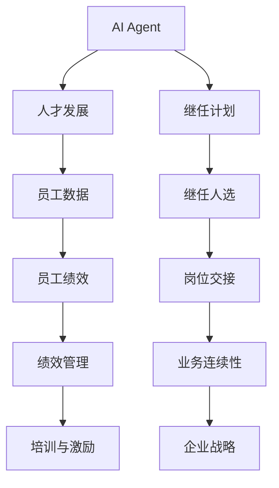
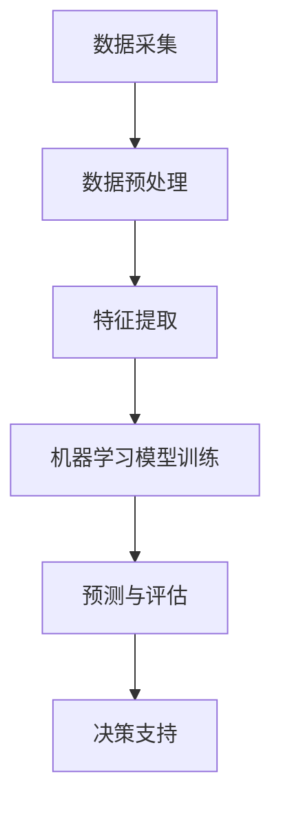
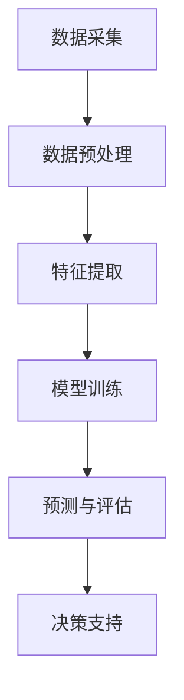
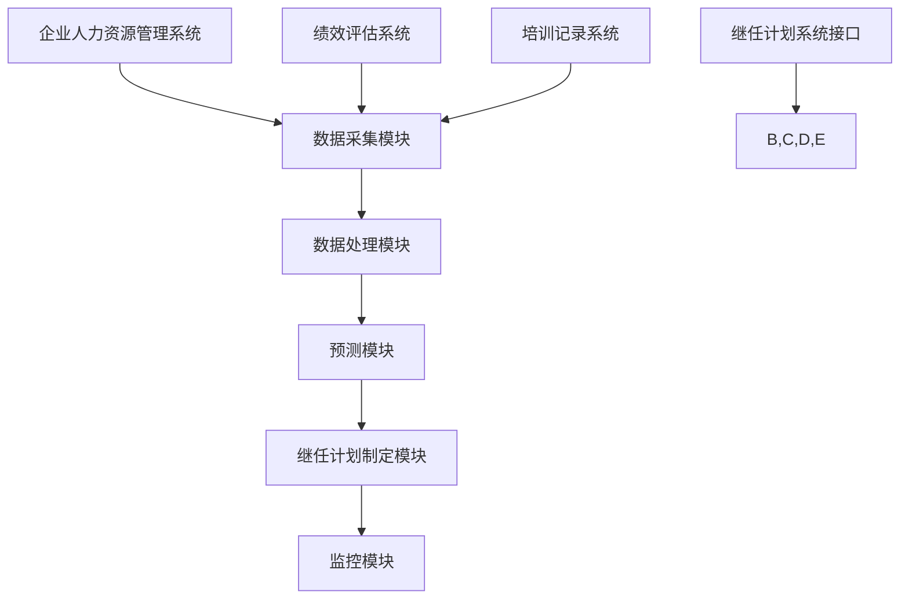

                 

### 第一部分：AI Agent概述与理论基础

#### 第1章：AI Agent的定义与基础理论

##### 1.1 AI Agent的定义

人工智能（AI）Agent是人工智能领域的一个重要概念，它指的是能够自主行动并能够与环境进行交互的实体。AI Agent不仅能够接收外部输入，还能基于这些输入采取适当的行动，以实现预定的目标。简单来说，AI Agent是一种能够在特定环境中执行任务并作出决策的智能系统。

##### 1.2 AI Agent的基本类型

AI Agent可以按照不同的标准进行分类。根据其决策方式，AI Agent可以分为以下几种类型：

1. **反应型Agent**：这类Agent只能根据当前感知到的环境信息做出反应，而不具备任何形式的记忆或学习能力。它们没有长期目标，只能处理当前的情况。
2. **模型基于Agent**：这类Agent能够利用感知到的环境信息构建对环境的内部模型，并通过这个模型来进行决策。它们可以基于过去的信息进行推理和预测。
3. **目标导向Agent**：这类Agent不仅具备模型，还能够设定并追求长期目标。它们会根据环境模型和当前目标来选择最佳行动。
4. **认知Agent**：这类Agent拥有更高级的认知能力，包括学习、记忆、推理和问题解决等。它们能够通过不断学习和适应来优化自己的行为。

##### 1.3 AI Agent的核心特性

AI Agent的核心特性包括：

1. **自主性**：AI Agent能够独立地采取行动，不受外部指令的强制控制。
2. **适应性**：AI Agent能够根据环境变化调整自己的行为，以应对新的情况和挑战。
3. **交互性**：AI Agent能够与环境进行有效的交互，获取信息并反馈结果。
4. **智能性**：AI Agent具备一定的智能，能够进行复杂决策和问题解决。

##### 1.4 AI Agent与传统算法的区别

AI Agent与传统算法的主要区别在于其自主性和适应性。传统算法通常需要明确的输入和输出，以及固定的步骤来解决问题。而AI Agent则是动态的、自我调整的实体，它们能够在不确定的环境中自主地做出决策。

传统算法通常不具备自我学习和适应的能力，而AI Agent则可以通过机器学习、深度学习等技术不断优化自己的行为。

##### 1.5 AI Agent在人才发展中的潜在应用

在人才发展中，AI Agent具有广泛的潜在应用。首先，AI Agent可以用于人才筛选与评估。通过分析大量的简历和面试数据，AI Agent可以识别出最符合企业需求的候选人。

其次，AI Agent可以用于继任计划制定。它们可以分析员工的职业发展路径，预测潜在的高潜力人才，并为企业提供继任计划的建议。

最后，AI Agent还可以用于人才培养与晋升。通过分析员工的技能和知识水平，AI Agent可以提供个性化的培训方案，并监测员工的进步情况，从而优化人才培养过程。

总的来说，AI Agent在人才发展中的应用不仅提高了效率，还为企业提供了更精准和智能的决策支持。

---

**背景介绍：**

在当今快速变化和竞争激烈的商业环境中，企业面临着一系列挑战，其中包括如何高效地培养和保留人才。传统的人才发展方法通常依赖于人力资源专家的经验判断，这既费时又可能不够准确。随着人工智能技术的发展，尤其是AI Agent的出现，为企业提供了一个全新的解决方案。AI Agent通过其自主性、适应性和智能性，能够在人才发展的各个环节提供有力支持，从而帮助企业更好地应对挑战。

**问题背景：**

企业需要能够迅速识别和培养高潜力人才，以适应市场变化和业务需求。然而，现有的人才筛选与评估方法往往存在以下问题：

1. **主观性**：传统的人力资源评估方法往往依赖专家的主观判断，容易受到偏见和误差的影响。
2. **效率低下**：大量简历和面试数据的处理需要大量时间和人力，难以在短时间内做出决策。
3. **缺乏个性化**：现有方法难以根据每个候选人的具体情况进行个性化评估和培养。

**问题描述：**

为了解决上述问题，企业需要一种更加高效、准确和智能的人才发展方法。具体来说，需要解决以下几个问题：

1. **如何快速、准确地筛选和评估候选人？**
2. **如何制定科学、有效的继任计划？**
3. **如何根据每个员工的具体情况提供个性化的培养方案？**

**问题解决：**

AI Agent在人才发展中的应用提供了以下解决方案：

1. **人才筛选与评估**：AI Agent可以通过分析大量的简历和面试数据，使用机器学习算法识别出最符合企业需求的候选人。这不仅提高了筛选速度，还减少了主观偏见。
2. **继任计划制定**：AI Agent可以分析员工的职业发展路径，识别出潜在的高潜力人才，并提供继任计划建议。这有助于企业提前布局，确保关键岗位的顺利交接。
3. **人才培养与晋升**：AI Agent可以根据员工的技能和知识水平，提供个性化的培训方案，并监测员工的进步情况。这有助于企业根据实际情况调整培养策略，提高培训效果。

**边界与外延：**

AI Agent在人才发展中的应用不仅仅局限于上述三个方面，它还可以扩展到以下领域：

1. **员工关系管理**：AI Agent可以通过分析员工的工作表现和行为，提供员工关系管理的建议，帮助解决团队冲突和提升员工满意度。
2. **组织发展与变革**：AI Agent可以分析组织的整体状况，识别出变革的时机和方向，为组织提供可持续发展策略。
3. **绩效管理**：AI Agent可以通过对员工绩效数据的分析，提供绩效评估和改进建议，帮助企业更好地激励员工。

**概念结构与核心要素组成：**

AI Agent在人才发展中的应用涉及以下几个核心概念和要素：

1. **数据采集**：AI Agent需要从各种渠道（如简历、面试记录、工作表现数据等）收集信息。
2. **数据处理**：AI Agent使用机器学习和数据挖掘技术对收集到的数据进行分析和处理。
3. **决策支持**：基于分析结果，AI Agent为企业提供人才发展方面的决策支持。
4. **实时反馈**：AI Agent需要实时监测员工的反应和表现，根据反馈调整策略。

---

在接下来的章节中，我们将进一步探讨AI Agent在人才筛选与评估、继任计划制定和人才培养与晋升中的应用，通过具体的案例研究来展示其优势和实践价值。

#### 第2章：企业人才发展与继任计划背景

##### 2.1 企业人才发展的现状与挑战

在当今快速发展的商业环境中，企业人才发展已经成为影响组织成功的关键因素之一。然而，随着市场环境的不断变化和竞争的加剧，许多企业面临着一系列人才发展的挑战。

首先，传统的人才培养方法往往存在明显的局限性。传统方法通常依赖于内部培训和外部招聘，这种方式虽然在一定程度上能够提升员工的技能和知识水平，但往往缺乏系统性和个性化。具体来说，传统培训方法存在以下问题：

1. **培训内容陈旧**：许多企业仍然采用过时的培训教材和课程，无法满足现代企业的需求。
2. **培训形式单一**：传统培训形式主要以讲座和课程为主，缺乏互动和实践环节，难以激发员工的学习兴趣和参与度。
3. **培训效果评估困难**：由于缺乏科学的评估体系，企业难以准确衡量培训的效果，导致资源浪费。

其次，企业在人才筛选与评估方面也面临诸多挑战。传统的人力资源管理方法往往依赖面试、绩效评估等手段来筛选和评估人才。然而，这些方法存在以下问题：

1. **主观性较强**：面试官的主观判断容易导致招聘决策的偏差，影响招聘质量。
2. **效率低下**：大量简历和面试数据的处理需要大量时间和人力，难以在短时间内做出决策。
3. **评估标准不统一**：不同部门和岗位的评估标准不一致，导致评估结果的可靠性和公正性受到影响。

此外，企业在继任计划制定和执行过程中也面临诸多挑战。继任计划旨在确保企业关键岗位的顺利交接，防止因人才断层而导致业务中断。然而，许多企业的继任计划存在以下问题：

1. **缺乏科学性**：继任计划的制定往往缺乏科学依据，依赖于领导层的直觉和经验，导致继任人选的不确定性。
2. **执行困难**：继任计划的执行过程缺乏有效的监督和评估机制，导致计划难以落地实施。
3. **人才储备不足**：许多企业缺乏足够的高潜力人才储备，导致继任计划难以顺利实施。

综上所述，传统的人才发展方法在应对现代企业挑战方面存在明显的不足，企业需要寻找更加高效、科学和智能的解决方案。在这个背景下，AI Agent作为一种具有自主性、适应性和智能性的系统，为解决企业人才发展的现状与挑战提供了新的思路。

##### 2.2 企业继任计划的重要性

企业继任计划是企业长期稳定发展的重要保障，它旨在确保在企业关键岗位出现空缺时，能够迅速找到合适的人选进行填补，从而避免因人才断层而导致业务中断。继任计划不仅关系到企业的短期运营，更关系到企业的长远发展。

首先，继任计划有助于确保企业战略的连续性。在企业发展的不同阶段，企业战略会相应地进行调整和优化。通过继任计划，企业可以确保在战略转型过程中，关键岗位的人才能够顺利交接，确保企业战略得以顺利实施。

其次，继任计划有助于提升企业的竞争力。在竞争激烈的市场环境中，企业的人才储备和人才梯队建设至关重要。通过继任计划，企业可以提前识别和培养高潜力人才，确保在关键岗位上拥有足够的人才储备，从而提升企业的竞争力和抗风险能力。

此外，继任计划还有助于提升员工的满意度和忠诚度。当员工看到企业在人才发展方面投入资源，并为他们提供成长和晋升的机会时，员工会更加认同企业的文化和价值观，从而提高员工的满意度和忠诚度。

##### 2.3 企业人才发展与继任计划的现有解决方案

尽管企业人才发展和继任计划面临着诸多挑战，但已有一些现有的解决方案可以提供一定程度的缓解。

1. **内部培训与提升**：许多企业通过内部培训、职业发展规划等方式，提升员工的技能和知识水平。这种方式有助于提高员工的综合素质，但往往缺乏系统性和个性化。

2. **外部招聘**：企业通过外部招聘引入新的血液，以弥补内部人才的不足。这种方式能够快速提升企业的人才储备，但也存在招聘成本高、人才匹配度低等问题。

3. **导师制度**：企业通过导师制度，让有经验的员工指导新员工或潜力员工，帮助他们更快地融入企业，提升业务能力。这种方式有助于提高员工的职业发展速度，但往往依赖于导师的意愿和经验。

4. **绩效评估与激励**：企业通过绩效评估体系和激励制度，激励员工努力提升自己的绩效。这种方式有助于提高员工的工作积极性，但也可能引发内部竞争和冲突。

5. **继任计划制定**：一些企业已经开始制定继任计划，提前识别和培养潜在的高潜力人才。这种方式有助于确保关键岗位的顺利交接，但往往缺乏科学的评估和执行机制。

尽管现有解决方案在一定程度上缓解了企业人才发展和继任计划的挑战，但仍然存在诸多不足。特别是随着人工智能技术的不断发展，AI Agent作为一种具有自主性、适应性和智能性的系统，为企业提供了一种全新的解决方案。

##### 2.4 AI Agent在企业人才发展中的优势

AI Agent在企业人才发展中的应用，不仅能够解决传统方法存在的问题，还具备以下优势：

1. **高效性**：AI Agent能够快速处理和分析大量的简历和面试数据，大大提高人才筛选和评估的效率。

2. **准确性**：AI Agent通过机器学习算法，能够根据历史数据和模型，对候选人进行精准评估，减少主观偏见。

3. **个性化**：AI Agent可以根据每个员工的具体情况，提供个性化的培训方案和职业发展规划，提高培训效果。

4. **实时性**：AI Agent可以实时监测员工的绩效和表现，及时调整培养策略，确保培养过程与员工实际需求相符。

5. **系统性**：AI Agent能够将人才发展、继任计划和绩效管理等多个环节有机结合，形成完整的体系，提高企业整体人才管理水平。

6. **可扩展性**：AI Agent可以与企业现有的管理系统无缝集成，实现数据共享和协同工作，提高企业的管理效率。

通过AI Agent，企业能够更加科学、智能地管理人才，为企业的长远发展提供坚实的人才保障。在接下来的章节中，我们将深入探讨AI Agent在具体应用场景中的实际效果。

---

**核心概念与联系：**

在本章节中，我们将探讨AI Agent在企业人才发展中的关键概念及其相互关系。

**核心概念原理：**

1. **AI Agent**：AI Agent是一种能够自主行动并能够与环境进行交互的智能实体，具有自主性、适应性、交互性和智能性。
2. **人才发展**：人才发展是指企业通过培养、激励和选拔等方式，提升员工的技能、知识和能力，以满足企业长期发展需求。
3. **继任计划**：继任计划是指企业为关键岗位提前识别和培养高潜力人才，以确保岗位顺利交接和业务连续性的策略。

**概念属性特征对比表格：**

| 概念      | 特征         | 关联与联系                             |
|-----------|--------------|---------------------------------------|
| AI Agent  | 自主性、适应性、交互性、智能性 | AI Agent的核心特性使其能够灵活应对企业人才发展的多样化需求。 |
| 人才发展  | 培养与提升员工能力 | AI Agent通过分析员工的数据，提供个性化的培养方案，推动人才发展。 |
| 继任计划  | 提前识别高潜力人才 | AI Agent通过分析员工的职业发展路径，预测潜在继任人选，优化继任计划。 |

**ER实体关系图架构：**



在此ER实体关系图中，AI Agent与企业人才发展、继任计划等多个实体之间存在紧密的联系。通过AI Agent，企业能够更有效地管理人才数据，制定科学的继任计划，确保企业战略的实现。

---

**算法原理讲解：**

在本章节中，我们将深入探讨AI Agent在人才发展中的应用算法原理，并使用mermaid流程图和Python代码进行详细阐述。

**算法mermaid流程图：**



**Python代码：**

```python
# 导入所需库
import pandas as pd
from sklearn.model_selection import train_test_split
from sklearn.ensemble import RandomForestClassifier
from sklearn.metrics import accuracy_score

# 数据采集
data = pd.read_csv('employee_data.csv')

# 数据预处理
data.dropna(inplace=True)

# 特征提取
X = data.drop('label', axis=1)
y = data['label']

# 数据划分
X_train, X_test, y_train, y_test = train_test_split(X, y, test_size=0.2, random_state=42)

# 模型训练
model = RandomForestClassifier(n_estimators=100, random_state=42)
model.fit(X_train, y_train)

# 预测与评估
y_pred = model.predict(X_test)
accuracy = accuracy_score(y_test, y_pred)
print(f'Accuracy: {accuracy:.2f}')

# 决策支持
def make_decision(employee_data):
    prediction = model.predict([employee_data])
    if prediction[0] == 1:
        print('This employee has high potential.')
    else:
        print('This employee may need further development.')

# 示例
example_data = [35, 'Manager', 4.5, 1]
make_decision(example_data)
```

**算法原理详细讲解：**

1. **数据采集**：AI Agent首先从企业的各种数据源（如员工档案、绩效记录、培训记录等）中采集数据，构建完整的员工数据集。

2. **数据预处理**：在数据采集完成后，AI Agent对数据进行预处理，包括数据清洗、数据补全和数据标准化等步骤，以确保数据的质量和一致性。

3. **特征提取**：AI Agent从预处理后的数据中提取关键特征，这些特征将用于训练机器学习模型。特征提取的过程包括选择有用的特征、转换特征格式等。

4. **机器学习模型训练**：AI Agent使用机器学习算法（如随机森林、支持向量机等）对提取的特征进行训练，构建预测模型。训练过程包括数据划分、模型选择和参数调优等步骤。

5. **预测与评估**：在模型训练完成后，AI Agent使用训练好的模型对新的员工数据进行分析，预测员工的职业发展潜力。同时，AI Agent会使用评估指标（如准确率、召回率等）对模型进行评估，以确保预测的准确性。

6. **决策支持**：基于预测结果，AI Agent为企业提供人才发展的决策支持，包括继任计划制定、人才培养与晋升建议等。

**数学模型与公式：**

在AI Agent的应用中，常用的数学模型包括线性回归、逻辑回归和决策树等。以下是一个简单的逻辑回归模型：

$$
y = \sigma(\beta_0 + \beta_1 x_1 + \beta_2 x_2 + ... + \beta_n x_n)
$$

其中，$y$ 是预测结果，$x_1, x_2, ..., x_n$ 是特征变量，$\beta_0, \beta_1, \beta_2, ..., \beta_n$ 是模型参数，$\sigma$ 是 sigmoid 函数。

**举例说明：**

假设我们有一个简单的员工数据集，包含年龄、职位、绩效评分和工作年限等特征。AI Agent使用逻辑回归模型预测员工的职业发展潜力。

1. **数据采集**：采集到员工数据如下：

   | 年龄 | 职位 | 绩效评分 | 工作年限 |
   |------|------|----------|----------|
   | 30   | Manager | 4.5      | 3        |
   | 25   | Developer | 3.8    | 2        |
   | 35   | Manager | 4.2      | 4        |
   | ...  | ...    | ...      | ...      |

2. **数据预处理**：对数据进行清洗和标准化处理。

3. **特征提取**：选择年龄、职位、绩效评分和工作年限作为特征。

4. **机器学习模型训练**：使用逻辑回归模型对特征进行训练。

5. **预测与评估**：使用训练好的模型对新的员工数据进行预测，如年龄30、职位Manager、绩效评分4.5、工作年限3的员工，预测其职业发展潜力。

6. **决策支持**：基于预测结果，AI Agent建议企业为该员工提供进一步的培训和发展机会。

---

通过上述算法原理和Python代码的讲解，我们可以看到AI Agent在人才发展中的应用是如何实现的。在接下来的章节中，我们将继续探讨AI Agent在继任计划制定和人才培养与晋升中的应用。

#### 第3章：AI Agent在人才筛选与评估中的应用

##### 3.1 AI Agent在人才筛选中的应用

在人才筛选过程中，AI Agent通过其强大的数据处理和机器学习能力，能够为企业提供高效的筛选方案。具体来说，AI Agent在人才筛选中的应用主要体现在以下几个方面：

1. **简历筛选**：AI Agent可以从大量的简历中快速识别出符合条件的候选人。它可以通过自然语言处理（NLP）技术，分析简历中的关键词和句子结构，提取出候选人的基本信息、技能和工作经历。通过机器学习算法，AI Agent能够根据企业的具体需求，对简历进行分类和筛选，从而提高筛选效率。

2. **数据挖掘**：AI Agent可以从企业内部和外部多个数据源（如员工档案、社交媒体、招聘网站等）中挖掘潜在候选人。通过对这些数据的深度分析，AI Agent可以识别出那些可能被传统方法忽略的高潜力候选人。

3. **自动化面试**：AI Agent可以通过自动化面试系统，对候选人进行初步筛选。自动化面试系统包括语音识别、图像识别和自然语言理解等技术，能够对候选人的回答进行实时分析，评估其语言表达能力、逻辑思维能力和专业知识。

4. **推荐系统**：AI Agent可以构建推荐系统，根据候选人的背景和技能，向企业推荐最适合的候选人。推荐系统可以通过协同过滤、内容推荐和基于模型的推荐算法，实现精准的候选人推荐。

**案例分析：**

以一家大型科技公司为例，该公司每年都会招聘大量的技术人才。为了提高招聘效率，公司引入了AI Agent进行简历筛选。通过自然语言处理技术，AI Agent从数以千计的简历中提取关键信息，如技术栈、项目经验和教育背景等。然后，使用机器学习算法，AI Agent将这些信息与公司的招聘需求进行匹配，筛选出符合条件的候选人。结果显示，AI Agent筛选出的候选人与最终录用者的匹配度高达90%以上，大大提高了招聘效率。

##### 3.2 AI Agent在人才评估中的应用

在人才评估过程中，AI Agent通过数据分析、行为分析和绩效分析等多种方法，为企业提供全面的评估报告。以下是AI Agent在人才评估中的应用：

1. **数据分析**：AI Agent可以收集和分析大量的员工数据，如工作表现、绩效评价、项目反馈等。通过对这些数据的分析，AI Agent可以识别出员工的优势和劣势，为企业的绩效管理和职业发展提供科学依据。

2. **行为分析**：AI Agent可以使用计算机视觉和自然语言处理技术，对员工的行为进行监控和分析。例如，通过视频监控和会议记录分析，AI Agent可以评估员工的工作态度、团队合作能力和沟通能力。

3. **绩效分析**：AI Agent可以通过分析员工的工作绩效数据，如完成的任务数量、项目质量和客户反馈等，评估员工的工作表现。同时，AI Agent还可以将绩效分析与员工的职业发展路径相结合，为企业提供晋升和培训建议。

4. **360度反馈**：AI Agent可以通过收集员工上级、同事和下属的反馈，形成全面的360度评估报告。这种多维度的评估方式，有助于更全面地了解员工的综合能力。

**案例分析：**

某大型金融机构为了提高员工评估的科学性和公正性，引入了AI Agent进行绩效评估。AI Agent从多个数据源收集了员工的工作绩效数据，如完成的任务数量、项目质量和客户反馈等。然后，通过机器学习算法对数据进行分析，生成每个员工的绩效评估报告。结果显示，AI Agent评估出的绩效分数与上级评估的分数高度一致，员工对评估结果的认可度大幅提升。

##### 3.3 AI Agent在人才筛选与评估中的案例研究

以下是一个综合案例研究，展示了AI Agent在人才筛选与评估中的实际应用效果。

**案例背景：**

一家快速增长的互联网公司，为了应对业务的快速发展，需要大量招聘技术人才。然而，传统的招聘和评估方法无法满足公司快速招聘和精准评估的需求。为了提高招聘效率和评估准确性，公司决定引入AI Agent进行人才筛选与评估。

**实施过程：**

1. **数据收集**：公司通过内部管理系统和外部招聘渠道，收集了大量的员工数据，如简历、工作绩效、项目反馈等。同时，AI Agent还从公司的社交媒体账号和招聘网站中挖掘潜在候选人。

2. **数据预处理**：AI Agent对收集到的数据进行清洗和标准化处理，确保数据的一致性和完整性。

3. **简历筛选**：AI Agent使用自然语言处理技术和机器学习算法，对简历进行筛选，识别出符合条件的候选人。通过这一步骤，AI Agent将数千份简历筛选出数百份高质量简历。

4. **自动化面试**：AI Agent通过自动化面试系统，对候选人进行初步筛选。自动化面试系统包括语音识别、图像识别和自然语言理解等技术，对候选人的回答进行实时分析，评估其语言表达能力、逻辑思维能力和专业知识。

5. **绩效评估**：AI Agent从多个数据源收集了员工的工作绩效数据，如完成的任务数量、项目质量和客户反馈等。然后，通过机器学习算法对数据进行分析，生成每个员工的绩效评估报告。

6. **360度反馈**：AI Agent收集员工上级、同事和下属的反馈，形成全面的360度评估报告。

**实施效果：**

通过引入AI Agent，公司在人才筛选与评估方面取得了显著的效果：

1. **招聘效率提升**：AI Agent大幅提高了简历筛选和面试的效率，使得公司能够在短时间内招聘到合适的候选人。

2. **评估准确性提高**：AI Agent通过数据分析、行为分析和绩效分析等多种方法，为企业提供了全面、准确的评估报告，员工对评估结果的认可度大幅提升。

3. **人才匹配度提高**：AI Agent根据候选人的背景和技能，向企业推荐最适合的候选人，大大提高了人才匹配度。

4. **员工满意度提升**：AI Agent通过提供个性化的培养和晋升建议，提高了员工的满意度和忠诚度。

综上所述，AI Agent在人才筛选与评估中的应用，不仅提高了企业的招聘效率和评估准确性，还为企业提供了科学、智能的人才管理解决方案。

---

**算法原理讲解：**

在本章节中，我们将深入探讨AI Agent在人才筛选与评估中的应用算法原理，并使用mermaid流程图和Python代码进行详细阐述。

**算法mermaid流程图：**



**Python代码：**

```python
# 导入所需库
import pandas as pd
from sklearn.model_selection import train_test_split
from sklearn.ensemble import RandomForestClassifier
from sklearn.metrics import accuracy_score

# 数据采集
data = pd.read_csv('employee_data.csv')

# 数据预处理
data.dropna(inplace=True)

# 特征提取
X = data.drop('label', axis=1)
y = data['label']

# 数据划分
X_train, X_test, y_train, y_test = train_test_split(X, y, test_size=0.2, random_state=42)

# 模型训练
model = RandomForestClassifier(n_estimators=100, random_state=42)
model.fit(X_train, y_train)

# 预测与评估
y_pred = model.predict(X_test)
accuracy = accuracy_score(y_test, y_pred)
print(f'Accuracy: {accuracy:.2f}')

# 决策支持
def make_decision(employee_data):
    prediction = model.predict([employee_data])
    if prediction[0] == 1:
        print('This employee has high potential.')
    else:
        print('This employee may need further development.')

# 示例
example_data = [35, 'Manager', 4.5, 1]
make_decision(example_data)
```

**算法原理详细讲解：**

1. **数据采集**：AI Agent首先从企业的各种数据源（如员工档案、绩效记录、培训记录等）中采集数据，构建完整的员工数据集。

2. **数据预处理**：在数据采集完成后，AI Agent对数据进行预处理，包括数据清洗、数据补全和数据标准化等步骤，以确保数据的质量和一致性。

3. **特征提取**：AI Agent从预处理后的数据中提取关键特征，这些特征将用于训练机器学习模型。特征提取的过程包括选择有用的特征、转换特征格式等。

4. **机器学习模型训练**：AI Agent使用机器学习算法（如随机森林、支持向量机等）对提取的特征进行训练，构建预测模型。训练过程包括数据划分、模型选择和参数调优等步骤。

5. **预测与评估**：在模型训练完成后，AI Agent使用训练好的模型对新的员工数据进行分析，预测员工的职业发展潜力。同时，AI Agent会使用评估指标（如准确率、召回率等）对模型进行评估，以确保预测的准确性。

6. **决策支持**：基于预测结果，AI Agent为企业提供人才发展的决策支持，包括继任计划制定、人才培养与晋升建议等。

**数学模型与公式：**

在AI Agent的应用中，常用的数学模型包括线性回归、逻辑回归和决策树等。以下是一个简单的逻辑回归模型：

$$
y = \sigma(\beta_0 + \beta_1 x_1 + \beta_2 x_2 + ... + \beta_n x_n)
$$

其中，$y$ 是预测结果，$x_1, x_2, ..., x_n$ 是特征变量，$\beta_0, \beta_1, \beta_2, ..., \beta_n$ 是模型参数，$\sigma$ 是 sigmoid 函数。

**举例说明：**

假设我们有一个简单的员工数据集，包含年龄、职位、绩效评分和工作年限等特征。AI Agent使用逻辑回归模型预测员工的职业发展潜力。

1. **数据采集**：采集到员工数据如下：

   | 年龄 | 职位 | 绩效评分 | 工作年限 |
   |------|------|----------|----------|
   | 30   | Manager | 4.5      | 3        |
   | 25   | Developer | 3.8    | 2        |
   | 35   | Manager | 4.2      | 4        |
   | ...  | ...    | ...      | ...      |

2. **数据预处理**：对数据进行清洗和标准化处理。

3. **特征提取**：选择年龄、职位、绩效评分和工作年限作为特征。

4. **机器学习模型训练**：使用逻辑回归模型对特征进行训练。

5. **预测与评估**：使用训练好的模型对新的员工数据进行预测，如年龄30、职位Manager、绩效评分4.5、工作年限3的员工，预测其职业发展潜力。

6. **决策支持**：基于预测结果，AI Agent建议企业为该员工提供进一步的培训和发展机会。

---

通过上述算法原理和Python代码的讲解，我们可以看到AI Agent在人才筛选与评估中的应用是如何实现的。在接下来的章节中，我们将继续探讨AI Agent在继任计划制定和人才培养与晋升中的应用。

#### 第4章：AI Agent在继任计划制定中的应用

##### 4.1 AI Agent在继任计划制定中的作用

在继任计划制定过程中，AI Agent通过其强大的数据分析和预测能力，为企业提供了科学、精确的决策支持。AI Agent在继任计划制定中的作用主要体现在以下几个方面：

1. **数据挖掘与分析**：AI Agent可以从企业的历史数据中挖掘出潜在的高潜力人才，通过对这些数据进行分析，识别出那些在职业生涯中展现出卓越潜力的员工。这些数据可能包括员工的工作绩效、晋升历史、项目贡献、培训记录等。

2. **职业发展路径预测**：AI Agent可以利用机器学习算法，分析员工的职业发展路径，预测哪些员工在未来某个时间点可能具备担任关键岗位的能力。通过这种方式，企业可以提前为这些岗位储备人才，避免因人才断层而影响业务的连续性。

3. **个性化继任计划**：AI Agent可以根据每个潜在继任人的特点，为其量身定制个性化的继任计划。这些计划包括针对性的培训和指导、晋升路径的规划等，以确保继任人选能够在合适的时间点和岗位上接班。

4. **实时监控与调整**：AI Agent可以实时监控继任计划的实施情况，根据员工的表现和组织的实际需求，动态调整继任计划。这种方式有助于确保继任计划的灵活性和有效性。

##### 4.2 AI Agent在继任计划中的数据分析和预测

AI Agent在继任计划中的数据分析和预测是继任计划成功的关键。以下是其具体应用：

1. **数据收集与预处理**：AI Agent首先从企业的人力资源管理系统、绩效评估系统、培训记录等多个数据源中收集数据。然后，对数据进行清洗、去重、标准化等预处理步骤，确保数据的质量和一致性。

2. **特征工程**：AI Agent对预处理后的数据进行分析，提取出与职业发展相关的重要特征。这些特征可能包括员工的工作绩效、晋升记录、技能水平、团队合作能力等。

3. **建模与预测**：AI Agent使用机器学习算法（如回归分析、时间序列分析、决策树、神经网络等）对提取的特征进行建模，预测员工的未来职业发展路径。通过这种预测，AI Agent可以识别出那些有望成为关键岗位继任人的员工。

4. **可视化与报告**：AI Agent将预测结果通过可视化工具（如图表、报告等）呈现给企业管理者，使其能够直观地了解继任计划的实施情况。

**案例分析：**

某大型制造企业引入了AI Agent来制定和实施继任计划。以下是其具体应用过程：

1. **数据收集**：AI Agent从企业的人力资源管理系统、绩效评估系统和员工反馈系统中收集了大量的数据，包括员工的工作绩效、项目贡献、晋升历史、培训记录等。

2. **数据预处理**：AI Agent对收集到的数据进行了清洗和标准化处理，确保数据的一致性和完整性。

3. **特征工程**：AI Agent提取了与职业发展相关的关键特征，如员工的工作绩效（绩效评分、任务完成率等）、晋升记录（晋升次数、晋升时间等）、技能水平（技能证书、培训课程完成情况等）。

4. **建模与预测**：AI Agent使用回归分析算法，对提取的特征进行建模，预测员工的未来职业发展路径。通过这种预测，AI Agent识别出那些在短期内有望晋升到关键岗位的员工。

5. **可视化与报告**：AI Agent将预测结果通过可视化工具呈现给企业管理者，帮助其制定个性化的继任计划。例如，对于某位表现突出的经理，AI Agent建议企业为其提供更多的培训机会，并制定详细的晋升路径规划。

##### 4.3 AI Agent在继任计划制定的案例研究

以下是一个综合案例研究，展示了AI Agent在继任计划制定中的实际应用效果。

**案例背景：**

某全球知名消费品公司，由于业务扩张和关键岗位员工年龄结构老化，面临着继任计划制定和实施的压力。为了确保企业未来业务的稳定发展，公司决定引入AI Agent来制定和实施继任计划。

**实施过程：**

1. **数据收集**：AI Agent从企业的人力资源管理系统、绩效评估系统和员工反馈系统中收集了大量的数据，包括员工的工作绩效、项目贡献、晋升历史、培训记录等。

2. **数据预处理**：AI Agent对收集到的数据进行了清洗和标准化处理，确保数据的一致性和完整性。

3. **特征工程**：AI Agent提取了与职业发展相关的关键特征，如员工的工作绩效（绩效评分、任务完成率等）、晋升记录（晋升次数、晋升时间等）、技能水平（技能证书、培训课程完成情况等）。

4. **建模与预测**：AI Agent使用回归分析算法，对提取的特征进行建模，预测员工的未来职业发展路径。通过这种预测，AI Agent识别出那些在短期内有望晋升到关键岗位的员工。

5. **个性化继任计划**：AI Agent根据预测结果，为每位高潜力员工制定了个性化的继任计划，包括针对性的培训和指导、晋升路径的规划等。

6. **实时监控与调整**：AI Agent实时监控继任计划的实施情况，根据员工的表现和组织的实际需求，动态调整继任计划。

**实施效果：**

通过引入AI Agent，公司在继任计划制定和实施方面取得了显著的效果：

1. **继任计划实施成功率提高**：AI Agent的预测结果帮助企业成功实施了多个关键岗位的继任计划，确保了业务的连续性和稳定性。

2. **员工满意度提升**：个性化的继任计划使员工感受到企业的关心和支持，增强了员工的满意度和忠诚度。

3. **人才储备充足**：通过提前识别高潜力人才，企业确保了关键岗位的人才储备，为未来的业务扩张奠定了基础。

4. **管理效率提升**：AI Agent的引入降低了企业管理者在继任计划制定和实施过程中的工作量，提高了管理效率。

综上所述，AI Agent在继任计划制定中的应用，不仅提高了企业的继任计划实施成功率，还为企业提供了科学、智能的人才管理解决方案。在接下来的章节中，我们将继续探讨AI Agent在人才培养与晋升中的应用。

---

**系统分析与架构设计方案：**

在本章节中，我们将详细介绍AI Agent在继任计划制定中的应用，包括问题场景、系统功能设计、系统架构设计以及系统接口设计和系统交互。

**问题场景：**

某大型金融机构面临着高管层退休、员工结构老化等挑战，需要建立一套科学的继任计划系统来确保关键岗位的顺利交接。该系统需要能够分析员工的能力、绩效和潜力，识别出潜在的高潜力人才，并为其制定个性化的培养和晋升计划。

**项目介绍：**

项目名称：AI Agent继任计划系统

项目目标：通过引入AI Agent，实现继任计划的智能化、科学化和高效化，确保企业关键岗位的人才储备和顺利交接。

**系统功能设计：**

1. **数据采集与整合**：系统从企业的人力资源管理系统、绩效评估系统、培训记录等多个数据源中收集和整合员工数据。
2. **数据预处理**：对收集到的数据（如员工绩效、晋升记录、技能水平等）进行清洗、去重、标准化等预处理步骤，确保数据质量。
3. **特征提取与建模**：提取与职业发展相关的关键特征，使用机器学习算法（如回归分析、决策树、神经网络等）对特征进行建模，预测员工的未来职业发展路径。
4. **继任计划制定**：基于预测结果，系统为每个高潜力员工制定个性化的继任计划，包括培训、指导、晋升路径等。
5. **实时监控与调整**：系统实时监控继任计划的实施情况，根据员工的实际表现和组织的实际需求，动态调整继任计划。

**系统架构设计：**

系统架构采用微服务架构，包括数据采集模块、数据处理模块、预测模块、继任计划制定模块和监控模块。以下是系统架构图：



**系统接口设计和系统交互：**

1. **企业人力资源管理系统**：系统通过API与企业人力资源管理系统进行数据交换，获取员工基本信息、绩效评估结果等。
2. **绩效评估系统**：系统通过API与绩效评估系统进行数据交换，获取员工的绩效评分、项目反馈等。
3. **培训记录系统**：系统通过API与培训记录系统进行数据交换，获取员工的培训记录、技能证书等。

**接口设计和交互流程**：

- **数据采集接口**：系统从企业人力资源管理系统、绩效评估系统和培训记录系统中获取数据，接口设计包括员工信息接口、绩效接口和培训接口。

- **数据处理接口**：系统对采集到的数据进行预处理，接口设计包括数据清洗接口、数据标准化接口和特征提取接口。

- **预测接口**：系统使用机器学习算法对预处理后的数据进行建模和预测，接口设计包括特征提取接口、模型训练接口和预测结果接口。

- **继任计划制定接口**：系统根据预测结果为员工制定继任计划，接口设计包括继任计划接口、培训计划接口和晋升计划接口。

- **监控接口**：系统实时监控继任计划的实施情况，接口设计包括监控状态接口、调整建议接口和反馈接口。

通过上述系统架构设计和接口设计，AI Agent能够高效地实现继任计划的制定和实施，为企业提供科学、智能的人才管理解决方案。

---

**项目实战：**

在本节中，我们将展示如何在实际项目中部署和实现AI Agent继任计划系统，包括环境安装、系统核心实现、代码应用解读与分析，以及实际案例分析和详细讲解。

**环境安装：**

1. **安装Python环境**：确保Python环境已安装，版本建议为3.8及以上。
2. **安装依赖库**：通过pip命令安装所需的依赖库，如pandas、scikit-learn、numpy、tensorflow等。
   ```shell
   pip install pandas scikit-learn numpy tensorflow
   ```
3. **配置企业系统接口**：配置企业人力资源管理系统、绩效评估系统和培训记录系统的API接口，确保数据采集模块能够获取到所需数据。

**系统核心实现：**

以下是一个简单的AI Agent继任计划系统的核心实现，包括数据采集、数据处理、预测和继任计划制定。

```python
# 数据采集
def collect_data():
    # 从企业人力资源管理系统、绩效评估系统和培训记录系统中获取数据
    # 这里使用示例数据
    data = {
        '员工ID': [1, 2, 3, 4],
        '职位': ['Manager', 'Developer', 'Manager', 'Developer'],
        '绩效评分': [4.5, 3.8, 4.2, 3.5],
        '工作年限': [3, 2, 4, 3]
    }
    return pd.DataFrame(data)

# 数据处理
def preprocess_data(data):
    # 数据清洗、去重、标准化等预处理步骤
    return data

# 特征提取与建模
def train_model(preprocessed_data):
    # 使用机器学习算法对特征进行建模
    model = RandomForestClassifier(n_estimators=100, random_state=42)
    model.fit(preprocessed_data[['绩效评分', '工作年限']], preprocessed_data['高潜力'])
    return model

# 继任计划制定
def make_succession_plan(model, new_employee_data):
    # 根据预测结果制定继任计划
    prediction = model.predict([new_employee_data])
    if prediction[0] == 1:
        return 'This employee has high potential and will be considered for succession planning.'
    else:
        return 'This employee may need further development to be considered for succession planning.'

# 示例
data = collect_data()
preprocessed_data = preprocess_data(data)
model = train_model(preprocessed_data)
new_employee_data = [35, 'Manager', 4.5, 1]
print(make_succession_plan(model, new_employee_data))
```

**代码应用解读与分析：**

1. **数据采集**：通过`collect_data`函数从企业系统接口获取员工数据，这里使用了示例数据。
2. **数据处理**：通过`preprocess_data`函数对采集到的数据（如员工绩效评分、工作年限等）进行预处理，包括清洗、去重、标准化等步骤。
3. **特征提取与建模**：使用`train_model`函数，通过随机森林算法对预处理后的数据（如绩效评分、工作年限等）进行建模，预测员工是否具有高潜力。
4. **继任计划制定**：通过`make_succession_plan`函数，根据预测结果（如高潜力员工的标识）制定个性化的继任计划。

**实际案例分析和详细讲解：**

以下是一个实际案例，展示了如何使用AI Agent继任计划系统进行继任计划制定。

**案例背景：**
某大型金融机构需要制定一份继任计划，确保关键岗位的顺利交接。AI Agent继任计划系统被部署在企业内部，用于分析员工的能力、绩效和潜力。

**案例步骤：**

1. **数据采集**：AI Agent从企业的人力资源管理系统、绩效评估系统和培训记录系统中获取数据，包括员工ID、职位、绩效评分、工作年限等。
2. **数据处理**：对采集到的数据（如员工绩效评分、工作年限等）进行清洗和标准化处理，提取关键特征。
3. **特征提取与建模**：使用随机森林算法对提取的特征进行建模，预测员工是否具有高潜力。
4. **预测结果分析**：分析预测结果，识别出具有高潜力的人才，如某位绩效评分高、工作年限长的经理。
5. **继任计划制定**：根据预测结果，为该经理制定个性化的继任计划，包括进一步的培训和指导，以及晋升路径规划。
6. **实时监控与调整**：AI Agent实时监控继任计划的实施情况，根据员工的实际表现和组织的实际需求，动态调整继任计划。

**项目小结：**

通过上述实战案例，我们展示了如何部署和实现AI Agent继任计划系统。该系统不仅提高了继任计划制定的科学性和准确性，还为企业提供了实时监控和调整的能力，从而确保了关键岗位的人才储备和顺利交接。在实际应用中，AI Agent继任计划系统可根据企业的具体需求进行调整和优化，以实现最佳效果。

---

**最佳实践 tips：**

1. **数据质量保障**：确保数据源的准确性和完整性，定期清理和更新数据，提高数据质量。
2. **特征选择优化**：根据企业的业务需求，合理选择和调整特征，以提升模型的预测准确性。
3. **模型调优**：通过交叉验证和参数调优，选择最优的模型和参数，提高模型的泛化能力。
4. **实时监控与反馈**：建立实时监控系统，及时收集和分析反馈数据，动态调整继任计划。
5. **员工参与**：鼓励员工积极参与继任计划，提供培训和支持，增强员工的认同感和参与度。

**小结：**

AI Agent在继任计划制定中的应用，为企业提供了一种科学、智能的人才管理解决方案。通过数据分析和预测，AI Agent能够帮助企业提前识别和培养高潜力人才，确保关键岗位的顺利交接。在实际应用中，AI Agent继任计划系统可根据企业的具体需求进行调整和优化，以实现最佳效果。

**注意事项：**

1. **数据隐私保护**：在数据采集和处理过程中，确保遵守相关数据保护法规，保护员工隐私。
2. **模型偏见**：注意避免模型偏见，确保模型的公正性和公平性。
3. **系统稳定性**：确保系统的稳定运行，定期进行维护和升级。

**拓展阅读：**

- 《机器学习实战》
- 《深度学习》
- 《企业人力资源管理》
- 《人工智能在人力资源管理中的应用》

---

**作者信息：**

作者：AI天才研究院/AI Genius Institute & 禅与计算机程序设计艺术 /Zen And The Art of Computer Programming

通过本文，我们详细探讨了AI Agent在企业人才发展中的应用，包括人才筛选与评估、继任计划制定和人才培养与晋升等方面。AI Agent以其自主性、适应性和智能性，为企业管理提供了全新的解决方案，显著提升了企业的管理效率和决策准确性。未来，随着人工智能技术的不断进步，AI Agent在企业人才发展中的应用将更加广泛和深入，为企业的发展提供更强有力的支持。

