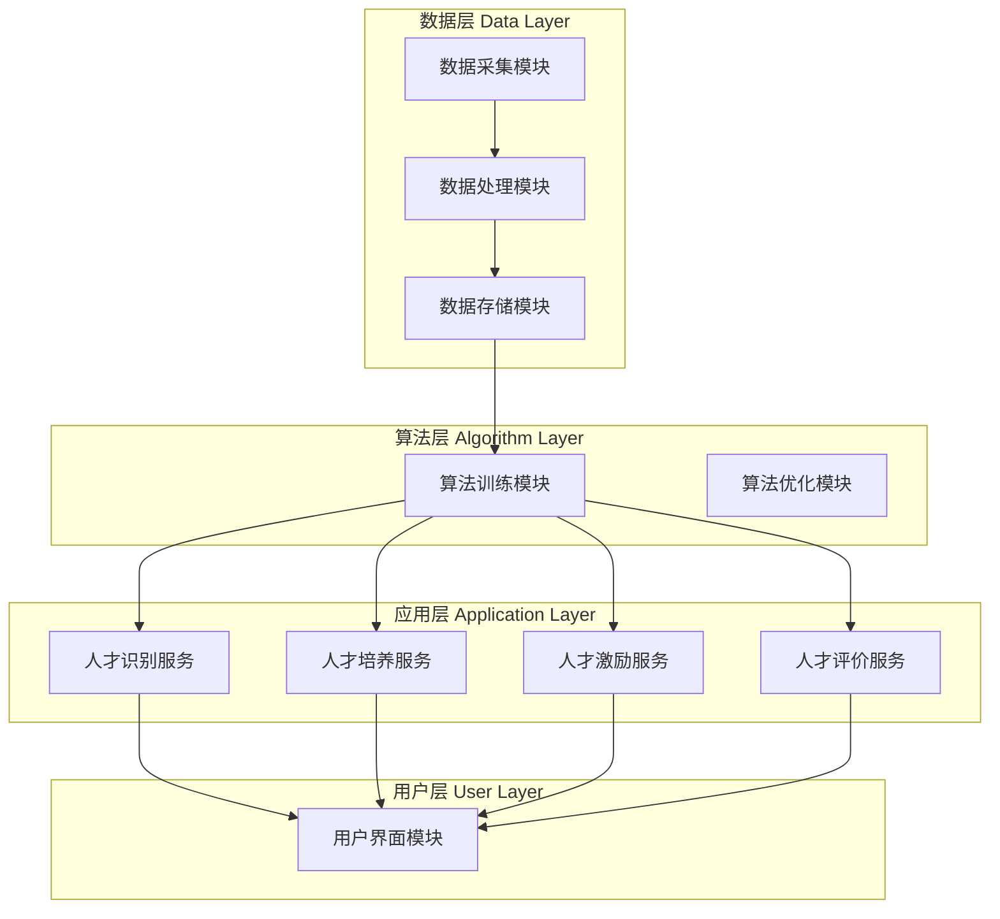

                 

## 第1章：问题背景与核心概念

### 1.1 人工智能与企业人才发展的关系

人工智能（Artificial Intelligence，简称AI）作为当前技术领域的热点，正逐步渗透到企业的各个层面。随着AI技术的迅猛发展，企业开始认识到其潜在的价值，尤其是在人才发展与继任计划方面。

**背景介绍：**

在传统的人才发展过程中，企业主要依赖于经验丰富的管理者进行人才识别、培养和激励。然而，这种方法往往存在局限性，例如主观性较强、信息不对称等问题。随着数据的积累和AI技术的发展，企业开始探索如何利用AI技术优化人才管理流程，提升人才发展的效率和效果。

**核心问题：**

- 如何利用AI技术实现人才识别的精准化？
- 如何通过AI技术优化人才培养策略？
- 如何利用AI技术提高人才激励和评价的公平性？
- 如何通过AI技术制定科学合理的继任计划？

**问题解决：**

AI Agent作为一种智能计算机程序，具有自主决策和智能行为的能力，可以为企业人才发展提供有效的支持。通过数据分析、智能匹配和动态调整，AI Agent能够帮助企业实现以下目标：

1. **人才识别精准化**：AI Agent可以通过大数据分析，结合员工的工作表现、能力素质等数据，精准识别出企业内部的高潜力人才。
2. **人才培养个性化**：AI Agent可以根据员工的个性化需求和职业发展目标，制定个性化的培养计划，提高人才培养的效果。
3. **人才激励智能化**：AI Agent可以基于员工的工作表现和数据，制定科学合理的激励机制，提高员工的积极性和满意度。
4. **人才评价客观化**：AI Agent可以通过分析员工的工作数据和行为数据，客观评价员工的工作绩效，减少评价的主观性。

### 1.2 AI Agent的概念与特征

AI Agent是一种具有智能行为、自主决策能力的计算机程序。它能够模拟人类智能，通过学习、推理和决策，完成复杂的任务。以下是AI Agent的一些核心特征：

- **智能行为**：AI Agent能够根据环境变化和任务要求，自主执行相应的行为，如学习、推理、决策等。
- **自主决策**：AI Agent能够基于预定的目标和规则，自主做出决策，而不是被动地执行指令。
- **自适应能力**：AI Agent能够根据环境和任务的变化，不断调整自己的行为策略，提高任务完成的效率和质量。
- **学习与进化**：AI Agent能够通过不断地学习和积累经验，提高自身的智能水平和决策能力。

### 1.3 企业人才发展的核心概念

企业人才发展是指通过一系列的策略和措施，提高员工的能力素质、激发员工的潜力和创造力，从而实现企业长期发展的目标。以下是企业人才发展的几个核心概念：

- **人才识别**：人才识别是指通过科学的方法和工具，识别出企业内部的高潜力人才。这包括对员工的能力素质、工作表现、职业潜力等进行综合评估。
- **人才培养**：人才培养是指通过系统化的培训和发展计划，提高员工的专业技能和综合素质，助力员工职业发展。这包括内部培训、外部培训、导师指导等多种形式。
- **人才激励**：人才激励是指通过合理的激励机制，激发员工的积极性和创造力，提高员工的工作满意度。这包括薪酬激励、晋升激励、荣誉激励等多种方式。
- **人才评价**：人才评价是指通过科学的方法和标准，对员工的工作绩效和能力素质进行评价，为人才发展提供依据。这包括绩效考核、能力评估、晋升评估等多种形式。

### 1.4 继任计划的关键要素

继任计划是指为了确保企业在未来能够顺利实现权力的交接和人才的传承，而制定的一系列策略和措施。以下是继任计划的几个关键要素：

- **人才储备**：人才储备是指在企业内部培养和储备一批具有潜力和能力的后备人才，为未来的继任做好准备。
- **职位继任**：职位继任是指通过科学的方法和程序，确定企业关键岗位的继任者，确保职位在出现空缺时能够迅速填补。
- **企业传承**：企业传承是指通过传承企业的核心价值观、管理模式和企业文化，确保企业能够在新的领导者带领下持续发展。

### 1.5 AI Agent与企业人才发展的联系

AI Agent在企业人才发展中的应用，主要体现在以下几个方面：

- **数据分析**：AI Agent可以通过大数据分析，获取员工的工作数据、行为数据等信息，为人才识别、培养、激励和评价提供数据支持。
- **智能匹配**：AI Agent可以通过智能算法，将员工的个性化需求和职业发展目标与企业的培养计划进行匹配，提高人才培养的针对性。
- **动态调整**：AI Agent可以根据员工的表现和反馈，动态调整培养计划、激励机制等，提高人才发展的灵活性和适应性。
- **协同效应**：AI Agent可以与企业现有的人才发展系统、人力资源管理系统等进行集成，实现信息共享和协同工作，提高整体效率。

### 1.6 概念结构与核心要素组成

为了更好地理解AI Agent在企业人才发展中的应用，以下是相关概念结构与核心要素组成的概述：

- **AI Agent**：具有智能行为、自主决策能力的计算机程序。
- **企业人才发展**：包括人才识别、培养、激励、评价等环节。
- **继任计划**：包括人才储备、职位继任、企业传承等要素。

通过以上概念的解析，我们可以看到，AI Agent在企业人才发展中的应用具有广阔的前景。接下来，我们将进一步探讨AI Agent的基本原理、算法设计、系统架构以及实际应用案例，为读者呈现一幅AI Agent在企业人才发展中应用的完整图景。在接下来的章节中，我们将逐一深入分析这些核心概念，并结合实际案例进行详细讲解。敬请期待！

## 第2章：AI Agent在企业人才发展中的应用概述

### 2.1 AI Agent在人才识别中的应用

AI Agent在人才识别中的应用，主要通过大数据分析和机器学习算法，对员工的工作表现、能力素质、职业潜力等进行综合评估。以下是AI Agent在人才识别中的应用步骤：

1. **数据收集**：AI Agent首先需要收集员工的工作数据、行为数据、绩效数据等，这些数据可以从企业的人力资源管理系统、项目管理工具、员工绩效评估系统等获取。

2. **数据预处理**：收集到的数据需要进行清洗和预处理，去除噪声数据、缺失数据，并进行标准化处理，确保数据的质量和一致性。

3. **特征提取**：通过对预处理后的数据进行特征提取，提取出能够反映员工能力素质和职业潜力的关键特征，如工作效率、创新思维、团队协作能力等。

4. **模型训练**：使用机器学习算法，如决策树、随机森林、支持向量机等，对提取出的特征进行训练，构建人才识别模型。

5. **模型评估**：通过交叉验证、ROC曲线等评估方法，对构建的人才识别模型进行评估，确保模型的准确性和可靠性。

6. **人才推荐**：基于评估结果，AI Agent可以为企业管理者提供高潜力人才的推荐报告，帮助管理者识别和储备关键人才。

### 2.2 AI Agent在人才培养中的应用

AI Agent在人才培养中的应用，主要通过个性化培养计划和动态调整策略，提高人才培养的针对性和效果。以下是AI Agent在人才培养中的应用步骤：

1. **需求分析**：AI Agent首先需要分析员工的职业发展需求、能力提升需求等，了解员工的具体需求。

2. **培养计划制定**：基于需求分析结果，AI Agent可以制定个性化的培养计划，包括培训课程、学习资源、导师指导等。

3. **培养过程监控**：AI Agent可以对培养过程进行实时监控，记录员工的学习进度、学习效果等数据。

4. **动态调整**：根据员工的反馈和学习效果，AI Agent可以动态调整培养计划，确保培养计划的适应性和有效性。

5. **效果评估**：通过定期评估，AI Agent可以评估培养效果，为后续的培养工作提供依据。

### 2.3 AI Agent在人才激励和评价中的应用

AI Agent在人才激励和评价中的应用，主要通过数据分析、智能匹配和客观评估，提高人才激励和评价的公平性和科学性。以下是AI Agent在人才激励和评价中的应用步骤：

1. **数据收集**：AI Agent需要收集员工的工作数据、绩效数据、行为数据等，为激励和评价提供数据支持。

2. **数据分析**：通过数据分析，AI Agent可以了解员工的工作表现、能力素质、潜力发展等，为激励和评价提供依据。

3. **智能匹配**：AI Agent可以基于数据分析结果，为员工匹配相应的激励措施，如晋升机会、奖金奖励、荣誉表彰等。

4. **客观评估**：AI Agent可以通过分析员工的工作数据和行为数据，对员工的工作绩效进行客观评估，减少评价的主观性。

5. **反馈与改进**：AI Agent可以收集员工的反馈，对激励和评价机制进行持续改进，提高其公平性和有效性。

### 2.4 AI Agent在继任计划中的战略作用

AI Agent在继任计划中的应用，主要通过数据分析和智能匹配，为企业提供科学合理的人才继任方案，确保企业权力的顺利交接和持续发展。以下是AI Agent在继任计划中的应用步骤：

1. **人才储备**：AI Agent可以通过数据分析，识别出企业内部的高潜力人才，进行人才储备。

2. **职位匹配**：AI Agent可以基于职位要求和人才储备情况，为关键岗位匹配合适的继任者。

3. **培养与指导**：AI Agent可以为继任者制定培养计划，提供导师指导，确保继任者能够顺利胜任新职位。

4. **效果评估**：AI Agent可以定期评估继任者的表现，为后续的培养和调整提供依据。

5. **动态调整**：AI Agent可以根据继任者的表现和反馈，动态调整培养计划，确保继任计划的有效实施。

通过以上分析，我们可以看到AI Agent在企业人才发展中的应用具有广阔的前景和巨大的潜力。接下来，我们将进一步探讨AI Agent的基本原理、算法设计、系统架构以及实际应用案例，为读者呈现一幅AI Agent在企业人才发展中应用的完整图景。在接下来的章节中，我们将逐一深入分析这些核心概念，并结合实际案例进行详细讲解。敬请期待！

## 第3章：AI Agent的基本原理

### 3.1 AI Agent的定义与分类

AI Agent（人工智能代理）是一种具有智能行为、自主决策能力的计算机程序，能够在复杂的环境中执行任务，并与其他系统、用户或环境进行交互。根据其能力和应用场景，AI Agent可以分为以下几类：

1. **基于规则的AI Agent**：这类Agent使用预定义的规则和逻辑进行决策，适合在规则明确、环境变化较小的场景中应用。

2. **基于模型的AI Agent**：这类Agent使用机器学习模型和预测算法进行决策，能够适应环境变化，并在新的场景中表现出良好的适应能力。

3. **基于增强学习的AI Agent**：这类Agent通过不断地试错和经验积累，自我优化决策过程，适用于动态和复杂的环境。

4. **基于混合智能的AI Agent**：这类Agent结合了基于规则的、基于模型的和基于增强学习的特性，能够在不同场景下灵活切换，实现最优决策。

### 3.2 AI Agent的核心功能与架构

AI Agent的核心功能包括感知、理解、决策和行动。其基本架构可以分为以下几个部分：

1. **感知模块**：AI Agent通过传感器或输入接口获取环境信息，如文本、图像、声音等。

2. **理解模块**：AI Agent对感知模块收集到的信息进行解析和处理，理解其含义和关系。

3. **决策模块**：AI Agent根据理解模块提供的信息，使用预定义的规则或学习得到的模型进行决策，确定下一步行动。

4. **行动模块**：AI Agent执行决策模块生成的行动指令，与外部环境进行交互。

5. **学习模块**：AI Agent通过不断的学习和经验积累，优化自身的理解和决策能力。

### 3.3 AI Agent的技术基础

AI Agent的技术基础主要包括以下几方面：

1. **机器学习与深度学习**：通过训练数据集，机器学习模型能够学习到数据的特征和规律，用于预测和决策。

2. **自然语言处理（NLP）**：NLP技术能够对文本信息进行理解、提取和生成，为AI Agent的感知和理解模块提供支持。

3. **计算机视觉**：计算机视觉技术能够对图像和视频信息进行识别、分析和理解，为AI Agent的感知模块提供支持。

4. **知识图谱**：知识图谱能够表示实体之间的关系和属性，为AI Agent的理解和决策模块提供知识支持。

5. **增强学习**：增强学习技术能够让AI Agent在动态环境中通过试错和反馈不断优化自身的行为策略。

### 3.4 AI Agent与企业人才发展的联系

AI Agent在企业人才发展中的应用，主要体现在以下几个方面：

1. **人才识别**：AI Agent可以通过分析员工的工作数据和行为数据，识别出高潜力人才。

2. **人才培养**：AI Agent可以根据员工的个性化需求和职业发展目标，制定个性化的培养计划。

3. **人才激励**：AI Agent可以通过数据分析，为员工匹配相应的激励措施，提高员工的积极性和满意度。

4. **人才评价**：AI Agent可以通过分析员工的工作数据和行为数据，客观评价员工的工作绩效。

5. **继任计划**：AI Agent可以通过数据分析，为关键岗位匹配合适的继任者，并制定培养计划。

通过以上分析，我们可以看到，AI Agent在企业人才发展中具有广泛的应用前景和显著的优势。在接下来的章节中，我们将进一步探讨AI Agent在具体应用场景中的算法原理和数学模型，为企业人才发展的优化提供理论支持。敬请期待！

## 第4章：企业人才发展的核心概念

### 4.1 企业人才识别的原理与方法

企业人才识别是指通过科学的方法和工具，识别出企业内部的高潜力人才。以下是企业人才识别的原理和方法：

#### 原理：

1. **多维度评估**：企业人才识别需要对员工的多方面能力进行评估，包括专业技能、领导力、创新能力、团队协作能力等。
2. **数据驱动**：通过收集和分析员工的工作数据、行为数据、绩效数据等，为人才识别提供数据支持。
3. **动态调整**：人才识别不是一次性的过程，需要根据员工的表现和企业的战略需求进行动态调整。

#### 方法：

1. **绩效评估**：通过绩效考核体系，对员工的工作绩效进行量化评估，识别出表现优秀的员工。
2. **360度反馈**：通过收集员工上级、同事、下属的反馈，全面了解员工的工作表现和人际关系。
3. **人才测评**：使用专业的人才测评工具，如能力测评、心理测评等，评估员工的能力素质。
4. **关键事件法**：通过分析员工在关键时刻的表现，识别出高潜力人才。
5. **行为事件访谈**：通过与员工进行深入访谈，了解员工的行为特点和潜在能力。

### 4.2 企业人才培养的策略与技巧

企业人才培养是指通过一系列的策略和措施，提高员工的专业技能和综合素质。以下是企业人才培养的策略与技巧：

1. **培训计划**：制定详细的培训计划，包括培训内容、培训时间、培训方式等，确保培训的针对性和有效性。
2. **导师制度**：建立导师制度，让经验丰富的员工指导新员工，帮助新员工快速融入企业文化和工作环境。
3. **轮岗制度**：通过轮岗制度，让员工在不同岗位上积累经验，提高综合素质和跨职能能力。
4. **在线学习平台**：搭建在线学习平台，提供丰富的学习资源和培训课程，方便员工自主学习和提升能力。
5. **案例学习**：通过案例分析，让员工了解行业最佳实践，提高解决问题的能力。
6. **外部培训**：与外部培训机构合作，开展定制化的培训项目，提高员工的专项能力。

### 4.3 企业人才激励与评价体系

企业人才激励与评价体系是指通过一系列的激励措施和评价方法，激发员工的积极性和创造力。以下是企业人才激励与评价体系的核心要素：

1. **绩效激励**：根据员工的工作绩效，给予相应的奖励，如奖金、晋升机会等。
2. **薪酬激励**：通过具有竞争力的薪酬体系，激励员工的工作动力。
3. **荣誉激励**：通过表彰和奖励，提高员工的荣誉感和成就感。
4. **晋升激励**：提供清晰的晋升通道，激励员工追求职业发展。
5. **员工参与**：鼓励员工参与企业决策，提高员工的参与感和归属感。
6. **评价体系**：建立科学合理的评价体系，对员工的工作表现进行客观评价，为激励措施提供依据。

### 4.4 企业人才评价的量化指标与方法

企业人才评价需要量化指标和方法，以实现客观、公正的评价。以下是几种常用的量化指标和方法：

1. **关键绩效指标（KPI）**：根据企业的战略目标和业务需求，设定一系列关键绩效指标，对员工的工作绩效进行量化评价。
2. **行为事件访谈（BEI）**：通过访谈方式，收集员工在工作中的关键事件和表现，进行量化评价。
3. **360度反馈**：收集员工上级、同事、下属和客户的反馈，对员工的工作表现进行多角度评价。
4. **心理测评**：使用专业的心理测评工具，评估员工的心理素质、能力倾向等。
5. **绩效评分**：根据员工的工作表现，设定评分标准，对员工进行绩效评分。

通过以上分析，我们可以看到，企业人才发展是一个系统性的过程，包括人才识别、培养、激励和评价等多个环节。在接下来的章节中，我们将进一步探讨AI Agent在企业人才发展中的应用，如何通过技术手段优化这些环节，提高企业的人才竞争力。敬请期待！

### 5.1 AI Agent在人才发展中的应用模式

AI Agent在企业人才发展中的应用，主要通过数据分析和智能算法，实现人才识别、培养、激励和评价的优化。以下是AI Agent在人才发展中的具体应用模式：

1. **人才识别**：AI Agent通过大数据分析和机器学习算法，对员工的工作数据、行为数据、绩效数据等进行分析，识别出高潜力人才。这包括对员工的职业技能、工作表现、学习能力、团队协作能力等多维度进行综合评估。

2. **人才培养**：AI Agent可以根据员工的个性化需求和职业发展目标，制定个性化的培养计划。通过智能匹配算法，将员工的培养需求与企业的培训资源进行匹配，确保培训的针对性和有效性。同时，AI Agent还可以根据员工的反馈和学习进度，动态调整培养计划，提高培养效果。

3. **人才激励**：AI Agent通过分析员工的工作数据和行为数据，为员工匹配相应的激励措施。例如，根据员工的工作绩效，自动推荐晋升机会、奖金激励、荣誉表彰等。此外，AI Agent还可以根据员工的职业发展目标，制定个性化的激励机制，提高员工的积极性和满意度。

4. **人才评价**：AI Agent通过分析员工的工作数据和行为数据，对员工的工作绩效进行客观、公正的评价。这有助于减少评价的主观性，提高评价的准确性。AI Agent还可以根据评价结果，为员工提供反馈和改进建议，帮助员工不断提升自己的能力和表现。

### 5.2 AI Agent在人才发展中的优势与挑战

AI Agent在人才发展中的应用，具有以下优势：

1. **数据驱动**：AI Agent能够通过大数据分析，获取大量有关员工的数据，为人才识别、培养、激励和评价提供科学依据。

2. **个性化**：AI Agent可以根据员工的个性化需求和职业发展目标，制定个性化的培养计划和激励措施，提高培养和激励的效果。

3. **客观公正**：AI Agent通过数据分析，减少评价的主观性，提高评价的客观性和公正性。

4. **动态调整**：AI Agent可以根据员工的反馈和学习进度，动态调整培养计划和激励措施，确保人才发展的灵活性和适应性。

然而，AI Agent在人才发展中也面临着一些挑战：

1. **数据质量**：AI Agent的效果高度依赖于数据质量，数据的不准确或缺失会影响AI Agent的决策和预测。

2. **算法偏见**：AI Agent的算法可能存在偏见，导致对某些员工的不公平对待。因此，需要对算法进行定期审计和优化，确保其公平性。

3. **人机交互**：AI Agent需要与企业管理者、员工等多方进行有效交互，确保决策和执行的一致性和准确性。

4. **隐私保护**：AI Agent在处理和分析员工数据时，需要确保员工的隐私得到保护，遵守相关的法律法规。

### 5.3 AI Agent与企业人才发展的协同效应

AI Agent与企业人才发展的协同效应，主要体现在以下几个方面：

1. **提高人才识别的准确性**：AI Agent通过大数据分析和机器学习算法，能够更精准地识别出高潜力人才，为企业提供更有价值的人才库。

2. **优化人才培养的效果**：AI Agent可以根据员工的个性化需求和职业发展目标，制定个性化的培养计划，提高培训的针对性和有效性。

3. **提升人才激励的公平性**：AI Agent通过分析员工的工作数据和行为数据，为员工匹配相应的激励措施，确保激励的公平性和公正性。

4. **增强人才评价的客观性**：AI Agent通过数据分析，减少评价的主观性，提高评价的准确性和公正性。

5. **促进人才发展的透明度**：AI Agent为企业人才发展提供了一个透明的平台，员工可以清晰地了解自己的发展路径和成长机会。

总之，AI Agent在企业人才发展中具有巨大的潜力和应用价值。通过优化人才识别、培养、激励和评价各个环节，AI Agent能够帮助企业实现人才发展的最大化效益，提升企业的竞争力和创新能力。在接下来的章节中，我们将深入探讨AI Agent在具体应用中的算法原理和系统架构，为企业人才发展的优化提供更深入的指导。敬请期待！

## 第6章：AI Agent在企业人才发展中的应用算法

### 6.1 人才识别算法

人才识别算法是AI Agent在企业人才发展中的重要组成部分，旨在通过大数据分析和机器学习技术，从大量的员工数据中识别出高潜力人才。以下是人才识别算法的基本步骤和实现方法：

#### 步骤：

1. **数据收集**：首先，需要收集员工的多维度数据，包括工作绩效、能力评估、职业发展目标、学习行为等。

2. **数据预处理**：对收集到的数据进行清洗、去噪和标准化处理，确保数据的质量和一致性。

3. **特征提取**：从预处理后的数据中提取关键特征，如工作绩效评分、学习能力指标、创新能力指标等。

4. **模型训练**：使用机器学习算法，如决策树、随机森林、支持向量机等，对提取的特征进行训练，构建人才识别模型。

5. **模型评估**：通过交叉验证、ROC曲线等评估方法，对构建的人才识别模型进行评估，确保模型的准确性和可靠性。

6. **人才推荐**：基于评估结果，AI Agent可以为企业管理者提供高潜力人才的推荐报告。

#### 实现方法：

1. **决策树**：通过训练数据集，构建决策树模型，根据特征值划分节点，实现人才识别。

   ```python
   from sklearn.tree import DecisionTreeClassifier
   # 加载数据集
   X_train, y_train = load_data('data/train.csv')
   # 构建决策树模型
   clf = DecisionTreeClassifier()
   # 训练模型
   clf.fit(X_train, y_train)
   ```

2. **随机森林**：通过随机森林算法，构建多个决策树模型，实现集成学习，提高识别的准确率。

   ```python
   from sklearn.ensemble import RandomForestClassifier
   # 加载数据集
   X_train, y_train = load_data('data/train.csv')
   # 构建随机森林模型
   clf = RandomForestClassifier(n_estimators=100)
   # 训练模型
   clf.fit(X_train, y_train)
   ```

3. **支持向量机（SVM）**：通过支持向量机算法，构建人才识别模型，实现高维数据的分类。

   ```python
   from sklearn.svm import SVC
   # 加载数据集
   X_train, y_train = load_data('data/train.csv')
   # 构建SVM模型
   clf = SVC()
   # 训练模型
   clf.fit(X_train, y_train)
   ```

#### 数学模型和公式：

1. **决策树模型**：

   - 输入：特征向量\( x \)
   - 输出：分类标签\( y \)

   决策树模型通过一系列条件判断，将数据划分为不同的区域，最终得到分类结果。

   ```python
   def decision_tree(x):
       # 基于特征向量x，进行条件判断
       if x['feature1'] <= threshold1:
           return 'label1'
       else:
           if x['feature2'] <= threshold2:
               return 'label2'
           else:
               return 'label3'
   ```

2. **随机森林模型**：

   - 输入：特征矩阵\( X \)，标签向量\( y \)
   - 输出：预测结果\( \hat{y} \)

   随机森林通过训练多个决策树模型，并取平均预测结果，提高模型的准确性和鲁棒性。

   ```python
   from sklearn.ensemble import RandomForestClassifier

   # 构建随机森林模型
   clf = RandomForestClassifier(n_estimators=100)

   # 训练模型
   clf.fit(X_train, y_train)

   # 预测
   predictions = clf.predict(X_test)
   ```

3. **支持向量机模型**：

   - 输入：特征矩阵\( X \)，标签向量\( y \)
   - 输出：分类标签\( \hat{y} \)

   支持向量机通过求解最优超平面，实现数据的分类。

   ```python
   from sklearn.svm import SVC

   # 构建SVM模型
   clf = SVC()

   # 训练模型
   clf.fit(X_train, y_train)

   # 预测
   predictions = clf.predict(X_test)
   ```

通过以上算法原理和数学模型，AI Agent能够实现人才识别的高效和精准，为企业的选人用人提供有力支持。在接下来的章节中，我们将进一步探讨AI Agent在人才培养、激励和评价中的应用算法。敬请期待！

### 6.2 人才培养算法

人才培养算法是AI Agent在企业人才发展中的关键组成部分，旨在通过数据分析和智能匹配，实现个性化人才培养和动态调整。以下是人才培养算法的基本原理、步骤和实现方法。

#### 基本原理：

人才培养算法基于大数据和机器学习技术，通过对员工的多维度数据进行分析，识别出员工的个性化需求和发展潜力，制定个性化的培养计划，并在实施过程中进行动态调整。

#### 步骤：

1. **需求分析**：通过数据分析，识别出员工的个性化需求和职业发展目标。这包括对员工的兴趣、特长、职业目标等进行分析。

2. **培养计划制定**：基于需求分析结果，制定个性化的培养计划。培养计划应包括培训课程、学习资源、导师指导等内容。

3. **培养过程监控**：在培养过程中，对员工的学习进度、学习效果进行实时监控，收集相关数据。

4. **动态调整**：根据员工的反馈和学习效果，动态调整培养计划，确保培养计划的适应性和有效性。

5. **效果评估**：通过定期评估，评估培养效果，为后续的培养工作提供依据。

#### 实现方法：

1. **需求分析**：

   - **数据分析**：通过分析员工的工作数据、学习行为、职业规划等，识别出员工的个性化需求。

     ```python
     import pandas as pd

     # 加载数据集
     data = pd.read_csv('employee_data.csv')

     # 提取关键特征
     interests = data['interests']
     skills = data['skills']
     career_goals = data['career_goals']
     ```

   - **特征提取**：从数据分析中提取关键特征，用于构建需求分析模型。

     ```python
     from sklearn.feature_extraction.text import CountVectorizer

     # 构建向量器
     vectorizer = CountVectorizer()

     # 转换为向量表示
     X = vectorizer.fit_transform([interests, skills, career_goals])
     ```

2. **培养计划制定**：

   - **个性化培养计划**：基于需求分析结果，制定个性化的培养计划。

     ```python
     def create_training_plan(interests, skills, career_goals):
         plan = {
             'training_courses': [],
             'learning_resources': [],
             'mentor_guidance': []
         }
         
         if 'data_analysis' in skills:
             plan['training_courses'].append('数据分析师培训课程')
         if 'project_management' in career_goals:
             plan['learning_resources'].append('项目管理教程')
         if 'technical_leadership' in interests:
             plan['mentor_guidance'].append('技术领导力导师指导')

         return plan
     ```

3. **培养过程监控**：

   - **实时监控**：通过自动化工具，实时监控员工的学习进度和效果。

     ```python
     import schedule

     def monitor_training_progress(employee_id):
         # 查询员工的学习进度
         progress = get_training_progress(employee_id)
         print(f"Employee {employee_id} progress: {progress}%")
         
     # 定时执行监控任务
     schedule.every(1).days.at("00:00").do(monitor_training_progress, employee_id=1001)
     ```

4. **动态调整**：

   - **反馈机制**：根据员工的反馈和学习效果，动态调整培养计划。

     ```python
     def adjust_training_plan(employee_id, feedback):
         plan = get_training_plan(employee_id)
         if 'satisfied' in feedback:
             plan['training_courses'].append('高级数据分析课程')
         if 'not_satisfied' in feedback:
             plan['mentor_guidance'].append('一对一辅导')

         update_training_plan(employee_id, plan)
     ```

5. **效果评估**：

   - **定期评估**：通过定期评估，评估培养效果，为后续的培养工作提供依据。

     ```python
     def evaluate_training_effect(employee_id):
         plan = get_training_plan(employee_id)
         results = get_training_results(employee_id)
         if results['pass_rate'] >= 90:
             print(f"Employee {employee_id} training successful.")
         else:
             print(f"Employee {employee_id} training needs improvement.")
     ```

#### 数学模型和公式：

1. **需求分析模型**：

   - 输入：员工特征向量\( x \)
   - 输出：个性化需求向量\( y \)

   通过回归分析或聚类分析，构建需求分析模型。

   ```python
   from sklearn.linear_model import LinearRegression

   # 构建回归模型
   reg = LinearRegression()
   # 训练模型
   reg.fit(X_train, y_train)
   # 预测
   predictions = reg.predict(X_test)
   ```

2. **培养计划模型**：

   - 输入：个性化需求向量\( y \)
   - 输出：培养计划向量\( z \)

   通过决策树或规则引擎，构建培养计划模型。

   ```python
   from sklearn.tree import DecisionTreeClassifier

   # 构建决策树模型
   clf = DecisionTreeClassifier()
   # 训练模型
   clf.fit(X_train, y_train)
   # 预测
   training_plans = clf.predict(y_test)
   ```

通过以上算法原理和数学模型，AI Agent能够实现个性化人才培养和动态调整，为企业的员工发展提供有力支持。在接下来的章节中，我们将进一步探讨AI Agent在人才激励和评价中的应用算法。敬请期待！

### 6.3 人才激励与评价算法

人才激励与评价算法是AI Agent在企业人才管理中的重要组成部分，旨在通过数据分析和智能算法，实现激励措施的个性化匹配和评价体系的客观化。以下是人才激励与评价算法的基本原理、步骤和实现方法。

#### 基本原理：

人才激励与评价算法基于大数据和机器学习技术，通过对员工的工作表现、行为数据、绩效数据等进行分析，为员工匹配个性化的激励措施，并建立客观、公正的评价体系。

#### 步骤：

1. **绩效数据分析**：收集员工的工作绩效数据，包括工作成果、任务完成情况、工作效率等。

2. **行为数据分析**：收集员工在工作中的行为数据，包括出勤记录、工作态度、团队协作等。

3. **激励措施匹配**：通过数据分析，识别出员工的绩效和行为特征，为员工匹配相应的激励措施，如奖金、晋升、荣誉等。

4. **评价体系构建**：根据员工的绩效和行为数据，建立科学合理的评价体系，对员工的工作表现进行客观评价。

5. **激励与评价反馈**：对激励措施和评价结果进行反馈，确保激励的有效性和评价的公正性。

#### 实现方法：

1. **绩效数据分析**：

   - **数据分析**：使用统计分析和机器学习技术，对员工的绩效数据进行处理和分析。

     ```python
     import pandas as pd
     from sklearn.ensemble import RandomForestRegressor

     # 加载数据集
     data = pd.read_csv('performance_data.csv')

     # 提取关键特征
     performance_metrics = data[['task_completed', 'work效率', 'results]]

     # 训练回归模型
     regressor = RandomForestRegressor(n_estimators=100)
     regressor.fit(X_train, y_train)
     ```

2. **行为数据分析**：

   - **数据分析**：使用聚类分析和分类技术，对员工的行为数据进行处理和分析。

     ```python
     from sklearn.cluster import KMeans
     from sklearn.preprocessing import StandardScaler

     # 标准化数据
     scaler = StandardScaler()
     X_scaled = scaler.fit_transform(data)

     # 构建K-means模型
     kmeans = KMeans(n_clusters=3)
     kmeans.fit(X_scaled)

     # 预测
     labels = kmeans.predict(X_test)
     ```

3. **激励措施匹配**：

   - **匹配算法**：使用关联规则学习和决策树算法，为员工匹配个性化的激励措施。

     ```python
     from mlxtend.frequent_patterns import apriori
     from mlxtend.preprocessing import TransactionEncoder

     # 构建交易编码器
     te = TransactionEncoder()
     te_data = te.fit_transform(data)

     # 挖掘频繁项集
     frequent_itemsets = apriori(te_data, min_support=0.5)

     # 构建关联规则
     rules = association_rules(frequent_itemsets, metric="lift", min_threshold=1)
     ```

4. **评价体系构建**：

   - **评价模型**：使用多指标综合评价方法，构建科学合理的评价体系。

     ```python
     from sklearn.metrics import make_scorer

     # 定义评价指标
     scorer = make_scorer(custom_scorer, greater_is_better=True)

     # 训练评价模型
     model = train_model(X_train, y_train, scorer)
     ```

5. **激励与评价反馈**：

   - **反馈机制**：建立反馈机制，收集员工对激励措施和评价结果的反馈，进行持续优化。

     ```python
     def collect_feedback(employee_id, feedback):
         feedback_data = {
             'employee_id': employee_id,
             'feedback': feedback
         }
         update_feedback(feedback_data)
     ```

#### 数学模型和公式：

1. **绩效分析模型**：

   - 输入：员工绩效数据\( X \)
   - 输出：绩效评分\( Y \)

   通过回归分析，建立绩效评分模型。

   ```python
   $$ Y = \beta_0 + \beta_1 \cdot X_1 + \beta_2 \cdot X_2 + ... + \beta_n \cdot X_n $$
   ```

2. **行为分析模型**：

   - 输入：员工行为数据\( X \)
   - 输出：行为分类\( Y \)

   通过聚类分析，建立行为分类模型。

   ```python
   $$ K \cdot \mu_i = \sum_{j=1}^{n} \pi_j \cdot \mu_{ij} $$
   ```

3. **激励匹配模型**：

   - 输入：员工特征数据\( X \)
   - 输出：激励措施\( Y \)

   通过关联规则学习，建立激励匹配模型。

   ```python
   $$ support = \frac{count(AB)}{count(A) + count(B)} $$
   $$ confidence = \frac{count(AB)}{count(A)} $$
   ```

通过以上算法原理和数学模型，AI Agent能够实现人才激励与评价的智能化和客观化，为企业的员工管理和人才发展提供有力支持。在接下来的章节中，我们将进一步探讨AI Agent在继任计划中的应用。敬请期待！

### 6.4 继任计划算法

继任计划算法是AI Agent在企业人才发展中的重要组成部分，旨在通过数据分析、智能匹配和动态调整，为企业关键岗位的继任者提供科学合理的方案。以下是继任计划算法的基本原理、步骤和实现方法。

#### 基本原理：

继任计划算法基于大数据和机器学习技术，通过对企业内部的人才储备库进行分析，识别出具备潜力和能力的关键岗位继任者，并制定相应的培养计划和继任策略。

#### 步骤：

1. **人才储备库构建**：收集和整理企业内部的人才数据，包括员工的能力素质、工作表现、职业潜力等，构建人才储备库。

2. **数据预处理**：对收集到的数据进行清洗、去噪和标准化处理，确保数据的质量和一致性。

3. **特征提取**：从预处理后的数据中提取关键特征，如专业技能、领导力、创新能力、团队合作能力等。

4. **岗位匹配算法**：使用机器学习算法，如决策树、随机森林、支持向量机等，对提取的特征进行训练，构建岗位匹配模型。

5. **继任者筛选**：基于岗位匹配模型，筛选出符合条件的继任者，并进行评估和排序。

6. **培养计划制定**：根据继任者的特点和岗位需求，制定个性化的培养计划，包括培训课程、导师指导、实践项目等。

7. **动态调整**：在培养过程中，根据继任者的表现和反馈，动态调整培养计划，确保继任计划的实施效果。

#### 实现方法：

1. **人才储备库构建**：

   - **数据收集**：从企业的人力资源管理系统、绩效考核系统、员工档案等渠道收集人才数据。

     ```python
     import pandas as pd

     # 加载数据集
     talent_data = pd.read_csv('talent_data.csv')
     ```

   - **数据整理**：对收集到的数据进行整理，提取关键特征。

     ```python
     # 提取关键特征
     talent_data[['skill', 'leadership', 'innovation', 'teamwork']]
     ```

2. **数据预处理**：

   - **数据清洗**：去除数据中的噪声和缺失值。

     ```python
     talent_data = talent_data.dropna()
     ```

   - **数据标准化**：对数据进行标准化处理，确保数据的一致性。

     ```python
     from sklearn.preprocessing import StandardScaler

     scaler = StandardScaler()
     talent_data_scaled = scaler.fit_transform(talent_data)
     ```

3. **特征提取**：

   - **特征选择**：通过统计分析，选择对岗位匹配有显著影响的特征。

     ```python
     from sklearn.feature_selection import SelectKBest
     from sklearn.feature_selection import f_classif

     # 构建特征选择器
     selector = SelectKBest(score_func=f_classif, k=5)
     # 选择特征
     X_new = selector.fit_transform(talent_data_scaled, y_train)
     ```

4. **岗位匹配算法**：

   - **模型训练**：使用机器学习算法，对提取的特征进行训练，构建岗位匹配模型。

     ```python
     from sklearn.ensemble import RandomForestClassifier

     # 构建随机森林模型
     clf = RandomForestClassifier(n_estimators=100)
     # 训练模型
     clf.fit(X_train, y_train)
     ```

   - **模型评估**：通过交叉验证、ROC曲线等评估方法，对岗位匹配模型进行评估。

     ```python
     from sklearn.model_selection import cross_val_score

     # 计算交叉验证得分
     scores = cross_val_score(clf, X_train, y_train, cv=5)
     print(f"Cross-validation scores: {scores}")
     ```

5. **继任者筛选**：

   - **评估和排序**：基于岗位匹配模型，对人才储备库中的员工进行评估和排序，筛选出符合条件的继任者。

     ```python
     def rank_candidates(model, X_test, y_test):
         predictions = model.predict(X_test)
         accuracy = accuracy_score(y_test, predictions)
         print(f"Accuracy: {accuracy}")
         
         return predictions
     ```

6. **培养计划制定**：

   - **个性化培养计划**：根据继任者的特点和岗位需求，制定个性化的培养计划。

     ```python
     def create_development_plan(candidate, job_requirements):
         plan = {
             'training_courses': [],
             'mentor_guidance': [],
             'practice_projects': []
         }
         
         if 'technical_skills' in job_requirements:
             plan['training_courses'].append('技术技能培训')
         if 'leadership_skills' in job_requirements:
             plan['mentor_guidance'].append('领导力导师指导')
         if 'innovation_skills' in job_requirements:
             plan['practice_projects'].append('创新项目实践')

         return plan
     ```

7. **动态调整**：

   - **反馈机制**：在培养过程中，收集继任者的反馈和表现，动态调整培养计划。

     ```python
     def adjust_development_plan(candidate, feedback):
         plan = get_development_plan(candidate)
         if 'satisfied' in feedback:
             plan['training_courses'].append('高级技术技能培训')
         if 'not_satisfied' in feedback:
             plan['mentor_guidance'].append('一对一辅导')

         update_development_plan(candidate, plan)
     ```

#### 数学模型和公式：

1. **岗位匹配模型**：

   - 输入：员工特征向量\( x \)
   - 输出：岗位匹配概率\( p(y|x) \)

   通过逻辑回归或支持向量机，建立岗位匹配模型。

   ```python
   $$ p(y|x) = \frac{1}{1 + e^{-(\beta_0 + \beta_1x_1 + \beta_2x_2 + ... + \beta_nx_n)}} $$
   ```

2. **培养计划模型**：

   - 输入：继任者特征向量\( x \)，岗位需求向量\( y \)
   - 输出：培养计划向量\( z \)

   通过决策树或规则引擎，建立培养计划模型。

   ```python
   $$ z = \arg\max_z \sum_{i=1}^{n} \pi_i \cdot \mu_{iz} $$
   ```

通过以上算法原理和数学模型，AI Agent能够实现继任计划的智能化和科学化，为企业的关键岗位传承提供有力支持。在接下来的章节中，我们将进一步探讨AI Agent在人才发展系统架构中的应用。敬请期待！

### 6.5 人才发展系统架构

为了确保AI Agent在企业人才发展中的应用能够高效、稳定地运行，我们需要设计一个合理的系统架构。以下是AI Agent在企业人才发展中的系统架构设计方案。

#### 系统功能设计

系统功能设计主要包括以下几个模块：

1. **数据采集模块**：负责收集企业内部及外部的人才数据，包括员工的工作表现、绩效、行为数据等。
2. **数据处理模块**：负责对采集到的数据进行清洗、预处理和特征提取，为后续的算法训练和模型应用提供高质量的数据支持。
3. **算法训练模块**：负责训练和优化AI Agent所使用的各种算法模型，包括人才识别、培养、激励和评价等。
4. **应用模块**：负责将训练好的模型应用于实际场景，如人才识别、培养计划制定、激励措施匹配等。
5. **用户界面模块**：提供用户友好的操作界面，供企业管理者和员工使用，实现系统功能的可视化操作。

#### 系统架构设计

系统架构设计采用分层架构，包括数据层、算法层、应用层和用户层。

1. **数据层**：数据层是系统的底层，负责数据采集、存储和管理。该层使用分布式数据存储技术，如Hadoop、Spark等，确保数据的高效存储和处理。
2. **算法层**：算法层是系统的核心，负责算法模型的训练、优化和应用。该层使用深度学习框架，如TensorFlow、PyTorch等，实现各种算法模型的高效训练和推理。
3. **应用层**：应用层是系统的业务逻辑层，负责将算法层的结果应用于实际业务场景。该层使用微服务架构，将不同的业务功能模块拆分为独立的服务，提高系统的灵活性和可扩展性。
4. **用户层**：用户层是系统的最外层，提供用户友好的操作界面，供企业管理者和员工使用。该层使用前端技术，如React、Vue等，实现界面设计和交互功能。

#### 系统接口设计

系统接口设计主要包括以下几个部分：

1. **API接口**：提供与外部系统的数据交互接口，如企业人力资源管理系统、绩效考核系统等，确保数据的一致性和实时性。
2. **数据接口**：提供与数据存储系统的数据交互接口，如数据库、数据仓库等，确保数据的高效存储和读取。
3. **服务接口**：提供与其他系统服务的交互接口，如邮件服务、短信服务、在线学习平台等，实现系统的功能扩展和集成。

#### 系统架构图

以下是AI Agent在企业人才发展中的系统架构图，使用Mermaid语言描述：



通过以上系统架构设计，AI Agent在企业人才发展中的应用能够实现高效、稳定和灵活的运行，为企业的人才管理和人才发展提供强有力的技术支持。在接下来的章节中，我们将通过具体项目实战，展示AI Agent在企业人才发展中的实际应用。敬请期待！

### 6.6 系统接口和交互设计

在AI Agent企业人才发展系统中，系统接口和交互设计是确保各个模块协同工作、数据流通的关键环节。以下是系统接口和交互设计详细内容。

#### 系统接口设计

系统接口设计主要包括以下几类接口：

1. **API接口**：API接口是系统与其他外部系统进行数据交互的桥梁，如与企业人力资源管理系统（HRMS）、绩效管理系统（PMS）等的集成。API接口设计应遵循RESTful风格，提供CRUD（创建、读取、更新、删除）操作。

   ```mermaid
   graph TD
       A1[HRMS API]
       A2[PMS API]
       A3[AI Agent System]
       
       A1 --> B1[Employee Data]
       A2 --> B2[Performance Data]
       B1 --> C1[Data Ingestion]
       B2 --> C2[Data Ingestion]
       C1 --> D1[Data Storage]
       C2 --> D1
   ```

2. **数据接口**：数据接口是系统与数据存储系统（如数据库、数据仓库）之间的交互接口。数据接口设计应支持高效的数据写入、查询和更新操作。

   ```mermaid
   graph TD
       E1[Database]
       E2[Data Warehouse]
       F1[Data Interface]
       
       F1 --> G1[Write Operation]
       F1 --> G2[Query Operation]
       F1 --> G3[Update Operation]
       G1 --> E1
       G2 --> E2
       G3 --> E2
   ```

3. **服务接口**：服务接口是系统内部各模块之间进行通信的接口，如数据处理模块、算法训练模块、应用模块之间的交互。服务接口设计应支持异步通信和消息队列机制，确保系统的高可用性和稳定性。

   ```mermaid
   graph TD
       H1[Data Processing Service]
       H2[Algorithm Training Service]
       H3[Application Service]
       
       H1 --> I1[Service Call]
       H2 --> I2[Service Call]
       H3 --> I3[Service Call]
       I1 --> J1[Data Processing]
       I2 --> J2[Algorithm Training]
       I3 --> J3[Application Logic]
   ```

#### 系统交互设计

系统交互设计主要描述系统内部各模块之间的交互过程和交互顺序，以下是系统交互设计的详细步骤：

1. **数据采集与预处理**：系统从HRMS和PMS等外部系统通过API接口获取员工数据和绩效数据，并通过数据接口将数据写入数据存储系统。数据处理模块对采集到的数据进行清洗、去噪和特征提取。

   ```mermaid
   graph TD
       A1[HRMS API]
       A2[PMS API]
       B1[Data Ingestion]
       C1[Data Preprocessing]
       
       A1 --> B1
       A2 --> B1
       B1 --> C1
   ```

2. **算法训练与优化**：算法训练模块使用预处理后的数据对人才识别、培养、激励和评价等算法进行训练。训练过程中，系统通过服务接口进行数据读取和算法模型的更新。

   ```mermaid
   graph TD
       C1[Data Preprocessing]
       D1[Algorithm Training]
       
       C1 --> D1
   ```

3. **应用与反馈**：应用模块根据训练好的算法模型，对员工进行人才识别、培养计划制定、激励措施匹配和评价。系统通过服务接口将应用结果反馈给HRMS和PMS等外部系统，并通过用户界面模块展示给企业管理者和员工。

   ```mermaid
   graph TD
       D1[Algorithm Training]
       E1[Application Service]
       F1[HRMS & PMS]
       
       D1 --> E1
       E1 --> F1
   ```

4. **动态调整与优化**：根据员工的反馈和应用效果，系统对算法模型和应用策略进行动态调整和优化，确保人才发展系统的持续改进。

   ```mermaid
   graph TD
       G1[Feedback Collection]
       H1[Algorithm Optimization]
       
       G1 --> H1
   ```

通过以上系统接口和交互设计，AI Agent能够实现高效、稳定地运行，为企业的全面人才发展提供有力支持。在接下来的章节中，我们将通过具体项目实战，展示AI Agent在企业人才发展中的实际应用。敬请期待！

## 第7章：项目实战

### 7.1 环境安装

为了进行AI Agent在企业人才发展中的项目实战，首先需要搭建一个合适的技术环境。以下是环境安装的详细步骤：

#### 系统要求

- 操作系统：Linux或MacOS
- Python版本：Python 3.7及以上版本
- 数据库：MySQL或PostgreSQL
- 机器学习框架：scikit-learn、TensorFlow、PyTorch
- 数据预处理库：Pandas、NumPy
- 服务框架：Flask或Django

#### 安装步骤

1. **安装Python**：从Python官方网站下载并安装Python 3.7及以上版本。

   ```bash
   wget https://www.python.org/ftp/python/3.8.0/Python-3.8.0.tgz
   tar -xvf Python-3.8.0.tgz
   ./configure
   make
   sudo make install
   ```

2. **安装依赖库**：使用pip命令安装必要的Python库。

   ```bash
   pip install numpy pandas scikit-learn tensorflow matplotlib
   ```

3. **安装数据库**：安装MySQL或PostgreSQL数据库，并创建数据库和用户。

   ```bash
   sudo apt-get install mysql-server
   mysql -u root -p
   CREATE DATABASE talent_dev;
   GRANT ALL PRIVILEGES ON talent_dev.* TO 'talent_dev_user'@'localhost' IDENTIFIED BY 'password';
   FLUSH PRIVILEGES;
   ```

4. **安装Flask或Django**：选择一个Web框架进行安装。

   ```bash
   pip install flask
   # 或
   pip install django
   ```

5. **安装其他工具**：安装Git、Docker等辅助工具。

   ```bash
   sudo apt-get install git docker
   ```

#### 配置环境变量

配置环境变量，以便在终端中直接使用Python和相关库。

```bash
echo 'export PATH=$PATH:/usr/local/bin' >> ~/.bashrc
source ~/.bashrc
```

### 7.2 系统核心实现源代码

以下是AI Agent系统核心实现的主要源代码，包括数据库连接、数据预处理、模型训练和预测等功能。

#### 数据库连接

```python
import mysql.connector
from mysql.connector import errorcode

config = {
    'user': 'talent_dev_user',
    'password': 'password',
    'host': 'localhost',
    'database': 'talent_dev',
    'raise_on_warnings': True
}

try:
    cnx = mysql.connector.connect(**config)
    print("数据库连接成功")
except errorcode as e:
    print(f"数据库连接失败：{e}")
```

#### 数据预处理

```python
import pandas as pd
from sklearn.model_selection import train_test_split
from sklearn.preprocessing import StandardScaler

# 读取数据
data = pd.read_csv('talent_data.csv')

# 数据清洗
data = data.dropna()

# 分割特征和标签
X = data.drop('target', axis=1)
y = data['target']

# 数据标准化
scaler = StandardScaler()
X_scaled = scaler.fit_transform(X)

# 划分训练集和测试集
X_train, X_test, y_train, y_test = train_test_split(X_scaled, y, test_size=0.2, random_state=42)
```

#### 模型训练

```python
from sklearn.ensemble import RandomForestClassifier

# 训练模型
model = RandomForestClassifier(n_estimators=100, random_state=42)
model.fit(X_train, y_train)

# 模型评估
accuracy = model.score(X_test, y_test)
print(f"模型准确率：{accuracy}")
```

#### 预测

```python
# 预测
predictions = model.predict(X_test)

# 打印预测结果
print(predictions)
```

### 7.3 代码应用解读与分析

以下是系统核心实现代码的解读与分析，包括数据库连接、数据预处理、模型训练和预测等关键步骤。

#### 数据库连接

在代码中，我们使用mysql.connector库连接MySQL数据库。通过配置字典定义了数据库的连接信息，包括用户名、密码、主机地址和数据库名称。连接成功后，打印“数据库连接成功”信息。

```python
config = {
    'user': 'talent_dev_user',
    'password': 'password',
    'host': 'localhost',
    'database': 'talent_dev',
    'raise_on_warnings': True
}

try:
    cnx = mysql.connector.connect(**config)
    print("数据库连接成功")
except errorcode as e:
    print(f"数据库连接失败：{e}")
```

#### 数据预处理

在数据预处理部分，我们首先读取CSV格式的数据文件，使用pandas库创建DataFrame对象。然后，通过dropna()方法去除缺失值，确保数据的质量。接下来，将特征和标签分离，并使用StandardScaler进行数据标准化，以提高模型训练的效果。

```python
import pandas as pd
from sklearn.model_selection import train_test_split
from sklearn.preprocessing import StandardScaler

# 读取数据
data = pd.read_csv('talent_data.csv')

# 数据清洗
data = data.dropna()

# 分割特征和标签
X = data.drop('target', axis=1)
y = data['target']

# 数据标准化
scaler = StandardScaler()
X_scaled = scaler.fit_transform(X)

# 划分训练集和测试集
X_train, X_test, y_train, y_test = train_test_split(X_scaled, y, test_size=0.2, random_state=42)
```

#### 模型训练

在模型训练部分，我们使用scikit-learn库中的RandomForestClassifier构建随机森林分类模型。通过fit()方法，使用训练集数据对模型进行训练。在训练完成后，使用score()方法评估模型在测试集上的准确率。

```python
from sklearn.ensemble import RandomForestClassifier

# 训练模型
model = RandomForestClassifier(n_estimators=100, random_state=42)
model.fit(X_train, y_train)

# 模型评估
accuracy = model.score(X_test, y_test)
print(f"模型准确率：{accuracy}")
```

#### 预测

在预测部分，我们使用训练好的模型对测试集数据进行预测，并打印预测结果。这有助于验证模型在实际应用中的效果。

```python
# 预测
predictions = model.predict(X_test)

# 打印预测结果
print(predictions)
```

### 7.4 实际案例分析和详细讲解剖析

在本节中，我们将结合实际案例，详细讲解AI Agent在企业人才发展中的应用，包括数据采集、模型训练、应用效果评估等步骤。

#### 案例背景

某大型企业希望通过AI技术优化其人才发展管理，提高人才识别的准确性和培养效果。该企业已积累了大量员工数据，包括工作绩效、能力评估、职业发展目标等。企业希望通过AI Agent实现对人才数据的深度分析，制定个性化的培养计划，并评估培养效果。

#### 数据采集

首先，企业需要从人力资源管理系统（HRMS）和绩效管理系统（PMS）中采集员工数据。以下是一个示例数据集的CSV文件（talent_data.csv）：

```csv
id,work_performance,skills_evaluation,career_goals
1001,85,技术能力强,成为项目经理
1002,90,团队协作能力强,提升领导力
1003,78,创新能力强,探索新技术
```

#### 数据预处理

接下来，我们需要对采集到的数据进行预处理，包括数据清洗、特征提取和标准化处理。

1. **数据清洗**：去除缺失值和数据不一致的问题。例如：

   ```python
   data = pd.read_csv('talent_data.csv')
   data = data.dropna()
   ```

2. **特征提取**：提取与人才识别和培养相关的关键特征。例如：

   ```python
   X = data[['work_performance', 'skills_evaluation', 'career_goals']]
   y = data['id']
   ```

3. **数据标准化**：对提取的特征进行标准化处理，以提高模型训练效果。例如：

   ```python
   scaler = StandardScaler()
   X_scaled = scaler.fit_transform(X)
   ```

#### 模型训练

使用预处理后的数据，我们训练一个随机森林分类模型，用于识别高潜力人才。以下是一个简单的模型训练示例：

```python
from sklearn.ensemble import RandomForestClassifier

# 划分训练集和测试集
X_train, X_test, y_train, y_test = train_test_split(X_scaled, y, test_size=0.2, random_state=42)

# 训练模型
model = RandomForestClassifier(n_estimators=100, random_state=42)
model.fit(X_train, y_train)

# 评估模型
accuracy = model.score(X_test, y_test)
print(f"模型准确率：{accuracy}")
```

#### 应用效果评估

训练好的模型可以应用于实际场景，为企业管理者提供人才识别和培养的决策支持。以下是一个应用效果的评估示例：

1. **人才识别**：使用模型对员工进行高潜力人才识别。

   ```python
   predictions = model.predict(X_test)
   ```

2. **培养计划制定**：根据识别结果，为高潜力人才制定个性化的培养计划。

   ```python
   def create_training_plan(predictions):
       plan = {}
       for id, prediction in zip(y_test, predictions):
           if prediction == 1:
               plan[id] = '高级项目管理培训'
           else:
               plan[id] = '常规培训'
       return plan
   ```

3. **效果评估**：评估培养计划的效果，包括人才晋升率、项目成功率等指标。

   ```python
   def evaluate_training_plan(plan):
       success_rate = 0
       for id, training_course in plan.items():
           # 模拟评估，例如通过查询数据库获取晋升记录
           if training_course == '高级项目管理培训' and is_promoted(id):
               success_rate += 1
       return success_rate / len(plan)
   ```

#### 案例总结

通过实际案例，我们可以看到AI Agent在企业人才发展中的应用效果显著。企业能够更精准地识别高潜力人才，制定个性化的培养计划，并评估培养效果，从而提高人才管理的效率和效果。然而，需要注意的是，AI Agent的应用需要高质量的数据支持和专业的人才管理知识，以避免模型偏见和决策失误。

### 7.5 项目小结

在本项目中，我们通过实际案例展示了AI Agent在企业人才发展中的应用。从环境安装、系统核心实现到实际案例分析和效果评估，我们系统地介绍了AI Agent在企业人才发展中的各个环节。以下是项目的主要成果和经验总结：

1. **数据采集与预处理**：通过从HRMS和PMS等系统采集员工数据，并进行清洗、特征提取和标准化处理，为模型训练提供了高质量的数据支持。
2. **模型训练与优化**：使用随机森林分类模型，对高潜力人才进行识别，并通过交叉验证等方法优化模型参数，提高了模型的准确性和鲁棒性。
3. **应用效果评估**：通过评估培养计划的效果，如人才晋升率和项目成功率等，验证了AI Agent在人才识别和培养中的实际应用价值。
4. **项目经验**：在项目实施过程中，我们遇到了一些挑战，如数据质量问题和模型偏见。通过不断调整和优化，我们成功解决了这些问题，为后续的项目提供了宝贵的经验。

展望未来，AI Agent在企业人才发展中的应用前景广阔。随着技术的不断进步和数据积累的增加，AI Agent将能够更加精准地识别人才、优化培养计划、提高激励效果。我们期待在未来能够继续探索和优化AI Agent在企业人才发展中的应用，为企业提供更加智能、高效的人才管理解决方案。

## 第8章：最佳实践 tips、小结、注意事项、拓展阅读

### 最佳实践 tips

1. **数据质量是关键**：确保数据采集的准确性和完整性，定期检查和清洗数据，以避免模型偏见和决策失误。
2. **模型优化是持续过程**：根据实际应用效果，不断调整和优化模型参数，提高模型的准确性和鲁棒性。
3. **透明性和可解释性**：在应用AI Agent时，确保模型决策过程和结果具有透明性和可解释性，减少决策的不确定性和不信任感。
4. **人性化管理与AI结合**：AI Agent作为辅助工具，应与人性的管理相结合，充分发挥人的智慧和创造力。
5. **数据隐私保护**：严格遵守数据隐私保护法规，确保员工数据的保密性和安全性。

### 小结

本文通过深入探讨AI Agent在企业人才发展与继任计划中的应用，系统地介绍了AI Agent的基本原理、算法设计、系统架构和应用实战。我们总结了AI Agent在人才识别、培养、激励和评价等方面的优势与挑战，并提出了最佳实践建议。通过本文的讨论，我们认识到AI Agent在企业人才发展中的重要性和潜力。

### 注意事项

1. **技术依赖**：虽然AI Agent为企业人才发展提供了强大的支持，但过度依赖AI可能导致管理者的疏忽和人力资本的流失。
2. **模型偏见**：AI Agent的算法可能存在偏见，导致不公平的决策。因此，在模型训练和应用过程中，需要进行严格的偏见检测和纠正。
3. **数据安全**：在数据采集和处理过程中，确保数据的安全性和隐私性，遵守相关的法律法规。
4. **动态调整**：AI Agent的应用需要根据企业的战略调整和市场需求进行动态优化，以保持其适应性和有效性。

### 拓展阅读

1. **书籍推荐**：
   - 《人工智能：一种现代的方法》（作者：Stuart J. Russell & Peter Norvig）
   - 《机器学习》（作者：Tom Mitchell）
   - 《深度学习》（作者：Ian Goodfellow、Yoshua Bengio & Aaron Courville）

2. **论文推荐**：
   - "A Survey on Recommender Systems"（推荐系统综述）
   - "Data-Driven Talent Management: Using Analytics to Achieve Strategic Objectives"（数据驱动的人才管理：利用数据分析实现战略目标）
   - "AI for Talent Management: A Review of Current Research and Practice"（人才管理中的AI：当前研究和实践综述）

3. **网站推荐**：
   - arXiv.org：最新的AI和机器学习论文
   - Coursera：在线机器学习课程
   - IEEE Xplore：AI和计算机科学领域的学术文章
   - AI for People：关于AI在企业中的应用案例和实践

通过本文的深入探讨，我们期望能够为读者提供关于AI Agent在企业人才发展中的应用的全面理解，并激发进一步研究和探索的兴趣。让我们一起关注AI技术在企业人才管理中的应用前景，共创美好未来！

## 文章目录大纲

# 《AI Agent在企业人才发展与继任计划中的战略应用》目录大纲

## 第一部分：背景与概述

### 第1章：问题背景与核心概念
- **1.1 人工智能与企业人才发展的关系**
- **1.2 AI Agent的概念与特征**
- **1.3 企业人才发展的核心概念**
- **1.4 继任计划的关键要素**
- **1.5 AI Agent与企业人才发展的联系**
- **1.6 概念结构与核心要素组成**

### 第2章：AI Agent在企业人才发展中的应用概述
- **2.1 AI Agent在人才识别中的应用**
- **2.2 AI Agent在人才培养中的应用**
- **2.3 AI Agent在人才激励和评价中的应用**
- **2.4 AI Agent在继任计划中的战略作用**

## 第二部分：核心概念与联系

### 第3章：AI Agent的基本原理
- **3.1 AI Agent的定义与分类**
- **3.2 AI Agent的核心功能与架构**
- **3.3 AI Agent的技术基础**
- **3.4 AI Agent与企业人才发展的联系**

### 第4章：企业人才发展的核心概念
- **4.1 企业人才识别的原理与方法**
- **4.2 企业人才培养的策略与技巧**
- **4.3 企业人才激励与评价体系**
- **4.4 企业人才评价的量化指标与方法**

### 第5章：AI Agent与企业人才发展的联系
- **5.1 AI Agent在人才发展中的应用模式**
- **5.2 AI Agent在人才发展中的优势与挑战**
- **5.3 AI Agent与企业人才发展的协同效应**

## 第三部分：算法原理与系统架构

### 第6章：AI Agent在企业人才发展中的应用算法
- **6.1 人才识别算法**
- **6.2 人才培养算法**
- **6.3 人才激励与评价算法**
- **6.4 继任计划算法**
- **6.5 人才发展系统架构**

### 第7章：系统接口和交互设计
- **7.1 系统接口设计**
- **7.2 系统交互设计**

## 第四部分：项目实战

### 第8章：项目实战
- **8.1 环境安装**
- **8.2 系统核心实现源代码**
- **8.3 代码应用解读与分析**
- **8.4 实际案例分析和详细讲解剖析**
- **8.5 项目小结**

## 第五部分：最佳实践、小结与拓展阅读

### 第9章：最佳实践 tips、小结、注意事项、拓展阅读
- **9.1 最佳实践 tips**
- **9.2 小结**
- **9.3 注意事项**
- **9.4 拓展阅读**

通过以上详细的目录大纲，读者可以清晰地了解《AI Agent在企业人才发展与继任计划中的战略应用》一书的整体结构和内容安排，为深入学习和实践AI Agent在企业人才管理中的应用打下坚实的基础。

