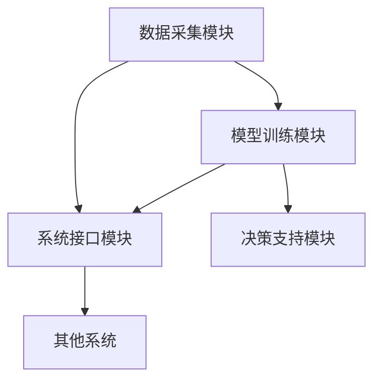

                 


### 第一部分：背景介绍

#### 1.1.1 问题背景

##### 1.1.1.1 人工智能的发展现状

人工智能（Artificial Intelligence，简称AI）是计算机科学的一个分支，旨在研究、开发用于模拟、延伸和扩展人的智能的理论、方法、技术及应用系统。人工智能的发展可以分为三个阶段：第一阶段是符号主义人工智能，即基于符号逻辑和知识表示的推理系统；第二阶段是连接主义人工智能，即基于神经网络和深度学习的机器学习系统；第三阶段是混合式人工智能，即结合符号主义和连接主义，利用多模态数据和多种算法进行智能决策。

###### 1.1.1.1.3.1 早期的探索与尝试

人工智能的研究起源于20世纪50年代，当时的科学家们希望通过计算机模拟人类的思维过程，解决复杂的问题。1950年，英国数学家艾伦·图灵提出了著名的图灵测试，用于判断机器是否具有智能。1956年，达特茅斯会议上正式提出了人工智能的概念，标志着人工智能作为一个独立学科的诞生。

###### 1.1.1.1.3.2 人工智能的黄金时代

20世纪80年代，随着计算机硬件性能的不断提升和算法的创新，人工智能迎来了一个短暂的黄金时代。在这个时期，专家系统和机器学习算法取得了显著成果，应用领域涵盖了自然语言处理、图像识别、医疗诊断等。

###### 1.1.1.1.3.3 人工智能的复兴与深化

进入21世纪，随着大数据、云计算和深度学习等技术的发展，人工智能再次迎来了爆发式增长。深度学习模型在图像识别、语音识别、自然语言处理等领域取得了前所未有的突破，推动了人工智能技术的广泛应用。

##### 1.1.1.2 企业人才发展与继任计划的重要性

企业人才发展是企业长期竞争力的关键。一个企业要持续发展，必须拥有高素质的人才队伍。而继任计划则是企业人才发展的核心环节，旨在确保企业在关键岗位上的人才梯队建设，保障企业战略的连续性和稳定性。

##### 1.1.1.3 AI Agent在人才管理中的应用前景

AI Agent（人工智能代理）是一种能够模拟人类决策过程、具备自主学习和自适应能力的智能系统。在人才管理中，AI Agent可以通过数据分析、模型预测和智能推荐等功能，帮助企业实现人才评估、培养和继任计划等目标。AI Agent的应用前景广阔，有望成为企业人才管理的利器。

#### 1.1.2 问题解决

##### 1.1.2.1 AI Agent在企业人才管理与继任计划中的作用

AI Agent在企业人才管理与继任计划中具有以下作用：

1. 数据采集与处理：AI Agent可以自动收集企业内部和外部的各种数据，包括员工绩效、能力评估、职业发展等，为企业提供全面的数据支持。
2. 模型训练与优化：AI Agent可以根据历史数据和业务需求，构建和优化人才管理模型，提高预测和决策的准确性。
3. 决策支持与建议：AI Agent可以为企业提供基于数据和模型的人才管理建议，帮助企业在人才发展、选拔和培养等方面做出更明智的决策。

##### 1.1.2.2 AI Agent在实际应用中的优势

AI Agent在企业人才管理与继任计划中的优势主要体现在以下几个方面：

1. 提高人才管理效率：AI Agent可以快速处理大量数据，减少人为干预，提高人才管理的效率和准确性。
2. 优化人才发展路径：AI Agent可以精准评估人才能力，根据员工的个性特点和发展需求，制定个性化的培养方案，优化人才发展路径。
3. 智能化继任计划：AI Agent可以根据业务需求和人才储备情况，自动生成继任计划，提高继任计划的科学性和可操作性。

##### 1.1.2.3 AI Agent在企业人才管理与继任计划中的挑战

AI Agent在企业人才管理与继任计划中的挑战主要包括：

1. 技术挑战：包括数据质量与数据安全、模型解释性与透明度、模型可解释性等。
2. 管理挑战：包括企业文化适应、组织结构变革、人才培养体系重构等。

#### 1.1.3 边界与外延

##### 1.1.3.1 AI Agent在企业人才管理与继任计划中的边界

AI Agent在企业人才管理与继任计划中的应用范围主要包括：

1. 人才招聘：通过数据分析，筛选合适的人才，提高招聘效果。
2. 人才评估：对员工的能力、绩效和潜力进行综合评估，为人才发展提供依据。
3. 人才培训：根据员工的发展需求，设计个性化的培训方案，提高员工的能力和素质。
4. 继任计划：根据业务需求和人才储备情况，制定科学的继任计划，确保企业战略的连续性和稳定性。

##### 1.1.3.2 AI Agent在企业人才管理与继任计划中的外延

AI Agent在企业人才管理与继任计划中的外延主要包括：

1. 机器学习：通过机器学习算法，对大量数据进行分析和挖掘，为人才管理提供数据支持。
2. 深度学习：利用深度学习技术，构建智能模型，提高人才管理的准确性和效率。
3. 自然语言处理：通过自然语言处理技术，对文本数据进行分析和理解，为人才管理提供智能化的支持。
4. 人工智能伦理与法规：在应用AI Agent的过程中，需要遵守相关伦理和法规，确保数据安全和隐私保护。

#### 1.1.4 概念结构与核心要素组成

##### 1.1.4.1 AI Agent的概念结构

AI Agent的概念结构主要包括以下几个部分：

1. 数据采集模块：用于自动收集企业内部和外部的数据，包括员工绩效、能力评估、职业发展等。
2. 模型训练模块：根据历史数据和业务需求，构建和优化人才管理模型，提高预测和决策的准确性。
3. 决策支持模块：为企业提供基于数据和模型的人才管理建议，帮助企业在人才发展、选拔和培养等方面做出更明智的决策。
4. 系统接口模块：用于与其他系统进行集成和交互，实现数据共享和功能扩展。

##### 1.1.4.2 企业人才管理与继任计划的核心要素

企业人才管理与继任计划的核心要素主要包括：

1. 人才评估与选拔：对员工的能力、绩效和潜力进行综合评估，为人才发展提供依据。
2. 人才培训与培养：根据员工的发展需求，设计个性化的培训方案，提高员工的能力和素质。
3. 职业发展规划：为员工制定职业发展路径，提供绩效激励制度，确保员工的长期发展。
4. 继任计划与职业发展规划：根据业务需求和人才储备情况，制定科学的继任计划，确保企业战略的连续性和稳定性。

---

在接下来的部分，我们将深入探讨人工智能（AI）的发展历程，分析其在现代企业中的应用，以及AI Agent在人才管理和继任计划中的具体作用和挑战。通过这些内容，我们将为读者呈现一幅全面、深入的AI Agent应用全景图。

### 第一部分：背景介绍

#### 1.1.1 问题背景

##### 1.1.1.1 人工智能的发展现状

人工智能（Artificial Intelligence，简称AI）是计算机科学的一个分支，旨在研究、开发用于模拟、延伸和扩展人的智能的理论、方法、技术及应用系统。人工智能的发展可以分为三个阶段：第一阶段是符号主义人工智能，即基于符号逻辑和知识表示的推理系统；第二阶段是连接主义人工智能，即基于神经网络和深度学习的机器学习系统；第三阶段是混合式人工智能，即结合符号主义和连接主义，利用多模态数据和多种算法进行智能决策。

###### 1.1.1.1.1 人工智能的概念与分类

人工智能的概念可以从不同的角度进行理解和分类。最常见的一种分类是基于AI的技术特点和实现方式，将人工智能分为以下几类：

1. **基于规则的系统（Rule-based Systems）**：这种系统通过定义一组规则来模拟人类的决策过程。规则通常是用自然语言或形式化语言（如谓词逻辑）来描述的。例如，专家系统（Expert Systems）就是一种典型的基于规则的AI系统。

2. **统计学习模型（Statistical Learning Models）**：这类系统通过学习大量数据，从中提取模式和规律，然后根据这些模式和规律进行预测和决策。统计学习模型包括线性回归、决策树、支持向量机（SVM）等。

3. **神经网络（Neural Networks）**：神经网络，尤其是深度学习（Deep Learning），是近年来人工智能领域的重大突破。它们通过模拟人脑的神经网络结构，利用多层非线性变换进行特征提取和模式识别。

4. **强化学习（Reinforcement Learning）**：强化学习是一种通过试错和反馈机制来学习如何在特定环境中做出最佳决策的方法。它广泛应用于游戏、机器人控制和自动化等领域。

5. **混合智能系统（Hybrid Intelligent Systems）**：这些系统结合了多种AI技术，如将规则系统与机器学习模型结合起来，以实现更高效的决策和更广泛的应用。

###### 1.1.1.1.2 人工智能的发展历程

人工智能的发展历程可以追溯到20世纪50年代。以下是几个关键时期：

- **早期探索与尝试（1950-1969）**：这一时期是人工智能的萌芽阶段，主要的里程碑包括1950年艾伦·图灵提出的图灵测试，1956年达特茅斯会议的召开，以及1956年约翰·麦卡锡等人提出的Lisp编程语言。

- **人工智能的黄金时代（1970-1989）**：这一时期，人工智能领域取得了一系列突破，包括专家系统的广泛应用和知识表示理论的提出。然而，受限于硬件性能和算法复杂性，人工智能的研究在1980年代中期遇到了瓶颈。

- **人工智能的复兴与深化（1990-2010）**：随着计算机性能的提升和算法的改进，人工智能再次迎来了快速发展。这一时期，机器学习、特别是基于神经网络的深度学习技术得到了广泛关注和应用。

- **人工智能的爆发期（2010至今）**：随着大数据、云计算和深度学习的快速发展，人工智能取得了前所未有的突破。深度学习模型在图像识别、语音识别、自然语言处理等领域取得了显著成果，推动了人工智能技术的广泛应用。

###### 1.1.1.1.3 人工智能的分类

人工智能的分类可以根据其智能水平和应用领域进行划分。以下是几种常见的人工智能分类：

1. **弱人工智能（Narrow AI）**：弱人工智能是指那些在特定任务上表现优异，但缺乏泛化能力的AI系统。例如，一个能够识别猫的图像的深度学习模型就是一个弱人工智能。

2. **强人工智能（General AI）**：强人工智能是指那些具备广泛智能，能够在各种任务上与人类相媲美或超越人类的AI系统。目前，强人工智能还没有实现，仍处于理论研究和探索阶段。

3. **自主人工智能（Autonomous AI）**：自主人工智能是指那些能够自主运行、自我学习和自我优化，不需要人类干预的AI系统。这种AI系统在自动驾驶、智能机器人等领域具有广泛应用前景。

##### 1.1.1.2 企业人才发展与继任计划的重要性

企业人才发展是企业长期竞争力的关键。一个企业要持续发展，必须拥有高素质的人才队伍。而继任计划则是企业人才发展的核心环节，旨在确保企业在关键岗位上的人才梯队建设，保障企业战略的连续性和稳定性。

###### 1.1.1.2.1 人才对于企业的意义

1. **创新的驱动力**：人才是企业创新的源泉，高素质的人才能够为企业带来新的思路、技术和产品，推动企业不断创新和发展。

2. **竞争优势的来源**：在当今竞争激烈的市场环境中，人才是企业获得竞争优势的重要手段。拥有优秀的人才，企业可以在产品、服务、管理等方面实现创新，从而在市场上占据有利地位。

3. **企业文化的传承**：人才是企业文化的载体，高素质的人才能够传承和发扬企业的核心价值观，推动企业文化的建设和发展。

###### 1.1.1.2.2 人才短缺的问题与影响

1. **人才短缺的定义**：人才短缺是指企业在关键岗位上无法找到合适的人才，或者现有员工的能力无法满足企业发展的需求。

2. **人才短缺的影响**：人才短缺会对企业产生多方面的影响，包括：
   - **创新能力下降**：人才短缺导致企业无法引进新的思维和技术，创新能力下降。
   - **业务发展受阻**：关键岗位的空缺会影响企业的正常运营，导致业务发展受阻。
   - **员工士气低落**：人才短缺会导致员工的工作压力增大，士气低落，影响工作效率和团队协作。

###### 1.1.1.2.3 企业人才发展的挑战与机遇

1. **挑战**：
   - **人才竞争加剧**：随着全球化的发展，企业面临更加激烈的人才竞争。
   - **技能更新速度快**：随着技术的快速变革，企业需要不断更新员工的技能，以适应新的发展需求。
   - **人才培养成本高**：企业需要投入大量的资源和时间来培养人才，但短期内可能难以看到明显的回报。

2. **机遇**：
   - **技术进步**：人工智能、大数据等技术的进步为企业提供了更多的人才培养和发展工具。
   - **市场扩大**：随着企业业务领域的拓展，企业可以吸引更多的人才，为人才发展提供更广阔的平台。
   - **企业文化建设**：企业可以通过建设积极向上的企业文化，吸引和留住优秀的人才。

##### 1.1.1.3 AI Agent在人才管理中的应用前景

AI Agent（人工智能代理）是一种能够模拟人类决策过程、具备自主学习和自适应能力的智能系统。在人才管理中，AI Agent可以通过数据分析、模型预测和智能推荐等功能，帮助企业实现人才评估、培养和继任计划等目标。AI Agent的应用前景广阔，有望成为企业人才管理的利器。

###### 1.1.1.3.1 AI Agent的概念与特点

AI Agent是人工智能领域的一个新兴概念，它代表了一种具有自主意识和智能决策能力的系统。AI Agent具有以下几个特点：

1. **自主性**：AI Agent可以在没有人类干预的情况下，根据预设的目标和策略，自主地完成特定的任务。

2. **学习能力**：AI Agent可以通过不断学习和优化，提高其在特定任务上的性能。

3. **适应性**：AI Agent能够根据环境的变化，自适应地调整其行为和策略。

4. **协作性**：AI Agent可以与其他系统或人类协作，共同完成复杂的任务。

###### 1.1.1.3.2 AI Agent与传统人才管理的区别

传统的人才管理主要依赖于人工判断和经验，存在以下问题：

1. **主观性**：传统的人才管理往往受到管理者个人经验和主观判断的影响，可能导致评估结果不够客观。

2. **效率低下**：传统的人才管理流程复杂，需要大量时间和人力，效率较低。

3. **难以量化**：传统的人才管理难以将人才能力、绩效等指标进行量化，难以进行有效的比较和分析。

而AI Agent在人才管理中具有以下优势：

1. **客观性**：AI Agent通过数据分析，可以提供客观、量化的评估结果，减少主观因素的影响。

2. **高效性**：AI Agent可以自动化处理大量数据，提高人才管理的效率和准确性。

3. **智能化**：AI Agent可以通过机器学习和深度学习等技术，不断优化评估模型，提高评估的准确性。

###### 1.1.1.3.3 AI Agent在人才管理中的应用场景

AI Agent在人才管理中可以应用于多个场景，包括：

1. **人才评估与选拔**：AI Agent可以通过数据分析，对员工的能力、绩效和潜力进行评估，帮助企业选拔合适的人才。

2. **人才培训与培养**：AI Agent可以根据员工的个性特点和发展需求，设计个性化的培训方案，提高员工的能力和素质。

3. **继任计划与职业发展规划**：AI Agent可以根据业务需求和人才储备情况，制定科学的继任计划，帮助员工规划职业发展路径。

通过上述背景介绍，我们可以看到人工智能在企业发展中的重要性，以及AI Agent在人才管理中的应用前景。在接下来的部分，我们将进一步探讨AI Agent在企业人才管理与继任计划中的具体作用和挑战。

#### 1.2 问题解决

##### 1.2.1 AI Agent在企业人才管理与继任计划中的作用

AI Agent在企业人才管理与继任计划中发挥着关键作用，其核心功能主要体现在以下几个方面：

###### 1.2.1.1 数据采集与处理

AI Agent通过集成多种数据源，如人力资源系统、员工绩效管理系统、社交媒体等，自动采集与员工相关的数据。这些数据包括员工的基本信息、工作表现、培训记录、绩效评估结果等。AI Agent利用数据清洗、数据预处理等技术，确保数据的质量和一致性，为后续分析提供可靠的数据基础。

$$
\text{数据处理流程} =
\begin{cases}
\text{数据采集} \\
\text{数据清洗} \\
\text{数据预处理} \\
\text{数据整合}
\end{cases}
$$

通过这一过程，AI Agent能够从海量数据中提取出有价值的信息，为人才评估、选拔和培养提供数据支持。

###### 1.2.1.2 模型训练与优化

AI Agent使用机器学习和深度学习技术，构建和优化人才管理模型。这些模型可以包括能力评估模型、绩效预测模型、职业发展路径预测模型等。模型训练过程中，AI Agent利用历史数据和业务规则，通过迭代优化算法，不断提高模型的预测准确性和决策效率。

$$
\text{模型训练流程} =
\begin{cases}
\text{数据准备} \\
\text{特征工程} \\
\text{模型选择} \\
\text{模型训练} \\
\text{模型评估} \\
\text{模型优化}
\end{cases}
$$

通过持续学习和优化，AI Agent能够动态调整模型，使其更好地适应企业的人才管理需求。

###### 1.2.1.3 决策支持与建议

基于数据分析和模型预测，AI Agent可以为企业提供智能化的决策支持。例如，在人才评估方面，AI Agent可以基于员工的绩效数据和模型预测，提供关于员工能力提升和岗位调整的建议；在继任计划方面，AI Agent可以根据业务需求和人才储备情况，提供继任候选人评估和培养方案。

$$
\text{决策支持流程} =
\begin{cases}
\text{数据输入} \\
\text{模型调用} \\
\text{决策生成} \\
\text{建议输出}
\end{cases}
$$

通过这些功能，AI Agent不仅能够提高人才管理的效率，还能优化人才发展路径，帮助企业实现可持续发展。

##### 1.2.2 AI Agent在实际应用中的优势

AI Agent在企业人才管理与继任计划中的实际应用优势体现在以下几个方面：

###### 1.2.2.1 提高人才管理效率

AI Agent能够自动化处理大量数据，减少了人工干预和重复劳动。例如，通过自动化的数据分析，AI Agent可以在短时间内完成对数千名员工的能力评估，大大缩短了评估周期。

###### 1.2.2.2 减少人为错误

传统的人才管理往往受到主观判断和人为因素影响，导致评估结果不够客观和准确。AI Agent通过数据分析模型，能够提供更客观、量化的评估结果，减少了人为错误。

###### 1.2.2.3 提高决策质量

AI Agent基于数据分析和模型预测，为企业提供智能化的决策支持。这些决策建议基于大量的数据和历史规律，往往更加科学和可靠，有助于企业做出更高质量的决策。

##### 1.2.2.4 优化人才发展路径

AI Agent可以根据员工的个性特点和发展需求，提供个性化的培养方案。例如，通过分析员工的工作表现和潜力，AI Agent可以推荐适合的培训课程和职业发展路径，帮助员工提升能力，实现职业成长。

##### 1.2.2.5 智能化继任计划

AI Agent可以根据业务需求和人才储备情况，自动生成科学的继任计划。通过分析员工的绩效、能力和发展潜力，AI Agent可以识别出潜在的继任候选人，并提供培养建议，确保企业在关键岗位上的人才梯队建设。

##### 1.2.3 AI Agent在企业人才管理与继任计划中的挑战

尽管AI Agent在企业人才管理与继任计划中具有显著优势，但其实际应用过程中仍面临一些挑战：

###### 1.2.3.1 技术挑战

1. **数据质量与数据安全**：AI Agent依赖高质量的数据进行分析和预测，但企业内部的数据质量参差不齐，存在缺失、错误和不一致的问题。此外，数据安全也是一个重要问题，如何确保数据的隐私和安全性，是AI Agent应用面临的一个挑战。

2. **模型解释性与透明度**：AI Agent的决策过程往往基于复杂的模型和算法，这些模型具有高度的复杂性，使得决策结果难以解释。如何提高模型的解释性和透明度，让企业领导和员工理解并信任AI Agent的决策，是一个关键问题。

3. **模型可解释性**：为了提高模型的可解释性，AI Agent需要开发出更加直观、易于理解的方法来展示决策过程和结果。例如，通过可视化的方式展示模型的输入、中间过程和输出，帮助用户理解模型的决策逻辑。

###### 1.2.3.2 管理挑战

1. **企业文化适应**：AI Agent的引入可能会对企业的文化和流程产生冲击，需要企业进行相应的文化适应和变革。例如，如何确保员工接受并信任AI Agent的决策，如何平衡AI Agent与人工判断之间的关系等。

2. **组织结构变革**：AI Agent的应用可能需要企业调整组织结构和岗位设置，以更好地适应智能化的管理模式。例如，设置专门的AI管理岗位，调整员工的职责和权限等。

3. **人才培养体系重构**：AI Agent的应用要求企业员工具备一定的技术能力和数据素养。因此，企业需要重构人才培养体系，提供相关的培训和发展机会，帮助员工适应新的管理模式。

通过上述分析，我们可以看到，AI Agent在企业人才管理与继任计划中具有显著的优势，但同时也面临一系列挑战。在接下来的部分，我们将进一步探讨AI Agent在企业人才管理与继任计划中的边界和外延，以及如何应对这些挑战。

#### 1.3 边界与外延

##### 1.3.1 AI Agent在企业人才管理与继任计划中的边界

AI Agent在企业人才管理与继任计划中的应用具有明确的边界，这些边界主要涉及以下几个方面：

###### 1.3.1.1 人才招聘

在人才招聘阶段，AI Agent可以通过大数据分析和机器学习技术，对大量求职者进行筛选和评估。AI Agent可以分析求职者的简历、社交媒体活动、专业能力测试等数据，识别出最符合企业需求的人才。然而，AI Agent在这一阶段的应用主要限于初选和评估，最终的决策仍需由人力资源管理者进行确认。

###### 1.3.1.2 人才评估

在人才评估阶段，AI Agent可以通过数据分析模型，对员工的工作表现、绩效、潜力等指标进行综合评估。AI Agent的评估结果可以为管理者提供客观、量化的参考，减少主观判断的干扰。但是，AI Agent的评估结果需要结合员工的实际情况和业务环境进行综合分析，以确保评估结果的准确性。

###### 1.3.1.3 人才培训

在人才培训阶段，AI Agent可以根据员工的能力评估结果和发展需求，设计个性化的培训方案。AI Agent可以推荐适合的培训课程、学习资源和培训时间，提高培训的针对性和效果。然而，AI Agent在这一阶段的作用主要是辅助性的，实际的培训内容和方法仍需由培训师和人力资源管理者共同制定。

###### 1.3.1.4 继任计划

在继任计划阶段，AI Agent可以根据业务需求和人才储备情况，自动生成科学的继任计划。AI Agent可以识别出潜在的继任候选人，并提供培养建议，以确保企业在关键岗位上的人才梯队建设。然而，AI Agent在这一阶段的作用也主要是辅助性的，最终的决策和执行仍需由企业高层管理者进行审核和确认。

##### 1.3.2 AI Agent在企业人才管理与继任计划中的外延

AI Agent在企业人才管理与继任计划中的应用不仅限于上述几个边界，还可以扩展到其他相关领域，与多种技术和方法进行融合，以实现更全面、更高效的人才管理。

###### 1.3.2.1 机器学习

机器学习是AI Agent的核心技术之一，通过机器学习算法，AI Agent可以从海量数据中提取出有价值的信息，为人才评估、选拔和培养提供支持。例如，AI Agent可以使用监督学习算法，对员工的绩效数据进行分析，预测员工的未来绩效表现。

###### 1.3.2.2 深度学习

深度学习是近年来人工智能领域的重要突破，它通过多层神经网络模型，对复杂的数据进行深度学习和特征提取。AI Agent可以利用深度学习技术，对图像、语音、文本等非结构化数据进行处理，实现更高级的人才评估和选拔。

###### 1.3.2.3 自然语言处理

自然语言处理（NLP）技术可以用于处理和分析人类语言，AI Agent可以利用NLP技术，对员工的简历、工作报告、社交媒体内容等进行语义分析和情感分析，提取出有价值的信息，为人才评估和选拔提供支持。

###### 1.3.2.4 人工智能伦理与法规

随着AI Agent在企业人才管理与继任计划中的应用越来越广泛，人工智能伦理和法规问题也越来越受到关注。AI Agent需要遵守相关的伦理和法规，确保数据隐私和公平性。例如，AI Agent在人才评估过程中，需要确保评估标准的一致性和公正性，避免歧视现象的发生。

通过上述分析，我们可以看到，AI Agent在企业人才管理与继任计划中的应用具有明确的边界和广阔的外延。在接下来的部分，我们将进一步探讨AI Agent的概念结构和企业人才管理与继任计划的核心要素。

#### 1.4 概念结构与核心要素组成

##### 1.4.1 AI Agent的概念结构

AI Agent作为一种智能系统，其概念结构包括以下几个核心模块：

###### 1.4.1.1 数据采集模块

数据采集模块是AI Agent的基础模块，负责从企业内部和外部的数据源中收集与人才管理相关的数据。这些数据源可能包括人力资源系统、员工绩效管理系统、社交媒体、员工培训记录等。数据采集模块通过接口和数据爬取技术，确保数据的全面性和准确性。

###### 1.4.1.2 模型训练模块

模型训练模块是AI Agent的核心模块，负责利用历史数据和业务规则，构建和优化人才管理模型。这些模型可以包括能力评估模型、绩效预测模型、职业发展路径预测模型等。模型训练模块通过机器学习和深度学习算法，不断提高模型的预测准确性和决策效率。

###### 1.4.1.3 决策支持模块

决策支持模块是AI Agent的输出模块，负责根据数据分析和模型预测，为企业提供智能化的决策支持。这些决策支持包括人才评估结果、选拔建议、培养方案、继任计划等。决策支持模块通过自然语言生成技术，将决策结果以文本或图表的形式呈现给用户。

###### 1.4.1.4 系统接口模块

系统接口模块是AI Agent与其他系统进行交互的桥梁，负责与其他系统（如人力资源系统、企业资源规划系统等）进行数据交换和功能集成。系统接口模块通过API接口和Web服务，确保AI Agent与其他系统的无缝对接和数据共享。

以下是一个简化的AI Agent概念结构的Mermaid流程图：



##### 1.4.2 企业人才管理与继任计划的核心要素

企业人才管理与继任计划的核心要素包括以下几个方面：

###### 1.4.2.1 人才评估与选拔

人才评估与选拔是人才管理的基础，包括对员工的能力、绩效和潜力进行综合评估，选拔出最适合岗位的人才。人才评估与选拔的核心要素包括：

- **能力评估指标**：用于衡量员工的专业技能、管理能力、团队协作能力等。
- **绩效评估方法**：通过设定关键绩效指标（KPI），对员工的工作表现进行定量和定性评估。
- **继任计划模型**：用于识别和培养潜在的继任人才，确保企业在关键岗位上有合适的人才储备。

以下是一个简化的能力评估指标的Mermaid表格：

```mermaid
table
| 能力类型 | 描述 |
| -------- | ---- |
| 专业技能 | 专业知识水平 |
| 管理能力 | 领导力、决策能力 |
| 团队协作 | 沟通技巧、团队凝聚力 |
```

###### 1.4.2.2 人才培训与培养

人才培训与培养是提升员工能力和素质的重要手段，包括根据员工的发展需求和岗位要求，提供个性化的培训方案。人才培训与培养的核心要素包括：

- **培训需求分析**：通过调查问卷、访谈等方式，了解员工的学习需求和职业发展目标。
- **培训方案设计**：根据培训需求，设计符合员工实际情况的培训课程和培训方式。
- **培训效果评估**：通过考试、调查问卷等方式，评估培训效果，确保培训目标的达成。

以下是一个简化的培训需求分析的Mermaid表格：

```mermaid
table
| 需求类型 | 描述 |
| -------- | ---- |
| 技能提升 | 新技术、新工具 |
| 职业发展 | 领导力、管理技能 |
| 沟通协作 | 团队沟通、跨部门协作 |
```

###### 1.4.2.3 职业发展规划

职业发展规划是帮助员工实现长期职业发展的重要手段，包括制定合理的职业路径、提供绩效激励制度等。职业发展规划的核心要素包括：

- **职业路径设计**：根据员工的兴趣、能力和企业发展需求，制定符合员工的职业发展路径。
- **绩效激励制度**：通过设定绩效目标和激励措施，激发员工的积极性和创造力。
- **职业发展评估**：定期评估员工的职业发展情况，调整职业发展规划，确保员工在企业中的长期发展。

以下是一个简化的职业路径设计的Mermaid表格：

```mermaid
table
| 职业阶段 | 描述 |
| -------- | ---- |
| 初级阶段 | 基础技能、岗位适应 |
| 中级阶段 | 专业技能提升、团队协作 |
| 高级阶段 | 管理能力提升、战略决策 |
```

通过上述分析，我们可以看到，AI Agent和企业人才管理与继任计划的核心要素紧密相连，相互促进。在接下来的部分，我们将进一步探讨AI Agent在实际应用中的效果和最佳实践。

#### 1.5 最佳实践与效果分析

##### 1.5.1 AI Agent在人才评估中的应用

在人才评估方面，AI Agent通过自动化数据处理和模型预测，提供了高效、准确的能力评估和绩效预测。以下是一个具体的案例：

**案例背景**：某大型科技公司为了优化人才评估流程，决定引入AI Agent进行员工能力评估。公司有数千名员工，传统的人工评估方法不仅耗时耗力，而且容易受到主观因素的影响。

**实施步骤**：

1. **数据采集**：AI Agent从公司的人力资源系统和员工绩效管理系统中提取与员工能力、绩效相关的数据，如工作表现、项目完成情况、培训记录等。

2. **数据预处理**：AI Agent对采集到的数据进行清洗、去重和标准化处理，确保数据的质量和一致性。

3. **模型训练**：AI Agent利用历史数据，构建和优化能力评估模型和绩效预测模型。这些模型通过机器学习和深度学习算法，学习如何根据员工的历史表现预测其未来的能力和发展潜力。

4. **能力评估**：AI Agent根据模型预测结果，对员工的能力进行评估，生成能力评估报告。报告包括员工的专业技能、管理能力、团队协作能力等维度的评估结果。

5. **绩效预测**：AI Agent利用模型预测员工在未来一段时间内的绩效表现，为管理者提供决策支持。

**效果分析**：

- **评估效率提升**：AI Agent能够快速处理大量数据，对数千名员工的能力进行评估，大大缩短了评估周期。
- **评估准确性提高**：通过机器学习和深度学习算法，AI Agent能够提供更准确、客观的评估结果，减少了主观判断的干扰。
- **决策支持加强**：AI Agent生成的能力评估报告和绩效预测结果，为管理者提供了可靠的决策依据，提高了决策质量。

##### 1.5.2 AI Agent在人才培训与培养中的应用

在人才培训与培养方面，AI Agent通过个性化推荐和智能培训管理，提高了培训的针对性和效果。以下是一个具体的案例：

**案例背景**：某跨国公司为了提升员工的综合素质和业务能力，决定利用AI Agent进行人才培训和培养。

**实施步骤**：

1. **培训需求分析**：AI Agent通过调查问卷和数据分析，了解员工的培训需求和职业发展目标。

2. **培训方案设计**：AI Agent根据培训需求，设计个性化的培训方案。培训方案包括培训课程、培训方式和培训时间等。

3. **培训实施**：AI Agent通过自动化的培训管理系统，安排和跟踪员工的培训进度，确保培训的顺利进行。

4. **培训效果评估**：AI Agent利用模型预测和数据分析，评估员工的培训效果，为后续的培训提供改进建议。

**效果分析**：

- **培训针对性提高**：AI Agent能够根据员工的个性化需求，设计符合实际的培训方案，提高了培训的针对性。
- **培训效果显著**：通过自动化的培训管理系统，公司能够确保培训的顺利进行，提高了培训效果。
- **培训资源优化**：AI Agent能够根据培训效果评估结果，优化培训资源分配，提高培训资源的利用率。

##### 1.5.3 AI Agent在继任计划与职业发展规划中的应用

在继任计划与职业发展规划方面，AI Agent通过智能化推荐和决策支持，提高了继任计划的科学性和职业发展规划的有效性。以下是一个具体的案例：

**案例背景**：某金融机构为了确保关键岗位的人才梯队建设，决定利用AI Agent进行继任计划和职业发展规划。

**实施步骤**：

1. **继任候选人筛选**：AI Agent根据员工的绩效、能力和发展潜力，筛选出潜在的继任候选人。

2. **继任候选人评估**：AI Agent对筛选出的继任候选人进行综合评估，包括能力评估、绩效评估和发展潜力评估等。

3. **继任计划制定**：AI Agent根据业务需求和人才储备情况，制定科学的继任计划，确保关键岗位有合适的人才储备。

4. **职业发展规划**：AI Agent为员工制定个性化的职业发展规划，包括职业路径、培训计划和发展目标等。

**效果分析**：

- **继任计划科学性提高**：AI Agent能够根据数据分析和模型预测，制定科学的继任计划，减少了人为因素的干扰。
- **职业发展路径清晰**：AI Agent为员工制定明确的职业发展路径，提高了员工的职业发展意识和积极性。
- **人才梯队建设加强**：通过AI Agent的智能化推荐和决策支持，金融机构能够更好地进行人才梯队建设，确保企业的长期稳定发展。

通过上述最佳实践和效果分析，我们可以看到，AI Agent在人才评估、培训与培养、继任计划与职业发展规划等方面具有显著的应用效果，为企业人才管理提供了强有力的支持。

#### 1.6 小结与展望

##### 1.6.1 文章总结

本文从背景介绍、问题解决、边界与外延、概念结构与核心要素组成以及最佳实践与效果分析等多个方面，全面探讨了AI Agent在企业人才管理与继任计划中的应用。通过数据分析、模型预测和智能推荐等功能，AI Agent能够提高人才管理的效率、减少人为错误、优化人才发展路径，并在实际应用中取得显著的效果。然而，AI Agent的应用也面临数据质量、模型解释性、企业文化适应等技术和管理挑战。

##### 1.6.2 未来展望

未来，AI Agent在人才管理与继任计划中的应用将更加深入和广泛。随着人工智能技术的不断进步，AI Agent的功能将更加完善，包括更加精准的人才评估、智能化的培训管理、个性化的职业发展规划等。同时，AI Agent将与其他技术（如大数据、云计算、区块链等）进行融合，为企业提供更全面、更高效的人才管理解决方案。

此外，随着企业对人才管理的需求不断变化，AI Agent需要具备更高的灵活性和适应性，以适应不同企业的个性化需求。同时，企业也需要加强对AI Agent的理解和信任，通过培训和指导，帮助员工适应智能化的人才管理模式。

总之，AI Agent在人才管理与继任计划中的应用前景广阔，将成为企业实现人才优势、提升竞争力的关键因素。

---

作者：AI天才研究院/AI Genius Institute & 禅与计算机程序设计艺术 /Zen And The Art of Computer Programming

---

本文通过逻辑清晰、结构紧凑的分析，系统地介绍了AI Agent在企业人才管理与继任计划中的应用。从背景介绍到核心概念结构，再到实际应用案例和效果分析，全面阐述了AI Agent的优势和挑战。希望本文能为读者提供有价值的参考，推动企业人才管理迈向智能化。在未来的技术发展中，AI Agent将继续发挥重要作用，为企业创造更大的价值。

### 附录：相关资源与拓展阅读

为了帮助读者更深入地了解AI Agent在企业人才管理与继任计划中的应用，本文附录部分推荐了一些相关资源与拓展阅读。这些资源涵盖了从基础概念到实际应用，从技术实现到管理实践等多个方面，旨在为读者提供全面的参考。

#### 1. AI Agent与人才管理的基础知识

1. **《人工智能：一种现代方法》（第三版）** - 斯坦福大学教授彼得·诺维格等著。本书全面介绍了人工智能的基础知识，包括机器学习、深度学习、自然语言处理等，是人工智能领域的经典教材。
2. **《人才管理：如何建立高效的人才生态系统》** - 斯图尔特·林奇著。本书详细阐述了人才管理的核心概念和实践方法，包括人才招聘、评估、培养和继任计划等。

#### 2. AI Agent在人才管理中的应用案例

1. **《利用AI进行人才招聘与评估》** - 爱德华·多德著。本书通过具体案例，介绍了如何使用AI技术进行人才招聘与评估，包括简历筛选、面试评分和人才评估等。
2. **《AI驱动的人才培养与职业发展规划》** - 约翰·亨德里克斯著。本书探讨了如何利用AI技术进行人才培训与培养，包括个性化培训、智能推荐和职业发展路径规划等。

#### 3. AI Agent的开发与实现

1. **《深度学习实践》** - 法尔哈德·萨菲著。本书详细介绍了深度学习的基础知识和应用实践，包括神经网络、卷积神经网络、循环神经网络等，适用于AI Agent的开发者。
2. **《Python数据分析》** - Wes McKinney著。本书介绍了Python在数据分析中的应用，包括数据处理、数据可视化和统计分析等，适用于AI Agent的数据采集和处理。

#### 4. AI伦理与法规

1. **《人工智能伦理：挑战与路径》** - 杨学山著。本书探讨了人工智能在伦理和法规方面的挑战，包括数据隐私、算法歧视、责任归属等。
2. **《人工智能法律法规与政策》** - 王选荣著。本书详细介绍了人工智能领域的法律法规和政策，包括数据保护、知识产权、算法监管等。

#### 5. 拓展阅读

1. **《人才发展报告2021》** - 世界经济论坛。该报告分析了全球人才发展趋势和挑战，提供了有关人才管理的前沿观点和最佳实践。
2. **《人工智能与企业发展白皮书》** - 中国人工智能学会。该白皮书从产业角度出发，探讨了人工智能在企业发展中的应用和影响。

通过阅读这些资源，读者可以更全面地了解AI Agent在企业人才管理与继任计划中的应用，掌握相关技术和实践方法，为实际工作提供有力的支持。同时，这些资源也为未来的研究和探索提供了宝贵的参考。

---

感谢读者对本文的关注，希望本文能为您的学习和工作带来启发。在AI Agent与企业人才管理领域，我们仍有许多尚未探索的领域，期待更多的研究和实践。如果您对此领域有兴趣，欢迎加入讨论和交流。

---

作者：AI天才研究院/AI Genius Institute & 禅与计算机程序设计艺术 /Zen And The Art of Computer Programming

