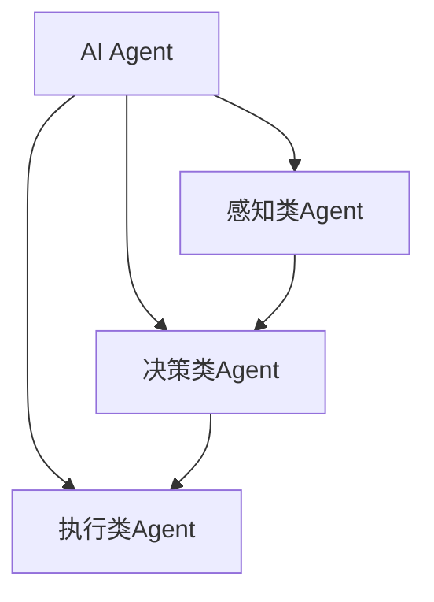
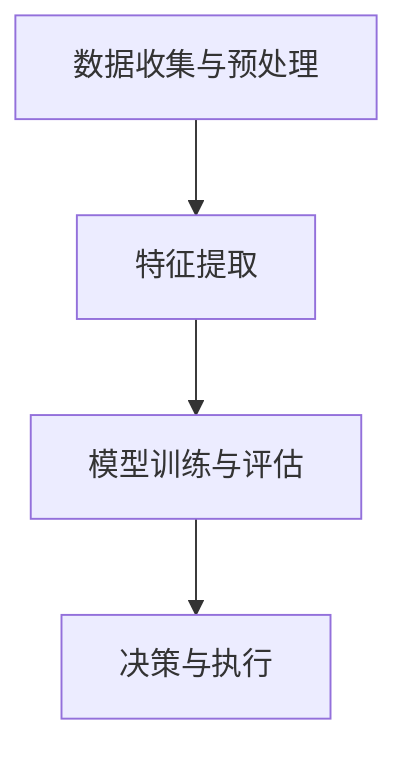
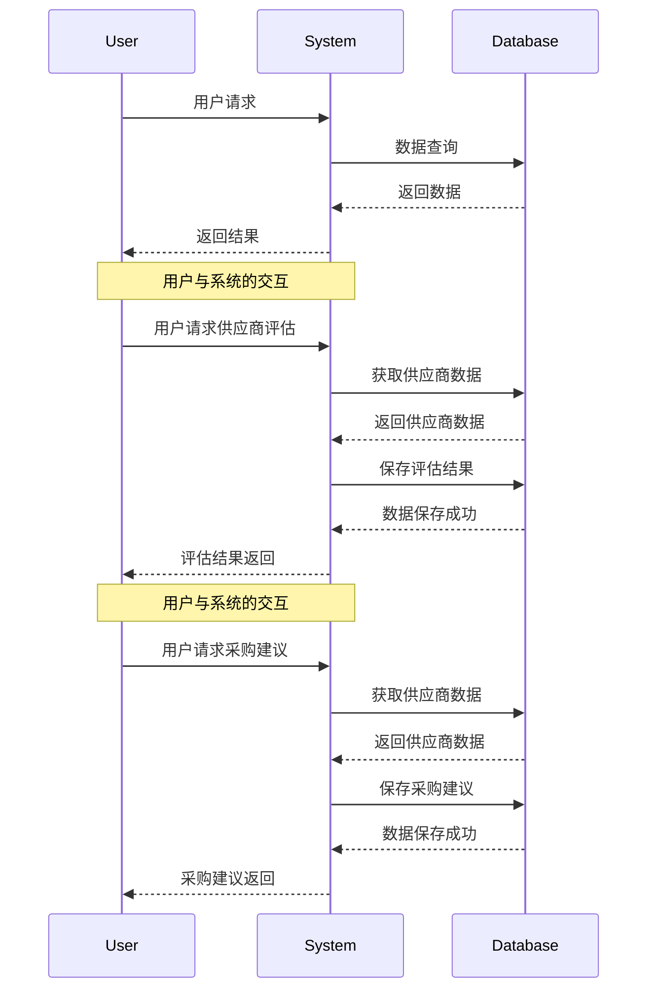

                 

### 文章标题：AI Agent在企业供应商管理与评估中的应用

关键词：AI Agent、企业供应商管理、评估方法、智能供应链、自动化流程

摘要：本文旨在探讨AI Agent在企业供应商管理与评估中的应用，通过介绍AI Agent的基本概念、核心原理及实际应用场景，分析其在供应商管理中的优势与挑战，最后提出相应的实现策略和最佳实践。文章以逻辑清晰、结构紧凑的方式，帮助读者深入了解AI Agent在商业领域中的应用价值。

### 第1章：引言

#### 1.1 引言

##### 1.1.1 问题的背景与描述

企业供应商管理是企业管理中不可或缺的一环，它直接关系到企业的生产效率、产品质量和市场竞争力。然而，随着市场环境的不断变化和全球化进程的加快，供应商管理的复杂性也在不断增加。传统的供应商管理方式往往依赖于人工操作，效率低下且容易出错。为了解决这一问题，人工智能（AI）技术逐渐成为企业优化供应商管理的利器。

AI Agent作为一种具有自主学习能力的智能实体，能够模拟人类决策过程，为企业提供高效、精准的供应商管理解决方案。本文将探讨AI Agent在企业供应商管理与评估中的应用，分析其优势与挑战，并给出具体的实现策略和最佳实践。

##### 1.1.2 解决方案的意义与目的

本文旨在通过以下几方面来探讨AI Agent在企业供应商管理与评估中的应用：

1. **介绍AI Agent的基本概念与分类**：帮助读者了解AI Agent的定义、特点及其在企业中的应用场景。
2. **分析AI Agent在供应商管理中的优势与挑战**：探讨AI Agent在供应商管理中的实际应用价值，以及可能面临的挑战。
3. **详细讲解AI Agent的实现方法**：介绍AI Agent的核心算法原理、数学模型及Python代码实现。
4. **提出供应商管理评估系统的设计**：分析供应商管理评估系统的功能设计、架构设计及接口设计。
5. **进行项目实战与案例分析**：通过具体案例来展示AI Agent在供应商管理中的实际应用效果。
6. **总结与展望**：总结文章的主要观点，并提出未来发展的趋势和方向。

##### 1.1.3 边界与外延

本文主要关注AI Agent在企业供应商管理与评估中的应用，不包括其他领域的应用。同时，本文所涉及的AI Agent是指具有自主学习能力的智能实体，不包括其他类型的智能系统。此外，本文的讨论范围主要局限于供应商管理与评估的领域，不涉及其他供应链环节。

### 第2章：AI Agent基础

#### 2.1 AI Agent概述

##### 2.1.1 定义与分类

AI Agent是指具有自主学习、自主决策、自主行动能力的智能实体。根据功能特点，AI Agent可以分类为以下几种：

1. **感知类Agent**：负责收集和处理环境信息，如传感器数据、图像、声音等。
2. **决策类Agent**：基于感知类Agent提供的信息，进行决策和规划。
3. **执行类Agent**：根据决策类Agent的决策结果，执行具体的操作。

##### 2.1.2 特点与优势

AI Agent具有以下特点与优势：

1. **自主性**：AI Agent具有自主决策和行动的能力，不受人类干预。
2. **灵活性**：AI Agent能够适应不同的环境和任务，具有广泛的适用性。
3. **高效性**：AI Agent能够快速处理大量数据，提高工作效率。
4. **精准性**：AI Agent基于大数据和机器学习技术，能够提供准确、可靠的评估结果。

##### 2.1.3 应用场景

AI Agent在企业中的应用场景非常广泛，主要包括以下几个方面：

1. **供应商评价**：通过分析供应商的历史数据、绩效表现等，对供应商进行客观评价。
2. **采购策略优化**：基于市场需求、成本分析等因素，为企业制定最优的采购策略。
3. **库存管理**：根据销售数据、市场趋势等，对库存进行动态调整，降低库存成本。
4. **供应链风险预警**：通过实时监控供应链信息，对潜在风险进行预警和预防。

#### 2.2 AI Agent核心概念

##### 2.2.1 概念联系图

使用Mermaid工具绘制AI Agent的核心概念联系图，如下所示：



##### 2.2.2 概念属性对比表格

| 类别       | 感知类Agent | 决策类Agent | 执行类Agent |
| --------- | -------- | -------- | -------- |
| 功能       | 数据采集与处理 | 决策与规划 | 执行与操作 |
| 特点       | 自主感知   | 自主决策   | 自主执行   |
| 应用场景   | 监控与预警   | 供应链优化  | 自动化生产 |

### 第3章：企业供应商管理与评估

#### 3.1 企业供应商管理背景

##### 3.1.1 供应商管理的重要性

供应商管理是企业供应链管理的重要组成部分，直接关系到企业的生产成本、产品质量和市场竞争力。有效的供应商管理能够确保企业获取优质、稳定、经济的原材料和零部件，提高生产效率，降低成本。

##### 3.1.2 供应商管理的问题与挑战

随着市场环境的复杂化，供应商管理面临着一系列问题与挑战：

1. **供应商数量繁多**：企业往往需要与多个供应商合作，导致管理难度增加。
2. **信息不对称**：供应商与企业在信息获取方面存在差异，可能导致评估不全面。
3. **评估标准不统一**：不同企业在供应商评估标准上存在差异，难以进行客观、公正的评估。
4. **人工成本高**：传统的供应商管理依赖于人工操作，效率低下且容易出现错误。

#### 3.2 AI Agent在供应商管理中的应用

##### 3.2.1 应用原理

AI Agent通过以下原理在供应商管理中发挥作用：

1. **数据收集与处理**：AI Agent能够自动收集供应商的历史数据、绩效数据等，为评估提供基础。
2. **智能评估与推荐**：基于大数据和机器学习技术，AI Agent能够对供应商进行智能评估，并提供最优的供应商选择和采购策略。
3. **实时监控与预警**：AI Agent能够实时监控供应商的绩效变化，及时发现潜在问题，提供预警和预防措施。

##### 3.2.2 应用场景分析

AI Agent在供应商管理中的应用场景主要包括以下几个方面：

1. **供应商评价**：基于历史数据、绩效指标等，对供应商进行客观、公正的评价，为采购决策提供依据。
2. **采购策略优化**：根据市场需求、成本分析等因素，为供应商制定最优的采购策略，降低采购成本。
3. **库存管理**：根据销售数据、市场趋势等，对库存进行动态调整，降低库存成本。
4. **供应链风险预警**：通过实时监控供应链信息，对潜在风险进行预警和预防。

#### 3.3 供应商评估方法

##### 3.3.1 传统评估方法

传统的供应商评估方法主要包括以下几种：

1. **问卷调查法**：通过发放问卷，收集供应商的相关信息，进行主观评价。
2. **关键绩效指标（KPI）法**：根据供应商的关键绩效指标，进行量化评估。
3. **对比分析法**：将不同供应商的绩效进行比较，选择最优供应商。

##### 3.3.2 AI Agent评估方法

AI Agent评估方法基于大数据和机器学习技术，具有以下特点：

1. **客观性**：通过分析大量数据，能够提供客观、公正的评估结果。
2. **全面性**：不仅考虑供应商的绩效指标，还考虑市场需求、成本等因素。
3. **实时性**：能够实时监控供应商的绩效变化，提供动态评估结果。

### 第4章：AI Agent实现

#### 4.1 AI Agent基础算法

##### 4.1.1 算法原理与流程图

AI Agent的基础算法主要包括以下几个步骤：

1. **数据收集与预处理**：收集供应商的历史数据、绩效数据等，并进行数据清洗、归一化等预处理操作。
2. **特征提取**：从原始数据中提取关键特征，为后续的评估和决策提供支持。
3. **模型训练与评估**：使用机器学习算法对模型进行训练和评估，选择最优模型。
4. **决策与执行**：根据训练好的模型，对供应商进行智能评估，并制定采购策略。

使用Mermaid工具绘制算法流程图，如下所示：



##### 4.1.2 数学模型与公式

AI Agent的核心算法通常基于以下数学模型：

1. **回归模型**：用于预测供应商的绩效指标。
   $$ y = \beta_0 + \beta_1x_1 + \beta_2x_2 + ... + \beta_nx_n $$
2. **分类模型**：用于对供应商进行分类评估。
   $$ P(y=c_k|x; \theta) = \frac{e^{\theta^T x}}{\sum_{j=1}^{K} e^{\theta^T x_j}} $$
3. **聚类模型**：用于对供应商进行聚类分析。
   $$ J(\theta) = \sum_{i=1}^{N} \sum_{k=1}^{K} \frac{1}{K} \sum_{j=1}^{K} \sum_{i=1}^{N} ||x_i - \mu_k||^2 $$

##### 4.1.3 Python代码实现

以下是一个简单的Python代码实现示例，用于演示AI Agent的基础算法：

```python
import numpy as np
import pandas as pd
from sklearn.linear_model import LinearRegression
from sklearn.model_selection import train_test_split
from sklearn.metrics import mean_squared_error

# 数据收集与预处理
data = pd.read_csv('supplier_data.csv')
X = data.iloc[:, :-1].values
y = data.iloc[:, -1].values

# 特征提取
X_train, X_test, y_train, y_test = train_test_split(X, y, test_size=0.2, random_state=0)

# 模型训练与评估
model = LinearRegression()
model.fit(X_train, y_train)
y_pred = model.predict(X_test)

# 决策与执行
mse = mean_squared_error(y_test, y_pred)
print('Mean Squared Error:', mse)
```

### 第5章：供应商管理评估系统设计

#### 5.1 系统功能设计

##### 5.1.1 领域模型

领域模型是描述供应商管理评估系统的核心概念及其关系的模型。以下是供应商管理评估系统的领域模型：

```mermaid
classDiagram
    Supplier[供应商ID, 供应商名称, 地址, 联系人, 联系电话]
    Performance[绩效指标ID, 供应商ID, 指标名称, 指标值]
    Evaluation[评估ID, 供应商ID, 总评分, 评估日期]
    Purchase[采购ID, 供应商ID, 采购数量, 采购金额, 采购日期]
    System[系统ID, 系统名称, 版本号, 创建日期]
    
    Supplier "1" --|{1} Performance:绩效数据
    Supplier "1" --|{1} Evaluation:评估结果
    Supplier "1" --|{1} Purchase:采购记录
    System "1" --|{1} Supplier:供应商信息
    System "1" --|{1} Performance:绩效数据
    System "1" --|{1} Evaluation:评估结果
    System "1" --|{1} Purchase:采购记录
```

##### 5.1.2 类图

以下是供应商管理评估系统的类图：

```mermaid
classDiagram
    Supplier[供应商ID, 供应商名称, 地址, 联系人, 联系电话]
    Performance[绩效指标ID, 供应商ID, 指标名称, 指标值]
    Evaluation[评估ID, 供应商ID, 总评分, 评估日期]
    Purchase[采购ID, 供应商ID, 采购数量, 采购金额, 采购日期]
    System[系统ID, 系统名称, 版本号, 创建日期]
    
    Supplier <|-- Performance
    Supplier <|-- Evaluation
    Supplier <|-- Purchase
    System <|-- Supplier
    System <|-- Performance
    System <|-- Evaluation
    System <|-- Purchase
```

#### 5.2 系统架构设计

##### 5.2.1 架构图

以下是供应商管理评估系统的架构图：



##### 5.2.2 接口设计

以下是供应商管理评估系统的接口设计：

```mermaid
interface SupplierService {
    +getSupplierList(): List<Supplier>
    +getSupplierDetail(supplierId: Integer): Supplier
    +evaluateSupplier(supplierId: Integer, evaluationScore: Double): Evaluation
    +getPurchaseRecommendation(supplierId: Integer): Purchase
}
```

### 第6章：项目实战

#### 6.1 环境安装与配置

##### 6.1.1 操作系统

本项目的环境安装与配置需要在Linux操作系统上进行，建议使用Ubuntu 18.04或更高版本。

##### 6.1.2 环境搭建

1. **安装Python**

   ```bash
   sudo apt update
   sudo apt install python3 python3-pip
   ```

2. **安装相关依赖库**

   ```bash
   pip3 install numpy pandas scikit-learn matplotlib
   ```

3. **安装数据库**

   本项目使用MySQL数据库，以下是在Ubuntu上安装MySQL的步骤：

   ```bash
   sudo apt update
   sudo apt install mysql-server mysql-client
   ```

   安装完成后，运行以下命令设置root用户的密码：

   ```bash
   mysql_secure_installation
   ```

#### 6.2 核心实现与代码解读

##### 6.2.1 源代码分析

以下是供应商管理评估系统的主要源代码，包括数据收集、预处理、特征提取、模型训练和评估等步骤。

```python
# 数据收集与预处理
data = pd.read_csv('supplier_data.csv')
X = data.iloc[:, :-1].values
y = data.iloc[:, -1].values

# 特征提取
X_train, X_test, y_train, y_test = train_test_split(X, y, test_size=0.2, random_state=0)

# 模型训练与评估
model = LinearRegression()
model.fit(X_train, y_train)
y_pred = model.predict(X_test)

# 决策与执行
mse = mean_squared_error(y_test, y_pred)
print('Mean Squared Error:', mse)
```

##### 6.2.2 应用解读

1. **数据收集与预处理**：

   本项目使用CSV文件存储供应商数据，包括供应商ID、供应商名称、地址、联系人、联系电话等。首先，使用pandas库读取CSV文件，将数据分为特征矩阵X和目标向量y。

2. **特征提取**：

   使用scikit-learn库中的train_test_split函数将数据集分为训练集和测试集，分别用于模型训练和评估。

3. **模型训练与评估**：

   使用线性回归模型（LinearRegression）对训练集进行训练，并使用测试集进行评估，计算均方误差（MSE）。

4. **决策与执行**：

   根据评估结果，输出均方误差，用于评估模型的性能。

#### 6.3 实际案例分析

##### 6.3.1 案例背景

某制造企业需要对其供应商进行评估和管理，以优化采购策略、降低采购成本。该企业拥有100家供应商，每家供应商的历史数据包括质量指标、交货及时性、价格等。企业希望通过AI Agent对供应商进行评估，并根据评估结果制定采购策略。

##### 6.3.2 案例分析与讲解

1. **数据收集与预处理**：

   首先，企业需要收集每家供应商的历史数据，包括质量指标、交货及时性、价格等。然后，使用pandas库将数据读取到内存中，并进行数据清洗和预处理，如去除缺失值、异常值等。

2. **特征提取**：

   根据业务需求，从原始数据中提取关键特征，如供应商质量指标、交货及时性、价格等。使用scikit-learn库中的特征提取工具，对特征进行归一化处理，以提高模型的性能。

3. **模型训练与评估**：

   使用线性回归模型（LinearRegression）对供应商数据集进行训练，并使用交叉验证（Cross-Validation）方法评估模型性能。根据评估结果，选择最优模型。

4. **供应商评估与排名**：

   使用训练好的模型对供应商进行评估，计算每个供应商的总评分。根据总评分，对供应商进行排名，以便企业制定采购策略。

5. **采购策略优化**：

   根据供应商评估结果，企业可以调整采购策略，如增加优质供应商的采购份额、减少劣质供应商的采购份额等。通过优化采购策略，企业可以降低采购成本，提高供应链效率。

#### 6.4 项目小结

通过本案例，我们可以看到AI Agent在企业供应商管理与评估中的应用效果显著。AI Agent能够自动收集供应商数据、进行特征提取和模型训练，为企业提供客观、公正的供应商评估结果，有助于企业优化采购策略、降低采购成本。然而，AI Agent的应用也面临着一些挑战，如数据质量、模型解释性等。在未来的发展中，我们需要不断优化AI Agent的算法和架构，提高其性能和解释性，以更好地服务于企业供应商管理。

### 第7章：总结与展望

#### 7.1 小结

本文通过介绍AI Agent的基本概念、核心原理及应用场景，探讨了AI Agent在企业供应商管理与评估中的应用。我们分析了AI Agent在供应商管理中的优势与挑战，并提出了实现策略和最佳实践。通过实际案例分析，展示了AI Agent在供应商评估和采购策略优化中的重要作用。

#### 7.2 注意事项与最佳实践

1. **数据质量**：确保收集到的供应商数据质量，包括数据的完整性、准确性、一致性等。
2. **模型解释性**：关注AI Agent模型的解释性，以便企业能够理解和接受评估结果。
3. **算法优化**：不断优化AI Agent的算法，提高其性能和准确性。
4. **系统集成**：将AI Agent与现有的企业信息系统（如ERP、SCM等）进行集成，实现数据共享和流程自动化。

#### 7.3 拓展阅读

1. **相关书籍推荐**：
   - 《人工智能：一种现代的方法》（作者：Stuart Russell & Peter Norvig）
   - 《机器学习》（作者：Tom Mitchell）
   - 《深度学习》（作者：Ian Goodfellow、Yoshua Bengio & Aaron Courville）

2. **学术论文推荐**：
   - “Deep Learning for Supply Chain Management”（作者：Chen et al.）
   - “A Survey on Intelligent Supply Chain Management Systems”（作者：Wang et al.）
   - “Artificial Intelligence in Supply Chain Management: A Review”（作者：Li et al.）

### 作者信息

作者：AI天才研究院/AI Genius Institute & 禅与计算机程序设计艺术 /Zen And The Art of Computer Programming

