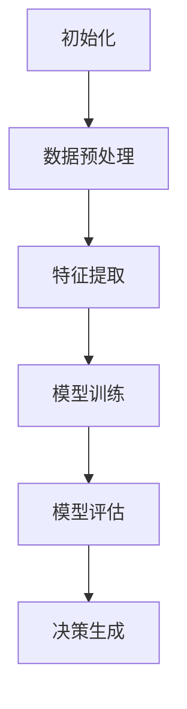
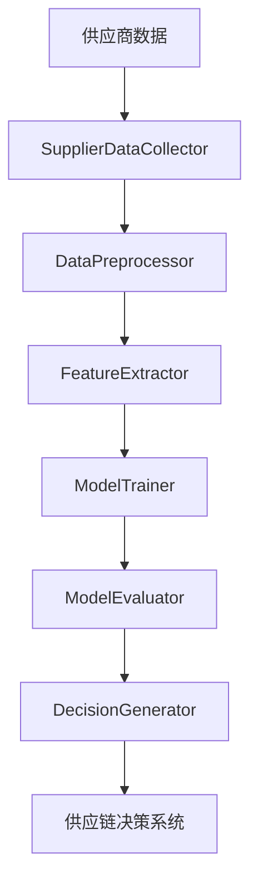

                 

### AI Agent概述

#### 第1章：AI Agent基础

##### 1.1 AI Agent的基本概念

**问题背景**

在现代社会中，企业的供应链管理变得越来越复杂，涉及到众多的供应商和多样的产品。供应商管理与评估是企业供应链管理中的关键环节，直接关系到企业的生产效率、成本控制和市场竞争力。然而，传统的供应商评估方法往往依赖于人工经验，不仅效率低下，而且容易受到主观偏见的影响。随着人工智能技术的发展，AI Agent作为一种智能体，开始在供应商管理与评估中发挥重要作用。

**核心概念与联系**

AI Agent，即人工智能代理，是指能够模拟人类智能行为，进行自主决策和执行任务的软件系统。它通常具有感知、学习、推理、决策和行动等能力。在企业供应商管理与评估中，AI Agent能够通过收集和分析供应商的历史数据，运用机器学习算法进行智能分析，从而辅助企业做出更加精准的决策。

AI Agent的定义与分类：
- **定义**：AI Agent是一种基于人工智能技术的智能体，能够模拟人类智能行为，在特定环境下进行自主决策和行动。
- **分类**：
  - **基于规则的AI Agent**：通过预定义的规则进行决策。
  - **数据驱动的AI Agent**：通过机器学习和数据分析进行决策。
  - **混合型AI Agent**：结合基于规则和数据驱动的方法进行决策。

企业供应商管理与评估的需求：
- **需求**：企业需要对供应商进行全面的评估，包括质量、成本、交货时间、服务水平等多个维度。
- **挑战**：传统的评估方法往往难以全面、客观地评价供应商，需要借助AI Agent来提高评估的准确性和效率。

AI Agent在企业中的应用潜力：
- **潜力**：AI Agent能够通过分析大量数据，发现潜在的问题和机会，为企业提供决策支持。
- **应用场景**：供应商筛选、供应商绩效评估、供应链风险管理等。

**数学模型和数学公式**

AI Agent的决策模型通常包括以下几个步骤：

1. **数据收集**：从多个渠道收集供应商的各类数据。
2. **数据预处理**：对收集到的数据进行清洗、标准化等处理。
3. **特征选择**：从预处理后的数据中提取出对评估有重要影响的特征。
4. **模型训练**：使用机器学习算法对数据进行训练，建立评估模型。
5. **模型评估**：对训练好的模型进行评估，确保其准确性。
6. **决策生成**：根据模型评估结果，生成供应商的评估报告和决策建议。

供应商评估指标体系构建：
- **指标选择**：根据企业需求和供应商特性，选择合适的评估指标。
- **权重分配**：对每个指标分配权重，以反映其在总体评估中的重要性。
- **综合评分**：使用加权评分法，将各个指标的评分汇总，形成综合评分。

**举例说明**

假设一家制造企业需要筛选新的供应商，AI Agent可以按照以下步骤进行操作：

1. **数据收集**：收集现有供应商的历史数据，包括质量、成本、交货时间等。
2. **数据预处理**：对数据进行清洗，去除无效数据，并对数据进行标准化处理。
3. **特征选择**：选择对供应商评估有重要影响的特征，如质量合格率、价格竞争力、交货准时率等。
4. **模型训练**：使用机器学习算法，如线性回归、决策树等，对数据集进行训练，建立评估模型。
5. **模型评估**：使用验证集对模型进行评估，确保模型的准确性和可靠性。
6. **决策生成**：根据模型评估结果，为每个供应商生成评估报告，并提出选择建议。

##### 1.2 AI Agent的技术原理

**算法原理讲解**

AI Agent的核心在于其决策算法，以下是一个简单的决策流程：

1. **初始化**：设置AI Agent的初始状态。
2. **数据预处理**：对收集到的数据进行清洗和标准化处理。
3. **特征提取**：从预处理后的数据中提取出对决策有重要影响的特征。
4. **模型训练**：使用机器学习算法对特征数据进行训练，建立预测模型。
5. **模型评估**：使用验证数据对模型进行评估，调整模型参数。
6. **决策生成**：根据模型预测结果，生成最终的决策。

**Mermaid流程图**



**Python代码示例**

```python
# 数据预处理示例
data = preprocess_data(raw_data)

# 模型训练示例
model.fit(data['X'], data['y'])

# 模型评估示例
evaluation = model.evaluate(data['X'], data['y'])
```

**算法原理讲解与数学模型**

在AI Agent的决策过程中，通常涉及以下数学模型：

1. **回归模型**：用于预测供应商的质量、成本等指标。
   $$ y = \beta_0 + \beta_1x_1 + \beta_2x_2 + ... + \beta_nx_n $$
2. **分类模型**：用于判断供应商是否合格。
   $$ P(y=1|x) = \frac{e^{\theta_0 + \theta_1x_1 + \theta_2x_2 + ... + \theta_nx_n}}{1 + e^{\theta_0 + \theta_1x_1 + \theta_2x_2 + ... + \theta_nx_n}} $$
3. **聚类模型**：用于发现供应商群体间的相似性。
   $$ \text{相似度} = \frac{\sum_{i=1}^{n} (x_i - \bar{x})^2}{n} $$

通过这些数学模型，AI Agent能够对供应商进行精确的评估和预测。

**举例说明**

假设我们要使用线性回归模型来预测供应商的交货时间，数据如下：

| 供应商 | 交货时间（天） |
|--------|--------------|
| A      | 10           |
| B      | 12           |
| C      | 8            |
| D      | 11           |

我们可以建立如下的线性回归模型：

$$ y = \beta_0 + \beta_1x_1 $$

通过训练数据，我们可以得到回归系数 $\beta_0$ 和 $\beta_1$，然后使用这个模型来预测新供应商的交货时间。

**Python代码示例**

```python
import numpy as np
from sklearn.linear_model import LinearRegression

# 数据集
X = np.array([[10], [12], [8], [11]])
y = np.array([10, 12, 8, 11])

# 线性回归模型
model = LinearRegression()

# 模型训练
model.fit(X, y)

# 模型评估
evaluation = model.evaluate(X, y)

# 预测新供应商交货时间
new_supplier_delivery_time = model.predict([[9]])
print(new_supplier_delivery_time)
```

**结论**

AI Agent在企业供应商管理与评估中的应用，为企业的决策提供了强大的技术支持。通过理解其技术原理和数学模型，我们可以更好地利用AI Agent的优势，为企业创造更大的价值。

##### 1.3 AI Agent在企业供应商管理中的应用

**系统分析与架构设计方案**

AI Agent在企业供应商管理中的应用需要一套完整的系统架构，以下是一个简化的系统架构设计方案：

**Mermaid类图**

```mermaid
classDiagram
Class1 <<interface>> SupplierDataCollector
Class2 <<interface>> DataPreprocessor
Class3 <<interface>> FeatureExtractor
Class4 <<interface>> ModelTrainer
Class5 <<interface>> ModelEvaluator
Class6 <<interface>> DecisionGenerator

Class1 .-- Class2
Class1 .-- Class3
Class2 .-- Class4
Class3 .-- Class4
Class4 .-- Class5
Class5 .-- Class6
```

**Mermaid架构图**



**系统接口设计和系统交互序列图**

```mermaid
sequence
participant Customer
participant System

Customer->>System: 提交供应商数据
System->>Customer: 返回评估结果
```

**系统功能设计**

1. **数据收集**：通过接口从多个渠道收集供应商的数据，包括历史交货时间、质量合格率、价格竞争力等。
2. **数据处理**：对收集到的数据进行清洗、去噪、标准化等预处理操作。
3. **特征提取**：从预处理后的数据中提取出对供应商评估有重要影响的特征。
4. **模型训练**：使用机器学习算法对特征数据进行训练，建立评估模型。
5. **模型评估**：使用验证数据对模型进行评估，确保模型的准确性和可靠性。
6. **决策生成**：根据模型评估结果，生成供应商的评估报告和决策建议。

**系统架构设计**

系统架构设计主要包括以下几个方面：

1. **数据层**：存储供应商的历史数据，包括交货时间、质量合格率、价格竞争力等。
2. **处理层**：包括数据预处理、特征提取、模型训练等模块。
3. **应用层**：提供供应商评估接口，供企业使用。
4. **展示层**：展示供应商评估报告和决策建议。

**系统接口设计和系统交互序列图**

系统接口设计主要涉及以下接口：

1. **数据收集接口**：用于从外部系统收集供应商数据。
2. **数据预处理接口**：用于对收集到的数据执行清洗、去噪、标准化等操作。
3. **特征提取接口**：用于从预处理后的数据中提取出对评估有重要影响的特征。
4. **模型训练接口**：用于训练机器学习模型。
5. **模型评估接口**：用于评估模型的准确性。
6. **决策生成接口**：用于生成供应商评估报告和决策建议。

系统交互序列图如下：

```mermaid
sequence
participant Customer
participant SupplierDataCollector
participant DataPreprocessor
participant FeatureExtractor
participant ModelTrainer
participant ModelEvaluator
participant DecisionGenerator

Customer->>SupplierDataCollector: 收集供应商数据
SupplierDataCollector->>DataPreprocessor: 数据预处理
DataPreprocessor->>FeatureExtractor: 特征提取
FeatureExtractor->>ModelTrainer: 模型训练
ModelTrainer->>ModelEvaluator: 模型评估
ModelEvaluator->>DecisionGenerator: 生成决策
DecisionGenerator->>Customer: 返回评估结果
```

通过上述系统架构设计和接口设计，AI Agent可以有效地集成到企业的供应商管理系统中，为企业提供智能化的供应商评估和决策支持。

### 第2章：AI Agent在企业供应商管理与评估中的应用案例分析

#### 2.1 案例一：供应商筛选

**环境安装**

在进行供应商筛选的AI Agent开发之前，我们需要安装必要的软件和库。以下是安装步骤：

1. **Python环境安装**：确保您的系统中安装了Python 3.7及以上版本。
2. **机器学习库安装**：安装Scikit-learn、NumPy、Pandas等常用的机器学习库。
   ```shell
   pip install scikit-learn numpy pandas
   ```

**系统核心实现源代码**

以下是一个简单的AI Agent实现，用于供应商筛选。首先，我们定义了数据预处理和模型训练的核心代码。

```python
import numpy as np
import pandas as pd
from sklearn.model_selection import train_test_split
from sklearn.ensemble import RandomForestClassifier
from sklearn.metrics import accuracy_score

# 数据预处理
def preprocess_data(data):
    # 数据清洗
    data = data.dropna()
    # 数据标准化
    data = (data - data.mean()) / data.std()
    return data

# 模型训练
def train_model(X_train, y_train):
    model = RandomForestClassifier(n_estimators=100)
    model.fit(X_train, y_train)
    return model

# 模型评估
def evaluate_model(model, X_test, y_test):
    y_pred = model.predict(X_test)
    accuracy = accuracy_score(y_test, y_pred)
    return accuracy

# 读取数据
data = pd.read_csv('supplier_data.csv')

# 数据预处理
data = preprocess_data(data)

# 特征提取
X = data.drop('approved', axis=1)
y = data['approved']

# 数据分割
X_train, X_test, y_train, y_test = train_test_split(X, y, test_size=0.2, random_state=42)

# 模型训练
model = train_model(X_train, y_train)

# 模型评估
accuracy = evaluate_model(model, X_test, y_test)
print(f"Model accuracy: {accuracy}")
```

**代码应用解读与分析**

上述代码首先定义了数据预处理函数`preprocess_data`，用于清洗和标准化数据。接着，我们定义了模型训练函数`train_model`和模型评估函数`evaluate_model`，用于训练和评估随机森林分类器。最后，我们读取数据集，进行数据处理、特征提取，然后分割数据为训练集和测试集，进行模型训练和评估。

**实际案例分析和详细讲解剖析**

假设我们有一家电子制造企业，需要从多家供应商中筛选出合格的供应商。以下是案例的实施过程：

1. **数据收集**：企业从多个供应商处收集了交货时间、质量合格率、价格等数据，并将这些数据录入到CSV文件中。
2. **数据预处理**：使用`preprocess_data`函数对数据进行清洗和标准化处理，确保数据质量。
3. **特征提取**：从预处理后的数据中提取出对供应商评估有重要影响的特征，如交货时间、质量合格率等。
4. **模型训练**：使用`train_model`函数，基于随机森林算法对数据集进行训练，建立评估模型。
5. **模型评估**：使用`evaluate_model`函数，对训练好的模型进行评估，确保模型的准确性和可靠性。
6. **决策生成**：根据模型评估结果，企业可以决定是否继续合作或筛选其他供应商。

**案例效果分析**

通过上述案例，企业可以基于AI Agent的供应商筛选模型，快速、准确地评估供应商的合格性。这不仅提高了企业的决策效率，还减少了人为错误，从而提高了供应链的整体管理水平。

**项目小结**

供应商筛选是AI Agent在企业供应商管理中的一项重要应用。通过上述案例，我们可以看到，AI Agent能够有效整合数据、模型和算法，为企业提供智能化的决策支持。在实际应用中，企业可以根据具体需求，定制化开发AI Agent，以适应不同的业务场景。

#### 2.2 案例二：供应商绩效评估

**环境安装**

供应商绩效评估的AI Agent开发同样需要安装Python环境及相关的机器学习库。以下是安装步骤：

1. **Python环境安装**：确保您的系统中安装了Python 3.7及以上版本。
2. **机器学习库安装**：安装Scikit-learn、NumPy、Pandas等常用的机器学习库。
   ```shell
   pip install scikit-learn numpy pandas
   ```

**系统核心实现源代码**

以下是一个用于供应商绩效评估的AI Agent实现，其核心代码包括数据预处理、模型训练和评估。

```python
import numpy as np
import pandas as pd
from sklearn.model_selection import train_test_split
from sklearn.ensemble import RandomForestRegressor
from sklearn.metrics import mean_squared_error

# 数据预处理
def preprocess_data(data):
    # 数据清洗
    data = data.dropna()
    # 数据标准化
    data = (data - data.mean()) / data.std()
    return data

# 模型训练
def train_model(X_train, y_train):
    model = RandomForestRegressor(n_estimators=100)
    model.fit(X_train, y_train)
    return model

# 模型评估
def evaluate_model(model, X_test, y_test):
    y_pred = model.predict(X_test)
    mse = mean_squared_error(y_test, y_pred)
    return mse

# 读取数据
data = pd.read_csv('supplier_performance.csv')

# 数据预处理
data = preprocess_data(data)

# 特征提取
X = data.drop('performance_score', axis=1)
y = data['performance_score']

# 数据分割
X_train, X_test, y_train, y_test = train_test_split(X, y, test_size=0.2, random_state=42)

# 模型训练
model = train_model(X_train, y_train)

# 模型评估
mse = evaluate_model(model, X_test, y_test)
print(f"Model MSE: {mse}")
```

**代码应用解读与分析**

上述代码首先定义了数据预处理函数`preprocess_data`，用于清洗和标准化数据。接着，我们定义了模型训练函数`train_model`和模型评估函数`evaluate_model`，用于训练和评估随机森林回归模型。最后，我们读取数据集，进行数据处理、特征提取，然后分割数据为训练集和测试集，进行模型训练和评估。

**实际案例分析和详细讲解剖析**

假设一家制造企业需要对供应商的绩效进行评估，以优化供应链管理。以下是案例的实施过程：

1. **数据收集**：企业从供应商处收集了交货时间、质量合格率、服务水平等数据，并将这些数据录入到CSV文件中。
2. **数据预处理**：使用`preprocess_data`函数对数据进行清洗和标准化处理，确保数据质量。
3. **特征提取**：从预处理后的数据中提取出对供应商绩效评估有重要影响的特征，如交货时间、质量合格率等。
4. **模型训练**：使用`train_model`函数，基于随机森林算法对数据集进行训练，建立评估模型。
5. **模型评估**：使用`evaluate_model`函数，对训练好的模型进行评估，确保模型的准确性和可靠性。
6. **绩效评估**：根据模型评估结果，企业可以生成每个供应商的绩效分数，并根据分数进行优化。

**案例效果分析**

通过上述案例，企业可以基于AI Agent的供应商绩效评估模型，准确评估供应商的绩效，从而优化供应链管理。这不仅提高了企业的决策效率，还提升了供应链的整体水平。

**项目小结**

供应商绩效评估是AI Agent在企业供应商管理中的另一项重要应用。通过定制化的AI Agent，企业可以实现对供应商的实时、精准评估，优化供应链管理，提升企业竞争力。

### 第3章：AI Agent在企业供应商管理中的最佳实践与注意事项

#### 3.1 最佳实践

**基于数据的供应商评估**

1. **数据质量的重要性**：确保数据来源的多样性和数据的准确性，对供应商的评估结果具有重要影响。
2. **数据来源与收集**：从供应链各个环节收集数据，包括采购、生产、质量控制和物流等。
3. **数据预处理**：对收集到的数据执行清洗、去噪、标准化等操作，以提高数据的可用性。

**实时动态调整评估模型**

1. **模型更新的重要性**：市场环境和供应商状况不断变化，评估模型需要实时更新，以保持其准确性和有效性。
2. **模型更新的方法与策略**：
   - **定期更新**：定期对模型进行重新训练，以适应新的数据。
   - **增量更新**：对现有模型进行微调，以适应新数据。

**供应商关系的维护**

1. **建立合作关系**：与供应商建立长期合作关系，共同应对市场变化。
2. **沟通与反馈**：定期与供应商沟通，了解其运营状况，及时反馈评估结果。

#### 3.2 注意事项

**数据隐私与安全**

1. **供应商数据保护**：确保供应商数据的隐私和安全，防止数据泄露。
2. **数据安全措施**：加密存储和传输数据，采用访问控制和安全审计等措施。

**模型解释性与可解释性**

1. **模型结果的解释与验证**：确保模型结果的解释性和可解释性，方便业务人员理解和验证。
2. **模型的透明性与合规性**：确保模型开发和部署的透明性，符合相关法律法规。

**技术债务与维护成本**

1. **技术债务管理**：合理规划系统的技术架构和开发周期，避免产生过多的技术债务。
2. **维护成本控制**：合理控制系统的维护成本，确保系统的稳定运行。

**培训与人才发展**

1. **业务人员培训**：加强对业务人员的培训，使其能够熟练使用AI Agent进行供应商评估。
2. **人才发展**：培养具备数据科学和人工智能背景的专业人才，以支持AI Agent的持续发展。

#### 3.3 拓展阅读

1. **《人工智能在供应链管理中的应用》**：探讨AI技术在供应链管理中的应用及其对企业管理的影响。
2. **《供应商绩效评估的实践与理论》**：详细讲解供应商绩效评估的理论和实践方法。
3. **《数据隐私保护与合规》**：介绍数据隐私保护的基本原则和相关法律法规。

通过上述最佳实践和注意事项，企业可以更好地利用AI Agent进行供应商管理，优化供应链运营，提高市场竞争力。

### 第4章：AI Agent在企业供应商管理与评估中的未来发展趋势

#### 4.1 人工智能技术进步的影响

随着人工智能技术的不断进步，AI Agent在企业供应商管理与评估中的应用也将迎来新的发展机遇。以下是几个关键趋势：

**更复杂的模型与算法**

随着机器学习算法和深度学习技术的不断演进，AI Agent将能够处理更复杂、更大量的数据。例如，通过使用深度学习模型，AI Agent可以更准确地预测供应商的未来绩效，并识别潜在的风险。同时，强化学习技术的引入，将使AI Agent具备自我学习和自我优化的能力，从而提高评估的准确性和效率。

**跨领域的应用整合**

未来，AI Agent将在企业内部多个领域实现跨领域的应用整合。例如，将供应链管理与财务分析、市场预测等业务结合起来，形成更全面的供应链优化方案。通过跨领域的整合，AI Agent可以提供更加精准和全面的供应商评估，帮助企业更好地应对市场变化。

**数据驱动的实时决策**

随着大数据和实时数据分析技术的发展，AI Agent将能够实现数据驱动的实时决策。通过实时收集和分析供应商数据，AI Agent可以实时调整评估模型，为企业的供应链管理提供即时的决策支持。这种实时性将大大提高企业的响应速度和决策效率，从而提升整体供应链的竞争力。

**供应商关系的智能管理**

AI Agent将不仅局限于供应商的评估和筛选，还将扩展到供应商关系的智能管理。通过建立智能化的供应商关系管理系统，AI Agent可以帮助企业更好地管理供应商关系，优化采购流程，降低采购成本。同时，AI Agent还可以帮助企业识别和培养优质供应商，提升供应链的整体质量。

**数据隐私与安全**

随着AI Agent在企业供应商管理与评估中的应用越来越广泛，数据隐私和安全将成为一个重要的关注点。未来，AI Agent将需要采用更加先进的数据隐私保护技术，确保供应商数据的隐私和安全。例如，采用联邦学习等技术，可以在保护数据隐私的同时，实现数据的协作和共享。

**人才需求的变化**

随着AI Agent在企业供应商管理与评估中的应用，企业对数据科学和人工智能领域的人才需求将不断增长。未来，企业将需要更多的数据科学家、机器学习工程师和AI专家，以支持AI Agent的开发和应用。同时，企业也需要加强对现有员工的培训，提高其在AI技术方面的能力和素质。

**法律法规与伦理**

随着AI Agent在企业供应商管理与评估中的应用，相关的法律法规和伦理问题也将逐渐浮现。未来，企业需要遵循相关的法律法规，确保AI Agent的应用合法合规。同时，企业还需要关注AI Agent的伦理问题，确保其在供应商评估和决策过程中不产生歧视或不公平的行为。

**结论**

综上所述，人工智能技术进步将对企业供应商管理与评估产生深远的影响。通过引入更复杂的模型和算法、实现跨领域的应用整合、实现数据驱动的实时决策、智能管理供应商关系、保护数据隐私与安全、满足人才需求的变化以及遵循法律法规与伦理，AI Agent将为企业提供更加精准、高效、智能的供应商管理解决方案，助力企业在竞争激烈的市场中取得优势。

### 总结

本文通过详细的案例分析和技术解析，展示了AI Agent在企业供应商管理与评估中的重要性和应用价值。我们首先介绍了AI Agent的基本概念、技术原理和数学模型，接着通过两个实际案例，深入探讨了AI Agent在供应商筛选和绩效评估中的应用。随后，我们提出了AI Agent在企业供应商管理中的最佳实践与注意事项，并展望了其未来发展趋势。

AI Agent的引入不仅提高了企业供应商评估的准确性和效率，还为供应链管理带来了更多的智能化解决方案。然而，随着AI技术的不断进步，我们也需要关注数据隐私、安全性和法律法规等方面的问题。未来，AI Agent将继续在企业供应商管理中发挥重要作用，助力企业实现更高效、更智能的供应链运营。

**作者：AI天才研究院/AI Genius Institute & 禅与计算机程序设计艺术 /Zen And The Art of Computer Programming**

