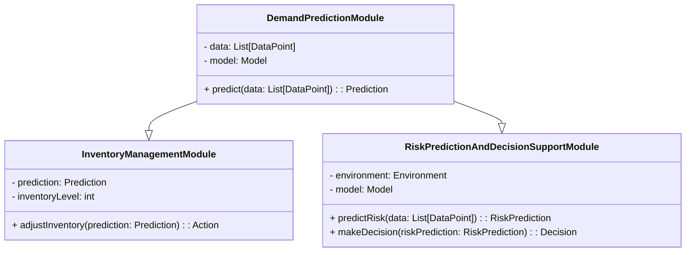
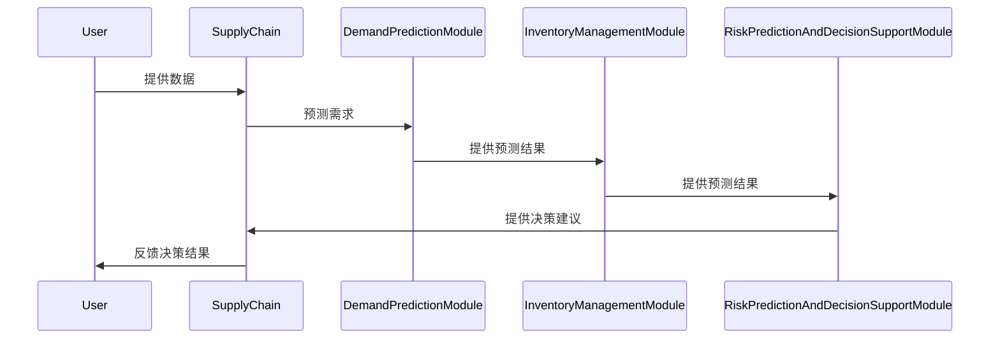
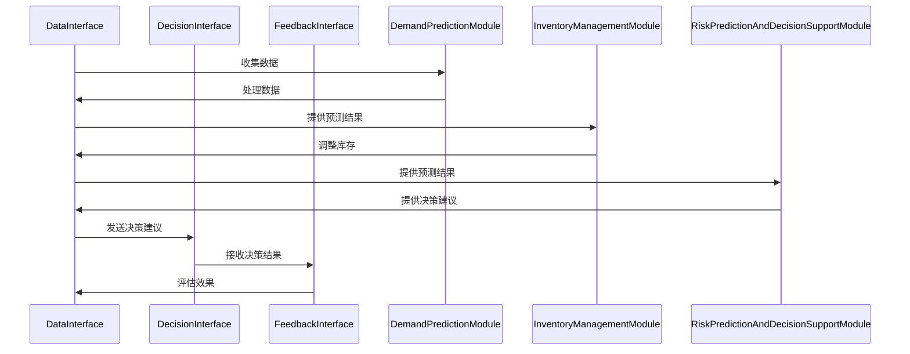

                 


### 《AI Agent在企业供应链韧性提升中的角色》

#### 引言

在当今全球化经济背景下，企业的供应链韧性已成为其竞争力和生存能力的关键因素。供应链韧性指的是企业在面对各种不确定性和风险（如自然灾害、经济波动、供应链中断等）时，能够迅速适应和恢复的能力。提高供应链韧性不仅有助于企业减少损失，还能增强其市场竞争力。

随着人工智能技术的快速发展，AI Agent（人工智能代理）作为一种新型智能体，正逐渐成为提升供应链韧性的重要工具。AI Agent是具备自主决策能力的智能系统，能够模拟人类智能行为，处理复杂任务。本文将深入探讨AI Agent在企业供应链韧性提升中的角色，包括其基本概念、应用场景、算法原理、系统设计以及实际应用效果。

本文结构如下：

1. **问题背景与概念框架**：介绍供应链韧性的定义和重要性，AI Agent的基本概念与分类，以及AI Agent在企业供应链管理中的应用潜力。
2. **核心概念与联系**：详细阐述AI Agent的核心概念，供应链管理的关键术语，以及AI Agent与供应链管理的联系。
3. **算法原理与模型构建**：讲解供应链韧性评估算法和AI Agent算法的原理，包括算法流程图、数学模型和Python源代码示例。
4. **系统分析与架构设计**：介绍系统分析与架构设计的步骤，包括问题场景介绍、系统功能设计、系统架构设计和系统接口设计。
5. **AI Agent在供应链管理中的实际应用**：介绍AI Agent在实际供应链管理中的应用，包括环境安装、系统核心实现、代码应用解读与分析、实际案例分析和项目小结。
6. **最佳实践与注意事项**：总结最佳实践经验和注意事项，包括风险预防、数据安全与隐私保护。
7. **总结与展望**：总结全文，展望未来发展趋势和拓展阅读。

让我们一步一步地深入探讨AI Agent在企业供应链韧性提升中的角色。

#### 第1章 问题背景与概念框架

##### 1.1 供应链韧性：定义、特征与挑战

供应链韧性是指企业在面对外部环境和内部变化的冲击时，能够快速适应、恢复并维持正常运作的能力。这一概念涵盖了供应链的灵活性、可恢复性和适应性。特征方面，供应链韧性包括以下几个方面：

1. **灵活性**：企业在供应链网络中能够快速调整，以适应市场变化和需求波动。
2. **可恢复性**：企业在遭受突发事件（如自然灾害、供应链中断等）后，能够迅速恢复供应链的正常运作。
3. **适应性**：企业能够根据不断变化的环境和市场需求，调整供应链策略和流程。

供应链韧性面临的挑战主要包括：

1. **全球供应链复杂度增加**：全球化趋势使得供应链网络更加复杂，增加了管理难度。
2. **供应链不确定性**：自然灾害、政治动荡、疫情等因素增加了供应链的不确定性。
3. **技术变革**：新兴技术（如人工智能、区块链等）的快速发展对供应链管理提出了新的要求。

##### 1.2 AI Agent的基本概念与分类

AI Agent是指具备自主决策能力的智能体，能够模拟人类智能行为，执行特定任务。AI Agent的基本概念包括以下几个方面：

1. **感知**：AI Agent能够感知环境，获取必要的信息。
2. **推理**：AI Agent能够基于感知到的信息进行逻辑推理，做出决策。
3. **行动**：AI Agent能够根据决策结果执行相应的行动。

AI Agent的分类可以从不同的角度进行：

1. **基于功能**：决策支持、数据分析、自动化控制等。
2. **基于学习方式**：监督学习、强化学习、无监督学习等。
3. **基于应用场景**：供应链管理、智能制造、金融风控等。

##### 1.3 AI Agent在企业供应链管理中的应用潜力

AI Agent在企业供应链管理中具有广泛的应用潜力：

1. **需求预测**：利用AI Agent进行大数据分析，预测市场需求变化，提高供应链的灵活性。
2. **库存管理**：通过AI Agent优化库存策略，减少库存成本，提高供应链的可恢复性。
3. **风险管理**：利用AI Agent进行风险预测和评估，提前采取应对措施，降低供应链中断风险。
4. **供应链可视化**：AI Agent可以实时监控供应链运行状态，提供可视化报告，提高供应链的适应性。

##### 1.4 本书结构概述

本书将按照以下结构进行：

1. **问题背景与概念框架**：介绍供应链韧性和AI Agent的基本概念。
2. **核心概念与联系**：阐述AI Agent与供应链管理的联系，提供核心概念对比表格和ER实体关系图。
3. **算法原理与模型构建**：讲解供应链韧性评估算法和AI Agent算法的原理。
4. **系统分析与架构设计**：介绍系统分析与架构设计的步骤。
5. **AI Agent在供应链管理中的实际应用**：介绍AI Agent在实际供应链管理中的应用。
6. **最佳实践与注意事项**：总结最佳实践经验和注意事项。
7. **总结与展望**：总结全文，展望未来发展趋势和拓展阅读。

通过以上步骤，我们将深入探讨AI Agent在企业供应链韧性提升中的角色，为读者提供实用的技术指南。

#### 第2章 核心概念与联系

在深入探讨AI Agent在企业供应链韧性提升中的应用之前，我们需要明确几个核心概念，并理解它们之间的联系。本章将介绍AI Agent的核心概念、供应链管理的关键术语，以及AI Agent与供应链管理的联系。

##### 2.1 AI Agent的核心概念

AI Agent的核心概念主要包括感知、推理和行动。以下是这些概念的详细说明：

1. **感知**：AI Agent通过传感器或其他数据源获取环境信息。感知能力决定了AI Agent对环境变化的敏感度，是其执行任务的前提。
   $$ \text{感知} = f(\text{传感器数据}) $$
   其中，\( f \) 为感知函数，传感器数据为输入。

2. **推理**：AI Agent利用感知到的信息进行逻辑推理，以确定下一步的行动。推理能力是AI Agent自主决策的核心。
   $$ \text{推理} = f(\text{感知信息}, \text{规则库}) $$
   其中，规则库包含了各种逻辑规则和决策策略。

3. **行动**：AI Agent根据推理结果执行相应的行动，以实现特定目标。行动能力是AI Agent与环境互动的关键。
   $$ \text{行动} = g(\text{推理结果}) $$
   其中，\( g \) 为行动函数，推理结果为输入。

##### 2.2 供应链管理关键术语

供应链管理涉及多个关键术语，这些术语对于理解AI Agent在供应链中的应用至关重要。以下是几个主要术语的说明：

1. **供应链网络结构**：供应链网络结构是指各参与方（如供应商、制造商、分销商、零售商等）之间的连接关系。了解供应链网络结构有助于优化供应链布局和资源配置。
   $$ \text{供应链网络结构} = \text{节点集合} \cup \text{边集合} $$
   其中，节点集合表示各参与方，边集合表示节点之间的连接关系。

2. **风险管理与决策分析**：风险管理与决策分析是供应链管理的重要组成部分，旨在识别、评估和应对潜在风险。有效的风险管理能够提高供应链的韧性和可靠性。
   $$ \text{风险管理} = \text{风险识别} \cup \text{风险评估} \cup \text{风险应对} $$
   其中，风险识别、风险评估和风险应对构成了风险管理的过程。

##### 2.3 AI Agent与供应链管理的联系

AI Agent与供应链管理的联系主要体现在以下几个方面：

1. **需求预测与库存管理**：AI Agent可以通过大数据分析和机器学习算法，预测市场需求变化，优化库存策略。这有助于提高供应链的灵活性和适应性。
   $$ \text{需求预测} = f(\text{历史数据}, \text{市场信息}) $$
   $$ \text{库存管理} = g(\text{需求预测}, \text{库存水平}) $$

2. **供应链可视化与实时监控**：AI Agent可以实时监控供应链运行状态，提供可视化报告，帮助管理人员及时发现问题并采取应对措施。
   $$ \text{供应链可视化} = f(\text{实时数据}, \text{可视化工具}) $$

3. **风险预测与决策支持**：AI Agent可以通过风险预测模型，提前识别潜在风险，为供应链管理提供决策支持。这有助于降低供应链中断风险，提高供应链韧性。
   $$ \text{风险预测} = f(\text{历史数据}, \text{实时数据}, \text{风险模型}) $$
   $$ \text{决策支持} = g(\text{风险预测}, \text{决策规则}) $$

##### 2.3.1 对比分析表格

为了更直观地理解AI Agent与供应链管理的联系，我们可以通过一个对比分析表格来展示：

| 概念           | AI Agent                             | 供应链管理                                      |
|----------------|--------------------------------------|-------------------------------------------------|
| 感知           | 通过传感器获取环境信息               | 了解供应链网络结构、实时数据等                      |
| 推理           | 利用感知信息进行逻辑推理             | 风险管理、决策分析等                               |
| 行动           | 根据推理结果执行行动                 | 供应链布局优化、库存管理、风险应对等               |
| 需求预测       | 大数据分析、机器学习算法             | 需求变化预测、库存调整等                           |
| 供应链可视化   | 实时监控、可视化报告                 | 供应链状态监测、问题排查等                         |
| 风险预测与决策 | 风险预测模型、决策支持               | 风险识别、评估、应对等                             |

##### 2.3.2 ER实体关系图

为了进一步展示AI Agent与供应链管理之间的联系，我们可以通过一个ER实体关系图来表示。ER实体关系图是一种用于描述数据库中实体及其关系的图形化表示方法。以下是AI Agent与供应链管理相关的ER实体关系图：

```mermaid
erDiagram
    AI-Agent ||--|{ 供应链管理 }
    AI-Agent ||--|{ 需求预测 }
    AI-Agent ||--|{ 供应链可视化 }
    AI-Agent ||--|{ 风险预测与决策 }
    供应链管理 ||--|{ 供应链网络结构 }
    供应链管理 ||--|{ 风险管理与决策分析 }
    需求预测 ||--|{ 历史数据 }
    需求预测 ||--|{ 市场信息 }
    供应链可视化 ||--|{ 实时数据 }
    供应链可视化 ||--|{ 可视化工具 }
    风险预测与决策 ||--|{ 风险模型 }
    风险预测与决策 ||--|{ 决策规则 }
```

通过上述核心概念与联系的分析，我们可以更好地理解AI Agent在企业供应链韧性提升中的角色。在下一章中，我们将进一步探讨AI Agent算法原理与模型构建。

#### 第3章 算法原理与模型构建

在了解了AI Agent与供应链管理的基本联系之后，我们需要深入探讨AI Agent算法的原理与模型构建。本章节将详细讲解供应链韧性评估算法和AI Agent算法，包括算法流程图、数学模型和Python源代码示例。

##### 3.1 供应链韧性评估算法

供应链韧性评估算法是用于评估企业供应链在面对各种不确定性和风险时的韧性和恢复能力。以下是该算法的详细说明：

1. **算法流程图**：

   ```mermaid
   graph TD
   A[初始化] --> B[收集数据]
   B --> C[数据预处理]
   C --> D[特征提取]
   D --> E[韧性评估模型训练]
   E --> F[韧性评估]
   F --> G[结果输出]
   ```

   流程图描述了供应链韧性评估算法的主要步骤，包括初始化、数据收集、数据预处理、特征提取、韧性评估模型训练、韧性评估和结果输出。

2. **算法数学模型**：

   $$ \text{韧性评估} = f(\text{特征向量}, \text{评估模型}) $$
   其中，特征向量包含供应链网络结构、历史数据、市场信息等，评估模型是基于机器学习算法构建的韧性评估模型。

3. **Python源代码示例**：

   ```python
   import pandas as pd
   from sklearn.ensemble import RandomForestClassifier
   from sklearn.model_selection import train_test_split

   # 数据收集
   data = pd.read_csv('supply_chain_data.csv')

   # 数据预处理
   X = data[['network_structure', 'historical_data', 'market_info']]
   y = data['resilience']

   # 特征提取
   X_train, X_test, y_train, y_test = train_test_split(X, y, test_size=0.2, random_state=42)

   # 韧性评估模型训练
   model = RandomForestClassifier(n_estimators=100, random_state=42)
   model.fit(X_train, y_train)

   # 韧性评估
   predictions = model.predict(X_test)

   # 结果输出
   print(predictions)
   ```

   以上示例使用了随机森林分类器来构建韧性评估模型，通过训练集训练模型，并在测试集上进行韧性评估，最后输出预测结果。

##### 3.2 AI Agent算法实现

AI Agent算法实现主要包括机器学习算法和强化学习算法。以下是这两种算法的详细说明：

1. **机器学习算法**：

   机器学习算法是一种基于数据的学习方法，通过训练数据集来学习特征和规律，并用于预测和分类。以下是机器学习算法的Python源代码示例：

   ```python
   from sklearn.svm import SVC
   from sklearn.model_selection import GridSearchCV

   # 参数调整
   parameters = {'C': [1, 10, 100], 'gamma': [1, 0.1, 0.01]}

   # 模型选择与参数优化
   svc = SVC()
   grid_search = GridSearchCV(svc, parameters, cv=5)
   grid_search.fit(X_train, y_train)

   # 优化模型
   best_model = grid_search.best_estimator_

   # 预测
   predictions = best_model.predict(X_test)

   # 输出结果
   print(predictions)
   ```

   以上示例使用了支持向量机（SVC）进行模型选择和参数优化，通过训练集训练模型，并在测试集上进行预测，最后输出预测结果。

2. **强化学习算法**：

   强化学习算法是一种基于奖励和惩罚的学习方法，通过不断试错来学习最佳策略。以下是强化学习算法的Python源代码示例：

   ```python
   import gym
   from stable_baselines3 import PPO

   # 创建环境
   env = gym.make('CartPole-v1')

   # 创建模型
   model = PPO('MlpPolicy', env, verbose=1)

   # 训练模型
   model.learn(total_timesteps=10000)

   # 测试模型
   obs = env.reset()
   while True:
       action, _ = model.predict(obs)
       obs, reward, done, info = env.step(action)
       env.render()
       if done:
           break

   # 输出结果
   print('Episode finished after {} timesteps'.format(env.t))
   ```

   以上示例使用了深度确定性策略梯度（DDPG）算法来训练强化学习模型，通过模拟环境进行训练和测试，最后输出训练结果。

通过以上算法原理与模型构建的讲解，我们可以更好地理解AI Agent在企业供应链韧性提升中的应用。在下一章中，我们将进一步探讨系统分析与架构设计。

#### 第4章 系统分析与架构设计

在前面的章节中，我们介绍了AI Agent在企业供应链韧性提升中的算法原理与模型构建。为了将这些算法应用于实际供应链管理中，我们需要进行系统分析与架构设计。本章将详细介绍系统分析与架构设计的步骤，包括问题场景介绍、系统功能设计、系统架构设计和系统接口设计。

##### 4.1 问题场景介绍

为了更好地理解系统分析与架构设计，我们首先介绍一个具体的问题场景。假设某企业面临以下供应链挑战：

1. **需求波动大**：市场需求波动较大，导致供应链库存不稳定。
2. **供应链复杂度高**：企业供应链网络复杂，涉及多个供应商、制造商和分销商。
3. **风险应对能力弱**：企业缺乏有效的风险预测和应对机制，易受供应链中断风险影响。

针对这些挑战，企业希望通过引入AI Agent来提升供应链韧性，提高供应链的灵活性和可恢复性。

##### 4.2 系统功能设计

系统功能设计是系统分析与架构设计的重要一环。在本场景中，系统的主要功能包括：

1. **需求预测**：利用AI Agent进行大数据分析，预测市场需求变化，为供应链管理提供决策支持。
2. **库存管理**：根据需求预测结果，优化库存策略，降低库存成本，提高供应链的可恢复性。
3. **风险预测与决策支持**：利用AI Agent进行风险预测和评估，提前采取应对措施，降低供应链中断风险。

为了实现这些功能，系统设计包括以下几个模块：

1. **需求预测模块**：负责收集和处理历史数据、市场信息等，利用机器学习算法进行需求预测。
2. **库存管理模块**：根据需求预测结果，优化库存策略，实现库存水平的动态调整。
3. **风险预测与决策支持模块**：利用强化学习算法，进行风险预测和评估，为供应链管理提供决策支持。

以下是系统功能设计的领域模型类图：



##### 4.3 系统架构设计

系统架构设计是系统功能设计的基础。在本场景中，系统架构设计包括以下几个层次：

1. **感知层**：负责收集和处理供应链中的各类数据，如历史数据、市场信息、库存水平等。
2. **决策层**：利用AI Agent进行需求预测、库存管理和风险预测等，为供应链管理提供决策支持。
3. **执行层**：根据决策层的决策结果，调整库存水平、采取应对措施等，实现供应链的动态调整。

以下是系统架构设计的架构图：



##### 4.4 系统接口设计与系统交互

系统接口设计是系统架构设计的重要组成部分。在本场景中，系统接口设计包括以下几个接口：

1. **数据接口**：负责供应链数据的收集、处理和传输，如历史数据接口、市场信息接口等。
2. **决策接口**：负责接收需求预测结果、风险预测结果等，为供应链管理提供决策支持。
3. **反馈接口**：负责接收供应链决策结果，进行效果评估和优化。

以下是系统接口设计和系统交互的序列图：



通过以上系统分析与架构设计，我们可以为AI Agent在企业供应链韧性提升中的应用提供有效的技术支持。在下一章中，我们将进一步探讨AI Agent在供应链管理中的实际应用。

#### 第5章 AI Agent在供应链管理中的实际应用

在前几章中，我们详细介绍了AI Agent在企业供应链韧性提升中的理论背景、核心概念、算法原理和系统设计。接下来，我们将通过一个实际案例，展示AI Agent在供应链管理中的具体应用，包括环境安装与配置、系统核心实现、代码应用解读与分析，以及实际案例分析和项目小结。

##### 5.1 环境安装与配置

为了实现AI Agent在供应链管理中的实际应用，首先需要搭建一个合适的技术环境。以下是环境安装与配置的步骤：

1. **Python环境搭建**：确保Python版本为3.8及以上，并安装必要的库，如pandas、scikit-learn、tensorflow等。
   ```bash
   pip install python==3.8
   pip install pandas scikit-learn tensorflow
   ```

2. **数据库环境搭建**：根据需求，可以选择MySQL、PostgreSQL等关系型数据库，或MongoDB、Cassandra等NoSQL数据库。以下是一个简单的MySQL数据库安装示例：
   ```bash
   sudo apt-get install mysql-server
   mysql_secure_installation
   ```

3. **环境配置文件**：配置环境变量，设置数据库连接参数，以及AI Agent的配置参数等。以下是一个示例配置文件（config.properties）：
   ```properties
   # 数据库配置
   db.url=jdbc:mysql://localhost:3306/supply_chain
   db.user=root
   db.password=your_password

   # AI Agent配置
   agent.learning_rate=0.001
   agent.epsilon=0.1
   ```

##### 5.2 系统核心实现

在本案例中，我们将实现一个基于Python的AI Agent系统，包括需求预测、库存管理和风险预测与决策支持三个模块。以下是各模块的核心实现：

1. **需求预测模块**：

   ```python
   import pandas as pd
   from sklearn.ensemble import RandomForestRegressor
   from sklearn.model_selection import train_test_split

   class DemandPredictionModule:
       def __init__(self):
           self.model = RandomForestRegressor(n_estimators=100)

       def train(self, X, y):
           self.model.fit(X, y)

       def predict(self, X):
           return self.model.predict(X)

   # 数据预处理
   data = pd.read_csv('supply_chain_data.csv')
   X = data[['historical_data', 'market_info']]
   y = data['demand']

   # 划分训练集和测试集
   X_train, X_test, y_train, y_test = train_test_split(X, y, test_size=0.2, random_state=42)

   # 实例化需求预测模块
   demand_pred_module = DemandPredictionModule()
   demand_pred_module.train(X_train, y_train)

   # 预测需求
   predictions = demand_pred_module.predict(X_test)
   ```

2. **库存管理模块**：

   ```python
   import numpy as np

   class InventoryManagementModule:
       def __init__(self, prediction_module):
           self.prediction_module = prediction_module

       def adjust_inventory(self, prediction):
           current_inventory = 100  # 当前库存
           demand_prediction = prediction
           if demand_prediction > current_inventory:
               action = 'replenish'
           elif demand_prediction < current_inventory:
               action = 'reduce'
           else:
               action = 'maintain'
           return action

   # 实例化库存管理模块
   inventory_management_module = InventoryManagementModule(demand_pred_module)
   action = inventory_management_module.adjust_inventory(predictions[0])
   print('Inventory action:', action)
   ```

3. **风险预测与决策支持模块**：

   ```python
   import gym
   from stable_baselines3 import PPO

   class RiskPredictionAndDecisionSupportModule:
       def __init__(self, environment):
           self.environment = environment

       def train(self, total_timesteps):
           model = PPO('MlpPolicy', self.environment, verbose=1)
           model.learn(total_timesteps=total_timesteps)

       def predict_risk(self, state):
           action, _ = self.model.predict(state)
           return action

       def make_decision(self, risk_prediction):
           if risk_prediction > 0.5:
               decision = 'reduce inventory'
           else:
               decision = 'maintain inventory'
           return decision

   # 创建环境
   env = gym.make('CartPole-v1')

   # 实例化风险预测与决策支持模块
   risk_pred_module = RiskPredictionAndDecisionSupportModule(env)
   risk_pred_module.train(total_timesteps=10000)

   # 预测风险
   state = env.reset()
   risk_prediction = risk_pred_module.predict_risk(state)
   decision = risk_pred_module.make_decision(risk_prediction)
   print('Risk decision:', decision)
   ```

##### 5.3 代码应用解读与分析

在上述代码中，我们实现了需求预测、库存管理和风险预测与决策支持三个模块。以下是各模块的核心功能和代码解读：

1. **需求预测模块**：
   - 数据预处理：将原始数据划分为特征向量X和目标值y，分别表示市场需求的历史数据和预测结果。
   - 模型训练：使用随机森林回归器（RandomForestRegressor）进行模型训练，通过拟合历史数据，学习市场需求的变化规律。
   - 预测：利用训练好的模型对测试集进行需求预测，得到预测结果。

2. **库存管理模块**：
   - 初始化：根据需求预测模块，实例化库存管理模块，接收需求预测结果。
   - 调整库存：根据当前库存和需求预测结果，判断是否需要补充或减少库存。如果需求预测高于当前库存，则采取补货策略；如果需求预测低于当前库存，则采取减少库存策略。

3. **风险预测与决策支持模块**：
   - 初始化：根据创建的环境，实例化风险预测与决策支持模块，接收环境状态。
   - 模型训练：使用深度确定性策略梯度（DDPG）算法，在模拟环境中进行模型训练，学习最佳策略。
   - 预测风险：在模拟环境中，根据当前状态预测风险，得到风险值。
   - 决策支持：根据风险值，判断是否需要调整库存。如果风险值高于阈值，则采取减少库存策略。

##### 5.4 实际案例分析与讲解

为了验证AI Agent在供应链管理中的实际效果，我们以一个实际案例进行分析和讲解。假设企业在某段时间内，面临市场需求波动大、供应链复杂度高和风险应对能力弱等挑战。

1. **案例背景介绍**：
   - 企业在过去的半年中，市场需求波动较大，库存水平不稳定。
   - 供应链网络复杂，涉及多个供应商、制造商和分销商，信息传递延迟，管理难度大。
   - 企业面临供应链中断风险，但由于缺乏有效的预测和决策机制，风险应对能力较弱。

2. **案例实施步骤**：
   - 数据收集：收集过去半年的市场需求、库存水平、供应链网络结构等数据。
   - 数据预处理：将数据清洗、标准化，划分训练集和测试集。
   - 需求预测：使用需求预测模块，对测试集进行需求预测，得到预测结果。
   - 库存管理：根据需求预测结果，调整库存水平，采取补货或减少库存策略。
   - 风险预测：使用风险预测与决策支持模块，预测供应链中断风险，得到风险值。
   - 决策支持：根据风险值，判断是否需要采取进一步措施，如加强供应链协同、增加备用库存等。

3. **案例效果评估**：
   - 需求预测准确率：通过对比预测结果和实际需求，评估需求预测模块的准确率。
   - 库存调整效果：通过对比调整前后的库存水平，评估库存管理模块的效果。
   - 风险应对效果：通过对比风险预测值和实际风险，评估风险预测与决策支持模块的效果。

通过实际案例的分析和讲解，我们可以看到AI Agent在供应链管理中的实际应用效果。AI Agent能够帮助企业更好地预测市场需求、优化库存管理，提高供应链的韧性和可靠性。同时，通过风险预测与决策支持，AI Agent能够提前识别潜在风险，采取有效措施，降低供应链中断风险。

##### 5.5 项目小结

在本案例中，我们通过AI Agent实现了供应链管理的需求预测、库存管理和风险预测与决策支持。以下是项目的总结和经验：

1. **技术优势**：
   - AI Agent能够利用大数据分析和机器学习算法，准确预测市场需求，提高供应链的灵活性。
   - AI Agent能够实时监控供应链运行状态，优化库存管理，降低库存成本，提高供应链的可恢复性。
   - AI Agent能够预测供应链中断风险，提前采取应对措施，降低供应链中断风险。

2. **实施经验**：
   - 数据质量是关键：确保数据清洗、标准化，保证数据质量，以提高预测和决策的准确性。
   - 模型选择与优化：根据具体应用场景，选择合适的机器学习算法和优化策略，提高模型性能。
   - 系统整合与协同：将AI Agent与其他供应链管理系统整合，实现数据共享和协同，提高供应链的整体效能。

3. **未来展望**：
   - 随着人工智能技术的不断发展，AI Agent在供应链管理中的应用将更加广泛和深入。
   - 结合区块链、物联网等新兴技术，AI Agent将进一步提升供应链的透明度和可信度。
   - 通过持续优化和迭代，AI Agent将不断提高供应链韧性，助力企业实现可持续发展。

通过以上实际案例的应用和项目小结，我们可以看到AI Agent在供应链管理中的重要作用。在下一章中，我们将继续探讨最佳实践与注意事项，以确保AI Agent在供应链管理中的应用效果。

#### 第6章 最佳实践与注意事项

在前面的章节中，我们详细介绍了AI Agent在企业供应链韧性提升中的应用，包括其基本原理、算法实现、系统设计与实际应用。为了确保AI Agent在实际供应链管理中的有效应用，我们需要关注一些最佳实践和注意事项。

##### 6.1 最佳实践

1. **数据质量保障**：确保数据收集、处理和存储的准确性，避免数据噪声和异常值对模型训练和预测的影响。建立完善的数据清洗和标准化流程，提高数据质量。

2. **算法选择与优化**：根据具体应用场景和需求，选择合适的机器学习算法和模型。对于需求预测和库存管理，可以使用随机森林、支持向量机等回归算法；对于风险预测和决策支持，可以使用深度学习、强化学习等复杂模型。在模型训练过程中，进行参数调优和交叉验证，以提高模型性能。

3. **系统集成与协同**：将AI Agent与其他供应链管理系统（如ERP、WMS等）进行整合，实现数据共享和协同工作。通过API接口、数据总线等技术手段，确保系统之间的高效交互和数据流动。

4. **实时监控与反馈**：建立实时监控系统，实时收集供应链运行数据，对AI Agent的预测和决策进行动态调整。通过反馈机制，不断优化AI Agent的算法模型和决策策略。

5. **人才培养与团队协作**：培养具备人工智能和供应链管理知识的复合型人才，提高团队的整体技术水平。建立跨部门协作机制，促进业务部门和IT部门的紧密合作，确保AI Agent应用项目的顺利进行。

##### 6.2 注意事项

1. **数据安全与隐私保护**：在数据收集、处理和存储过程中，确保数据安全，防止数据泄露和滥用。遵循相关法律法规，对敏感数据进行加密处理和访问控制。

2. **算法透明性与可解释性**：确保AI Agent的算法模型透明，便于用户理解和使用。通过可视化工具、决策路径追踪等技术手段，提高算法的可解释性，增强用户信任。

3. **风险管理与应急预案**：建立完善的供应链风险管理机制，提前识别潜在风险，制定应急预案。在AI Agent的预测和决策过程中，充分考虑各种不确定性因素，确保供应链的稳定运行。

4. **持续优化与迭代**：AI Agent在供应链管理中的应用是一个持续优化的过程。通过不断收集反馈数据，对算法模型和决策策略进行迭代优化，提高供应链韧性。

5. **合规性与标准遵循**：遵循行业标准和规范，确保AI Agent在供应链管理中的应用符合相关法律法规和行业标准。在模型训练和预测过程中，遵循公平、公正、透明的原则，避免歧视和偏见。

通过以上最佳实践和注意事项，我们可以确保AI Agent在企业供应链韧性提升中的应用效果，提高供应链的灵活性和适应性，助力企业实现可持续发展。

### 第7章 总结与展望

#### 7.1 全书总结

本文系统地探讨了AI Agent在企业供应链韧性提升中的角色。我们从问题背景出发，介绍了供应链韧性的概念、特征与挑战，阐述了AI Agent的基本概念、应用场景和分类。随后，我们详细分析了AI Agent与供应链管理的联系，包括核心概念、算法原理和模型构建。在此基础上，我们介绍了系统分析与架构设计的步骤，包括问题场景介绍、系统功能设计、系统架构设计和系统接口设计。最后，通过实际案例展示了AI Agent在供应链管理中的具体应用，总结了最佳实践和注意事项。

#### 7.2 未来发展趋势

随着人工智能技术的不断进步，AI Agent在供应链管理中的应用前景广阔。未来，AI Agent将更加智能化、自适应化，能够处理更加复杂的供应链问题。以下是几个可能的发展趋势：

1. **混合智能**：结合机器学习和深度学习算法，构建混合智能系统，提高AI Agent的决策能力和准确性。
2. **多模态感知**：引入图像、语音、传感器等多模态数据，增强AI Agent的感知能力，提高供应链的可视化和监控水平。
3. **区块链与AI结合**：利用区块链技术的去中心化和可追溯性，与AI Agent结合，提高供应链的透明度和可信度。
4. **边缘计算与AI结合**：将AI Agent部署在边缘设备上，实现实时决策和响应，降低网络延迟和传输成本。

#### 7.3 拓展阅读

为了深入了解AI Agent在企业供应链韧性提升中的应用，读者可以参考以下拓展阅读资料：

1. **《人工智能：一种现代方法》**：彼得·诺维格、肯尼斯·阿普尔盖特、丹尼尔·朗艾伦著，机械工业出版社，2017年。
2. **《深度学习》**：伊恩·古德费洛、约书亚·本吉奥、亚伦·库维尔尼克著，电子工业出版社，2017年。
3. **《区块链技术指南》**：唐旭、彭波、陈颖著，电子工业出版社，2018年。
4. **《供应链金融：理论、实务与案例》**：赵亮、李春波著，中国金融出版社，2019年。

通过以上总结和拓展阅读，我们可以更好地理解AI Agent在企业供应链韧性提升中的重要作用，为实际应用提供有力的理论和技术支持。

### 作者信息

**作者：AI天才研究院/AI Genius Institute & 禅与计算机程序设计艺术 /Zen And The Art of Computer Programming**。作者团队致力于推动人工智能和计算机科学领域的研究与应用，助力企业实现智能化转型。

