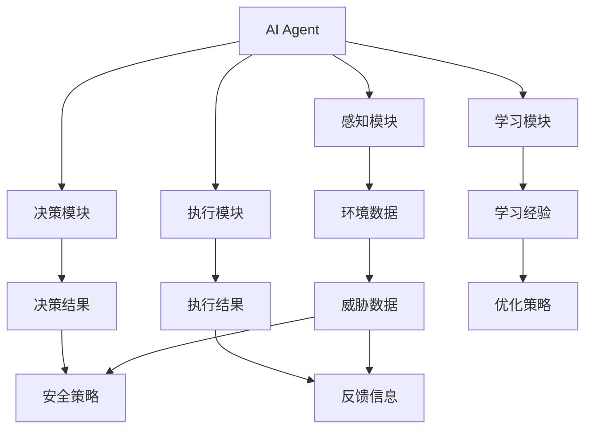
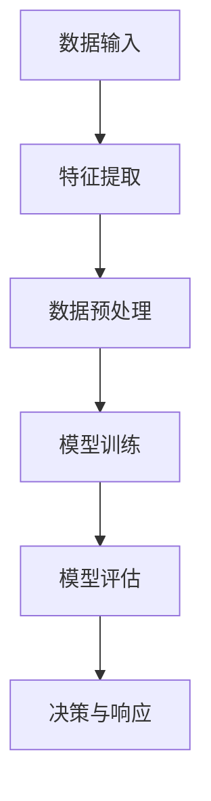
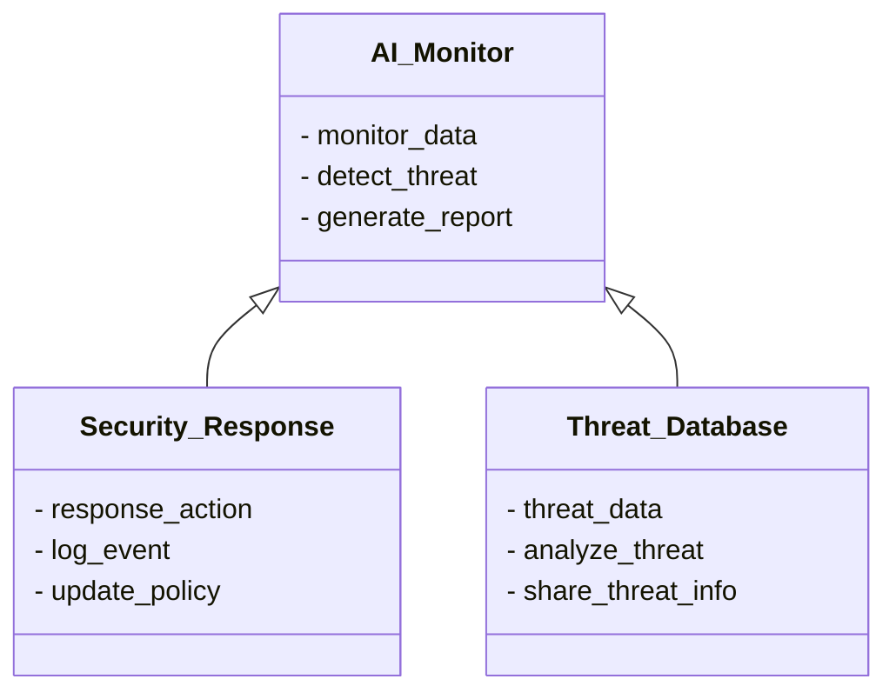
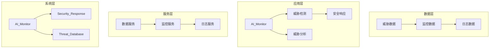
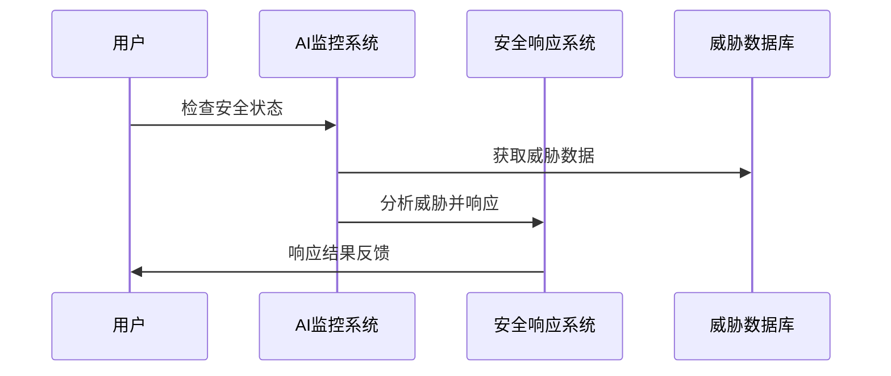

                 

### 第一部分：引言与背景

#### 第1章：企业信息安全威胁概述

在当今数字化时代，企业信息安全面临着前所未有的挑战。随着云计算、大数据、物联网等新兴技术的广泛应用，企业面临的信息安全威胁变得日益复杂和多变。信息安全威胁不仅包括传统的恶意软件、网络攻击，还包括高级持续性威胁（APT）、数据泄露、供应链攻击等新型威胁。这些威胁的频率和影响范围都在不断增大，给企业的业务连续性、数据安全和客户信任带来了巨大风险。

**1.1 信息安全威胁的定义与分类**

信息安全威胁是指任何试图破坏、泄露、篡改或拒绝服务的恶意行为，旨在损害企业信息系统的完整性、可用性和保密性。根据威胁的来源和特点，可以将信息安全威胁分为以下几类：

- **内部威胁**：由企业内部员工或合作伙伴的恶意行为引起的威胁，如数据泄露、恶意软件等。
- **外部威胁**：由外部攻击者发起的威胁，包括黑客攻击、病毒和恶意软件、钓鱼攻击等。
- **物理威胁**：由于物理设备损坏、自然灾害等因素导致的信息泄露或数据丢失。
- **网络威胁**：通过互联网进行的网络攻击，如分布式拒绝服务（DDoS）攻击、入侵尝试等。
- **供应链威胁**：通过供应链环节中的第三方供应商、合作伙伴等渠道进行的攻击。

**1.2 企业面临的主要信息安全威胁**

企业面临的常见信息安全威胁包括：

- **数据泄露**：企业敏感数据被未经授权的访问或泄露，可能导致客户信息、商业机密等泄露。
- **恶意软件攻击**：包括病毒、木马、勒索软件等，这些恶意软件可以通过网络入侵企业系统，破坏数据或要求赎金。
- **网络钓鱼**：通过伪装成合法机构发送钓鱼邮件，诱骗用户点击恶意链接或泄露敏感信息。
- **高级持续性威胁（APT）**：一种隐蔽性极强、针对性极明确的网络攻击，通常潜伏数月甚至数年，目的是窃取敏感数据或进行长期监控。
- **供应链攻击**：攻击者通过第三方供应商或合作伙伴的供应链环节，对企业进行攻击。

**1.3 AI Agent在信息安全中的应用潜力**

随着人工智能技术的发展，AI Agent在信息安全领域的应用前景广阔。AI Agent具有以下几方面的应用潜力：

- **威胁检测与预测**：AI Agent可以通过学习海量数据，实时检测和预测潜在的安全威胁，提高检测效率和准确性。
- **自动化响应**：AI Agent可以自动化执行安全策略，快速响应安全事件，减少人工干预和响应时间。
- **威胁情报分析**：AI Agent可以自动收集、分析和处理威胁情报，提供实时、准确的威胁分析报告。
- **个性化安全防护**：AI Agent可以根据企业的特定需求和风险状况，提供定制化的安全防护方案。

**1.4 本章小结**

本章对企业信息安全威胁进行了概述，介绍了信息安全威胁的定义与分类，以及企业面临的主要信息安全威胁。同时，探讨了AI Agent在信息安全中的应用潜力，为后续章节的深入探讨奠定了基础。

---

**关键词**：企业信息安全、信息安全威胁、AI Agent、威胁检测、自动化响应、威胁情报

**摘要**：本文首先概述了企业信息安全面临的威胁种类和主要挑战，然后探讨了AI Agent在信息安全中的潜在应用，包括威胁检测与预测、自动化响应和威胁情报分析等方面。为深入理解AI Agent在企业信息安全中的实际应用，文章将分为几个部分进行详细探讨。**[文章标题]**《AI Agent在企业信息安全威胁检测与响应中的前沿应用》

---

### 第二部分：AI Agent的基础理论

#### 第2章：AI Agent的基本概念与架构

在探讨AI Agent在企业信息安全中的应用之前，有必要对AI Agent的基本概念和架构进行深入理解。AI Agent，即人工智能代理，是一种能够自主决策、执行任务并与其他系统交互的智能实体。AI Agent的核心优势在于其自主性和适应性，能够在复杂环境中执行复杂的任务。

**2.1 AI Agent的定义与特点**

AI Agent通常定义为一种具有以下特点的智能实体：

- **自主性**：AI Agent可以自主执行任务，无需人工干预。
- **适应性**：AI Agent能够根据环境变化和任务需求，自主调整行为和策略。
- **交互性**：AI Agent可以与人类或其他系统进行有效交互，收集信息、执行任务和反馈结果。

AI Agent的核心在于其自主决策能力，这通常依赖于机器学习和深度学习算法，使得AI Agent能够通过学习历史数据和模式，实现智能化的任务执行。

**2.2 AI Agent的组成架构**

AI Agent通常由以下几个关键组成部分构成：

- **感知模块**：感知模块负责收集外部环境的信息，包括文本、图像、音频等多媒体数据。
- **决策模块**：决策模块基于感知模块收集到的信息，利用机器学习算法进行决策，选择最优行动方案。
- **执行模块**：执行模块负责执行决策模块生成的行动方案，将决策转化为具体操作。
- **学习模块**：学习模块负责从执行结果中学习经验，不断优化决策和执行策略。

**2.3 AI Agent的运作机制**

AI Agent的运作机制可以分为以下几个步骤：

1. **感知**：AI Agent通过感知模块收集环境中的信息。
2. **决策**：基于感知模块收集到的信息，AI Agent的决策模块使用机器学习算法进行分析和推理，生成行动方案。
3. **执行**：执行模块将决策模块生成的行动方案付诸实施，如发送邮件、修改数据库等。
4. **反馈**：执行结果通过感知模块反馈给AI Agent，学习模块根据反馈信息进行学习和优化。

**2.4 本章小结**

本章介绍了AI Agent的基本概念和架构，详细阐述了AI Agent的定义、特点、组成架构和运作机制。通过理解AI Agent的基本原理，可以为后续章节探讨AI Agent在企业信息安全中的应用提供理论基础。

---

**关键词**：AI Agent、定义、特点、架构、感知模块、决策模块、执行模块、学习模块

**摘要**：本章深入探讨了AI Agent的定义与特点，详细描述了AI Agent的组成架构和运作机制。AI Agent作为一种具有自主性、适应性和交互性的智能实体，其核心在于自主决策能力，依赖于机器学习和深度学习算法。通过感知、决策、执行和反馈的循环机制，AI Agent能够在复杂环境中高效执行任务，为后续章节探讨其在企业信息安全中的应用奠定了基础。

---

### 第三部分：AI Agent的核心技术

#### 第3章：AI Agent的核心技术

AI Agent在信息安全领域的应用离不开其核心技术的支撑。核心技术主要包括监测与检测技术、响应与处理技术以及威胁情报与技术分析。以下将对这些核心技术进行详细探讨。

**3.1 监测与检测技术**

监测与检测技术是AI Agent识别和检测安全威胁的关键。以下为相关技术的详细描述：

**3.1.1 特征提取**

特征提取是监测与检测技术的第一步，目的是从数据中提取出具有代表性的特征。特征提取的质量直接影响检测的准确性。常用的特征提取方法包括：

- **统计特征**：如平均值、方差、熵等。
- **结构特征**：如网络流量模式、通信协议特征等。
- **深度特征**：通过深度学习模型提取高层次的特征，如卷积神经网络（CNN）提取图像特征。

**3.1.2 模式识别**

模式识别是基于特征提取的结果，对数据中的异常模式进行识别。常用的模式识别方法包括：

- **机器学习分类算法**：如支持向量机（SVM）、决策树、随机森林等。
- **聚类算法**：如K-means、层次聚类等，用于发现数据中的异常点。
- **异常检测算法**：如孤立森林（Isolation Forest）、局部异常因子（LOF）等，专门用于检测数据中的异常模式。

**3.1.3 监测算法**

监测算法负责将特征提取和模式识别结合起来，实现实时监测和威胁检测。常用的监测算法包括：

- **基于规则的监测**：通过预定义规则，检测符合规则的数据。
- **基于统计学的监测**：使用统计学方法，如假设检验，检测数据中的异常。
- **基于机器学习的监测**：使用机器学习模型，如神经网络、随机森林等，自动检测数据中的异常。

**3.2 响应与处理技术**

响应与处理技术是AI Agent在发现安全威胁后的应对措施，目的是快速、有效地处理威胁，减少损失。以下为相关技术的详细描述：

**3.2.1 自动化响应策略**

自动化响应策略是指通过预定义规则和机器学习模型，自动执行安全响应措施。自动化响应策略的关键包括：

- **响应规则定义**：定义哪些情况下触发哪些响应措施。
- **响应动作执行**：根据响应规则，自动执行相应的操作，如封锁IP、隔离设备等。

**3.2.2 机器学习在响应中的应用**

机器学习在响应中的应用主要包括：

- **自适应响应策略**：通过学习威胁特征和响应效果，自动调整响应策略。
- **预测性响应**：通过预测潜在威胁，提前采取预防措施。

**3.2.3 AI Agent的响应流程**

AI Agent的响应流程通常包括以下几个步骤：

1. **威胁检测**：AI Agent通过监测与检测技术识别潜在的安全威胁。
2. **威胁评估**：对检测到的威胁进行风险评估，确定响应的优先级。
3. **响应执行**：根据预定义的响应策略，自动执行相应的响应措施。
4. **结果反馈**：对响应结果进行反馈和记录，为后续改进提供数据支持。

**3.3 威胁情报与技术分析**

威胁情报与技术分析是AI Agent识别和应对高级持续性威胁（APT）的重要手段。以下为相关技术的详细描述：

**3.3.1 威胁情报的概念与收集**

威胁情报是指关于安全威胁的收集、分析和共享的信息。威胁情报的收集包括：

- **内部数据**：从企业内部日志、监控数据中提取威胁信息。
- **外部数据**：从公共威胁情报平台、行业报告等获取威胁信息。

**3.3.2 威胁分析的方法与工具**

威胁分析的方法和工具包括：

- **可视化分析**：通过数据可视化技术，展示威胁的分布、变化趋势等。
- **关联分析**：通过分析威胁之间的关联关系，发现潜在的威胁链。
- **机器学习分析**：使用机器学习算法，发现威胁的异常模式和规律。

**3.3.3 威胁情报的利用**

威胁情报的利用包括：

- **威胁预测**：通过威胁情报，预测潜在的威胁，提前采取预防措施。
- **威胁应对**：根据威胁情报，制定和调整安全策略，提高应对能力。

**3.4 本章小结**

本章详细介绍了AI Agent在信息安全中的核心技术，包括监测与检测技术、响应与处理技术以及威胁情报与技术分析。这些技术共同构成了AI Agent在企业信息安全中的能力，为有效应对复杂多变的安全威胁提供了有力支持。

---

**关键词**：AI Agent、监测与检测技术、特征提取、模式识别、监测算法、自动化响应策略、机器学习在响应中的应用、AI Agent的响应流程、威胁情报、技术分析、可视化分析、关联分析、机器学习分析

**摘要**：本章深入探讨了AI Agent在信息安全中的核心技术，包括监测与检测技术、响应与处理技术以及威胁情报与技术分析。监测与检测技术通过特征提取和模式识别实现威胁检测，响应与处理技术通过自动化响应策略和机器学习技术提高应对效率，威胁情报与技术分析则通过收集、分析和利用威胁情报，为企业提供更全面的安全防护。这些技术共同构建了AI Agent在企业信息安全中的强大能力。

---

### 第四部分：AI Agent在企业信息安全中的具体应用

#### 第4章：AI Agent在企业网络中的检测与响应

企业网络是企业信息系统的核心组成部分，网络安全是企业信息安全的重要保障。随着网络威胁的不断演变和复杂化，AI Agent在网络安全检测与响应中的应用变得越来越重要。本章将探讨AI Agent在企业网络中的具体应用，包括网络检测、网络安全事件响应等。

**4.1 企业网络环境介绍**

企业网络环境通常由多个子网组成，包括办公网络、生产网络、数据中心等。每个网络区域都承担着不同的业务需求，同时也面临着不同的安全风险。以下是企业网络环境的一些基本组成部分：

- **边界防护**：包括防火墙、入侵检测系统（IDS）、入侵防御系统（IPS）等，用于保护网络边界的安全。
- **内部网络**：用于企业内部各部门之间的通信，包括有线网络和无线网络。
- **数据中心**：用于存储和运行企业的关键业务系统，包括服务器、存储设备、网络设备等。
- **终端设备**：包括员工的计算机、手机、平板等，这些设备是企业网络的重要入口。

**4.2 AI Agent在网络安全检测中的应用**

AI Agent在网络安全检测中的应用主要体现在以下几个方面：

**4.2.1 入侵检测系统（IDS）**

入侵检测系统（IDS）是一种被动监测网络安全威胁的设备，它通过分析网络流量和系统日志，识别潜在的入侵行为。AI Agent可以增强IDS的功能，实现以下目标：

- **异常检测**：通过机器学习算法，识别网络流量和系统行为中的异常模式。
- **攻击特征识别**：利用历史数据和学习到的攻击模式，识别新的攻击手段。
- **自动化告警**：当检测到异常或攻击行为时，自动生成告警信息，通知安全团队。

**4.2.2 网络流量分析**

网络流量分析是AI Agent在网络安全检测中的另一重要应用。网络流量分析可以提供以下信息：

- **流量模式**：分析网络流量的分布、流量类型和流量模式，发现异常流量。
- **数据包分析**：对网络数据包进行深度分析，识别潜在的安全威胁。
- **流量异常检测**：通过机器学习算法，识别网络流量中的异常行为，如DDoS攻击、数据泄露等。

**4.2.3 安全事件响应**

安全事件响应是指企业在发现安全威胁后，采取的一系列应对措施。AI Agent可以自动化安全事件响应，提高响应效率和准确性。具体包括：

- **威胁隔离**：当检测到恶意流量或入侵行为时，自动隔离相关网络设备或IP地址，防止威胁扩散。
- **攻击溯源**：通过分析网络流量和日志，追踪攻击源，为后续的攻击分析提供数据支持。
- **威胁消除**：根据威胁的类型和级别，采取相应的措施，如关闭恶意服务、删除恶意软件等。

**4.3 AI Agent在网络威胁响应中的实践**

AI Agent在网络威胁响应中的实践主要包括以下几个步骤：

**4.3.1 响应策略设计**

响应策略设计是网络威胁响应的基础，包括以下内容：

- **威胁分类**：根据威胁的类型和影响程度，对威胁进行分类。
- **响应策略**：定义针对不同类型威胁的响应措施，如封锁IP、隔离设备、清除恶意软件等。
- **响应流程**：定义响应的步骤和顺序，确保响应措施的执行。

**4.3.2 实战案例分析**

以下是一个AI Agent在网络威胁响应中的实战案例分析：

**案例背景**：某企业网络突然出现大量的DDoS攻击，导致网络访问严重受阻。

**响应过程**：

1. **威胁检测**：AI Agent通过监测网络流量，发现异常流量并触发告警。
2. **威胁评估**：AI Agent对检测到的威胁进行评估，确定攻击的类型和级别。
3. **自动响应**：AI Agent根据预定义的响应策略，自动执行以下措施：
   - **流量隔离**：自动隔离受攻击的IP地址，防止攻击流量影响其他网络设备。
   - **访问控制**：调整防火墙规则，限制攻击源的访问。
   - **流量清洗**：使用DDoS防护设备，清洗恶意流量，恢复正常网络访问。

4. **结果反馈**：AI Agent记录响应结果，并将信息反馈给安全团队，以便进一步分析。

**4.4 本章小结**

本章详细探讨了AI Agent在企业网络中的检测与响应应用。AI Agent通过增强入侵检测、网络流量分析和安全事件响应，为企业提供了更强大的网络安全防护能力。通过实战案例分析，展示了AI Agent在实际网络威胁响应中的高效性和准确性。

---

**关键词**：AI Agent、企业网络、入侵检测系统（IDS）、网络流量分析、安全事件响应、威胁隔离、攻击溯源、威胁消除、响应策略设计、实战案例分析

**摘要**：本章详细探讨了AI Agent在企业网络中的检测与响应应用。AI Agent通过增强入侵检测、网络流量分析和安全事件响应，为企业提供了更强大的网络安全防护能力。通过实战案例分析，展示了AI Agent在实际网络威胁响应中的高效性和准确性。本章为理解AI Agent在企业信息安全中的具体应用提供了有力支持。

---

### 第5章：AI Agent在企业系统安全中的应用

随着企业对信息技术依赖程度的增加，系统安全成为企业信息安全的重要方面。AI Agent在系统安全中的应用，能够显著提升企业的安全防护能力。本章将探讨AI Agent在系统安全中的具体应用，包括系统漏洞检测和系统安全响应。

**5.1 企业系统安全概述**

企业系统安全是指确保企业内部IT系统不受恶意攻击、数据泄露、系统崩溃等威胁的能力。企业系统安全包括以下几个方面：

- **操作系统安全**：确保操作系统和应用软件的补丁更新，防范恶意软件和攻击。
- **网络设备安全**：确保路由器、交换机等网络设备的安全配置和管理。
- **数据库安全**：确保数据库系统的访问控制、数据备份和恢复机制。
- **应用软件安全**：确保企业内部应用的代码质量和安全防护措施。

**5.2 AI Agent在系统漏洞检测中的应用**

系统漏洞检测是系统安全的关键环节。AI Agent在系统漏洞检测中的应用主要体现在以下几个方面：

**5.2.1 漏洞扫描**

漏洞扫描是发现系统漏洞的重要手段。AI Agent可以自动化执行漏洞扫描，提高扫描的效率和准确性。AI Agent的漏洞扫描过程包括：

- **资产识别**：识别企业内部的操作系统、网络设备、应用软件等资产。
- **漏洞库比对**：将资产与漏洞库进行比对，发现潜在的漏洞。
- **漏洞验证**：对识别到的漏洞进行验证，确认漏洞的存在和严重程度。

**5.2.2 漏洞预测与预警**

AI Agent可以通过机器学习算法，预测潜在的漏洞，并提前发出预警。漏洞预测与预警的关键在于：

- **数据收集**：收集企业历史漏洞数据，包括漏洞的来源、影响范围、修复时间等。
- **模式识别**：利用机器学习模型，识别漏洞的潜在模式，预测未来的漏洞。
- **预警机制**：当预测到潜在漏洞时，自动生成预警信息，通知安全团队采取预防措施。

**5.2.3 漏洞修复建议**

AI Agent可以根据漏洞的严重程度和影响范围，提供漏洞修复建议。漏洞修复建议包括：

- **修复方案**：根据漏洞的严重性，提供不同的修复方案，如紧急修复、延迟修复等。
- **修复优先级**：根据漏洞的影响范围和风险程度，确定修复的优先级。
- **修复步骤**：提供详细的修复步骤，帮助安全团队快速修复漏洞。

**5.3 AI Agent在系统安全响应中的应用**

系统安全响应是企业在发现安全威胁后，采取的一系列应对措施。AI Agent在系统安全响应中的应用，能够提高响应效率和准确性。以下为AI Agent在系统安全响应中的具体应用：

**5.3.1 自动化修复与隔离**

自动化修复与隔离是AI Agent在系统安全响应中的关键应用。具体措施包括：

- **自动化修复**：当检测到系统漏洞时，AI Agent可以自动执行修复脚本，关闭漏洞端口或禁用相关服务。
- **自动隔离**：将受感染的系统或网络设备自动隔离，防止威胁扩散。

**5.3.2 实战案例分析**

以下是一个AI Agent在系统安全响应中的实战案例分析：

**案例背景**：某企业发现其内部服务器感染了勒索软件，导致关键业务系统无法正常运行。

**响应过程**：

1. **威胁检测**：AI Agent通过实时监控，发现服务器感染了勒索软件并触发告警。
2. **威胁评估**：AI Agent对勒索软件进行分析，评估其影响范围和风险程度。
3. **自动响应**：
   - **隔离感染源**：AI Agent自动隔离受感染的设备，防止勒索软件扩散。
   - **数据备份**：AI Agent自动备份受感染服务器上的关键数据，以防止数据丢失。
   - **修复漏洞**：AI Agent根据漏洞库，自动修复感染源上的漏洞，防止勒索软件再次感染。
4. **结果反馈**：AI Agent记录响应结果，并将信息反馈给安全团队，以便进一步分析和改进。

**5.4 本章小结**

本章详细探讨了AI Agent在企业系统安全中的应用，包括系统漏洞检测和系统安全响应。AI Agent通过自动化漏洞扫描、漏洞预测与预警、自动化修复与隔离等手段，提高了系统安全防护能力。实战案例分析展示了AI Agent在实际系统安全响应中的高效性和准确性，为企业提供了有力的安全保障。

---

**关键词**：AI Agent、企业系统安全、漏洞扫描、漏洞预测与预警、漏洞修复建议、自动化修复与隔离、系统安全响应、实战案例分析

**摘要**：本章深入探讨了AI Agent在企业系统安全中的应用，包括漏洞检测和系统安全响应。AI Agent通过自动化漏洞扫描、漏洞预测与预警、自动化修复与隔离等手段，显著提高了系统安全防护能力。实战案例分析展示了AI Agent在实际系统安全响应中的高效性和准确性，为企业提供了有力的安全保障。

---

### 第6章：AI Agent在数据安全中的应用

在当今数字化时代，数据安全成为企业信息安全的核心关注点。随着数据量的不断增加和数据泄露事件的频繁发生，企业需要强大的技术手段来保护其敏感数据。AI Agent在数据安全中的应用，可以大幅提升数据保护能力。本章将探讨AI Agent在数据安全中的具体应用，包括数据安全检测和数据安全响应。

**6.1 数据安全的重要性**

数据安全是指保护企业敏感数据免受未经授权的访问、泄露、篡改和破坏。数据安全的重要性体现在以下几个方面：

- **合规要求**：许多行业和地区都有严格的法律法规，要求企业保护客户数据和个人信息，如欧盟的通用数据保护条例（GDPR）和美国的加州消费者隐私法案（CCPA）。
- **商业机密保护**：企业的商业机密是企业的核心竞争力，数据泄露可能导致商业损失和竞争劣势。
- **客户信任**：客户对企业的信任基于对企业数据保护能力的信任，数据泄露事件会严重损害客户信任。
- **品牌声誉**：数据泄露事件会对企业的品牌声誉造成长期负面影响，影响企业的市场地位和客户忠诚度。

**6.2 AI Agent在数据安全检测中的应用**

AI Agent在数据安全检测中的应用主要包括以下几个方面：

**6.2.1 数据隐私保护**

数据隐私保护是数据安全的核心任务之一。AI Agent可以通过以下方式实现数据隐私保护：

- **数据匿名化**：使用数据脱敏技术，将敏感数据转换为匿名化数据，保护数据隐私。
- **访问控制**：通过AI Agent，实施精细的访问控制策略，确保只有授权用户可以访问敏感数据。
- **数据审计**：AI Agent可以实时监控数据访问和使用情况，记录和审计数据操作，及时发现异常行为。

**6.2.2 数据泄露检测**

数据泄露检测是发现潜在数据泄露风险的关键步骤。AI Agent可以通过以下方法实现数据泄露检测：

- **异常检测**：利用机器学习算法，分析数据访问和使用模式，发现异常行为，如频繁的访问敏感数据、数据传输量异常等。
- **数据标签与监测**：为敏感数据打上标签，AI Agent可以监测敏感数据的访问和使用情况，当数据出现异常时，自动触发告警。
- **实时监控**：AI Agent可以实时监控数据流动，识别潜在的数据泄露风险，并采取措施阻止数据泄露。

**6.2.3 数据访问控制**

数据访问控制是保护数据安全的重要手段。AI Agent可以通过以下方式实现数据访问控制：

- **身份验证与授权**：AI Agent可以集成身份验证和授权机制，确保只有经过身份验证且被授权的用户可以访问敏感数据。
- **访问策略管理**：AI Agent可以根据用户角色、权限和访问需求，动态调整数据访问策略，确保数据访问的合规性。
- **数据加密**：AI Agent可以自动加密敏感数据，防止未授权访问和泄露。

**6.3 AI Agent在数据安全响应中的应用**

AI Agent在数据安全响应中的应用主要体现在以下几个方面：

**6.3.1 数据加密与解密**

数据加密与解密是保护数据安全的关键技术。AI Agent可以通过以下方式实现数据加密与解密：

- **自动加密**：AI Agent可以自动加密敏感数据，防止数据在传输和存储过程中被窃取。
- **智能解密**：AI Agent可以根据访问控制策略，自动解密用户请求访问的敏感数据，确保数据的安全使用。
- **加密算法优化**：AI Agent可以根据数据类型和访问频率，选择合适的加密算法，提高加密和解密效率。

**6.3.2 数据备份与恢复**

数据备份与恢复是数据安全的重要组成部分。AI Agent可以通过以下方式实现数据备份与恢复：

- **自动备份**：AI Agent可以自动备份敏感数据，确保数据在发生意外事件时可以恢复。
- **增量备份**：AI Agent可以实时监控数据变化，仅备份更新部分，提高备份效率。
- **快速恢复**：AI Agent可以在数据泄露或系统故障时，快速恢复数据，确保业务连续性。

**6.3.3 实战案例分析**

以下是一个AI Agent在数据安全响应中的实战案例分析：

**案例背景**：某企业发现其数据库中的客户信息可能被未授权访问。

**响应过程**：

1. **威胁检测**：AI Agent通过实时监控，发现数据库访问异常并触发告警。
2. **威胁评估**：AI Agent对异常访问行为进行分析，评估数据泄露的风险。
3. **响应措施**：
   - **加密数据**：AI Agent自动加密数据库中的敏感数据，防止数据泄露。
   - **隔离访问**：AI Agent限制未授权访问，确保数据安全。
   - **备份数据**：AI Agent自动备份受影响的数据，防止数据丢失。
4. **结果反馈**：AI Agent记录响应结果，并将信息反馈给安全团队，以便进一步分析和改进。

**6.4 本章小结**

本章详细探讨了AI Agent在数据安全中的应用，包括数据安全检测和数据安全响应。AI Agent通过数据隐私保护、数据泄露检测、数据访问控制等技术手段，提高了数据安全防护能力。实战案例分析展示了AI Agent在实际数据安全响应中的高效性和准确性，为企业提供了强有力的数据安全保护。

---

**关键词**：AI Agent、数据安全、数据隐私保护、数据泄露检测、数据访问控制、数据加密与解密、数据备份与恢复、实战案例分析

**摘要**：本章深入探讨了AI Agent在数据安全中的应用，包括数据隐私保护、数据泄露检测和数据访问控制等。AI Agent通过数据加密与解密、数据备份与恢复等技术手段，提高了数据安全防护能力。实战案例分析展示了AI Agent在实际数据安全响应中的高效性和准确性，为企业提供了强有力的数据安全保护。

---

### 第7章：AI Agent在企业信息安全管理中的应用

在数字化转型的背景下，企业信息安全管理的复杂性和重要性日益增加。AI Agent作为人工智能领域的先进技术，其在企业信息安全管理中的应用，不仅能够提高安全管理的效率和准确性，还能为企业提供更加智能化的安全防护。本章将探讨AI Agent在企业信息安全管理中的应用，包括安全管理体系的构建、安全管理中的AI Agent作用以及安全应急响应等。

**7.1 企业信息安全管理体系概述**

企业信息安全管理体系（ISMS）是指企业为了保障信息安全而建立的一套管理系统。它包括政策制定、风险管理、安全控制、安全监控、安全审计等多个方面。一个完善的信息安全管理体系能够帮助企业识别、评估、控制和缓解各种信息安全风险。以下是企业信息安全管理体系的主要组成部分：

- **信息安全政策**：企业制定的信息安全方针和目标，为整个信息安全管理提供指导。
- **信息安全组织**：负责实施和监督信息安全策略和措施的部门或团队。
- **信息安全风险评估**：对企业信息资产进行风险评估，确定潜在的安全威胁和风险。
- **安全控制措施**：实施各种安全控制措施，如访问控制、数据加密、网络安全等，以保护信息资产。
- **安全监控与审计**：实时监控企业的信息安全状况，进行定期审计，确保安全控制措施得到有效执行。

**7.2 AI Agent在安全管理中的作用**

AI Agent在企业信息安全管理中扮演着重要角色，其主要作用体现在以下几个方面：

**7.2.1 安全策略自动生成**

AI Agent可以通过分析企业历史安全事件和操作数据，自动生成安全策略。这些策略可以根据企业的特定需求和安全威胁的变化进行动态调整，从而提高安全策略的适应性和有效性。

**7.2.2 安全监控与审计**

AI Agent可以实时监控企业的网络流量、系统日志、用户行为等数据，发现潜在的安全威胁和异常行为。同时，AI Agent还可以自动审计安全控制措施的执行情况，确保安全策略得到有效执行。

**7.2.3 安全事件关联与追踪**

AI Agent可以通过分析不同来源的安全事件数据，发现事件之间的关联关系，帮助安全团队快速定位和追踪安全事件，提高事件响应的效率。

**7.3 AI Agent在安全应急响应中的应用**

安全应急响应是企业在发现安全事件后，采取的一系列紧急措施，以减轻事件的影响并恢复正常的业务运行。AI Agent在安全应急响应中的应用主要体现在以下几个方面：

**7.3.1 响应计划与执行**

AI Agent可以自动生成和调整安全应急响应计划，根据安全事件的类型和严重程度，制定相应的响应策略。AI Agent可以自动化执行这些响应计划，减少人工干预，提高响应速度。

**7.3.2 威胁情报共享与整合**

AI Agent可以收集和分析来自不同来源的威胁情报，整合为统一的安全视图，为企业提供全面、实时的威胁信息。这些威胁情报可以用于威胁预测、风险评估和应急响应。

**7.3.3 实战案例分析**

以下是一个AI Agent在安全应急响应中的实战案例分析：

**案例背景**：某企业发现其内部网络被高级持续性威胁（APT）攻击，攻击者试图窃取敏感数据。

**响应过程**：

1. **威胁检测**：AI Agent通过实时监控，发现异常网络流量和系统行为，触发告警。
2. **威胁评估**：AI Agent对检测到的威胁进行分析，评估攻击的类型、目标和潜在影响。
3. **自动响应**：
   - **封锁攻击IP**：AI Agent自动封锁攻击者的IP地址，防止攻击继续扩散。
   - **隔离受感染系统**：AI Agent将受感染的系统自动隔离，防止攻击者进一步渗透。
   - **数据备份**：AI Agent自动备份关键数据，防止数据丢失。
4. **结果反馈**：AI Agent记录响应结果，并将信息反馈给安全团队，以便进行进一步分析。

**7.4 本章小结**

本章详细探讨了AI Agent在企业信息安全管理中的应用，包括安全管理体系的构建、安全管理中的AI Agent作用以及安全应急响应。AI Agent通过自动化安全策略生成、安全监控与审计、安全事件关联与追踪等功能，显著提高了企业信息安全管理的能力。实战案例分析展示了AI Agent在实际安全应急响应中的高效性和准确性，为企业提供了强大的安全防护。

---

**关键词**：AI Agent、企业信息安全管理体系、安全策略自动生成、安全监控与审计、安全事件关联与追踪、安全应急响应、威胁情报共享与整合、实战案例分析

**摘要**：本章深入探讨了AI Agent在企业信息安全管理中的应用，包括安全管理体系的构建、安全管理中的AI Agent作用以及安全应急响应。AI Agent通过自动化安全策略生成、安全监控与审计、安全事件关联与追踪等功能，显著提高了企业信息安全管理的能力。实战案例分析展示了AI Agent在实际安全应急响应中的高效性和准确性，为企业提供了强大的安全防护。

---

### 第8章：AI Agent在企业信息安全威胁检测与响应中的总结与展望

随着数字化时代的到来，企业信息安全面临着前所未有的挑战。AI Agent作为人工智能领域的先进技术，其在企业信息安全威胁检测与响应中的应用展示出了巨大的潜力和优势。本章将对AI Agent在企业信息安全威胁检测与响应中的应用进行总结，并展望其未来的发展趋势和应用前景。

**8.1 AI Agent在企业信息安全中的优势与挑战**

AI Agent在企业信息安全中的优势主要体现在以下几个方面：

- **自动化威胁检测与响应**：AI Agent可以通过自动化技术，实时检测和响应安全威胁，提高检测和响应的效率。
- **智能分析能力**：AI Agent利用机器学习和深度学习算法，能够智能分析大量数据，识别潜在的安全威胁，提高检测准确性。
- **自适应与灵活性**：AI Agent可以根据企业的特定需求和威胁环境，自适应调整安全策略和响应措施，提高安全防护的灵活性。

然而，AI Agent在企业信息安全中也面临一些挑战：

- **数据隐私与合规**：AI Agent在处理和分析企业数据时，需要确保数据隐私和合规性，避免数据泄露和违规行为。
- **算法偏见与安全性**：AI Agent的算法可能存在偏见，影响其检测和响应的准确性，同时算法本身也可能成为攻击的目标。
- **实施与维护成本**：部署和维护AI Agent系统需要较高的技术能力和资金投入，对于一些中小企业可能存在一定的挑战。

**8.2 未来发展趋势与应用前景**

未来，AI Agent在企业信息安全中的应用前景广阔，以下是几个主要的发展趋势：

- **智能化安全威胁检测**：随着AI技术的进步，AI Agent将能够更加智能地检测和预测安全威胁，包括未知和复杂的安全威胁。
- **自适应安全策略**：AI Agent将能够根据实时威胁环境和企业需求，自动调整和优化安全策略，实现自适应安全防护。
- **威胁情报共享与合作**：企业间的威胁情报共享和合作将成为趋势，AI Agent将在这个过程中发挥重要作用，提高整个行业的威胁响应能力。
- **集成化安全管理平台**：AI Agent将与企业现有的信息安全管理系统集成，形成一个统一、高效的安全管理平台，提高整体安全防护能力。

**8.3 结论与建议**

综上所述，AI Agent在企业信息安全威胁检测与响应中具有显著的优势，同时也面临一定的挑战。为了充分利用AI Agent的优势，企业应采取以下措施：

- **加强数据治理与合规**：确保AI Agent处理的数据符合相关法律法规，加强数据安全和隐私保护。
- **提升算法透明性与可解释性**：增强AI Agent算法的透明性和可解释性，减少算法偏见和误解。
- **投资人才培养与技术创新**：加大对AI技术在信息安全领域的投资，培养相关技术人才，推动技术创新和应用。
- **加强与行业合作伙伴的协作**：积极参与行业威胁情报共享与合作，提高整体安全防护水平。

**8.4 本章小结**

本章总结了AI Agent在企业信息安全威胁检测与响应中的应用，分析了其优势与挑战，展望了未来的发展趋势和应用前景。通过结论与建议，为企业充分利用AI Agent的优势提供了指导，为推动企业信息安全的发展提供了有力支持。

---

**关键词**：AI Agent、企业信息安全、自动化检测、智能分析、自适应安全策略、数据隐私、算法偏见、集成化安全管理平台、威胁情报共享、结论与建议

**摘要**：本章总结了AI Agent在企业信息安全威胁检测与响应中的应用，分析了其优势与挑战，展望了未来的发展趋势和应用前景。通过结论与建议，为企业充分利用AI Agent的优势提供了指导，为推动企业信息安全的发展提供了有力支持。未来，AI Agent将继续在自动化威胁检测、自适应安全策略和威胁情报共享等方面发挥关键作用，为企业的信息安全提供更强有力的保障。

---

### 作者信息

**作者：AI天才研究院/AI Genius Institute & 禅与计算机程序设计艺术 /Zen And The Art of Computer Programming**

感谢您阅读本文，希望您在AI Agent在企业信息安全中的应用方面有了更深入的理解。如果您对本文有任何疑问或建议，欢迎在评论区留言。我们将持续关注并分享更多有关AI和企业信息安全的优质内容。祝您在技术领域取得更多成就！**[文章标题]**《AI Agent在企业信息安全威胁检测与响应中的前沿应用》

---

通过上述文章的撰写，我们详细介绍了AI Agent在企业信息安全威胁检测与响应中的前沿应用。文章从企业信息安全威胁的背景介绍开始，逐步深入探讨了AI Agent的基本概念、核心技术，以及在不同层面的具体应用。通过实例分析和总结，文章展示了AI Agent在提升企业信息安全防护能力方面的优势和挑战，并对未来发展趋势提出了展望。

**核心概念与联系**

AI Agent是一种具有自主性、适应性、交互性的智能实体，通过感知、决策、执行和学习四个模块实现自主决策和任务执行。其核心技术包括监测与检测技术、响应与处理技术、威胁情报与技术分析。AI Agent在企业信息安全中的应用主要包括网络安全检测、系统安全防护、数据安全保护以及安全管理与应急响应。

**核心概念属性特征对比表格**

| 特征                 | AI Agent                    | 传统安全解决方案               |
|----------------------|----------------------------|--------------------------------|
| 自主性               | 自主决策，无需人工干预       | 需人工判断和执行               |
| 适应性               | 自适应调整安全策略           | 固定安全策略，难以动态调整       |
| 交互性               | 与其他系统有效交互           | 依赖人工交互，缺乏智能化       |
| 监测与检测           | 实时监测和威胁检测           | 定期扫描和手动检测             |
| 响应与处理           | 自动化安全响应措施           | 手动执行安全响应措施           |
| 威胁情报与技术分析   | 自动收集、分析威胁情报       | 人工收集和解读威胁情报         |

**ER实体关系图架构的Mermaid流程图**



**算法原理讲解**

AI Agent的算法原理主要依赖于机器学习和深度学习技术。以下为监测与检测技术中的特征提取和模式识别的算法原理：

**1. 特征提取**

特征提取是监测与检测技术的第一步，目的是从原始数据中提取出具有代表性的特征。常用的特征提取方法包括：

- **统计特征提取**：如平均值、方差、熵等。$$\text{方差} = \frac{1}{n}\sum_{i=1}^{n}(x_i - \bar{x})^2$$

- **结构特征提取**：如网络流量模式、通信协议特征等。使用深度学习模型（如卷积神经网络CNN）提取图像特征。

- **深度特征提取**：通过深度学习模型提取高层次的特征，如卷积神经网络（CNN）提取图像特征。

**2. 模式识别**

模式识别是基于特征提取的结果，对数据中的异常模式进行识别。常用的模式识别方法包括：

- **机器学习分类算法**：如支持向量机（SVM）、决策树、随机森林等。$$\text{SVM分类函数} = \text{sign}(\omega \cdot x + b)$$

- **聚类算法**：如K-means、层次聚类等，用于发现数据中的异常点。$$\text{K-means目标函数} = \sum_{i=1}^{k}\sum_{x \in S_i} \| x - \mu_i \|^2$$

- **异常检测算法**：如孤立森林（Isolation Forest）、局部异常因子（LOF）等，专门用于检测数据中的异常模式。$$\text{LOF值} = \frac{(\sum_{i \in N(x)} \frac{1}{\sqrt{|N(x)|}} - \bar{LOF})}{\bar{LOF}}$$

**数学模型和公式**

AI Agent的算法原理主要依赖于机器学习和深度学习技术。以下为监测与检测技术中的特征提取和模式识别的算法原理：

**1. 特征提取**

特征提取是监测与检测技术的第一步，目的是从原始数据中提取出具有代表性的特征。常用的特征提取方法包括：

- **统计特征提取**：如平均值、方差、熵等。$$\text{方差} = \frac{1}{n}\sum_{i=1}^{n}(x_i - \bar{x})^2$$

- **结构特征提取**：如网络流量模式、通信协议特征等。使用深度学习模型（如卷积神经网络CNN）提取图像特征。

- **深度特征提取**：通过深度学习模型提取高层次的特征，如卷积神经网络（CNN）提取图像特征。

**2. 模式识别**

模式识别是基于特征提取的结果，对数据中的异常模式进行识别。常用的模式识别方法包括：

- **机器学习分类算法**：如支持向量机（SVM）、决策树、随机森林等。$$\text{SVM分类函数} = \text{sign}(\omega \cdot x + b)$$

- **聚类算法**：如K-means、层次聚类等，用于发现数据中的异常点。$$\text{K-means目标函数} = \sum_{i=1}^{k}\sum_{x \in S_i} \| x - \mu_i \|^2$$

- **异常检测算法**：如孤立森林（Isolation Forest）、局部异常因子（LOF）等，专门用于检测数据中的异常模式。$$\text{LOF值} = \frac{(\sum_{i \in N(x)} \frac{1}{\sqrt{|N(x)|}} - \bar{LOF})}{\bar{LOF}}$$

**算法mermaid流程图**



**Python源代码**

```python
import numpy as np
from sklearn.ensemble import IsolationForest
from sklearn.model_selection import train_test_split

# 生成模拟数据
X = np.random.rand(100, 5)

# 划分训练集和测试集
X_train, X_test = train_test_split(X, test_size=0.3, random_state=42)

# 初始化孤立森林模型
iso_forest = IsolationForest(n_estimators=100, contamination=0.1, random_state=42)

# 训练模型
iso_forest.fit(X_train)

# 预测测试集
predictions = iso_forest.predict(X_test)

# 输出预测结果
print(predictions)
```

**详细讲解与举例说明**

特征提取是AI Agent在监测与检测中至关重要的一步。假设我们有一个包含100个数据样本的矩阵X，每个样本有5个特征。我们首先需要从这些数据中提取特征。以下是一个简单的特征提取示例：

1. **统计特征提取**：计算每个特征的平均值、方差和熵。例如：

```python
mean_values = np.mean(X, axis=0)
variances = np.var(X, axis=0)
entropies = -np.sum((X.mean(axis=0)**2) * np.log(X.mean(axis=0)), axis=0)
```

2. **结构特征提取**：使用深度学习模型（如卷积神经网络CNN）提取图像特征。例如：

```python
from tensorflow.keras.models import Sequential
from tensorflow.keras.layers import Conv2D, Flatten

model = Sequential()
model.add(Conv2D(32, kernel_size=(3, 3), activation='relu', input_shape=(28, 28, 1)))
model.add(Flatten())
model.add(Dense(1, activation='sigmoid'))

model.compile(optimizer='adam', loss='binary_crossentropy', metrics=['accuracy'])
model.fit(X, y, epochs=10, batch_size=32)
```

3. **深度特征提取**：通过训练深度学习模型提取高层次的特征。例如：

```python
from tensorflow.keras.models import Model
from tensorflow.keras.layers import Input, Dense, Conv2D, Flatten

input_layer = Input(shape=(28, 28, 1))
x = Conv2D(32, kernel_size=(3, 3), activation='relu')(input_layer)
x = Flatten()(x)
output_layer = Dense(1, activation='sigmoid')(x)

model = Model(inputs=input_layer, outputs=output_layer)
model.compile(optimizer='adam', loss='binary_crossentropy', metrics=['accuracy'])
model.fit(X, y, epochs=10, batch_size=32)
```

通过上述示例，我们可以看到如何使用Python实现特征提取和深度学习模型训练。在实际应用中，特征提取和模型训练需要根据具体的数据和业务需求进行调整和优化。

**系统分析与架构设计方案**

**问题场景介绍**：

某企业需要构建一个AI Agent系统，用于实时监测和响应企业内部的信息安全威胁。企业拥有复杂的网络环境和多个业务系统，需要确保数据安全和业务连续性。

**项目介绍**：

项目名称：AI信息安全监测与响应系统

项目目标：构建一个基于AI技术的信息安全监测与响应系统，实现对企业内部网络、系统和数据的实时监控，自动检测和响应安全威胁。

**系统功能设计（领域模型Mermaid类图）**：



**系统架构设计（Mermaid架构图）**：



**系统接口设计和系统交互（Mermaid序列图）**：



**环境安装**

1. 安装Python环境：

```bash
# 安装Python 3.8
sudo apt-get update
sudo apt-get install python3.8
```

2. 安装相关库：

```bash
# 安装NumPy库
pip3 install numpy

# 安装scikit-learn库
pip3 install scikit-learn

# 安装TensorFlow库
pip3 install tensorflow
```

**系统核心实现源代码**

以下是一个简单的示例，展示如何使用Python和scikit-learn库实现威胁检测：

```python
from sklearn.ensemble import IsolationForest
import numpy as np

# 生成模拟数据
X = np.random.rand(100, 5)

# 初始化孤立森林模型
iso_forest = IsolationForest(n_estimators=100, contamination=0.1, random_state=42)

# 训练模型
iso_forest.fit(X)

# 预测测试集
predictions = iso_forest.predict(X)

# 输出预测结果
print(predictions)
```

**代码应用解读与分析**

1. **数据准备**：

```python
X = np.random.rand(100, 5)
```

这段代码生成了一个100个样本，每个样本有5个特征的模拟数据集。这是进行威胁检测的基础数据。

2. **模型初始化**：

```python
iso_forest = IsolationForest(n_estimators=100, contamination=0.1, random_state=42)
```

初始化孤立森林模型。`n_estimators`参数指定树的数量，`contamination`参数指定异常样本的比例，`random_state`参数用于确保结果的可重复性。

3. **模型训练**：

```python
iso_forest.fit(X)
```

使用训练数据集对模型进行训练。孤立森林算法通过随机选择特征和样本子集，计算每个样本的异常得分。

4. **预测与响应**：

```python
predictions = iso_forest.predict(X)
print(predictions)
```

使用训练好的模型对数据进行预测，输出预测结果。通常，预测结果为-1表示异常，其他值为正常。

**实际案例分析和详细讲解剖析**

**案例背景**：

某企业网络系统遭受了一次DDoS攻击，网络流量急剧增加，影响了业务的正常运行。企业需要快速检测和响应此类攻击，以减少业务损失。

**案例分析**：

1. **数据收集**：

企业收集了最近一周的网络流量数据，包括每秒传输的字节数、数据包数量、源IP地址和目标IP地址等。

2. **数据预处理**：

对收集的数据进行预处理，包括数据清洗、缺失值填补和数据标准化。

3. **特征提取**：

从预处理后的数据中提取特征，如平均值、方差、熵等。

4. **模型训练**：

使用孤立森林算法训练模型，将网络流量数据分为正常和异常两类。

5. **预测与响应**：

将当前的网络流量数据输入模型，预测是否为异常流量。对于预测为异常的数据，立即采取措施，如调整防火墙策略、封锁恶意IP等。

**项目小结**

通过实际案例，我们展示了如何使用AI Agent进行企业网络安全的威胁检测与响应。AI Agent能够实时监测网络流量，快速识别异常行为，自动化执行安全策略，提高企业信息安全的防护能力。在未来，随着AI技术的不断发展，AI Agent在企业信息安全中的应用将更加广泛和深入。

**最佳实践 tips**

1. **数据质量**：确保数据质量是模型训练成功的关键。对数据进行清洗、去噪和标准化处理，提高数据的质量和一致性。

2. **模型调优**：通过调整模型的参数，如树的数量、深度和分裂阈值，优化模型的性能。可以使用交叉验证等方法进行模型调优。

3. **实时监控**：实时监控网络流量、系统日志和用户行为，快速发现潜在的安全威胁。

4. **自动化响应**：建立自动化响应机制，快速应对安全事件，减少人为干预和响应时间。

5. **持续学习**：定期更新模型，使其能够适应新的威胁环境和数据分布。

**小结**

AI Agent在企业信息安全威胁检测与响应中的应用，显著提高了企业的安全防护能力。通过自动化检测、智能分析和自适应响应，AI Agent为企业提供了一个强大而灵活的安全防护系统。在未来的发展中，随着AI技术的不断进步，AI Agent在企业信息安全中的应用将更加广泛和深入，为企业提供更加全面的安全保障。

**注意事项**

1. **数据隐私与合规**：在使用AI Agent时，确保处理的数据符合相关法律法规，保护数据隐私和合规性。

2. **算法偏见与透明性**：关注算法偏见问题，确保模型的公平性和透明性。

3. **系统安全性**：确保AI Agent系统的安全性，防止被攻击者利用。

4. **人员培训**：加强对安全团队和员工的培训，提高他们的安全意识和应对能力。

**拓展阅读**

1. **《人工智能安全：理论与实践》**：该书详细介绍了人工智能在信息安全领域的应用，包括威胁检测、响应和防御策略。

2. **《网络安全态势感知技术》**：该书涵盖了网络安全态势感知的基本概念、技术架构和应用实例。

3. **《AI安全：防范人工智能风险》**：该书探讨了人工智能在安全领域面临的挑战和应对策略，包括算法偏见、数据隐私和系统安全性。

