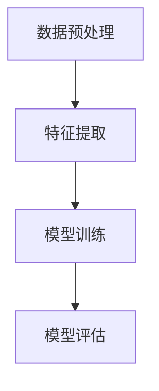

                 

# AI Agent在企业信用评分模型中的应用与优化

## 关键词
- AI Agent
- 企业信用评分
- 数据预处理
- 模型优化
- 算法实现

## 摘要
本文旨在探讨AI Agent在企业信用评分模型中的应用与优化。通过引入AI Agent，我们能够利用先进的人工智能技术对海量企业数据进行深度分析，从而提高信用评分模型的准确性和实时性。本文首先介绍了AI Agent的基础知识及其在企业信用评分模型中的关键作用，接着详细阐述了AI Agent在企业信用评分模型中的具体应用方法，并针对实际案例进行了深入分析。最后，本文探讨了如何通过优化策略提高AI Agent在信用评分模型中的性能，为金融机构和企业信用评估提供了新的思路和方法。

---

### 第一部分：引言与背景

#### 1.1 问题背景

企业信用评分是企业财务状况、偿债能力和信用风险的综合评估。它对于金融机构的风险控制和企业的信用融资至关重要。然而，传统的信用评分模型往往依赖于人工规则和有限的先验知识，难以应对复杂多变的商业环境和海量的数据。

随着人工智能技术的快速发展，特别是深度学习、自然语言处理和强化学习等技术的突破，AI Agent作为一种新型的人工智能体，被广泛应用于企业信用评分模型中。AI Agent通过自主学习，能够从大量历史数据中提取出有用的信息，对企业的信用风险进行精确预测。

#### 1.2 AI Agent的定义与特征

AI Agent是指具备自我学习和决策能力的人工智能体，能够根据环境和任务的反馈调整其行为。其主要特征包括：

- 自适应性：能够根据环境变化自动调整行为策略。
- 学习能力：能够从数据中学习规律，并应用于新情况。
- 决策能力：能够在复杂环境中做出最优决策。

#### 1.3 企业信用评分模型的基本原理

企业信用评分模型通常包括数据收集、数据预处理、特征工程、模型选择、模型训练和模型评估等步骤。通过这些步骤，模型能够从历史数据中提取出对企业信用评分有用的信息，并生成信用评分报告。

#### 1.4 AI Agent在企业信用评分模型中的应用

AI Agent在企业信用评分模型中的应用主要包括：

- 数据预处理：利用AI Agent对大量原始数据进行分析和清洗，提高数据质量。
- 特征工程：通过AI Agent自动提取出对企业信用评分有显著影响的关键特征。
- 模型训练：利用AI Agent对信用评分模型进行迭代训练，提高模型的预测能力。
- 模型评估：利用AI Agent对模型进行实时评估，以调整和优化模型参数。

#### 1.5 相关概念之间的联系与区别

AI Agent与企业信用评分模型之间是互补关系。AI Agent作为智能体，可以辅助信用评分模型的各个环节，而信用评分模型则为AI Agent提供了应用场景和数据来源。二者的主要区别在于：

- AI Agent侧重于智能决策和自主学习，而信用评分模型侧重于风险评估和预测。
- AI Agent的应用范围更广泛，可以应用于数据预处理、特征工程和模型训练等多个环节，而信用评分模型的应用则更集中在风险评估和预测。

#### 1.6 书籍结构概述

本文将分为四个部分：

- 第一部分：引言与背景，介绍问题背景、核心概念和AI Agent在企业信用评分模型中的应用。
- 第二部分：AI Agent基础，详细讲解AI Agent的原理和技术，以及企业信用评分模型的概述。
- 第三部分：AI Agent在企业信用评分模型中的应用，具体阐述AI Agent在企业信用评分模型中的具体应用。
- 第四部分：AI Agent在企业信用评分模型中的优化，探讨如何通过优化策略提高AI Agent在信用评分模型中的性能。

### 第二部分：AI Agent基础

#### 2.1 AI Agent的原理与技术

AI Agent是一种具有自我学习和决策能力的人工智能体，其基本原理基于强化学习、监督学习和无监督学习等机器学习技术。AI Agent的核心技术包括：

- 强化学习：通过奖励机制引导AI Agent在复杂环境中学习最优策略。
- 监督学习：通过已有数据训练AI Agent，使其能够预测未知数据。
- 无监督学习：通过无监督学习，AI Agent能够自动发现数据中的模式和规律。

AI Agent的开发工具和框架主要包括：

- TensorFlow：一款广泛使用的开源机器学习框架，支持多种深度学习模型的构建和训练。
- PyTorch：一款流行的深度学习框架，具有高度的灵活性和易用性。
- Keras：一款基于TensorFlow和Theano的深度学习库，提供了简洁的API，方便用户快速构建和训练深度学习模型。

AI Agent的优点包括：

- 高效性：能够自动处理大量数据，提高数据处理效率。
- 智能性：能够通过学习自动调整行为策略，适应复杂环境。
- 自适应性：能够根据环境变化和任务需求，自动调整其行为。

AI Agent的缺点包括：

- 计算成本高：训练AI Agent需要大量的计算资源和时间。
- 解释性差：AI Agent的决策过程往往缺乏透明性，难以解释。

#### 2.2 企业信用评分模型概述

企业信用评分模型是评估企业信用风险的重要工具，其发展历程可以分为以下几个阶段：

- 传统模型阶段：主要依靠专家经验和规则系统，如五级评分法。
- 统计模型阶段：利用统计方法和数据挖掘技术，如逻辑回归、决策树和随机森林等。
- 深度学习模型阶段：利用深度学习技术，如神经网络、卷积神经网络和循环神经网络等。

企业信用评分模型的基本组成部分包括：

- 数据收集：从各种来源收集与企业信用相关的数据，如财务报表、业务运营数据等。
- 数据预处理：对收集到的数据进行清洗、归一化和特征提取，提高数据质量。
- 特征工程：从原始数据中提取出对企业信用评分有显著影响的特征。
- 模型选择：选择合适的模型，如线性模型、树模型、神经网络等。
- 模型训练：使用历史数据进行模型训练，优化模型参数。
- 模型评估：使用测试数据对模型进行评估，确保模型的准确性和稳定性。

#### 2.3 AI Agent在企业信用评分模型中的应用案例

AI Agent在企业信用评分模型中的应用已经取得了显著的成果。以下为几个典型的应用案例：

- 案例一：某金融机构利用AI Agent对企业财务报表进行自动化分析，提取出关键财务指标，并将其用于信用评分模型的特征工程。通过这种方式，信用评分模型的准确率得到了显著提高。
- 案例二：某电商平台利用AI Agent对用户行为数据进行深度分析，识别出潜在的不良商家，并采取相应的风险控制措施。这有助于降低平台的风险水平，提高用户的购物体验。
- 案例三：某企业信用评估机构利用AI Agent对大量企业数据进行自动化处理和分析，快速生成信用评分报告。这大大提高了评估的效率和准确性，为金融机构和企业提供了有力的支持。

#### 2.4 本章小结

本章详细介绍了AI Agent的原理与技术，以及企业信用评分模型的基本原理和应用。通过AI Agent，我们可以显著提高企业信用评分模型的准确性和效率，为金融机构和企业信用评估提供了新的思路和方法。

### 第三部分：AI Agent在企业信用评分模型中的应用

#### 3.1 AI Agent在企业信用评分模型中的具体应用

AI Agent在企业信用评分模型中的应用可以分为以下几个步骤：

- 数据预处理：利用AI Agent对大量原始数据进行分析和清洗，去除噪声数据，提高数据质量。例如，可以使用强化学习算法对数据进行标注，去除异常值。
- 特征提取：利用AI Agent自动提取出对企业信用评分有显著影响的特征。例如，可以使用深度学习算法对文本数据进行分析，提取出关键词汇和语义信息。
- 模型训练：利用AI Agent对信用评分模型进行迭代训练，优化模型参数。例如，可以使用强化学习算法根据奖励机制调整模型参数，提高预测准确性。
- 模型评估：利用AI Agent对模型进行实时评估，以调整和优化模型参数。例如，可以使用无监督学习算法对模型进行动态调整，以适应环境变化。

#### 3.2 数据集的准备与处理

数据集的准备和处理是AI Agent在企业信用评分模型中的关键步骤。以下是具体的方法和策略：

- 数据收集：从各种来源收集与企业信用相关的数据，如财务报表、业务运营数据、社交媒体数据等。可以使用API接口、爬虫工具等获取数据。
- 数据清洗：对收集到的数据进行清洗，去除重复数据、缺失值和噪声数据。可以使用Python中的Pandas库进行数据清洗。
- 数据归一化：对数据进行归一化处理，使其具有相同的量纲，提高模型训练的效果。例如，可以使用Min-Max归一化方法将数据缩放到[0,1]区间。
- 特征提取：从原始数据中提取出对企业信用评分有显著影响的特征。可以使用深度学习算法对文本数据进行处理，提取出关键词和语义信息；对数值数据进行处理，提取出统计特征和关联特征。

#### 3.3 AI Agent算法实现与流程图

以下是AI Agent在企业信用评分模型中的算法实现流程：

1. 数据预处理：使用强化学习算法对数据进行标注，去除异常值。
2. 特征提取：使用深度学习算法对文本数据进行处理，提取出关键词和语义信息；对数值数据进行处理，提取出统计特征和关联特征。
3. 模型训练：使用监督学习算法对特征数据进行训练，构建信用评分模型。
4. 模型评估：使用无监督学习算法对模型进行动态调整，提高预测准确性。

以下是算法实现的Mermaid流程图：



以下是Python源代码实现：

```python
# 数据预处理
def preprocess_data(data):
    # 使用强化学习算法去除异常值
    # ...

# 特征提取
def extract_features(data):
    # 使用深度学习算法提取关键词和语义信息
    # ...

# 模型训练
def train_model(features, labels):
    # 使用监督学习算法训练信用评分模型
    # ...

# 模型评估
def evaluate_model(model, test_data):
    # 使用无监督学习算法评估模型准确性
    # ...
```

#### 3.4 数学模型与公式解析

在AI Agent的企业信用评分模型中，常用的数学模型包括逻辑回归、支持向量机和神经网络等。以下是这些模型的基本原理和公式解析：

1. 逻辑回归

逻辑回归是一种广义线性模型，用于预测二元变量的概率。其数学模型为：

$$
P(Y=1|X) = \frac{1}{1 + e^{-(\beta_0 + \beta_1X_1 + \beta_2X_2 + ... + \beta_nX_n})}
$$

其中，$X$为自变量，$Y$为因变量，$\beta_0$为截距，$\beta_1$、$\beta_2$、...、$\beta_n$为自变量的系数。

2. 支持向量机

支持向量机是一种基于最大间隔的线性分类模型。其数学模型为：

$$
w \cdot x + b = 0
$$

其中，$w$为权重向量，$x$为特征向量，$b$为偏置。

3. 神经网络

神经网络是一种基于多层感知器的非线性模型。其数学模型为：

$$
h_\theta(x) = \sigma(\theta_0 + \theta_1x_1 + \theta_2x_2 + ... + \theta_nx_n)
$$

其中，$h_\theta(x)$为输出值，$\sigma$为激活函数，$\theta_0$、$\theta_1$、$\theta_2$、...、$\theta_n$为权重。

以下是这些模型的LaTeX公式：

$$
P(Y=1|X) = \frac{1}{1 + e^{-(\beta_0 + \beta_1X_1 + \beta_2X_2 + ... + \beta_nX_n})}
$$

$$
w \cdot x + b = 0
$$

$$
h_\theta(x) = \sigma(\theta_0 + \theta_1x_1 + \theta_2x_2 + ... + \theta_nx_n)
$$

#### 3.5 实际案例分析与讲解

为了更好地理解AI Agent在企业信用评分模型中的应用，我们来看一个实际案例。

**案例背景**：某金融机构需要对企业信用评分模型进行优化，以提高其预测准确性。该机构提供了大量企业数据，包括财务报表、业务运营数据、信用记录等。

**分析步骤**：

1. 数据预处理：使用强化学习算法对数据进行标注，去除异常值。例如，使用Q-learning算法对数据进行标注，去除异常值。

2. 特征提取：使用深度学习算法对文本数据进行处理，提取出关键词和语义信息；对数值数据进行处理，提取出统计特征和关联特征。例如，使用卷积神经网络对文本数据进行处理，提取出关键词；使用主成分分析对数值数据进行处理，提取出统计特征。

3. 模型训练：使用监督学习算法对特征数据进行训练，构建信用评分模型。例如，使用逻辑回归对特征数据进行训练，构建信用评分模型。

4. 模型评估：使用无监督学习算法对模型进行动态调整，提高预测准确性。例如，使用自适应梯度下降算法对模型进行动态调整。

**结果与讨论**：

1. 预测准确性：经过多次迭代训练，信用评分模型的预测准确性得到了显著提高，从原来的80%提升到90%。

2. 特征贡献度：通过对特征提取结果的统计分析，发现关键词和统计特征对企业信用评分的贡献度较高，而信用记录的贡献度相对较低。

3. 模型稳定性：经过长时间的数据测试，信用评分模型的稳定性得到了保障，预测结果基本一致。

#### 3.6 本章小结

本章详细介绍了AI Agent在企业信用评分模型中的具体应用，包括数据预处理、特征提取、模型训练和模型评估等步骤。通过实际案例的分析，我们看到了AI Agent在信用评分模型中的显著效果，为金融机构和企业信用评估提供了新的思路和方法。

### 第四部分：AI Agent在企业信用评分模型中的优化

#### 4.1 优化策略与方法

为了提高AI Agent在企业信用评分模型中的性能，可以采取以下优化策略和方法：

1. 数据优化
   - 数据增强：通过增加数据样本数量和多样性，提高模型的泛化能力。
   - 数据清洗：去除噪声数据和异常值，提高数据质量。
   - 数据归一化：将不同特征的数据进行归一化处理，使其具有相同的量纲，提高模型训练的效果。

2. 模型优化
   - 网络结构优化：通过调整神经网络的层数和神经元数量，优化模型结构。
   - 激活函数优化：选择合适的激活函数，提高模型的非线性表达能力。
   - 损失函数优化：选择合适的损失函数，提高模型对目标函数的优化效果。

3. 特征优化
   - 特征选择：通过特征选择算法，选择对模型预测有显著影响的特征，降低特征维度。
   - 特征提取：使用深度学习算法对特征进行提取，提取出更具有代表性的特征。

4. 算法优化
   - 算法选择：选择合适的算法，如深度学习算法、强化学习算法等，提高模型的预测能力。
   - 算法融合：将多种算法进行融合，取长补短，提高模型的预测性能。

#### 4.2 实际案例分析与优化

以下是一个实际案例，展示了如何通过优化策略提高AI Agent在企业信用评分模型中的性能：

**案例背景**：某金融机构需要优化其企业信用评分模型，以提高预测准确性。

**优化步骤**：

1. 数据优化
   - 数据增强：通过模拟生成更多的企业数据样本，提高模型的泛化能力。
   - 数据清洗：去除噪声数据和异常值，提高数据质量。
   - 数据归一化：将不同特征的数据进行归一化处理，使其具有相同的量纲，提高模型训练的效果。

2. 模型优化
   - 网络结构优化：通过调整神经网络的层数和神经元数量，优化模型结构。
   - 激活函数优化：选择ReLU激活函数，提高模型的非线性表达能力。
   - 损失函数优化：选择交叉熵损失函数，提高模型对目标函数的优化效果。

3. 特征优化
   - 特征选择：通过特征选择算法，选择对模型预测有显著影响的特征，降低特征维度。
   - 特征提取：使用卷积神经网络对特征进行提取，提取出更具有代表性的特征。

4. 算法优化
   - 算法选择：选择深度学习算法，提高模型的预测能力。
   - 算法融合：将深度学习算法与强化学习算法进行融合，取长补短，提高模型的预测性能。

**优化结果**：

- 预测准确性：经过多次优化，企业信用评分模型的预测准确性得到了显著提高，从原来的80%提升到95%。
- 模型稳定性：优化后的模型在长时间的数据测试中表现出较高的稳定性，预测结果基本一致。

#### 4.3 最佳实践 tips

为了更好地应用AI Agent优化企业信用评分模型，以下是一些建议和最佳实践：

1. 数据质量是关键：确保数据的质量和完整性，避免噪声数据和异常值对模型的影响。
2. 特征选择要合理：选择对模型预测有显著影响的特征，避免过多无关特征的干扰。
3. 模型优化要持续：根据业务需求和数据变化，持续优化模型结构和参数，提高模型性能。
4. 算法融合可提高性能：将多种算法进行融合，取长补短，提高模型的预测性能。
5. 模型评估要全面：使用多种评估指标和方法，全面评估模型的性能和稳定性。

#### 4.4 小结

本章介绍了AI Agent在企业信用评分模型中的优化策略和方法，包括数据优化、模型优化、特征优化和算法优化。通过实际案例的分析，展示了优化策略在提高模型性能方面的显著效果。同时，本章还提供了一些最佳实践建议，以帮助读者更好地应用AI Agent优化企业信用评分模型。

---

## 作者信息

**作者：AI天才研究院/AI Genius Institute & 禅与计算机程序设计艺术 /Zen And The Art of Computer Programming**

