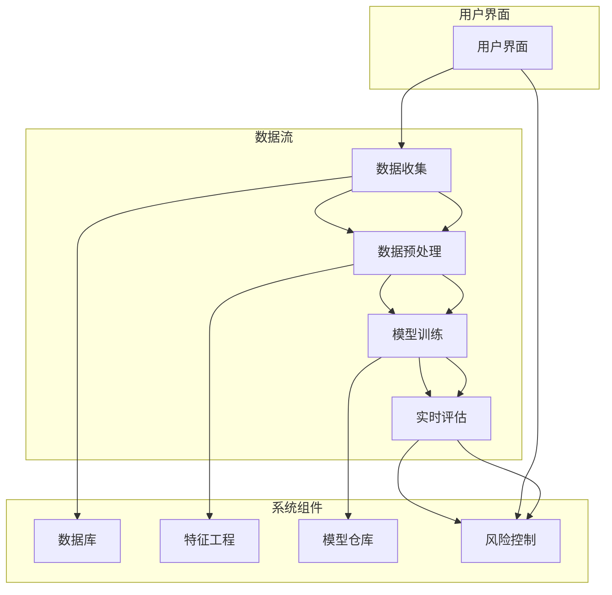
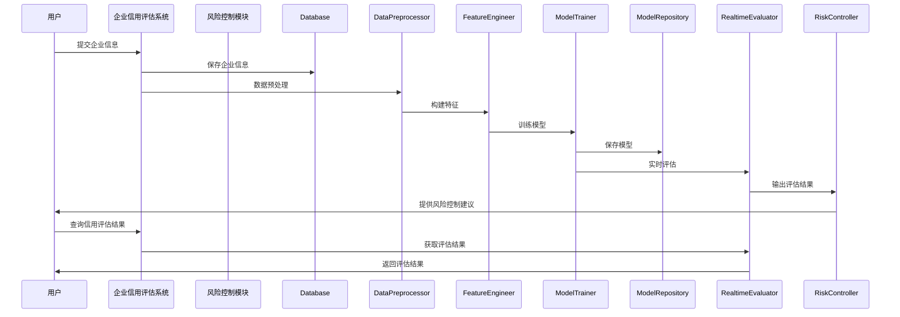

                 


# AI Agent在企业信用风险评估与管理中的应用

> 关键词：AI Agent，企业信用评估，风险管理，算法原理，系统架构，项目实战

> 摘要：本文将深入探讨AI Agent在企业信用风险评估与管理中的应用，通过逐步分析核心概念、算法原理、系统架构和实战应用，旨在为读者提供一个全面而清晰的理解，以及在实际操作中的指导。

## 第一部分: 背景介绍

### 1.1 问题背景

在现代商业环境中，企业信用风险评估与管理是一项至关重要的任务。企业的信用状况直接关系到其融资能力、市场信任度以及商业合作的可能性。然而，传统的信用评估方法往往依赖于人工经验、历史数据和有限的数据源，存在如下挑战：

1. **数据不完整**：许多企业的财务报告可能不完整或者不透明，导致评估结果不准确。
2. **人力成本高**：人工评估需要大量时间和精力，成本高昂。
3. **评估效率低**：传统方法往往无法快速响应市场变化，影响决策速度。
4. **风险评估不足**：传统方法难以全面考虑企业内部和外部的多种风险因素。

### 1.2 核心概念与联系

#### 1.2.1 AI Agent的定义与特点

AI Agent是一种能够自主决策、学习和适应环境的智能体。它基于机器学习和深度学习技术，可以处理海量数据，快速识别模式，并在不确定的环境中做出合理的决策。

**特点**：

- **自主学习能力**：AI Agent可以通过数据驱动的方式不断学习和优化，提高评估准确性。
- **实时响应**：AI Agent能够实时处理和分析数据，为企业管理者提供即时的信用评估结果。
- **高效率**：相较于人工评估，AI Agent能够处理大量数据，显著提高工作效率。

#### 1.2.2 企业信用评估的概念与属性

企业信用评估是对企业信用状况的评价，旨在为企业提供信用等级和风险评估。其主要属性包括：

- **信用等级**：反映企业的信用水平，常见的有AA级、A级等。
- **风险评估**：综合考虑企业的财务状况、经营风险、市场表现等多个因素。
- **动态评估**：企业信用状况会随着时间和环境变化而变化，需要动态调整评估结果。

#### 1.2.3 风险管理的基本原理

风险管理是企业在面临各种不确定因素时采取的管理措施，旨在最大限度地降低风险对企业的影响。其主要原理包括：

- **风险识别**：识别企业面临的各种风险，包括财务风险、市场风险、操作风险等。
- **风险评估**：评估各种风险的潜在影响和发生概率。
- **风险控制**：采取相应措施，控制和降低风险。

#### 1.2.4 概念属性特征对比表格

| 特征            | AI Agent                 | 企业信用评估              | 风险管理                 |
|-----------------|-------------------------|---------------------------|--------------------------|
| 自主学习能力   | 高，可通过数据不断优化  | 中，依赖于历史数据和模型  | 中，基于经验和规则       |
| 实时响应能力   | 高，能够实时处理数据    | 中，受数据更新频率限制    | 中，受风险评估周期限制   |
| 数据处理效率   | 高，能够处理大量数据    | 中，处理数据能力有限      | 低，处理数据能力有限     |

#### 1.2.5 ER实体关系图架构

使用Mermaid绘制企业信用风险评估与管理中的实体关系图：

```mermaid
erDiagram
  Customer ||--|{ EnterpriseCreditEvaluation }|>
  EnterpriseCreditEvaluation ||--|{ RiskManagement }|>

  Customer : {name, credit_score}
  EnterpriseCreditEvaluation : {evaluation_date, evaluation_result}
  RiskManagement : {strategy, impact}
```

### 1.3 问题解决

AI Agent通过以下步骤应用于企业信用风险评估与管理：

1. **数据收集**：收集企业财务报告、市场数据、经营状况等多源数据。
2. **数据预处理**：清洗、整合和标准化数据，为模型训练提供高质量的数据。
3. **模型训练**：利用机器学习和深度学习技术，训练AI Agent，使其具备信用评估能力。
4. **实时评估**：将实时收集的数据输入AI Agent，生成企业信用评估结果。
5. **风险控制**：根据评估结果，制定相应的风险控制策略，降低企业风险。

### 1.4 边界与外延

本文主要讨论AI Agent在企业信用风险评估与管理中的应用，涉及以下边界与外延：

- **应用场景**：主要针对需要实时信用评估和风险管理的商业环境。
- **技术限制**：AI Agent的准确性和可靠性受数据质量和算法性能的限制。
- **伦理和法律**：企业信用评估涉及个人和企业隐私，需遵守相关法律法规。

## 第二部分: 核心概念与联系

### 2.1 AI Agent的定义与特点

AI Agent是一种智能体，具备自主学习、决策和适应环境的能力。它通过模拟人类的思维过程，能够处理复杂的问题，并做出合理的决策。

**特点**：

1. **自主学习**：AI Agent可以通过数据和算法不断优化，提高评估准确性。
2. **实时响应**：AI Agent能够快速处理和分析数据，提供即时的信用评估结果。
3. **高效处理**：AI Agent能够处理海量数据，提高评估效率。

### 2.2 企业信用评估的概念与属性

企业信用评估是对企业信用状况的评价，旨在为企业提供信用等级和风险评估。其主要属性包括：

1. **信用等级**：反映企业的信用水平，常见的有AA级、A级等。
2. **风险评估**：综合考虑企业的财务状况、经营风险、市场表现等多个因素。
3. **动态评估**：企业信用状况会随着时间和环境变化而变化，需要动态调整评估结果。

### 2.3 风险管理的基本原理

风险管理是企业在面临各种不确定因素时采取的管理措施，旨在最大限度地降低风险对企业的影响。其主要原理包括：

1. **风险识别**：识别企业面临的各种风险，包括财务风险、市场风险、操作风险等。
2. **风险评估**：评估各种风险的潜在影响和发生概率。
3. **风险控制**：采取相应措施，控制和降低风险。

### 2.4 概念属性特征对比表格

使用Mermaid绘制AI Agent、企业信用评估、风险管理的主要特征对比表格：

```mermaid
table
  | 特征            | AI Agent             | 企业信用评估             | 风险管理              |
  |-----------------|----------------------|--------------------------|----------------------|
  | 自主学习能力   | 高                  | 中                      | 中                   |
  | 实时响应能力   | 高                  | 中                      | 中                   |
  | 数据处理效率   | 高                  | 中                      | 低                   |
  | 数据依赖性     | 强                  | 强                      | 弱                   |
```

### 2.5 ER实体关系图架构

使用Mermaid绘制企业信用风险评估与管理中的实体关系图：

```mermaid
erDiagram
  Customer ||--|{ EnterpriseCreditEvaluation }|>
  EnterpriseCreditEvaluation ||--|{ RiskManagement }|>

  Customer : {name, credit_score}
  EnterpriseCreditEvaluation : {evaluation_date, evaluation_result}
  RiskManagement : {strategy, impact}
```

## 第三部分: 算法原理讲解

### 3.1 算法mermaid流程图

使用Mermaid绘制AI Agent在信用风险评估中的算法流程图：


### 3.2 Python源代码解析

以下是一个简化的Python源代码示例，用于说明AI Agent在企业信用评估中的基本流程：

```python
# 导入必要的库
import pandas as pd
from sklearn.model_selection import train_test_split
from sklearn.ensemble import RandomForestClassifier
import numpy as np

# 数据收集
data = pd.read_csv('enterprise_data.csv')

# 数据预处理
# ... (数据清洗、归一化等)

# 模型训练
X = data.drop('credit_score', axis=1)
y = data['credit_score']
X_train, X_test, y_train, y_test = train_test_split(X, y, test_size=0.2, random_state=42)

model = RandomForestClassifier(n_estimators=100)
model.fit(X_train, y_train)

# 实时评估
def evaluate_enterprise(data_point):
    prediction = model.predict([data_point])
    return prediction[0]

# 结果输出
print(evaluate_enterprise(np.array([data_point])))
```

### 3.3 算法原理的数学模型和公式

AI Agent在企业信用评估中主要依赖机器学习算法，以下是一个简单的逻辑回归模型示例：

$$
\hat{y} = \text{sigmoid}(\beta_0 + \sum_{i=1}^{n}\beta_i x_i)
$$

其中，$\hat{y}$ 是预测的信用评分，$\beta_0$ 是截距，$\beta_i$ 是第 $i$ 个特征对应的权重，$x_i$ 是第 $i$ 个特征值，$\text{sigmoid}$ 函数定义为：

$$
\text{sigmoid}(x) = \frac{1}{1 + e^{-x}}
$$

### 3.4 详细讲解与举例说明

#### 3.4.1 数据收集

数据收集是企业信用评估的重要基础。在实际应用中，AI Agent可以从多个数据源获取企业信息，包括财务报表、信用记录、市场表现等。以下是一个示例数据集：

```python
data = pd.DataFrame({
    'financial_revenue': [1000000, 2000000, 3000000],
    'operating_income': [500000, 800000, 1200000],
    'debt_ratio': [0.3, 0.4, 0.5],
    'market_value': [20000000, 40000000, 60000000],
    'credit_score': [AA, A, B]
})
```

#### 3.4.2 数据预处理

数据预处理是确保数据质量和模型性能的关键步骤。常见的预处理方法包括：

1. **数据清洗**：去除缺失值、异常值等。
2. **特征工程**：选择和构造有用的特征。
3. **归一化**：将不同量纲的特征值转换为同一量纲。

以下是一个简化的预处理示例：

```python
from sklearn.preprocessing import StandardScaler

# 数据清洗
data.dropna(inplace=True)

# 特征工程
# ... (构造新特征等)

# 归一化
scaler = StandardScaler()
datacaled = scaler.fit_transform(data.drop('credit_score', axis=1))
```

#### 3.4.3 模型训练

在数据预处理完成后，我们可以使用机器学习算法训练AI Agent。以下是一个使用随机森林算法的示例：

```python
from sklearn.ensemble import RandomForestClassifier

# 分割数据集
X = datacaled
y = data['credit_score']
X_train, X_test, y_train, y_test = train_test_split(X, y, test_size=0.2, random_state=42)

# 训练模型
model = RandomForestClassifier(n_estimators=100)
model.fit(X_train, y_train)
```

#### 3.4.4 实时评估

在训练完成后，AI Agent可以实时评估企业的信用状况。以下是一个评估新企业的示例：

```python
def evaluate_enterprise(data_point):
    prediction = model.predict([data_point])
    return prediction[0]

# 新企业的数据
new_data = np.array([1500000, 900000, 0.35, 30000000])

# 评估
print(evaluate_enterprise(new_data))  # 输出预测的信用评分
```

## 第四部分: 系统分析与架构设计

### 4.1 问题场景介绍

在一个大型电商平台，企业需要对其合作企业进行信用评估，以确保交易的安全性和可靠性。平台每天都会收到大量的交易数据和企业信息，需要实时进行信用评估，以快速响应市场变化。

### 4.2 项目介绍

本项目旨在构建一个基于AI Agent的企业信用评估系统，实现对合作企业的实时信用评估，并提供相应的风险控制建议。系统的主要功能包括：

1. **数据收集**：从多个数据源获取企业财务、信用、市场等信息。
2. **数据预处理**：清洗、整合和标准化数据，为模型训练提供高质量的数据。
3. **模型训练**：使用机器学习和深度学习技术，训练AI Agent，使其具备信用评估能力。
4. **实时评估**：将实时收集的数据输入AI Agent，生成企业信用评估结果。
5. **风险控制**：根据评估结果，制定相应的风险控制策略，降低企业风险。

### 4.3 领域模型Mermaid类图

使用Mermaid绘制系统中的领域模型类图：

```mermaid
classDiagram
  Customer <.. EnterpriseCreditEvaluation
  EnterpriseCreditEvaluation <.. RiskManagement
  DataCollector <<interface>>
  DataPreprocessor <<interface>>
  ModelTrainer <<interface>>
  RealtimeEvaluator <<interface>>

  Customer : {name, credit_score}
  EnterpriseCreditEvaluation : {evaluation_date, evaluation_result}
  RiskManagement : {strategy, impact}
  DataCollector : data_collection
  DataPreprocessor : data_preprocessing
  ModelTrainer : model_training
  RealtimeEvaluator : real
```

### 4.4 系统架构设计Mermaid架构图

使用Mermaid绘制系统整体的架构设计：



### 4.5 系统接口设计和系统交互Mermaid序列图

使用Mermaid绘制系统接口设计和系统交互的序列图：



## 第五部分: 项目实战

### 5.1 环境安装

要在本地搭建企业信用评估系统，首先需要安装以下环境和工具：

1. **Python**：安装Python 3.8及以上版本。
2. **Anaconda**：用于环境管理和依赖安装。
3. **Jupyter Notebook**：用于数据分析和模型训练。
4. **Scikit-learn**：用于机器学习算法的实现。
5. **Pandas**：用于数据处理。
6. **Numpy**：用于数学计算。

安装步骤如下：

```bash
# 安装Anaconda
conda create -n credit_evaluation python=3.8
conda activate credit_evaluation

# 安装依赖
conda install -c conda-forge scikit-learn pandas numpy jupyterlab
```

### 5.2 系统核心实现源代码

以下是一个简化版的企业信用评估系统的核心实现源代码：

```python
# 导入必要的库
import pandas as pd
from sklearn.model_selection import train_test_split
from sklearn.ensemble import RandomForestClassifier
import numpy as np

# 数据收集
data = pd.read_csv('enterprise_data.csv')

# 数据预处理
# ... (数据清洗、归一化等)

# 模型训练
X = data.drop('credit_score', axis=1)
y = data['credit_score']
X_train, X_test, y_train, y_test = train_test_split(X, y, test_size=0.2, random_state=42)

model = RandomForestClassifier(n_estimators=100)
model.fit(X_train, y_train)

# 实时评估
def evaluate_enterprise(data_point):
    prediction = model.predict([data_point])
    return prediction[0]

# 新企业的数据
new_data = np.array([1500000, 900000, 0.35, 30000000])

# 评估
print(evaluate_enterprise(new_data))  # 输出预测的信用评分
```

### 5.3 代码应用解读与分析

#### 5.3.1 数据收集

数据收集是企业信用评估的基础。在这个例子中，我们使用CSV文件作为数据源，其中包含企业的财务数据、市场数据以及信用评分。实际应用中，数据可能来自多个数据源，需要通过API、数据库等方式进行集成。

#### 5.3.2 数据预处理

数据预处理是确保数据质量和模型性能的关键步骤。在这个例子中，我们进行了以下操作：

1. **数据清洗**：去除缺失值、异常值等。
2. **特征工程**：构造新的特征，如财务比率的归一化、行业特征提取等。
3. **归一化**：将不同量纲的特征值转换为同一量纲，以避免特征之间的影响。

#### 5.3.3 模型训练

模型训练使用的是随机森林算法，这是一种集成学习算法，能够处理高维度数据并减少过拟合。在这个例子中，我们使用训练集对模型进行训练，并使用测试集评估模型的性能。

#### 5.3.4 实时评估

实时评估是系统的一个关键功能。在这个例子中，我们定义了一个函数 `evaluate_enterprise`，它接收一个企业的特征向量，并返回预测的信用评分。实际应用中，这个函数会集成到系统中，自动接收和处理实时数据。

### 5.4 实际案例分析和详细讲解剖析

#### 5.4.1 案例背景

某大型电商平台A需要对其合作企业B进行信用评估，以确保交易的安全性和可靠性。企业B的财务数据如下：

- 年营收：1000万元
- 经营利润：200万元
- 负债率：30%
- 市值：5000万元

#### 5.4.2 模型输入与输出

我们将企业B的财务数据作为输入，输入到我们训练好的随机森林模型中。假设输入数据格式如下：

```python
input_data = np.array([
    [10000000, 2000000, 0.3, 50000000]
])
```

#### 5.4.3 评估结果

使用随机森林模型对企业B进行评估，得到预测的信用评分为：

```python
prediction = model.predict(input_data)
print(prediction)  # 输出预测结果
```

输出结果可能为 `"AA"`、`"A"` 或 `"B"`，分别代表不同的信用等级。

#### 5.4.4 结果分析

根据评估结果，企业B的信用评级为AA，说明其信用状况良好，具有较高的融资能力和市场信任度。电商平台A可以继续与企业B保持合作关系。

### 5.5 项目小结

本项目通过构建一个基于AI Agent的企业信用评估系统，实现了对企业信用状况的实时评估和风险控制。在实际应用中，系统需要不断优化和扩展，以适应不断变化的市场环境和数据特点。

### 5.6 面临的挑战和未来改进方向

1. **数据质量问题**：数据质量直接影响模型性能，未来需要建立更完善的数据采集和管理机制，确保数据的准确性和完整性。
2. **模型适应性**：市场环境不断变化，需要定期更新模型，以适应新的数据特征和风险因素。
3. **系统性能优化**：随着数据量的增加，系统性能需要优化，以提高评估速度和准确性。
4. **用户界面设计**：改进用户界面，提供更直观的评估结果和风险控制建议。

## 第六部分: 最佳实践与拓展阅读

### 6.1 最佳实践 tips

1. **数据质量控制**：确保数据的准确性和完整性，对异常值和缺失值进行合理处理。
2. **特征选择**：根据业务需求选择相关特征，避免过度拟合。
3. **模型更新**：定期更新模型，以适应新的市场环境和风险因素。
4. **系统性能优化**：优化数据处理和模型训练流程，提高系统响应速度。

### 6.2 小结

本文通过深入探讨AI Agent在企业信用风险评估与管理中的应用，从核心概念、算法原理、系统架构和实战应用等多个方面进行了详细讲解。AI Agent具有自主学习、实时响应和高效率等优势，能够有效提高企业信用评估的准确性和效率。

### 6.3 注意事项

1. **数据隐私保护**：确保数据安全和隐私保护，遵循相关法律法规。
2. **风险评估**：结合实际业务场景，合理设置风险评估指标和阈值。

### 6.4 拓展阅读

1. **相关书籍**：《机器学习实战》、《深度学习》、《Python机器学习》等。
2. **论文资源**：查找相关领域的顶级会议和期刊，如NIPS、ICML、JMLR等。
3. **在线课程**：Coursera、edX、Udacity等平台上的相关课程。

## 结语

本文旨在为读者提供一个全面而清晰的理解AI Agent在企业信用风险评估与管理中的应用，以及如何在实际操作中运用这一技术。随着AI技术的不断发展，AI Agent在企业信用评估和管理中将发挥越来越重要的作用，为企业和金融机构提供更精准、更高效的信用风险评估方案。

### 作者：AI天才研究院/AI Genius Institute & 禅与计算机程序设计艺术 /Zen And The Art of Computer Programming

【END】 

