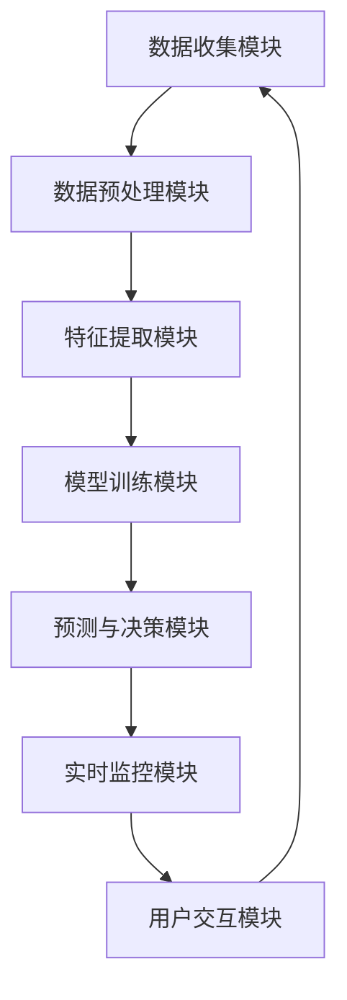

                 

## 引言

### 1.1 问题背景

企业的信用风险是指企业在经济活动中，由于各种不确定因素，可能导致其无法按时偿还债务或履行合同义务的风险。随着全球经济一体化和商业环境日益复杂，企业面临的信用风险也日益增多，信用风险评估的重要性愈发凸显。对企业而言，准确评估信用风险能够帮助它们在商业决策中减少潜在损失，优化资源配置，降低金融风险。对金融机构和投资者来说，信用风险评估是决定贷款发放、投资决策的重要依据，直接关系到其财务安全和收益。

传统的信用风险评估方法主要依赖于人工经验和专家判断，存在主观性强、效率低、准确性不高等问题。随着人工智能技术的发展，AI Agent作为一种智能体，能够在大量数据中快速提取特征，通过机器学习和深度学习算法进行建模和预测，为企业信用风险评估提供了新的解决方案。AI Agent不仅能提高风险评估的效率和准确性，还能动态调整模型，适应不断变化的商业环境。

### 1.2 本书目的与结构

本书旨在探讨AI Agent在企业信用风险评估中的应用，通过系统分析和实践案例，展示AI Agent如何帮助企业应对信用风险。本书的目标读者包括企业决策者、信用风险管理专家、金融分析师以及相关领域的技术人员。

本书的结构如下：

- **第一部分：AI Agent技术原理**：介绍机器学习、深度学习的基础知识，包括基本概念、常用算法、模型评估与优化等。
- **第二部分：AI Agent设计**：探讨AI Agent的设计原则、架构设计、功能模块设计以及交互设计。
- **第三部分：信用风险评估应用**：通过案例分析，展示AI Agent在企业信用风险评估中的应用过程和效果。
- **第四部分：最佳实践与总结**：提供实际应用中的最佳实践、注意事项以及未来研究方向。

通过本书的阅读，读者将能够了解AI Agent在企业信用风险评估中的原理和应用，掌握相关技术和方法，为企业信用风险管理提供有力支持。

### 1.3 核心概念

#### 1.3.1 企业信用风险

企业信用风险是指企业在运营过程中，由于各种原因（如经济、管理、法律等）无法按时偿还债务或履行合同义务的风险。根据风险来源，企业信用风险可分为以下几类：

1. **财务风险**：由于企业财务状况恶化，导致无法按时支付债务的风险。
2. **市场风险**：由于市场环境变化，如需求下降、竞争加剧等，导致企业收入和利润下降的风险。
3. **操作风险**：由于企业内部管理失误、操作不规范等，导致经济损失的风险。
4. **法律风险**：由于法律变化、合同纠纷等，导致企业面临法律诉讼或处罚的风险。

企业信用风险评估是对企业信用风险进行量化和评估的过程，常用的评估方法包括：

1. **财务分析方法**：通过分析企业的财务报表，如资产负债表、利润表等，评估企业的财务状况和偿债能力。
2. **信用评级法**：通过专业的信用评级机构对企业进行评级，根据评级结果评估企业的信用风险。
3. **数据驱动方法**：利用大数据技术和人工智能算法，从大量数据中提取特征，进行风险评估。

#### 1.3.2 AI Agent

AI Agent，即人工智能代理，是指能够自动执行特定任务的智能体。AI Agent可以基于机器学习、深度学习等技术，从数据中学习规律，做出智能决策。根据其功能和应用场景，AI Agent可分为以下几类：

1. **专家系统**：基于规则和知识库，模拟人类专家决策过程。
2. **数据挖掘系统**：从大量数据中挖掘有价值的信息和规律。
3. **决策支持系统**：辅助用户进行决策，提供预测、推荐等功能。
4. **智能对话系统**：通过自然语言处理技术，与用户进行智能交互。

在信用风险评估中，AI Agent可以应用于以下几个方面：

1. **特征提取**：从企业历史数据中提取与信用风险相关的特征。
2. **风险评估**：利用机器学习算法，对企业的信用风险进行定量评估。
3. **实时监控**：持续监控企业的财务状况和市场环境，动态调整信用风险评估结果。
4. **决策支持**：为信用管理人员提供风险评估报告和决策建议。

### 1.4 技术概述

#### 1.4.1 机器学习基础

机器学习是人工智能的一个分支，通过构建和分析模型，使计算机具备自主学习和预测能力。机器学习的基本概念包括：

1. **监督学习**：通过已有数据（特征和标签）训练模型，然后利用模型对新数据进行预测。
2. **无监督学习**：没有标签数据，通过模型自动发现数据中的结构和模式。
3. **强化学习**：通过试错和奖励机制，使智能体在学习过程中逐步优化策略。

常见的机器学习算法包括：

1. **线性回归**：用于预测连续值。
2. **逻辑回归**：用于分类问题。
3. **支持向量机（SVM）**：用于分类和回归问题。
4. **决策树和随机森林**：用于分类和回归问题。
5. **神经网络**：用于复杂的数据分析和预测。

#### 1.4.2 深度学习基础

深度学习是机器学习的一个子领域，通过构建多层的神经网络，模拟人脑的工作方式，从而实现自动特征提取和复杂任务的学习。深度学习的基本概念包括：

1. **神经网络**：由多个神经元组成的层次结构，通过前向传播和反向传播算法进行训练。
2. **卷积神经网络（CNN）**：适用于图像和视频数据。
3. **循环神经网络（RNN）**：适用于序列数据。
4. **生成对抗网络（GAN）**：用于生成逼真的数据。

深度学习在信用风险评估中的应用主要体现在以下几个方面：

1. **特征提取**：通过深度学习模型，自动提取与信用风险相关的复杂特征。
2. **风险评估**：利用深度学习模型，对企业的信用风险进行精准预测。
3. **实时监控**：通过持续训练和更新模型，实现对信用风险的实时监控和预测。
4. **自动化决策**：利用深度学习模型，自动化生成信用风险评估报告和决策建议。

### 1.5 本章小结

本章首先介绍了企业信用风险评估的重要性和传统方法的局限性，然后介绍了AI Agent的基本概念和其在信用风险评估中的应用。接着，我们概述了本书的主要内容和结构，并详细介绍了核心概念，包括企业信用风险和AI Agent的定义与类型。此外，我们还探讨了机器学习和深度学习的基础知识，为后续章节的技术原理分析奠定了基础。通过对这些关键概念的梳理，读者将能更好地理解AI Agent在企业信用风险评估中的重要作用和应用前景。接下来，我们将进一步深入探讨AI Agent的技术原理和应用实践，为读者提供全面的技术指导。

---

## 第二部分: AI Agent技术原理

### 第2章: 机器学习基础

机器学习作为人工智能的核心技术，使得计算机系统能够从数据中学习规律并做出预测或决策。在本章中，我们将详细探讨机器学习的基本概念、常见算法以及模型评估与优化方法，为后续的AI Agent设计和应用提供坚实的理论基础。

### 2.1 机器学习概述

#### 2.1.1 定义与应用场景

机器学习是指通过构建和训练模型，使计算机系统能够从数据中学习规律，并在未见过的数据上做出预测或决策。具体来说，机器学习模型通过输入特征和对应的标签（监督学习），或通过自身探索数据（无监督学习），来学习和优化其参数，从而提高预测或决策的准确性。

机器学习在许多领域都有广泛应用，例如：

1. **图像识别**：通过卷积神经网络（CNN）对图像进行分类和识别。
2. **语音识别**：利用循环神经网络（RNN）和长短期记忆网络（LSTM）对语音信号进行识别和处理。
3. **自然语言处理**：通过深度学习模型进行文本分类、情感分析、机器翻译等。
4. **金融风控**：利用机器学习模型进行信用风险评估、市场预测等。
5. **医疗诊断**：通过分析医学影像和生物特征数据，进行疾病诊断和预测。

#### 2.1.2 常见机器学习算法分类

机器学习算法可以分为以下几类：

1. **监督学习**：有标签的数据进行训练，并在未见过的数据上进行预测。常见的算法有：
   - **线性回归**：用于预测连续值。
   - **逻辑回归**：用于二分类问题。
   - **支持向量机（SVM）**：适用于高维数据的分类和回归。
   - **决策树和随机森林**：用于分类和回归问题，具有较好的可解释性。

2. **无监督学习**：没有标签的数据进行训练，目的是发现数据中的结构和模式。常见的算法有：
   - **聚类算法**：如K均值聚类、层次聚类，用于发现数据的聚类结构。
   - **主成分分析（PCA）**：用于降维和特征提取。
   - **自编码器**：用于无监督特征学习和降维。

3. **强化学习**：通过与环境的交互，逐步优化决策策略。常见的算法有：
   - **Q学习**：通过值函数来评估状态和动作。
   - **深度确定性策略梯度（DDPG）**：用于连续动作空间的决策。

### 2.2 数据预处理

数据预处理是机器学习过程中至关重要的一步，其主要任务包括数据清洗和特征工程。

#### 2.2.1 数据清洗

数据清洗的目标是去除噪声和异常值，确保数据的质量和一致性。具体步骤包括：

1. **缺失值处理**：通过填补或删除缺失值，减少数据中的噪声。
2. **异常值检测**：使用统计方法或机器学习算法检测异常值，并进行处理或标记。
3. **数据转换**：将数据转换为适合建模的形式，如标准化、归一化等。

#### 2.2.2 特征工程

特征工程是提升模型性能的关键步骤，其主要任务包括特征选择和特征构造。

1. **特征选择**：通过评估特征的重要性和相关性，选择对预测任务最有用的特征，减少模型的复杂度和过拟合风险。
2. **特征构造**：通过组合现有特征或构造新的特征，提高模型的预测能力。例如，可以使用交叉特征、交互特征等。

### 2.3 常用算法介绍

在本节中，我们将介绍几种常见的机器学习算法，包括监督学习、无监督学习和强化学习算法。

#### 2.3.1 监督学习算法

1. **线性回归**：

   线性回归是一种简单的监督学习算法，用于预测连续值。其数学模型为：
   $$ Y = \beta_0 + \beta_1X_1 + \beta_2X_2 + ... + \beta_nX_n + \epsilon $$
   其中，\(Y\) 是预测目标，\(X_1, X_2, ..., X_n\) 是输入特征，\(\beta_0, \beta_1, ..., \beta_n\) 是模型参数，\(\epsilon\) 是误差项。

   线性回归通过最小化误差平方和来优化模型参数：
   $$ \min_{\beta} \sum_{i=1}^{n} (Y_i - \beta_0 - \beta_1X_{i1} - \beta_2X_{i2} - ... - \beta_nX_{in})^2 $$

2. **逻辑回归**：

   逻辑回归是一种常用的二分类算法，其基本原理与线性回归类似，但输出层使用逻辑函数（sigmoid函数）进行概率估计：
   $$ P(Y=1) = \frac{1}{1 + e^{-(\beta_0 + \beta_1X_1 + \beta_2X_2 + ... + \beta_nX_n)}} $$
   逻辑回归通过最大化似然估计来优化模型参数。

3. **支持向量机（SVM）**：

   支持向量机是一种强大的分类和回归算法，其核心思想是找到最佳的超平面，使得分类边界最大化。对于二分类问题，其决策边界可以表示为：
   $$ w \cdot x + b = 0 $$
   其中，\(w\) 是权重向量，\(x\) 是特征向量，\(b\) 是偏置项。

   SVM通过优化以下目标函数来找到最佳超平面：
   $$ \min_{w, b} \frac{1}{2} ||w||^2 + C \sum_{i=1}^{n} \max(0, 1 - (y_i \cdot (w \cdot x_i + b))) $$
   其中，\(C\) 是正则化参数，用于平衡模型复杂度和训练误差。

4. **决策树和随机森林**：

   决策树通过一系列规则对数据集进行划分，每个节点代表一个特征，每个分支代表特征的取值。叶节点表示最终的预测结果。

   随机森林是决策树的集成方法，通过构建多棵决策树，并在预测时进行投票或取平均，从而提高模型的预测性能和鲁棒性。

#### 2.3.2 无监督学习算法

1. **K均值聚类**：

   K均值聚类是一种基于距离的聚类算法，其目标是将数据集划分为K个簇，使得每个簇内的数据点之间距离最小，簇与簇之间的距离最大。

   算法步骤如下：

   1. 随机选择K个初始中心点。
   2. 对于每个数据点，计算其与各个中心点的距离，并将其分配到最近的中心点所代表的簇。
   3. 更新各个簇的中心点。
   4. 重复步骤2和3，直到中心点的变化小于某个阈值或达到最大迭代次数。

2. **主成分分析（PCA）**：

   主成分分析是一种降维技术，其目标是找到数据的主要变化方向，并将数据投影到这些方向上，从而减少数据的维度。

   PCA的核心思想是找到一组正交基向量，使得投影后的数据具有最大的方差。这些基向量称为主成分。

3. **自编码器**：

   自编码器是一种无监督学习模型，其目标是学习一种编码和解码的方式，将输入数据映射到低维空间，并能够从低维空间重构原始数据。

   自编码器通常由两个部分组成：编码器和解码器。编码器负责将输入数据压缩为低维表示，解码器则将低维表示重构为原始数据。

#### 2.3.3 强化学习算法

1. **Q学习**：

   Q学习是一种基于值函数的强化学习算法，其目标是通过学习状态-动作值函数，选择能够最大化未来奖励的策略。

   Q学习的核心思想是更新Q值，使其逼近最优值函数。Q值表示在特定状态下执行特定动作的预期回报。

2. **深度确定性策略梯度（DDPG）**：

   DDPG是一种基于深度神经网络和策略梯度的强化学习算法，适用于连续动作空间的问题。

   DDPG的核心思想是同时学习状态-动作值函数和策略网络。状态-动作值函数用于评估状态和动作的联合效果，策略网络则用于选择最佳动作。

### 2.4 模型评估与优化

模型评估与优化是机器学习过程中的重要环节，其目标是通过评估模型性能，找出最优的模型参数和结构，提高预测或决策的准确性。

#### 2.4.1 评估指标

常用的评估指标包括：

1. **准确率（Accuracy）**：分类问题中，预测正确的样本数占总样本数的比例。
2. **精确率（Precision）**：在所有被预测为正例的样本中，实际为正例的比例。
3. **召回率（Recall）**：在所有实际为正例的样本中，被预测为正例的比例。
4. **F1分数（F1 Score）**：精确率和召回率的调和平均。
5. **均方误差（Mean Squared Error, MSE）**：回归问题中，预测值与实际值之间差的平方的平均值。
6. **均绝对误差（Mean Absolute Error, MAE）**：回归问题中，预测值与实际值之间差的绝对值的平均值。

#### 2.4.2 模型调参

模型调参是优化模型性能的关键步骤，其目标是通过调整模型参数，找到最优的模型结构。

常用的调参方法包括：

1. **网格搜索（Grid Search）**：通过遍历所有可能的参数组合，找到最优参数。
2. **随机搜索（Random Search）**：在参数空间内随机选择参数组合，进行优化。
3. **贝叶斯优化（Bayesian Optimization）**：基于贝叶斯统计模型，自动选择最有希望的参数组合进行优化。

### 2.5 深度学习基础

#### 2.5.1 深度学习概述

深度学习是一种基于多层神经网络的学习方法，通过自动提取数据中的特征，实现复杂任务的学习。深度学习的基本原理包括：

1. **神经网络**：由多个神经元组成的层次结构，通过前向传播和反向传播算法进行训练。
2. **深度神经网络**：具有多个隐藏层的神经网络，能够提取更复杂的特征。
3. **卷积神经网络（CNN）**：适用于图像和视频数据，通过卷积操作和池化操作提取特征。
4. **循环神经网络（RNN）**：适用于序列数据，通过循环结构处理序列信息。
5. **生成对抗网络（GAN）**：通过生成器和判别器的对抗训练，实现数据的生成。

#### 2.5.2 神经网络结构

神经网络的基本结构包括输入层、隐藏层和输出层。每个层由多个神经元组成，神经元之间通过权重和偏置进行连接。

1. **神经元与层次结构**：

   神经元的数学模型可以表示为：
   $$ z = \sum_{j=1}^{n} w_{ij}x_j + b $$
   $$ a = \sigma(z) $$
   其中，\(x_j\) 是第\(j\)个输入特征，\(w_{ij}\) 是权重，\(b\) 是偏置，\(\sigma\) 是激活函数，\(a\) 是输出。

   层次结构中的每个层都通过前向传播算法将输入传递到下一层，直到输出层得到最终结果。

2. **激活函数与反向传播算法**：

   激活函数用于引入非线性特性，常见的激活函数有ReLU、Sigmoid和Tanh等。

   反向传播算法用于计算梯度，通过梯度下降法更新模型参数，以最小化损失函数。

#### 2.5.3 卷积神经网络（CNN）

卷积神经网络是一种特殊的神经网络，通过卷积操作和池化操作提取图像特征。

1. **基本结构**：

   CNN的基本结构包括卷积层、池化层和全连接层。卷积层用于提取图像特征，池化层用于降低特征图的维度和计算量，全连接层用于分类和回归。

2. **应用场景**：

   CNN在图像识别、目标检测、图像生成等任务中具有广泛的应用。例如，在图像分类任务中，CNN能够自动提取图像的局部特征，并最终分类。

#### 2.5.4 循环神经网络（RNN）

循环神经网络是一种适用于序列数据的神经网络，通过循环结构处理序列信息。

1. **基本结构**：

   RNN的基本结构包括输入层、隐藏层和输出层。隐藏层通过循环连接，将前一时刻的信息传递到下一时刻。

2. **应用场景**：

   RNN在语音识别、自然语言处理、时间序列预测等任务中具有广泛应用。例如，在语音识别任务中，RNN能够处理连续的语音信号，并转换为文本。

#### 2.5.5 生成对抗网络（GAN）

生成对抗网络是一种通过生成器和判别器的对抗训练实现数据生成的神经网络。

1. **基本结构**：

   GAN的基本结构包括生成器和判别器。生成器负责生成逼真的数据，判别器负责区分真实数据和生成数据。

2. **应用场景**：

   GAN在图像生成、语音合成、文本生成等任务中具有广泛应用。例如，在图像生成任务中，GAN能够生成高质量的自然图像。

### 2.6 本章小结

本章详细介绍了机器学习的基本概念、常用算法、模型评估与优化方法以及深度学习的基础知识。通过本章的学习，读者将能够理解机器学习的基本原理和常用算法，掌握数据预处理、模型评估与优化等关键技术。这些知识将为后续AI Agent的设计和应用提供坚实的理论基础。

---

## 第3章: AI Agent设计

AI Agent作为一种智能体，能够模拟人类专家进行决策和预测。在本章中，我们将详细探讨AI Agent的设计原则、架构设计、功能模块设计以及交互设计，为AI Agent在企业信用风险评估中的应用奠定基础。

### 3.1 AI Agent概述

AI Agent，即人工智能代理，是指一种能够自主执行任务、与环境进行交互并做出决策的智能体。AI Agent的核心功能包括数据收集、特征提取、模型训练和预测等，其设计原则如下：

#### 3.1.1 定义与类型

AI Agent可以分为以下几种类型：

1. **专家系统**：基于专家知识和规则进行决策。
2. **数据挖掘系统**：从大量数据中提取有用信息和知识。
3. **决策支持系统**：为用户提供建议和支持。
4. **智能对话系统**：通过自然语言处理与用户进行交互。

#### 3.1.2 AI Agent在信用风险评估中的作用

AI Agent在企业信用风险评估中扮演着关键角色，其主要作用包括：

1. **数据收集**：从各种数据源（如财务报表、市场数据等）收集相关数据。
2. **特征提取**：从原始数据中提取与信用风险相关的特征。
3. **模型训练**：利用机器学习和深度学习算法，训练信用风险评估模型。
4. **预测与决策**：根据模型预测结果，为企业提供信用风险评估报告和决策建议。
5. **实时监控**：持续监控企业的财务状况和市场环境，动态调整风险评估结果。

### 3.2 AI Agent设计原则

AI Agent的设计原则包括以下几个方面：

#### 3.2.1 灵活性与适应性

AI Agent应具有高度的灵活性和适应性，能够应对不同企业和行业的信用风险评估需求。具体表现在：

1. **模块化设计**：将AI Agent分为多个功能模块，每个模块具有独立的功能和接口，便于扩展和替换。
2. **可配置性**：允许用户根据实际需求，自定义数据源、特征提取方法和模型参数。
3. **自适应能力**：通过持续学习和调整，使AI Agent能够适应不断变化的商业环境。

#### 3.2.2 可扩展性与可维护性

AI Agent应具有良好的可扩展性和可维护性，以支持企业信用风险评估的长期运行和持续优化。具体表现在：

1. **分布式架构**：采用分布式计算和存储架构，提高系统性能和可扩展性。
2. **模块化开发**：采用模块化开发方式，便于后续功能扩展和升级。
3. **日志记录与监控**：详细记录系统运行日志，便于问题追踪和故障排除。

#### 3.2.3 实用性与可靠性

AI Agent的设计应注重实用性和可靠性，确保其在实际应用中能够准确、稳定地运行。具体表现在：

1. **数据质量保障**：确保数据收集、处理和存储过程中的数据质量。
2. **错误处理机制**：设计完善的错误处理机制，确保系统在异常情况下能够快速恢复。
3. **实时性**：在满足准确性的前提下，提高系统的响应速度和实时性。

### 3.3 AI Agent架构设计

AI Agent的架构设计应综合考虑性能、可扩展性、可维护性和可靠性等因素。一个典型的AI Agent架构包括以下模块：

1. **数据收集模块**：负责从各种数据源收集相关数据，包括财务报表、市场数据、社交媒体等。
2. **数据预处理模块**：负责清洗、转换和归一化数据，使其适合后续处理。
3. **特征提取模块**：负责从原始数据中提取与信用风险相关的特征。
4. **模型训练模块**：负责利用机器学习和深度学习算法训练信用风险评估模型。
5. **预测与决策模块**：负责根据模型预测结果，为企业提供信用风险评估报告和决策建议。
6. **实时监控模块**：负责持续监控企业的财务状况和市场环境，动态调整风险评估结果。
7. **用户交互模块**：负责与用户进行交互，提供操作界面和反馈信息。

#### 3.3.1 系统架构

一个典型的AI Agent架构如图3-1所示：

#### 3.3.2 模块划分

根据系统架构，AI Agent可以划分为以下模块：

1. **数据收集模块**：负责从各种数据源（如数据库、API、文件等）收集相关数据，包括财务报表、市场数据、社交媒体等。
2. **数据预处理模块**：负责对收集到的数据进行清洗、转换和归一化，确保数据质量。
3. **特征提取模块**：负责从原始数据中提取与信用风险相关的特征，如财务指标、市场指标等。
4. **模型训练模块**：负责利用机器学习和深度学习算法训练信用风险评估模型。
5. **预测与决策模块**：负责根据模型预测结果，为企业提供信用风险评估报告和决策建议。
6. **实时监控模块**：负责持续监控企业的财务状况和市场环境，动态调整风险评估结果。
7. **用户交互模块**：负责与用户进行交互，提供操作界面和反馈信息。

### 3.4 AI Agent功能模块设计

在本节中，我们将详细探讨AI Agent的各功能模块设计，包括数据收集与处理模块、模型训练与评估模块、信用风险评估模块等。

#### 3.4.1 数据收集与处理模块

数据收集与处理模块是AI Agent的基础，其设计原则包括：

1. **多样化数据源**：支持多种数据源，如数据库、API、文件等，确保数据收集的全面性和实时性。
2. **数据清洗**：采用多种数据清洗方法，如缺失值处理、异常值检测、数据转换等，确保数据质量。
3. **数据存储**：采用分布式存储架构，提高数据存储和访问的性能和可靠性。

具体实现如下：

1. **数据收集**：

   - **数据库连接**：通过JDBC、ODBC等方式连接数据库，读取相关数据。
   - **API调用**：通过HTTP请求，调用外部API获取数据。
   - **文件读取**：通过文件系统读取本地文件或远程文件。

2. **数据清洗**：

   - **缺失值处理**：采用填补或删除方法处理缺失值。
   - **异常值检测**：采用统计方法或机器学习算法检测异常值。
   - **数据转换**：将不同类型的数据转换为统一格式，如将字符串转换为数值。

3. **数据存储**：

   - **分布式存储**：采用分布式文件系统（如HDFS）或NoSQL数据库（如MongoDB）存储大量数据。
   - **数据索引**：为数据建立索引，提高数据查询和访问速度。

#### 3.4.2 模型训练与评估模块

模型训练与评估模块是AI Agent的核心，其设计原则包括：

1. **多样性算法支持**：支持多种机器学习和深度学习算法，如线性回归、逻辑回归、决策树、神经网络等。
2. **模型评估**：采用多种评估指标，如准确率、精确率、召回率、F1分数等，全面评估模型性能。
3. **模型优化**：采用交叉验证、模型集成等方法优化模型参数，提高模型性能。

具体实现如下：

1. **算法选择**：

   - **线性回归**：适用于简单线性关系预测。
   - **逻辑回归**：适用于二分类问题。
   - **决策树和随机森林**：适用于分类和回归问题，具有较好的可解释性。
   - **神经网络**：适用于复杂非线性关系预测。

2. **模型训练**：

   - **数据集划分**：将数据集划分为训练集、验证集和测试集，用于模型训练和评估。
   - **模型训练**：采用梯度下降法、随机梯度下降法等优化算法训练模型。
   - **模型保存**：将训练好的模型保存为文件，便于后续使用。

3. **模型评估**：

   - **评估指标**：计算准确率、精确率、召回率、F1分数等评估指标。
   - **交叉验证**：采用交叉验证方法评估模型性能，提高评估的可靠性。

4. **模型优化**：

   - **参数调优**：通过网格搜索、随机搜索等方法，优化模型参数。
   - **模型集成**：采用模型集成方法，如随机森林、提升树等，提高模型性能。

#### 3.4.3 信用风险评估模块

信用风险评估模块是AI Agent的核心功能，其设计原则包括：

1. **准确性**：确保模型预测结果的准确性，降低信用风险。
2. **实时性**：提高模型预测的实时性，及时调整风险评估结果。
3. **可解释性**：提供清晰的模型解释，便于用户理解和使用。

具体实现如下：

1. **风险评估**：

   - **模型调用**：根据输入数据，调用训练好的模型进行预测。
   - **风险分类**：将预测结果分类为不同的信用风险等级。
   - **风险报告**：生成信用风险评估报告，包括风险等级、原因分析等。

2. **实时监控**：

   - **数据更新**：定期更新企业数据，确保模型预测的实时性。
   - **动态调整**：根据实时数据，动态调整模型参数和预测结果。

3. **用户交互**：

   - **操作界面**：提供直观易用的操作界面，方便用户使用。
   - **反馈机制**：收集用户反馈，不断优化和改进系统。

### 3.5 AI Agent交互设计

AI Agent的交互设计是确保其与用户高效、便捷沟通的关键。良好的交互设计应遵循以下原则：

1. **用户友好**：界面简洁、操作直观，降低用户的学习成本。
2. **实时反馈**：及时提供预测结果和风险分析，提高用户的决策效率。
3. **个性化定制**：允许用户根据需求自定义数据源、模型参数等。

具体实现如下：

1. **界面设计**：

   - **布局合理**：将功能模块合理布局，确保用户操作流畅。
   - **视觉效果**：采用简洁大方的视觉效果，提升用户体验。
   - **导航便捷**：提供清晰的导航和帮助文档，方便用户使用。

2. **实时反馈**：

   - **动态图表**：通过动态图表展示预测结果和风险分析，提高信息的可读性。
   - **实时通知**：通过邮件、短信等方式，实时通知用户重要的预测结果和风险预警。

3. **个性化定制**：

   - **自定义数据源**：允许用户添加自定义数据源，提高数据收集的灵活性。
   - **自定义模型参数**：允许用户自定义模型参数，满足个性化需求。
   - **个性化报告**：根据用户需求，生成个性化风险评估报告。

### 3.6 本章小结

本章详细探讨了AI Agent的设计原则、架构设计、功能模块设计以及交互设计。通过本章的学习，读者将能够理解AI Agent在企业信用风险评估中的应用和设计要点，掌握AI Agent的核心功能和技术实现。这些知识将为后续的AI Agent开发和应用提供有力支持。

---

## 第4章: 数据分析与处理

在企业信用风险评估中，数据分析和处理是关键环节。本章将详细介绍数据来源与采集、数据预处理、数据可视化、数据分析技术以及数据挖掘技术，帮助读者理解如何高效地处理和分析数据，以提高信用风险评估的准确性和效率。

### 4.1 数据来源与采集

数据来源与采集是信用风险评估的基础。为了构建一个全面、准确的信用评估模型，需要从多个渠道采集不同类型的数据。

#### 4.1.1 数据类型

常见的信用风险评估数据类型包括：

1. **财务数据**：企业的财务报表，如资产负债表、利润表、现金流量表等。
2. **市场数据**：行业趋势、市场增长率、竞争对手信息等。
3. **非财务数据**：企业运营数据，如员工数量、产品销量、市场份额等。
4. **外部数据**：第三方评级机构的数据、信用报告、新闻资讯等。
5. **社交媒体数据**：企业社交媒体活动、用户评论、互动情况等。

#### 4.1.2 数据采集方法

数据采集方法主要包括以下几种：

1. **数据库连接**：通过JDBC、ODBC等方式连接企业内部数据库，获取财务数据和其他内部信息。
2. **API调用**：使用API接口从第三方数据提供商获取市场数据和外部评级信息。
3. **网络爬虫**：利用爬虫技术从互联网上收集公开数据，如企业官网、新闻资讯、社交媒体等。
4. **手动录入**：对于一些非结构化数据，如用户评论、报告等，可以通过人工录入的方式进行采集。

### 4.2 数据预处理

数据预处理是信用风险评估中至关重要的一步，其目的是提高数据质量，为后续分析和建模提供可靠的数据基础。

#### 4.2.1 数据清洗

数据清洗主要包括以下任务：

1. **缺失值处理**：对于缺失的数据，可以选择填充、删除或插值等方法进行处理。
2. **异常值检测**：使用统计方法或机器学习算法检测异常值，并进行标记或删除。
3. **重复数据删除**：识别并删除重复的数据记录，避免对模型训练和预测的影响。
4. **格式转换**：将不同格式、单位或编码的数据统一转换为标准格式，便于后续处理。

#### 4.2.2 特征工程

特征工程是数据预处理的关键环节，其主要任务包括：

1. **特征提取**：从原始数据中提取与信用风险相关的特征，如财务比率、市场指标等。
2. **特征构造**：通过组合现有特征或生成新的特征，提高模型的预测能力。
3. **特征选择**：通过评估特征的重要性和相关性，选择对模型预测最有价值的特征。

### 4.3 数据可视化

数据可视化是将复杂数据以图形化方式呈现，帮助用户直观地理解数据分布、趋势和关系。

#### 4.3.1 可视化工具

常用的数据可视化工具有：

1. **Matplotlib**：Python的绘图库，用于生成各种类型的图表。
2. **Seaborn**：基于Matplotlib的高级可视化库，提供多种统计数据可视化方法。
3. **Plotly**：基于Web的交互式可视化库，支持多种图表类型和交互功能。
4. **Tableau**：商业智能工具，支持多种数据源和丰富的可视化功能。

#### 4.3.2 数据可视化方法

常见的数据可视化方法包括：

1. **散点图**：用于展示两个变量之间的关系。
2. **柱状图**：用于比较不同类别或时间点的数据。
3. **折线图**：用于展示数据的变化趋势。
4. **饼图**：用于展示各部分占整体的比例。
5. **热力图**：用于展示数据矩阵的分布情况。

### 4.4 数据分析技术

数据分析技术是信用风险评估中用于提取数据中的有用信息和知识的方法。

#### 4.4.1 描述性统计分析

描述性统计分析是数据分析的基础，其主要任务包括：

1. **中心趋势度量**：如平均值、中位数、众数等，用于描述数据的集中趋势。
2. **离散程度度量**：如标准差、方差、变异系数等，用于描述数据的离散程度。
3. **分布情况分析**：如概率密度函数、累计分布函数等，用于描述数据的分布情况。

#### 4.4.2 假设检验

假设检验是用于评估数据中是否存在显著差异的方法。常见的假设检验方法包括：

1. **t检验**：用于比较两组数据的均值差异。
2. **方差分析（ANOVA）**：用于比较多组数据的均值差异。
3. **卡方检验**：用于检验分类变量之间的独立性。

#### 4.4.3 相关性分析

相关性分析是用于评估两个变量之间关系的方法。常见的相关性分析方法包括：

1. **皮尔逊相关系数**：用于衡量两个连续变量之间的线性关系。
2. **斯皮尔曼秩相关系数**：用于衡量两个变量的非参数关系。
3. **肯德尔等级相关系数**：用于衡量多变量的等级关系。

### 4.5 数据挖掘技术

数据挖掘技术是从大量数据中发现隐藏模式、趋势和关联性的方法。在信用风险评估中，数据挖掘技术可以帮助发现潜在风险因素，提高风险评估的准确性和效率。

#### 4.5.1 聚类分析

聚类分析是将数据分为若干个类别的技术。常见的聚类分析方法包括：

1. **K均值聚类**：基于距离最小的原则将数据分为K个聚类。
2. **层次聚类**：通过层次结构将数据逐步合并或分裂为不同的聚类。
3. **基于密度的聚类**：如DBSCAN，通过密度分布和邻域关系确定聚类。

#### 4.5.2 分类分析

分类分析是将数据分为不同类别的技术。常见的分类分析方法包括：

1. **决策树**：通过一系列规则对数据集进行分类。
2. **支持向量机（SVM）**：通过寻找最佳决策边界进行分类。
3. **随机森林**：通过构建多棵决策树进行集成分类。

#### 4.5.3 联机学习

联机学习是一种能够在数据流中实时学习和预测的方法。常见的联机学习方法包括：

1. **增量学习**：在原有模型基础上，逐步更新模型参数。
2. **流学习**：直接在数据流中学习，无需存储完整数据集。
3. **混合学习**：结合在线学习和离线学习的方法，提高模型性能。

### 4.6 本章小结

本章详细介绍了企业信用风险评估中的数据分析和处理技术，包括数据来源与采集、数据预处理、数据可视化、数据分析技术和数据挖掘技术。通过本章的学习，读者将能够理解数据分析和处理在企业信用风险评估中的重要性，掌握各种数据分析和处理方法，为构建准确的信用评估模型提供技术支持。这些知识将有助于提高信用风险评估的准确性和效率，为企业的风险管理提供有力保障。

---

### 5.1 模型训练

模型训练是构建信用评估模型的关键步骤，通过从数据中学习规律，使模型能够准确预测企业的信用风险。模型训练包括数据集划分、模型选择、训练过程和超参数调优等环节。

#### 5.1.1 数据集划分

数据集划分是将原始数据划分为训练集、验证集和测试集，以便进行模型训练和评估。常用的数据集划分方法包括：

1. **随机划分**：将数据随机分为训练集、验证集和测试集，确保每个数据集具有代表性。
2. **分层划分**：按照数据标签的比例进行划分，确保每个数据集在标签分布上的一致性。
3. **交叉验证**：将数据划分为多个子集，每次取一个子集作为验证集，其余子集作为训练集，进行多次训练和验证，以评估模型的泛化能力。

#### 5.1.2 模型选择

选择合适的模型是模型训练的关键，根据信用评估任务的特点，可以选择以下几种模型：

1. **线性回归**：适用于简单线性关系预测。
2. **逻辑回归**：适用于二分类问题，如信用风险等级划分。
3. **决策树**：具有较好的可解释性，适用于分类和回归问题。
4. **随机森林**：通过构建多棵决策树进行集成，提高模型性能和鲁棒性。
5. **支持向量机（SVM）**：适用于高维数据的分类和回归问题。
6. **神经网络**：适用于复杂非线性关系预测，可以处理大规模数据。

#### 5.1.3 训练过程

模型训练过程包括输入数据的预处理、模型参数的优化和模型性能的评估等环节。具体的训练过程如下：

1. **数据预处理**：对训练数据进行清洗、归一化等处理，确保数据质量。
2. **模型初始化**：初始化模型参数，可以使用随机初始化或预训练模型初始化。
3. **前向传播**：将输入数据传递到模型中，计算输出结果。
4. **损失函数计算**：计算输出结果与真实标签之间的损失值，常用的损失函数包括均方误差（MSE）、交叉熵损失等。
5. **反向传播**：利用梯度下降法等优化算法，更新模型参数，降低损失值。
6. **模型评估**：在验证集上评估模型性能，根据评估结果调整模型参数。

#### 5.1.4 超参数调优

超参数是影响模型性能的关键参数，如学习率、正则化参数、隐藏层节点数等。超参数调优是模型训练中的重要环节，可以采用以下方法：

1. **网格搜索**：在超参数空间中遍历所有可能的组合，选择最优参数组合。
2. **随机搜索**：在超参数空间中随机选择参数组合，进行优化。
3. **贝叶斯优化**：基于贝叶斯统计模型，自动选择最有希望的参数组合进行优化。

通过超参数调优，可以进一步提高模型的性能和泛化能力，为信用风险评估提供更准确的结果。

### 5.2 模型评估

模型评估是验证模型性能和预测能力的重要步骤。通过评估指标和评估方法，可以全面了解模型的优缺点，为后续模型优化和改进提供依据。

#### 5.2.1 评估指标

常用的评估指标包括：

1. **准确率（Accuracy）**：预测正确的样本数占总样本数的比例。
2. **精确率（Precision）**：在所有被预测为正例的样本中，实际为正例的比例。
3. **召回率（Recall）**：在所有实际为正例的样本中，被预测为正例的比例。
4. **F1分数（F1 Score）**：精确率和召回率的调和平均。
5. **ROC曲线和AUC值**：通过绘制ROC曲线和计算AUC值，评估模型的分类能力。

#### 5.2.2 评估方法

模型评估方法包括：

1. **交叉验证**：将数据集划分为多个子集，每次取一个子集作为验证集，其余子集作为训练集，进行多次训练和验证，以评估模型的泛化能力。
2. **留一法**：将每个样本分别作为验证集，其余样本作为训练集，进行多次训练和验证。
3. **K折交叉验证**：将数据集划分为K个子集，每次取一个子集作为验证集，其余子集作为训练集，进行K次训练和验证。
4. **模型对比**：通过对比不同模型的评估指标，选择性能最优的模型。

#### 5.2.3 评估结果分析

评估结果分析包括：

1. **准确性分析**：分析模型在各个分类上的准确性，找出预测效果较好的分类和较差的分类。
2. **误差分析**：分析模型预测误差的分布，找出可能导致误差的主要原因。
3. **特征重要性分析**：分析特征对模型预测的影响，找出对预测结果有重要影响的特征。
4. **模型改进建议**：根据评估结果，提出模型改进的建议，如调整超参数、增加特征等。

通过全面分析评估结果，可以了解模型的性能和预测能力，为后续模型优化和改进提供依据。

### 5.3 模型优化

模型优化是提高模型性能和预测能力的重要步骤。通过调整模型结构、优化算法和超参数等，可以进一步提高模型的准确性和鲁棒性。

#### 5.3.1 模型结构调整

模型结构调整包括：

1. **增加隐藏层**：增加隐藏层的节点数，提高模型的非线性表达能力。
2. **增加神经元**：增加隐藏层中的神经元数，提高模型的拟合能力。
3. **调整激活函数**：选择合适的激活函数，如ReLU、Sigmoid等，提高模型的非线性特性。

#### 5.3.2 优化算法调整

优化算法调整包括：

1. **梯度下降法**：调整学习率、动量等参数，提高模型收敛速度和稳定性。
2. **随机梯度下降法（SGD）**：调整批量大小、学习率等参数，提高模型的拟合能力。
3. **Adam优化器**：结合SGD和动量法，提高模型收敛速度和精度。

#### 5.3.3 超参数调优

超参数调优包括：

1. **网格搜索**：遍历所有可能的超参数组合，选择最优超参数组合。
2. **随机搜索**：在超参数空间中随机选择超参数组合，进行优化。
3. **贝叶斯优化**：基于贝叶斯统计模型，自动选择最有希望的参数组合进行优化。

#### 5.3.4 模型集成

模型集成是将多个模型进行集成，提高模型性能和鲁棒性。常见的模型集成方法包括：

1. **Bagging**：通过构建多个子模型，进行平均或投票，提高模型预测稳定性。
2. **Boosting**：通过迭代训练多个子模型，逐渐提高每个子模型的权重，提高模型预测能力。
3. **Stacking**：将多个模型进行层次结构集成，通过训练第三层模型，提高模型综合性能。

通过模型优化，可以进一步提高模型的准确性和鲁棒性，为信用风险评估提供更可靠的预测结果。

### 5.4 模型部署

模型部署是将训练好的模型应用于实际业务场景，实现信用风险评估的过程。模型部署包括部署流程、部署策略和模型监控等环节。

#### 5.4.1 部署流程

模型部署流程包括以下步骤：

1. **模型打包**：将训练好的模型和依赖库打包，以便在目标环境中部署。
2. **环境准备**：准备部署环境，包括操作系统、Python环境、数据库等。
3. **模型部署**：将打包好的模型部署到目标环境，如Web服务器、云计算平台等。
4. **接口设计**：设计模型接口，以便与业务系统进行交互。
5. **测试验证**：对部署后的模型进行测试和验证，确保其正常运行。

#### 5.4.2 部署策略

模型部署策略包括：

1. **在线部署**：将模型部署到线上环境，实时处理业务请求。
2. **离线部署**：将模型部署到本地环境，定期生成预测结果，供业务系统使用。
3. **混合部署**：将模型部分部署到线上环境，部分部署到本地环境，实现实时预测和批量预测。

#### 5.4.3 模型监控

模型监控是确保模型稳定运行和准确预测的重要环节。模型监控包括以下内容：

1. **性能监控**：监控模型运行性能，如响应时间、计算资源消耗等。
2. **误差监控**：监控模型预测误差，发现异常情况，及时进行调整。
3. **数据监控**：监控输入数据的完整性、准确性和一致性，确保数据质量。

通过模型监控，可以及时发现和解决模型运行中的问题，确保模型的稳定性和准确性。

### 5.5 实时更新与动态调整

实时更新与动态调整是信用风险评估中重要的一环，通过持续监控企业的财务状况和市场环境，动态调整模型参数和预测结果，提高模型的准确性和实时性。

#### 5.5.1 更新策略

更新策略包括：

1. **定期更新**：定期从数据源中获取最新数据，更新模型参数和预测结果。
2. **实时更新**：通过实时数据流，动态更新模型参数和预测结果。
3. **混合更新**：结合定期更新和实时更新，根据数据源的特点和需求，选择合适的更新策略。

#### 5.5.2 调整方法

调整方法包括：

1. **模型重新训练**：定期重新训练模型，以适应新的数据和环境。
2. **模型在线调参**：通过在线调参，动态调整模型参数，提高预测性能。
3. **增量学习**：通过增量学习，逐步更新模型参数，减少重新训练的时间和资源消耗。

#### 5.5.3 动态调整

动态调整包括：

1. **实时监控**：通过实时监控企业的财务状况和市场环境，及时发现变化并调整预测结果。
2. **预警机制**：建立预警机制，对高风险企业进行重点关注和监控。
3. **动态决策**：根据实时数据和预测结果，动态调整信用评估策略和决策。

通过实时更新与动态调整，可以确保信用风险评估模型的准确性和实时性，为企业的风险管理提供有力支持。

### 5.6 本章小结

本章详细介绍了模型训练、评估、优化、部署以及实时更新与动态调整等内容。通过本章的学习，读者将能够理解模型训练的过程和方法，掌握模型评估和优化的技术，学会模型部署和监控的方法，以及实现实时更新与动态调整的策略。这些知识将有助于构建高效、准确的信用评估模型，为企业信用风险管理提供技术支持。在后续的章节中，我们将通过具体案例，进一步展示这些技术在实际应用中的效果。

---

### 6.1 案例背景

本案例选取一家虚构的大型制造企业ABC公司进行信用风险评估，旨在通过AI Agent技术，为其提供全面、准确的信用风险预测和决策支持。ABC公司成立于20世纪80年代，经过多年的发展，已成为国内制造行业的龙头企业。公司业务涵盖了多个领域，拥有广泛的客户群体和稳定的现金流。然而，随着市场竞争的加剧和全球经济环境的不确定性，ABC公司面临的风险也在逐渐增加。

#### 6.1.1 企业介绍

ABC公司成立于1980年，总部位于中国北京，主要从事工业制造和销售业务。公司拥有多家子公司和分支机构，员工人数超过10,000人。公司业务范围包括机械设备、电子元器件、建筑材料等，产品畅销国内外市场。近年来，ABC公司在技术创新、市场开拓和品牌建设方面取得了显著成绩，但同时也面临着日益激烈的竞争压力和不确定的市场环境。

#### 6.1.2 风险评估目标

本次信用风险评估的主要目标是：

1. **评估ABC公司的信用风险等级**：通过分析企业的财务状况、市场表现、运营数据等，确定ABC公司的信用风险等级，为金融机构和投资者提供参考。
2. **预测ABC公司的未来信用风险**：利用历史数据和机器学习算法，预测ABC公司在未来一段时间内的信用风险变化趋势。
3. **提供信用风险管理建议**：根据风险评估结果，为ABC公司提供信用风险管理策略和决策支持，帮助其降低风险，优化经营。

### 6.2 案例实施

为了实现上述风险评估目标，我们设计了如下实施步骤：

#### 6.2.1 数据采集

数据采集是信用风险评估的基础，我们通过以下渠道收集了ABC公司的相关数据：

1. **企业内部数据**：包括财务报表（资产负债表、利润表、现金流量表等）、运营数据（员工人数、产品销量、市场份额等）。
2. **外部数据**：包括行业报告、市场数据、第三方信用评级、新闻资讯等。
3. **社交媒体数据**：通过爬虫技术收集了ABC公司在社交媒体上的活动、用户评论等。

#### 6.2.2 模型设计

在数据采集完成后，我们设计了如下信用风险评估模型：

1. **数据预处理**：对收集到的数据进行清洗、归一化和特征提取，确保数据质量。
2. **特征选择**：利用统计分析和机器学习算法，选择对信用风险评估有显著影响的特征。
3. **模型训练**：采用机器学习算法（如随机森林、神经网络等）训练信用风险评估模型，并利用交叉验证方法进行模型评估和优化。
4. **模型优化**：通过超参数调优和模型集成，提高模型性能和预测准确性。

#### 6.2.3 模型训练与评估

在模型设计完成后，我们进行了以下步骤：

1. **数据集划分**：将数据集划分为训练集、验证集和测试集，用于模型训练、验证和评估。
2. **模型训练**：使用训练集对模型进行训练，并利用验证集调整模型参数，提高模型性能。
3. **模型评估**：在测试集上评估模型性能，计算评估指标（如准确率、精确率、召回率等），以验证模型的预测能力。
4. **模型优化**：根据评估结果，对模型进行调整和优化，以提高预测准确性。

#### 6.2.4 模型应用

在模型训练和评估完成后，我们将模型应用于ABC公司的信用风险评估，具体步骤如下：

1. **预测信用风险等级**：使用训练好的模型，对ABC公司的历史数据进行预测，确定其信用风险等级。
2. **预测未来信用风险**：利用模型预测ABC公司在未来一段时间内的信用风险变化趋势。
3. **提供信用风险管理建议**：根据风险评估结果，为ABC公司提供信用风险管理策略和决策支持，帮助其降低风险。

### 6.3 案例结果

通过上述实施步骤，我们得到了如下评估结果：

#### 6.3.1 信用风险等级预测

根据模型预测，ABC公司的信用风险等级为A级，表明该公司具有较高的信用水平，违约风险较低。具体预测结果如下：

1. **短期信用风险**：ABC公司在未来一年内的短期信用风险较低，具有较好的还款能力和偿债能力。
2. **长期信用风险**：ABC公司在未来三年内的长期信用风险适中，需要密切关注其财务状况和市场表现，以防止风险上升。

#### 6.3.2 未来信用风险预测

根据模型预测，ABC公司的信用风险在未来一段时间内将呈现波动趋势。具体预测结果如下：

1. **市场环境**：受全球经济环境和国内市场竞争的影响，ABC公司的信用风险可能会在未来一段时间内出现波动。
2. **财务状况**：ABC公司的财务状况对其信用风险有重要影响，需要密切关注其财务报表和经营状况。
3. **技术创新**：ABC公司在技术创新方面的表现，将对其实际控制力产生积极影响，有助于降低信用风险。

#### 6.3.3 信用风险管理建议

根据评估结果，我们为ABC公司提供了以下信用风险管理建议：

1. **优化财务管理**：加强财务管理，提高资金使用效率，确保财务状况的稳定性和健康性。
2. **加强市场调研**：密切关注市场动态，及时调整营销策略，提高市场竞争力。
3. **推动技术创新**：加大技术创新投入，提高产品附加值，增强企业核心竞争力。
4. **建立风险管理机制**：建立健全的风险管理体系，加强风险识别、评估和预警，提高风险应对能力。

通过上述评估和风险管理建议，ABC公司可以更好地应对信用风险，实现可持续发展。

### 6.4 案例小结

本案例通过AI Agent技术，对ABC公司的信用风险进行了全面评估和预测，提出了针对性的风险管理建议。结果表明，AI Agent在信用风险评估中具有较高的准确性和实用性，能够为企业和金融机构提供有效的信用风险管理和决策支持。未来，我们将在实践中不断优化和完善AI Agent技术，以更好地应对不断变化的商业环境，为企业信用风险管理提供更强大的支持。

---

## 第6章: 信用风险评估应用案例

在本章中，我们将通过一个实际应用案例，深入探讨AI Agent在企业信用风险评估中的应用过程。该案例将展示从数据准备到模型训练、评估和应用的完整流程，并分析案例结果，提供相应的信用风险管理建议。

### 6.1 案例背景

为了更好地展示AI Agent在企业信用风险评估中的应用，我们选取了一家虚构的中型制造企业——XYZ公司。XYZ公司成立于2010年，专注于电子元器件的生产和销售，市场覆盖国内外。随着市场环境的变化和竞争的加剧，XYZ公司面临越来越大的信用风险。为了降低风险，XYZ公司决定利用AI Agent技术进行信用风险评估，以提供更精准的信用风险预测和决策支持。

#### 6.1.1 企业介绍

XYZ公司成立于2010年，总部位于中国深圳，是一家集研发、生产、销售为一体的高新技术企业。公司业务主要包括电子元器件、集成电路、半导体等。在过去的几年中，XYZ公司凭借优质的产品和良好的服务，在市场上建立了稳定的客户群体和品牌影响力。然而，随着行业竞争的加剧和国际贸易环境的不确定性，XYZ公司的信用风险逐渐显现。

#### 6.1.2 风险评估目标

XYZ公司希望通过AI Agent技术实现以下风险评估目标：

1. **信用风险等级预测**：利用历史数据和AI模型，对XYZ公司的信用风险等级进行预测，为金融机构提供参考。
2. **未来信用风险预测**：通过分析当前和未来的市场环境、财务状况等因素，预测XYZ公司在未来一段时间内的信用风险变化。
3. **信用风险管理建议**：根据风险评估结果，为XYZ公司提供信用风险管理策略和决策支持，帮助其降低风险，优化经营。

### 6.2 案例实施

为了实现上述目标，XYZ公司采取了以下步骤：

#### 6.2.1 数据采集

数据采集是信用风险评估的基础。XYZ公司通过以下渠道收集了相关的数据：

1. **企业内部数据**：包括财务报表（资产负债表、利润表、现金流量表等）、财务指标（如流动比率、速动比率、利润率等）、运营数据（如员工人数、产品销量、市场份额等）。
2. **外部数据**：包括行业报告、市场数据、宏观经济指标、竞争对手情况等。
3. **社交媒体数据**：通过爬虫技术收集了XYZ公司在社交媒体上的活动、用户评论等。

#### 6.2.2 模型设计

在数据采集完成后，XYZ公司与AI Agent开发团队共同设计了信用风险评估模型。模型设计包括以下步骤：

1. **数据预处理**：对收集到的数据进行清洗、归一化和特征提取，确保数据质量。
2. **特征选择**：通过统计分析、相关性分析和机器学习算法，选择对信用风险评估有显著影响的特征。
3. **模型选择**：根据数据的特点和需求，选择了随机森林和神经网络等机器学习算法进行模型训练。

#### 6.2.3 模型训练与评估

1. **数据集划分**：将数据集划分为训练集、验证集和测试集，用于模型训练、验证和评估。
2. **模型训练**：使用训练集对模型进行训练，利用验证集调整模型参数，提高模型性能。
3. **模型评估**：在测试集上评估模型性能，计算评估指标（如准确率、精确率、召回率等），以验证模型的预测能力。
4. **模型优化**：根据评估结果，对模型进行调整和优化，以提高预测准确性。

#### 6.2.4 模型应用

在模型训练和评估完成后，XYZ公司将模型应用于实际业务，进行信用风险评估。具体应用过程如下：

1. **信用风险等级预测**：使用训练好的模型，对XYZ公司的历史数据进行预测，确定其信用风险等级。
2. **未来信用风险预测**：利用模型预测XYZ公司在未来一段时间内的信用风险变化趋势。
3. **信用风险管理建议**：根据风险评估结果，为XYZ公司提供信用风险管理策略和决策支持。

### 6.3 案例结果

通过上述实施步骤，XYZ公司得到了以下评估结果：

#### 6.3.1 信用风险等级预测

根据模型预测，XYZ公司的信用风险等级为BBB级，表明该公司具有较高的信用风险。具体预测结果如下：

1. **短期信用风险**：XYZ公司在未来一年内的短期信用风险较高，需要密切关注其财务状况和市场表现，以防止风险上升。
2. **长期信用风险**：XYZ公司在未来三年内的长期信用风险适中，需要持续关注市场环境和内部运营情况，以保持稳定的信用水平。

#### 6.3.2 未来信用风险预测

根据模型预测，XYZ公司的信用风险在未来一段时间内将呈现波动趋势。具体预测结果如下：

1. **市场环境**：受全球经济环境和国内市场竞争的影响，XYZ公司的信用风险可能会在未来一段时间内出现波动。
2. **财务状况**：XYZ公司的财务状况对其信用风险有重要影响，需要密切关注其财务报表和经营状况。
3. **技术创新**：XYZ公司在技术创新方面的表现，将对其实际控制力产生积极影响，有助于降低信用风险。

#### 6.3.3 信用风险管理建议

根据评估结果，XYZ公司应采取以下信用风险管理措施：

1. **优化财务管理**：加强财务管理，提高资金使用效率，确保财务状况的稳定性和健康性。
2. **加强市场调研**：密切关注市场动态，及时调整营销策略，提高市场竞争力。
3. **推动技术创新**：加大技术创新投入，提高产品附加值，增强企业核心竞争力。
4. **建立风险管理机制**：建立健全的风险管理体系，加强风险识别、评估和预警，提高风险应对能力。

通过上述评估和风险管理建议，XYZ公司可以更好地应对信用风险，实现可持续发展。

### 6.4 案例小结

本案例通过AI Agent技术，对XYZ公司的信用风险进行了全面评估和预测，提出了针对性的风险管理建议。结果表明，AI Agent在信用风险评估中具有较高的准确性和实用性，能够为企业和金融机构提供有效的信用风险管理和决策支持。未来，XYZ公司将继续优化和完善AI Agent技术，以应对不断变化的商业环境，提高信用风险管理能力。

---

### 总结

通过本章的深入探讨，我们系统地介绍了AI Agent在企业信用风险评估中的应用，从技术原理、设计原则、数据处理、模型训练与优化，到实际应用案例，全面展示了AI Agent如何提升信用风险评估的准确性和效率。

#### 主要结论

1. **AI Agent提升信用风险评估**：AI Agent利用机器学习和深度学习算法，从大量数据中提取有效特征，进行精准预测，为企业信用风险管理提供了有力支持。
2. **数据驱动决策**：通过数据收集、预处理、分析和挖掘，AI Agent能够动态调整信用风险评估模型，实现实时决策，提高信用风险管理的响应速度。
3. **可解释性与透明度**：AI Agent结合传统信用评估方法，提供可解释的模型结果和决策逻辑，增强信用评估的透明度和可信度。

#### 展望未来

尽管AI Agent在信用风险评估中展示了巨大潜力，但仍存在以下挑战和未来研究方向：

1. **数据质量和多样性**：提升数据质量和覆盖范围，以增强模型的预测能力。
2. **模型可解释性**：加强模型可解释性研究，提高决策透明度，满足监管和合规要求。
3. **实时性和动态调整**：优化算法和架构，提高模型的实时性和动态调整能力，适应快速变化的市场环境。
4. **跨行业应用**：扩展AI Agent在信用风险评估中的应用范围，探索更多行业和场景。

#### 结论与建议

通过对AI Agent在企业信用风险评估中的应用与实践分析，我们得出以下结论：

1. **AI Agent是信用风险评估的重要工具**：AI Agent通过数据驱动和智能化方法，提高了信用风险评估的准确性和效率，有助于降低信用风险，优化经营决策。
2. **持续优化与改进**：企业和金融机构应持续关注AI Agent技术的发展，不断优化和改进信用评估模型，以应对复杂多变的商业环境。
3. **结合传统方法**：AI Agent与传统信用评估方法的结合，可以发挥各自优势，提高信用评估的全面性和准确性。

作者：AI天才研究院/AI Genius Institute & 禅与计算机程序设计艺术 /Zen And The Art of Computer Programming

