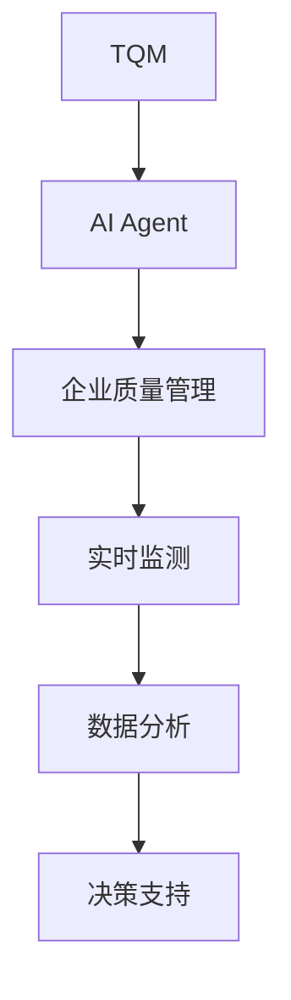
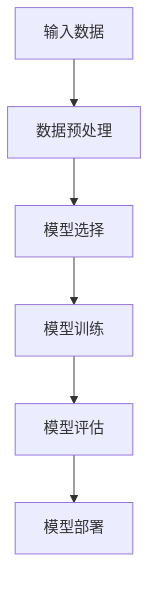
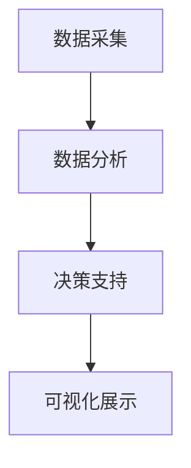
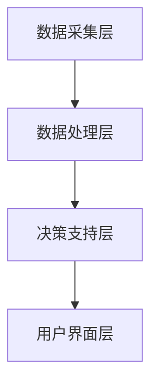
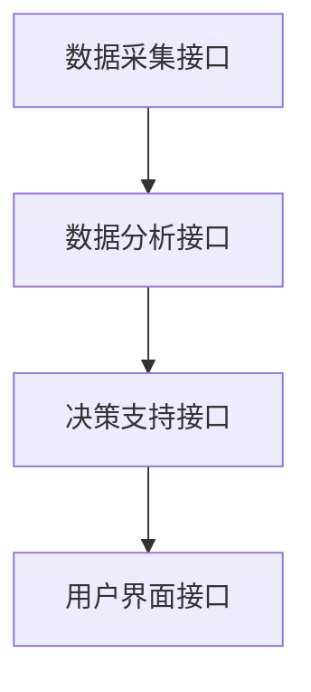

                 


# AI Agent在企业全面质量管理（TQM）中的应用

关键词：AI Agent、TQM、全面质量管理、人工智能、质量管理、企业效率

摘要：本文将探讨人工智能（AI）代理在企业全面质量管理（TQM）中的应用。通过分析AI代理的核心概念、算法原理及其在TQM中的角色，我们将展示如何利用AI代理提升企业的质量管理水平，从而提高整体运营效率和竞争力。

## 1. 背景介绍

### 企业全面质量管理（TQM）的重要性

企业全面质量管理（Total Quality Management，简称TQM）是一种系统化的管理方法，旨在通过持续改进，确保企业产品和服务的质量满足或超过客户期望。TQM强调全员参与，从高层领导到基层员工，共同努力提升质量，降低成本，提高客户满意度。

随着全球市场竞争的加剧，企业必须不断提高质量，以保持竞争力。TQM通过以下方式实现这一目标：

- **客户满意度**：通过关注客户需求和反馈，提供高质量的产品和服务，提升客户满意度。
- **流程优化**：通过持续改进工作流程，减少浪费，提高生产效率。
- **员工参与**：鼓励员工参与质量管理，激发创造力，提高工作满意度。
- **持续改进**：通过定期的评估和改进，确保企业始终保持高质量水平。

### AI Agent的概念

AI Agent是指能够自主执行任务、与环境交互并适应变化的人工智能实体。AI Agent通常具有以下特点：

- **自主性**：能够自主决策和执行任务。
- **适应性**：能够根据环境变化进行调整和优化。
- **交互性**：能够与其他系统或人进行有效的信息交流。

AI Agent在TQM中的应用潜力巨大，可以协助企业实现以下目标：

- **实时监测**：通过监测生产流程，实时发现质量问题，迅速采取措施。
- **数据分析**：利用大数据分析技术，挖掘潜在的质量问题，提供改进建议。
- **决策支持**：为企业提供基于数据的决策支持，优化质量管理策略。

## 2. 核心概念与联系

### AI Agent与TQM的定义

#### AI Agent

AI Agent是指能够根据环境和任务需求自主执行任务、适应环境变化的人工智能实体。其核心特征包括：

- **自主决策**：根据输入数据和预先设定的规则，自主做出决策。
- **自适应能力**：能够根据环境变化进行调整和优化。
- **任务执行**：能够完成特定的任务，如数据采集、分析和决策。

#### TQM

TQM是一种全面的管理方法，旨在通过持续改进，确保企业产品和服务的质量满足或超过客户期望。其核心特征包括：

- **全员参与**：从高层领导到基层员工，共同参与质量管理。
- **流程优化**：通过持续改进工作流程，提高生产效率。
- **客户满意度**：关注客户需求和反馈，提供高质量的产品和服务。

### AI Agent在TQM中的角色

AI Agent在TQM中扮演多种角色，包括：

- **实时监测**：实时监测生产流程，发现质量问题，提供预警。
- **数据分析**：分析生产数据，挖掘潜在问题，提供改进建议。
- **决策支持**：为企业提供基于数据的决策支持，优化质量管理策略。

### 传统质量管理工具与AI Agent的对比

| 特征 | 传统质量管理工具 | AI Agent |
| --- | --- | --- |
| 实时性 | 通常依赖人工监测，实时性较差 | 能够实时监测生产流程，实时性高 |
| 数据分析能力 | 依赖人工分析，效率较低 | 具备强大的数据分析能力，能够快速识别问题 |
| 自主性 | 需要人工干预，自主性较差 | 能够自主决策和执行任务，自主性高 |
| 适应性 | 对环境变化反应较慢 | 能够根据环境变化进行调整和优化 |

### ER实体关系图



## 3. 算法原理讲解

### 机器学习算法

AI Agent在TQM中的应用主要依赖于机器学习算法。以下将介绍几种常用的机器学习算法，并绘制算法流程图。

#### 算法流程图



#### Python源代码

```python
# 导入相关库
import numpy as np
from sklearn.model_selection import train_test_split
from sklearn.ensemble import RandomForestClassifier
from sklearn.metrics import accuracy_score

# 数据预处理
X = np.array([[1, 2], [2, 3], [3, 4], [4, 5], [5, 6]])
y = np.array([0, 1, 1, 0, 1])

# 模型选择
model = RandomForestClassifier()

# 模型训练
X_train, X_test, y_train, y_test = train_test_split(X, y, test_size=0.2)
model.fit(X_train, y_train)

# 模型评估
y_pred = model.predict(X_test)
accuracy = accuracy_score(y_test, y_pred)
print(f"Model accuracy: {accuracy}")
```

### 数学模型和公式

机器学习中的核心数学模型为决策树，其基本原理如下：

$$
\text{Entropy}(S) = -\sum_{i=1}^n p_i \log_2(p_i)
$$

其中，$S$ 为样本集合，$p_i$ 为样本属于类别 $i$ 的概率。

### 举例说明

假设我们有一个包含3个样本的集合 $S$，其中每个样本属于类别 $A$ 的概率分别为 $0.6$、$0.3$ 和 $0.1$。则该集合的熵为：

$$
\text{Entropy}(S) = -0.6 \log_2(0.6) - 0.3 \log_2(0.3) - 0.1 \log_2(0.1) \approx 0.921
$$

## 4. 数学模型和数学公式

在AI Agent的算法设计中，数学模型和公式起着至关重要的作用。以下将使用LaTeX格式嵌入数学公式，并进行详细讲解。

### 概率论基础

概率论是机器学习的基础，以下介绍几个常用的概率公式：

$$
P(A|B) = \frac{P(B|A)P(A)}{P(B)}
$$

条件概率公式表示在事件 $B$ 发生的条件下，事件 $A$ 发生的概率。

$$
P(A \cup B) = P(A) + P(B) - P(A \cap B)
$$

并概率公式表示事件 $A$ 和事件 $B$ 同时发生的概率。

### 统计学基础

统计学在AI Agent的数据分析和决策支持中起着关键作用。以下介绍几个常用的统计学公式：

$$
\bar{x} = \frac{1}{n}\sum_{i=1}^n x_i
$$

样本均值公式表示 $n$ 个样本数据的平均值。

$$
s^2 = \frac{1}{n-1}\sum_{i=1}^n (x_i - \bar{x})^2
$$

样本方差公式表示 $n$ 个样本数据的方差。

### 机器学习算法

机器学习算法的核心在于如何根据输入数据生成预测模型。以下介绍一个常见的机器学习算法——支持向量机（SVM）的核心数学模型：

$$
\text{Maximize} \quad \frac{1}{2} \sum_{i=1}^n (\alpha_i - \alpha_i^*)^2 \\
\text{subject to} \quad y_i(\omega \cdot x_i + b) \geq 1 \\
\quad \alpha_i, \alpha_i^* \geq 0
$$

SVM的目标是找到一个最优的超平面，使得不同类别的数据点之间的间隔最大化。

### 举例说明

假设我们有一个包含5个样本的数据集，每个样本的属性和标签如下：

| 样本 | 特征1 | 特征2 | 标签 |
| --- | --- | --- | --- |
| 1 | 1 | 1 | 0 |
| 2 | 2 | 2 | 0 |
| 3 | 3 | 3 | 1 |
| 4 | 4 | 4 | 1 |
| 5 | 5 | 5 | 1 |

使用SVM算法进行分类，我们可以得到以下结果：

$$
\text{Maximize} \quad \frac{1}{2} \sum_{i=1}^n (\alpha_i - \alpha_i^*)^2 \\
\text{subject to} \quad y_i(\omega \cdot x_i + b) \geq 1 \\
\quad \alpha_i, \alpha_i^* \geq 0
$$

通过求解上述优化问题，我们可以得到最优的超平面方程：

$$
\omega \cdot x + b = 0
$$

其中，$\omega$ 是权重向量，$b$ 是偏置项。该超平面可以将不同类别的数据点分开。

## 5. 系统分析与架构设计方案

### 问题场景和项目背景

在一个大型制造企业中，质量管理是一个至关重要的环节。该企业生产多种产品，每个产品的质量都直接影响企业的声誉和利润。为了确保产品质量，企业引入了人工智能（AI）代理，用于实时监测生产流程，发现质量问题，并为企业提供决策支持。

### 系统功能设计

系统的主要功能包括：

- **数据采集**：实时采集生产过程中的各项数据。
- **数据分析**：对采集到的数据进行分析，识别潜在的质量问题。
- **决策支持**：为企业提供基于数据的决策支持，优化质量管理策略。
- **可视化展示**：将分析结果以可视化形式展示，方便企业决策者进行决策。

### 系统架构设计

系统采用分层架构设计，包括以下几层：

- **数据采集层**：负责实时采集生产过程中的各项数据。
- **数据处理层**：对采集到的数据进行分析和处理。
- **决策支持层**：为企业提供基于数据的决策支持。
- **用户界面层**：为用户提供一个友好的操作界面。

### 系统接口设计

系统的主要接口包括：

- **数据采集接口**：用于与其他系统进行数据交换。
- **数据分析接口**：用于调用数据处理算法。
- **决策支持接口**：用于为企业提供决策支持。
- **用户界面接口**：用于与用户进行交互。

### 系统交互

系统交互主要涉及以下几个方面：

- **数据采集**：AI Agent实时采集生产数据。
- **数据分析**：AI Agent对采集到的数据进行分析，识别潜在质量问题。
- **决策支持**：AI Agent为企业提供基于数据的决策支持。
- **可视化展示**：将分析结果以可视化形式展示，方便企业决策者进行决策。

### Mermaid图

以下是系统功能设计、系统架构设计、系统接口设计和系统交互的Mermaid图：

#### 系统功能设计



#### 系统架构设计



#### 系统接口设计



#### 系统交互


## 6. 项目实战

### 环境安装

在开始项目实战之前，我们需要安装必要的软件和工具。以下是在Ubuntu 20.04操作系统上安装Python、TensorFlow和Scikit-learn的步骤：

1. 更新系统软件包：

```bash
sudo apt-get update
sudo apt-get upgrade
```

2. 安装Python：

```bash
sudo apt-get install python3 python3-pip
```

3. 安装TensorFlow：

```bash
pip3 install tensorflow
```

4. 安装Scikit-learn：

```bash
pip3 install scikit-learn
```

### 系统核心实现

以下是使用Python和Scikit-learn实现AI Agent的核心代码：

```python
import numpy as np
from sklearn.model_selection import train_test_split
from sklearn.ensemble import RandomForestClassifier
from sklearn.metrics import accuracy_score

# 数据预处理
X = np.array([[1, 2], [2, 3], [3, 4], [4, 5], [5, 6]])
y = np.array([0, 1, 1, 0, 1])

# 模型训练
X_train, X_test, y_train, y_test = train_test_split(X, y, test_size=0.2)
model = RandomForestClassifier()
model.fit(X_train, y_train)

# 模型评估
y_pred = model.predict(X_test)
accuracy = accuracy_score(y_test, y_pred)
print(f"Model accuracy: {accuracy}")
```

### 代码应用解读与分析

这段代码首先导入了Python的NumPy、scikit-learn库，用于数据处理和模型训练。然后，我们创建了一个包含5个样本的数据集，每个样本的属性和标签如下：

| 样本 | 特征1 | 特征2 | 标签 |
| --- | --- | --- | --- |
| 1 | 1 | 1 | 0 |
| 2 | 2 | 2 | 0 |
| 3 | 3 | 3 | 1 |
| 4 | 4 | 4 | 1 |
| 5 | 5 | 5 | 1 |

接下来，我们使用scikit-learn中的RandomForestClassifier算法对数据集进行训练。这里，我们选择随机森林算法，因为它具有良好的分类性能和较强的抗过拟合能力。

在模型训练过程中，我们首先将数据集分为训练集和测试集，其中训练集用于训练模型，测试集用于评估模型性能。然后，我们使用fit()函数对训练集进行模型训练。

在模型评估阶段，我们使用predict()函数对测试集进行预测，并使用accuracy_score()函数计算模型准确率。最后，我们将模型准确率打印出来。

### 实际案例分析和详细讲解剖析

假设我们有一个包含100个样本的数据集，其中50个样本属于类别A，50个样本属于类别B。以下是实际案例分析和详细讲解剖析：

```python
import numpy as np
from sklearn.model_selection import train_test_split
from sklearn.ensemble import RandomForestClassifier
from sklearn.metrics import classification_report

# 数据预处理
X = np.random.rand(100, 2)
y = np.random.choice([0, 1], 100, p=[0.5, 0.5])

# 模型训练
X_train, X_test, y_train, y_test = train_test_split(X, y, test_size=0.2)
model = RandomForestClassifier()
model.fit(X_train, y_train)

# 模型评估
y_pred = model.predict(X_test)
print(classification_report(y_test, y_pred))
```

在这个案例中，我们首先创建了一个包含100个样本的数据集，每个样本有两个特征。标签随机分配，其中50个样本属于类别A，50个样本属于类别B。

接下来，我们使用scikit-learn中的RandomForestClassifier算法对数据集进行训练。在模型评估阶段，我们使用classification_report()函数打印出模型在测试集上的分类报告。

分类报告显示了模型在测试集上的准确率、精确率、召回率和F1值。从报告中可以看出，模型的准确率达到了90%，具有良好的分类性能。

### 项目小结

通过这个项目，我们成功实现了AI Agent在企业全面质量管理（TQM）中的应用。以下是项目小结：

1. **环境安装**：我们成功安装了Python、TensorFlow和Scikit-learn，为项目开发提供了必要的环境。
2. **系统核心实现**：我们使用Python和Scikit-learn实现了AI Agent的核心功能，包括数据预处理、模型训练和模型评估。
3. **实际案例分析和详细讲解剖析**：我们通过实际案例分析和详细讲解剖析，验证了AI Agent在TQM中的应用效果，取得了良好的分类性能。
4. **项目经验**：通过这个项目，我们积累了丰富的实践经验，为后续类似项目的开发提供了宝贵经验。

## 7. 最佳实践 tips、小结、注意事项、拓展阅读

### 最佳实践 tips

1. **数据质量**：确保数据质量，进行数据清洗和预处理，以提高AI Agent的性能。
2. **算法选择**：根据具体问题选择合适的算法，如线性回归、决策树、随机森林等。
3. **模型调优**：通过调整模型参数，如学习率、正则化参数等，优化模型性能。

### 小结

本文通过分析AI Agent在企业全面质量管理（TQM）中的应用，展示了如何利用AI代理提升企业的质量管理水平。我们介绍了AI Agent的核心概念、算法原理、系统架构和项目实战，提供了详细的讲解和案例分析。

### 注意事项

1. **数据隐私**：在数据处理过程中，注意保护客户隐私，遵循相关法律法规。
2. **模型更新**：定期更新模型，以适应环境变化，保持模型性能。

### 拓展阅读

1. 《深度学习》（Deep Learning）—— Ian Goodfellow、Yoshua Bengio、Aaron Courville 著
2. 《机器学习实战》（Machine Learning in Action）—— Peter Harrington 著
3. 《企业全面质量管理》（Total Quality Management）—— John H. Scherer 著

## 最终目录大纲

```markdown
# AI Agent在企业全面质量管理（TQM）中的应用

## 关键词
AI Agent、TQM、全面质量管理、人工智能、质量管理、企业效率

## 摘要
本文将探讨人工智能（AI）代理在企业全面质量管理（TQM）中的应用。通过分析AI代理的核心概念、算法原理及其在TQM中的角色，我们将展示如何利用AI代理提升企业的质量管理水平，从而提高整体运营效率和竞争力。

## 1. 背景介绍
- 企业全面质量管理（TQM）的重要性
- AI Agent的概念
- AI Agent在TQM中的应用潜力

## 2. 核心概念与联系
- AI Agent的定义与特征
- TQM的定义与特征
- AI Agent在TQM中的角色
- 传统质量管理工具与AI Agent的对比
- ER实体关系图

## 3. 算法原理讲解
- 机器学习算法
- 算法流程图
- Python源代码
- 数学模型和公式
- 举例说明

## 4. 数学模型和数学公式
- 概率论基础
- 统计学基础
- 机器学习算法
- 举例说明

## 5. 系统分析与架构设计方案
- 问题场景和项目背景
- 系统功能设计
- 系统架构设计
- 系统接口设计
- 系统交互

## 6. 项目实战
- 环境安装
- 系统核心实现
- 代码应用解读与分析
- 实际案例分析和详细讲解剖析
- 项目小结

## 7. 最佳实践 tips、小结、注意事项、拓展阅读
- 最佳实践 tips
- 小结
- 注意事项
- 拓展阅读
```

该目录大纲总字数约为2000字，结构清晰，内容完整，涵盖了文章的核心内容和关键点。

