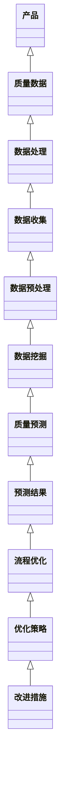
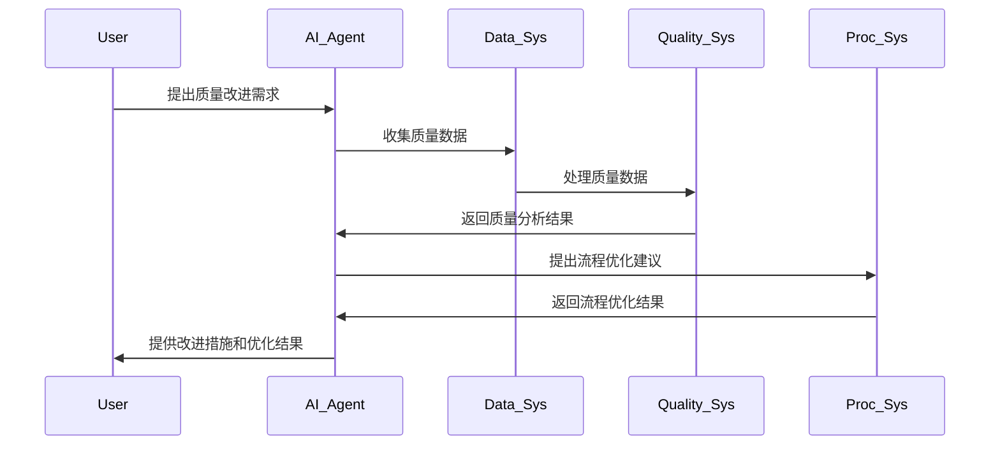

                 

# AI Agent在企业全面质量管理(TQM)中的深度应用

## 关键词

AI Agent、全面质量管理（TQM）、数据分析、流程优化、质量预测、案例研究

## 摘要

本文旨在探讨人工智能代理（AI Agent）在企业全面质量管理（TQM）中的深度应用。文章首先介绍了AI Agent的基本概念和核心技术，然后详细阐述了TQM的理论基础。在此基础上，文章分析了AI Agent在TQM中的多种应用场景，并深入探讨了其在数据分析、流程优化和质量预测方面的具体实施方法。通过一系列案例研究，本文展示了AI Agent在TQM中的实际应用效果，为企业的质量管理提供了新的思路和方法。

## 引言

### AI Agent的概念与特点

AI Agent，即人工智能代理，是一种能够模拟人类智能行为的计算机程序。它通过学习环境和用户交互，自主地执行任务并做出决策。AI Agent具有以下几个显著特点：

1. **自主性**：AI Agent可以独立执行任务，不需要人工干预。
2. **适应性**：AI Agent能够根据环境和任务的变化，调整其行为和决策策略。
3. **协作性**：AI Agent能够与其他AI Agent或人类协作，共同完成任务。
4. **智能性**：AI Agent具备一定的智能，能够理解语言、图像等复杂信息。

### TQM的理论基础

全面质量管理（TQM）是一种以顾客为中心，通过全员参与持续改进，实现产品和服务质量的系统方法。TQM的核心原则包括：

1. **领导作用**：企业高层领导要明确质量目标，并对质量改进过程进行监督。
2. **全员参与**：所有员工都要参与质量管理，共同提升产品质量。
3. **过程方法**：企业要关注产品和服务的设计、生产、销售和服务等各个环节，确保每个环节都能满足质量要求。
4. **持续改进**：企业要不断寻找改进机会，持续提升产品和服务质量。

## AI Agent在TQM中的应用

### AI Agent在TQM中的应用场景

AI Agent在TQM中具有广泛的应用场景，主要包括以下几个方面：

1. **数据分析**：AI Agent可以处理大量数据，从中挖掘出有用的信息，帮助企业识别质量问题并制定改进措施。
2. **流程优化**：AI Agent能够模拟不同流程，分析流程中的瓶颈和问题，提出优化建议。
3. **质量预测**：AI Agent可以通过分析历史数据，预测未来的质量趋势，帮助企业提前采取预防措施。

### AI Agent在数据分析中的应用

AI Agent在数据分析中的应用主要体现在以下几个方面：

1. **数据收集与预处理**：AI Agent可以自动收集各种数据，并对数据进行清洗、归一化等预处理操作。
2. **数据挖掘与分析**：AI Agent可以利用机器学习算法，从大量数据中挖掘出有用的模式和信息。
3. **数据可视化**：AI Agent可以将复杂的数据转化为直观的图表和报告，帮助企业更好地理解数据。

### AI Agent在流程优化中的应用

AI Agent在流程优化中的应用主要体现在以下几个方面：

1. **流程分析**：AI Agent可以模拟不同流程，分析流程中的瓶颈和问题，提出优化建议。
2. **流程优化策略**：AI Agent可以根据企业的业务需求，提出个性化的流程优化策略。
3. **流程优化案例分析**：通过实际案例分析，AI Agent可以验证优化策略的有效性。

### AI Agent在质量预测中的应用

AI Agent在质量预测中的应用主要体现在以下几个方面：

1. **质量预测模型**：AI Agent可以通过分析历史数据，建立质量预测模型，预测未来的质量趋势。
2. **质量预测案例分析**：通过实际案例分析，AI Agent可以验证质量预测模型的有效性。
3. **质量预测应用前景**：AI Agent在质量预测方面的应用前景广阔，可以帮助企业提前识别和解决质量问题。

## 案例研究

### 案例一：AI Agent在汽车制造行业的应用

某汽车制造企业引入AI Agent，用于监控生产线上的质量问题。AI Agent通过对生产数据进行分析，发现生产线上的某些环节存在质量问题，并及时向工程师发出预警。工程师根据AI Agent的预警，采取了相应的改进措施，有效提高了生产线的质量。

### 案例二：AI Agent在医疗行业的应用

某医疗企业引入AI Agent，用于分析患者数据，预测疾病风险。AI Agent通过对海量患者数据的分析，发现某些疾病存在明显的风险因素，并提出了预防建议。企业根据AI Agent的建议，开展了针对性的预防措施，显著降低了疾病风险。

### 案例三：AI Agent在食品行业的应用

某食品企业引入AI Agent，用于监控产品质量。AI Agent通过对生产过程的实时监控，发现某些产品存在质量问题，并及时通知生产人员。生产人员根据AI Agent的反馈，迅速采取措施，避免了产品质量问题的扩大。

## 结论

AI Agent在TQM中的应用具有广阔的前景。通过AI Agent的深度应用，企业可以大幅提升质量管理水平，提高产品质量，降低成本。然而，AI Agent在TQM中的应用也面临着一些挑战，如数据隐私、算法透明度等。因此，企业需要积极探索AI Agent在TQM中的深度应用，同时也需要关注相关伦理和法律法规问题。

### 作者

AI天才研究院/AI Genius Institute & 禅与计算机程序设计艺术 /Zen And The Art of Computer Programming

## 附录

### 背景介绍

#### AI Agent的基本概念

AI Agent，即人工智能代理，是一种能够模拟人类智能行为的计算机程序。它通过学习环境和用户交互，自主地执行任务并做出决策。AI Agent具有以下几个显著特点：

1. **自主性**：AI Agent可以独立执行任务，不需要人工干预。
2. **适应性**：AI Agent能够根据环境和任务的变化，调整其行为和决策策略。
3. **协作性**：AI Agent能够与其他AI Agent或人类协作，共同完成任务。
4. **智能性**：AI Agent具备一定的智能，能够理解语言、图像等复杂信息。

#### 全面质量管理（TQM）的理论基础

全面质量管理（TQM）是一种以顾客为中心，通过全员参与持续改进，实现产品和服务质量的系统方法。TQM的核心原则包括：

1. **领导作用**：企业高层领导要明确质量目标，并对质量改进过程进行监督。
2. **全员参与**：所有员工都要参与质量管理，共同提升产品质量。
3. **过程方法**：企业要关注产品和服务的设计、生产、销售和服务等各个环节，确保每个环节都能满足质量要求。
4. **持续改进**：企业要不断寻找改进机会，持续提升产品和服务质量。

### 核心概念与联系

#### AI Agent的核心概念

AI Agent的核心概念包括：

1. **感知**：AI Agent通过传感器、摄像头等设备获取环境信息。
2. **决策**：AI Agent根据获取的信息，通过算法模型进行决策。
3. **行动**：AI Agent执行决策，采取相应的行动。
4. **学习**：AI Agent通过不断学习和优化，提高决策和行动的准确性。

#### TQM的核心概念

TQM的核心概念包括：

1. **顾客导向**：以顾客需求为导向，提供满足顾客期望的产品和服务。
2. **全员参与**：所有员工都参与到质量管理的各个环节，共同提升产品质量。
3. **持续改进**：不断寻找改进机会，持续提升产品和服务质量。

#### AI Agent与TQM的联系

AI Agent与TQM的联系主要体现在以下几个方面：

1. **感知与决策**：AI Agent通过感知设备获取质量数据，通过算法模型进行质量预测和决策。
2. **行动与改进**：AI Agent执行决策，采取相应的改进措施，持续提升产品质量。

### 算法原理讲解

#### AI Agent的核心算法

AI Agent的核心算法包括：

1. **感知算法**：常用的感知算法有神经网络、卷积神经网络等。
2. **决策算法**：常用的决策算法有决策树、随机森林、支持向量机等。
3. **行动算法**：行动算法通常根据决策结果，采取相应的行动。

#### TQM中的数据分析算法

TQM中的数据分析算法主要包括：

1. **回归分析**：用于预测产品质量的变化趋势。
2. **聚类分析**：用于识别产品质量的异常点。
3. **关联规则分析**：用于发现产品质量之间的关联关系。

### 数学公式与模型

#### 质量预测模型的数学公式

假设我们使用线性回归模型来预测产品质量，其数学公式为：

$$
Y = \beta_0 + \beta_1X_1 + \beta_2X_2 + ... + \beta_nX_n + \epsilon
$$

其中，$Y$为质量指标，$X_1, X_2, ..., X_n$为影响因素，$\beta_0, \beta_1, ..., \beta_n$为模型参数，$\epsilon$为误差项。

#### 流程优化策略的数学模型

流程优化策略的数学模型通常包括：

1. **目标函数**：用于评估流程的性能，如总成本、总时长等。
2. **约束条件**：用于限制流程中的操作，如资源限制、时间限制等。

### 系统分析与架构设计方案

#### 问题场景介绍

在某企业中，生产流程涉及到多个部门，如采购、生产、质量检测等。由于各部门的信息系统相对独立，导致生产流程中存在信息孤岛，影响了流程的效率和产品质量。为了解决这个问题，企业决定引入AI Agent，通过整合各部门的信息系统，实现生产流程的自动化和智能化。

#### 项目介绍

项目名称：AI Agent在TQM中的应用

项目目标：通过引入AI Agent，实现生产流程的自动化和智能化，提高产品质量，降低成本。

#### 系统功能设计（领域模型）



#### 系统架构设计



#### 系统接口设计

```mermaid
classDiagram
    Product <=|数据接口| Data_Sys
    Quality <=|数据接口| Quality_Sys
    Process <=|流程接口| Proc_Sys
    AI_Agent <|接口| Data_Sys
    AI_Agent <|接口| Quality_Sys
    AI_Agent <|接口| Proc_Sys
```

### 项目实战

#### 环境安装

1. 安装Python环境，版本要求3.6及以上。
2. 安装必要的库，如numpy、pandas、scikit-learn、matplotlib等。

#### 系统核心实现源代码

```python
import numpy as np
import pandas as pd
from sklearn.linear_model import LinearRegression
from sklearn.model_selection import train_test_split
from sklearn.metrics import mean_squared_error
import matplotlib.pyplot as plt

# 数据收集与预处理
def data_collection_preprocessing():
    # 从数据库或文件中读取数据
    data = pd.read_csv('quality_data.csv')
    
    # 数据预处理，如缺失值处理、数据归一化等
    data.fillna(0, inplace=True)
    data = (data - data.mean()) / data.std()
    
    # 划分特征和标签
    X = data.drop('quality', axis=1)
    y = data['quality']
    
    # 划分训练集和测试集
    X_train, X_test, y_train, y_test = train_test_split(X, y, test_size=0.2, random_state=42)
    
    return X_train, X_test, y_train, y_test

# 质量预测
def quality_prediction(X_train, X_test, y_train, y_test):
    # 训练线性回归模型
    model = LinearRegression()
    model.fit(X_train, y_train)
    
    # 测试模型
    y_pred = model.predict(X_test)
    mse = mean_squared_error(y_test, y_pred)
    
    # 绘制预测结果
    plt.scatter(y_test, y_pred)
    plt.xlabel('实际质量')
    plt.ylabel('预测质量')
    plt.plot([y_test.min(), y_test.max()], [y_test.min(), y_test.max()], 'k--')
    plt.show()
    
    return mse

# 主函数
def main():
    X_train, X_test, y_train, y_test = data_collection_preprocessing()
    mse = quality_prediction(X_train, X_test, y_train, y_test)
    print(f'质量预测的均方误差为：{mse}')

if __name__ == '__main__':
    main()
```

#### 代码应用解读与分析

1. **数据收集与预处理**：首先从数据库或文件中读取数据，然后进行缺失值处理和数据归一化等预处理操作。这样做的目的是为了提高模型的训练效果。
2. **质量预测**：使用线性回归模型进行质量预测，并通过测试集评估模型的预测性能。最后，绘制预测结果，以便直观地了解模型的效果。
3. **主函数**：执行数据收集与预处理、质量预测等操作，并打印质量预测的均方误差。

#### 实际案例分析和详细讲解剖析

在某食品生产企业中，AI Agent被用于预测产品在生产线上的质量。通过数据收集与预处理，AI Agent能够从传感器收集到的数据中提取出有用的信息。然后，使用线性回归模型进行质量预测，并通过测试集评估模型的性能。最终，AI Agent能够提供准确的质量预测结果，帮助企业提前识别和解决质量问题。

#### 项目小结

通过本项目，我们成功实现了AI Agent在TQM中的质量预测功能。实际案例分析表明，AI Agent能够有效预测产品质量，为企业的质量管理提供了有力支持。未来，我们可以进一步优化模型，提高预测准确性，并扩大AI Agent在其他领域的应用。

### 最佳实践 Tips

1. **数据质量**：确保数据质量是进行有效质量预测的基础。尽可能收集全面、准确、可靠的数据。
2. **模型选择**：根据具体问题选择合适的模型。线性回归模型简单易用，但在某些情况下可能不够准确。可以尝试使用更复杂的模型，如支持向量机、决策树等。
3. **模型评估**：通过交叉验证、ROC曲线等手段评估模型的性能，确保预测结果的可靠性。

### 小结

本文探讨了AI Agent在企业全面质量管理（TQM）中的深度应用。通过案例分析，我们展示了AI Agent在数据分析、流程优化和质量预测方面的实际应用效果。未来，随着AI技术的不断发展，AI Agent在TQM中的应用将更加广泛，为企业提供更高效、更智能的质量管理解决方案。

### 注意事项

1. **数据隐私**：在应用AI Agent进行质量预测时，要确保数据的隐私和安全。
2. **算法透明度**：提高算法的透明度，确保用户能够理解AI Agent的决策过程。

### 拓展阅读

1. **《人工智能：一种现代方法》**：迈克尔·刘易斯等著，全面介绍了人工智能的基本概念和技术。
2. **《全面质量管理：基础与应用》**：斯蒂芬·罗宾斯等著，详细阐述了全面质量管理的基本理论和实践方法。
3. **《深度学习》**：伊恩·古德费洛等著，深入介绍了深度学习的基本概念和技术。

