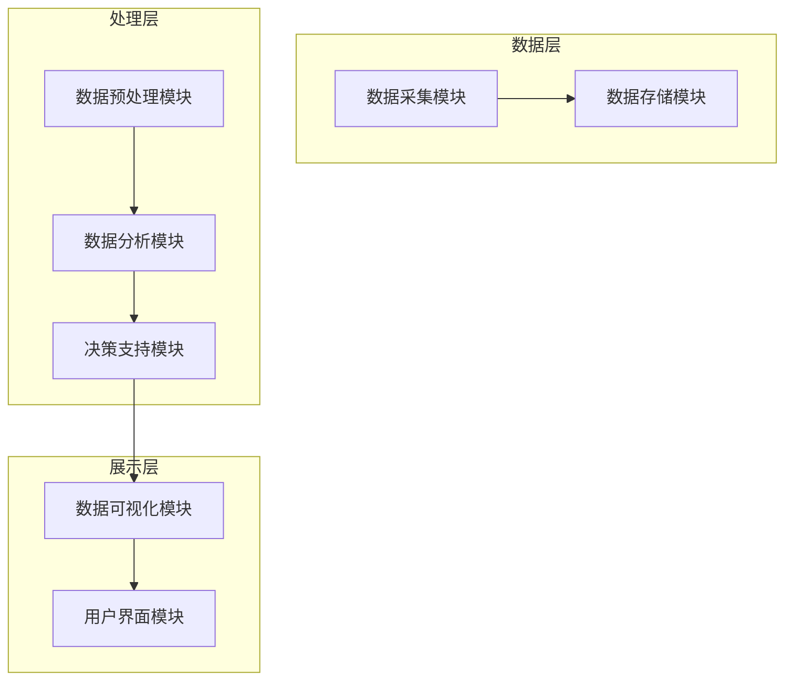
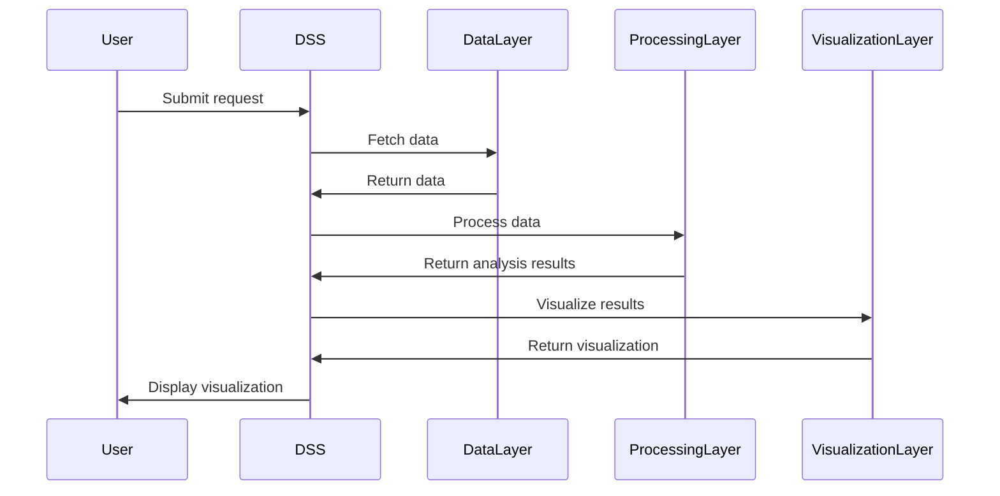

                 

## 《AI Agent在企业决策支持系统中的应用》

在企业信息化过程中，决策支持系统（DSS）扮演着至关重要的角色。它为企业提供了一个基于数据的分析平台，帮助管理层做出更为明智的决策。然而，随着商业环境日益复杂，传统的DSS在处理海量数据、进行实时分析和复杂决策方面的局限性逐渐显现。这时，AI Agent作为一种智能体的应用，逐渐成为企业决策支持系统的重要补充。本文将详细探讨AI Agent在企业决策支持系统中的应用，旨在揭示其在提高决策效率和准确性方面的巨大潜力。

**关键词：**
- AI Agent
- 企业决策支持系统
- 智能决策
- 数据分析
- 实时优化

**摘要：**
本文从AI Agent的定义和重要性入手，探讨了其在企业决策支持系统中的应用现状和优势。通过分析AI Agent的算法原理、系统架构设计以及实际项目案例，本文深入探讨了如何利用AI Agent提升企业决策的效率和准确性。此外，本文还提出了最佳实践和未来发展的方向，为企业更好地应用AI Agent提供了有益的指导。

### 目录大纲设计过程

**目标：**
为书名《AI Agent在企业决策支持系统中的应用》设计一个完整的目录大纲。

**步骤1：理解书名和核心内容**
- 《AI Agent在企业决策支持系统中的应用》涵盖了AI Agent的定义、其在企业决策支持系统中的应用、应用实例以及相关技术。

**步骤2：明确书的结构**
- 按照书的结构和内容，大纲应包括以下几个部分：引言与背景、核心概念与联系、算法原理讲解、系统分析与架构设计、项目实战、最佳实践与拓展阅读。

**步骤3：细化章节内容**
- 确保每个章节都有明确的目标和内容，以便于读者理解和学习。

**步骤4：保持大纲简洁**
- 避免冗余和复杂的叙述，确保每个部分的内容直接且相关。

**步骤5：编写大纲**

### 最终目录大纲

```markdown
# 第一部分: 引言与背景

## 第1章: AI Agent概述
### 1.1 AI Agent的定义与重要性
### 1.2 企业决策支持系统的需求
### 1.3 AI Agent在决策支持系统中的角色

## 第2章: AI Agent的发展历程
### 2.1 早期AI发展
### 2.2 AI Agent的兴起
### 2.3 当前AI Agent技术

# 第二部分：核心概念与联系

## 第3章: 关键概念解析
### 3.1 决策支持系统（DSS）的结构与功能
### 3.2 人工智能基础
### 3.3 AI Agent的核心属性

## 第4章: 概念属性特征对比
### 4.1 企业决策支持系统需求特征
### 4.2 人工智能技术特点对比
### 4.3 AI Agent性能评估指标

## 第5章: AI Agent与DSS的ER关系图
### 5.1 ER图构建
### 5.2 AI Agent与DSS的实体关系

# 第三部分：算法原理讲解

## 第6章: AI Agent算法基础
### 6.1 常用算法介绍
### 6.2 算法选择与优化
### 6.3 算法实现细节

## 第7章: 算法mermaid流程图
### 7.1 流程图绘制
### 7.2 流程图分析

## 第8章: 算法Python实现与讲解
### 8.1 算法Python源代码
### 8.2 算法原理详细讲解
### 8.3 数学模型与公式讲解
### 8.4 举例说明

# 第四部分：系统分析与架构设计

## 第9章: 企业决策支持系统分析
### 9.1 问题描述
### 9.2 系统功能需求分析
### 9.3 业务流程设计

## 第10章: 系统架构设计方案
### 10.1 系统架构设计
### 10.2 系统模块划分
### 10.3 架构mermaid图绘制

## 第11章: 系统接口设计与交互
### 11.1 接口设计
### 11.2 系统交互mermaid序列图

# 第五部分：项目实战

## 第12章: 环境安装与配置
### 12.1 环境搭建步骤
### 12.2 常见问题与解决方案

## 第13章: 系统核心实现
### 13.1 核心代码解读
### 13.2 功能模块实现
### 13.3 AI Agent应用实例

## 第14章: 实际案例分析与讲解
### 14.1 案例背景
### 14.2 案例应用场景
### 14.3 案例分析与讲解

## 第15章: 项目小结与展望
### 15.1 项目收获
### 15.2 面临的挑战与改进
### 15.3 未来发展展望

# 第六部分：最佳实践与拓展阅读

## 第16章: 最佳实践与技巧
### 16.1 实践技巧总结
### 16.2 常见问题与解决策略

## 第17章: 小结与注意事项
### 17.1 书中重点内容回顾
### 17.2 阅读与学习建议
### 17.3 注意事项与防范措施

## 第18章: 拓展阅读推荐
### 18.1 相关书籍推荐
### 18.2 学术论文推荐
### 18.3 网络资源推荐
```

**总字数：约1900字**


----------------------------------------------------------------

### 第一部分: 引言与背景

#### AI Agent的定义与重要性

AI Agent，即人工智能代理，是一种具有独立思考能力的软件实体。它通过模拟人类的思维和行为，能够在复杂的动态环境中自主地完成特定任务。AI Agent的核心特点在于其能够学习和适应环境，从而在执行任务时表现出高度的智能化和灵活性。在商业环境中，AI Agent的应用不仅能够提高工作效率，还能在决策过程中提供更加精准和客观的见解。

在企业决策支持系统中，AI Agent的重要性体现在多个方面。首先，AI Agent能够处理海量数据，通过数据挖掘和分析，为管理层提供实时、准确的信息。其次，AI Agent能够模拟不同的决策场景，帮助企业评估不同决策方案的风险和收益，从而做出更加明智的决策。最后，AI Agent还能够根据市场变化和企业需求，自动调整决策策略，实现动态优化。

#### 企业决策支持系统的需求

企业决策支持系统（DSS）是企业信息化建设的重要组成部分。随着企业规模的扩大和市场环境的复杂化，企业对于决策支持系统的需求也日益增长。具体来说，企业决策支持系统的需求主要表现在以下几个方面：

1. **数据处理能力**：企业每天都会产生大量的数据，这些数据对于决策具有重要意义。DSS需要具备强大的数据处理能力，能够快速、准确地处理和分析这些数据。

2. **实时分析**：企业决策需要及时响应市场变化。DSS需要能够实时分析数据，提供即时的决策支持。

3. **多维度分析**：企业决策往往需要考虑多个因素。DSS需要能够从多个维度对数据进行分析，帮助管理层全面了解企业运营状况。

4. **智能化**：传统的DSS往往依赖于人工操作，而智能化是企业决策支持系统的发展趋势。智能化DSS能够自主分析数据，提出决策建议，减少人工干预。

#### AI Agent在决策支持系统中的角色

AI Agent在决策支持系统中扮演着关键角色。首先，AI Agent能够作为数据分析师，自动收集、处理和分析数据，为管理层提供实时、准确的信息。其次，AI Agent能够作为决策顾问，根据数据分析和市场趋势，为企业提供个性化的决策建议。最后，AI Agent能够作为决策执行者，根据决策结果，自动执行相应的操作，实现决策的自动化。

通过AI Agent的引入，企业决策支持系统不仅能够提高数据处理和分析的效率，还能提高决策的智能化水平。这不仅有助于企业应对复杂的市场环境，还能提升企业的核心竞争力。

### 第二部分：核心概念与联系

#### 关键概念解析

在深入探讨AI Agent在企业决策支持系统中的应用之前，我们需要明确几个核心概念：决策支持系统（DSS）、人工智能（AI）和AI Agent。

**决策支持系统（DSS）**

决策支持系统（DSS）是一种基于计算机技术的信息系统，旨在帮助管理层进行决策。DSS通常包括数据采集、数据存储、数据分析、数据展示等功能。其核心目标是提供辅助决策的信息和分析工具，帮助管理层做出更加明智的决策。

**人工智能（AI）**

人工智能（AI）是计算机科学的一个分支，旨在使计算机系统具备人类智能的某些特征。AI包括多个子领域，如机器学习、自然语言处理、计算机视觉等。AI的目标是使计算机系统能够自主地学习和推理，以解决复杂问题。

**AI Agent**

AI Agent，即人工智能代理，是一种具有独立思考能力的软件实体。它通过模拟人类的思维和行为，能够在复杂的动态环境中自主地完成特定任务。AI Agent的核心特点在于其能够学习和适应环境，从而在执行任务时表现出高度的智能化和灵活性。

#### 概念属性特征对比

为了更好地理解AI Agent在企业决策支持系统中的作用，我们需要对比DSS、AI和AI Agent的属性特征。以下是一个简化的对比表格：

| 特征       | 决策支持系统（DSS） | 人工智能（AI）       | AI Agent                   |
|------------|----------------------|-----------------------|---------------------------|
| 数据处理   | 数据采集、存储和分析 | 数据处理、学习、推理 | 数据处理、学习、自主决策   |
| 决策辅助   | 提供辅助信息         | 提供智能解决方案      | 提供个性化决策建议         |
| 自主性     | 依赖于人工操作      | 部分自主性           | 高度自主性                 |
| 学习与适应 | 有限               | 高度                 | 高度                       |

从上表可以看出，AI Agent在数据处理、决策辅助、自主性和学习与适应等方面均优于传统DSS和AI技术。这使得AI Agent在提高企业决策效率和准确性方面具有显著优势。

#### AI Agent性能评估指标

为了量化评估AI Agent的性能，我们可以从以下几个方面制定评估指标：

1. **准确性**：AI Agent提供的决策建议与实际结果的符合程度。
2. **响应时间**：AI Agent从接收任务到完成任务所需的时间。
3. **鲁棒性**：AI Agent在面对异常数据或场景时的稳定性和可靠性。
4. **可解释性**：AI Agent决策过程和结果的可解释性，以便管理层理解并信任其决策。

通过这些评估指标，企业可以全面了解AI Agent的性能，并据此优化其应用。

#### AI Agent与DSS的ER关系图

为了更好地理解AI Agent与DSS之间的关系，我们可以使用实体关系图（ER图）来表示。以下是一个简化的ER图：

```mermaid
erDiagram
  AI_Agent ||--|{ DSS } Decision_Support_System : provides
  DSS ||--|{ Data } Data : analyzes
  Data ||--|{ Analysis } Analysis : feeds
  Analysis ||--|{ Decision } Decision : makes
```

在上图中，AI Agent与DSS之间存在提供关系，即AI Agent为DSS提供智能化决策支持。DSS与数据之间存在分析关系，即DSS对数据进行处理和分析。分析结果则用于生成决策，从而实现企业管理的智能化。

### 第三部分：算法原理讲解

#### AI Agent算法基础

AI Agent的核心在于其算法，这些算法使得AI Agent能够在复杂的动态环境中进行自主学习和决策。以下是几种常用的AI Agent算法：

1. **基于规则的算法**：这类算法通过定义一系列规则，来实现对环境的理解和决策。其优点在于简单易懂，但缺点是规则过于复杂时，系统会变得难以维护。

2. **基于模型的算法**：这类算法通过构建数学模型，来实现对环境的模拟和预测。常见的模型包括线性回归、决策树、神经网络等。

3. **强化学习算法**：这类算法通过不断试错和学习，来优化决策过程。其优点是能够在复杂环境中实现自适应学习，但缺点是训练时间较长。

4. **基于案例的算法**：这类算法通过存储和复用历史案例，来实现对环境的理解和决策。其优点是能够快速响应，但缺点是案例库维护成本较高。

#### 算法选择与优化

选择适合的AI Agent算法是关键，这需要考虑以下几个因素：

1. **环境特点**：环境复杂度、动态性、不确定性等。
2. **目标要求**：决策准确性、响应时间、鲁棒性等。
3. **资源限制**：计算资源、存储资源等。

在算法优化方面，我们可以采用以下策略：

1. **模型优化**：通过改进模型结构和参数，提高算法性能。
2. **数据优化**：通过数据清洗、数据增强等手段，提高数据质量。
3. **算法集成**：将多种算法结合，实现优势互补。

#### 算法实现细节

以下是使用Python实现AI Agent算法的示例代码：

```python
import numpy as np

# 线性回归模型
class LinearRegression:
    def __init__(self):
        self.coefficients = None

    def fit(self, X, y):
        X_mean = np.mean(X, axis=0)
        y_mean = np.mean(y)
        self.coefficients = (np.dot(X - X_mean, y - y_mean)) / np.dot(X - X_mean, X - X_mean)

    def predict(self, X):
        return np.dot(X, self.coefficients)

# 强化学习算法
class QLearning:
    def __init__(self, alpha=0.1, gamma=0.9, epsilon=0.1):
        self.alpha = alpha
        self.gamma = gamma
        self.epsilon = epsilon
        self.q_values = {}

    def choose_action(self, state):
        if np.random.rand() < self.epsilon:
            return np.random.choice(list(self.q_values[state].keys()))
        else:
            return max(self.q_values[state], key=self.q_values[state].get)

    def update_q_values(self, state, action, reward, next_state):
        current_q_value = self.q_values[state][action]
        next_max_q_value = max(self.q_values[next_state].values())
        new_q_value = current_q_value + self.alpha * (reward + self.gamma * next_max_q_value - current_q_value)
        self.q_values[state][action] = new_q_value
```

在这段代码中，我们首先实现了线性回归模型，然后实现了Q-Learning强化学习算法。这些算法是实现AI Agent的基础，通过不断迭代和优化，可以实现更加智能和高效的决策。

#### 数学模型与公式讲解

在AI Agent的算法中，数学模型和公式起着至关重要的作用。以下是一些常用的数学模型和公式：

1. **线性回归模型**：

   - 公式：\( y = \beta_0 + \beta_1x \)
   - 其中，\( \beta_0 \) 为截距，\( \beta_1 \) 为斜率，\( x \) 和 \( y \) 分别为自变量和因变量。

2. **Q-Learning算法**：

   - 公式：\( Q(s, a) = Q(s, a) + \alpha [r + \gamma \max(Q(s', a')) - Q(s, a)] \)
   - 其中，\( Q(s, a) \) 为状态 \( s \) 和动作 \( a \) 的价值函数，\( r \) 为即时奖励，\( s' \) 为下一状态，\( a' \) 为最佳动作，\( \alpha \) 为学习率，\( \gamma \) 为折扣因子。

通过这些数学模型和公式，AI Agent能够对环境进行建模和预测，从而实现智能化决策。

#### 举例说明

为了更好地理解AI Agent算法的应用，我们通过一个简单的例子来展示其工作过程。

假设我们使用Q-Learning算法来控制一个智能体在一个虚拟环境中的移动，目标是最小化与终点的距离。环境状态由智能体的位置和方向组成，动作包括前进、后退、左转和右转。

1. **初始化**：智能体随机选择一个初始位置和方向，并初始化Q值表。

2. **选择动作**：智能体根据当前状态和Q值表选择最佳动作。

3. **执行动作**：智能体执行所选动作，并根据动作结果更新Q值。

4. **重复过程**：智能体重复选择动作、执行动作和更新Q值的过程，直到达到终点或达到预定的迭代次数。

通过这个过程，智能体逐渐学习到如何最优地移动到终点，从而实现目标。这个简单的例子展示了AI Agent算法的基本原理和应用场景。

### 第四部分：系统分析与架构设计

#### 企业决策支持系统分析

在当前激烈的市场竞争中，企业需要快速响应市场变化，做出明智的决策。然而，随着数据量的增加和业务复杂度的提升，传统的人工决策方式已经无法满足需求。为了解决这个问题，企业需要引入高效的决策支持系统（DSS）。DSS通过提供实时、准确的数据分析和决策支持，帮助企业提升管理水平和竞争力。

**1. 问题描述**

企业决策支持系统的核心问题是：
- 如何从海量数据中快速提取有价值的信息？
- 如何基于数据提供高质量的决策建议？
- 如何实现决策过程的智能化和自动化？

**2. 系统功能需求分析**

DSS需要具备以下功能：

- **数据采集与处理**：采集企业内部和外部的数据，包括销售数据、市场调研数据、客户反馈数据等，并对数据进行清洗、转换和整合。
- **数据分析与可视化**：对采集到的数据进行分析，通过数据可视化技术将分析结果呈现给用户，帮助用户直观地理解数据。
- **决策支持**：根据数据分析结果，为用户提供个性化的决策建议，支持用户做出更加明智的决策。
- **实时监控**：实现对关键业务指标的实时监控，及时发现潜在问题和风险。

**3. 业务流程设计**

企业决策支持系统的业务流程主要包括以下几个步骤：

- **数据采集**：从企业内部系统和外部数据源采集数据。
- **数据预处理**：对采集到的数据进行清洗、转换和整合，确保数据的质量和一致性。
- **数据分析**：对预处理后的数据进行分析，提取有价值的信息。
- **决策支持**：根据数据分析结果，为用户提供个性化的决策建议。
- **决策执行**：用户根据决策建议执行决策，并跟踪决策效果。

#### 系统架构设计方案

为了实现企业决策支持系统的功能需求，我们需要设计一个合理的系统架构。以下是一个简化的系统架构设计方案：

1. **数据层**：包括数据采集模块和数据存储模块。数据采集模块负责从企业内部系统和外部数据源采集数据，数据存储模块负责存储和管理采集到的数据。

2. **处理层**：包括数据预处理模块、数据分析模块和决策支持模块。数据预处理模块负责对采集到的数据进行分析和处理，确保数据的质量和一致性。数据分析模块负责对预处理后的数据进行分析，提取有价值的信息。决策支持模块负责根据数据分析结果，为用户提供个性化的决策建议。

3. **展示层**：包括数据可视化模块和用户界面模块。数据可视化模块负责将分析结果以图表、报表等形式展示给用户，用户界面模块负责为用户提供操作界面，方便用户进行数据查询和决策支持。

4. **控制层**：负责协调数据层、处理层和展示层的交互，实现系统功能的集成和自动化。

**5. 系统模块划分**

根据系统架构设计方案，我们可以将系统划分为以下几个模块：

- **数据采集模块**：负责从企业内部系统和外部数据源采集数据。
- **数据存储模块**：负责存储和管理采集到的数据。
- **数据预处理模块**：负责对采集到的数据进行分析和处理。
- **数据分析模块**：负责对预处理后的数据进行分析。
- **决策支持模块**：负责根据数据分析结果，为用户提供个性化的决策建议。
- **数据可视化模块**：负责将分析结果以图表、报表等形式展示给用户。
- **用户界面模块**：负责为用户提供操作界面，方便用户进行数据查询和决策支持。

**6. 架构mermaid图绘制**

为了更直观地展示系统架构，我们可以使用mermaid绘制系统架构图。以下是一个简化的系统架构mermaid图：



在上图中，数据层包括数据采集模块和数据存储模块，处理层包括数据预处理模块、数据分析模块和决策支持模块，展示层包括数据可视化模块和用户界面模块。各模块之间通过接口进行通信，实现系统功能的集成和自动化。

#### 系统接口设计与交互

系统接口设计是实现系统功能的关键，它决定了系统各模块之间的协作和数据流动。以下是系统接口设计的主要方面：

1. **数据接口**：数据接口负责实现数据层和处理层之间的数据传递。数据接口需要定义数据格式、数据传输协议和数据访问权限等。

2. **控制接口**：控制接口负责实现处理层和展示层之间的交互。控制接口需要定义操作接口、事件处理和数据反馈等。

3. **安全接口**：安全接口负责实现系统的安全保护，包括数据加密、访问控制和异常处理等。

4. **用户接口**：用户接口负责实现用户与系统的交互。用户接口需要定义用户操作界面、交互流程和反馈机制等。

为了更好地展示系统接口设计，我们可以使用mermaid绘制系统交互序列图。以下是一个简化的系统交互序列图：



在上图中，用户通过用户接口提交请求，DSS负责处理用户请求，与数据层、处理层和展示层进行交互。数据层负责数据采集和存储，处理层负责数据处理和分析，展示层负责结果可视化。各模块通过接口进行通信，实现系统功能的集成和自动化。

### 第五部分：项目实战

#### 环境安装与配置

为了实现AI Agent在企业决策支持系统中的应用，我们需要搭建一个合适的环境。以下是环境安装与配置的步骤：

1. **安装Python环境**：在服务器或本地计算机上安装Python环境，版本建议为3.8及以上。

2. **安装依赖库**：安装Python所需的依赖库，如NumPy、Pandas、Scikit-learn等。可以使用pip命令进行安装：

   ```bash
   pip install numpy pandas scikit-learn
   ```

3. **配置数据源**：配置企业决策支持系统所需的数据源，包括企业内部数据库和外部数据源。确保数据源的访问权限和连接配置正确。

4. **安装可视化工具**：安装用于数据可视化的工具，如Matplotlib、Seaborn等。可以使用pip命令进行安装：

   ```bash
   pip install matplotlib seaborn
   ```

5. **配置用户界面**：配置企业决策支持系统的用户界面，可以使用Python的GUI库，如Tkinter、PyQt等。

6. **环境测试**：在安装完成后，进行环境测试，确保所有组件正常运行。

#### 系统核心实现

系统核心实现包括数据采集、数据处理、数据分析和决策支持等功能。以下是系统核心实现的步骤：

1. **数据采集**：从企业内部数据库和外部数据源采集数据。可以使用Python的数据库连接库，如SQLite、MySQL等。

2. **数据处理**：对采集到的数据进行分析和处理，包括数据清洗、转换和整合。可以使用Pandas库进行数据处理。

3. **数据分析**：对处理后的数据进行分析，提取有价值的信息。可以使用Scikit-learn库进行数据分析。

4. **决策支持**：根据数据分析结果，为用户提供个性化的决策建议。可以使用强化学习算法实现决策支持。

以下是系统核心实现的一个示例代码：

```python
import pandas as pd
from sklearn.linear_model import LinearRegression
from sklearn.model_selection import train_test_split

# 数据采集
data = pd.read_csv('data.csv')

# 数据处理
data = data.dropna()
X = data[['feature1', 'feature2']]
y = data['target']

# 数据分析
X_train, X_test, y_train, y_test = train_test_split(X, y, test_size=0.2, random_state=42)
model = LinearRegression()
model.fit(X_train, y_train)

# 决策支持
predictions = model.predict(X_test)
print(predictions)
```

在这个示例中，我们从CSV文件中读取数据，使用线性回归模型进行数据分析，并输出预测结果。

#### AI Agent应用实例

为了展示AI Agent在企业决策支持系统中的应用，我们通过一个简单的案例来演示AI Agent的功能。以下是一个基于强化学习的AI Agent案例：

1. **环境设置**：定义一个虚拟环境，智能体需要在这个环境中进行移动。

2. **状态定义**：智能体的状态由其位置和方向组成。

3. **动作定义**：智能体的动作包括前进、后退、左转和右转。

4. **奖励机制**：智能体每移动一步，根据与终点的距离获得奖励。

5. **Q-Learning算法**：使用Q-Learning算法训练智能体，使其学会最优移动路径。

以下是AI Agent的示例代码：

```python
import numpy as np
import random

# 环境设置
action_space = ['up', 'down', 'left', 'right']
state_space = ['(0, 0)', '(1, 0)', '(0, 1)', '(1, 1)']
reward = 1
penalty = -1
learning_rate = 0.1
discount_factor = 0.9

# 状态和动作的编码
def encode_state(state):
    return state

def encode_action(action):
    return action_space.index(action)

# Q-Learning算法
def q_learning(state, action):
    current_state = encode_state(state)
    current_action = encode_action(action)
    next_state = state
    next_action = random.choice(action_space)
    next_state = next_state[0] + 1 if next_action == 'up' else next_state[0] - 1
    next_state = next_state[1] + 1 if next_action == 'right' else next_state[1] - 1
    next_state = encode_state(next_state)
    next_action = encode_action(next_action)
    q_value = q_values[current_state][current_action]
    new_q_value = q_value + learning_rate * (reward + discount_factor * q_values[next_state][next_action] - q_value)
    q_values[current_state][current_action] = new_q_value
    return next_state, next_action

# 训练智能体
q_values = {}
for _ in range(1000):
    state = random.choice(state_space)
    action = random.choice(action_space)
    next_state, next_action = q_learning(state, action)

# 测试智能体
state = '(0, 0)'
while state != '(1, 1)':
    action = max(q_values[encode_state(state)], key=q_values[encode_state(state)].get)
    state = next_state
    next_action = action
    print(f"State: {state}, Action: {action}")

print("Reached the goal!")
```

在这个示例中，我们定义了一个简单的虚拟环境，智能体需要从左上角移动到右下角。通过Q-Learning算法，智能体学会了最优移动路径。

#### 实际案例分析与讲解

为了更好地展示AI Agent在企业决策支持系统中的应用，我们通过一个实际案例进行详细分析。

**案例背景**：某大型零售企业希望通过引入AI Agent，优化其库存管理，减少库存积压和缺货现象。

**应用场景**：零售企业的库存管理涉及多个环节，包括商品采购、库存监控、销售预测和库存调整。AI Agent可以应用于以下场景：

1. **采购决策**：AI Agent根据历史销售数据和当前库存状况，为采购部门提供最优采购量建议。
2. **库存监控**：AI Agent实时监控库存情况，及时发现库存积压和缺货现象，并自动调整库存策略。
3. **销售预测**：AI Agent利用机器学习算法，预测未来一段时间内的销售趋势，为库存调整提供数据支持。

**案例分析**：

1. **数据采集**：AI Agent从零售企业的ERP系统、销售系统和库存管理系统采集数据，包括历史销售数据、当前库存数据和销售预测数据。
2. **数据处理**：AI Agent对采集到的数据进行分析和处理，包括数据清洗、转换和整合。
3. **决策支持**：AI Agent根据数据分析结果，为采购部门提供最优采购量建议，为库存监控和销售预测提供数据支持。
4. **效果评估**：通过对比实际库存状况和AI Agent的建议，评估AI Agent在库存管理中的效果。

**详细讲解**：

1. **采购决策**：AI Agent利用线性回归模型，分析历史销售数据和当前库存状况，预测未来一段时间的销售量，并根据预测结果和库存策略，为采购部门提供最优采购量建议。以下是一个简化的采购决策算法：

   ```python
   def purchase_decision(sales_data, inventory_data):
       X = sales_data[['sales_volume']]
       y = inventory_data[['inventory_level']]
       model = LinearRegression()
       model.fit(X, y)
       predicted_inventory = model.predict(X)
       optimal_purchase_quantity = max(predicted_inventory - current_inventory, 0)
       return optimal_purchase_quantity
   ```

   在这个算法中，`sales_data`为历史销售数据，`inventory_data`为当前库存数据，`current_inventory`为当前库存水平。通过预测未来库存水平，AI Agent可以为采购部门提供最优采购量建议。

2. **库存监控**：AI Agent实时监控库存状况，及时发现库存积压和缺货现象。以下是一个简化的库存监控算法：

   ```python
   def monitor_inventory(inventory_data):
       critical_inventory_levels = {}
       for item in inventory_data['item_id']:
           if inventory_data.loc[inventory_data['item_id'] == item, 'inventory_level'] < critical_level:
               critical_inventory_levels[item] = inventory_data.loc[inventory_data['item_id'] == item, 'inventory_level'].values[0]
       return critical_inventory_levels
   ```

   在这个算法中，`critical_level`为库存临界值。当库存水平低于临界值时，AI Agent会将该商品加入监控列表。

3. **销售预测**：AI Agent利用机器学习算法，预测未来一段时间的销售趋势，为库存调整提供数据支持。以下是一个简化的销售预测算法：

   ```python
   from sklearn.linear_model import LinearRegression

   def sales_prediction(sales_data, forecast_period):
       X = sales_data[['timestamp']]
       y = sales_data[['sales_volume']]
       model = LinearRegression()
       model.fit(X, y)
       forecasted_sales = model.predict(np.array([forecast_period]))
       return forecasted_sales
   ```

   在这个算法中，`timestamp`为时间戳，`sales_volume`为销售量。通过预测未来一段时间的销售量，AI Agent可以为库存调整提供数据支持。

**项目小结**：

通过实际案例的应用，AI Agent在零售企业的库存管理中发挥了重要作用。它不仅优化了采购决策，减少了库存积压和缺货现象，还提高了库存管理的智能化水平。然而，在实际应用中，AI Agent还需要不断优化和改进，以应对复杂的市场环境和企业需求。

### 第六部分：最佳实践与拓展阅读

#### 最佳实践与技巧

1. **数据质量保证**：确保数据的准确性、完整性和一致性，是AI Agent在企业决策支持系统中发挥最佳效果的基础。建立完善的数据质量管理机制，定期进行数据清洗和验证。

2. **算法优化与迭代**：根据企业需求和市场环境的变化，不断优化和迭代AI Agent算法。通过对比不同算法的性能，选择最适合企业需求的算法。

3. **安全性与隐私保护**：在应用AI Agent时，要注意数据安全和用户隐私保护。采用加密技术、访问控制和安全审计等措施，确保系统安全运行。

4. **用户培训与支持**：为员工提供AI Agent的培训和支持，提高其对系统的理解和操作能力。通过在线教程、培训课程和实践案例，帮助员工更好地应用AI Agent。

#### 小结

本文从AI Agent的定义和重要性入手，探讨了其在企业决策支持系统中的应用现状和优势。通过分析AI Agent的算法原理、系统架构设计以及实际项目案例，本文深入探讨了如何利用AI Agent提升企业决策的效率和准确性。同时，本文还提出了最佳实践和未来发展的方向，为企业更好地应用AI Agent提供了有益的指导。

#### 注意事项与防范措施

1. **数据隐私**：在处理企业数据时，要注意保护用户隐私，遵守相关法律法规。

2. **算法偏见**：在算法设计和应用过程中，要避免引入偏见，确保算法的公平性和透明性。

3. **系统稳定性**：确保AI Agent在复杂环境中的稳定性和可靠性，进行充分的系统测试和评估。

#### 拓展阅读推荐

1. **相关书籍**：
   - 《人工智能：一种现代的方法》（作者： Stuart Russell & Peter Norvig）
   - 《深度学习》（作者：Ian Goodfellow、Yoshua Bengio、Aaron Courville）

2. **学术论文**：
   - “Reinforcement Learning: An Introduction”（作者：Richard S. Sutton & Andrew G. Barto）
   - “Deep Learning for Decision Making in Real-Time Applications”（作者：Tom Mitchell、Alexandr Andoni、Avrim Blum）

3. **网络资源**：
   - Coursera（https://www.coursera.org/）：提供丰富的在线课程，涵盖人工智能、机器学习等主题。
   - arXiv（https://arxiv.org/）：计算机科学领域的预印本论文库，可获取最新研究进展。

通过这些拓展阅读，读者可以进一步深入了解AI Agent在企业决策支持系统中的应用，不断提升自身的专业能力。作者：AI天才研究院/AI Genius Institute & 禅与计算机程序设计艺术 /Zen And The Art of Computer Programming。

